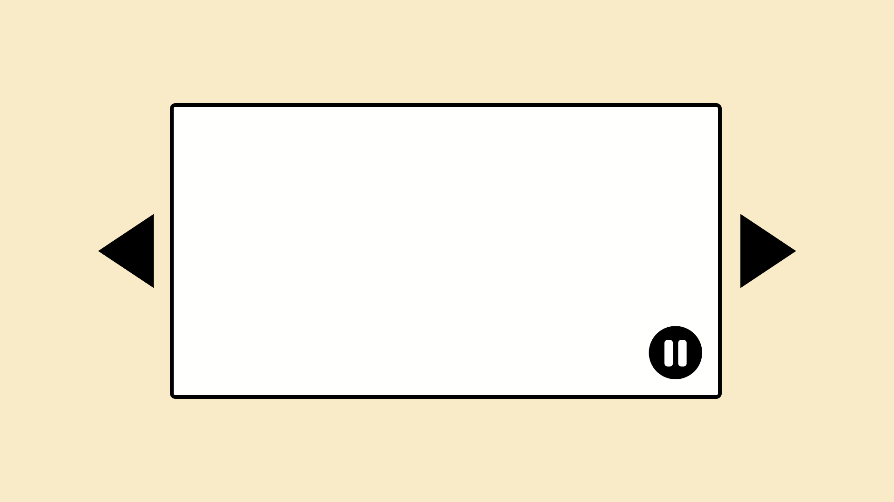
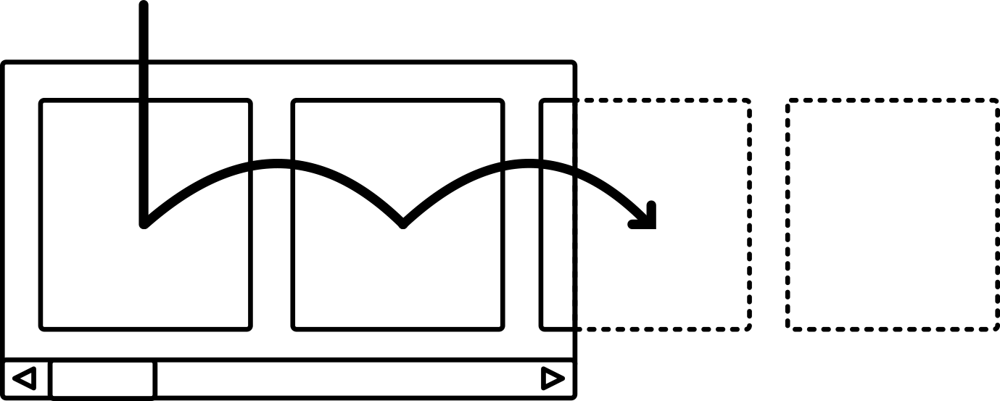
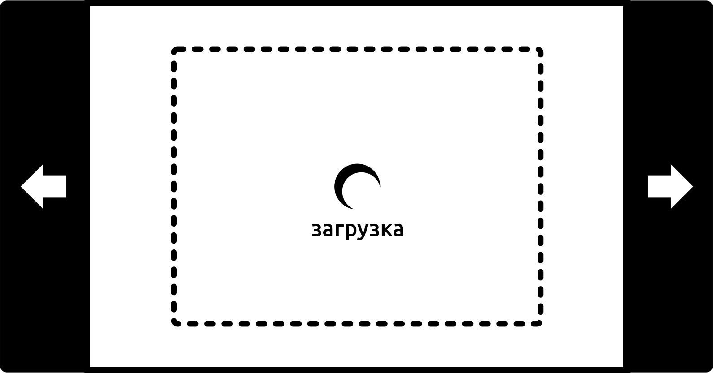

Слайдеры похожи на мужчин. _Буквально не все_ они плохие. Кто-то из них даже отзывчивый и тактичный. Однако я не доверяю тем, кто не обращает внимание на откровенно ужасный паттерн. Я, как и другие, понимаю, что многие предпочли бы просто избегать каруселей, но часто у нас нет выбора. Отсюда эта статья.

Слайдеры не так ужасны, но у нас сложилась культура делать их плохо. Обычно во всём виноваты конкретные реализации, а не концепция сама по себе. Как и со многими инклюзивными вещами, правильное решение заключается не в том, что именно вы делаете, а в том, чего не делаете в композиции компонента.

Итак, мы создадим без оглядки на предыдущие реализации то, что выполнит _основную задачу_ слайдера: позволит перемещать контент вдоль горизонтальной оси.

## Контрол

Все инклюзивные компоненты, в широком смысле, должны быть:

- очевидными и лёгкими в использовании;
- совместимыми с разными типами ввода и вывода;
- адаптивными и не зависящими от типа устройства;
- производительными;
- **управляемыми пользователем**.

В последнее время я много размышлял над последним требованием и поэтому добавил в [чеклист инклюзивного веб-дизайна](https://github.com/Heydon/inclusive-design-checklist) пункт _«Не включайте сторонние компоненты, которые нарушают конфиденциальность пользователей»_. И пользователи так же должны быть защищены от непредвиденных или нежелательных действий, как и от незаконных. Поэтому WCAG предписывает выполнять критерий [2.2.2. Пауза, остановка, скрытие](https://www.wuhcag.com/pause-stop-hide/). Он запрещает использовать нежелательную анимацию. С точки зрения карусели речь идёт о возможности прекращения с помощью кнопок паузы и остановки автоматической циклической смены слайдов.

<figure>
    
    <figcaption>
        Карусель с кнопкой паузы в правом нижнем углу.
    </figcaption>
</figure>

Так уже хорошо, но этого всё ещё недостаточно. Вы не дали настоящий [контроль над элементом](http://inclusivedesignprinciples.org/#give-control). Сначала отказали пользователю в этом, а позже всё-таки вернули такую возможность. Людям с вестибулярными нарушениями, у которых анимация может вызвать тошноту, к тому времени, когда появится кнопка паузы, уже будет нанесена травма.

Думаю, что настоящая инклюзивная карусель — это та, которая не будет двигаться без разрешения пользователя. По этой причине я предпочитаю термин «контентный слайдер» _(дальше будет использовать термин «слайдер», прим. переводчика)_. Он подразумевает, что слайдером управляет пользователь, а не скрипт. [Карусели](https://en.wikipedia.org/wiki/Carousel) же начинают и прекращают движение тогда, когда захотят.

Наш слайдер не будет скользить, кроме момента, когда слайды переключаются. Но как их, собственно, переключить?

## Мультимодальное взаимодействие

«Мультимодальность» означает _«возможность взаимодействовать разными способами»_. Поддержка разных режимов взаимодействия звучит как что-то, что требует большого количества работы, но браузеры уже мультимодальны по умолчанию. Если вы не облажались, то всем интерактивным контентом можно управлять мышью, с клавиатуры и (где это поддерживается) тачем.

Придерживаясь стандартного поведения браузера, мы без особых усилий можем обеспечить мультимодальность в нашем слайдере.

### Горизонтальная прокрутка

Самый простой представимый слайдер — это область, которая содержит контент без переносов. Она расположена вдоль горизонтальной оси, и имеется возможность горизонтальной прокрутки. `overflow-x: scroll` берёт тяжелую работу на себя.

```css
.slider {
    overflow-x: scroll;
}

.slider li {
    display: inline-block;
    white-space: nowrap;
}
```

Добавьте некоторые внешние отступы и границы, чтобы улучшить внешний вид слайдера. Это подходящий MVP _(минимально жизнеспособный продукт, прим. переводчика)_ для пользователей мыши. Они могут прокручивать, потянув за видимую полосу прокрутки либо использовать жесты на трекпаде, если курсор находится поверх слайдера. В этом случае анимация будет плавной, потому что за неё отвечает браузер, а не JavaScript-функция, которая срабатывает каждые пять миллисекунд.


Когда скроллбара не видно, то [возможные действия](https://www.interaction-design.org/literature/topics/affordances) неочевидны. Не беспокойтесь: чуть позже я с этим разберусь.

### Поддержка клавиатуры

Для пользователей мыши на большинстве платформ достаточно навести курсор на слайдер, чтобы появилась возможность его прокручивать. Пользователи мобильных устройств могут совершить этот же трюк, если просто свайпнут влево или вправо. Это не требующая особых усилий мультимодальность, которая делает веб крутым.

Те, кто пользуется клавиатурой, могут взаимодействовать со слайдером только тогда, когда на нём сделан фокус.

При нормальных обстоятельствах большинство элементов по умолчанию не получают фокус. Его могут получить только определённые интерактивные элементы, например, ссылки и контролы с тегом `<button>`. Пользователи не должны иметь возможности сделать фокус на неинтерактивных элементах. Если такое происходит, то это нарушение критерия [WCAG 2.4.3. Порядок фокуса](https://www.w3.org/TR/UNDERSTANDING-WCAG20/navigation-mechanisms-focus-order.html). Причина в том, что фокус должен предшествовать активации, и если активация невозможна, тогда зачем давать элемент в руки пользователям?

Чтобы дать пользователям возможность сделать фокус на слайдере, нам нужно добавить `tabindex="0"`. Поскольку элемент (на котором сделан фокус) будет теперь объявлен скринридерами, мы должны присвоить ему роль и добавить подпись, которые его идентифицируют. В последующих демо мы будем использовать слайдер для показа произведений искусства, поэтому подпись «Галерея» кажется подходящей.

```html
<div role="region" aria-label="Галерея" tabindex="0">
    <!-- Список изображений галереи -->
</div>
```

Роль `region` достаточно общая, но подходит для больших областей контента. Она гарантирует, что атрибут `aria-label` сработает правильно и его содержимое будет объявлено. Вы не можете просто добавить `aria-label` для любого неинтерактивного `<div>` или `<span>`.

Теперь, когда есть фокус, стало доступным стандартное поведение для элемента: мы можем его прокручивать клавишами с левой и правой стрелками. Нам нужен только стиль фокуса, чтобы показать зрячим пользователям, что слайдер интерактивен:

```css
[aria-label="gallery"]:focus {
    outline: 4px solid DodgerBlue;
    outline-offset: -6px; /* компенсируем 2px у border */
}
```

<iframe src="https://codepen.io/heydon/embed/preview/XzzaKv"></iframe>

## Возможность действия

Уже есть пара вещей, которые сообщают пользователю, что это область слайдера: стиль фокуса и тот факт, что обычно крайнее правое изображение обрезается. Предполагается, что можно увидеть больше.

Вы можете решить, что этого достаточно, в зависимости от того, насколько критично для пользователей видеть скрытый контент. Так же в этом случае сохраняется лаконичность кода. Тем не менее, мы могли бы сделать всё более очевидным. Мантра инклюзивного дизайна: _если есть сомнения, объясните это более подробно_.

Мы можем сделать это с помощью элемента с «инструкцией» после слайдера. Сообщение будет появляться в зависимости от его состояния. Например, мы могли бы показать при помощи `:hover` сообщение _«Прокрутите, чтобы увидеть больше»._ Смежный селектор + добавит стиль `:hover` к элементу `.instructions`.

```css
#hover {
    display: none;
}

[aria-label="gallery"]:hover + .instructions #hover {
    display: block;
}
```


Сообщение в состоянии `:focus` может быть реализовано примерно таким же образом. Однако для пользователей скринридеров нам нужно ещё связать это сообщение с областью слайдера. Не имеет значения представляет эта область интерес для каждого из них или нет. Это даёт больше контекста о том, _почему_ область может быть им интересна. Также пользователи лучше понимают, чего они избегают, когда им не нужен этот элемент.

Для этого можем использовать атрибут `aria-describedby`. Мы указываем его для сообщения с фокусом, используя значение `id` в качестве содержимого для ARIA-атрибута:

```html
<div role="region" aria-label="gallery" tabindex="0" aria-describedby="focus">
    <!-- Список изображений галереи -->
</div>
<div class="instructions">
    <p id="hover">Прокрутите, чтобы увидеть больше.</p>
    <p id="focus">Используйте клавиши со стрелками для того, чтобы увидеть больше.</p>
</div>
```

Теперь, когда фокус устанавливается на галерее слайдера, скринридеры объявят что-то вроде этого: _«Галерея изображений, область, используйте клавиши со стрелками для того, чтобы увидеть больше»_. Как дальше описано в примечании про мультимодальность, убедитесь, что пользователям скринридеров будет просто войти в эту область и пройти через каждое изображение в определённом порядке в «режиме просмотра» (в нём они проходят через каждый элемент). Другими словами, слайдер мультимодален даже для этой группы пользователей.

<figure>
    
    <figcaption>
        Путь пользователя скринридера в режиме просмотра во многом похож на путь пользователя клавиатуры при наличии связанных/интерактивных слайдов. В любом случае, браузер или скринридер сдвинет контейнер, чтобы показать элементы, на которые сделан фокус.
    </figcaption>
</figure>

### Hover и focus?

Иногда интересно то, что обнаруживаешь при тестировании. В моём случае я заметил, что, когда одновременно и фокусировался, _и_ наводился на слайдер, появлялись оба сообщения. Конечно же.

Я обнаружил, что в качестве улучшения могу объединить состояния (`:hover:focus`) и показать сообщение, в котором описаны обе ситуации.

```css
[aria-label="gallery"]:hover:focus +
.instructions #hover-and-focus {
    display: block;
}
```

Используя селектор следующего элемента ~, я могу добиться того, что два других сообщения скрыты, в противном случае увидел бы сразу три!

```css
[aria-label="gallery"]:hover:focus +
.instructions #hover-and-focus ~ * {
    display: none;
}
```

Попробуйте навестись на слайдер в демо, а затем кликнуть по нему:

<iframe src="https://codepen.io/heydon/embed/preview/MOoMox"></iframe>

## Обработка тача

Пока что взаимодействие со слайдером при помощи тача не проработано. В инструкции это по умолчанию не предусмотрено. Так что, когда вы начинаете свайпать слайды, некоторые устройства показывают сообщение о фокусе и ссылаются на «клавиши со стрелками», которых, скорее всего, нет.

Поддержка тача, в первую очередь, означает отслеживание того, взаимодействует ли пользователь с устройством с помощью прикосновений.

Важно то, что мы не хотим отслеживать поддержку тача на уровне устройства, так как многие поддерживают его наравне с другими способами. Мы просто хотим знать, что _пользователь коснулся_ экрана. Это возможно с помощью отслеживания одного события `touchstart`. Вот крошечный скрипт (все лучшие скрипты такие!):

```css
window.addEventListener('touchstart', function touched() {
    document.body.classList.add('touch')
    window.removeEventListener('touchstart', touched, false)
}, false);
```

Всё, что делает скрипт, — это определяет событие `touchstart`, использует его для добавления `class` к элементу `<body>` и для удаления обработчика событий. Имея `class`, мы можем показать сообщение «Свайпните, чтобы увидеть больше»:

```css
.touch .instructions p {
    display: none !important;
}

.touch .instructions #touch {
    display: block !important;
}
```

**Примечание:** `!important` здесь потому, что я упростил селекторы для удобства чтения, по ходу уменьшив их специфичность.

## Слайды

В зависимости от вашего случая и контента, вы можете просто остановиться здесь, решив, что слайдер уже довольно хорош. У нас есть что-то совместимое и мультимодальное, и для него используется примерно 100 байт JavaScript. Это преимущество создания с нуля чего-то простого, и отсутствие зависимости от универсальной библиотеки.

Но пока наш слайдер на самом деле не является «слайдами», которые обычно занимают всю ширину своего контейнера. Если мы решим эту проблему адаптивно, то люди смогут любоваться каждым произведением искусства на разных размерах экрана. Также было бы неплохо иметь возможность добавлять подписи к слайдам, поэтому с этого момента будем использовать `<figure>` и `<figcaption>`.

```html
<li>
    <figure>
        
        <figcaption>[Название произведения искусства]</figcaption>
    </figure>
</li>
```

Давайте переключимся на флексы.

```css
[aria-label="gallery"] ul {
    display: flex;
}

[aria-label="gallery"] li {
    list-style: none;
    flex: 0 0 100%;
}
```

- `display: flex` — это всё, что нам нужно для контейнера, потому что значение `flex-wrap` по умолчанию `nowrap`.
- Сокращённо значение `100%` для `flex` — это `flex-basis`. В результате этого каждый элемент занимает 100% от контейнера `<ul>`.

Также я добавил флексовый контекст и для `<figure>`, поэтому теперь могу центрировать контент как по вертикальной, так и по горизонтальной осям.

```css
[aria-label="gallery"] figure {
    display: flex;
    flex-direction: column;
    align-items: center;
    justify-content: center;
    width: 100%;
    height: 50vh;
}
```

Значение `50vh` — это единственный _как бы фиксированный_ размер, который я использую. Нужно убедиться, что слайдер имеет адекватную высоту, но вписывается во вьюпорт. Чтобы изображение и `<figcaption>` всегда помещались в контейнер, мы пропорционально масштабируем картинку, но компенсируем ожидаемую высоту `<figcaption>`. Для этого можем использовать `calc`:

```css
[aria-label="gallery"] figcaption {
    padding: 0.5rem;
    font-style: italic;
}

[aria-label="gallery"] img {
    max-width: 100%;
    max-height: calc(100% - 2rem);
    margin-top: 2rem;
}
```

<figure>
    
    <figcaption>
    </figcaption>
</figure>

С внутренним отступом `0.5rem` текст подписи становится примерно `2rem` в высоту. Это вычитается из высоты адаптивного изображения. Затем `margin-top` со значением `2rem` повторно центрирует изображение.

<iframe src="https://codepen.io/heydon/embed/preview/mqMvEY"></iframe>

## Производительность и ленивая загрузка

Одно из самых неожиданных наблюдений, отмеченных на [shouldiuseacarousel.com](http://shouldiuseacarousel.com/), состоит в том, что в каруселях со ссылками только «1% пользователей нажал на ссылку, из них 89% было на первом слайде». [Исследования показывают](https://erikrunyon.com/2013/01/carousel-interaction-stats/), что даже для автоматически вращающихся каруселей количество кликов по слайдам, расположенных после первого, резко уменьшается.

Вполне вероятно, что первое изображение в нашем слайдере — единственное, которое увидит большинство скринридеров. Поэтому нужно рассматривать его как одно единственное и загружать последующие картинки только в случае, _если_ пользователь решит на них посмотреть.

Мы можем использовать `IntersectionObserver` там, где он поддерживается, чтобы загрузить каждое изображение отдельно. Это связано с тем, что каждый слайд начинает прокручиваться, когда находится в области видимости.


Вот скрипт, примечания следуют:

```js
const slides = document.querySelectorAll('[aria-label="gallery"] li');

const observerSettings = {
    root: document.querySelector('[aria-label="gallery"]');
}

if ('IntersectionObserver' in window) {
    const callback = (slides, observer) => {
        entries.forEach(entry => {
            if (!entry.isIntersecting) {
                return;
            }
            let img = entry.target.querySelector('img');
            img.setAttribute('src', img.dataset.src);
            observer.unobserve(entry.target);
        })
    }

    const observer = new IntersectionObserver(
        callback, observerSettings
    );
    slides.forEach(t => observer.observe(t));
    } else {
        Array.prototype.forEach.call(slides, function (s) {
            let img = s.querySelector('img');
            img.setAttribute('src', img.getAttribute('data-src'));
        })
    }
```

- В `observerSettings` определяем внешний элемент галереи как корневой. Мы можем совершить действие тогда, когда элементы `<li>` становятся видимыми.
- Обнаруживаем функцию при помощи `'IntersectionObserver' in window` и просто загружаем изображения, если их нет. Извините, пользователи старых браузеров, но это лучшее, что мы можем предложить: по крайне мере вы получите контент.
- Для каждого слайда, который пересекается с другим, мы устанавливаем его `src` через атрибут `data-src`, как в случае с обычной ленивой загрузкой.

Позаботьтесь о том, чтобы пользователи не видели неработающие изображения при медленном соединении. Для этого случая добавим для них заглушку в качестве исходного значения `src`. Получим крошечный SVG с data URI:

```html
src="data:image/svg+xml,%3Csvg xmlns='http://www.w3.org/2000/svg' /%3E"
```

### Без JavaScript

В данный момент пользователи с отключенным JavaScript работают без изображений, так как переключение `data-src` на `src` невозможно. Кажется, самое простое решение — добавить теги `<noscript>`, в которых содержатся изображения с уже установленными значениями `src`.

```html
<noscript>
    
</noscript>
```

<iframe src="https://codepen.io/heydon/embed/preview/Ebwjyo"></iframe>

Теперь наш слайдер работает и без JavaScript. У нас неплохо выходит. Однако мы обрабатываем только случай «без JavaScript», который редко встречается. Это не печально распространённая ситуация со «сломанным JavaScript». Рик Шеннинк [решил эту проблему](https://twitter.com/rikschennink/status/931256220303978496), поместив `mutationObserver` в `<head>` документа. Есть [демо с этим методом](https://pqina.nl/lazy/), где Рик сначала заменяет `src` на `data-src`, и при тестировании довольно надёжно извлекает источники изображения при первой загрузке.

## Кнопки вперёд и назад

У типичных слайдеров есть кнопки по обеим сторонам, которые перемещают слайды вперёд и назад. Это соглашение, возможно, стоит принять по двум причинам:

- Наличие кнопок делает слайдер больше похожим на самого себя. Так же становится более очевидной возможность взаимодействия с ним.
- Кнопки позволяют пользователю зафиксировать слайды на месте. Больше не нужно крутить туда-сюда, чтобы отцентрировать нужный слайд.

Хитрость заключается в том, чтобы использовать уже разработанную нами функциональность, а не заменять её. Наши кнопки должны заранее знать о том, что кто-то уже прокручивает или свайпает слайды, и уметь с этим работать.

Адаптируя наш скрипт `IntersectionObserver`, мы можем добавлять и удалять класс `.visible` у слайдов:

```js
slides.forEach(entry => {
    entry.target.classList.remove('visible')
    if (!entry.isIntersecting) {
        return
    }
    let img = entry.target.querySelector('img')
    if (img.dataset.src)  {
        img.setAttribute('src', img.dataset.src)
        img.removeAttribute('data-src')
    }
    entry.target.classList.add('visible')
})
```

Это означает не только то, что мы найдём `class="visible"` у любого слайда, который виден на 100% (как первый слайд), но и в случае, когда пользователь прокрутил позицию между двумя слайдами. У них обоих будет этот класс.

<figure>
    
    <figcaption>
    </figcaption>
</figure>

Чтобы полностью переместить нужный слайд в зону видимости, когда пользователь нажимает одну из кнопок, нам нужно знать только три вещи:

1. Какой ширины контейнер.
2. Какое количество слайдов.
3. В каком направлении пользователь хочет двигаться.

Если два слайда видны частично и пользователь жмёт «Вперёд», мы определяем необходимый слайд как второй `.visible`. Затем мы изменяем значение контейнера `scrollLeft` на основе следующей формулы:

`нужный номер слайда × (ширина контейнера ÷ количество слайдов)`

Обратите внимание на размер кнопок «Вперёд» и «Назад» из демо ниже. Они оптимизированы для лёгкого взаимодействия с тачем без потерь для десктопа.

<iframe src="https://codepen.io/heydon/embed/preview/YEYqJJ"></iframe>

### Точки фиксации

Как заметил [Майкл Шарнагль](https://twitter.com/justmarkup), некоторые браузеры, включая Safari и Firefox, поддерживают простой CSS-метод фиксации слайдов при прокрутке или использовании клавиш со стрелками. Так как Safari не поддерживает `IntersectionObserver` _(уже поддерживается с [версии 12.1](https://caniuse.com/#feat=intersectionobserver), прим. переводчика)_, то это один из способов сделать удобнее пользователям этого браузера. Мешанина из проприетарных и стандартных свойств ниже: вот что сработало в нашем случае.

```css
[aria-label="gallery"] {
    -webkit-overflow-scrolling: touch;
    -webkit-scroll-snap-type: mandatory;
    -ms-scroll-snap-type: mandatory;
    scroll-snap-type: mandatory;
    -webkit-scroll-snap-points-x: repeat(100%);
    -ms-scroll-snap-points-x: repeat(100%);
    scroll-snap-points-x: repeat(100%);
}
```

Фиксация прокрутки поддерживается в [демо со связанным контентом](https://cdpn.io/heydon/debug/xPWOLp), если хотите изучить этот способ. Совет: часть с `repeat(100%)` относится к 100% ширины каждого слайда.

### Группа кнопок

Если разместить две кнопки внутри списка, то дальше они будут рассматриваться как сгруппированные ненумерованные элементы. После того, как в `<ul>` добавлена поддержка `aria-label`, мы можем добавить вспомогательную групповую подпись «Контролы галереи». Так будет легче установить цель кнопок.

```html
<ul aria-label="Контролы галереи">
    <li>
        <button id="previous" aria-label="Предыдущий">
            <svg aria-hidden="true" focusable="false"><use xlink:href="#arrow-left"></use></svg>
        </button>
    </li>
    <li>
        <button id="next" aria-label="Следующий">
            <svg aria-hidden="true" focusable="false"><use xlink:href="#arrow-right"/></svg>
        </button>
    </li>
</ul>
```

У каждой кнопки, конечно, должна быть собственная подпись, которая, в данном случае, так же задаётся при помощи `aria-label`. Когда пользователь скринридера столкнётся с первой кнопкой, он услышит что-то вроде: _«Назад, кнопка, список, контролы галереи, два пункта»_.

Мы создали контролы для браузера, который поддерживает `IntesectionObserver`. Для других браузеров, которые его не поддерживают, слайдер всё ещё рендерится и доступен для мыши, клавиатуры и тача.

```css
instructions.parentNode.insertBefore(
    controls, instructions.nextElementSibling
);
```

## Индикаторы загрузки

Следует отметить, что теперь можно нажать на кнопку для мгновенной загрузки слайда. При этом может возникнуть очевидный временной разрыв между появлением слайда в области видимости и загрузкой самого изображения.

Есть техника, которая поможет с этим разобраться: использовать для видимого плейсхолдера доминантный цвет изображения. Вы могли такое видеть на Pinterest и других подобных сайтах. Однако, это означает, что мы знаем размеры изображения, и наши картинки по своей природе адаптивны.

Чтобы раскладка не «подпрыгивала», когда изображения подгружаются (так как установлена высота `50vh`), мы можем вместо этого схитрить и отцентрировать индикатор загрузки для каждого слайда. Потом он будет скрыт загрузившейся картинкой.



## Обработка связанного контента

Порядок фокуса в нашем слайдере сейчас довольно простой: слайдер сам по себе принимает фокус (при прокрутке с помощью клавиш со стрелками), после чего можно сделать фокус на каждой кнопке по очереди.

Но что, если контент каждого слайда связан? После того, как вы сделали фокус на самом слайдере, первый слайд окажется в фокусе, затем каждый последующий слайд (не важно сколько их), наконец, в фокусе окажутся кнопки.

Помимо того, что нужно совершить много шагов, связанных с фокусом, чтобы добраться до кнопок (или вообще выйти из слайдера), у нас есть ещё одна небольшая проблема. Если пользователь прокрутит область до зоны видимости с третьим пунктом, то он будет ожидать, что это единственный элемент, который получит фокус. Вместо этого фокус будет сделан на первом пункте и слайдер вернётся в изначальное положение, показав его в области видимости.


Это не катастрофа. На самом деле пункты, получающие фокус, автоматически оказываются в области видимости без JavaScript, что служит нам хорошую службу. На невидимом контенте никогда нельзя сделать фокус.

Там, где поддерживается `IntersectionObserver` и рендерятся кнопки, при наличии в данный момент только видимого пункта в порядке фокуса, это станет хорошим вариантом улучшения. Мы можем поправить наш скрипт так, чтобы ссылки в пунктах, которые не пересекаются, принимали `tabindex="-1"`. Это сделает невозможным установление на них фокуса. Обратите внимание на строки с комментариями 1 и ниже:

```js
slides.forEach(entry => {
    entry.target.classList.remove('visible')
    let a = entry.target.querySelector('a')
    a.setAttribute('tabindex', '-1') // 1
    if (!entry.isIntersecting) {
        return
    }
    let img = entry.target.querySelector('img')
    if (img.dataset.src)  {
        img.setAttribute('src', img.dataset.src)
        img.removeAttribute('data-src')
    }
        entry.target.classList.add('visible')
        a.removeAttribute('tabindex', '-1') // 2
})
```

Просто. Теперь только один или два слайда получают фокус, в зависимости от того, сколько из них сейчас пересекаются. Так что до кнопок становится быстрее и проще добраться.

<figure>
    
    <figcaption>
        Показано два слайда с каждой стороны слайдера. Они вне области видимости. У каждого есть <code>tabindex</code> со значением минус один.
    </figcaption>
</figure>

<iframe src="https://codepen.io/heydon/embed/preview/xPWOLp"></iframe>

Весь минифицированный скрипт для этого слайдера весит примерно 1,7 Кб. Первый результат поисковой выдачи по запросу «плагин карусель» в Google весит 41,9 Кб в сжатом виде и с неправильными атрибутами WAI-ARIA. В некоторых случаях от скринридеров скрывался контент, на котором сделан фокус, при помощи `aria-hidden`. Остерегайтесь [четвёртого правила использования ARIA](https://www.w3.org/TR/using-aria/#fourth).

В этом финальном демо учтены некоторые моменты для Edge и Internet Explorer:

- Код скомпилирован в ES5;
- Баг с увеличением изображений на флексах устраняется при помощи `min-width: 1px` и `min-height: 1px` у картинок.
- Изначально `tabindex="-1"` установлен для каждой ссылки. В этом нет необходимости в других браузерах. Это учитывается в колбэке `InterSectionObserver` при первой загрузке.

Safari пока не поддерживает `IntersectionObserver` _([актуально](https://caniuse.com/#feat=intersectionobserver) для версий, ниже 12.1, — прим. переводчика)_, но есть [полифил](https://github.com/w3c/IntersectionObserver/tree/master/polyfill), который в сжатом виде весит примерно 6 Кб. Слайдер нормально работает в этом браузере, как и в других, которые не поддерживают `IntersectionObserver`.

## Заключение

Инклюзивный дизайн не только про то, как сделать интерфейс одинаковым для всех. Он также о том, как предоставить как сделать интерфейс удобным как можно большему числу людей. У нашего слайдера не самая модная реализация, но он всё ещё достаточно хорош. Это контент должен поражать людей, а не сам интерфейс: эпохальные дадаистские фотомонтажи Ханны Хёх не должны задвигаться на второй план. Убедитесь, что слайдер адаптивный, мало весит, надёжный и совместимый. Тогда у художницы будет большая аудитория, которую она заслуживает.

Я предложил в своём докладе [«Пишите меньше чёртового кода»](https://vimeo.com/190834530) концепцию _непрогрессивного неулучшения_ (unprogressive non-enhancement). Идея заключается в том, что поток контента, на основе которого мы строим вкладки, карусели и тому подобное, часто не следует перестраивать. Отсутствие улучшения может быть лучше «улучшения». Однако при разумном и бережном расширении представления контента, как, например, в слайдерах, это может быть довольно привлекательным способом получения информации. Лучше всего найти хорошую и исследованную причину для такого исключения.

## Чек-лист

- Используйте списки для объединения слайдов в группу. Тогда пользователи скринридеров в «режиме просмотра» смогут пользоваться шорткатами для перемещения по ним.
- Предусмотрите адекватную работу слайдера в HTML благодаря CSS, а после — проверяйте поддержку в процессе улучшения с помощью JavaScript.
- Не загружайте заранее контент, который пользователи вряд ли увидят. Отложите загрузку, пока они не выполнят какое-то действие.
- Увеличьте область клика для пользователей мобильных устройств или устройств с маленькими экранами.
- В случае, если есть сомнения насчёт возможности взаимодействия с контролом или виджетом, расскажите об этом в инструкции к ним.
- Если вы мужчина и не обиделись, прочитав первый параграф, поздравляю! Вы не относитесь к мужчинам и женщинам как к конкурирующим командам.
