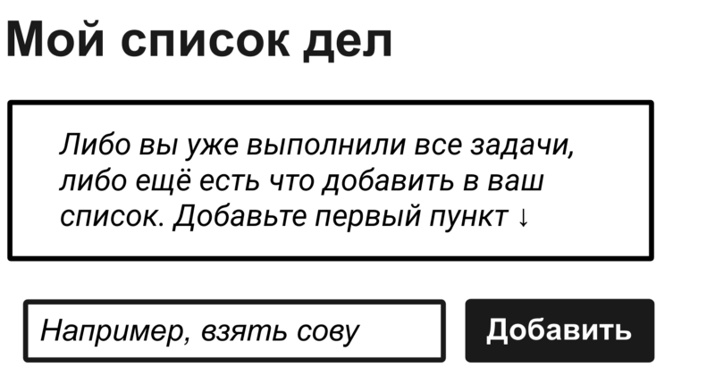
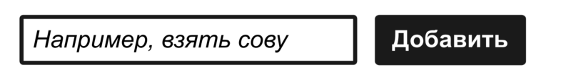
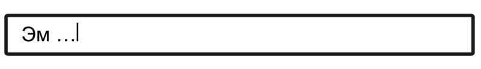
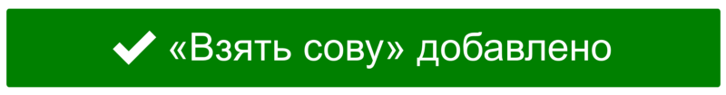
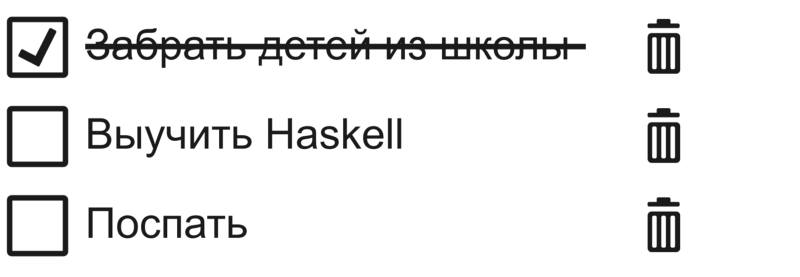
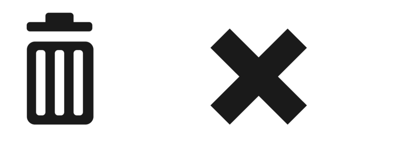
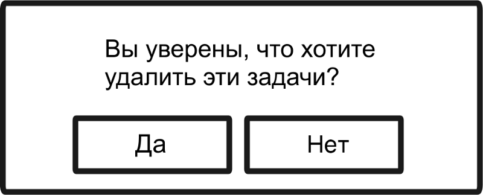
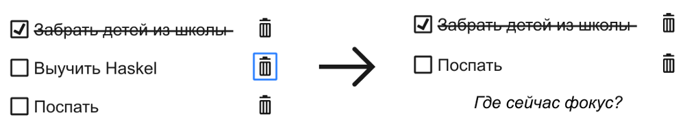

Следуя традициям, каждый новый JS-фреймворк проходит через несколько этапов создания простого приложения со списком дел — приложения для добавления и удаления позиций из списка. Первый пример, написанный на Angular.js, который я видел, был как раз таким списком. Добавление и удаление пунктов демонстрировало высокую скорость работы одностраничного приложения, реализованного на основе шаблона ViewModel.

Инструмент [TodoMVC](http://todomvc.com/) сравнивает и находит различия в разных реализациях приложений со списком дел в популярных MV*-фреймворках вроде Vue.js, Angular.js и Ember.js. Он помогает разработчику, который ищет технологию для нового проекта, принять правильное решение.

Инклюзивный дизайн интерфейса такого списка, однако, отличается от его реализации во фреймворках. Вашего пользователя не волнует, написан он на Backbone или React. Ему просто нужен конечный продукт, который будет доступен и прост в использовании. К сожалению, реализации списков дел в [TodoMVC](http://todomvc.com/) имеют недостатки. В частности, доступ к функции удаления появляется только при наведении курсора на пункт списка, что делает её полностью недоступной для клавиатуры.

В этой статье я буду создавать список дел с нуля. Но то, что вы узнаете, можно использовать _не только_ для подобных списков. На самом деле мы разберёмся, как сделать создание и удаление контента инклюзивным.

В отличие от простого переключателя из [предыдущей статьи](https://medium.com/web-standards/toggle-buttons-a41388e80974), списки состоят из нескольких частей. Вот что мы собираемся сделать:

## Заголовок

Лейблы — одна из важных составляющих юзабилити. Элемент `<label>` добавляет подписи к полям форм. Но простые текстовые фрагменты у кнопок и ссылок — это тоже лейблы. Они сообщают, что делают эти элементы, когда вы нажимаете на них.

Заголовки — тоже лейблы, которые задают имена для разделов (регионов, участков, блоков), из которых состоит интерфейс. Не зависимо от того, создаёте ли вы статичный документ, такой как пост в блоге, или интерактивное одностраничное приложение, каждый крупный раздел контента этой страницы должен начинаться с заголовка. Наше название списка в этом примере — «Мой список дел». Он должен быть размечен соответственно.

    <h1>Мой список дел</h1>

Это очень _прямолинейный_ способ разделения интерфейса, но очевидность — это хорошо. Мы не хотим, чтобы нашим пользователям приходилось проводить целое расследование, чтобы понять, с чем они имеют дело.

### Уровень заголовка

Выбор правильного уровня заголовков часто связан с вопросом важности, но, на самом деле, это вопрос _принадлежности_. Если список дел является единственным содержимым `<main>`, то для него стоит задать заголовок первого уровня, как в предыдущем примере. Его не окружают другие элементы, поэтому он на высшем уровне с точки зрения глубины.

В случае, если список задач — дополнительный контент, то он должен иметь уровень, который это отражает. Например, если это страница о планах на отпуск, то список «Вещи, которые нужно собрать» может быть вспомогательным инструментом.

- Планы на моё путешествие (`<h1>`)
    - Места, где можно выпить (`<h2>`)
        - Бары (`<h3>`)
        - Клубы (`<h3>`)
    - Вещи, которые нужно собрать (список дел) (`<h2>`)

В примере выше и «Бары», и «Клубы» входят в пункт «Места, где можно выпить». Он, в свою очередь, является подпунктом «Планы на моё путешествие». Это третий уровень принадлежности, следовательно, для них заданы заголовки `<h3>`.

Даже если вам кажется, что список задач про сбор вещей менее важен, чем определение того, какие бары лучше посетить, он всё ещё находится на том же уровне с точки зрения принадлежности. Так что у него должен быть тот же уровень заголовка.

Страница, структура которой образована логически вложенными разделами, имеет хорошую визуальную иерархию и помогает пользователям скринридеров составить чёткое представление о ней. Также они используют заголовки в качестве инструментов навигации. Например, в JAWS клавиша <kbd>2</kbd> переместит вас к следующему разделу, который начинается с заголовка `<h2>`. Клавиша <kbd>H</kbd> перемещает к следующему заголовку любого уровня.

### Примечание: элемент `<section>`

После всего этого разговора о секциях, мы должны использовать элементы `<section>`, верно? Может быть. Вот о чём нужно подумать:

1. Элементы заголовков уже описывают секции. То есть контент, который начинается с заголовка и заканчивается непосредственно перед заголовком того же уровня, _де-факто_ является секцией.
2. Если вы используете элемент `<section>`, то для него всё ещё требуется задать заголовок, в противном случае это секция без описания.

На практике значение, которое задаётся элементам `<section>`, ограничено, но всё же стоит отметить:

1. Некоторые скринридеры будут объявлять начало и конец секции, когда пользователи перемещаются по странице от элемента к элементу.
2. Некоторые скринридеры поддерживают навигацию по регионам. Например, в JAWS элементы `<section>` помечены как «regions» и между ними можно перемещаться с помощью клавиши <kbd>R</kbd> или сочетания <kbd>Shift R</kbd>.
3. Эти теги могут улучшить организацию кода и сделать его более понятным. Они будут контейнером для секций страницы.

Чтобы максимально эффективно использовать `<section>`, вы должны подписать их. То есть, связать их заголовки с элементами `<section>`, используя `aria-labelledby`:

    <section aria-labelledby="todos-label">
        <h1 id="todos-label">Мой список дел</h1>
        <!-- Контент -->
    </section>

Заметьте, что значение `aria-labelledby` должно полностью соответствовать значению `id` у заголовка.

Фактически это добавляет групповую подпись к разделу. Подпись будет объявлена некоторыми скринридерами при фокусе на разделе. Если запустить NVDA, то, когда я окажусь в разделе и сделаю фокус на первом чекбоксе, то услышу: _«Регион мой список дел, список из трёх пунктов, забрать детей из школы, выбран»_. Полезно давать такую информацию о контексте пользователям, которые перемещаются с помощью фокуса, а не по регионам или заголовкам.

## Список

Я рассказал о достоинствах списков в книге [«Inclusive Design Patterns»](https://shop.smashingmagazine.com/products/inclusive-design-patterns). Вместе с заголовками, списки помогают придавать страницам структуру. Без заголовков или списков страницы пустые и однообразные. Это делает их сложными как для визуального восприятия, так и для любого другого.

Не всем спискам нужны маркеры, за отображение которых отвечает свойство `list-style`. Однако у них должны быть видимые признаки того, что их пункты похожи, эквивалентны, а также связаны друг с другом. На уровне разметки использование контейнера с `<ul>` или `<ol>` означает, что список будет определён, когда его обнаружит скринридер, а число пунктов в нём будет сосчитано. Скринридер сообщит о нашем списке из трёх пунктов как-то так: _«Список из трёх пунктов»_.

Список дел, как следует из названия — это список. В этом случае подходит неупорядоченный список, так как он не содержит никаких сведений о приоритетности пунктов. Вот разметка нашего списка задач (добавления, удаления и выбора чекбоксов пока нет):

    <section aria-labelledby="todos-label">
        <h1 id="todos-label">Мой список дел</h1>
        <ul>
            <li>Забрать детей из школы</li>
            <li>Выучить Haskell</li>
            <li>Поспать</li>
        </ul>
    </section>

### Пустое состояние

Пустые состояния — это один из аспектов UI-дизайна, который [можно игнорировать, но на свой страх и риск](https://techcrunch.com/2015/11/22/the-most-overlooked-aspect-of-ux-design-could-be-the-most-important/). Инклюзивный дизайн должен учитывать особенности стиля жизни пользователей. Новые пользователи — это одна из наиболее уязвимых групп. Им не знаком ваш интерфейс — если не вести таких пользователей осторожно за руку, эта неизвестность может их оттолкнуть.

Благодаря нашему заголовку и кнопке _«Добавить»_ некоторым пользователям может быть сразу понятно, что нужно делать, даже без примеров или инструкций. Но интерфейс может быть менее знакомым и более сложным, чем этот простой список дел, поэтому давайте всё равно добавим пустое состояние — для тренировки.

### Отображение пустого состояния

Конечно, можно использовать наши данные, чтобы определить, должно ли быть показано пустое состояние. Во Vue.js мы можем использовать `v-if`:

    

        

            Либо вы уже выполнили все задачи, либо ещё есть что
            добавить в ваш список. Добавьте первый пункт &#x2193;
        

    

Но вся необходимая нам информация о состоянии уже находится в DOM. Поэтому всё, что нам нужно сделать для переключения между списком и пустым состоянием, можно сделать через CSS.

    .empty-state,
    ul:empty {
        display: none;
    }

    ul:empty + .empty-state {
        display: block;
    }

Это целесообразнее, поскольку нам не нужно запрашивать данные или изменять разметку. Также это доступно для скринридеров. `display: none` означает, что элемент будет скрыт как визуально, так и от скринридеров.

Все псевдоклассы относятся к неявным состояниям. Псевдокласс `:empty` означает, что у элемента пустое состояние. `:checked` значит, что элемент отмечен. `:first-child` означает, что он находится в начале набора. Чем больше вы их используете, тем меньше потребуется манипулировать DOM через JavaScript для добавления и изменения состояния.

## Добавление задачи

До этого мы не обсуждали добавление задач, так что давайте сделаем это сейчас. Под списком (или пустым состоянием, если в нём ничего нет) расположены текстовое поле и кнопка «Добавить»:

### Форма или нет?

В HTML допустимо использовать `<input>` вне `<form>`. Без помощи JavaScript нельзя успешно передать из `<input>` данные на сервер, но это не проблема для приложений, использующих XHR _(`XMLHttpRequest`, прим. переводчика)_.

Но могут ли элементы с `<form>` дать что-то пользователям? Когда пользователи скринридеров JAWS или NVDA столкнутся с `<form>`, то автоматически включится специальный режим взаимодействия, который называют «режим форм» или «режим приложения». В этом режиме некоторые клавиши, которые могли бы использоваться в специальных сочетаниях, отключаются. Это позволяет пользователям скринридеров взаимодействовать с полями формы в полном объёме.

К счастью, многие типы полей, включая `type="text"`, активируют режим форм самостоятельно при фокусе. Например, если я должен ввести «h» в какое-то поле, то «h» ввелась бы в него, а не переместила меня к ближайшему заголовку.

Настоящая причина, по которой нам необходим тег `<form>` заключается в том, что мы хотим дать пользователям возможность отправлять данные при нажатии на клавишу <kbd>Enter</kbd>. Это надёжно работает только тогда, когда кнопка расположена внутри `<form>`. Этот тег нужен не только для организации кода или семантики, но влияет и на поведение браузера.

    <form>
        <input type="text" placeholder="Например, взять сову">
        <button type="submit">Добавить</button>
    </form>

_**Примечание:** [Леони Уотсон](https://twitter.com/LeonieWatson) сообщает, что `<input>` с типом `range` не работают в связке Firefox + JAWS, когда они не вложены в `<form>` или режим форм не включён пользователем вручную._

### Добавление подписи

Можете ли вы найти ошибку во фрагменте кода, которую я допустил специально? Ответ: я не добавил подпись. В коде есть только атрибуты `placeholder`, а они нужны для предоставления дополнительной информации. В данном случае это предложение «взять сову».

Плейсхолдеры не очень хорошо подходят для скринридеров в качестве подписей, так что здесь нужен другой подход. Вопрос в том, должна ли эта подпись быть видимой или её стоит сделать доступной только для скринридеров.

_Почти_ во всех случаях видимая подпись должна располагаться над полем или слева от него. Это связано с тем, что плейсхолдер исчезает при фокусе и может быть заменён текстом автозаполнения. Это означает, что зрячие пользователи потеряют подписи. Заполнение поля информацией или исправление текста автозаполнения превратятся в гадание на кофейной гуще.

Однако, наш случай особый, потому что подписи «Добавить» для кнопки, расположенной рядом, вполне достаточно. Те, кто смотрит на форму, знают, для чего нужно поле благодаря одной кнопке.

_**У всех полей должны быть подписи**, потому что пользователи скринридеров не могут заглянуть вперёд и увидеть, даёт ли кнопка отправки, до которой они ещё не дошли, подсказки о целях формы. В связке простые поле-кнопка, как в этом случае, и регионы поиска не нуждаются в _видимой_ подписи. Это работает тогда, когда текст кнопки достаточно информативный.

_Кроме того, убедитесь, что у форм с несколькими полями есть видимые подписи для каждого из них. Без этого пользователи не будут знать какое поле за что отвечает._

Есть несколько способов добавить невидимую подпись к полю для пользователей скринридеров. Один из самых простых и более лаконичных — `aria-label`. В примере ниже «Добавить новую задачу» — это значение. Оно более наглядно, чем просто «Добавить», и помогает отличить его от текста кнопки без путаницы при переключении между двумя элементами.

    <form>
        <input type="text"
               aria-label="Добавить новую задачу"
               placeholder="Например, взять сову">
        <button type="submit">Добавить</button>
    </form>

### Примечание: стилизация плейсхолдера

Обратите внимание на то, что в некоторых браузерах серый текст плейсхолдера очень бледный и не соответствует минимальным требованиям контраста [WCAG 1.4.3 Contrast (Minimum)](https://www.w3.org/TR/WCAG20/#visual-audio-contrast).

Я рекомендую делать текст плейсхолдеров с кроссбраузерной поддержкой более контрастным. Также стоит использовать дополнительные стили, например, курсив как в примере ниже, чтобы отличать текст плейсхолдера от введённого пользователем текста.

    ::-webkit-input-placeholder {
        color: #444;
        font-style: italic;
    }

    ::-moz-placeholder {
        color: #444;
        font-style: italic;
    }

    :-ms-input-placeholder {
        color: #444;
        font-style: italic;
    }

    :-moz-placeholder {
        color: #444;
        font-style: italic;
    }

К сожалению, для этого нужны отдельные блоки правил, так как у каждого браузера есть проблемы с парсингом таких селекторов для других браузерах.

## Представление поведения

Одно из преимуществ использования `<form>` с кнопкой типа `submit` заключается в том, что пользователи могут отправить данные, нажав на кнопку напрямую или с помощью клавиши <kbd>Enter</kbd>. Даже пользователи, которые не всегда используют клавиатуру для управления интерфейсом, могут нажать на <kbd>Enter</kbd>, потому что это быстрее. То, что делает взаимодействие возможным для некоторых, делает его лучше для других. Это инклюзивно.

Если пользователь пытается отправить неверные данные, то нам нужно остановить его. Отключив кнопку пока поле заполнено неправильно, отправка по клику или нажатию на <kbd>Enter</kbd> будет запрещена. На самом деле на кнопке с `type="submit"` в этом случае нельзя сделать фокус с клавиатуры. Также мы добавляем к полю `aria-invalid="true"`. Скринридеры объявят пользователям, что поле заполнено неправильно и нужно изменить введённые данные.

    <form>
        <input type="text" aria-invalid="true"
               aria-label="Создать новую задачу"
               placeholder="Например, взять сову">
        <button type="submit" disabled>Добавить</button>
    </form>

## Обратная связь

Суть взаимодействия человека с компьютером состоит в том, что когда одна сторона что-то делает, то другая должна откликнуться в ответ. Это просто вежливо. Для большинства пользователей ответ компьютера при добавлении элемента не очевиден: они просто видят новый элемент, который появился на странице. Если есть возможность _анимировать_ появление нового элемента, то лучше это сделать. Какое-то движение на странице при его возникновении с большей вероятностью заметят.

В этом случае для незрячих пользователей или тех, кто не пользуется обычным интерфейсом, ничего не происходит. У них по-прежнему установлен фокус на поле, которое не содержит ничего нового, о чём может объявить скринридер. Тишина.

Перемещая фокус на другую часть страницы, скажем, на новый пункт списка, этот элемент будет объявлен. Но мы не хотим перемещать фокус на другой элемент. Может пользователям нужно добавить больше задач. Вместо этого мы можем использовать интерактивную область (live region).

### Обратная связь с интерактивной областью

Интерактивные области — это элементы, о содержимом которых скринридеры сообщат _при каждом его изменении_. С интерактивной областью мы можем сделать так, чтобы скринридеры общались с пользователями, не заставляя их выполнять какие-либо действия (например, перемещать фокус).

Простые интерактивные области обозначаются с помощью атрибута `role="status"` или эквивалентного ему `live="polite"`. Для максимальной совместимости с разными скринридерами стоит использовать оба атрибута. Это может показаться излишним, но благодаря этому у вас будет больше пользователей.

    

        <!-- Добавьте контент, чтобы его услышать -->
    

Что касается события отправки формы, я могу просто добавить обратную связь в интерактивную область, о чём объявит скринридер.

    var todoName = document.querySelector('[type="text"]').value;

    function addedFeedback(todoName) {
        let liveRegion = document.querySelector('[role="status"]');
        liveRegion.textContent = `${todoName} added.`;
    }

    // Пример использования
    addedFeedback(todoName);

Самый простой способ сделать ваше веб-приложение более доступным — разместить сообщения о состоянии в интерактивной области. Тогда, когда оно обновится визуально, это также будут объявлено скринридерами.

_Это общепринятый цвет для сообщения о состоянии. Например, сообщение об успешности действия зелёное. Но важно полагаться не только на цвет, чтобы не исключить дальтоников. Поэтому в примере есть дополнительная галочка._

Инклюзивность заключается в том, чтобы у всех пользователей был **равноценный опыт**, не обязательно одинаковый. Иногда то, что работает для одного пользователя, бессмысленно, избыточно или мешает другому.

В этом случае сообщение о состоянии не нужно делать видимым, так как пункт виден при добавлении. На самом деле одновременное добавление пункта в список и показ сообщения о состоянии могут отвлечь внимание пользователей. Другими словами, видимое добавление элемента и объявление «[имя элемента] добавлено» уже эквивалентны.

Так что мы можем скрыть такое сообщение с помощью класса `vh`.

    

        <!-- Добавьте контент, чтобы его услышать -->
    

Этот служебный класс использует магию и определяет, скрыты ли элементы. При этом они обнаруживаются и объявляются скринридерами. Вот как это выглядит:

    .vh {
        position: absolute !important;
        clip: rect(1px, 1px, 1px, 1px);
        padding: 0 !important;
        border: 0 !important;
        height: 1px !important;
        width: 1px !important;
        overflow: hidden;
    }

## Отчекиваем задачи

В отличие от переключателя из [предыдущей статьи](https://medium.com/web-standards/toggle-buttons-a41388e80974), в этот раз чекбокс, с точки зрения семантики, правильный способ что-то активировать и наоборот. Вам не нужно _включать_ или _отключать_ задачи, нужно их _отметить_.

К счастью, чекбоксы позволяют легко это сделать прямо из коробки. Нам просто нужно помнить, что `<label>` нужен для каждого `<input>`. При переборе данных мы можем записать уникальные значения для каждой пары `for`-`id`, используя для связки текущий индекс и интерполяцию строк. Вот как это можно сделать с помощью Vue.js:

    <ul>
        <li v-for="(todo, index) in todos">
            <input type="checkbox"
                   :id="`todo-${index}`" v-model="todo.done">
            <label :for="`todo-${index}`">{{todo.name}}</label>
        </li>
    </ul>

_**Примечание**: в этом примере каждый пункт списка имеет значение `done`, следовательно, `v-model="todo.done"` автоматически отмечает чекбокс, когда он определяется как `true`._

### Стиль для зачёркивания

Создание надёжных и доступных компонентов просто, когда вы используете семантические элементы по назначению. В моём варианте я просто добавил незначительное улучшение — свойство `line-through` для выбранных пунктов. Оно применяется к `<label>` с помощью `:checked` при использовании смежного селектора.

    :checked + label {
        text-decoration: line-through;
    }

Ещё раз, я использую неявное состояние, чтобы повлиять на стиль. Не нужно добавлять и убирать `class="crossed-out"` или делать что-то подобное.

_**Примечание**: если вы хотите стилизовать чекбоксы сами, то посмотрите [WTF Forms](http://wtfforms.com/). Там есть советы о том, как это сделать без кастомных элементов. В конце этой статьи вы найдёте [демо](https://codepen.io/heydon/pen/VpVNKW), в котором я использую класс `.tick` для ``, чтобы сделать что-то похожее._

## Удаление задач

Отчекивание и удаление задач — это разные действия. Иногда вам нужно видеть, какие из них вы сделали, иногда вы добавляете не тот пункт в список или он вообще становится ненужным.

Удаление задачи можно осуществить с помощью простой кнопки. Для этого не требуется какой-то информации о состоянии: подпись описывает всё, что нам нужно знать. Конечно, если кнопка содержит иконку или глиф вместо текста, то нужно использовать дополнительную подпись.

    <button aria-label="Удалить">
        &times;
    </button>

На самом деле, давайте будем более конкретными и включим имя элемента с текстом задачи. Всегда лучше добавлять подписи, которые имеют смысл при отдельном рассмотрении элементов. Эта уникальная подпись поможет отличить его от других. В вашем JS-фреймворке должны быть шаблонные решения для этого. В моём случае во Vue.js это выглядит так:

    <button :aria-label="`Удалить ${todo.name}`">
        &times;
    </button>

В этом примере специальный символ `&times;` используется для добавления символа с крестиком. Если бы не `aria-label`, которая переопределяет значение, подпись была бы объявлена как «умножить».

Всегда следите за тем, как скринридеры интерпретируют специальные символы и символы Юникода. А в примере ниже символ будет объявлен как «стрелка вниз» или что-то вроде этого. Так как в нашем случае текстовое поле всегда находится под списком как визуально, так и в HTML-коде, стрелка приводит пользователя к нему.

Здесь значок с мусорной корзиной добавлен с помощью SVG. Это отличный формат графики, потому что он масштабируется без потери качества. Многим пользователям часто нужно изменять масштаб интерфейсов, в том числе тем, у кого близорукость, проблемы с двигательным аппаратом и кому нужна большая область касания или клика.

    <button aria-label="удалить">
        <svg>
            <use xlink:href="#bin-icon"></use>
        </svg>
    </button>

Чтобы уменьшить количество кода при повторном использовании одного и того же SVG, мы используем элемент `<use>`. Он ссылается на экземпляр SVG, определённой как `<symbol>` в body:

    <body>
        <svg style="display: none">
            <symbol id="bin-icon" viewBox="0 0 20 20">
                <path d="[здесь координаты]">
            </symbol>
        </svg>
    </body>

Раздутый DOM может ухудшить взаимодействие с интерфейсом для многих пользователей, так как действия займут больше времени. Пользователи вспомогательных технологий, в частности, могут столкнуться с тем, что их программное обеспечение не отвечает.

### Примечание: инклюзивные иконки

Повышение [удобства использования интерфейсов благодаря иконкам — спорный вопрос](http://uxmyths.com/post/715009009/myth-icons-enhance-usability). Конечно, в сочетании с текстом, они могут помочь лучше что-то понять. Особенно это касается тех пользователей, у которых низкий уровень грамотности или тех, кто знакомится с интерфейсом на другом языке. Однако любые иконки без дополнительного текста могут быть неправильно интерпретированы.

Иконка с мусорной корзиной на самом деле нужна для _удаления_? Могу я сделать иконку получше, которая будет выглядеть больше похожей на мусорное ведро? Я могу попытаться сделать что-то другое, например, использовать иконку с крестиком (как это сделано в реализациях на TodoMVC), но не выглядит ли она больше похожей на иконку для _завершения_ действия? Тут нет простых ответов, поэтому лучшее, что вы можете сделать — тестировать это на реальных пользователях.

К счастью, случайное удаление пункта списка не такая критичная ошибка. Пользователи могут без проблем понять, что означает иконка методом проб и ошибок. Там, где удаление _критично_, поможет диалоговое окно подтверждения, которое всё объясняет и при этом в нём можно завершить действие.

### Управление фокусом

Когда пользователь кликает по кнопке удаления пункта списка, задача, включая чекбокс, подпись и **сама кнопка**, будут удалены из DOM. Это приводит к возникновению интересной проблемы: что произойдёт с фокусом, когда вы удаляете элемент, на котором сейчас сделан фокус?

Если вы не будете соблюдать осторожность, то решение этой проблемы будет _сильно раздражать_ пользователей клавиатуры, в том числе пользователей скринридеров.

На самом деле браузеры не знают, где сделать фокус, когда он был удалён таким образом. Некоторые добавляют «призрачный» фокус там, где раньше был удалённый элемент, а другие делают фокус на следующем элементе. Некоторые по умолчанию делают фокус на внешнем документе. Это означает, что пользователям клавиатуры придётся снова проходить через весь DOM, чтобы попасть обратно в место удалённого элемента.

Для того, чтобы взаимодействие разных пользователей с интерфейсом было консистентным, мы должны всё тщательно обдумать и использовать `focus()` для соответствующего элемента, но какого именно?

Один из вариантов — сделать фокус на первом чекбоксе списка. При этом будут объявлены не только его имя и состояние, но и общее количество оставшихся элементов списка. Их количество будет на один пункт меньше, чем раньше. Это всё полезный контекст.

    document.querySelector('ul input').focus();

Примечание: `querySelector` возвращает _первый_ элемент, соответствующий селектору. В нашем случае это первый чекбокс в списке задач.

Но что, если мы просто удалили последний пункт нашего списка и вернулись к пустому состоянию? Здесь нет чекбокса, на котором можно сделать фокус. Давайте попробуем что-нибудь другое. Вместо всего этого я хочу сделать две вещи:

1. Сделать фокус на заголовке области «Мой список дел».
2. Использовать уже добавленную интерактивную область для обратной связи.

Вы никогда не должны делать неинтерактивные элементы вроде заголовков фокусируемыми, потому что в этом случае предполагается, что они должны что-то _делать_. Когда я тестирую интерфейс и в нём есть подобные элементы, то я не смогу привести его в соответствие с требованием [WCAG 2.4.3 Focus Order](https://www.w3.org/TR/WCAG20/#navigation-mechanisms).

Однако иногда вам нужно привести пользователя к определённой части страницы с помощью скрипта. Чтобы переместить пользователя к заголовку и объявить его, нужно сделать две вещи:

1. Добавить к заголовку атрибут `tabindex="-1"`.
2. Сделать фокус при помощи метода `focus()`.

    <h1 tabindex="-1">Мой список дел</h1>

Значение `-1` выполняет сразу несколько задач: оно делает элементы не сфокусированными для пользователей (включая те элементы, на которых можно сделать фокус). При этом оно позволяет устанавливать фокус на элементах с помощью JavaScript. Таким образом мы можем переместить пользователя к неинтерактивному элементу и не сделать его «остановкой табуляции» (элементом, к которому можно перемещаться с помощью <kbd>Tab</kbd>).

Кроме того, при установлении фокуса на заголовке будут объявлены его текст, роль, уровень и информация о контексте, такая как «region» (некоторыми скринридерами). По крайней мере, вы должны услышать: _«Мой список дел, заголовок второго уровня»_. Поскольку он в фокусе, нажатие на клавишу <kbd>Tab</kbd> вернёт пользователя обратно в список к первому чекбоксу. По сути, мы сообщаем: _«Теперь, когда вы удалили этот элемент из списка, вот снова весь список»_.

Обычно я не добавляю стили фокуса для элементов, на которых можно сфокусироваться таким образом. В этом случае я использую этот метод из-за того, что целевой элемент не является интерактивным и не должен таким быть.

    [tabindex="-1"] { outline: none }

После того, как элемент с фокусом был удалён (и вместе с ним его стиль фокуса), фокус перемещается на заголовок. Пользователь клавиатуры может затем нажать на <kbd>Tab</kbd>, чтобы найти первый чекбокс или, если не осталось элементов, перейти к текстовому полю в нижней части этого компонента.

### Обратная связь

Возможно, мы дали достаточно информации пользователю и он в идеальном положении для продолжения взаимодействия с интерфейсом. Но всегда лучше быть максимально точным. Поскольку у нас уже есть интерактивная область, почему бы не использовать её для сообщения о том, элемент был успешно удалён?

    function deletedFeedback(todoName) {
        let liveRegion = document.querySelector('[role="status"]');
        liveRegion.textContent = `${todoName} удалено.`;
    }

    // Пример использования
    deletedFeedback(todoName);

Я понимаю, что вы, вероятно, не написали бы это на ванильном JavaScript. Это просто примерный вариант того, как это будет работать.

Сейчас, потому что мы используем `role="status"` (`aria-live="polite"`), со скринридерами происходит кое-что интересное. Сначала объявляется _«Мой список дел, заголовок второго уровня»_, а потом _«[название задачи] удалено»_.

Это происходит из-за того, что при значении `polite` интерактивные области ждут, пока пользователь не остановится, прежде чем сделать объявление. Если бы я использовал `role="alert"` (`aria-live="assertive"`), то сообщение о состоянии полностью или частично переопределило бы объявление заголовка с фокусом. В нашем случае пользователь знает и где он находится, и что его действие оказалось успешным.

## Рабочее демо

Я создал [страницу на СodePen](https://codepen.io/heydon/pen/VpVNKW/), чтобы наглядно продемонстрировать технику из этой статьи. В демке используется Vue.js, но это можно реализовать с помощью любого JS-фреймворка. Её можно протестировать в разных браузерах и скринридерах.

<iframe src="https://codepen.io/heydon/pen/VpVNKW/"></iframe>

## Заключение

При создании инклюзивного компонента со списком дел нужно учесть довольно много моментов: семантическую структуру, добавление подписей, иконки, работу с фокусом и обратную связь. Если это делает инклюзивный дизайн сложным для вас, то учтите следующее:

1. Это новая информация. Не волнуйтесь, скоро это войдёт в привычку.
2. Всё, что вы узнали здесь, можно применить ко многим компонентам и его контенту.
3. Вам нужно только один раз создать такой компонент. Тогда он будет длительное время находиться в вашей библиотеке компонентов и его можно постоянно использовать.

## Чеклист

- Задайте для каждого крупного компонента, такого как список, понятный заголовок.
- Добавляйте подписи к полям «только для скринридеров» только тогда, когда есть видимые подписи. Плейсхолдеры не в счёт.
- Когда вы исключаете элемент с фокусом из DOM, сделайте фокус на соответствующем соседнем элементе с помощью метода `focus()`.
- Внимательно отнеситесь к описаниям в пустых состояниях. Они знакомят новых пользователей с вашим интерфейсом.
