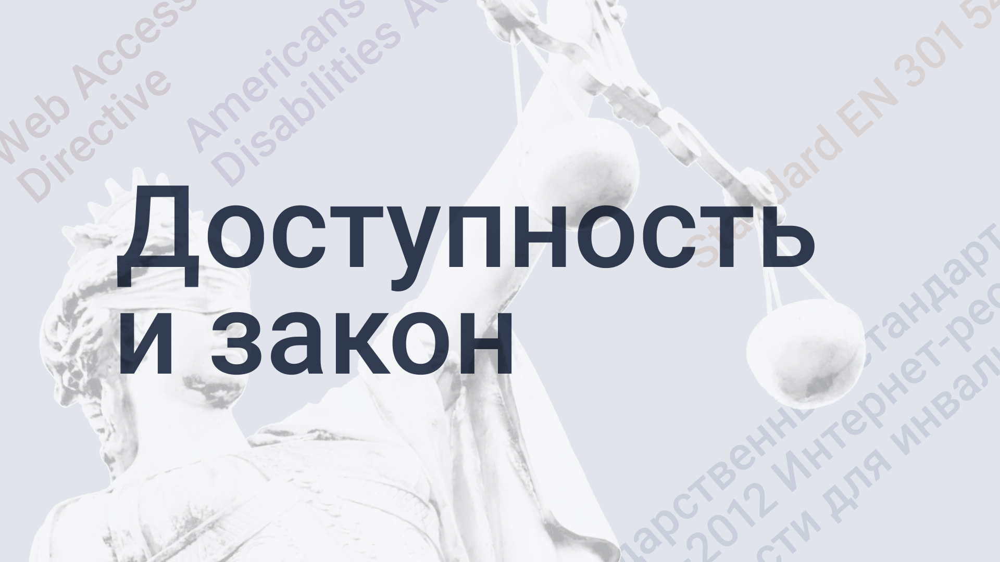

## Разбираем законы и стандарты по веб-доступности

Часто встречаю комментарии о том, что доступность не нужна. «Зачем мне думать о слепых пользователях, их же мало!». «Зачем людям с инвалидностью интернет?». «А что мне за это будет? В чём выгода?». Тысячи их.

У меня есть пара контраргументов. Во-первых, [мировая статистика](http://www.who.int/news-room/fact-sheets/detail/disability-and-health) говорит, то в мире живёт более 1 миллиарда людей с инвалидностью. Это примерно 15% от всего населения планеты. И их число с каждым годом увеличивается.

Во-вторых, не стоит решать за других каким сервисом они должны пользоваться, а каким нет. Кто-нибудь так же может решить за вас.

В-третьих, здоровье не вечно. Люди болеют и _иногда_ даже стареют. Если вы не [бессмертная медуза](https://en.wikipedia.org/wiki/Turritopsis_dohrnii), то доступность нужна в первую очередь вам самим.

<blockquote>
    

        «Не иметь нарушений — это временно», — мудрые слова
        <a href="https://twitter.com/sonniesedge">@sonniesedge</a>
        на <a href="https://twitter.com/hashtag/Fronteers">#Fronteers</a>
    

    <footer>
        <cite>
            <a href="https://twitter.com/charis/status/1179658993649750016">@charis</a>
        </cite>
    </footer>
</blockquote>

Наконец, правовое регулирование доступности в тренде. Сейчас активно принимаются и дорабатываются уже существующие законы, которые делают её обязательной для сайтов и приложений.

В статье я разберу несколько законов, пару стандартов и одну директиву. Они могут коснуться вас как разработчиков, если вы работаете с европейскими и американскими компаниями или с государственным сектором в России.

Эта статья обзорная и в ней нет чёткого ответа _как именно_ решить проблему доступности. За деталями переходите по ссылкам, которые я здесь собрала. Начнём.

## Евросоюз

 (Unsplash).](images/europe-flag.jpg)_Фото [Markus Spiske](https://unsplash.com/@markusspiske?utm_source=unsplash&utm_medium=referral&utm_content=creditCopyText) (Unsplash)._

Принятие законов о доступности в Европе запустила [Конвенция ООН о защите прав людей с инвалидностью](https://www.un.org/development/desa/disabilities/convention-on-the-rights-of-persons-with-disabilities.html) (Convention on the Rights of Persons with Disabilities — CRPD). Она принята в 2006 году и запрещает дискриминацию людей с инвалидностью.

В Европе есть несколько важных документов о веб-доступности:

- Директива о веб-доступности.
- Европейский закон о доступности (пока не утверждён окончательно).
- Европейский стандарт EN 301 549.

На их основе принимаются все национальные законы о доступности [в странах Евросоюза](https://ru.wikipedia.org/wiki/%D0%93%D0%BE%D1%81%D1%83%D0%B4%D0%B0%D1%80%D1%81%D1%82%D0%B2%D0%B0_%E2%80%94_%D1%87%D0%BB%D0%B5%D0%BD%D1%8B_%D0%95%D0%B2%D1%80%D0%BE%D0%BF%D0%B5%D0%B9%D1%81%D0%BA%D0%BE%D0%B3%D0%BE_%D1%81%D0%BE%D1%8E%D0%B7%D0%B0) (дальше просто ЕС).

## Директива о веб-доступности

«Web Accessibility Directive» или «Directive (EU) 2016/2102»

Полное название: «Директива Европейского Парламента и Совета ЕС 2016/2102 от 26 октября 2016 года о доступности сайтов и мобильных приложений органов публичного сектора». Последние изменения сделаны в сентябре 2018.

Доступность с точки зрения директивы означает, что контент в вебе и в мобильных приложениях должен быть воспринимаемыми, управляемыми, понятными и надёжными.

### Кого защищает

Всех граждан стран ЕС с инвалидностью.

### Что именно затрагивает

Информационно-коммуникационные технологии, которые создают органы публичного сектора в странах ЕС:

- сайты;
- мобильные приложения;
- интранет;
- программное обеспечение и операционные системы;
- электронные документы.

При этом требования не касаются:

- контента неправительственных организаций, если он не важен для пользователей с особыми потребностями;
- сайтов и приложений общественных вещательных компаний;
- документов Office, которые опубликованы до 23 сентября 2018, если они не используются в работе органов публичного сектора;
- прямых трансляций;
- онлайн-карт.

### Кто обязан исполнять

Органы публичного сектора в странах ЕС: городские администрации, суды, больницы, университеты, школы, библиотеки и многие другие.

Если коммерческая компания сотрудничает с государственной, то она тоже попадает под действие директивы. Например, когда Microsoft предоставляет государственным больницам Бельгии Windows, то она обязана выполнить требования этого закона.

### Содержание

Закон разбит на 15 статей.

1. Предмет и сфера применения.

1. Минимальная гармонизация (приведение директивы в соответствие с Европейским стандартом EN 301 549, о котором я расскажу чуть позже).

1. Определения.

1. Требования к доступности веб-сайтов и мобильных приложений.

1. Несоразмерное бремя.

1. Презумпция соответствия требованиям к доступности.

1. Дополнительные меры.

1. Мониторинг и отчёты.

1. Правоприменительная процедура.

1. Делегирование.

1. Процедура Комитета.

1. Преобразование в национальное право.

1. Пересмотр.

1. Вступление в силу.

1. Адресаты.

### Какие требования

Они основаны на принципах доступности и 38 критериях соответствия им на уровне AA из [Web Guidelines Access Content 2.0](https://www.w3.org/TR/WCAG20/) или просто WCAG 2.0. Руководство будет упоминаться часто, так что я сделала его краткий обзор в конце статьи.

Некоторые эксперты считают, что в отношении мобильных приложений нужно полагаться на последнюю версию руководства — [WCAG 2.1](https://www.w3.org/TR/WCAG21/).

Ещё страны ЕС должны:

- Регулярно обновлять отчёты о доступности. В них описывается какие стандарты по доступности приняты в этой стране.
- Объяснять, чем грозит нарушение директивы.
- Описывать доступные способы обратной связи для сообщения о нарушениях требований директивы.
- Продумывать методы и способы мониторинга и отчётности.
- Разрабатывать технические спецификации для мобильных приложений.

### Что, если я её нарушу?

В директиве указаны сроки, за которые государственные органы должны привести свои сайты и приложения в порядок:

- Все сайты, созданные до 23 сентября 2018, должны быть доступны к сентябрю 2019.
- Сайты, которые появились позже сентября 2018 — к 23 сентября 2020.
- Мобильные приложения — к 23 июня 2021.

Судебной практики пока нет, но в ближайшее время она начнёт появляться. За нарушения будут назначаться штрафы.

### Полезные ссылки

- [Веб-доступность](https://ec.europa.eu/digital-single-market/en/web-accessibility).
- [Текст Директивы](https://eur-lex.europa.eu/legal-content/en/TXT/?uri=CELEX%3A32016L2102).
- [Что такое Директива 2102?](https://directive2102.eu/)
- [Европейская директива о веб-доступности](http://nda.ie/Publications/Communications/EU-Web-Accessibility-Directive/).

## Европейский закон о доступности

European Accessibility Act — EAA

.](images/accessibility-for-all.jpg)
_Доступность для **всех**. С [edf-feph.org](http://www.edf-feph.org/european-accessibility-act-1)._

Закон утверждён Европарламентом в Страсбурге весной 2019 года. Сейчас дорабатывается.

У закона несколько целей:

- Уменьшить количество барьеров для людей с особыми потребностями, которые пользуются современным технологиям.
- Установить чёткие требования для компаний, создающих технологии. Для начала стандартизировать их на основе WCAG, а потом расширить.
- Сделать требования обязательными для всех компаний, не только государственных.

### Кого защищает

Граждан стран ЕС с инвалидностью, в том числе пожилых людей.

### Что именно затрагивает

Все виды информационно-коммуникационных технологий:

- компьютеры;
- смартфоны;
- планшеты;
- электронные книги;
- телевизоры, в целом ТВ-вещание;
- банкоматы;
- сайты и приложения;
- программы и операционные системы;
- многое другое.

### Кто обязан исполнять

Государственные и коммерческие компании, которые создают информационно-коммуникационные технологии.

### Какие требования

Взяты из руководств [WCAG 2.0](https://www.w3.org/TR/WCAG20/) и [WCAG 2.1](https://www.w3.org/TR/WCAG21/). Потом их планируется расширить. Текста закона нет в публичном доступе, так что пока сложно сказать что-то конкретное.

### Что, если я его нарушу?

Вас явно будут ждать штрафы. Какие — покажет окончательный текст закона и время.

### Полезные ссылки

- [Европейский закон о доступности](https://ec.europa.eu/social/main.jsp?catId=1202).
- [Что вам нужно знать о Европейском законе о доступности](https://www.3playmedia.com/2019/03/22/european-accessibility-act-eaa/).

## Европейский стандарт EN 301 549

Standard EN 301 549 — EN 301 549

Полное название: «Европейский стандарт EN 301 549 „Требования к доступности информационно-коммуникационных технологий продуктов и услуг“» (European standard EN 301 549 “Accessibility requirements for ICT products and services”).

### Кого защищает

Пользователей с инвалидностью в странах ЕС.

### Что именно затрагивает

Любые информационно-коммуникационные технологии:

- сайты (веб-контент);
- медиа (видео и аудио);
- электронные документы;
- программы;
- мобильные приложения.

### Содержание

Состоит из трёх частей: общей информации, положении о функциональной производительности и функциональных требований к доступности. Важный нам [последний раздел](http://mandate376.standards.eu/standard/technical-requirements) включает 9 пунктов:

- Общие требования.
- Информационно-коммуникационные технологии с голосовой связью.
- Информационно-коммуникационные технологии с субтитрами.
- Оборудование.
- Веб-контент.
- Документы.
- Программное обеспечение (не веб-контент).
- Документация и сервисы техподдержки.
- Диспетчерские и аварийные службы.

### Какие требования

Основан на требованиях [WCAG 2.0](https://www.w3.org/TR/WCAG20/) на уровне критерия соответствия AA.

### Кто обязан его исполнять

Государственные органы и любая европейская и транснациональная компания, которая сотрудничает со странами ЕС.

### Что, если я его нарушу?

Стандарт даёт только рекомендации. Он становится обязательным, когда на него ссылается документ с юридической силой. Это может быть Директива о веб-доступности или Европейский закон о доступности.

### Полезные ссылки

- [Текст Стандарта](http://mandate376.standards.eu/standard).
- [EN 301 549: Европейский стандарт веб-доступности](https://www.essentialaccessibility.com/blog/en-301-549/).

## США

 (Pexels).](images/usa-flag.jpg)
_Фото [Matthis Volquardsen](https://www.pexels.com/ru-ru/@einfoto?utm_content=attributionCopyText&utm_medium=referral&utm_source=pexels) (Pexels)._

Если вы интересуетесь темой доступности, то скорее всего уже что-то слышали о двух американских законах: Разделе 508 и ADA. Давайте их разберём.

## Раздел 508

Section 508, 508 Compliance

Раздел 508 — это один из разделов федерального Закона о реабилитации 1973 года (Rehabilitation Act of 1973 или Rehab Act). Он защищает права американцев с инвалидностью в разных сферах.

Раздел 508 был добавлен в текст закона в 1998. Его цель «установить требования для федеральных агентств для того, чтобы они делали свои информационно-коммуникационные технологии доступными для людей с инвалидностью».

### Кого защищает

Американцев с различными нарушениями.

### Что именно затрагивает

Любые информационно-коммуникационные технологии, которые создают и используют федеральные агентства:

- Сайты;
- Приложения;
- Мультимедиа: видео и аудио, компьютерные игры;
- Электронные письма и документы;
- Программное обеспечение и операционные системы;
- Технику: смартфоны, компьютеры, клавиатуры, принтеры, сканеры и другую.

### Кто обязан исполнять

Федеральные агентства и **любые компании, которые сотрудничают с ними**. Ими могут быть частные фирмы из США и других стран.

Федеральные агентства США — это разные государственные органы, например, министерства, парламент, суды, государственные учебные заведения.

Ещё действие закона распространяется на общественные организации, частные вузы, колледжи, школы и компании, которые получают субсидии и гранты из федерального бюджета или любые другие деньги от государства.

### Содержание

Раздел 508 состоит из подразделов A, B, C и D.

- Подраздел A общий. В нём есть цели раздела, определения, как его применять.
- Подраздел B содержит технические стандарты, которые касаются программного обеспечения, операционных систем, мультимедиа, приложений и компьютеров.
- В подразделе C функциональные критерии производительности.
- В последнем подразделе, D, говорится о документации и поддержке.

### Какие требования

Все требования из Раздела 508 можно разделить на три большие группы:

- **Технические требования:** Код сайтов и приложений, программное обеспечение и операционные системы должны быть совместимы со вспомогательными технологиями.
- **Функциональные требования:** Люди с инвалидностью должны иметь доступ ко всей системе в целом, а не к её отдельной части.
- **Требования поддержки:** Люди с особыми потребностями должны иметь доступ ко всем документам, которые описывают как взаимодействовать с системой.

Требования в законе тоже основаны на принципах и критериях соответствия им на уровне AA из [WCAG 2.0](https://www.w3.org/TR/WCAG20/).

В положении «Безопасная гавань» (Safe Harbor) указано, что если продукт был создан давно и не изменялся, то он должен соответствовать старому стандарту [WCAG 1.0](https://www.w3.org/TR/WAI-WEBCONTENT/) 1999 года. Если изменился, то тогда применяются требования из WCAG 2.0.

### Что, если я его нарушу?

 (Pexels).](images/gavel.jpg)
_В любой статье о законах должна быть картинка с молотком судьи. Фото [Pixabay](https://www.pexels.com/ru-ru/@pixabay?utm_content=attributionCopyText&utm_medium=referral&utm_source=pexels) (Pexels)._

Требования «Раздела 508» жёстче, чем у других американских законов.

Одно из самых известных судебных разбирательств — [дело Защитников прав инвалидов (Disability Rights Advocates, DRA) против Университета Беркли](https://www.3playmedia.com/2016/09/28/dra-v-uc-berkeley-a-win-win-with-structured-negotiation/). Оно началось в 2011 и закончилось в 2013 тем, что университет согласился выплатить штраф и разобраться с доступностью. А причина в том, что в университетской библиотеке не было доступных электронных учебников для студентов с нарушениями зрения.

100 000 $ университет должен был заплатить адвокатам, 93 000 $ — за внедрение в течение трёх лет доступных электронных учебников, а 120 000 $ — за найм новых сотрудников и покупку нового оборудования для библиотеки.

Ещё одно дело, которое началось в феврале 2015, — [дело против Гарвардского университета и Массачусетского технологического института](https://www.3playmedia.com/2015/02/12/harvard-mit-sued-captioning-violation-ada-rehabilitation-act/). Национальная ассоциация глухих (National Association of the Deaf, NAD) подала иск против вузов из-за отсутствия субтитров в видео из онлайн-курсов. Разбирательства продолжаются.

### Полезные ссылки

- [Закон о реабилитации 1973 года](https://en.wikipedia.org/wiki/Rehabilitation_Act_of_1973).
- [Текст Раздела 508](https://www.access-board.gov/guidelines-and-standards/communications-and-it/about-the-section-508-standards/section-508-standards).
- [Соответствие требованиям 508: что такое Раздел 508?](https://siteimprove.com/en-us/accessibility/section-508-compliance/)
- [Чеклист доступности соответствия Разделу 508 Министерства здравоохранения и социальных служб США](https://www.hhs.gov/web/section-508/making-files-accessible/checklist/index.html).
- [Полный чеклист обновлённого Раздела 508](https://www.3playmedia.com/2017/12/21/the-ultimate-section-508-refresh-checklist/).
- [Судебные процессы](https://508compliantdocumentconversion.com/section-508-lawsuits/).

## Закон об американцах-инвалидах

Americans with Disabilities Act — ADA

ADA — это закон, который защищает права людей с инвалидностью. Принят в 1990 году.

Он запрещает дискриминацию людей с особыми потребностями во всех сферах жизни общества: на работе, в школах, транспорте и в других публичных местах.

### Кого защищает

Американцев с инвалидностью.

### Что именно затрагивает

Те же информационно-коммуникационные технологии, что и Раздел 508:

- Сайты;
- Приложения;
- Мультимедиа: видео и аудио, компьютерные игры;
- Электронные письма и документы;
- Программное обеспечение и операционные системы;
- Технику: смартфоны, компьютеры, клавиатуры, принтеры, сканеры и так далее.

### Кто обязан исполнять

Любые коммерческие и некоммерческие организации, которые оказывают услуги большому числу людей. Это банки, магазины, школы, гостиницы, кинотеатры, места общественного питания.

Исключения — религиозные организации, частные клубы и другие компании, которые, наоборот, работают с небольшим числом людей.

### Содержание

Закон содержит пять больших разделов:

1. Трудоустройство.

1. Общественные организации и транспорт.

1. Общественные места и коммерческие объекты.

1. Телекоммуникации.

1. Прочие положения.

Это не очевидно, но 3 раздел связан с веб-доступностью. Подразумевается, что информационно-коммуникационные технологии — это места общественного пользования. В разделе с судебной практикой я подробнее раскрою эту логику.

### Какие требования

Все требования к информационно-коммуникационным технологиям в ADA разделены на три группы:

- **Технические:** Код сайтов и приложений, программное обеспечение и в целом операционные системы должны быть совместимы со вспомогательными технологиями.
- **Функциональные:** Люди с инвалидностью должны иметь доступ ко всей системе в целом.
- **Поддержка:** Люди с особыми потребностями должны иметь доступ к документам, которые описывают как работать с системой.

В самом законе нет чётких предписаний для сайтов и приложений, но суды по аналогии с «Разделом 508» ссылаются на критерии [WCAG 2.0](https://www.w3.org/TR/WCAG20/) и соответствие им на уровне AA.

### Что, если я его нарушу?

В 2018 году количество исков, поданных из-за нарушения третьего раздела ADA, было почти в три раза больше, чем в 2017. Их число [выросло с 814 до 2258](https://www.adatitleiii.com/2019/01/number-of-federal-website-accessibility-lawsuits-nearly-triple-exceeding-2250-in-2018/).

Одним из самых известных процессов стало [дело Гила против Winn-Dixie](http://www.adasoutheast.org/ada/publications/legal/Gil_v_Winn-Dixie.php) в 2018.

Хуан Карлос Гил подал иск против продуктовой сети Winn-Dixie из-за того, что не смог воспользоваться скринридером на её сайте. Так как у Гила есть инвалидность по зрению, то суд состоялся на основании нарушения 3 раздела ADA.

Суд сделал вывод, что магазины этой сети — общественные места и попадают под действие ADA. Так как на сайте размещена информация о магазинах, то он — это один из сервисов мест общественного пользования.

В итоге Winn-Dixie была признана виновной в нарушении ADA. Ей был назначен штраф в 250 000 $. Также она обязана сделать сайт доступным и соответствующим критериям WCAG 2.0.

Это решение стало прецедентным и используется в качестве основания для вынесения приговоров по другим делам. Например, в [деле Роблеса против Domino’s Pizza](https://medium.com/@sheribyrnehaber/this-week-in-accessibility-robles-v-dominos-1af8fdb4ce8f).

У Гильермо Роблеса слепота. Он пытался заказать пиццу через приложение Domino’s Pizza, но не смог из-за его недоступности. Гильермо подал в суд на сеть пиццерий в 2018. Разбирательства ещё продолжаются, но всё идёт к тому, что сторона обвинения выиграет.

<blockquote>
    

        Глядя на неразборчивое заявление Domino’s
        (контраст, размер текста), думаю, что за ними
        могут прийти не только незрячие пользователи.
    

    <footer>
        <cite>
            <a href="https://twitter.com/aardrian/status/1181713165220040706">@aardrian</a>
        </cite>
    </footer>
</blockquote>

Есть важный нюанс: суды обычно выносят обвинительные приговоры тем организациям, у которых есть физическое помещение и сайт или приложение с информацией о нём. Например, у Domino’s Pizza в приложении есть доставка из конкретных пиццерий и меню. Если у организации сайт не связан с помещением, скажем, это просто кулинарный блог, то штрафа может и не быть.

### Полезные ссылки

- [Статья о законе в Википедии](https://en.wikipedia.org/wiki/Americans_with_Disabilities_Act_of_1990).
- [Текст Закона об американцах-инвалидах](https://www.ada.gov/2010_regs.htm).
- [Что такое Закон об американцах-инвалидах (ADA)?](https://adata.org/learn-about-ada)
- [«Чеклист ADA: правила соответствия сайтов стандарту в 2019 году простым языком»](https://medium.com/@krisrivenburgh/the-ada-checklist-website-compliance-guidelines-for-2019-in-plain-english-123c1d58fad9) Криса Ривенбурга.
- [Сайт с новостями о судах из-за нарушений ADA](https://www.adatitleiii.com/).

## Россия

 (Pexels).](images/russia-flag.jpg)
_Фото [Ajinkya Tandle](https://www.pexels.com/ru-ru/@ajtandle?utm_content=attributionCopyText&utm_medium=referral&utm_source=pexels) (Pexels)._

Веб-доступность в России регулируется тремя законодательными актами и одним стандартом:

- Федеральным законом №419-ФЗ.
- Федеральным законом №8-ФЗ.
- Приказом Министерства связи и массовых коммуникаций России №483.
- ГОСТом Р 52872–2012. Интернет-ресурсы. Требования доступности для инвалидов по зрению.

## Федеральный закон № 419-ФЗ

У закона _лаконичное_ название «Федеральный закон от 1 декабря 2014 года № 419-ФЗ „О внесении изменений в отдельные законодательные акты Российской Федерации по вопросам социальной защиты инвалидов в связи с ратификацией конвенции о правах инвалидов“». Вступил в силу в январе 2016.

Он запрещает дискриминацию людей по признаку инвалидности. Основан на [Конвенции ООН о защите прав людей с инвалидностью](https://www.un.org/development/desa/disabilities/convention-on-the-rights-of-persons-with-disabilities.html) и [Федеральном законе № 181-ФЗ «О социальной защите инвалидов в Российской Федерации»](http://www.consultant.ru/document/cons_doc_LAW_8559/).

В нём дискриминация — это

> Любое различие, исключение или ограничение по причине инвалидности, целью либо результатом которых является умаление или отрицание признания, реализации или осуществления наравне с другими всех гарантированных в Российской Федерации прав и свобод человека и гражданина в политической, экономической, социальной, культурной, гражданской или любой иной области.

### Кого защищает

Россиян с инвалидностью.

### Что именно затрагивает

Разные сферы от железных дорог, музеев и библиотек до государственных органов власти.

Веб-доступности касается только статья 22. В ней сказано, что нужно внести изменения в статью 10 Федерального закона от 9 февраля 2009 года № 8-ФЗ и установить «порядок обеспечения условий доступности для инвалидов по зрению официальных сайтов» органов государственной власти.

### Кто должен его исполнять

Российские федеральные органы государственной власти, органы государственной власти субъектов и местного самоуправления. Если говорить конкретно, то это:

- Федеральное Собрание (Совет Федерации и Государственная Дума);
- Министерства и организации, которые им подчиняются;
- Городские администрации;
- Суды;
- Государственные больницы и поликлиники;
- Государственные школы, колледжи, вузы;
- …и другие.

### Содержание

Состоит из 26 статей, которые дополняют другие законы новыми требованиями.

### Какие требования

В самом тексте 22 статьи ничего конкретно не указано. Но отсылки приведут нас к 10 статье Федерального закона №8-ФЗ, о котором речь пойдёт ниже.

Спойлер: у всех государственных сайтах должна быть _отдельная_ версия для слепых и слабовидящих. Требования к ней основаны на требованиях из [WCAG 2.0](https://www.w3.org/TR/WCAG20/).

### Что, если я его нарушу?

Для судов отсутствие версии сайта для слепых и слабовидящих — дискриминация людей по признаку инвалидности. Можно получить штраф за нарушение [статьи 5.62](http://www.consultant.ru/document/cons_doc_LAW_34661/8b36cedfef8c1b205cdbdcd85ee7a7dc250f5109/) Кодекса об административных правонарушениях или [статьи 136](http://www.consultant.ru/document/cons_doc_LAW_10699/67c198fece5202f893460246a15f884f72173c28/) Уголовного Кодекса.

За нарушение Кодекса об административных правонарушениях штраф для физических лиц составит от 1 000 до 3 000 ₽, а для юридических — от 50 000 до 100 000 ₽.

Если суд сделает вывод, что нарушение связано со злоупотреблением служебным положением, то оно станет уголовным преступлением. Возможные последствия:

- Штраф от 100 000 до 300 000 ₽ или в размере доходов виновного за период от 1 до 2 лет;
- Запрет на занимание государственных должностей и аналогичную работу до 5 лет;
- Общественные работы до 480 часов, исправительные работы до 2 лет или принудительные работы до 5 лет;
- При крайней тяжести нарушения — лишение свободы до 5 лет.

Можно найти и примеры судебных разбирательств.

В августе 2017 сайт администрации Шенкурского муниципального района из Архангельской области не прошёл проверку на наличие версии для слепых и слабовидящих. В декабре 2017 [суд обязал](https://sudact.ru/regular/doc/ie1hS05hLNHY/) администрацию района решить проблему с доступностью. Она [выполнила требования](http://shenradm.ru/) и не получила штраф.

На [сайте судебных и нормативных актов Российской Федерации](https://sudact.ru/) можно поискать другие решения судов.

### Полезные ссылки

- [Текст Федерального закона № 419-ФЗ](http://www.consultant.ru/document/cons_doc_LAW_171577/).
- [«Функционал для слабовидящих: небольшой обзор и рекомендации»](https://usabilitylab.ru/blog/funkczional-dlya-slabovidyashhix-nebolshoj-obzor-i-rekomendaczii/) Анны Минаевой.

## Федеральный закон № 8-ФЗ

Полное название «Федеральный закон от 9 февраля 2009 года № 8-ФЗ „Об обеспечении доступа к информации о деятельности государственных органов и органов местного самоуправления“».

### Структура

Закон состоит из 5 глав. В каждой есть несколько статей.

1. Общие положения.

1. Организация доступа к информации о деятельности государственных органов и органов местного самоуправления. Основные требования при обеспечении доступа к этой информации.

1. Предоставление информации о деятельности государственных органов и органов местного самоуправления.

1. Ответственность за нарушение порядка доступа к информации о деятельности государственных органов и органов местного самоуправления.

1. Заключительные положения.

Федеральный закон №419-ФЗ вносит изменения в статью 10. Она входит во вторую главу и называется «Организация доступа к информации о деятельности государственных органов и органов местного самоуправления, размещаемой в сети „Интернет“».

### Кого защищает

Россиян с инвалидностью.

### Что именно затрагивает

Государственные сайты и их контент.

### Кто должен его исполнять

Российские федеральные органы государственной власти, органы государственной власти субъектов и местного самоуправления. Это парламент, министерства, суды, местные администрации и советы.

### Какие требования

Они не указаны напрямую. Нас опять отсылают к другому закону. В этот раз к Приказу министерства связи и массовых коммуникаций России №483. Его я разберу дальше.

На самом деле мы снова встретим требования из [WCAG 2.0](https://www.w3.org/TR/WCAG20/), которые ограничиваются _отдельной_ версией сайта для слепых и слабовидящих.

 что-то пошло не так.](images/special-roscosmos-site.png)
_На [сайте Роскосмоса](https://www.roscosmos.ru/) что-то пошло не так._

### Что, если я его нарушу?

Если вы работаете в государственных организациях, то можете понести дисциплинарную, административную, гражданскую и уголовную ответственность.

Это [статья 5.62](http://www.consultant.ru/document/cons_doc_LAW_34661/8b36cedfef8c1b205cdbdcd85ee7a7dc250f5109/) Кодекса об административных правонарушениях или [статья 136](http://www.consultant.ru/document/cons_doc_LAW_10699/67c198fece5202f893460246a15f884f72173c28/) Уголовного Кодекса. О них я уже рассказала в разделе про Федеральный закон №419-ФЗ.

### Полезные ссылки

- [Текст Федерального закона №8-ФЗ](http://www.consultant.ru/document/cons_doc_LAW_84602/).

## Приказ министерства связи и массовых коммуникаций России № 483

У приказа _самое лаконичное_ название из всех «Об установлении порядка обеспечения условий доступности для инвалидов по зрению официальных сайтов федеральных органов государственной власти, органов государственной власти субъектов Российской Федерации и органов местного самоуправления в сети „Интернет“».

Принят 30 ноября 2015.

### Кого защищает

Людей со зрительными нарушениями: слепых и слабовидящих.

### Что именно затрагивает

Сайты органов государственной власти и их контент.

### Кто должен его исполнять

Российские федеральные органы власти, органы власти субъектов и местного самоуправления. Это могут быть разные министерства, суды, городские администрации.

### Структура

Состоит из 4 пунктов требований.

### Какие требования

В приказе перечислена пара конкретных требований к версиям сайтов для слепых и слабовидящих:

- На неё можно перейти с главной страницы сайта;
- Изображения должны быть описаны в виде текста, если они не декоративные;
- На специализированных сайтах для людей с инвалидностью по зрению должна быть информация о том, как им воспользоваться госуслугами.

### Что, если я его нарушу?

Тогда вы понесёте административную или уголовную ответственность, так как нарушите [статью 5.62](http://www.consultant.ru/document/cons_doc_LAW_34661/8b36cedfef8c1b205cdbdcd85ee7a7dc250f5109/) Кодекса об административных правонарушениях или [статью 136](http://www.consultant.ru/document/cons_doc_LAW_10699/67c198fece5202f893460246a15f884f72173c28/) Уголовного Кодекса.

### Полезные ссылки

- [Текст Приказа Минкомсвзяи России № 483](https://minsvyaz.ru/ru/documents/4985/).

## Государственный стандарт

ГОСТ Р 52872–2012 Интернет-ресурсы. Требования доступности для инвалидов по зрению

 (Unsplash).](images/snellen-chart.jpg)
_Таблица Снеллена. Фото [David Travis](https://unsplash.com/@dtravisphd?utm_source=unsplash&utm_medium=referral&utm_content=creditCopyText) (Unsplash)._

Введён в 2014 после ратификации Россией в мае 2012 года [Конвенции о правах людей с инвалидностью](https://www.un.org/development/desa/disabilities/convention-on-the-rights-of-persons-with-disabilities.html), содержит рекомендации о доступности сайтов и их контента.

Доступность для людей с нарушениями зрения — это

> Возможность полноценного доступа инвалидов по зрению ко всем компонентам электронных ресурсов сети Интернeт.

### Кого защищает

Людей с нарушениями зрения: слепых и слабовидящих.

### Что именно затрагивает

Электронные интернет-ресурсы на русском языке.

> Интернет-ресурс — элемент сети Интернет, например, веб-страница, почтовый сервер или поисковая машина.

То есть как минимум:

- Сайты и их контент;
- Поисковики;
- Почтовые сервисы.

### Кто обязан исполнять

Если на него не ссылаются законы и суды, то никто, так как стандарт даёт только рекомендации.

### Содержание

- Предисловие.
- Область применения.
- Нормативные ссылки.
- Термины, определения и сокращения.
- Общие требования.
- Требования к компонентам интернет-ресурсов.
- Соответствие уровням доступности.
- Приложения.
- Библиография.

### Какие требования

Требования и уровни соответствия им взяты из [WCAG 2.0](https://www.w3.org/TR/WCAG20/). Только довольно урезанного руководства, так как они касаются _отдельной_ версии сайта для слепых и слабовидящих.

### Полезные ссылки

- [Текст ГОСТ Р 52872–2012. Интернет-ресурсы. Требования доступности для инвалидов по зрению](http://docs.cntd.ru/document/1200103663).
- [Как помочь слепым на вашем сайте](https://weblind.ru/).

## WCAG

Все законы, о которых я рассказала, используют требования из [Руководства по обеспечению доступности веб-контента](https://www.w3.org/TR/WCAG20/) (Web Guidelines Access Content, WCAG). Это руководство разработано группой [Web Accessibility Initiative](https://www.w3.org/WAI/) (WAI) из [W3C](https://www.w3.org/).

Оно состоит из рекомендаций о том, как сделать контент в вебе максимально доступным для большого числа пользователей с ограниченными возможностями. Это могут быть люди с ограничениями по зрению (незрячие и слабовидящие), с нарушениями слуха (глухие и слабослышащие), с когнитивными или моторными нарушениями.

Критерии выполнения WCAG — это проверяемые утверждения, которые не привязаны к конкретным технологиям. В предпоследней версии WCAG 2.0 их 38. В последней WCAG 2.1 их на 17 больше — 55.

В основном все законы требуют соответствия предпоследней версии стандарта. Это связано с тем, что последняя вышла после их принятия — в июне 2018. Внесение правок в законы занимает много времени, поэтому они не всегда успевают за изменениями в стандартах.

Руководство основано на четырёх базовых принципах:

1. **Воспринимаемость:** Пользовательские интерфейсы и информация в них должны быть представлены только в том виде, который могут воспринимать любые пользователи.

1. **Управляемость:** Навигация должна быть доступна для всех пользователей, включая тех, кто пользуется клавиатурой или вспомогательными технологиями.

1. **Понятность:** Контент и дизайн пользовательского интерфейса должен быть понятным каждому пользователю.

1. **Надёжность:** Контент должен быть надёжным и отображаться на всех устройствах и во всех программах и приложениях, которые используют пользователи, в том числе вспомогательные технологии.

Сокращённо все принципы называются POUR по их первым буквам: **P**erceivable, **O**perable, **U**nderstandable, **R**obust.

Рекомендации имеют несколько уровней соответствия:

- A (низший).
- AA (средний).
- AAA (наивысший).

Законы о доступности требуют минимум уровня AA.

### Полезные ссылки

- [WCAG 2.0 на английском языке](https://www.w3.org/Translations/WCAG20-ru/).
- [WCAG 2.0 на русском языке](https://www.w3.org/Translations/WCAG20-ru/).
- [WCAG 2.1](https://www.w3.org/TR/WCAG21/).
- [WCAG 2.1: руководства с поясняющими примерами](https://medium.com/c2-group/wcag-2-1-guidelines-explained-with-examples-5c7c5d8b69eb#7312).
- [Чеклист WCAG 2 WebAIM](https://webaim.org/standards/wcag/checklist).

## Выводы

Обсуждать доступность хорошо, а регулировать её с помощью законов — ещё лучше. Это помогает не только людям с инвалидностью, но и компаниям, которые создают технологии. Сложно что-то делать правильно, если не знаешь, как именно это нужно делать. Поэтому стандартизация требований к доступности делает разработку предсказуемой и прозрачной.

В статье я разобрала важные законы о доступности в ЕС, США и России. Они есть и в Австралии, Исландии, Японии, Южной Корее и многих других странах. Можете заглянуть в обзор Гаренна Бигби [«Международные законы и политика в отношении доступности сайтов»](https://dynomapper.com/blog/27-accessibility-testing/532-international-web-accessibility-laws-and-policies), чтобы узнать об этом больше. Ещё есть книга о законодательстве в области доступности — [«Веб-доступность: веб-стандарты и нормативные требования»](https://www.amazon.com/Web-Accessibility-Standards-Regulatory-Compliance/dp/1590596382).

В основном требования к доступности в законах основаны на WCAG. Это руководство о том, как сделать доступными сайты и приложения. Так что для того, чтобы не получить штраф за нарушение законов о доступности, стоит держать его под рукой.

Европейское и американские законодательство в целом похоже. Оно покрывает много информационно-коммуникационных технологий. При этом регулируется продукты и госсектора, и частных компаний.

В российском законодательстве о доступности много пробелов. И законы, и стандарт выделяют _только_ людей с нарушениями зрения. Это странно для законов, которые борются с дискриминацией по признаку инвалидности. Почему из них тогда исключены люди с глухотой, проблемами с моторикой и ментальными нарушениями?

Не менее странно то, что проблему доступности для людей с нарушениями зрения решают с помощью отдельной версии сайта. Уже на уровне закона мир зрячих отделяют от мира незрячих, хотя можно сделать сайт доступным и без такого старомодного подхода. Гораздо проще учесть основные требования WCAG и сделать сайт доступным для большинства пользователей, чем делать одну версию недоступной для всех и другую доступной для конкретных пользователей.

Ещё больше вопросов к российским законам появляется, когда вспоминаешь о реальном мире. Кроме сайтов в нём есть мобильные приложения и настольные программы. Они никак не регулируются.

Также кроме государственных сайтов в законах напрямую не упомянуты негосударственные. Хорошо, когда ты можешь без проблем оформить пособие по инвалидности, но что насчёт остального веба? Как купить билет на концерт, прочитать книгу по функциональному программированию или записаться на онлайн-курсы по C++?

Не ограничивайтесь только требованиями законов. Конечно, важно их знать и понимать, какие требования нужно учитывать при разработке своих продуктов. Просто помните, что если вы создаёте недоступный продукт для других, то однажды можете оказаться на их месте. И это будет не самое приятное и инклюзивное место.
