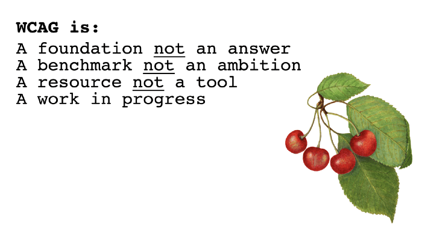
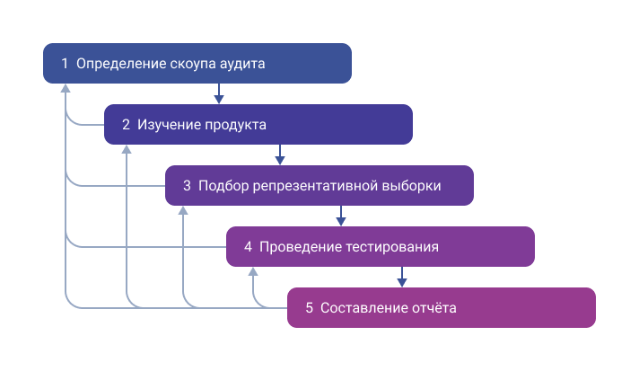
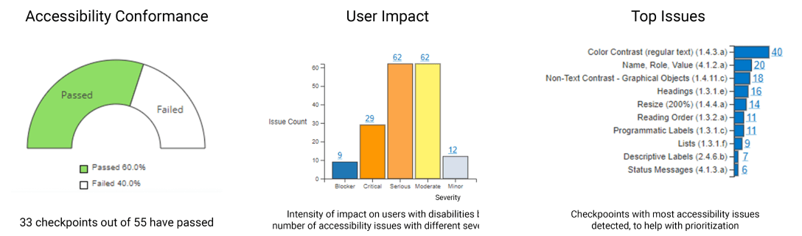
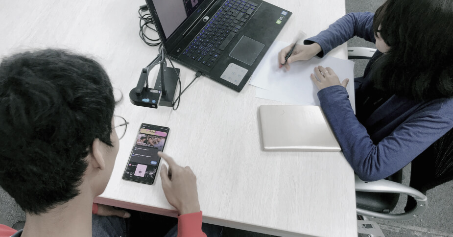

Доступность становится одним из показателей качества сайтов и приложений. Но с чего начать её улучшение? Как узнать, есть ли с ней проблемы? Насколько они критичны и как их исправить? На эти вопросы ответит аудит.

Это хороший первый шаг в начале работы над доступностью или для её поддержания, если продукт постоянно развивается и изменяется.

Статья пригодится разработчикам, дизайнерам, продактам и всем, кто думает об улучшении доступности, но не знает, с чего начать. Из первой части узнаете, что такое аудит, каким он бывает и как выглядит в теории процесс оценки. Во второй познакомитесь с проведением самостоятельного аудита на практике.

## Оглавление

- [Определение](#section-2)
- [Зачем проводить](#section-3)
- [Принципы и источники критериев](#section-4)
- [Когда и как часто проводить](#section-5)
- [Типы аудита](#section-6)
- [Методологии](#section-16)
- [Публичные заявления, VPAT и ACR](#section-23)
- [Оценка доступности пользователями](#section-26)
- [Что делать после аудита](#section-29)
- [Выводы](#section-30)
- [Полезные ссылки](#section-31)

## Определение

_Аудит доступности_ — это оценка продукта на соответствие требованиям доступности, которые описаны в разных стандартах и руководствах. Он оценивает пригодность интерфейса для максимально большого числа пользователей, в том числе для людей с особыми потребностями. В результате получается отчёт об уровне доступности с рекомендациями по исправлению проблем.

Он может показаться похожим на тестирование доступности, но между ними есть большая разница.

- Аудит состоит из серии ручных и автоматических тестов, а тесты могут проводить отдельно и поодиночке.
- Тестами проверяют ограниченное количество элементов и страниц, а во время аудита интерфейс оценивается более масштабно.
- Аудит проводит отдельная рабочая группа или эксперты, а тесты — любые члены команды.

В статье используется термин «аудит», но в других местах можете встретить _«оценку» (evaluation или assessment),_ это синонимы.

## Зачем проводить

Компании проводят аудит по разным причинам.

- Для расширение аудитории и улучшения интерфейса. Доступным интерфейсом сможет пользоваться больше людей, а [71% пользователей с особыми потребностями](https://devblogs.microsoft.com/startups/how-does-accessibility-fit-into-an-mvp/) не уйдёт с недоступного сайта сразу же. К тому же доступность влияет на положение в поисковой выдаче Google.
- Как стартовую точку для внедрение доступности, если компания решила за это взяться.
- Для того, чтобы принять решения об изменениях в интерфейсе, когда разрабатываются новые возможности.
- Если интерфейс изменился — чтобы проверить его доступность. Актуально для больших проектов, в которых уже поддерживается определённый уровень доступности.
- Чтобы проверить соответствие требованиям закона. Особенно актуально в США и странах Евросоюза. Там компании могут получить штраф или потратить деньги на судебные разбирательства из-за нарушения законов.
- Для участия в госзакупках для компаний из США. Доступность — одно из требований для выигрыша тендера.

## Принципы и источники критериев

Аудит основывается на нескольких принципах.

- Содержит измеряемые критерии, а не оценочные суждения.
- Определяет уровень доступности в целом, например, всего сайта.
- Основывается на чёткой методологии.
- Включает так называемые _[контрольные точки доступности](https://www.boia.org/wcag-2.1-a/aa-principles-and-checkpoints)._

Контрольные точки доступности (Accessibility Checkpoints) — это проверка выполнения конкретных требований руководств или законов. Например, во [WCAG 2.1](https://www.w3.org/TR/WCAG21/) (Web Content Accessibility Guidelines, Руководство по обеспечению доступности веб-контента) контрольная точка — это выполнен или нет критерий успешности.

Критерии для аудита берутся из международных и локальных руководств, стандартов и законов. Это могут быть:

- [WCAG 2.1](https://www.w3.org/TR/WCAG21/), а скоро будет [WCAG 2.2](https://www.w3.org/TR/WCAG22/).
- [Section 508](https://www.access-board.gov/ict/) (Section 508 of the Rehabilitation Act of 1973, Раздел 508 Федерального Закона о реабилитации 1973 года).
- [ADA](https://www.ada.gov/cguide.htm) (Americans with Disabilities Act, Закон об американцах-инвалидах).
- [EN 301 549](https://www.etsi.org/deliver/etsi_en/301500_301599/301549/03.02.01_60/en_301549v030201p.pdf) (Standard EN 301 549, Европейский стандарт EN 301 549).
- Похожие законы и стандарты других стран.

При этом WCAG и законы не описывают все барьеры, с которыми сталкиваются люди. Поэтому другими источниками критериев могут быть лучшие практики, публичные результаты пользовательских исследований и знания экспертов.

<figure>
    
    <figcaption>WCAG — это: основа, а не ответ; ориентир, а не цель; ресурс, а не инструмент; непрерывный процесс. «<a href="https://www.ab11y.com/articles/a-little-book-of-accessibility/">A Little Book of Accessibility</a>», Гарет Форд Уильямс.</figcaption>
</figure>

## Когда и как часто проводить

Чем раньше проводите аудит, тем лучше. Так вы избежите лишних трат на разработку и дизайн, а ещё уменьшите количество барьеров для пользователей. Например, можно провести его на первых этапах разработки, в процессе редизайна или при переходе на новые технологии.

Размеры продукта напрямую влияют на то, как часто проводить аудит. Для небольшого продукта без больших изменений достаточно одного раза в год. Средние проекты с умеренным количеством новых функций можно проверять раз в полгода–год. Уровень доступности активно развивающихся больших продуктов постепенно снижается из-за постоянных изменений. В их случае лучше проводить аудит не только каждый год, но и ежеквартально. Годовой будет более полным и глубоким, а квартальные — небольшими и точечными.

## Типы аудита

Пока нет универсальной классификации типов аудита. Разные компании даже могут называть их по-разному. В этом разделе мы собрали самые распространённые типы и сгруппировали их так, чтобы было проще в них разобраться и выбрать походящий.

Один аудит может относиться сразу к нескольким типам. Так что подбор нужного чем-то напоминает сборку конструктора. Например, он может быть одновременно самостоятельным, подробным, смешанным и оценивать сайт. Всё зависит от ваших целей и оцениваемого продукта.

### Кто проводит

- Внешний аудит (External Expert Audit или Expert Audit). Его проводит приглашённый эксперт или компания, которая занимается аудитом. Он дороже, но более профессиональный, полный и показывает взгляд со стороны.
- Самостоятельный аудит (Self-audit). Проводится собственными силами. Дешевле, но не всегда найдёт все проблемы. Этот тип подходит компаниям, где есть сотрудники с нужными навыками и знаниями о доступности.

Для самостоятельного аудита создаётся отдельная рабочая группа внутри компании. Она состоит из инициатора аудита, который за ним следит, и нескольких аудиторов. Их количество зависит от размера продукта и выбранных параметров аудита. Максимально объективную оценку они смогут дать, если в этот момент активно не участвуют в разработке.

### По цели

- Подробный аудит (Detailed Audit). Проводится на основе выбранного документа. Например, WCAG 2.1 или Section 508. Также подходит для проверки на соответствие специфическим требованиям. К примеру, для видеотрансляций, банкоматов или терминалов.
- Аудит рисков (Risk Audit). Описывает и считает количество критичных ошибок, с которыми могут столкнуться пользователи. В отчёт попадёт информация о потенциальных рисках без рекомендаций по их исправлению. Так что это, скорее, подготовительный этап, а не полноценный аудит.
- Аудит масштаба работ (Level-of-effort Audit). Цель такого аудита — узнать стоимость и объём работ по исправлению проблем.
- Проверочный аудит (Validation Audit). Повторный аудит после внесения изменений.

### По степени автоматизации

Тестирование — важный этап аудита. В этой категории типы выделены на основе того, какой вид тестирования преобладает.

#### Автоматический аудит

Также известный как _Software/Automated Audit._ Проводится с помощью автоматических инструментов и автотестов. Помогает быстро выявить основные проблемы с доступностью.

Однако у него есть несколько недостатков:

- Не всё можно проверить автоматически. Например, читаемость текстов, качество альтернативных описаний для изображений или понятность иконок. Автоматическое тестирование поможет отловить только [30–50 % проблем с доступностью](https://alphagov.github.io/accessibility-tool-audit/). Интересно, что [axe от Deque](https://www.deque.com/axe/) обещает найти [57 % от всех проблем](https://www.deque.com/blog/automated-testing-study-identifies-57-percent-of-digital-accessibility-issues/).
- Не всегда гарантируется соответствие рекомендациям и указывается их источник. Какие-то инструменты проверяют по последним версиям WCAG, какие-то нет.
- Не все инструменты валидируют HTML и [ARIA](https://www.w3.org/TR/wai-aria/) (Accessible Rich Internet Applications). К примеру, они могут пропустить вложенные друг в друга заголовки или явные ошибки с ARIA-атрибутами.

Так что начинать оценку хорошо с автоматического аудита, но не стоит на нём останавливаться.

#### Ручной аудит

Он же _Manual Audit._ Заполняет пробелы автоматического. Можно проверить интерфейс с клавиатуры, посмотреть страницу с экранной лупой, провести юзабилити-тестирование или интервью с пользователями.

#### Смешанный аудит

Или _Hybrid Audit._ Совмещает ручные и автоматические методы. С ним легче подстроить процесс тестирования под нужды компании и избежать сложностей и пробелов только ручного или автоматического тестирования.

### По этапу разработки

- Технический аудит. Оценка кода. В основном это автоматическая проверка с элементами ручного тестирования.
- Аудит дизайна. Важный тип аудита, ведь примерно [67% проблем с доступностью связаны с дизайном](https://www.deque.com/blog/auditing-design-systems-for-accessibility/#design-should-consider-accessibility). Его можно разделить на два дополнительных подтипа:
    - Дизайн-аудит (Design/UI Audit). Оценка целой дизайн-системы или отдельных UI-компонентов и паттернов вручную или с помощью специальных инструментов вроде axe или [WAVE](https://wave.webaim.org).
    - Юзабилити-аудит (Usability/UX Audit). Этот тип помогает детальнее изучить то, как пользователи с особыми потребностями взаимодействуют с интерфейсом, и с чем у них возникают проблемы. Сочетает ручной аудит и юзабилити-тестирование. Например, оценивает читаемость текстов, информационную архитектуру или навигацию с клавиатуры.
- Совмещённый аудит. Оценка того, как работает весь интерфейс. Проверяются код, дизайн и контент.

### По проверяемым технологиям

- Аудит сайтов и десктопных приложений (Website Audit и App Audit).
- Мобильный аудит (Mobile Audit).
- Аудит документов (Document Audit). Можно проверять любые форматы. К примеру, PDF, DOC или PPT.
- Приёмочное тестирование скринридеров (Screen Reader Audit). Оценка доступности для пользователей программ экранного чтения. Обычно проверяется то, как читаются заголовки, медиаконтент, интерактивные элементы, отдельные области страницы, а также порядок фокуса.
- Аудит терминалов (Kiosk Audit). Оцениваются терминалы, в основном вручную.
- Аудит голосовых помощников (Conversational Audit). Оценка интерфейсов для голосового управления. Например, с помощью голосовых ассистентов Alexa или Google Home.
- И другие технологии.

### Как выбрать нужный тип

Чтобы подобрать подходящий тип аудита, ответьте для себя на несколько вопросов.

- Какая цель у аудита?
    - Проверить весь продукт на соответствие рекомендациям уровня AA из WCAG 2.1.
    - Узнать, насколько доступна дизайн-система.
    - Уточнить примерную стоимость аудита.
    - Или что-то другое.
- Что это за продукт? Может быть, это сайт, веб-приложение или сервис с голосовым управлением.
- Насколько продукт объёмный, как часто обновляется и как много стороннего кода используется?
- Насколько хорошо команда разбирается в доступности? Есть ли сотрудники, которые могут провести аудит?
- Сколько можете выделить на это ресурсов?
- Какие сроки проведения?

Подробный аудит может не всем сразу подойти. Если сайт объёмный, постоянно обновляется и принципы доступности не заложены изначально, то сначала лучше провести аудит масштаба работ. Он поможет определить общее количество проблем.

Также перед подробным аудитом рекомендуется провести технический и исправить самые очевидные проблемы с кодом. Тогда итоговый аудит будет стоить меньше и выявит более серьёзные и фундаментальные проблемы с юзабилити.

Самостоятельный аудит тоже подойдёт не всем. Особенно, когда в команде нет специалистов по доступности. В этом случае лучше заказать внешний.

Когда недостаточно средств для проведения смешанного или ручного аудита, то в первое время поможет автоматический. Он не выявит всех проблем, зато сократит объём работы к моменту, когда вы сможете провести более подробный и глубокий аудит.

## Методологии

Одна из базовых составляющих любого аудита — методология.

_Методология_ — это набор методов, правил и этапов, который помогает стандартизировать процесс аудита.

Можно найти уже готовые решения или разработать своё. Внутренние методологии обычно создают аудиторские и большие продуктовые компании, которые постоянно проводят аудит.

Методологии включают определённое количество этапов. Обычно их пять:

1. Проработка требований к аудиту. На этом этапе определяются его цели, примерная стоимость и выбирается подходящий тип. Это обсуждается с аудитором или со специалистами по доступности внутри команды.
2. Изучение продукта. Здесь нужно выяснить, что это за продукт и какие технологии в нём используются. Например, это многостраничный сайт или небольшой лендинг, написанный на чистых CSS или HTML.
3. Проведение тестирования.
4. Составление отчёта.
5. Исправление ошибок, когда есть рекомендации.

Этапы не обязательно проходить последовательно. В некоторых случаях это может происходить итеративно, с возвратом к предыдущим этапам. А какие-то из них можно вообще выполнять одновременно.

### WCAG-EM

_[WCAG-EM](https://www.w3.org/TR/WCAG-EM/) (Website Accessibility Conformance Evaluation Methodology, Методология оценки сайтов на соответствие доступности)_ — публичная методология W3C. Она содержит рекомендации об оценке доступности на соответствие критериям успешности WCAG. Несмотря на название, подходит для любого цифрового продукта, не только для сайтов.

Аудит по этой методологии состоит из пяти шагов.

1. Определение охвата аудита.
2. Изучение продукта.
3. Подбор репрезентативной выборки.
4. Проведение тестирования.
5. Составление отчёта.

По мере прохождения шагов лучше записывать их результаты в черновик. Так будет проще потом собрать всё в итоговый отчёт.

Теперь давайте рассмотрим каждый шаг подробнее.

#### 1. Определение охвата аудита

На первом шаге определяются границы того, что планируется оценивать. Чтобы это было проще сделать, шаг лучше разбить не несколько подзадач.

Для начала определяем, что оценивается и в каких объёмах. Например, сколько страниц на сайте, на каких они языках, есть ли мобильная версия и чем она отличается от десктопной, используются ли сторонние сервисы и контент. Лучше оценивать за один аудит что-то одно. Если пользователи для решения задач часто используют сразу несколько продуктов, тогда проводится один общий аудит.

Также следует разобраться с поддерживаемыми технологиями. Это могут быть определённые операционные системы, браузеры и вспомогательные технологии.

Легче всего выбрать [популярные комбинации](https://webaim.org/projects/screenreadersurvey9/):

- Windows: JAWS или NVDA и Chrome.
- macOS: VoiceOver и Safari.
- iOS: VoiceOver и Safari.
- Android: TalkBack и Chrome.

Важно определить желаемый уровень соответствия WCAG. Во WCAG 2.1 и 2.2 их три: A (минимальный), AA (средний) и AAA (максимальный). Чаще всего ориентируются на AA.

Опционально можно добавить дополнительные требования. Они зависят от целей аудита и особенностей продукта. Это могут быть:

- Подходящий шаблон отчёта.
- Количество решений по исправлению проблем.
- Дополнительные страницы не из основной выборки, которые всё равно хочется оценить.
- Планируется ли привлекать к оценке пользователей с особыми потребностями.

#### 2. Изучение продукта

Теперь нужно подробнее изучить охват и собрать больше технических деталей. На следующем шаге они помогут сформировать выборку страниц для оценки.

Для начала надо выбрать популярные страницы. Обычно это главная и другие внутренние страницы, на которые есть ссылки в хедере и футере. Конечно, выбор упростит статистика по посещениям.

Также стоит подумать об основных функциях, которые есть в продукте. Например, выбор и покупка товаров, регистрация аккаунта или загрузка и просмотр видео.

Ещё важно выделить виды страниц и их состояния. Они могут выглядеть и вести себя по-разному, содержать уникальный контент и из-за этого иметь разную поддержку доступности. Например, у страниц разные макеты, структура и навигация, стили или тип контента.

Отдельно стоит подумать о важных пользовательских путях. К примеру, добавление товара в корзину и оформление заказа.

Кроме этого, нужно определить используемые технологии. Какие фреймворки и CMS используются, есть ли CSS-анимация, ARIA-роли и атрибуты и другое.

Опционально можно поискать значимые страницы для людей с особыми потребностями. На них обычно находится информация о специальных возможностях, инструкции и отдельные контакты для обратной связи или помощи.

#### 3. Подбор репрезентативной выборки

Пришло время подобрать репрезентативные страницы, их состояния и пользовательские пути. На выбор влияют размеры сайта и его страниц, их новизна, сложность функциональности и другие похожие характеристики.

Если сайт небольшой, то можно не искать специально страницы для выборки. Его легко оценить целиком.

Когда сайт большой и страниц много, то для начала лучше сформировать структурированную выборку. В неё включают все типы страниц и пользовательские пути. Хорошо, когда есть хотя бы одна страница, которая относится ко всем типам.

В выборку ещё хорошо включить все страницы и их состояния, которые являются частью одного процесса. Например, форма заказа товара, которая состоит из нескольких страниц (этапов). В этом случае они — часть одного большого процесса покупки, и не работают друг без друга.

Дополнительно может понадобиться случайная выборка. Она полезна для объёмных сайтов, когда структурированной выборки не хватает для полной оценки. Случайных страниц должно быть 10% от числа страниц из структурированной выборки. То есть, если в структурированной выборке их 80, то в случайную попадут 8. Случайные страницы выбирают разными способами. Например, с помощью инструментов и скриптов для случайного выбора или просмотра серверных логов.

Случайная и структурированная выборки сначала оцениваются отдельно, а потом сравниваются. Поэтому важно в конце этого шага составить список страниц со ссылками, состояниями и пользовательскими путями с их кратким описанием. Это поможет сэкономить время и провести более точные тесты на следующем шаге.

#### 4. Проведение тестирования

На этом шаге оцениваем страницы из выборок на соответствие рекомендациям из чек-листа. Проверять можно вручную, при помощи автоматических инструментов и привлекать к этому пользователей.

Полезно провести и автоматическое, и ручное тестирование. К ручному идеально привлекать не только экспертов, но и пользователей вспомогательных технологий. А перед этим лучше исправить критичные ошибки, которые обнаружили автоматические инструменты. Это ускорит пользовательское тестирование и поможет избежать лишних расходов.

Оценка проводится на основе [пяти требований соответствия из WCAG](https://www.w3.org/TR/WCAG21/#conformance-reqs).

1. Уровень соответствия. Если цель — проверка на соответствие уровню AA, то в результате получится утверждение, соответствует ли ему элемент или нет.
2. Страницы целиком. Если часть страницы соответствует рекомендациям уровня A, а другая — AA, то она не соответствует уровню АА.
3. Соответствие процесса в целом. Для этого проверяются пользовательские пути. Например, если в корзину нельзя попасть из карточки товара, то это критичная ошибка.
4. Способы использования технологий, поддерживающих доступность. Контент оценивается с помощью поддерживаемых вспомогательных технологий. Если он не поддерживается напрямую, то проверяются альтернативные версии. Например, видео без субтитров или титров считается доступным, если у него есть текстовая расшифровка на этой же или отдельной странице.
5. Невмешательство. Если технологии недоступны, но не мешают пользователям или не важны для них, то это не ошибка. К примеру, рекламные баннеры.

Результаты оценки лучше сразу записывать в таблицу вместе с указанием проблемных страниц, элементов и состояний. Если есть несоответствия, то отмечаются их причины. Некоторые элементы получат статус «предупреждение». Это субъективная оценка, а не ошибка.

Тестирование можно разделить на несколько небольших задач.

Вначале стоит убедиться, что выбранные страницы соответствуют всем рекомендациям. Проще это сделать, если их разбить на отдельные компоненты. Например, на заголовки разных уровней, меню в хедере и футере, строку поиска и другие. Обычно элементы повторяются и ведут себя одинаково, так что можно протестировать их один раз.

Также следует проверить, правильно ли работают формы, модальные окна и другие элементы, которые встречаются на пользовательских путях.

В самом конце сравнивают результаты проверки структурированной и случайной выборок, если их было две. Появление новых типов контента или выводов — сигнал о том, что случайная выборка получилась нерепрезентативной. В этом случае нужно вернуться к третьему и второму шагу, чтобы расширить выборку с учётом новых типов и состояний. Это нужно повторять до тех пор, пока обе выборки не будут хорошо отражать контент и структуру сайта.

#### 5. Составление отчёта

На последнем шаге все выводы объединяются в один отчёт.

Отчёты составляются по шаблону, который состоит из обязательных и опциональных пунктов.

- Общая информация.
    - Имена аудиторов.
    - Имя ответственного за проведение аудита. Это может быть владелец сайта, разработчик и любой другой человек, который предложил провести аудит.
    - Дата проведения.
- Охват из первого шага.
    - Особенности продукта. Например, поддерживаемые языки и внешние сервисы.
    - Желаемый уровень соответствия.
    - Какие технологии планировалось поддерживать. Ими могут быть браузеры, операционные системы, скринридеры, экранные лупы и прочее.
    - Дополнительные требования (опционально). Например, какие-то особые функции или страницы, которые хотелось отдельно протестировать.
- Описание продукта из второго шага.
    - Технологический стек.
    - Важные страницы, например, главная (опционально).
    - Ключевая функциональность (опционально).
    - Типы страниц и их состояний (опционально).
    - Страницы, которые имеют значение для людей с особыми потребностями (опционально).
- Репрезентативная выборка из третьего шага.
    - Какие оценивались страницы, состояния и типы.
    - Важные пользовательские пути.
    - Список случайно выбранных страниц (опционально).
- Результаты тестирования из четвёртого шага.
    - Оценка страниц из структурированной выборки.
    - Оценка страниц из случайной выборки (опционально).
    - Сравнение результатов оценки страниц из случайной и структурированной выборок (опционально).

**Примечание.** Для отчётов об аудите инструментов для разработки и проверки доступности используют машиночитаемый формат [EARL](https://www.w3.org/WAI/standards-guidelines/earl/) (Evaluation and Report Language, Язык для оценки и отчёта).

Можно не останавливаться на рекомендациях WCAG-EM и добавить в отчёт ещё больше деталей. Включить можно всё, что кажется полезным.

- Какие автоматические инструменты для тестирования использовались.
- Количество страниц и элементов, которые соответствует или не соответствуют рекомендациям.
- Общая статистика по количеству найденных проблем и сколько обнаружено глобальных блокеров. Ещё можно указать, какой тип тестирования помог их выявить.
- Влияние барьеров на людей. Например, какие категории пользователей они затронули и насколько серьёзно.
- Интересные выводы из пользовательского тестирования.
- Какой процент проблем выявило автоматическое или ручное тестирование.
- Следующие шаги по внедрению доступности.

Сделать отчёт ещё нагляднее помогут скриншоты и графики. К примеру, в панели мониторинга Deque есть круговая диаграмма с процентом выполненных и невыполненных критериев успешности WCAG, а ещё гистограммы с серьёзностью ошибок и частотой проблем.

<figure>
    
    <figcaption>«<a href="https://www.deque.com/blog/what-to-look-for-in-an-accessibility-audit/">What to look for in an accessibility audit</a>», Гленда Симс.</figcaption>
</figure>

В отдельном документе можно сохранить дополнительную информацию про проведение аудита, чтобы дополнить или лучше раскрыть выводы из отчёта. Это могут быть описание путей для поиска страниц и их состояний.

## Публичные заявления, VPAT и ACR

Многие аудиторские компании оценивают продукты для составления публичных заявлений, шаблонов добровольной доступности (VPAT) и отчётов о соответствии ей (ACR). В этих документах нет рекомендаций, в отличие от полноценного отчёта об аудите. Они описывают только доступные фичи и соответствие критериям WCAG или требованиям законов.

### Публичные заявления

Компании публикуют такие заявления на своих сайтах, если хотят рассказать пользователям и партнёрам о доступности сайта или приложения. Как правило, это не обязательно делать.

Есть несколько видов заявлений.

_Заявление о доступности (Accessibility Statement)_ — перечисление и описание типов фич и их уровня соответствия критериям успешности из WCAG или требованиям законов. Обычно описывает доступность самых важных страниц и экранов. Пример — [Заявление о доступности Twitch](https://www.twitch.tv/p/ru-ru/legal/accessibility/).

В странах Евросоюза заявление о доступности обязательно должно быть у сайтов и мобильных приложений государственных органов. Для него разработана [отдельная европейская модель](https://eur-lex.europa.eu/eli/dec_impl/2018/1523/oj).

_[Заявление о соответствии](https://www.w3.org/TR/WCAG21/#conformance-claims) (Conformance Claims)_ описывает уровень соответствия сайта рекомендациям из WCAG. Пример — [Заявление о соответствии Panasonic](https://www.panasonic.com/global/webaccessibility/results/2021.html).

_[Заявление об оценке](https://www.w3.org/TR/WCAG-EM/#step5c) (Evaluation Statement)_ — это публичные выводы о проведении аудита по методологии WCAG-EM. Состоит из нескольких пунктов:

1. Дата проведения аудита.
2. Версия WCAG в основе аудита.
3. Желаемый уровень соответствия.
4. Краткое описание охвата: сайт, приложение, что-то другое. В общем, информация, которая была собрана на первом шаге аудита по методологии.
5. Какие технологии используются.
6. Поддерживаемые вспомогательные технологии.
7. Если продукт частично соответствует требованиям доступности, то какие части им не соответствуют.
8. Причины несоответствия.

Пример — [Заявление об оценке сайта правительства округа Камберленд](https://www.cumberlandcountync.gov/departments/no-department-pages-group/accessibility-evaluation-statement).

### VPAT и ACR

Оба документа описывают уровень соответствия продукта или сервиса критериям WCAG или требованиям законов и стандартов о доступности. Например, десктопной программы или сервиса по оплате штрафов.

Нужны американским и европейским компаниям, которые участвуют в государственных закупках в США. Без этого они не смогут сотрудничать с американскими государственными органами.

_[VPAT](https://www.itic.org/policy/accessibility/vpat) (Voluntary Product Accessibility Template, Шаблон добровольной доступности продукта)_ — зарегистрированный знак обслуживания ITI (Information Technology Industry Council, Совет индустрии информационных технологий). Изначально составлялся для того, чтобы государственным органам США было проще проводить исследования доступности американского информационного рынка.

Выглядит как таблица с критериями доступности, уровнем их поддержки и дополнительными примечаниями и пояснениями.

Существует четыре вида VPAT:

- Редакция WCAG про соответствие WCAG 2.0 или 2.1.
- Редакция 508 про соответствие Section 508.
- Редакция EU про соответствие EN 301 549.
- Редакция INT про соответствие всем трём документам.

Пример — [GitHub VPAT](https://government.github.com/accessibility/).

_ACR (Accessibility Conformance Report, Отчёт о соответствии доступности)_ — финальный отчёт о доступности продукта с бо́льшим количеством деталей. Он включает заполненный VPAT, информацию о продукте или услуге, поддерживаемых вспомогательных технологиях и другие детали.

Кроме стандартного ACR, есть ещё версия с поддержкой машинного чтения — [OPAT](https://accessibility.civicactions.com/posts/CivicActions-Creates-Open-Product-Accessibility-Template) (Open Product Accessibility Template, Открытый шаблон добровольной доступности продукта).

## Оценка доступности пользователями

Автоматическое, экспертное и другие виды ручного тестирования могут пропустить некоторые важные и неочевидные проблемы. Они могут быть связаны с неправильной разметкой, плохим юзабилити или особенностями вспомогательных технологий. Поэтому в рамках аудита ещё желательно проводить оценочные пользовательские исследования. Только они смогут оставшиеся проблемы с доступностью.

В проведении исследований есть особенности, которые могут привести к ошибочным выводам. Поэтому лучше всего привлекать людей, которые умеют проводить интервью или юзабилити-тестирование. Если такой возможности нет, лучше найти компанию, которая этим занимается. Однако можно провести исследования и собственными силами. Это всё равно лучше, чем ничего.

### Методы исследований

Для такой дополнительной проверки можно провести анкетирование, интервью, юзабилити-тестирование. На выбор варианта исследования и его параметры здесь влияют:

- Особенности продукта и этап его развития.
- Выбранный тип аудита.
- Количество доступных ресурсов у компании. Исследования могут быть довольно продолжительными и дорогими. Для них потребуется выделение дополнительных сотрудников и физический выезд к каждому респонденту.
- Количество выделенных ресурсов для поиска респондентов.

Если нужно провести юзабилити-тестирование, то сценарий хорошо составить таким образом, чтобы тест выявлял только проблемы с доступностью, а не общие проблемы юзабилити. Так сможете сэкономить время.

Кроме наблюдения или вопросов об опыте взаимодействия с продуктом, ещё помогут вопросы про используемые технологии. К примеру, об устройствах, операционных системах, браузерах, скринридерах или других вспомогательных технологиях.

Полезные ссылки по теме:

- [Just Ask: Integrating Accessibility Throughout Design](http://www.uiaccess.com/JustAsk/), Шона Генри.
- [Юзабилити-тестирование по дешёвке](https://medium.com/p/2e853250960f), Влад Головач.
- [Как сделать сайт удобным. Юзабилити по методу Стива Круга](https://www.ozon.ru/product/kak-sdelat-sayt-udobnym-yuzabiliti-po-metodu-stiva-kruga-28288606/), Стив Круг.
- [Основы юзабилити-тестирования](https://dmkpress.com/catalog/computer/software_development/978-5-97060-960-6/), Кэрол М. Барум. Исчерпывающая книга про юзабилити-тестирование.

### Требования к респондентам и их поиск

Привлекайте к юзабилити-тестированию людей с разнообразными особыми потребностями и особенностями. К примеру, человек с когнитивными нарушениями не знает про доступность для людей с глухотой. Такое разнообразие респондентов поможет найти больше проблем с доступностью.

Однако не ограничивайтесь людьми с «официальной» инвалидностью и привлекайте, например, людей с особенностями восприятия информации, дислексией, синдромом дефицита внимания, тревожными расстройствами, цветовой слепотой, а также пожилых и тех, у кого есть проблемы с памятью.

Не любой человек с особыми потребностями подойдёт на роль респондента для проверки конкретно вашего продукта. Например, человек с глухотой не поможет выявить проблемы с доступностью трекера задач. Взаимодействие с интерфейсом такого респондента не отличается от поведения других людей. Поэтому определите требования к респондентам перед их поиском.

Примеры критериев для отбора респондентов:

- знание предметной области;
- наличие опыта работы с похожими продуктами;
- пользовался ли респондент проверяемым продуктом или нет;
- уровень компьютерной грамотности;
- навыки владения вспомогательными технологиями;
- вид особых потребностей, физических или ментальных особенностей;
- возраст.

Можете начать поиски респондентов с этих мест:

- Специализированные региональные и международные организации, занимающиеся поддержкой людей с инвалидностью. Например, [Всероссийское общество инвалидов](https://www.voi.ru/o_nas/ob_organizacii), [Всероссийское общество глухих](https://voginfo.ru) или [Всероссийское общество слепых](https://www.vos.org.ru).
- Фонды, ассоциации и местные группы поддержки людей с особыми потребностями и с нейроотличиями. К примеру, благотворительный фонд поддержки людей с аутизмом «[Антон тут рядом](https://antontut.ru/about/)» или [Ассоциация родителей детей и взрослых с дислексией](https://dyslexiarf.com).
- Университетские программы для студентов с особенностями развития.
- Организации, занимающиеся поддержкой пожилых людей.

Можно попросить помощи у экспертов по доступности с инвалидностью. Они подскажут, как и где найти нужных респондентов. Также есть компании, которые сами подберут подходящих респондентов.

Полезные ссылки по теме:

- В книге «Just Ask: Integrating Accessibility Throughout Design» Шоны Генри есть больше информации о том, [как отбирать участников для тестирования](http://www.uiaccess.com/accessucd/ut_plan.html#characteristics) и [как правильно с ними взаимодействовать](http://www.uiaccess.com/accessucd/interact.html).
- [Поиск респондентов для юзабилити-тестирования. Часть 1: критерии отбора](https://usabilitylab.ru/blog/poisk-respondentov-dlya-yuzabiliti-testirovaniya-chast-1-kriterii-otbora/), UsabilityLab.
- [Поиск респондентов для юзабилити-тестирования. Часть 2: самостоятельный поиск](https://usabilitylab.ru/blog/respondent-search-2/), UsabilityLab.
- [Как подбирать респондентов для UX исследования — опыт Crowdtesting](https://medium.com/p/79d01ff38c0f), Writes.

## Что делать после аудита

Для повышения уровня доступности продукта чаще всего недостаточно провести аудит один раз и исправить найденные проблемы. Важно на этом не останавливаться и улучшать внутренние процессы. Это поможет избежать многих проблем и не исправлять их каждый раз, когда что-то изменяется в интерфейсе.

После исправления ошибок бывает полезно перепроверить, точно ли их больше нет. Для этого пригодится регрессионное тестирование или проверочный аудит. Они обнаружат пропущенные ошибки в уже протестированных частях продукта или только подтвердят, что всё хорошо.

Также можно организовать тренинги и внутренние митапы по доступности. Так повысите уровень знаний, не потеряете их вместе с уволившимися сотрудниками и эффективнее будете онбордить новых людей.

Ещё полезно найти среди коллег [защитника доступности](https://pressbooks.library.ryerson.ca/dabp/chapter/characteristics-of-a-digital-accessibility-champion/) (Accessibility Champion) и собрать команду из специалистов, которые в ней разбираются (Accessibility Champion Unit). Эти люди будут менторить других, помогать решать сложные задачи и следить за уровнем доступности продукта.

Если пользуетесь технологиями других разработчиков и работаете с аутсорсерами, то узнайте, как хорошо они знакомы с этой темой. Если слабо, то сделайте доступность обязательным требованием к их работе.

Не забывайте про регулярное автоматическое и ручное тестирование. Их можно внедрить на нескольких этапах разработки. К примеру, на этапе дизайна и написания кода. Это поможет заранее отлавливать ошибки и быстро их исправлять. Ещё полезно периодически проводить тестирование с клавиатуры. Так можно найти часть потенциальных проблем со скринридерами.

Наконец, важно вести документацию и чек-листы. Благодаря этому подходы к доступности станут прозрачными, знания будет проще передавать и распространять среди членов команды, а будущие аудиты станет легче и быстрее проводить.

## Выводы

Аудит полезен в случае, если хотите повысить уровень доступности своего продукта или поддерживать его на нужном уровне.

У него чёткая структура и критерии в основе. Чаще всего они берутся из WCAG, но бывает и из локальных законов и стандартов о цифровой доступности.

Кроме этого, у любого аудита есть чёткая методология, по которой он проводится. Одна из самых популярных — WCAG-EM от W3C.

Он бывает разных типов. Например, самостоятельный, внешний, автоматический или подробный. Чтобы выбрать подходящий тип, нужно подумать о его целях и об особенностях оцениваемого продукта.

Итог любого аудита — отчёт, который состоит из списка всех найденных проблем и рекомендаций по их исправлению.

Один из важных этапов аудита — тестирование. Часто автоматического и ручного экспертного тестирования мало для того, чтобы сделать продукт максимально доступным. В этом случае помогает пользовательское тестирование. Оно находит неочевидные для специалистов проблемы.

На отчёт чем-то похожи публичные заявления, VPAT и ACR. Но, в отличие от отчётв, в них нет рекомендаций по исправлению ошибок. Это просто перечисление фич и того, что в продукте доступно, а что нет.

Доступность не заканчивается на аудите. Чтобы продукт всегда оставался доступным, нужно наладить внутренние процессы.

## Полезные ссылки

### Рекомендации W3C

- [Website Accessibility Conformance Evaluation Methodology 1.0](https://www.w3.org/TR/WCAG-EM/).
- [Evaluating Web Accessibility Overview](https://www.w3.org/WAI/test-evaluate/).

### Статьи

- [Accessibility audit process](https://digital.nhs.uk/about-nhs-digital/standards-for-web-products/accessibility-for-digital-services/accessibility-audit-process), NHS Digital.
- [Getting an accessibility audit](https://www.gov.uk/service-manual/helping-people-to-use-your-service/getting-an-accessibility-audit), GOV.UK.
- [What to look for in an accessibility audit](https://www.deque.com/blog/what-to-look-for-in-an-accessibility-audit/), Гленда Симс.
- [Auditing Design Systems for Accessibility](https://www.deque.com/blog/auditing-design-systems-for-accessibility/), Анна И. Кук.
- [Choosing the right type of accessibility assessment](https://tetralogical.com/blog/2020/12/01/choosing-the-right-type-of-accessibility-assessment/), Леони Уотсон.
- [Accessibility testing](https://adactio.com/journal/18458), Джереми Кит.
- [Accessibility auditing and ego](https://ericwbailey.design/writing/accessibility-auditing-and-ego/), Эрик Бэйли.
- [What's The Difference Between An Accessibility Test and an Accessibility Audit](https://www.boia.org/blog/whats-the-difference-between-an-accessibility-test-and-an-accessibility-audit), The Bureau of Internet Accessibility.
- [How accessible is your website for the disabled? Consider doing an audit to find out](https://www.poynter.org/tech-tools/2017/how-accessible-is-your-website-for-the-disabled-consider-doing-an-audit-to-find-out/), Мелоди Крамер.
- [Accessibility Certification](https://www.interactiveaccessibility.com/services/accessibility-certification), TPGi.
- [ACR: Accessibility Conformance Report (vs. VPAT)](https://krisrivenburgh.medium.com/acr-accessibility-conformance-report-vs-vpat-70828cd8e5bf), Крис Ривенбург.
- [Обеспечение доступности веб-контента: стандарты, критерии, пример реализации](https://habr.com/ru/company/ispring/blog/564446/), Павел Попов.
- [Characteristics of a Digital Accessibility Champion](https://pressbooks.library.ryerson.ca/dabp/chapter/characteristics-of-a-digital-accessibility-champion/), Ryerson University Pressbooks.

### Книги

- [Just Ask: Integrating Accessibility Throughout Design](http://www.uiaccess.com/accessucd/), Шона Генри.
- [Основы юзабилити-тестирования](https://dmkpress.com/catalog/computer/software_development/978-5-97060-960-6/), Кэрол М. Барум.
- [Как сделать сайт удобным. Юзабилити по методу Стива Круга](https://www.ozon.ru/product/kak-sdelat-sayt-udobnym-yuzabiliti-po-metodu-stiva-kruga-28288606/?sh=6WXreyNx), Стив Круг.

### Доклад

[After the Audit: Integrating Accessibility into the Testing Process](https://www.deque.com/axe-con/sessions/after-the-audit-integrating-accessibility-into-the-testing-process/), Кристал Престон-Уотсон. axe-con 2021.

### Отчёты о проведении аудита

- [Отчёт по Gutenberg, редактору контента WordPress](https://www.wpcampus.org/blog/2019/05/gutenberg-audit-results/).
- [Отчёт по аудиту сайта канадского муниципалитета](https://www.strathcona.ca/files/files/comc-public-website-accessibility-audit-2018.pdf) Страткона Каунти.
