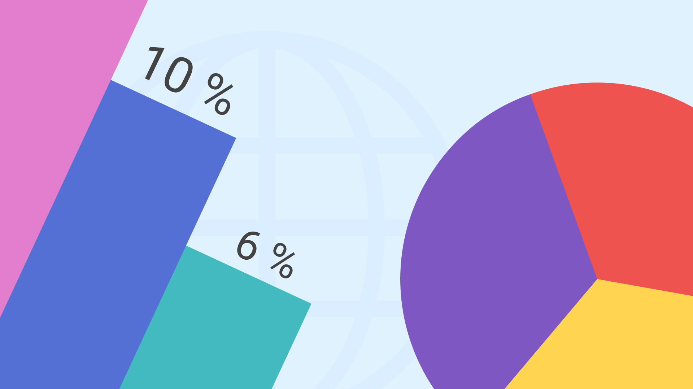
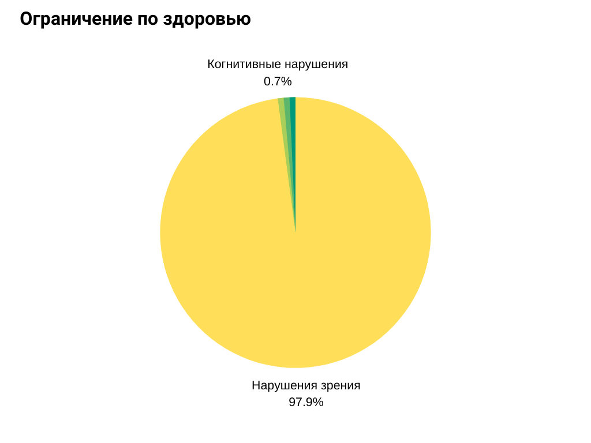
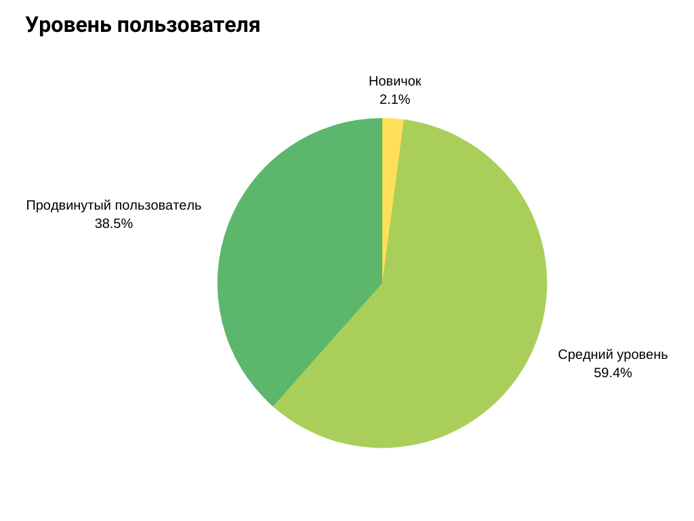
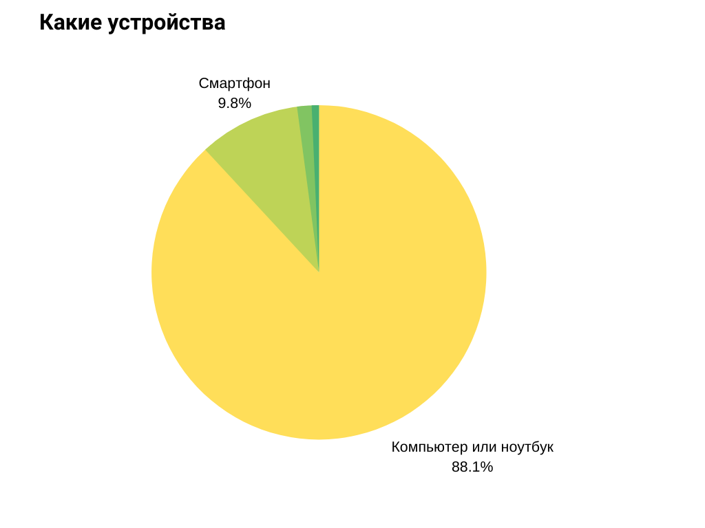
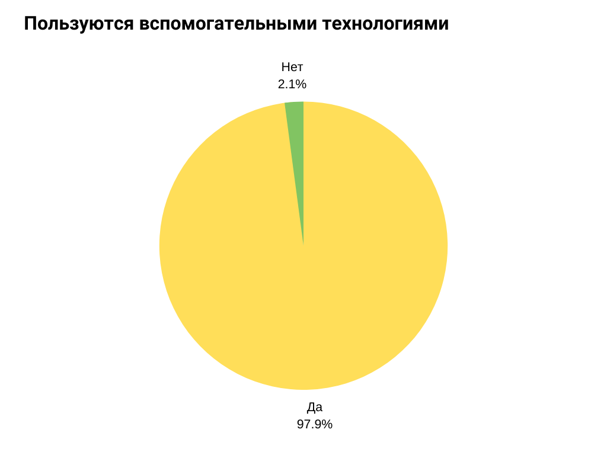
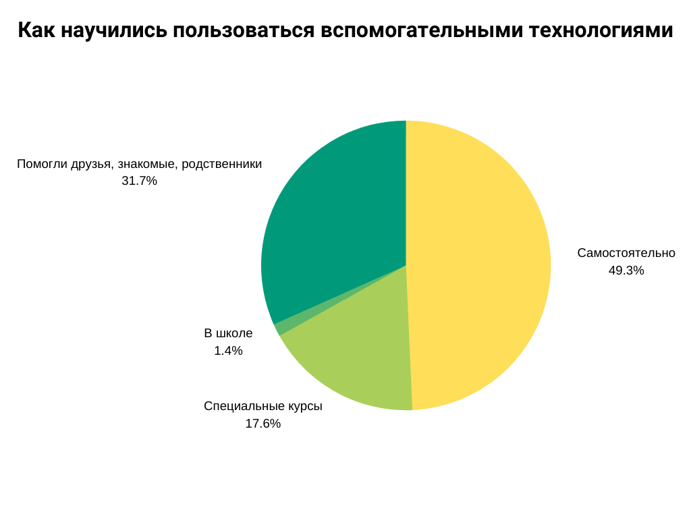
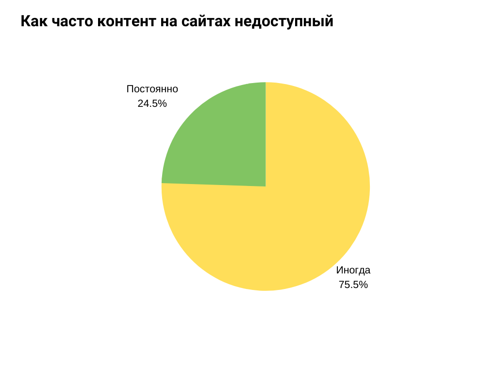
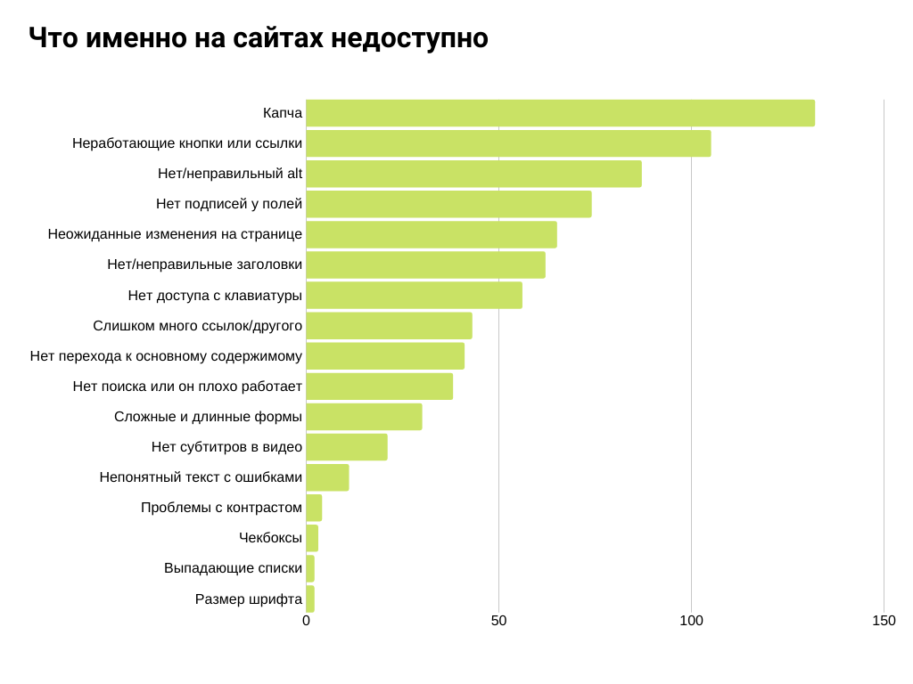
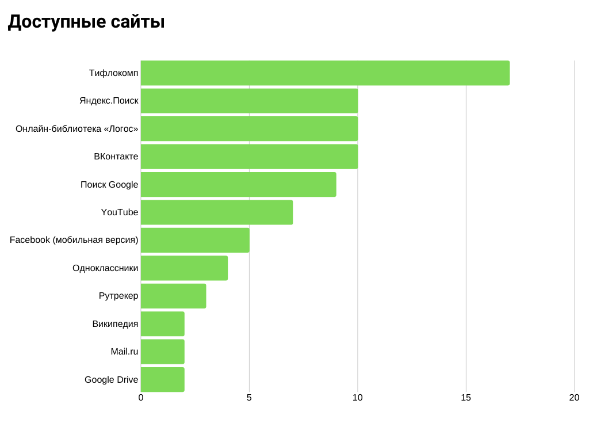
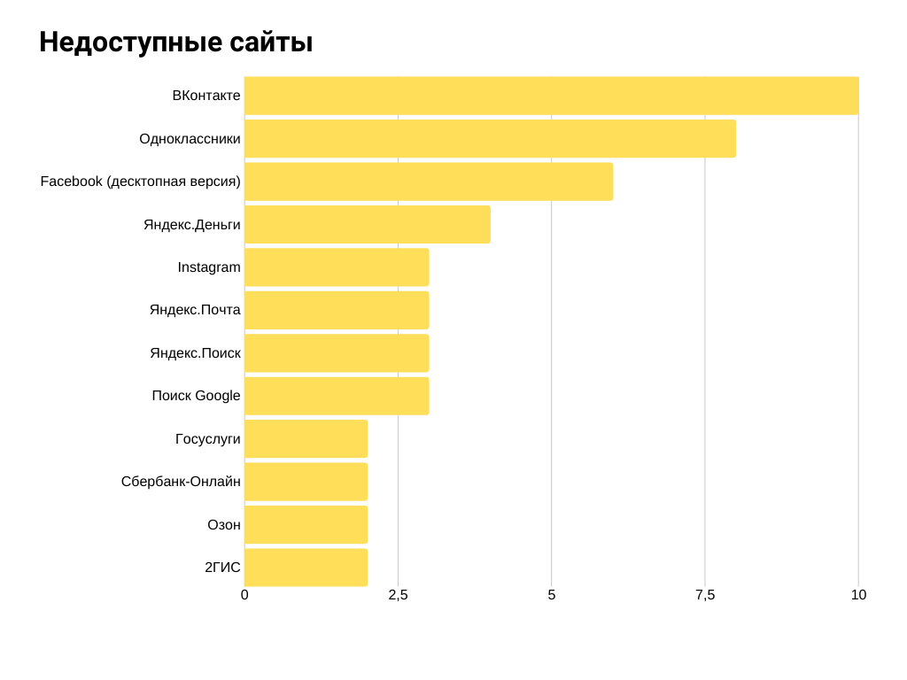

[Сергей Кригер](https://www.sergeikriger.com/) и я проводили опрос с апреля по декабрь 2019 года. В нём участвовало 143 человека. Выборка не самая большая, но хотелось бы поделиться с вами результатами.

Опросник состоял из 10 вопросов, связанных с тем, как люди с особыми потребностями пользуются сайтами и с какими трудностями сталкиваются.

Мы вдохновлялись исследованиями [WebAIM](https://webaim.org/). Эта организация каждый год проводит [подобные исследования](https://webaim.org/projects/) среди англоязычных пользователей.

## 1. Какое у вас ограничение по здоровью

У большей части участников опроса есть слепота или пониженное зрение — 97,9% (140 человек). Когнитивные нарушения у одного человека (0,7%), глухота или тугоухость тоже у одного (0,7%). Наконец, у одного участника опроса сразу несколько нарушений: тотальная слепота, ампутация кистей обеих рук и тугоухость (0,7%).

Изначально нашей целью было опросить как можно больше людей с разным спектром нарушений, но это оказалось сложной задачей.

Такие результаты связаны с тем, по какому каналу распространялся опросник. Например, Сергей участвовал в одном из [тефлостримов](https://tiflo.info/stream/tiflostrim-vypusk-19-veb-dostupnost-2019/). Тефлострим — еженедельный стрим на русском языке, в котором говорят о том, что интересует незрячих и слабовидящих людей. Кроме слушателей стрима в опросе принимали участие некоторые сотрудники и пользователи Санкт-Петербургской библиотеки для слепых и слабовидящих.

## 2. Ваш уровень пользования интернетом

Нам было интересно какой уровень владения техникой у участников опроса.

<figure>
    
    <figcaption>
        Диаграмма с уровень владения техникой.
    </figcaption>
</figure>

Оказалось, что больше всего пользователей со средним уровнем — 59,4% или 85 человек. За ними идут продвинутые пользователи — 38,5% (55 респондентов). Новичков оказалось всего трое — 2,1%.

## 3. С какого устройства чаще всего выходите в интернет?

<figure>
    
    <figcaption>
        Диаграмма с данными о том, какой техникой чаще всего пользуются участники опроса.
    </figcaption>
</figure>

Большинство участников пользуется компьютерами или ноутбуками — 88,1% (126 человек). На втором месте по популярности смартфоны. Ими постоянно пользуются 14 человек или 9,8%. Одинаково часто пользуется и компьютером, и смартфоном два человека (0,8%). Планшетом и смартфоном всего один респондент (0,7%).

## 4. Пользуетесь ли вспомогательными технологиями

<figure>
    
    <figcaption>
        Диаграмма с процентным соотношением пользователей, которые пользуются вспомогательными технологиями.
    </figcaption>
</figure>

Большинство участников пользуется вспомогательными технологиями. Это 140 человек, то есть 97,9%. Трое ими не пользуются — 2,1%.

## 5. Если пользуетесь вспомогательными технологиями, то какими именно

<figure>
    
    <figcaption>
        Вспомогательные технологии, которыми пользуются участники опроса.
    </figcaption>
</figure>

Программами чтения с экрана (скринридеры, экранные дикторы, VoiceOver) пользуются все 100% участников опроса. На втором месте брайлевский дисплей. Его использует 7,7% (11 респондентов). За программируемую клавиатуру проголосовало 3,5% (5 человек). Экранная лупа набрала 3,2% (3).

Специальными мышками (джойстиками, выносными компьютерными кнопками, роллерами) не пользуется никто из опрошенных.

## 6. Если используете вспомогательные технологии, то как научились ими пользоваться?

Интересно было узнать как люди учатся пользоваться вспомогательными технологиями.

<figure>
    
    <figcaption>
        Диаграмма с процентным соотношением того, как пользователи научились пользоваться вспомогательными технологиями.
    </figcaption>
</figure>

Большинство респондентов научились этому самостоятельно. Их оказалось 49,3% (70). 37,1% (45) участников с этим помогли друзья, родственники или знакомые. Частично самостоятельно, частично при поддержке родственников и друзей вспомогательными технологиями научился пользоваться 1 человек — 0,7%. На специальных курсах было 17,6% (25) респондентов. В школе на уроках информатики вспомогательные технологии освоило двое человек — 1,4%.

Один человек (0,7%) написал, что научился этому с помощью учебных пособий и дискуссионных листов для незрячих. Ещё один участник (0,7%) указал конкретное пособие — «Пермский учебник». Вероятно, речь идёт про [«Звуковой учебник для начинающих незрячих пользователей компьютера»](http://www.tiflocomp.ru/docs/audiotb_perm.php).

## 7. Как часто сталкиваетесь с недоступным контентом на сайтах

<figure>
    
    <figcaption>
        Диаграмма, которая показывает как часто пользователи сталкиваются с недоступными сайтами.
    </figcaption>
</figure>

Большинство респондентов иногда сталкиваются с недоступными сайтами — 75,5% (108 человек). Постоянно — 24,5% (35). За вариант «Никогда» не проголосовал ни один из участников.

Из этого можно сделать вывод, что многие сайты недоступны частично, а не полностью.

## 8. Если вы встречаете недоступный контент на сайтах, то с чем вы сталкиваетесь чаще всего?

Было интересно узнать какие же именно элементы в вебе респонденты считают недоступными. В этом вопросе можно было выбрать несколько ответов.

На первом месте по недоступности капча. За неё проголосовало 132 респондента или 92,3%. На втором месте неработающие кнопки и ссылки. Их выбрало 73,4% (105) респондентов. Некоторые участники опроса оставляли более развёрнутые ответы о том, что конкретно не так со ссылками и кнопками.

Респондент 1:

> Ещё очень неудобны пункты, так называемые «onclicable», на которые можно нажать, но они не ссылки и не кнопки.

Респондент 2:

> Вместо ссылки иногда JAWS читает ссылку не как таковую, а просто надпись, и не понятно, что это ссылка или другой элемент управления.

Респондент 3:

> Всё больше сайтов, где элементы управления или навигации вообще не видны для скринридеров, или видны, но их нельзя активировать. У многих страницы перегружены элементами управления или навигации, они путевые, добираться до нужного долго и сложно.

Респондент 4:

> Нет подписи к кнопкам или ссылкам. А может быть и картинка за место подписи.

Респондент 5:

> Неподписанные ссылки (когда скринридер говорит только слово «ссылка»).

Респондент 6:

> Это касается в основном радиостанций, где можно скачать или хотя бы послушать программы, но ссылки на них находятся вне зоны доступа экранного чтеца. Без разницы какой именно скринридер, главное, что полностью отсутствует доступ к нужному мне контенту. Наглядная ссылочка: [https://radio.nv.ua/](https://radio.nv.ua/). И ещё одна: [https://nv.ua/](https://nv.ua/).

Отсутствие `alt` у изображений или их неправильное содержимое вызывает проблемы у 60,8% (87) опрошенных. Неожиданные изменения на странице затрагивают 45,4% (65) участников опроса.

С отсутствием заголовков на страницах или плохо составленными заголовками сталкивается 43,4% (62 человека). По сайту не могут перемещаться с помощью клавиатуры 39,2% (56) респондентов.

51,7% (74) участников сталкиваются с проблемой отсутствия подписей у полей форм. За слишком большое количество ссылок и других интерактивных элементов проголосовало 30% (43 человека).

Один из них отметил:

> Например, если я читаю новости на ria.ru, то после каждой новости показывается много ссылок с рекламой от Яндекса, которая меня совершенно не интересует. Как можно проскочить через эту область с рекламой и перейти сразу к следующей новости с помощью скринридера я не знаю.

28,7% (41) респондентов сталкивается с тем, что на сайтах нет ссылок для перехода к основному содержимому. С отсутствием поля поиска и плохо работающим поиском сталкивается 26,6% (38 человек). За сложные и длинные формы проголосовал 21% (30 респондентов).

Один из участников опроса при этом отметил, что:

> Внутри поля форм клавиатура перестаёт слушаться.

Для 14,7% (21 участник) проблемы вызывает отсутствие субтитров в видео. С проблемами с текстом и ошибками в нём сталкивается 7,7% (11 участников).

Один из респондентов отметил:

> Бесит использование схожих по написанию с русскими латинских символов в русских текстах.

Низкий контраст текста вызывает проблемы у 2,8% (4 человека). Это может быть связано с тем, что многие из участников опроса незрячие и проблема контраста для них не такая острая. 2,1% (3) участника выделили в отдельную проблему чекбоксы и элементы для выбора дат.

Респондент 1:

> [Есть] трудности выбора даты в календарях. Почему-то иногда сложно вызвать его появление.

У 1,4% (2) респондентов есть проблемы с выпадающими списками.

Один их участников опроса написал:

> [Есть] нечитаемые выпадающие списки, из которых кнопками невозможно выбрать нужный пункт.

1,4% (2) участников отметил маленький размер шрифта.

Недоступные всплывающие элементы выделило для себя 0,7%(1) участников опроса, отсутствие версии для печати — 0,7% (1) и фреймы — 0,7% (1). Участники отмечали и проблемы, которые связаны с конкретными скринридерами.

Респондент 1:

> Скринридеры не все элементы фиксируют. При этом JAWS и NVDA могут не совпадать.

Респондент 2:

> Нельзя пользоваться тачпадом, так как NVDA плохо его озвучивает.

Респондент 3:

> Иногда огромная задержка озвучивания содержимого (машина как бы на время «зависает») в некоторых браузерах.

## 9. Назовите три сайта, которые считаете наиболее доступными

Нам было интересно какие же сайты из всех, которыми участники опроса пользуются, они считают наиболее доступными. Получились интересные результаты.

<figure>
    
    <figcaption>
        Диаграмма с доступными сайтами по мнению участников опроса.
    </figcaption>
</figure>

1. [Тифлокомп](http://tiflocomp.ru/) — 17 голосов.
2. Яндекс.Поиск — 11 голосов.
3. [Онлайн-библиотека «Логос»](http://av3715.ru/) — 10 голосов.
4. ВКонтакте (скорее всего мобильная версия) — 10 голосов.
5. Поиск Google — 9 голосов.
6. YouTube — 7 голосов.
7. Мобильный Facebook — 5 голосов.
8. Одноклассники (скорее всего мобильная версия) — 4 голоса.
9. Рутрекер ️ — 3 голоса.
10. [Радио ВОС](http://www.radiovos.ru/) — 3 голоса.

По 2 голоса набрали:

1. Google Drive.
2. Википедия.
3. Mail.ru.
4. [Тифло-пространство](http://tiflo.space/).
5. [Сайт компании Элита Групп](https://www.elitagroup.ru/).
6. [Blind games](https://blind.games/).
7. Интернет-магазин Rozetka.
8. NNM-club.

По 1 человеку проголосовало за: Gmail (новый интерфейс), Google Календарь, Яндекс.Погода, сайт Сбербанка, Сбербанк-Онлайн, сервис по отслеживанию Почты России, Slack, сайт Skype, сайт NVDA, Livejournal, Стихи.ру, ЛитРес, Консультант, Ozon, tutu.ru, погодный сайт Метеонова, портал для инвалидов Disability.ru, Тифло Хост, сайт ВОС, сайт издательства ВОС «Чтение», сайт с образовательными курсами ВОС, Реакомп, zri-sam.ru, сайт ЭлекЖест, Тифложизнь, LIOBlindSoft, Sinoptik, интернет-магазин Petshop, украинский интернет-магазин Comfy, украинский интернет-магазин Фокстрот, сайт фитомагазина «Зелена крамничка», Кинозал, Флибуста, diakov.net, emu-land.net, Регистр лекарственных средств России, remontka.pro, Brainum, сайт Неизвестный гений, LRepacks.ru, информационный портал «ТифлоГродно», мобильная версия новостного портала tyt.by, новостной портал ИноСМИ, Лента.ру, Укрпресса, информационный канал subscribe.ru, новостной сайт ORF.at, 2ip.ru, персональный сайт markmanson.net.

Среди ответов были и развёрнутые.

Респондент 1:

> Мне кажется все сайты доступны, если бы справиться с разного рода мелочами, описанными выше.

Респондент 2:

> Их [сайтов] не так уж и мало. Мобильные версии как правило доступнее основных.

Респондент 3:

> И вообще все службы Google и Microsoft можно брать за эталон за редкими исключениями.

Респондент 4:

> Яндекс самый хороший, а смертельного прям нигде нет.

Респондент 5:

> В основном я в соцсетях. Фейсбук очень даже, как на меня, неплохо устроен, правда с одной оговоркой: автоматическая прокрутка страниц в некоторых местах. И мне приходится жать страницу вверх, дабы вернуться на элемент, с которого я слетел […].
> ВКонтакте тоже недурен в последнее время стал, но недоступна ссылка загрузки видео.

Респондент 7 объясняет почему выбрал Рутрекер и nnm-club:

> rutracker.org и nnm-club.me только благодаря табличной вёрстке и некоторым элементам оформления.

## 10. Назовите три сайта, которые считаете наименее доступными

Интересно было также с какими сайтами участникам опроса пользоваться сложно.

<figure>
    
    <figcaption>
        Диаграмма с недоступными сайтами.
    </figcaption>
</figure>

1. ВКонтакте (возможно, десктопная версия) — 11.
2. Одноклассники (тоже, возможно, десктопная версия) — 8.
3. Фейсбук (десктопная версия) — 7.
4. Яндекс.Деньги — 4.
5. Instagram — 3.
6. Яндекс.Почта — 3.
7. Яндекс.Поиск — 3.
8. Поиск Google — 3.

По 2 голоса набрали:

1. AIiExpres
2. Ozon
3. Mail.ru
4. Госуслуги
5. Сайт РЖД
6. Сбербанк-онлайн
7. ЛитРес
8. 2ГИС
9. Сайт Ростелекома
10. Интернет-магазин Rozetka
11. Рутрекер

По 1 участнику выбрало: Telegram, Twitter, Twitch, YouTube, RuTube, Хабр, Яндекс.Дзен, Яндекс.Диск, Яндекс.Коннект, КиноПоиск, Яндекс.Музыка, Смолкасса Ру, Rambler.ru, Сайт Первого канала, РИА Новости, электронный журнал «Школа жизни», Сайт МТС, Сайт Билайн, Сайт Love Radio, Сайт радио 101.ru, Флибуста, сайт Неизвестный гений, сайт компании Кайтен, сайт сервиса JustClick, сайт TravelPayouts, сервис рассылок Senler, портал Агенство праздник, сайт фитомагазина «Зелена крамничка», онлайн-магазин prom.ua, сайт хостинг-провайдера Reg.ru, панель управления ISP manager, сайт Инсбрукского университета имени.

В этом вопросе тоже были подробные ответы и комментарии от опрашиваемых.

Респондент 1:

> Совсем тяжёлых сайтов, к счастью, не так много. Чаще на них всё путано организовано или есть нечитаемые или неактивируемые элементы. ЛитРес становится всё хуже, Фэйсбук написан очень мутно, на сервисах Яндекс есть проблемные страницы, даже с ВКонтакте не всё гладко. Одноклассники очень мутный.

Респондент 2:

> Так сразу и не вспомню прям совсем недоступные сайты. Но попадаются сайты с досадными ошибками, усложняющими жизнь. Например, на [www.litres.ru](http://www.litres.ru) можно отложить книгу, а добавить в корзину с помощью клавиатуры не получается. Так же была поломана доступность интернет-магазина Ozon, в котором теперь я не могу совершать покупки.

Респондент 3:

> Сложно сказать. В частности, сайты по заказу билетов в кино / на концерты, полная версия сайта РЖД. А в целом сложно что-то выделить. Практически везде что-то доступно нормально, а что-то не очень. С ходу трудно что-то вспомнить.

Респондент 4:

> [Недоступны] все сайты, где много графики и нет подписанных кнопок или нет ссылок с описанием. Особенно сайты, где есть flash-контент. В этих плеерах, как правило, невозможно работать при помощи клавиатуры. Да и мышей. Для слепого очень затруднительно, потому что кнопки не подписаны.

Респондент 5:

> На данный момент не могу таких сайтов назвать. В случае, если какую-то информацию в Google ищу, они иногда попадаются. Однако я могу маленькое неудобство описать. Например, если я хочу на сайте ria.ru подкаст прослушать, то кнопка play или воспроизведение не озвучивает screen reader. Вместо этого NVDA говорит: «Пусто». Но если на сайте youtube.com какой-нибудь фильм смотреть, то там эти кнопки озвучиваются нормально.

Респондент 6:

> 1. [Недоступен] [https://nv.ua/](https://nv.ua/). В данном случае это страничка радио, которое в эфире рассыпается своей разнообразностью, но, по факту, лишь лжёт, ибо к сей разнообразности не дотягивается рука. Ну, разве что, кнопочку прямого эфира нажать можно. Попробуйте найти архив передач! Лишь текст, да и тот скудный. А вообще и их облако не сильно балует разнообразием ориентиров для безподглядника [человека со слепотой], большинство нужно шарить стрелами.
> 2. [https://kazky.suspilne.media/online](https://kazky.suspilne.media/online). Здесь я вообще не вшариваюсь как запустить контент. Нужный находится, а слушать нельзя.
> 3. Радио свобода […] Методом тыка разбираешься средь неозвучиваемых элементов как воспроизвести какое-нибудь видео или аудио. А вообще тут большая проблема большая: запустить прямой эфир нельзя. В целом, такого добра в инете хватает. Я много сайтов подобных видел […].

Респондент 7:

> Яндекс, Сбербанк-Онлайн, Озон: не оптимально, но приемлемо доступны.

Респондент 8:

> [Недоступны] почта Яндекса, 2gis.ru и любые картографические сервисы. И службы Яндекса в целом.

Респондент 9:

> Плохо доступна основная версия Фэйсбука. Тяжело регистрироваться на почтовых серверах, нужно проходить картинки, которые не описаны, и нужно вставлять капчу. Очень плохо читаются соцсети Twitter, Telegram, Instagram и т. п.

Респондент 10:

> [Плохо доступен] [https://vk.com](https://vk.com). Сейчас уже гораздо лучше, чем раньше, но проблемы до сих пор остаются.

Респондент 11:

> [Недоступны] ВК, собственно, все соцсети, новостные сайты, много чего ещё.

## Выводы

Большинство участников опроса считают себя пользователями среднего уровня. Чаще всего они пользуются компьютерами и ноутбуками для выхода в интернет. Подавляющее большинство респондентов пользуется скринридерами и научились этому самостоятельно.

Опрошенные обращают внимание на то, что абсолютно недоступных сайтов они не встречали. Чаще всего недоступны отдельные элементы и страницы.

Самые проблемные элементы на сайтах — это:

- капчи;
- кнопки и ссылки;
- `alt` у изображений;
- поля и подписи к ним в формах;
- заголовки;
- недоступные для клавиатуры элементы;
- слишком большое количество интерактивных элементов на страницах;
- нет ссылки или другой возможности сразу перейти к основному контенту;
- проблемы с поиском по сайту.

Респонденты отметили, что многие мобильные версии сайтов (упрощённые) чаще всего более доступные, чем десктопные. Также среди лидеров по доступности контента специальные сайты для людей с нарушениями зрения.

Мы благодарны всем участникам опроса и неравнодушным разработчикам. Только объединив вместе усилия мы сможем сделать интернет местом, где будет комфортно находиться каждому из нас.

Надеемся, что опрос станет ежегодным и охватит максимальное количество пользователей.
