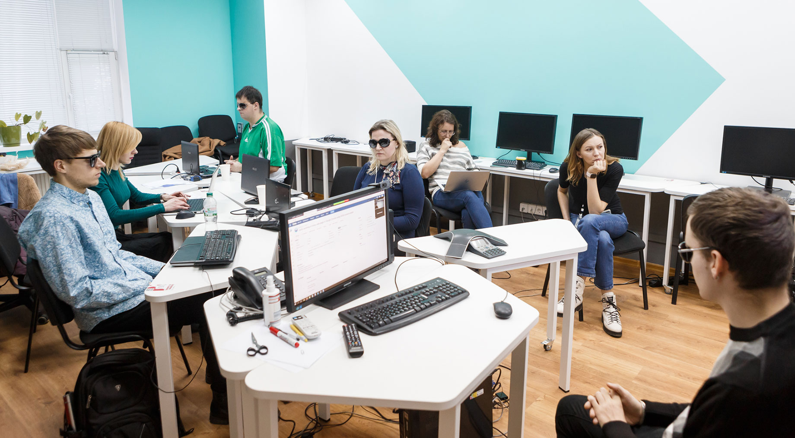
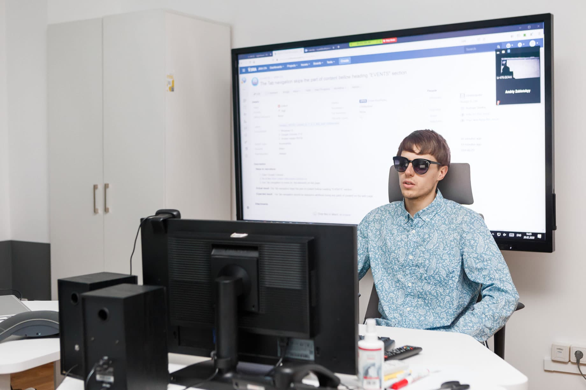
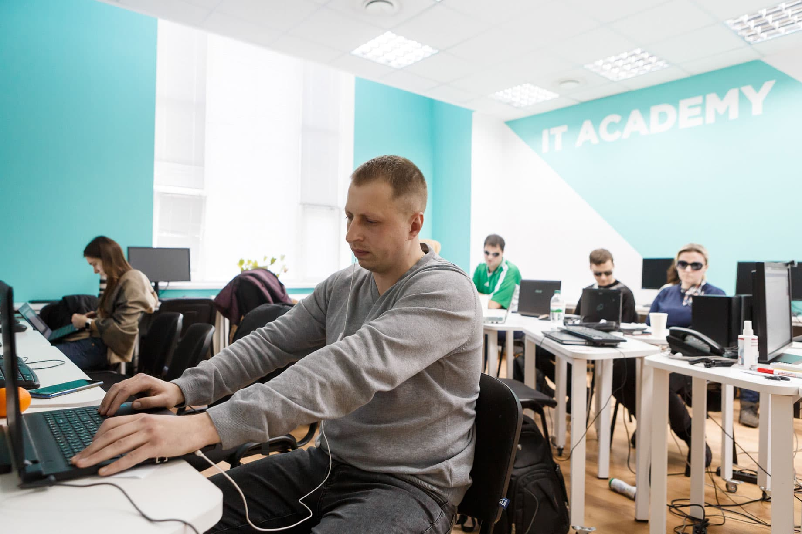
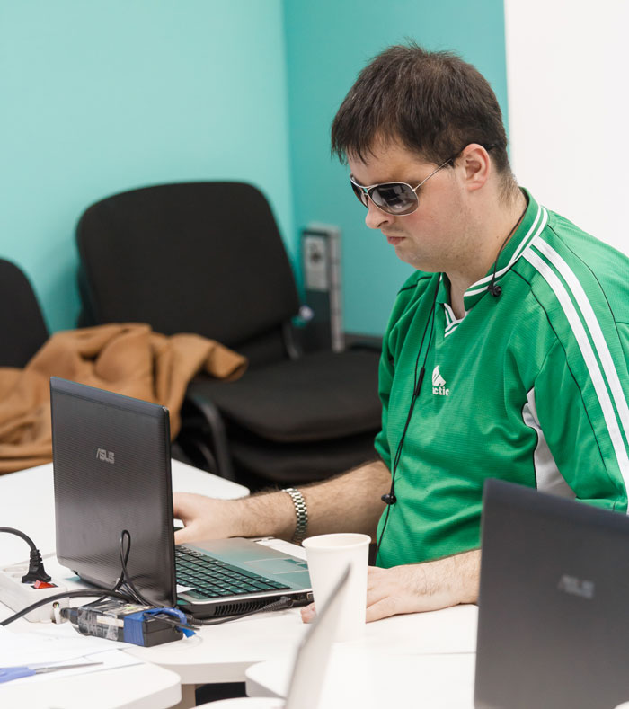
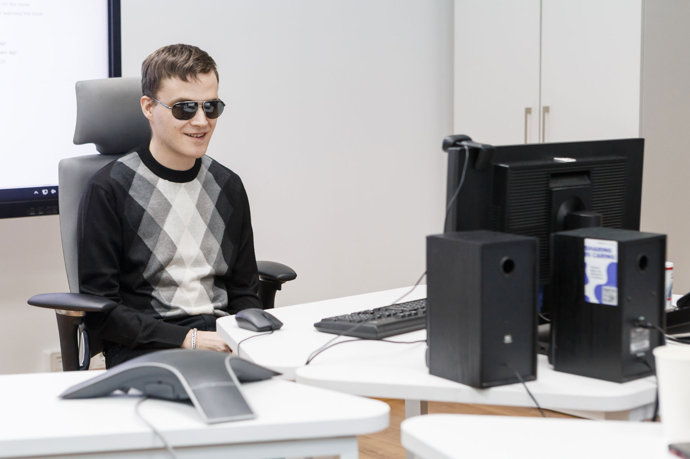
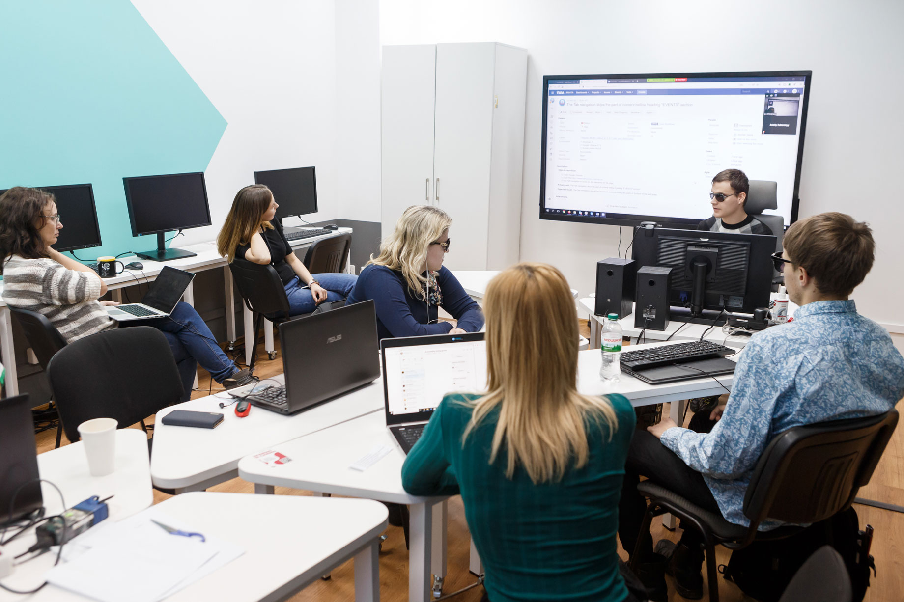

_От редакции: эту статью мы готовили в марте, до начала карантина._

На протяжении двух месяцев во львовском SoftServe училась группа студентов на новом для их IT Academy направлении. Тут готовили пятерых профессионалов по Accessibility Testing.

Журналисты DOU побывали на одном из занятий и узнали, какие именно знания получают будущие тестировщики, в чем особенность Accessibility Testing и зачем готовить таких специалистов.

## Шахматист

В помещении SoftServe IT Academy с минуты на минуту начнется занятие. По коридору быстро шагает парень и случайно задевает плечом двери. Это Владислав Колпаков, один из студентов курса Accessibility Testing, который стартовал в академии два месяца назад. В руках парень держит трость, а темные очки не снимает даже в помещении.

Влад начал терять зрение ещё в детстве. Но это не помешало ему окончить философский факультет Львовского университета им. Франко и добиться успеха в шахматах. Сегодня он — игрок и тренер сборной Украины по шахматам среди людей с нарушением зрения. А ещё в скором времени Влад станет профессиональным тестером сайтов на доступность.

Для парня это первые IT-курсы. Ранее с компьютером он был знаком на уровне обычного пользователя. А теперь с помощью скринридера и полученных знаний сможет с лёгкостью отличить доступный сайт от недоступного, на котором человек с нарушением зрения не сможет найти нужный товар или войти в систему.

«Я сомневался, стоит ли идти на курсы, ведь последние несколько лет у меня неплохой прогресс в шахматах. А эти занятия требуют большой отдачи, много энергии и времени. Собственно, я понимал, что придётся чем-то пожертвовать, поэтому решение принялось нелегко. Но когда есть возможность, ею нужно воспользоваться», — говорит Владислав Колпаков.

<figure>
    
    <figcaption>Владислав Колпаков</figcaption>
</figure>

## Рынок, закон и доступность

Accessibility Testing — это тип тестирования программного обеспечения, которое применяют, чтобы сайт, приложение или что-либо ещё были удобными для использования людьми с нарушением зрения или слуха, поражением опорно-двигательного аппарата, памяти и тому подобного. Специалисты по такому виду тестирования проверяют, соответствует продукт критериям, изложенным в [Web Content Accessibility Guidelines](https://www.w3.org/WAI/standards-guidelines/wcag/) (WCAG). Этот документ — часть из серии руководящих принципов о доступности веб-страниц, которые разработали в [The World Wide Web Consortium](https://www.w3.org/).

Контрастность цветов, размер шрифтов, заголовки разделов, аудиосопровождение страницы, анимация от взаимодействий и корректность многих параметров — всё это описано в документе. Задание тестировщика доступности — определить, где существуют проблемы.

Толчком для создания курсов Accessibility Testing в SoftServe стали требования рынка и законодательства.

Виктория Ширяева, представительница бизнес-подразделения, Senior QA и Project Manager, уже на протяжении двух лет работает с проектами SoftServe, которые имплементируют accessibility.

«В Соединённых Штатах приблизительно у каждого четвёртого есть та или иная форма инвалидности. Так что это гигантский рынок, который потенциально можно потерять. Это бизнес-драйвер. Есть и законодательные драйверы — требования, согласно которым сайты должны быть доступными. Иначе их не допустят к использованию. Особенно строго это регулируется в Америке. В последние годы к этому вопросу более внимательно относится и Европа», — объясняет специалистка.

По её словам, сегодня действует директива Европарламента, где прописано, что европейские страны должны принять закон, который требовал бы от всех публичных сайтов быть доступными. А к 2021 году, согласно документу, необходимо сделать такими и мобильные приложения.

«Так что мы поняли, что это не только благородная цель — помочь с трудоустройством людям с инвалидностью, но и большая потенциальная возможность для SoftServe предоставлять необходимые услуги уже существующим клиентам, а также новым, которые могут обратиться к нам», — подытоживает Виктория.

## Активист

Роману Савке — 34.

15 лет назад он учился во «Львовской политехнике», где осваивал компьютерные науки.

10 лет назад занимался художественным кузнечеством.

Два месяца назад впервые познакомился с командой SoftServe и узнал, что такое Accessibility Testing.

<figure>
    
    <figcaption>Роман Савка</figcaption>
</figure>

Проблемы со зрением у Романа начались во взрослом возрасте. Из-за этого даже пришлось бросить одно из любимых занятий — дзюдо. Врачи сказали, что из-за интенсивных тренировок зрение станет только хуже и есть вероятность его полностью потерять. Сейчас мужчина распознает свет и тени, так что то, как он ориентируется в пространстве, зависит от времени суток и освещения.

Сегодня Роман возглавляет организацию «Равные возможности для всех», которая предоставляет юридические консультации в вопросах защиты прав человека. Со временем её участники планируют разработать рекомендации для правительства, чтобы более эффективно внедрять нормы Конвенции ООН по правам человека на просторах Украины.

А ещё Роман отец двоих детей и единственный кормилец в семье, так как жена находится в декретном отпуске. Поэтому решиться на курсы было непросто: вдруг не хватит навыков, времени или знаний?

«Я не думал, что дойду именно до обучения, тем более до финального этапа. Дело в том, что я не так давно пользуюсь скринридером и не было опыта интенсивной работы с компьютером», — говорит мужчина.

Теперь Роман ощущает себя более уверенным в своих умениях. Курс Accessibility Testing — это три часа занятий в аудитории IT Academy три раза в неделю и регулярные домашние задания. Время, проведённое в аудитории и ночью за домашним ПК, принесло свои результаты. Сегодня Роман разве что шутит, что постоянно ставит кучу вопросов преподавательницам. А они и рады. Говорят, если есть вопросы, значит, человеку действительно интересно, он хочет разобраться в предмете.

## Компьютер, английский и мотивация

Найти таких, как Роман и Владислав, было непросто, хоть и требования к потенциальным участникам курса были невысоки:

знать компьютер на уровне уверенного пользователя;
владеть английским не ниже уровня Intermediate;
быть мотивированным.

«Больше всего людей отсеялось из-за английского. Это не наша прихоть, а реалии рынка, поскольку украинских заказчиков нет. А участникам придётся не только читать литературу, чтобы разобраться в теме, но и общаться с заказчиком или его представителями», — объясняет менторка SoftServe IT Academy Виктория Ряжская.

Умений или знаний в тестировании от кандидатов не требовали. Но они должны были уметь элементарные вещи: найти тот или иной сайт, зарегистрироваться на нём и так далее. Всё это — с использованием скринридера, лупы или другой программы, которая помогает людям с нарушением зрения пользоваться компьютером. Это и было одним из тестовых заданий, которое приближало на шаг к месту на курсах.

«У нас была девочка со зрением −13. Но мы не смогли её взять, потому что она не использовала никакой вспомогательный инструмент. Она впритык подходила к монитору, чтобы увидеть текст, изображение. Но таким образом девушка ознакамливалась с сайтом как обычный пользователь и не смогла протестировать его на предмет accessibility», — уточняет Виктория Ряжская.

Мотивация тоже важна для того, чтобы попасть на курс, поскольку программа, как отмечают представители IT Academy, не так проста. Особенность курса в том, что он содержит в себе много информации, которую нужно освоить за короткое время. Студенты постоянно работают, каждую неделю пишут тесты, делают домашние задания, а ещё должны уделять время своим собственным делам. Поэтому, чтобы доучиться до конца и получить знания, нужно действительно этого хотеть.

«Мы даже нашим студентам говорим: пойдёте на работу, тогда и отдохнёте. Потому что на работе ты работаешь и выкладываешься на полную 8 часов, а во время учёбы на курсах нужно заниматься постоянно — и в аудитории, и дома. И далеко не все, кто подавал заявку, были уверены в своих силах. А некоторые не были готовы принимать что-то новое», — добавляет Виктория.

Всего, говорят организаторы, было около 30 заявок, но желающих — намного больше. Одна из преград — нужно было физически пребывать во Львове и посещать каждое занятие, а не все могут самостоятельно передвигаться.

«Хоть мы и так старались максимально упростить этот момент. Волонтёры привозили людей. Мы не проводили длительные собеседования тет-а-тет с каждым потенциальным участником. Один раз собрали всех. Рассказали на общей встрече о компании, курсах и о требованиях. Потом — двухминутный разговор на английском, чтение короткого текста, его пересказ своими словами и небольшое тестовое задание», — говорит Виктория Ряжская.

## Филолог

<figure>
    
    <figcaption>Іван Яцига</figcaption>
</figure>

Одним из пяти, кого отобрали, стал <nobr>24-летний</nobr> Иван Яцига. Парню даже пришлось отказаться от занятий репетиторством: он готовил учеников к школьным экзаменам по украинскому языку и литературе.

Не так давно Иван окончил Львовский национальный университет им. Ивана Франко. Теперь он филолог, а репетиторство — его основной источник дохода.

«Но я не раздумывал над тем, стоит ли идти на курсы. Репетиторство хоть и основной, но не постоянный заработок. А найти работу сегодня, тем более человеку с инвалидностью, сложно. Я хорошо учился, окончил университет, получил диплом… Впрочем, оказалось, что в реальной жизни филолог не очень кому-то нужен. Я ходил на собеседования в школы, и мне отказывали», — вспоминает Иван.

Иван считает, трудоустройство человека с инвалидностью — проблема на государственном уровне, она глобальна.

«Если посмотреть на перечень профессий, то по большей части люди с нарушением зрения могут быть или массажистами, или… массажистами!» — отмечает студент.

Так что курсы для него — реальный шанс трудоустроиться.

«Мне как филологу, конечно, вначале было смешно от таких слов, как „зашедулить“, „саппортить“. Но потихоньку привык», — с улыбкой добавляет будущий тестировщик.

По словам Ивана Яциги, у курса есть существенное преимущество перед классическим университетским образованием. Тут ты учишься чему-то новому за короткий срок и, если у тебя что-то не получается или что-то не нравится, всегда можно поменять направление. И не надо тратить пять лет жизни, а потом не знать, что делать с этим дипломом.

Правда, теперь парень шутит: пока не пришёл на курсы, пользовался сайтами нормально. А теперь куда не посмотришь — всё недоступное, ведь в голове держишь критерии оценивания веб-ресурсов.

## Теория, практика и результаты

Программа курса Accessibility Testing состоит из теории и практики и в целом похожа на ту, по которой в SoftServe обучают обычных тестеров.

«Наверно, девяносто процентов — это та информация, которую мы даём будущим Manual QA. А вторая часть — именно Accessibility Testing. Естественно, её обычные тестеры не проходят», — уточняет менторка IT Academy Виктория Ряжская.
Сначала студентов ознакомили с критериями доступности сайтов и приложений согласно с Web Content Accessibility Guidelines, демонстрировали различные кейсы. Потом перешли к практической работе, как на проекте.

«Каждую неделю у нас проходит тест по теории. И интересно, что у студентов этой группы оценка выше, чем у остальных, хоть они выполняют те же задания. Единственное отличие — им дают полтора часа на выполнение, а не час, потому что наш тест не рассчитан на людей с нарушениями зрения и им сложно ориентироваться в навигации», — говорит преподавательница.

В конце курса студенты Accessibility Testing сдают финальный тест и должны презентовать собственный проект.

## Англоязычный

Олег Шапай — один из тех, кого тестирование по иностранному языку во время отбора точно не испугало, потому что в университете он изучал английский и немецкий.

«Мне очень вовремя предложили этот курс, потому что я как раз искал работу и думал, что стоит найти то, что будет связано с компьютерами. Согласился на курсы не в последнюю очередь потому, что в Украине и в мире в общем существует большая проблема с доступностью», — уверен Олег.

<figure>
    
    <figcaption>Олег Шапай</figcaption>
</figure>

Ещё до обучения парень давал рекомендации компаниям по поводу того, как сделать сайты более удобными для людей с нарушениями зрения. Однако всё это было на уровне обычного пользователя и базировалось на личном восприятии.

«Иногда было тяжело объяснить разработчику, в чём проблема. А теперь у меня есть фундаментальная база и я знаю, в каких именно документах находятся объяснения и требования», — добавляет он.

Достаточно большое количество домашних заданий на курсах Олега не останавливает. Говорит, что и так много времени проводил за монитором, а теперь может делать это с пользой. Единственная вещь, которая ему не нравится, — необходимость много писать. Парень признается: не любил этого ещё в университете, но тут уже никуда не денешься.

«Что-то протестировать — легко, а вот писать… Пришлось смириться», — с улыбкой отмечает он.

Студент говорит, что важно не просто хотеть, чтобы чем-то было удобно пользоваться, а попробовать изменить ситуацию.

«Например, мы видим, что сайт недоступен. А хочется, чтобы было иначе. Так давайте сделаем его доступным! Но не только для себя, а для всех. Собственно, это одна из тех вещей, которая мотивирует меня учиться тут и двигаться дальше», — говорит Олег Шапай.

## Выпуск и планы

В конце обучения команда взялась тестировать сайт SoftServe. Работают по Agile-методологии, используют Scrum: с митингами для планирования, выполнением заданий и заполнением документации.

Виктория Ряжская говорит, что этот выпуск — уже настоящие эксперты в Web Content Accessibility Guidelines. Она радуется результатам команды и твердит, что у студентов удивительная память.

«Есть 50 критериев, по которым можно проверять сайт на доступность. В документе, который мы используем, они сгруппированы и пронумерованы. И если я попрошу кого-то из наших студентов назвать критерий, например, 1.3.2, то человек не только скажет, что это, но и даст детальное описание, нюансы, когда этот критерий может не применяться, и приведет примеры. Я эти цифры не могу запомнить, а у них всё в голове, будто по полочкам разложено», — отмечает менторка.

На данный момент основной план компании — трудоустроить выпускников на проекты SoftServe. Говорят, если всё пройдет успешно и будет много запросов под Accessibility Testing, второй набор точно огласят. Но пока что из-за карантина этот процесс затягивается, поскольку нет возможности организовать выпускникам онбординг и надлежаще обустроить рабочие места.

«Думаю, если бы мы запускали новый набор, имея такой хороший пример, было бы намного больше желающих и меньше сомнений в том, что такое возможно. Поэтому будем работать на этот результат. Тем более, что у нас уже есть хороший опыт», — говорит Виктория Ширяева.

Олег Шапай убеждён: если их группа получит достойную работу, то покажет, что можно и нужно ломать стереотипы.

«Люди должны понимать, что мы можем быть не только массажистами и преподавателями. IT открыто для всех. И было бы круто, если как можно больше людей с инвалидностью могли научиться всему, что связано с технологиями. То, что происходит сейчас, это классно и вселяет надежду», — говорит Олег.
