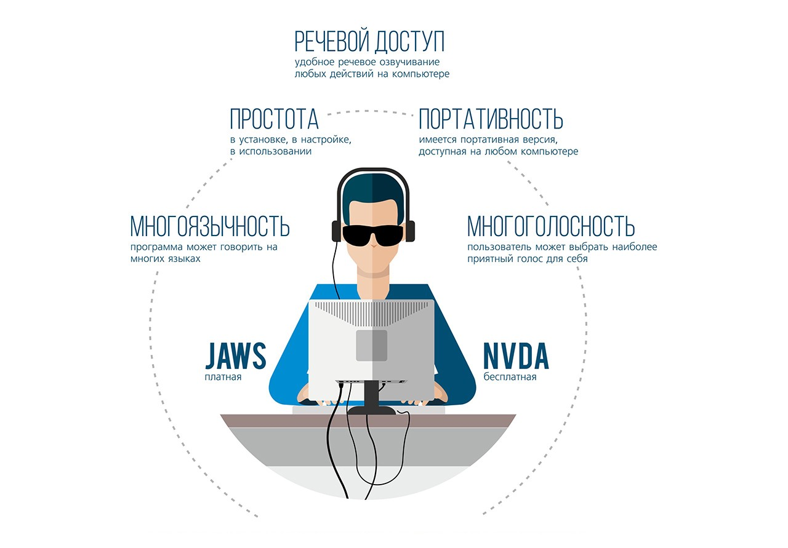

Уже не первый год мы в «Студии 15» занимаемся доступностью сайтов для людей с ограниченными возможностями. Чтобы делать эту работу качественнее и быстрее разрабатываем опенсорсную [библиотеку интерфейсных решений](https://github.com/15web/web-accessibility).

Недавно мы [рассказывали о запуске](http://www.15web.ru/blog/duma_accessibility) специальной версии сайта Законодательной Думы Томской области. Сайт мы тестировали на реальной целевой аудитории: позвали супругов Максима и Ольгу.

Максим потерял зрение в последнем классе школы из-за осложнения после болезни. Он кандидат психологических наук, доцент, преподает в [ТУСУРе](https://tusur.ru/) психологию и занимается социальной работой с людьми имеющими ограниченные возможности здоровья.

Ольга частично потеряла зрение уже будучи взрослой. Она может различать только некоторые силуэты и отличать свет от темноты. Занимается частной психологической практикой.

Мы взяли у Максима с Ольгой интервью и расспросили об их опыте пользования сайтами.

**Как вы работаете с компьютером, какие программы используете, какие бывают проблемы с ними?**

**Ольга:** Я научилась работать на компьютере еще когда была зрячая, то есть на момент потери зрения уже была знакома с основными принципами взаимодействия с ПК. После потери зрения пришлось осваивать специальные инструменты — скринридеры. Самой удобной на тот момент была программа JAWS для Windows. Мне ее установил один слепой парень-программист и научил пользоваться. Да и вообще он меня многому научил, прежде чем я сама смогла уверенно использовать компьютер. Сложнее всего было научиться работать используя только клавиатуру. Слепые не могут нормально использовать мышь и все основные команды подают через неё. Также приходилось заново учиться пользоваться ранее знакомым интерфейсом. Если раньше можно было просто кликнуть на иконку печати и готово — документ уходил в печать, то теперь это уже было невозможно.

**Максим:** Особенность восприятия тех, кто работает со скринридерами в том, что здесь идет последовательная передача информации. Те, кто пользуется и зрением, и слухом могут быстро охватить всю информацию, а те кто используют скринридер должны пройти полностью всю страницу, чтобы найти то, что их интересует.

**Скринридеры сильно отличаются друг от друга? Когда мы проводили тестирование, то столкнулись с различиями.**

**Максим:** Мы хорошо знакомы только с двумя скринридерами JAWS и NVDA. В основном используем JAWS, он платный, но имеет больше функциональных возможностей. NVDA мне нужен чаще всего, если на компьютере нет JAWS или он сбоит и необходимо наладить его работу.

<figure>
    
    <figcaption>Популярные программы для чтения с экрана.</figcaption>
</figure>

**Какая версия JAWS у вас сейчас установлена?**

**Максим:** Мы используем 15 версию, установленную под Windows 7 на одном компьютере и 11 версию под Windows XP на другом.

**Каким браузером удобнее пользоваться при работе со скринридером?**

**Ольга:** В основном, Internet Explorer. Opera не озвучивается, а Chrome в большей степени графический браузер. И вот эту графику скринридеры не озвучивают. Когда я устанавливал Chrome, он у меня вообще молчал.

**Мы тестировали оба скринридера на Chrome и они читали всю необходимую информацию.**

**Максим:** Видимо сейчас что-то изменилось. Когда я попробовал его использовать, у меня это не получилось и на этом мы оставили попытки.

_Сегодня все основные браузеры корректно работают со скринридерами. В том числе Chrome, Opera, Internet Explorer и Firefox — прим. автора._

**Какая конкретно версия Internet Explorer у вас установлена?**

**Максим:** Мы используем 10 версию. А ещё на нашем ноутбуке установлена лицензионная операционная система и мы не стали её обновлять до Windows 10. Причина в том, что уже привыкли к этой версии и заново переучиваться на новую слишком трудозатратно. Кстати, важная для нас проблема, связанная с современными программными продуктами. Каждый раз, когда происходит обновление до новой версии, все старые функции меняют своё местоположение и приходится заново запоминать, где они находятся. Люди вообще склонны выполнять привычные действия.

**С какими проблемами вы часто сталкиваете на сайтах?**

**Максим:** Основная проблема — это графика, которую скринридеры не воспроизводят. Например есть графическая иконка без подписи и мне абсолютно непонятно, что она означает. На портале [ТУСУРа](https://tusur.ru/), чтобы войти в личный кабинет нужно кликнуть на графическое изображение этой ссылки без каких-либо буквенных пояснений. Я с трудом нашёл эту иконку методом тыка. Ещё большой проблемой для слабовидящих, работающих без присутствия зрячих являются капчи, где для обеспечения безопасности пользователю необходимо ввести код с картинки в специальное поле. Раньше был сервис «Web of Visio» куда можно было отправлять отсканированную капчу и результат сразу копировался в буфер обмена. С его помощью работа с капчами была возможна, хоть и не всегда — сильно зашумленные картинки могли не распознаваться.

**Ольга:** Ещё мы сталкиваемся со сложностями при работе с выпадающими списками. Например, когда нужно выбрать правильную дату рождения, скринридер не озвучивает пункты списка и нет никакой возможности по нему ориентироваться. Помимо этого, большим неудобством может стать автоматическое обновление страницы, при котором фокус скринридера меняет своё местоположение. Бывает сложно сориентироваться когда ты выполняешь какую-то деятельность в одной точке страницы, а потом внезапно фокус переносится в другую. Могу добавить, что для слабовидящих очень важно иметь специальную навигацию на странице, иначе очень усложняется работа с сайтом. Например в социальной сети «Одноклассники» на страницах вообще нет заголовков. Чтобы дойти до нужной части страницы — необходимо пройти курсором всю страницу, это требует много времени.

**Максим:** Я часто сталкиваюсь с некорректным воспроизведением таблиц, расположенных на страницах сайта. Скринридер читает таблицу по HTML-коду: сначала название столбцов, потом в этом же порядке ячейки в строках. Например, при чтении таблицы с расписанием пар в университете сперва читаются все дни недели и только потом все пары. Непонятно, что к чему относится. Нужно это учитывать при помещении таблиц на страницу сайта.

**Кроме полной потери зрения, бывает неполная, какие-то патологии. Какие проблемы есть у таких пользователей?**

**Ольга:** Важно понимать, что у всех людей, имеющих нарушения зрения, проблемы самые разные. У одних просто снижена острота зрения, у других цветовая аномалия, у третьих суженное зрение. И тут встает вопрос о том, как покрывать все эти аномалии в рамках одной версии для слабовидящих.

**Получается, какое бы нарушение зрения у человека не было, скринридер универсальный инструмент?**

**Ольга:** Совсем нет, и не потому что скринридер — плохой инструмент. Понимаете, пока человек имеет хоть какое-то остаточное зрение, он не станет пользоваться скринридером точно также как не станет ходить с тростью. Он будет всегда ориентироваться на то зрение, что у него осталось. Даже вот у меня есть какой-то остаток и я всю жизнь пытаюсь им что-то увидеть. Я не ориентируюсь, как полностью слепые, тотально только на слух. Большая часть слабовидящих людей вместо использования скринридера будут увеличивать, растягивать экран, делать все что угодно, но пользоваться глазами, насколько это возможно. Тут психологический момент срабатывает, что использование скринридера — это все равно что быть слепым и ходить с тростью.

**В Томске существуют организации, где незрячих людей учат пользоваться компьютерами?**

**Ольга:** В Пушкинской библиотеке есть отдел «Обслуживания инвалидов по зрению». У них там были специальные курсы, обучающие слепых работе на компьютере. Есть Бийский центр реабилитации, у них там специальные курсы, как профессиональная реабилитация. А вообще очень многие люди самоучки, каждый приспосабливается сам, как может. Часто им в этом помогают специальные пособия по работе с компьютером для слепых.

### **Заключение**

Общение с реальными людьми, которым предстоит пользоваться нашей работой было очень полезным. Это помогло нам открыть множество нюансов, которых не найти в интернете. Еще более важным оказалось тестирование сайта. Обязательно расскажем про детали этого процесса в следующих материалах.
