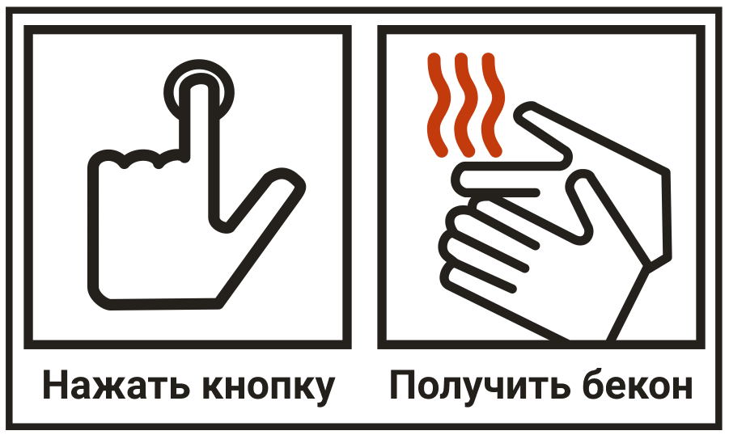
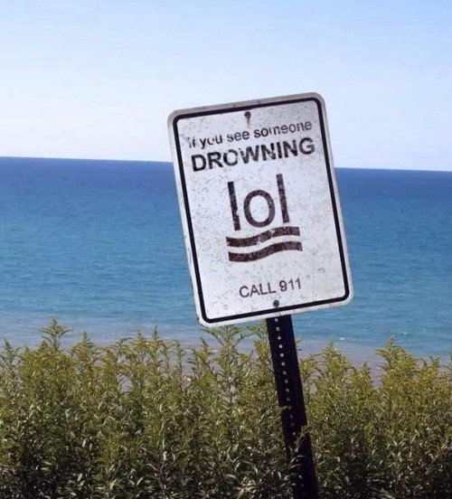

Если вы ищете повод использовать иконки в проекте, то далеко ходить не надо. Как хорошо заметил [Оливер Рейхенштейн](https://ia.net) в своём докладе [«Об иконках»](https://vimeo.com/184776819) на Smashing Conf во Фрайбурге: _«На определённом этапе проекта кто-нибудь обязательно приходит и говорит: нам нужны иконки!»_. Так зачем они нужны людям?

- Иконки помогают заполнять небольшие пространства, где сложно использовать текст.
- У них может быть общепринятое значение, которое не зависит от языка.
- Они — средство индивидуализации.
- Они могут привлечь внимание к важным элементам пользовательского интерфейса.

Вне зависимости от аргументации, нам нужно быть уверенными в том, что люди, которые не могут видеть или распознать иконки, понимают их назначение.

<figure>
    
    <figcaption>Нажать кнопку, получить бекон — это же очевидно.</figcaption>
</figure>

Сами по себе иконки могут неправильно интерпретироваться, что продемонстрировала Мэлори ван Ахтерберг во время своего доклада на Fronteers в 2017. Их самая главная проблема — отсутствие текста. [Текст — самый доступный вид информации в вебе](https://www.w3.org/TR/WCAG20/#guidelines). Скринридеры понимают его лучше всего. Это относится к большинству вспомогательных технологий, например, к приложениям для переводов и брайлевским дисплеям. Поэтому, если на нашей странице есть нетекстовая информация, например, иконки, мы должны добавить текст, который дублирует для пользователей её значение. Иначе мы можем сделать наши интерфейсы сложными для понимания.

<figure>
    
    <figcaption>Что вы сделаете в первую очередь, если увидите, что кто-то тонет? LOL.</figcaption>
</figure>

## Как использовать SVG-графику для иконок

SVG или масштабируемая векторная графика (Scalable Vector Graphic) — это часть спецификации расширяемого языка разметки (Extensible Markup Languag, XML), которая может быть встроена в HTML-документ при помощи элемента `<svg>`, как в примере кода ниже (в нём SVG — стрелка в браузере, указывающая вниз):

```html
<body>
    <svg viewBox="0 0 10 10">
        <path d="m5 9-3-4h2v-4h2v4h2z"/>
    </svg>
</body>
```

В этом простом примере есть всё, что нужно для отображения SVG в [браузерах, которые её поддерживают](https://caniuse.com/#feat=svg). Однако, без указания высоты и ширины, SVG будет отображаться настолько большой, насколько это позволит доступная область просмотра. В примере ниже показано как это исправить:

```html
<body>
    <svg width="10" height="10"
            viewBox="0 0 10 10">
        <path d="m5 9-3-4h2v-4h2v4h2z"/>
    </svg>
</body>
```

Одиночный вспомогательный CSS-класс, присвоенный нашим SVG-иконкам, задаёт им нужное поведение. Затем он переопределяет эти значения и отлично масштабирует иконки в соответствии с размером текста.

```css
.svg-icon {
    /* Разместить иконку выше базового текста. */
    position: relative;
    top: 0.125em;

    /* Не дать иконке сжаться внутри flex-контейнера. */
    flex-shrink: 0;

    /*
        * Масштабировать иконку до размера шрифта родительского
        * элемента.
    */
    height: 1em;
    width: 1em;

    /* Установить для иконки любой цвет, который задан родителю. */
    fill: currentColor;

    /*
        * Если иконка используется в ссылке, для которой задан цветовой
        * переход, мы можем также задать для fill нужное значение
        * transition.
    */
    transition: fill 0.3s;
}
```

Ниже пример HTML-кода:

```html
<body>
    <svg class="svg-icon"
            width="10" height="10"
            viewBox="0 0 10 10">
        <path d="m5 9-3-4h2v-4h2v4h2z"/>
    </svg>
</body>
```

[Я сделал демо на CodePen](https://codepen.io/Nice2MeatU/pen/YNEXMj), чтобы показать, на что способен этот одиночный CSS-селектор. Мы можем увеличить или уменьшить значение `font-size` для параграфа в инспекторе CSS и увидеть, как иконка увеличивается вместе с текстом. Мы также можем изменить значение `color` и посмотреть, как это повлияет на неё. При наведении курсора на ссылку или при фокусе на ней одновременно изменяется как цвет ссылки, так и цвет заливки иконки.

Решая эту проблему, мы сталкиваемся с другой: нам не хватает текстового эквивалента для графики, которую мы добавили на нашу страницу.

## Делаем SVG-иконку доступной

Давайте предположим, что нам нужно создать кнопку, которая переключает видимость навигации по сайту. При первом нажатии на неё навигация будет показана, а при повторном снова скрыта. Надеюсь, что все согласны, что кнопка — это кнопка, и [поэтому она должна быть](https://developer.mozilla.org/en-US/docs/Web/Accessibility/ARIA/ARIA_Techniques/Using_the_button_role) `<button>`. В нашем случае дизайн-макета недостаточно. Всё, что дал нам дизайнер — это иконка гамбургера, без текста. Переключаемся на редактор: добавляем в кнопку SVG.

```html
<button type="button">
    <svg class="svg-icon"
            width="10" height="10"
            viewBox="0 0 10 10"
            role="img">
        <path d="m1 7h8v2h-8zm0-3h8v2h-8zm0-3h8v2h-8z"/>
    </svg>
</button>
```

Теперь нужно добавить немного текста, с которым могли бы взаимодействовать вспомогательные технологии. Используя инлайновый SVG, мы можем добавить элемент `<title>` для первого дочернего элемента `<svg>` и присвоить ему ID. Затем нам нужно сослаться на нужное значение ID с помощью атрибута `aria-labelledby`, который задан открывающему тегу `<svg>`:

```html
<button type="button">
    <svg class="svg-icon"
            width="10" height="10"
            viewBox="0 0 10 10"
            role="img"
            focusable="false"
            aria-labelledby="menu-icon-title">
        <title id="menu-icon-title">Меню</title>
        <path d="m1 7h8v2h-8zm0-3h8v2h-8zm0-3h8v2h-8z"/>
    </svg>
</button>
```

Теперь, когда кто-то установит фокус на кнопке, будет объявлен текст заголовка (некоторые браузеры даже показывают текст внутри `<title>` в виде всплывающей подсказки). Обратите внимание на сочетание атрибута и значения `focusable="false"` в SVG! Это помешает установить фокус на SVG в Internet Explorer и Microsoft Edge. [Это баг](https://github.com/PolymerElements/iron-icon/issues/71), который не исправлен для 10 и 11 версий Internet Explorer.

### У нас есть варианты

Есть другой способ добавить скрытый текст рядом с иконкой. Для него HTML и вспомогательный CSS-класс нужны чуть меньше, и он работает так же как в примере выше.

Вы можете использовать элемент `<span>`, чтобы обернуть текст и визуально скрыть от пользователя. С помощью этого мы предоставляем вспомогательным технологиям описание иконки в текстовом виде, не изменяя дизайна кнопки.

```html
<button type="button">
    <svg class="svg-icon"
            width="10" height="10"
            viewBox="0 0 10 10"
            role="img"
            focusable="false"
            aria-hidden="true">
        <path d="m1 7h8v2h-8zm0-3h8v2h-8zm0-3h8v2h-8z"/>
    </svg>
    <span class="visually-hidden">
        Меню
    </span>
</button>
```

Вспомогательный CSS-класс выглядит так:

```css
.visually-hidden {
    /* Убрать текст из потока */
    position: absolute;

    /* Уменьшить его высоту и ширину до одного пикселя */
    height: 1px;
    width: 1px;

    /* Скрыть выходящие за пределы контейнера элементы или текст */
    overflow: hidden;

    /* Установить для clip нулевое значение */
    clip: rect(0, 0, 0, 0);

    /* Текст не будет перенесён на вторую строку */
    white-space: nowrap;
}
```

### Не сильно отличающийся пример

И вот наши дизайнеры решили добавить другую кнопку с _текстом_ и _иконкой_ рядом с ним. Если у вас есть текст рядом с иконкой, то не добавляйте заголовок и описание, а замените `role="img"` у SVG на `aria-hidden="true"`. Добавление к элементу атрибута `aria-hidden="true"` полностью удаляет его и его дочерние элементы из дерева доступности. Такой элемент не будет доступен для Accessibility API:

```html
<button type="button">
    Меню
    <svg class="svg-icon"
            viewBox="0 0 10 10"
            focusable="false"
            aria-hidden="true">
        <path d="m1 7h8v2h-8zm0-3h8v2h-8zm0-3h8v2h-8z"/>
    </svg>
</button>
```

Поскольку у нас есть текст, который объясняет назначение кнопки, иконка стала просто декоративным элементом. Когда мы имеем дело с декоративными изображениями или графикой, нам нужно скрыть их из дерева доступности.

Вот демо, которое демонстрирует все четыре варианта кнопки: [создание кнопки с доступной SVG-иконкой](https://codepen.io/Nice2MeatU/pen/dqmypX).

Установив фокус на кнопке, скринридер объявит: _«Меню, кнопка»_. Прекрасно. Однако теперь, визуально, мы получили тот же SVG, но с другим кодом. Представьте, что вам нужно добавить иконки в другом контексте, в котором подписи из первого варианта не используются. А потом ещё в одном. И ещё. Этот вариант не идеален.

Нам нужно быть осторожными, и не задать `aria-hidden="true"` для элемента с `role="none"`! У них разные сценарии использования и конечные результаты. [Скотт Охара](https://www.scottohara.me) написал [замечательную статью](https://medium.com/p/ab1241ea9166) о том, когда и какой из атрибутов использовать.

## Пишите меньше кода — используйте спрайт

Процитирую слова [Хейдона Пикеринга](https://www.heydonworks.com) из его доклада [«Пишите меньше чёртового кода»](https://vimeo.com/190834530) с [Beyond Tellerrand Berlin 2016](https://beyondtellerrand.com/events/berlin-2016/speakers): _«Чем меньше кода, тем код лучше! Меньше кода, над которым нужно думать. Меньше кода поддерживать. Меньше данных передавать по сети»_.

Представьте следующую ситуацию: спустя несколько недель наш дизайнер добавил все необходимые иконки в дизайн-макет. У нас есть много разных иконок, с которыми нужно что-то делать, и разные варианты использования: некоторым нужен заголовок и описание, а другие должны быть скрыты. Понадобится много времени, чтобы создать иконки с разными атрибутами и текстовыми описаниями. И поэтому появился SVG-спрайт и сэкономил нам кучу времени!

Разместив пустой `<svg></svg>` в качестве первого потомка открывающего тега `<body>` и скрыв его от всех (зрячих или нет) при помощи инлайнового `display: none`, мы создали пространство для вставки наших иконок. Важно именно инлайново задать `display: none`, потому что мы не хотим, чтобы спрайт был видим при загрузке наших таблиц стилей браузером! Если у вас есть критические стили для сайта, вы можете добавить свойство туда, и не трогать спрайт.

```html
    <body>
        <svg style="display: none"></svg>
    </body>
```

**Примечание**: это только _один_ из множества вариантов создания SVG-спрайта! Есть несколько способов сделать это, но в этой статье невозможно объяснить их все. [Сара Суайдан](https://www.sarasoueidan.com) очень подробно рассказывает о различных [вариантах создания SVG-спрайта](https://www.sarasoueidan.com/blog/overview-of-svg-sprite-creation-techniques/) со всеми преимуществами и проблемами, которые имеются в каждом из подходов.

При использовании SVG-спрайта для системы иконок можете не трогать SVG. Поскольку вы собираетесь использовать одну иконку в элементе `<svg>`, вам понадобится подписать её или вообще скрыть, если она декоративная.

В общем, всегда следует оптимизировать SVG-код независимо от сценария использования. К счастью для нас, поскольку это интернет и в нём есть миллион инструментов, созданных миллионами людей, нам не нужно самим выполнять эту тяжёлую работу.

## SVGO(MG)

Есть много способов оптимизировать и упростить SVG-код перед тем, как добавить его в HTML-документ. Первый и наиболее результативный — открыть SVG в редакторе и удалить всё ненужное вручную. Это также и самый трудоёмкий вариант, и высока вероятность удалить то, что нам могло бы пригодиться потом. Я советую сделать это один или два раза, чтобы лучше понять структуру SVG-файла, но не рекомендую постоянно так делать.

Для тех, кто предпочитает командную строку графическому интерфейсу, есть [svgo](https://github.com/svg/svgo). Мы можем добавить массу параметров для оптимизации SVG: что удалить, что оставить и даже что оставить принудительно. Для тех, кто предпочитает таск-менеджеры, есть [grunt-svgmin](https://github.com/sindresorhus/grunt-svgmin) и точно такой же [gulp-svgmin](https://github.com/ben-eb/gulp-svgmin), в которых используется SVGO. Сара Суайдан сделала [отличный обзор существующих инструментов](https://www.sarasoueidan.com/blog/svgo-tools/) с их преимуществами и недостатками.

Если вам больше нравятся инструменты с графическим интерфейсом, есть [SVGOMG,](https://jakearchibald.github.io/svgomg/) который сделал [Джейк Арчибальд](https://jakearchibald.com). Он такой же мощный как вариант с командной строкой и сразу показывает результат (код и изображение). Вместо того, чтобы писать параметры в нашем терминале, мы можем на правой панели выбрать нужную опцию или убрать её. Единственная оговорка: может быть довольно утомительно загружать и оптимизировать каждую иконку по отдельности.

## Создание спрайта

До использования SVGOMG наши иконки могут выглядеть как в примере ниже. Это зависит от того, какими программами для создания графики вы пользуетесь (в примере показан SVG-код, который был создан в Adobe Illustrator при выборе параметра «Сохранить как»):

```xml
<?xml version="1.0" encoding="utf-8"?>
<!-- Generator: Adobe Illustrator 21.1.0, SVG Export Plug-In.
SVG Version: 6.00 Build 0) -->
<svg version="1.1" id="Layer_1" xmlns="http://www.w3.org/2000/svg"
xmlns:xlink="http://www.w3.org/1999/xlink" x="0px" y="0px"
width="24px" height="24px" viewBox="0 0 24 24"
enable-background="new 0 0 24 24" xml:space="preserve">
    <path d="M7.41,8.59L12,13.17l4.59-4.58L18,10l-6,6l-6-6L7.41,8.59z"/>
    <path fill="none" d="M0,0h24v24H0V0z"/>
</svg>
```

**Примечание:** если выбрать в Adobe Illustrator параметр «Экспорт», то получится более чистый SVG-код!

Открывая SVG в браузере, мы видим угол 90 градусов, направленный вниз. Пропустив этот код через SVGOMG со всеми выбранными чекбоксами, мы получим хороший минифицированный SVG-файл.

**Примечание**: единственная опция, которую не надо выбирать, — это «Remove ViewBox»! Нам часто требуется сохранить для иконок [атрибут viewBox](https://www.sarasoueidan.com/blog/svg-coordinate-systems/#svg-viewbox), чтобы они правильно отображались!

Посмотрим, что осталось после оптимизации:

```xml
<svg viewBox="0 0 24 24">
    <path d="M7.41 8.59L12 13.17l4.59-4.58L18 10l-6 6-6-6 1.41-1.41z"/>
    <path fill="none" d="M0 0h24v24H0V0z"/>
</svg>
```

После добавления SVG-кода в спрайт, нам только осталось слегка его изменить (я добавил переносы строк для того, чтобы код стал более читаемым):

```xml
<svg style="display: none">
    <symbol id="icon-angle-down"
            viewBox="0 0 24 24">
        <path d="M7.41 8.59L12 13.17l4.59-4.58L18 10l-6 6-6-6 1.41-1.41z"/>
        <path fill="none" d="M0 0h24v24H0V0z"/>
    </symbol>
</svg>
```

Мы заменили `<svg>` на `<symbol>` и задали иконке уникальный ID, поэтому можем использовать её в другой части нашей страницы. Самым большим преимуществом этого подхода является возможность бесконечно использовать одну иконку и задавать ей подпись для каждого случая использования. Нет необходимости создавать иконку больше одного раза:

```html
<button type="button">
    <svg class="svg-icon"
            role="img"
            focusable="false"
            aria-labelledby="toggle-nav-icon-title">
        <title id="toggle-nav-icon-title">Меню</title>
        <use xlink:href="#icon-angle-down"/>
    </svg>
</button>

<a href="#next-section">
    <svg class="svg-icon"
            role="img"
            focusable="false"
            aria-labelledby="next-section-icon">
        <title id="next-section-icon">Перейти к следующему разделу.</title>
        <use xlink:href="#icon-angle-down"/>
    </svg>
</a>

<button type="button">
    <svg class="svg-icon"
            aria-hidden="true"
            focusable="false">
        <use xlink:href="#icon-angle-down"/>
    </svg>
    Нажмите на кнопку вниз!
</button>

<p>
    Прокрутите вниз для получения дополнительной информации!
    <svg class="svg-icon"
            aria-hidden="true"
            focusable="false">
        <use xlink:href="#icon-angle-down"/>
    </svg>
</p>
```

С помощью одиночного тега `<use>` мы можем ссылаться на ID этого SVG в спрайте. В примере выше у нас есть четыре разных сценария использования, все с одной и той же иконкой. Мы можем скрыть их, когда они используются как декоративные элементы, или подписать, когда это нужно. Круто!

[Взгляните на демо](https://codepen.io/Nice2MeatU/pen/dqmyaR). Нет никакой разницы между тем, как выглядят иконки, но разница в количестве кода, используемого для их отображения, огромна.

## Заключение

Надеюсь, что этот материал был вам полезен, и вы прямо сейчас готовы использовать SVG-иконки в своих проектах. В этой маленькой статье невозможно объяснить все основные идеи. Чтобы помочь вам глубже погрузиться в океан SVG, я собрал здесь несколько ссылок на другие статьи и книги по этой теме.

## Дополнительные источники

- [Сара Суайдан](https://www.sarasoueidan.com) написала [«An overview of SVG Sprite Creation Techniques»](https://www.sarasoueidan.com/blog/overview-of-svg-sprite-creation-techniques/).
- Она также объясняет, как перейти от иконочного шрифта к SVG-спрайтам в [«Making the Switch Away from Icon Fonts to SVG»](https://www.sarasoueidan.com/blog/icon-fonts-to-svg/).
- [Хезер Мильориси](https://www.hmig.me) рассказывает обо всех упущенных здесь подробностях, как сделать SVG доступным для всех в [«Accessible SVG»](https://css-tricks.com/accessible-svgs/).
- [Сара Дрэснер](https://sarahdrasnerdesign.com) написала замечательную книгу об [SVG-анимации](http://shop.oreilly.com/product/0636920045335.do). В ней есть все советы, которые могут понадобиться для анимации SVG-графики.
- [Скотт Охара](https://www.scottohara.me) написал [подробную статью](https://medium.com/p/ab1241ea9166) о том, когда использовать `role="none"` или `role="presentation"`, а когда `aria-hidden="true"`.
- [Крис Койер](https://chriscoyier.net) собрал вместе довольно много полезной информации и статей на эту тему в [«SVG Compendium»](https://css-tricks.com/mega-list-svg-information/).
- Он также написал книгу [«Practical SVG»](https://abookapart.com/products/practical-svg) для [A Book Apart](https://abookapart.com/).

## Благодарность

Знания, накопленные мной за то время, которое мы говорим об SVG, а также о доступности, получены из книг, постов в блогах и учебных пособий. Также я слежу за профилями людей в социальных сетях, которые работают в этой области и написали эти самые книги, посты и пособия. Конечно же помогли в этом и бесконечные ковыряния в коде, а также написание разных вещей и их ломание.

Итак, без лишних слов, спасибо Леони Уотсон, Лоре Калбаг, Лии Веру, Саре Суайдан, Саре Дрэснер, Вал Хед, Серене Дэвис, Марси Саттон, Кэри Фишер, Зоуи Гилленуотер, Хезер Мильориси, Мэлори ван Ахтерберг, Стиву Фолкнеру, Патрику Лауке, Хейдону Пикерингу, Нилу Милликену, Николасу Стинхауту, Марко Цехе, Хьюго Жироделю, Гуннару Биттерсману, Эрику Бэйли, Алану Далтону, Крису Койеру, Брюсу Лоусону, Аарону Густавсону, Скотту Охаре, всей Paciello Group, A List Apart и A Book Apart, Khan Academy, командам Pa11y и tenon.io, а также тем, кого я забыл здесь упомянуть.

Спасибо всем тем, кто (надеюсь) никогда не сдаётся, и объясняет другим (и мне), почему доступность важна, и как сделать интернет более инклюзивным местом.
