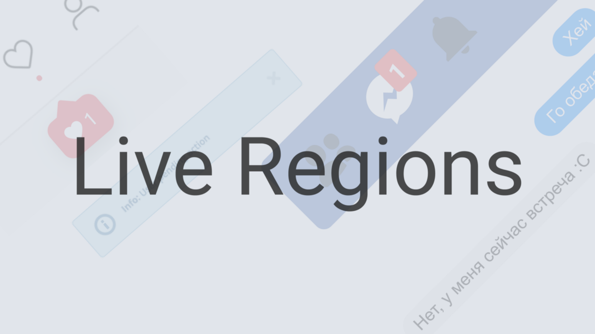

Как сделать изменение контента доступным

Если у вас есть динамически изменяющаяся часть страницы и вы задумались о её доступности, то может возникнуть закономерный вопрос о том, как же это сделать. Это могут быть:

- чаты;
- прогресс-бары и таймеры;
- виджеты с новостями и погодой;
- разные ошибки и оповещения: новое сообщение, лайк, подписка;
- тикеры (биржевая информация о котировках акций, индексов, облигаций), курсы валют;
- спортивная статистика и многое другое.

Раньше вспомогательные технологии (в том числе скринридеры) не умели правильно их обрабатывать. Пользователи не могли узнать о том, появилась ли какая-то ошибка или новые данные до тех пор, пока не возвращались в предыдущий блок или не доходили до конца страницы. Теперь проблему доступности динамически изменяющегося контента страниц можно решить с помощью ARIA.

Если вы не знакомы с этой аббревиатурой, то WAI-ARIA _(англ. Web Accessibility Initiative — Accessible Rich Internet Applications)_ или просто ARIA — это стандарт, состоящий из набора специальных ролей и атрибутов, которые добавляются в разметку и расширяют или дополняют функции стандартных HTML-элементов.

Всё, что нам нужно — это сделать часть страницы, в которой происходят изменения. В терминологии ARIA, это называется «live region» или «интерактивной областью». В стандарте можно найти [такое определение](https://www.w3.org/TR/wai-aria-1.2/#dfn-live-region):

> **Live Region** — это воспринимаемые области страниц, которые обычно обновляются в результате внешнего события, когда пользователь сделал фокус где-то в другом месте. Эти области не всегда обновляются из-за взаимодействия пользователей с ними. Такая практика стала обычным делом в результате активного использования Ajax.

Таким образом, главная цель таких областей — сообщать скринридерам как правильно обрабатывать изменения контента, которые не обязательно зависят от пользователей.

Чтобы сделать интерактивную область на странице, нам нужно просто добавить к любому родительскому элементу ARIA-атрибут `aria-live=""` или специальную ARIA-роль. Тогда изменения всех его дочерних элементов станут доступными для скринридеров. Теперь они будут знать, как обрабатывать обновления содержимого таких элементов.

В ARIA есть несколько таких ролей и атрибутов. Давайте сначала поговорим о ролях.

## Роли интерактивных областей

ARIA-ролей, которые делают часть страницы интерактивной областью, не так много. Используются они вот так: `role="alert"` Вот их полный список:

- `alert`;
- `status`;
- `log`;
- `timer`;
- `marquee`.

Разберёмся с каждой ролью по порядку.

### Alert

Тип интерактивной области, который содержит важную в определённый момент времени информацию. Это может быть сообщение об ошибке, предупреждение, которое появляется на экране после каких-то действий пользователя или без его участия (внезапная ошибка на стороне сервера). Такое сообщение может быть как текстовым, так и звуковым.

Рассмотрим простой пример, в котором мы предупреждаем пользователей о чём-то _действительно_ важном:

    

      Вы слишком долго смотрели в бездну,
      и теперь бездна смотрит в вас.
    

Скринридер моментально объявит его в момент появления и прервёт другое объявление, если оно было.

👉 Для максимальной совместимости используйте `role="alert"` вместе с атрибутом `aria-live="assertive"`. При этом такой элемент всё ещё может быть неправильно объявлен VoiceOver на iOS. Внесём небольшие изменения в наш пример:

    

      Вы слишком долго смотрели в бездну,
      и теперь бездна смотрит в вас.
    

Получается, что мы продублировали уже встроенное в `role="alert"` поведение с помощью значения `assertive` атрибута `aria-live`. Последнее как раз подсказывает скринридерам, что объявить об изменениях нужно немедленно.

### Status

Область с такой ролью содержит дополнительную информацию, которая не особо важна и описывает состояние изменений (status bar). Это может быть информация о том, что действие пользователя успешно или наоборот, что требуется подождать завершения какого-то процесса или где-то есть ошибка. Например, такую роль можно задать сообщению об успешном автосохранении текста или использовать при валидации полей в форме регистрации.

Кстати, в скринридерах есть специальная команда, которая помогает узнать пользователям о статусе. В NVDA она вызывается сочетанием клавиш <kbd>Ins End</kbd>, а в JAWS — <kbd>Ins 3</kbd>.

В примере мы сообщаем пользователям о том, что изменения сохранены:

    

      Мы сохранили ваши изменения автоматически,
      не благодарите.
    

Скринридер объявит это с паузой, а не сразу же, как в случае с `role="alert"`.

👉 В `role="status"` встроено поведение атрибута `aria-live="polite"`. Для максимальной совместимости их рекомендуется использовать вместе. Поэтому пример выше выглядит теперь так:

    

      Мы сохранили ваши изменения автоматически,
      не благодарите.
    

Скринридер сообщит об успешном автосохранении с паузой и не будет прерывать другие объявления.

### Log

Тип интерактивной области, в которой содержатся логи. Например, история сообщений из чатов, список ошибок и тому подобное. Для логов имеет важное значение последовательность, в которой появляется новая информация. Вспомните журнал событий в Windows.

В этом примере показано обновление контента в чате. Когда пользователь вводит сообщение в текстовое поле, то оно добавляется в конец переписки.

    

      <h4>История сообщений</h4>
      <ul>
        <li>
            Одолжишь своего вельш-корги-кардигана
            до понедельника? Очень нужно.
        </li>
      </ul>
    

Теперь скринридер объявляет о новых комментариях после того, как пользователь перестал набирать или отправлять сообщение.

👉 `role="log"` на всякий случай лучше сочетать с атрибутом `aria-live="polite"`:

    

      <h4>История сообщений</h4>
      <ul>
        <li>
            Одолжишь своего вельш-корги-кардигана
            до понедельника? Очень нужно.
        </li>
        <li>Тебя снова взломали?</li>
      </ul>
    

В этом случае все изменения будут наверняка объявляться с паузой и не прерывать другие более важные изменения.

### Marquee

В такой области содержится информация, которая быстро изменяется. Эта роль похожа на `log`, но в этом случае последовательность обновления информации не имеет значения. Простой пример, где может пригодиться `role="marquee"` — тикеры и курсы валют.

В этом примере мы добавляем `role="marquee"` для блока с информацией о курсах валют:

    <ul role="marquee">
      <li>¥ 9999,56 ₽ за юань</li>
      <li>F 100000000000,32 ₽ за фронтендкоин</li>
    </ul>

Скринридер будет объявлять об изменениях в этом блоке тогда, когда пользователь сделает фокус на нём. Курсы валют часто изменяются, поэтому постоянные объявления об этом будут только раздражать пользователей.

👉 `role="marquee"` стоит использовать вместе с атрибутом `aria-live="off"`:

    <ul role="marquee" aria-live="off">
      <li>¥ 9999,56 ₽ за юань</li>
      <li>F 100000000000,32 ₽ за фронтендкоин</li>
    </ul>

Мы просто продублировали поведение `role="marquee"` по умолчанию для максимальной совместимости.

### Timer

Эта роль нужна для тех областей, в которых содержатся счётчики, отсчитывающие время в обычном и обратном порядке. Например, таймер обратного отсчёта, часы или секундомер.

    

      <!-- Тут стремительно утекает время -->
    

В эту роль по умолчанию встроено поведение, при котором скринридер не будет объявлять об изменениях, произошедших с таймером, и пользователь узнает о них только при фокусе на нём.

👉 Элементу с `role="timer"` стоит также задать атрибут `aria-live="off"` для полной совместимости со всеми вспомогательными устройствами и браузерами:

    

      <!-- Тут стремительно утекает время -->
    

Если нужно, чтобы скринридер объявлял об изменениях через определённый интервал времени, то сделать это можно при помощи JavaScript. Нам нужно переключать `aria-live="off"` на `aria-live="polite"` через нужный промежуток времени, например, 60 минут.

## Атрибуты интерактивных областей

Теперь поговорим об атрибутах, которые делают любую область страницы интерактивной. Их всего четыре:

- `aria-live`;
- `aria-atomic`;
- `aria-relevant`;
- `aria-busy`.

Рассмотрим каждый из них.

### Aria-live

Этот атрибут используется для определения важности изменений, которые произошли с элементами.

То есть значения данного атрибута отражают то, насколько срочно и быстро вспомогательным технологиям нужно сообщить пользователям об этих изменениях. У атрибута есть три значения: `off`, `polite` и `assertive`.

- `off` (значение по умолчанию) — указывает на низший приоритет, поэтому такие изменения не объявляются. Это поведение встроено в элементы с `role="marquee"` и `role="timer"`. Его можно задавать тем областям, которые не важны, или слишком быстро изменяются.
- `polite` — обозначает низкий уровень приоритета. Используется в случаях, когда в области происходят изменения, которые вспомогательным технологиям не нужно объявлять моментально. Скринридеры делают перед таким объявлением паузу, не прерывают текущие задачи и ждут, пока пользователь перестанет взаимодействовать с интерфейсом. Так себя ведут элементы с `role="status"` и `role="log"`. Подходит для оповещений о новых сообщениях, лайках, автосохранении и тому подобном.
- `assertive` — указывает на наивысший уровень приоритета. О таких изменениях будет объявлено сразу же, а изменения с более низким приоритетом встанут в очередь и будут объявлены позже. Так себя ведут элементы с `role="alert"`, так что этот атрибут можно использовать для сообщений о важных изменениях, например, о серверной ошибке или о том, что данные не сохранились. Спецификация не рекомендует использовать это значение, когда нет необходимости сразу же сообщать пользователям об изменениях.

Приведу пару простых примеров использования `aria-live="polite"` и `aria-live="assertive"`.

В этом примере с `aria-live="polite"` при нажатии на кнопку с помощью скрипта меняется название блюда в параграфе.

    
Моё любимое блюдо
      лютефиск.
    

    <button type="button">Следующее блюдо</button>

Скринридер сделает перед объявлением паузу.

А здесь у нас есть форма с несколькими настройками и кнопкой сохранения. Если изменения не сохранились, то должно появляться сообщение об этом. Зададим ему `aria-live="assertive"`:

    <form>
      

        <label for="devil-fruit">Любимый дьявольский фрукт</label>
        <input type="text" id="devil-fruit">
      

      …
      <button type="submit">Сохранить настройки</button>
    </form>

    

      Ваши настройки не сохранились,
      попробуйте ещё раз, йо-хо-хо!
    

Здесь скринридер сделает объявление немедленно.

❗ В стандарте WAI-ARIA также указано, что в некоторых случаях вспомогательные технологии могут переопределять значения атрибута `aria-live` и объявлять о каких-то изменениях моментально.

### Aria-atomic

Этот атрибут необязательный и влияет на то, в каком объёме вспомогательные технологии объявят об изменениях: это будет весь контент целиком или только его изменившаяся часть.

У атрибута есть всего два значения — `false` и `true`.

- `false` (значение по умолчанию) — значение, при котором вспомогательные технологии сообщат только об изменениях.
- `true` — при этом значении объявляется весь контент, включая изменившуюся часть.

При выборе нужного значения для `aria-atomic=""` надо понять, важен ли для понимания изменений контекст. В большинстве случаев достаточно оставить значение по умолчанию.

В этом примере важно сохранить контекст, так что можно использовать `aria-atomic="true"`:

    
Моё любимое блюдо
      лютефиск.
    

    <button type="button">Следующее блюдо</button>

Теперь скринридер будет зачитывать всё предложение целиком, а не только ту часть, которая изменяется после нажатия на кнопку.

### Aria-relevant

Цель этого атрибута — сообщить вспомогательным технологиям о том, какие именно изменения произошли на странице и, соответственно, в дереве доступности. Это может быть удаление старого или добавление нового контента. Атрибут необязательный.

`aria-relevant=""` может содержать одно или несколько значений, разделённых пробелом.

- `additions` — на страницу добавлена новая информация.
- `removals` — информация удалена.
- `text` — добавлен новый текст или эквивалентная ему информация, например, новое содержимое атрибута `alt`.
- `additions text` **(значение по умолчанию)** указывает на то, что текст был изменён и появилась новая информация на странице.
- `all` — все возможные значения. Эквивалентно значению `"additions removals text"`.

На самом деле реальных сценариев использования этого атрибута мало. Он либо [не работает во многих браузерах и скринридерах](https://github.com/w3c/aria/issues/712), либо его [советуют вообще не использовать](https://medium.com/dev-channel/why-authors-should-avoid-aria-relevant-5d3164fab1e3) и прибегать к альтернативным методам.

Самый реалистичный сценарий его использования — это список друзей. Когда какой-то друг вышел из сети и больше не активен, то мы можем использовать этот атрибут, чтобы сообщить пользователю об этом. Нам нужно задать для списка `aria-relevant="all"`. Тогда некоторые скринридеры объявят об удалении контакта. Это работает в JAWS, когда удаляется дочерний элемент (с родительским уже не работает). На VoiceOver и NVDA этот атрибут никак не влияет.

### Aria-busy

`aria-busy=""` даёт вспомогательным технологиям знать, обновляется ли сейчас содержимое элемента или нет. Атрибут имеет смысл применять тогда, когда на странице происходит автообновление контента. Что-то было удалено, что-то добавлено, какая-то его часть изменилась, и обо всё этом нам надо сообщить сразу за один раз. Это может быть полезно в случаях, когда на нашей странице есть спортивная статистика, которая обновляется в режиме реального времени, текстовый документ, который может редактировать несколько человек, какой-то новостной виджет или виджет с погодой.

У `aria-busy=""` есть два значения — `false` и `true`.

- `false` (значение по умолчанию) — при этом значении вспомогательные технологии не ждут, пока изменения завершаться.
- `true` — это значение говорит вспомогательным технологиям, что им нужно подождать, пока элемент не закончит изменяться, после чего они могут собрать все изменения и сделать объявление. То есть во время обновления контента пользователи скринридеров, например, не смогут читать эту обновляющуюся часть.

В примере ниже у нас есть спортивные результаты, которые регулярно обновляются в ходе соревнований:

    <h2>Текущий счёт</h2>
    
9:0

Для того, чтобы вся информация объявлялась после всех изменений, сначала добавим атрибут `aria-busy` со значением `true`, а потом, с помощью JavaScript, заменим его значение на `false` или вообще его удалим, когда все изменения завершатся.

## Краткие выводы

Если у вас на странице есть часть, содержимое которой изменяется, то нужно сделать её интерактивной областью. Тогда скринридеры смогут держать своих пользователей в курсе всех изменений. Сделать такую часть интерактивной можно с помощью `role="alert"`, `role="status"`, `role="log"`, `role="marquee"`, `role="timer"` и атрибута `aria-live`.

Используйте `role="alert"` для важных ошибок, предупреждений. Для большей совместимости добавляйте её для нужных элементов вместе с атрибутом `aria-live="assertive"` и `aria-atomic="true"` (опционально).

`role="status"` подходит для сообщений о менее важных ошибках и предупреждениях. Например, сообщение об автосохранении, неправильно заполненном поле и тому подобное. Для совместимости следует сочетать эту роль с атрибутом `aria-live="polite"`.

Если вам нужно сделать доступными историю сообщений, список ошибок и что-то, где важна последовательность обновления информации, используйте `role="log"`. Для большей совместимости используйте вместе с ней атрибут `aria-live="polite"`.

Когда у вас на странице есть тикеры, курсы валют или любой другой элемент, информация в котором быстро изменяется, то задайте для них `role="marquee"`. Для совместимости дополните её `aria-live="off"`.

Для таймера, счётчика или секундомера задавайте `role="timer"`. Не забудьте о `aria-live="off"` для лучшей совместимости.

За то, насколько срочно нужно сообщить об изменениях, отвечает `aria-live=""`. Там, где об изменениях не нужно объявлять, используйте `aria-live="off"`. В большинстве случаев не нужно срочно сообщать об изменениях, поэтому в них пригодится `aria-live="polite"`. Иногда, когда речь идёт о важном сообщении, например, серверной ошибке, можно использовать `aria-live="assertive"`.

`aria-atomic=""` — необязательный атрибут. Он влияет на то, сообщит ли скринридер о контексте или объявит только об изменениях. По умолчанию всем элементам задан `aria-atomic="false"`, то есть скринридеры сообщают только об изменениях контента. Если заменить его на `aria-atomic="true"`, то скринридеры будут зачитывать всё целиком, включая неизменную часть. В большинстве случаев нет необходимости изменять поведение по умолчанию.

Ещё один необязательный атрибут — `aria-relevant=""`. Он нужен для определения типа изменений контента. У него есть несколько значений, которые можно перечислять через пробел. Реальных сценариев использования мало (удаление или добавление друга в список друзей), а многие скринридеры его игнорируют.

Последний необязательный атрибут — `aria-busy=""`. Сообщает вспомогательным технологиям обновляется ли сейчас содержимое элемента или нет. По умолчанию элементам задан `aria-busy="false"`. Скринридеры объявляют об изменениях не дожидаясь, пока они завершатся. В некоторых случаях можно использовать `aria-busy="true"`, когда нужно дождаться всех обновлений. Может быть полезно для спортивной статистики или текстового документа в режиме группового редактирования.

## Что ещё можно почитать

- Стандарт [WAI-ARIA 1.2](https://www.w3.org/TR/wai-aria-1.2/).
- Заметка [Hiding and Updating Content](https://developers.google.com/web/fundamentals/accessibility/semantics-aria/hiding-and-updating-content) на Web Fundamentals.
- Несколько примеров использования ARIA-атрибутов в [ARIA Live Regions](https://developer.mozilla.org/en-US/docs/Web/Accessibility/ARIA/ARIA_Live_Regions) на MDN.
- [ARIA Live Regions](https://medium.com/@rishabhsrao/aria-live-regions-6cc96e1a8b72) Ришабха Рао.
- Перевод статьи [Как сделать сообщения об ошибках доступными](https://medium.com/high-technologies-center/как-сделать-сообщения-об-ошибках-доступными-1400134a59cc) Хидде де Вриса.
