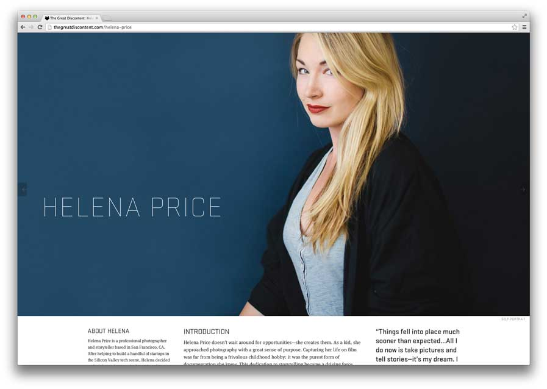
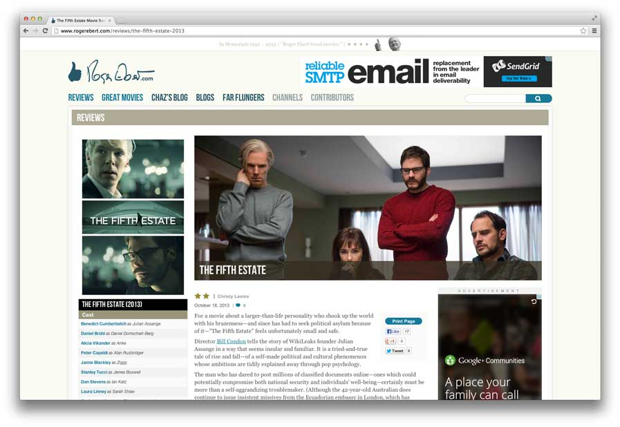
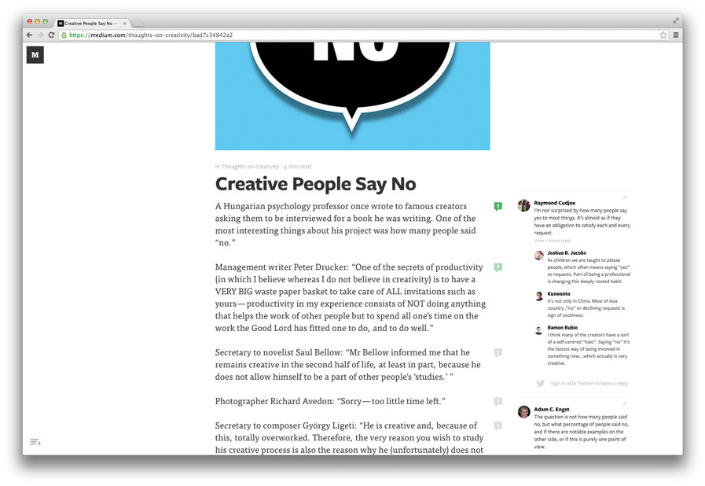
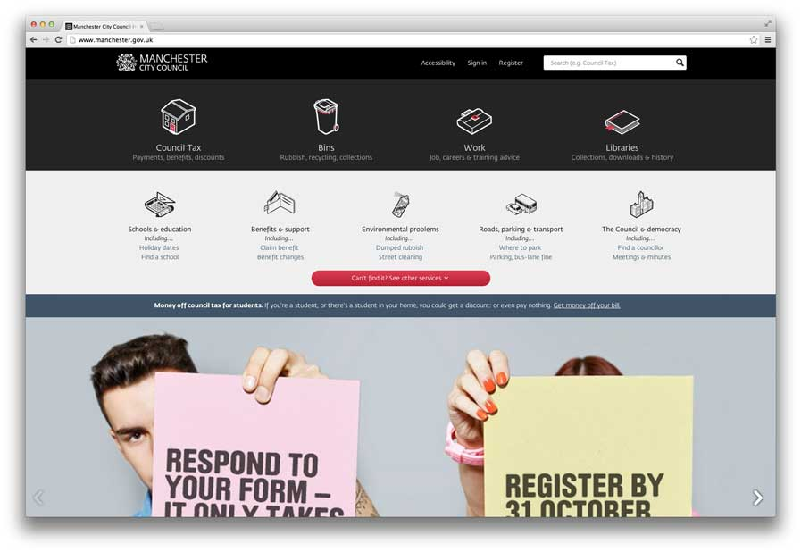
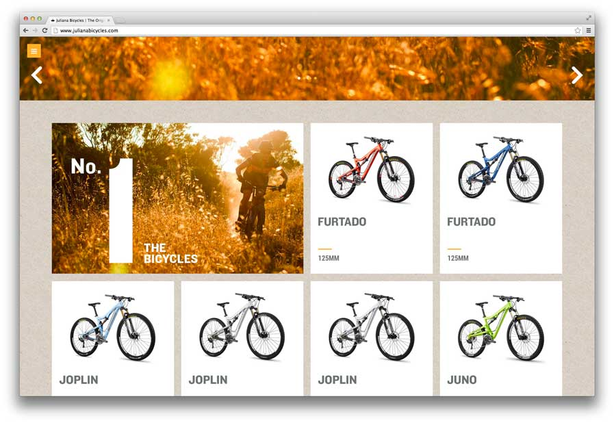
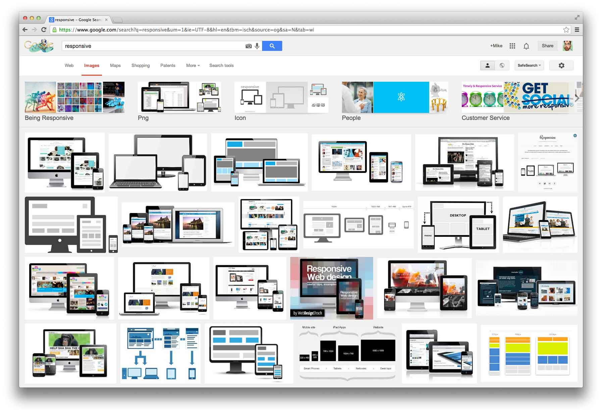
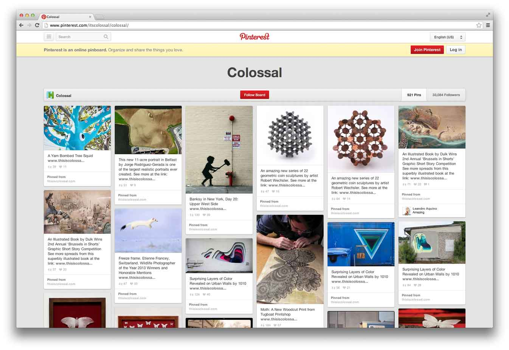
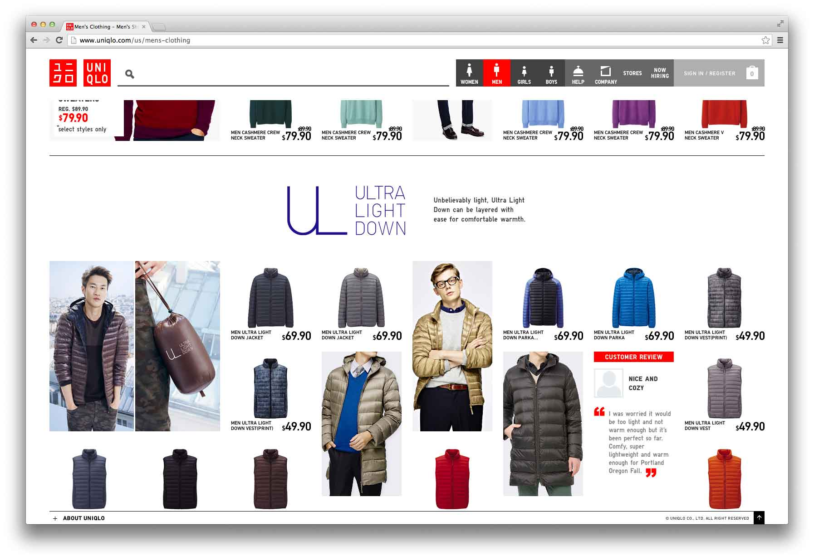
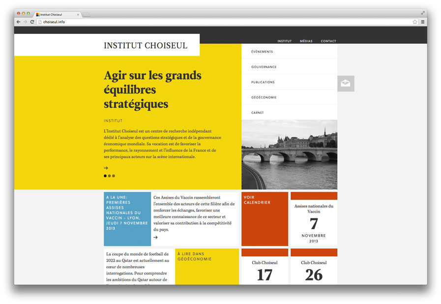

Прошло больше трёх лет с тех пор, как [адаптивный веб-дизайн](http://alistapart.com/article/responsive-web-design) начал появляться в наших портфолио. Сегодня мы имеем солидный набор решений для создания сайтов, достойно отображающихся на маленьких устройствах. А как насчёт больших экранов?

Для сайтов гибкий дизайн стал привычным. Мы растягиваем или сужаем содержимое страницы, чтобы как можно лучше заполнить доступную ширину экрана. Однако многие из таких сайтов ограничены максимальной шириной в 960 пикселей, из-за чего на современных широких экранах остается много пустого пространства.

Проектирование дизайна сайтов для больших экранов — дело непростое: отрицательные отступы, масштабирование, плотность пикселей и раскладки для различных устройств — сетки, модули и колонки — всё это может изменить акценты и усложнить страницы.

Плюс к этому, большие экраны обычно имеют горизонтальную ориентацию, которая плохо подходит для вертикально-ориентированных веб-страниц. Как у маленьких, так и у больших экранов есть свои диапазоны размеров и разрешений, но в случае с большими экранами разница будет более ощутима: от 11-дюймовых ноутбуков до огромных 30-дюймовых мониторов.

Учитывая эти сложности, неудивительно, что многие сайты, даже сайт, на котором вы читаете статью _(речь идет о сайте [alistapart.com](http://alistapart.com/) — прим. ред.)_ спроектированы под разрешение 1024×768. Но время, когда сайты были вынуждены вписываться в наиболее популярное разрешение экрана, прошло. Сегодня [большинство пользователей имеют экраны гораздо шире 1024 пикселей](http://gs.statcounter.com/#resolution-ww-monthly-201311-201411), и раскрытое на всю ширину окно браузера превращает тщательно продуманный сайт, дизайн которого ограничен шириной 960 пикселей, в [монолитный памятник](http://www.tcm.com/mediaroom/video/474162/2001-A-Space-Odyssey-Movie-Clip-Monolith.html) посреди чистого поля.

С каждым годом всё больше пользователей [выходят в интернет с мобильных устройств](http://gs.statcounter.com/#mobile_vs_desktop-ww-monthly-201311-201411), и, естественно, имеет смысл прилагать усилия к созданию сайта, которым было бы удобно пользоваться на маленьких экранах. Более того, мобильными раскладками можно прекрасно пользоваться и на любых устройствах, в том числе с большими экранами. А вот сказать тоже самое про десктопные раскладки, просматриваемые на экранах мобильных, нельзя.

Проектируя дизайн, адаптированный к показу на больших экранах, дизайнеры имеют возможность работать с большим пространством, показывать больше содержимого при меньшей вертикальной прокрутке, делая, таким образом, посещение сайта значительно удобней. А используя те же приемы, с помощью которых мы адаптируем сайты для мобильных устройств, нам не придется увеличивать стоимость разработки или тратить на это больше времени.

## Испытание содержимым

Как и в работе с любым другим дизайном, главное внимание при адаптации дизайна сайтов для больших экранов уделяется содержимому. Длинные или короткие тексты, фотографии, товары интернет-магазинов, видео или веб-приложения могут быть по-разному представлены на экранах разной ширины.

Фотографии, результаты поиска и другое содержимое, вписывающийся в сетку, прекрасно подходят для широких экранов. Одновременный показ как можно большего количества содержимого позволяет пользователю быстро просматривать и сравнивать результаты поиска.

А вот длинные тексты могут стать серьезным испытанием при адаптации сайтов к широким экранам. Если строки слишком длинные, чтение становится неудобным, а если слишком короткие — может возникнуть ощущение нервозности и ускорения, и как следствие — нарушится комфортный ритм восприятия текста.

Чтение должно быть удобным. Для этого дизайнеру необходимо сбалансировать ширину текста ([длину строки](http://en.wikipedia.org/wiki/Measure_(typography))) исходя из размера и межстрочного интервала каждой строки. Известно, что классическая длина одной строки текста 7–10 слов ([по Йозефу Мюллеру-Брокману](http://www.amazon.com/Systems-Graphic-Systeme-Visuele-Gestaltung/dp/3721201450)) или 45–75 символов ([по Роберту Брингхёрсту](http://www.amazon.com/Elements-Typographic-Style-Version-Anniversary/dp/0881792128/)). Просто для информации: Брингхёрст также подмечает, что строка в традиционной книжной колонке должна быть примерно в 30 раз больше, чем используемый размер шрифта, но это число может варьироваться от 20 до 40.

Чем шире текст, тем больший межстрочный интервал можно использовать. Это делает более удобным перемещение от строки к строке. Но слишком большой межстрочный интервал может привести к тому, что излишне разреженный текст станет напоминать студенческую работу. При этом надо понимать, что, когда размер текста увеличивается, число строк, помещающихся на экране, уменьшается, вынуждая постоянно прокручивать и мешая «погружению» читателя. Простое масштабирование текста — не самое удачное решение для широких экранов.

## Работа с длинными текстами

Сайт [The Great Discontent](http://thegreatdiscontent.com/) демонстрирует достаточно искусную адаптацию к широкому экрану, без фанатичного стремления заполнить каждый пиксель в окне браузера. Первая картинка в статье растягивается на всю доступную ширину, создавая ощущение визуальной целостности страницы. Содержимое статьи центрировано и ограничено сравнительно узкой шириной, а дополнительная информация, цитаты и картинки выносятся уже за пределы содержимого. Такой вынос содержимого создает асимметрию, которая дополняет растянутую на всю ширину картинку на первом экране — создавая иллюзию полноэкранного представления без ущерба для читаемости. Но не забывайте, что такие большие картинки, как эта, могут быть дорогими с точки зрения быстродействия, поэтому обязательно учитывайте баланс между качеством картинки и [допустимым весом страницы](http://alistapart.com/article/improving-ux-through-front-end-performance).

<figure>
    
    <figcaption>The Great Discontent использует большие картинки в начале каждой статьи.</figcaption>
</figure>

<figure>
    
    <figcaption>Сайт Роджера Эберта масштабирует большинство элементов на странице, увеличивая их и сокращая видимую часть содержимого.</figcaption>
</figure>

Недавно обновившийся сайт Роджера Эберта (Roger Ebert) справляется с адаптацией к широким экранам, увеличивая максимальную ширину страниц и увеличивая элементы пропорционально ей. Вообще, в теории это могло бы сработать. Но на практике получилось не очень. Например, заголовки увеличиваются не только по горизонтали, но и по вертикали, а это означает, что количество видимого содержимого резко уменьшается. Странно и то, что главное содержимое не увеличивается пропорционально другим элементам страницы, и выглядит карликом по сравнению с ними, имея, вдобавок, слишком маленькую ширину для основного содержимого.

<figure>
    
    <figcaption>Medium располагает комментарии рядом с текстом на свободных полях.</figcaption>
</figure>

Показывать на полях связанное или дополняющее содержимое (например, комментарии на сайте [Medium](https://medium.com/thoughts-on-creativity/bad7c34842a2)) — хорошая идея для отображения длинных текстов на больших экранах. Если экран недостаточно широкий, текст статей растягивается на всю ширину и сдвигается в сторону, если пользователь читает комментарии. Если же места на экране достаточно — комментарии просто занимают доступное пространство на полях.

Мне всегда нравилось, как сайт [Grantland](http://www.grantland.com/story/_/id/9973203/the-colorado-avalanche-edmonton-oilers-rebuilds) использует правую колонку для пометок. Пометки, с одной стороны, используют преимущество больших экранов, и в то же время фокусируют внимание на центральной колонке. Фотографии, врезки, дополнения, цитаты и другое связанное содержимое на широких экранах может быть вынесен на поля. Это позволит дизайнеру как расширить вертикальную сетку за счет внешних полей, так и создать визуальное разнообразие, сохранив при этом расположение основного содержимого.

Такие новые возможности CSS, как [мультиколонки](http://dev.w3.org/csswg/css-multicol/) и [регионы](http://html.adobe.com/webplatform/layout/regions/), могут сделать чтение длинных текстов на широких экранах удобнее. Мультиколонки поддерживаются большинством современных браузеров. Их можно использовать внутри статей, с одной стороны, максимально заполняя доступное пространство экрана, а с другой — оставляя текст читабельным. Если у вас большой экран, посмотрите [мой пример с колонками](http://d.alistapart.com/386/surveying_the_big_screen/demo/) на основе этой статьи.

Что до прогрессивного улучшения, то старые браузеры, не поддерживающие эти свойства, просто покажут единственную колонку соответствующей ширины.

## Разделение содержимого на части

Деление содержимого на части позволяет сделать взаимодействие пользователя с информацией на насыщенных содержимым страницах быстрым и эффективным. Это очень естественно вписывается в концепцию адаптивности дизайна, так как позволяет варьировать, показывается ли содержимое целиком или же разбивается на столбцы в зависимости от размеров экрана.

На больших экранах преимущество этой техники состоит в том, что блок содержимого или группа блоков могут быть представлены по-разному на экранах разной ширины. Что позволяет улучшить читаемость и создать нужное эмоциональное воздействие. Хороший пример применения этого метода — сайт [Manchester City Council](http://www.manchester.gov.uk/). Он использует ограниченные по ширине группы модулей и врезки фотографий, занимающие всю доступную ширину. Страница плавно адаптируется к различным размерам экрана, подстраивая ширину и сетку каждой части содержимого.

<figure>
    
    <figcaption>Сайт Manchester City Council и разделение содержимого на части.</figcaption>
</figure>

<figure>
    
    <figcaption>Сайт Juliana Bicycles использует прием разделения содержимого более изящно.</figcaption>
</figure>

Сайт [Juliana Bicycles](http://www.julianabicycles.com/) использует более изящный подход к делению содержимого на части. Он комбинирует большие горизонтальные блоки во весь экран с группами разделенного на небольшие части содержимого. Главная навигация сайта представлена в виде полноэкранной карусели с насыщенными графическим фоном. Содержимое разделено на небольшие блоки, у которых есть поля. При просмотре с планшета или мобильного устройства эти поля исчезают. Бумажная текстура в фоне заполняет пространство между модулями, а на широких экранах и все доступное пространство. Конечно, большие изображения могут дорого обойтись при загрузке страницы, но это отличный способ зацепить пользователя. Способ показывать, а не рассказывать.

## Плиточное расположение содержимого

Очевидное преимущество большого экрана — возможность увидеть много содержимого одновременно.

<figure>
    
    <figcaption>Google Images показывает столько картинок, сколько вмещает окно.</figcaption>
</figure>

С содержимым, напоминающим коллекцию, например фотографиями, расположение плитками помогает эффективно использовать большой экран. Мы ежедневно наблюдаем это, когда [ищем картинки в Google](http://www.google.com/search?q=responsive&um=1&ie=UTF-8&hl=en&tbm=isch&source=og&sa=N&tab=wi) — результаты заполняют весь экран, предоставляя широкий выбор уже при первом просмотре.

<figure>
    
    <figcaption>Плиточное расположение элементов на Pinterest обыгрывает идею скрапбукинга или коллекционирования.</figcaption>
</figure>

[Pinterest](http://www.pinterest.com/itscolossal/colossal/) использует плиточную раскладку для изображений с подписями. Пространство между плитками позволяет смягчить чрезмерно перегруженную страницу. На больших экранах блоки с картинками выглядят уходящими в бесконечность. На сайте, где поведение пользователя сводится к быстрому созданию своей подборки, заполнение экрана небольшими изображениями как раз и позволяет пробежать глазами по всей коллекции и получить удовлетворение от завершенности картины.

<figure>
    
    <figcaption>Широкоэкранная версия сайта Uniqlo позволяет покупателям сравнивать товары визуально.</figcaption>
</figure>

Сайт [Uniqlo](http://uniqlo.com/) использует широкую раскладку, заполненную картинками, хорошо продуманную и достаточно воздушную. Товары разделены на группы большими заголовками, которые выступают разделителями между наборами товаров и добавляют в раскладку «воздуха». Расположение продуктов широкими рядами позволяет покупателям быстро сравнивать товары. В то же время, пустые пространства, фото моделей и различные размеры блоков добавляют изысканности внешнему виду и восприятию и помогают усилить впечатление, что дизайн — важное отличие продуктов Uniqlo.

Ни Pinterest, ни Google не являются адаптивными сайтами — у них есть отдельные версии для пользователей мобильных устройств. Сайт Uniqlo также адаптирован только для больших экранов, маленькие устройства получают самый узкий вариант десктопной раскладки. Так что пока эти сайты не могут быть идеальными примерами отзывчивого дизайна, но мы можем использовать их как образцы применения хороших практик.

## Графические техники

Другая интересная техника для адаптации сайтов к широким экранам скорее основана на классическом печатном дизайне, чем на реструктуризации и манипуляции содержимым.

<figure>
    
    <figcaption>Элементы сетки растягиваются к границам окна на сайте Institut Choiseul.</figcaption>
</figure>

Сайт [Institut Choiseul](http://choiseul.info/) ограничивает содержимое страниц центрированной структурированной сеткой, но эффектно обыгрывает пустое пространство возникновением цветных полей, уходящих из центральной колонки к краям экрана. Ссылка «наверх» возникает в нижнем левом углу при прокрутке — маленький штрих, подчеркивающий целостность окна. Жесткая сетка и большие цветные поля придают сайту спокойный солидный тон, напоминающий швейцарский стиль в типографике 50х-60х гг.

<figure>
    
    <figcaption>Сайт Kanselarij der Nederlandse Orden использует тянущуюся центрированную сетку и асимметричные цветовые вставки</figcaption>
</figure>

Сайт [Kanselarij der Nederlandse Orden](http://lintjes.nl/) имеет похожий стиль с асимметричным цветовыми полями, которые растянуты от края окна до противоположного края колонки с содержимым. Поскольку сетка расширяется пропорционально общей ширине экрана, содержимое постепенно заполняет все больше пространства, но прямоугольные цветовые поля делают эту довольно обычную раскладку интереснее.

Такие простые приемы, как цвет или текстура на фоне, или «вытягивание» блоков к краям экрана помогают создать чувство целостности дизайна даже на очень широких экранах. Творческое использование асимметрии вместо вытянутых, башенных раскладок помогает уберечь читателя от блуждания в пустых пространствах.

## В заключение

Расширив известные нам техники адаптации содержимого для маленьких устройств, мы вполне можем применить их при адаптации сайтов к большим экранам. Сайтам с хорошо структурированной сеткой будет проще подстроиться, просто потому, что у такой сетки не будет проблем при растягивании в ширину.

Очевидно, что самое важное в любом дизайне — это содержимое, поэтому именно с него надо начинать подготовку дизайна для широких экранов. Для полнотекстовых статей очень важно создать хороший ритм и поток. Текст должен выглядеть так, чтобы можно было его читать, не отвлекаясь. В случае с фотографиями и графикой очень влияют на восприятие пространство и масштаб. Правительственные порталы и сайты, ориентированные на предоставление услуг, должны предоставлять удобный доступ как к самим услугам, так и информации. Коммерческие сайты должны быть простыми. Пользователям должно быть удобно выбирать товары и делать покупки. Плотность раскладки должна соответствовать назначению сайта: для сайтов с высокой пользовательской активностью плотность должна быть выше, на сайтах, которыми пользуются вдумчиво и не спеша — более разреженной. Подобно рамке для фотографии, плотное заполнение окна может сделать дизайн крупнее и тяжелее, в то время как добавление свободных пространств сделает его более элегантным и утонченным.

Конечно, десктопные пользователи, в отличие от пользователей мобильных устройств, могут позволить себе роскошь изменить размер окна браузера, если им мешают пустые пространства. Так же, вероятно, не все пользователи с большими экранами используют браузеры в полноэкранном режиме. Но, как и с мобильными, мы не должны строить предположений, на каких устройствах смотрят наше содержимое, и особенно не стоит строить догадок относительно будущего. Большие экраны могут предоставлять больше возможностей пользователям, так же как они открывают новые возможности для дизайнеров. И мы должны воспользоваться преимуществом расширения этих границ уже сейчас.
