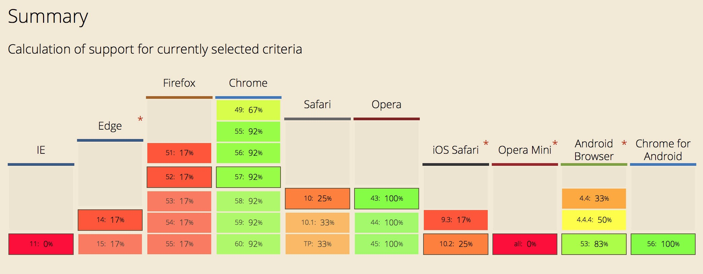

**Дисклеймер:** в статье я часто говорю о React, но вы можете понимать под ним любую библиотеку на JavaScript: Inferno, Preact, Vue, Snabbdom, Virtual DOM или без него: Elm, Om и другие. Точно так же под Polymer можно иметь в виду Vaadin или X-Tag, или…

Кроме того, прочитайте [великолепный ответ](https://medium.com/p/385d63de4959) Роба Додсона.

## Короткая, неполная и часто неточная история веб-компонентов

### Древность

В 2011 интернет сделал прорыв. Со всеми его фейсбуками, гмейлами, гугл-доками и массой других _онлайн-вещиц_, которые уже нельзя было называть сайтами. Во всех смыслах это были полноценные приложения — одностраничные веб-приложения, или SPA (Single Page Application). Так просто.

Но их разработчикам приходилось непросто…

Уровень развития веб-интерфейсов в то время подразумевал использование шаблонизаторов, основанных на симбиозе серверной логики или клиентских библиотек: [Backbone](http://backbonejs.org/) — для тех, кому повезло больше, [jQuery UI](http://jqueryui.com/) или [Sencha/ExtJs](https://www.sencha.com/products/extjs/) — если в вас был дух энтерпрайза.

Это было неудобно. Это было негибко. Прототипировать быстро и легко — невозможно. UI-библиотеки накладывали свои ограничения. Список проблем можно продолжить.

Это при том, что в нашем распоряжении был набор всё тех же HTML-элементов: `<div>`, `<p>`, `<form>`…

И вот, в 2011 Алекс Рассел предложил [свое видение будущего](https://fronteers.nl/congres/2011/sessions/web-components-and-model-driven-views-alex-russell) (акценты в тексте — мои):

> Мне кажется, сегодня мы застряли в ловушке расширяемости. Мы зацикливаемся на JavaScript, так как это базовый язык нашей экосистемы. Он один выручает нас, когда CSS и HTML не справляются. И вот мы набиваемся в спасательную шлюпку под названием JavaScript. Мы снова и снова делаем это.
> Вчера Брюс указал на случай с пустым `<body>` как примером того самого патологического желания запихнуть всё в JavaScript. Вы цепляетесь за него, пытаясь с его помощью воссоздать всё, что браузер и сам в общем-то способен сделать: передаете по цепочке скрипта кусок разметки, чтобы в конце концов получить тот же результат, как если бы добавили его сразу в HTML. Но есть причина. Gmail содержит пустой `<body>` не потому, что он сделан глупо. Он содержит пустой `<body>`, потому что это одновременно выразительный, надёжный и легко поддерживаемый способ реализовать нужную функциональность. А вы пытаетесь сыграть ва-банк, положить все яйца в одну корзину под названием JavaScript.
> Браузерам требуется время, чтобы внедрить новые «фичи». Нам нужно сначала выпустить их для пользователей, те должны начать их использовать, после этого можно замерить аудиторию и только тогда сказать «классно, можно использовать эту фичу, теперь она будет полезна».
> Это то, от чего выигрывают разработчики. Чем раньше возникнет интерес, тем больше шансов увидеть новинки на рынке и начать их использовать. Тогда все скажут: «да, это классная фича».
> **Таким образом, мы скованы невысказанной дилеммой между глубоким прагматизмом и стремлением к платоновскому идеалу.** Но нам не хватает правильной модели, чтобы осмыслить это.
> Чем больше функциональности или поведения [привычных разработчикам и реализованных в браузерах] мы забираем на себя, чем больше мы пытаемся сделать «руками» на JavaScript, тем дальше отходим от той идеи негласной договоренности, на которой держится весь мир.
> **Мы намерены поддерживать прогресс.** На мой взгляд, мы застряли на обсуждении HTML5, и уже хватит.

Дальше он показывает демо и рассказывает о веб-компонентах, под которыми в то время подразумевали три разные вещи: инкапсуляцию CSS, Shadow DOM и веб-компоненты. (Я тоже, в целом, рекомендую его доклад).

Но потом случился [W3C](https://www.w3.org/). В лучших традициях он взял инициативу в свои руки и потратил следующие пять лет на поиск того самого платоновского идеала, позабыв о практическом результате.

### Революция Facebook

Facebook — это сложно устроенное приложение. Возможно, это не очевидно, но это так. Эти маленькие разбросанные по странице блоки — полноценные компоненты. Они должны _реиспользоваться, настраиваться и адаптироваться_ под разный контекст. Разработка с ними должна строиться буквально так: взять элемент `box`, вставить его в _этом месте_ на странице, применить какие-то стили и при этом не сломать отображение других элементов.

И это должно работать относительно быстро, так как известно: DOM обновляется медленно. Есть бесчисленное количество статей, объясняющих, что минимальное количество обращений к DOM — _абсолютная необходимость_.

Печально, что `innerHTML` (признак дурного кода) по скорости работы — [на одном уровне или быстрее](http://andrew.hedges.name/experiments/innerhtml/) функций управления DOM.

И что же придумал Facebook? Всё просто: они просто написали собственную реализацию веб-компонентов полностью на JavaScript. C XML-подобным синтаксисом внутри. Его назвали [React](https://facebook.github.io/react/) и показали миру в 2013 году.

Reaсt позволяет следующее:

- создавать собственные кастомные элементы на основе HTML-подобного синтаксиса;
- вставлять их в DOM;
- использовать виртуальный DOM, сводя к минимуму работу напрямую с DOM браузера;
- имеет всего несколько ограничений по работе с компонентами и внутри них (так как всё в React — JavaScript, его DSL лишь обертка над небольшим количеством функций).

Не удивительно, что React стремительно завоевал свое место в мире веба. Кто не использовал библиотеку — обязательно говорил о ней. Очень быстро появились похожие и конкурирующие инструменты ([Inferno](https://infernojs.org/), [Preact](https://preactjs.com/)) или некоторые части для работы с виртуальным DOM ([Snabbdom](https://github.com/snabbdom/snabbdom), [Virtual DOM](https://github.com/Matt-Esch/virtual-dom) и другие).

### 2017

К 2017 React смог реализовать всё то, что ждали от спецификации веб-компонентов. Он позволяет создавать независимые реиспользуемые компоненты и работает практически во всех поддерживающих JavaScript браузерах (не поддерживается в IE < 9).

Расцвет экосистемы пошёл дальше идеи веб-компонентов. Если я не ошибаюсь, [CSS-модули](https://github.com/css-modules/css-modules) впервые реализовали в React и для React.

В 2017 спецификация веб-компонентов всё ещё [в разработке](http://caniuse.com/#search=web%20components), и это несмотря на выход двух версий для каждого из двух базовых стандартов. На момент написания статьи (март 2017) ситуация с поддержкой такая:



## Так о каких невыполненных обещаниях идёт речь?

Ну, первый провал очевиден: что-то их нигде нет. Обещание «поддерживать прогресс» не выполнено. За шесть лет веб-компоненты породили шесть стандартов. Два из них успели устареть. Только один из основных браузеров вкладывается в поддержку (прости Opera, но ты больше не входишь в их число и к тому же работаешь на основе Chromium).

Другое невыполненное обещание, его сегодня много обсуждают в интернетах — зависимость от сторонних библиотек. И это вынуждает оставить здесь этот излишне длинный кусочек размышлений вслух. Потому, что есть [Polymer](https://www.polymer-project.org/).

Polymer — это попытка Google создать совместимую с веб-компонентами реализацию:

> **Откройте возможности веб-компонентов.** Polymer — JavaScript-библиотека, которая помогает создавать кастомные реиспользуемые HTML-элементы для быстрых и простых в поддержке приложений.

Polymer демонстрирует главный минус веб-компонентов — DOM.

### DOM

Разберём следующий код на React:

```jsx
<MyComponent style={{border: '1px solid gray'}}>
    {
        ['Hello', 'world'].map((text) => <p>{text}</p>)
    }
</MyComponent>
```

Перед нами кастомный компонент. Его стили определены в формате JavaScript-объекта. Его дочерние элементы — результат исполнения метода map и, одновременно, ещё один компонент. В данном случае, это `<p>`, но могло быть что угодно. Внутри — текущее значение элемента массива.

Этот XML-подобный DSL напрямую [транслируется в JavaScript](https://babeljs.io/repl/#?babili=false&evaluate=true&lineWrap=false&presets=react%2Cstage-2&targets=&browsers=&builtIns=false&code=%3CMyComponent%20style%3D%7B%7Bborder%3A%20'1px%20solid%20gray'%7D%7D%3E%0A%20%20%7B%0A%20%20%20%20%20%5B'Hello'%2C%20'world'%5D.map((text)%20%3D%3E%20%3Cp%3E%7Btext%7D%3C%2Fp%3E)%0A%20%20%7D%0A%3C%2FMyComponent%3E&#babili=false):

```js
React.createElement(
    MyComponent,
    { style: { border: '1px solid gray' } },
    ['Hello', 'world'].map(text => React.createElement(
        'p',
        null,
        text
    ));
);
```

А как бы выглядел тот же трюк на веб-компонентах? Ну…

Если взять HTML как контрпример для JSX, то ничего не выйдет:

```html
<my-component style="только строки для атрибутов">
    … здесь ничего …
    здесь можно использовать только другой компонент или текст
</my-component>
```

Ну а что с JS API? Помните, я говорил, что веб-компоненты — это DOM?

```js
const MyComponent = document.createElement('my-component');
MyComponent.style.border = '1px solid gray';

['Hello', 'world'].forEach(('text') => {
    const p = document.createElement('p');
    p.textContent(text);

    MyComponent.appendChild(p);
});
```

Код компонента будет неуклонно расти при усложнении каждого элемента. Представьте, мы хотим обернуть `text` внутри `<p>` в `<span>`?

Сделать это на React? Раз плюнуть. Просто добавляем:

```jsx
['Hello', 'world'].map((text) => {
    return <p><span>{text}</span></p>
});
```

А на веб-компонентах:

```js
['Hello', 'world'].forEach(('text') => {
    const p = document.createElement('p');
    const span = document.createElement('span');
    span.textContent(text);
    p.appendChild(span);

    MyComponent.appendChild(p);
})
```

Ad infinitum.

### Ломаем совместимость

Итак, представим, как описанные выше проблемы с самого начала возникли на пути Polymer. Что делать? Ну, можно создать что-то вроде собственного языка: «не-совсем-но-типа-джаваскрипт», чтобы и разметку умел и немного логики. И чтобы в виде строк.

Чтобы разобраться, пройдитесь по [data system](https://www.polymer-project.org/2.0/docs/devguide/data-system) из Polymer. Здесь я покажу только несколько примеров:

**Обратите внимание:** `[[]]`, `{{}}`, `$=` и другие — не являются частью спецификации веб-компонентов.

```jsx
<template>
    <div>[[name.first]] [[name.last]]</div>
</template>

<my-input value="{{name}}"></my-input>

static get properties() {
    return {
        active: {
            type: Boolean,
            observer: 'userListChanged(users.*, filter)'
        }
    }
}

<div>[[_formatName(first, last, title)]]</div>

<a href$="{{hostProperty}}">
```

И так далее. А вот [моё любимое](https://www.polymer-project.org/2.0/docs/devguide/data-binding#annotated-computed):

> **Запятая внутри строки:** каждая запятая внутри строки **должна** обязательно экранироваться символом `\`.

```html
<dom-module id="x-custom">
    <template>
        <span>
            {{translate('Hello\, nice to meet you', first, last)}}
        </span>
    </template>
</dom-module>
```

Ну то есть, [WAT](https://www.destroyallsoftware.com/talks/wat).

## Ну серьёзно

А теперь серьёзно. Едва ли можно сказать, что веб-компоненты реализовали хотя бы часть возлагавшихся на них надежд. Едва ли они смогли ответить на стоявшие перед ними вызовы.

Спецификации зависят от JavaScript:

- кастомные элементы [работают на JS](https://html.spec.whatwg.org/multipage/scripting.html#custom-elements);
- HTML-шаблоны существует только для [обработки скриптом](https://html.spec.whatwg.org/multipage/scripting.html#the-template-element);
- я вообще не уверен, может ли [Shadow DOM](https://www.w3.org/TR/shadow-dom/) работать без JavaScript;
- и только [HTML-импорты](http://w3c.github.io/webcomponents/spec/imports/) не нуждаются в JS.

Веб-компоненты — это DOM, поэтому:

- [атрибуты](https://html.spec.whatwg.org/#attributes) — только строчные значения;
- [типизация содержимого](https://html.spec.whatwg.org/#kinds-of-content) непонятная — нужно ещё посмотреть, как такая модель [будет работать](https://html.spec.whatwg.org/multipage/scripting.html#custom-elements-autonomous-drawbacks) для структур с большой вложенностью.

Чтобы работать с ограничениями (вроде строчных атрибутов) библиотекам придётся (а куда деваться?) изобретать различные несовместимые друг с другом способы передачи параметров:

- Разве `attr$='{{user.name}}'` из Polymer лучше или совместимее, чем `item-label-path="name.first"` из Vaadin или `<div *ngFor="let hero of heroes">{{hero.name}}</div>` из Angular?
- Где и какую мне нужно импортировать библиотеку Икс, чтобы справиться с их странными способами обхода ограничений DOM, если я имею дело с несколькими вложенными компонентами?
- DOM API ужасны. Они неудобные, негибкие и неэффективные. Polymer сотоварищи делают отважные попытки работать с ним напрямую, но всё же обращаются к `innerHTML` в случаях, когда это не так принципиально (например, в [тестах](https://github.com/Polymer/polymer/search?utf8=✓&q=innerHTML)). Если веб-компоненты укоренятся, интернет будет заполнен неэффективным `innerHTML` и, вероятно, новыми вариациями Snabbdom и Virtual-DOM.
- Как это поможет интеграции и преодолению зависимости от инструментов или библиотек, если каждый использует свою?

Изоляция стилей…

- CSS-модули. Мне продолжать?

Всё это — только часть проблем. Те из них, которые в первую очередь приходят мне в голову. И я не встречал их серьезного обсуждения сообществом.

Команда React и вовсе [заявила](https://docs.google.com/document/d/1QZxArgMwidgCrAbuSikcB2iBxkffH6w0YB0C1qCsuH0/edit):

> Мы не собираемся использовать веб-компоненты на Facebook. У нас нет планов интегрировать их с React, так как существует большая разница на уровне самих моделей — императивной в веб-компонентах и декларативной в React. В веб-компонентах нет нормального способа идиоматически описать вещи, вроде того, куда идут события. Как вы передадите данные, если все описано строками? Мы рассматриваем их больше как слой, помогающий различным фреймворкам взаимодействовать друг с другом.

Сейчас React позволяет использовать их в качестве [конечных узлов](https://www.youtube.com/watch?t=124&v=g0TD0efcwVg) дерева компонента, так как любой компонент с именем, начинающимся со строчной буквы, React интерпретирует как DOM-элемент.

Цитирую Пита Ханта:

> В веб-компонентах много приятного. Например, возможность кастомизировать `<select>`. Так что в них много хорошего, однако они не годятся для структурирования приложений. React же нацелен на решение таких задач: создание структуры и управление DOM. Веб-компоненты — продолжение обычного DOM API. Я придерживаюсь такого мнения: эта спека стандартизирует худшие практики.

Все эти вопросы поднимаются крайне редко, если не брать в расчет комментарии к [некоторым статьям](http://2ality.com/2015/08/web-component-status.html) и обсуждения в Твиттере. Складывается ощущение, будто все согласны, что «веб-компоненты — это славное общедоступное и скорое будущее».

Так ли это?

## Примечание

- Изображение: [Nobody Home Yet](https://www.flickr.com/photos/yoorock/29946893014/) Рика Херрмана, [CC BY-NC-ND 2.0](https://creativecommons.org/licenses/by-nc-nd/2.0/)
- Ссылки на некоторые материалы были взяты из [статьи](http://2ality.com/2015/08/web-component-status.html) Акселя Раушмайера.
