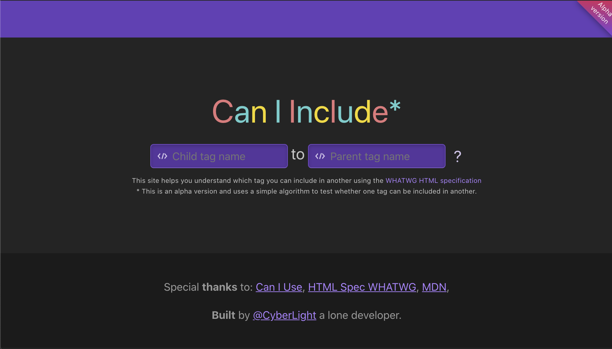
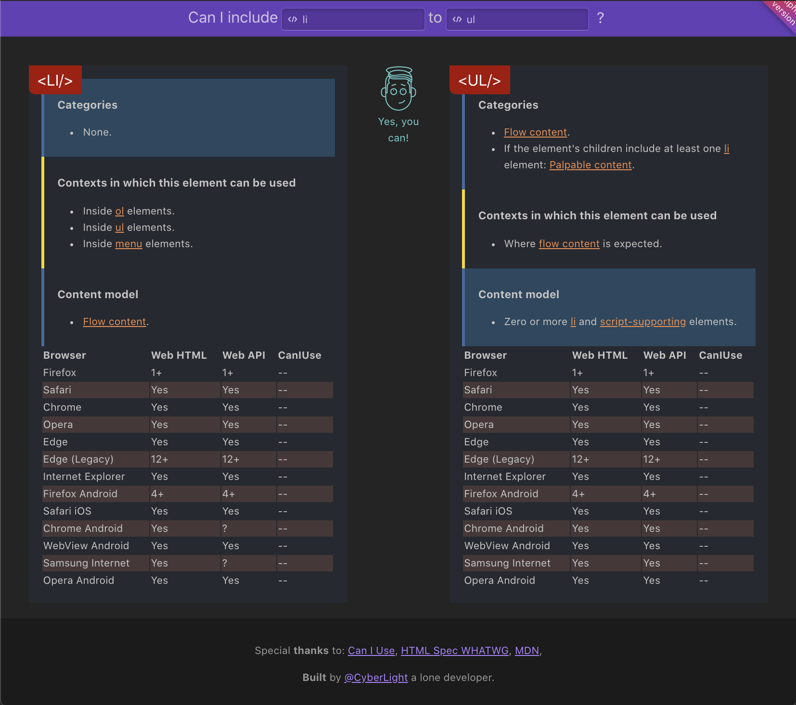
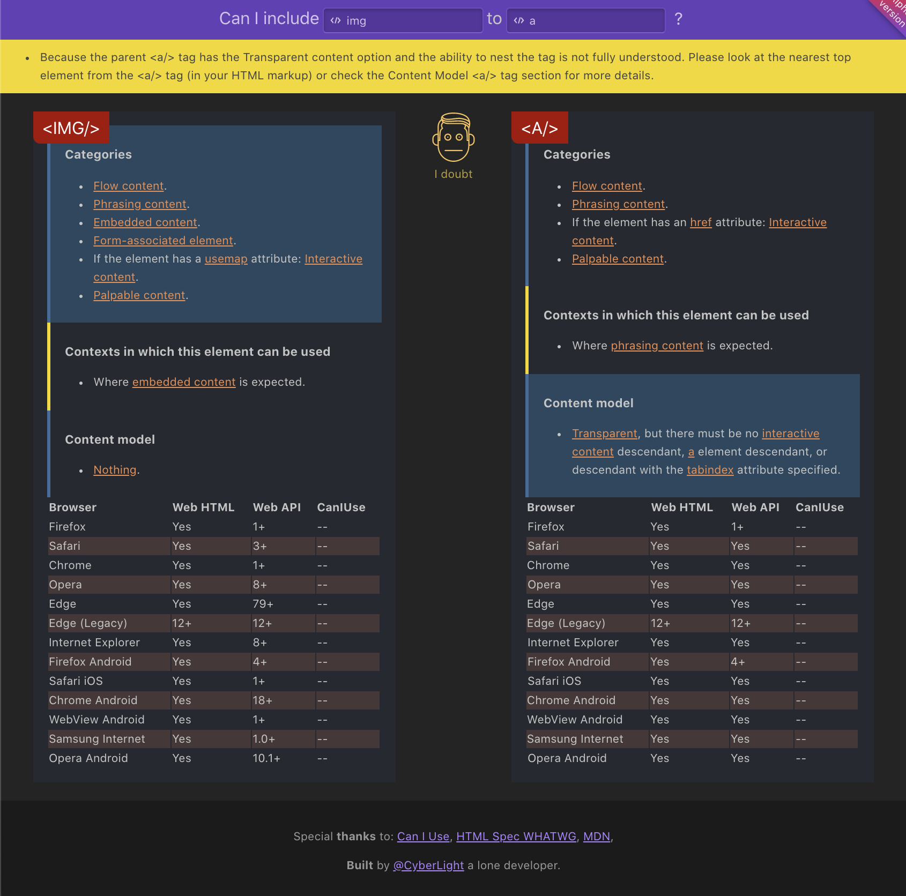
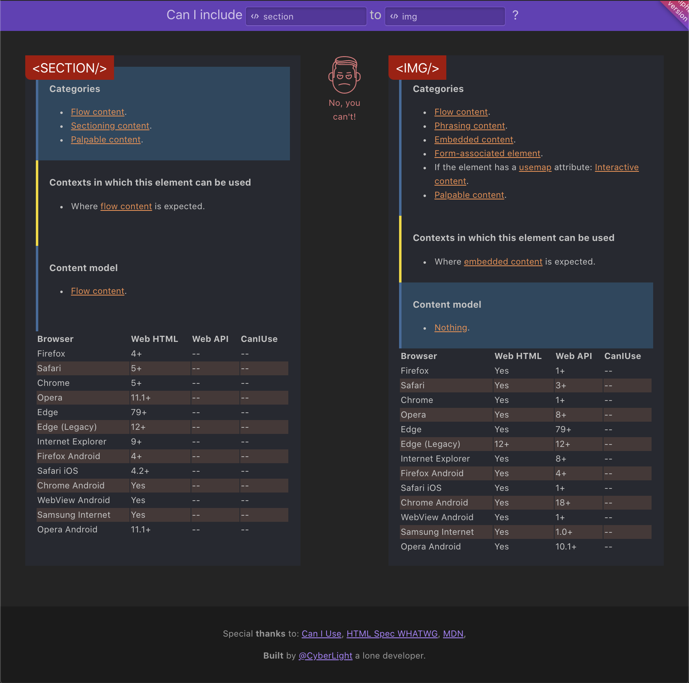

На создание этого онлайн инструмента меня воодушевили в [HTML Academy](https://htmlacademy.ru/), а точнее, их стремление к чистоте вёрстки и следованию строгим стандартам. В курсе по HTML-вёрстке от [HTML Academy](https://htmlacademy.ru/) возможность вложения одного тега в другой объясняется показом двух скриншотов со [страницы спецификации](https://html.spec.whatwg.org/), которые содержат информацию по тегам. Это не очень удобно для восприятия. И мне пришла в голову идея: упростить доступ к информации о тегах и придумать простой механизм по определению возможности вложения одного тега в другой. Далее расскажу историю о создании онлайн инструмента **Can I Include**.

## /Технологии/

Сразу встал вопрос, какие технологии использовать, а главное на каком хостинге разворачивать проект.
Хотелось чего-то лёгкого и незатейливого, без использования бабелей, парцелей и вебпаков, в душе зарождался дух свободы и бунтарства.

### Про вёрстку

Подумав немного, понял, что старый добрый [Preact](https://github.com/preactjs/preact) c его подходом к **Server Side Rendering** через [Hyperscript Tagged Markup](https://github.com/developit/htm) поможет в разделении частей страниц на компоненты. При этом решил, что на первых порах стоит обойтись без клиентского JS, использовать только CSS и HTML на клиенте.

### Про стили

Не стал использовать препроцессоры и отдал предпочтение **raw** css как есть, в одном файле.

### Про серверную часть

Мой любимый [Express.js](https://expressjs.com/) и [Node.js](https://nodejs.org/en/).

### Хостинг

Выбрал [glitch.com](https://glitch.com/).
Так как он даёт возможность кодить в браузере и обеспечить доступ к результатам своей работы будущим пользователям. Поддерживает **Node.js** и возможность доступа к контейнеру через веб-консоль прямо из редактора кода. И, что самое главное, он основан на [Docker](https://www.docker.com/). У меня уже был ранее отработанный простой механизм поставки изменений, и это тоже радовало.
А так как в добавок ко всем удобствам, [glitch.com](https://glitch.com/) добавил [тариф с возможностью бустинга 5 приложений](https://glitch.com/pricing), я тут же поспешил им воспользоваться.

### Скреппинг

Ну куда же без скреппинга! Без него никуда. Данные нужно извлечь с сайта [HTML Spec WHATWG](https://html.spec.whatwg.org/) и обработать напильником в удобоваримую структуру для доступа к данным. Для скреппинга использовал свой любимый инструмент — [Puppeteer](https://github.com/puppeteer/puppeteer).

## /Реализация/

Мне понадобилось пару дней на то, чтобы пройти от генерации идеи до её реализации. Так как я ни разу не дизайнер, заимствовавал идеи от уже давно существующих веб-сайтов. В итоге, получился простой и ёмкий, в плане отображения информации, интерфейс.

В ходе фазы скреппинга, увидел дополнительную информацию с сайтов [caniuse.com](https://caniuse.com/) и [MDN](https://developer.mozilla.org/) по каждому тегу, расположенную на странице [HTML Spec WHATWG](https://html.spec.whatwg.org/), в виде небольших баджиков. Решил разместить информацию по поддержке тегов разными браузерами сразу под блоком с информацией, по сравниваемым тегам, на странице **Can I Include** сравнения тегов. Чтобы, как говорится — «все было под рукой, в развёрнутом виде».

Так как не использовал JS на клиенте, то в мобильном представлении сделал переключение табов с именами сравниваемых тегов при помощи CSS-селекторов.

## /Принцип работы детекта возможности вложения тегов/

Так как основная цель — удобно показать информацию о двух сравниваемых тегах, то для старта было решено реализовать простой способ выявления возможности вложения одного тега в другой.
Информация, представленная в спецификации, больше приспособлена для понимания человеком, чем машиной (хотя и человеку нужно приложить усилия, чтобы сопоставить несколько условий и решить, можно ли включить тег в другой тег).

Для принятия решения, о возможности вложения одного тега в другой, необходимо сопоставить содержание секций сравниваемых тегов.
— У вкладываемого тега, нужно проверить секцию **Categories**, а у тега, в который предполагается вложение — секцию **Content model**.
— В простом случае, наличие одного из пуктов из секции **Categories** в секции **Сontent model**, даёт положительный результат, о возможности вложения тега в тег.
— В случае с **Transparent** моделью в секции **Content model** родительского тега, в который предполагается включение **дочернего** тега, нужно обратить внимание на **Content model** вышестоящего тега от **родительского** тега в вашей вёрстке. Нужно обратиться к вашей разметке и взять имя тега, который включает в себя текущий **родительский** тег с **Transparent** моделью в секции **Content model** и произвести дополнительный запрос на странице **Can I Include**, изменив в правом текстовом поле значение тега на новый, чтобы уточнить возможность включения тега из левого текстового поля, в новый **родительский** тег, в правом текстовом поле.
— Есть и более сложный случай, где есть несколько **«но»**. Порой наличие одного из атрибутов у вкладываемого тега исключает его вложение.

По этой причине стоит обращать внимание на содержание секций в сравниваемых тегах и в сложных случаях, принимать решение на основе анализа содержания секций и результата алгоритма сравнения тегов на сайте.

Теперь про **простой алгоритм** детекта возможности включения тега в тег:
1) В ходе скреппинга в секциях каждого тега создаётся **множество** ключевых слов, в которое входят названия моделей контента, наименование атрибутов и тегов.
2) Если в секции присутствует **Nothing**, то в **множество** ключевых тегов включается название тега.
3) Если присутствует модель **Transparent** в секции **Content model** родительского тега, то ситуация с включением тега — **не определена**. В этом случае выдаётся предупреждающее сообщение, о том, что нужно заглянуть в разметку и взять тег, вышестоящий для текущего **родительского тега**, а затем повторить запрос. При этом пункт **4** не выполняется.
4) Далее производится проверка на пересечение множеств и:
— если найдены общие ключевые слова — то **положительный вердикт** о возможности включения тега в тег
— если нет пересекающихся ключевых слов — то **отрицательный вердикт** о возможности включения тега в тег

## /Интерфейс/

При обращении по адресу **https://caninclude.glitch.me** открывается следующая страница:

<figure>
    
    <figcaption>
        Главная страница сайта caninclude.glitch.me
    </figcaption>
</figure>

Весёлый, текстовый логотип и два поля, встречают пользователя.
В **левом поле** нужно ввести название тега, вложение которого нужно проверить.
В **правом поле** — название тега, в который нужно вложить тег из левого поля.
После этого, нужно нажать клавишу **Enter** или кликнуть по кнопке **?**.

В результате отправки формы по **HTTP** методу **GET**, рендерится страница с информацией по двум тегам и вердиктом по возможности его включения.

<figure>
    
    <figcaption>
        Страница с успешным вердиктом по включению тега в тег caninclude.glitch.me
    </figcaption>
</figure>

Если же определить возможность включения тега в тег, не представляется возможным, по причине **Transparent** модели в секции **Content model** родительского тега, то вид страницы с вердиктом будет следующий:

<figure>
    
    <figcaption>
        Страница с неопределённым вердиктом по включению тега в тег caninclude.glitch.me
    </figcaption>
</figure>

В случае, если вложение тега в тег невозможно, то вид страницы с вердиктом будет выглядеть так:

<figure>
    
    <figcaption>
        Страница с отрицательным вердиктом по включению тега в тег caninclude.glitch.me
    </figcaption>
</figure>

## /Итог/

Надеюсь, что онлайн-инструмент [caninclude.glitch.me](https://caninclude.glitch.me) будет полезен и принесёт пользу.
Ещё много работы предстоит по улучшению UI/UX и расширению функциональности, а также по совершенствованию механизма определения возможности вложения тега в тег.
Хочу выразить огромное спасибо за нелёгкий труд коллектива [HTML Academy](https://htmlacademy.ru/) в борьбе за грамотность вёрстки и за то, что воодушевляют на создание инструментов.
Также в планах организовать обратную связь, чтобы получать замечания и пожелания.
