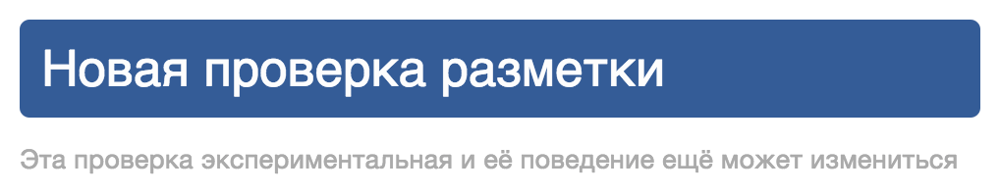

[Майк™ Смит](http://people.w3.org/mike/) (известный как [@sideshowbarker](https://twitter.com/sideshowbarker)) из W3C — человек, с головой увязший в исходном коде инструмента W3C для _проверки <del>валидности</del> разметки_; эта _магия_ работает именно благодаря ему. Вопросы были заданы на радость и в назидание читателю сайта.

**Во-первых, расскажите нам немного о том, чем вы занимаетесь и над чем работаете**

<figure>
    
    <figcaption>Майк™ Смит — заместитель директора @W3C: вариант либерального подхода к работе</figcaption>
</figure>

Я не работаю. Я — старосветский _бонвиван_. Я пью чай, изящно отставив мизинец, и трачу силы только на то, что меня забавляет. Последние несколько лет меня забавляло тратить время на работу над программой, помогающей людям проверить, соответствуют ли их документы определённым требованиям в спецификации HTML.

<figure>
    
    <figcaption>Новая проверка разметки.</figcaption>
</figure>

**Какая разница между DTD и проверкой, основанной на схеме?**

DTD-шки высечены на каменных плитах. И поэтому для обработки они требуют целой кучи камнерезных инструментов. Однако, увы, веб не был построен на обработке каменных плит, поэтому нам пришлось искать другие решения. Для проверки документа на соответствие мы решили использовать такие вещи, как схемы RelaxNG, которые, хоть и не дотягивают до DTD-шной утонченности, представляют собой гораздо более мощные средства для выражения определённых требований соответствия документа. Так что это компромисс.

<figure>
    
    <figcaption>Валидатор W3C.</figcaption>
</figure>

**В чём разница между проверкой на соответствие и валидацией?**

_Валидация_ — это что-то из старого мышления. Используйте это слово, когда хотите заставить людей думать, что вы — ископаемое или пережиток прошлого. Это что-то вроде слов _«ништяк»_ или _«XHTML»_.

Многие люди не знают этого, но этимология слова «валидация» тянется еще с тех времен, когда наши предки были, в основном, свинокрадами, и их награждали значком за правильное написание своих имён, да ещё похлопывали по спине: «Молодец»!

_Проверка соответствия документа_ — хороший, современный, одобренный сообществом способ говорить о поиске проблем в HTML-документах. И заметьте, что мы называем это соответствием **документа**, а не процесса его создания, и мы говорим о требованиях соответствия для **документов**, а не для их создателей. Это потому что вы, автор — человек; техническая спецификация не может содержать требования к вам, она может содержать требования к документу, который вы создаёте. Инструменты для подобной проверки не оценивают, насколько вы, как человек, соблюдаете технологии; вместо этого они лишь оценивают создаваемые вами документы.

Впрочем, словосочетание _проверка соответствия документа_ имеет и противную уродскую часть: _соответствие_ — действительно оскорбительное слово. Но вы не должны обращать на него внимания! Уделяйте внимание только слову _«проверка»_ — веселому и полезному.

Именно поэтому я называю инструмент по адресу [validator.w3.org/nu](http://validator.w3.org/nu) _«Новая проверка разметки»_, а не _«Бла-бла-валидатор»_ — я хочу делиться радостью слова «проверка». Проверка — это что-то, реально приносящее людям пользу, а не просто похлопывающее их по спине. Это штука, которая проверяет ваши документы автоматически и избавляет вас от нудной необходимости делать это вручную. Она помогает вам. Возможно, ее следовало бы назвать _«Новая проверка-и-помощь»_.

Что касается самой проверки, она ищет случайные ошибки, которые вы могли допустить: неправильно написанные названия элементов или значения атрибутов, в которые случайно влез какой-то «левый» символ. В общем, такого рода вещи. И она сообщает вам о таких штуках, чтобы вы могли исправить их.

Инструмент проверяет и другие виды требований, заданных в спецификации HTML. Это требования, которые помогут вам избежать создания кривых HTML-документов и веб-приложений, не работающих как надо или еще как-нибудь ухудшающих удобство для пользователей. Некоторые из этих требований можно назвать делом вкуса, но все равно полезно иметь подобный общий набор — что-то вроде отправной точки, реально закрепленной в спецификации.

Другие названия для того, что умеет этот инструмент, пока еще не одобрены сообществом — это _«линтинг»_ или _«статический анализ»_. Но отличие той штуковины, над которой я работаю, в том, что правила линтинга для нее на самом деле определены в спецификации, а не являются чем-то таким, что, скажем, Дуг Крокфорд (пример навскидку) как-то утром взял и вытащил из шляпы.

**Какая разница между ошибками и предупреждениями?**

Ошибка — это какой-то явный ляп, например, опечатка в названии элемента, или какие-то дикие нечитаемые символы в значении атрибута, или непонятно что, непонятно откуда взявшееся и явно ненужное.

Но ошибкой называются также вещи, про которые спецификация просто говорит, мол, это должно считаться ошибкой. Спецификация объясняет: подобные вещи называются ошибками, поскольку они могут создать определённые проблемы, которые не всегда легко предвидеть.

Существует длинный перечень тех вариантов проблем, которые определены как ошибки. Но в некоторых примерах к ним — образцы разметки, ужасные с точки зрения доступности, удобства, совместимости, безопасности или поддержки, приводящие к низкой производительности или к трудноотлаживаемым глюкам ваших скриптов.

Наряду с вышеописанными случаями бывают и другие, которые тоже считаются ошибками, потому что из-за них вы можете наткнуться на странности при HTML-парсинге и обработке ошибок и в итоге получить неинтуитивный и неожиданный результат в DOM.

Наконец, существует еще один вид ошибок: для разметки, которая не несёт в себе никакого смысла и скорее всего была использована по недоразумению, или для случаев, идущих вразрез с поведением стилей по умолчанию.

Предупреждения, с другой стороны, нужны для вещей, которые спецификация не определяет, как прямые ошибки, но которые всё же могут вызывать проблемы. Иногда предупреждения добавляются к проверке экспериментально, в качестве способа проверить, будут ли они полезны для вас или нет. (Это одна из причин, по которой проверка все еще помечена как _экспериментальная_.)

**Есть ли смысл в использовании доктайпов HTML4 или XHTML?**

Нет абсолютно никакой причины для использования доктайпа HTML4. Просто вставьте доктайп `<!DOCTYPE HTML>` в ваши HTML-документы, убедитесь, что они отдаются как `text/html`, и всё. Живите вашей обычной жизнью. Но если по какой-то причине вы непременно хотите отдавать документы в `application/xhtml+xml`, то вам не придётся использовать для них доктайп XHTML, т.к. и в этом случае вы можете спокойно использовать `<!DOCTYPE HTML>`. (Но, вероятно, вы не захотите использовать `application/xhtml+xml` и XHTML в любом случае. Смените же наконец прическу! Сколько можно жить в прошлом, целый огромный мир ждет вас.)

**Какие подводные камни поджидают пользователей HTML-проверки и инструментов валидации?**

Я полагаю, те же подводные камни, на которые вы наткнетесь, если обратитесь к какому-нибудь разумному человеку, по-настоящему готовому вам помочь: он действительно попытается это сделать, а не просто отмахнётся или даст вам значок «этот свинокрад может написать своё имя». Его помощь может не всегда оказаться тем, что вы хотели услышать, или это могут быть уже известные вам советы, которые вы спокойно можете игнорировать. Такова жизнь.

**Какие плюсы?**

Плюсы в том, что вы ловите ошибки, которые в противном случае вы могли бы пропустить.

**Как так получилось, что между правилами соответствия W3C HTML и WHATWG HTML есть различия?**

Некоторые вещи, определённые как ошибки — дело вкуса. Спецификации пишутся людьми, а не машинами. Разные люди могут рассуждать по-разному — «разумные люди могут не соглашаться друг к другом», или как бы еще не так банально выразить эту мысль. Если вы пойдете по свету, ожидая от человечества полного согласия, в какой-то момент вы будете серьезно разочарованы.

**А что, если я найду ошибку в валидаторе или проверке W3C HTML?**

Сообщите об этом на [w3.org/Bugs/Public](https://www.w3.org/Bugs/Public/enter_bug.cgi?product=Nu%20Markup%20Checker), или на [bugzilla.validator.nu](https://bugzilla.validator.nu/), или на [github.com/validator/validator/issues](https://github.com/validator/validator/issues).

**Могу ли я запустить локальную копию проверки соответствия W3C HTML?**

Да. Лучший способ сделать это — [скачать релиз](https://github.com/validator/validator/releases) и [следовать инструкциям](https://validator.github.io/validator/#web-based-checking). А если вы используете grunt, попробуйте плагин [grunt-html](https://github.com/jzaefferer/grunt-html) для проверки HTML, основанный на коде валидатора.

**Какие-либо советы или подсказки по разумному использованию инструментов проверки соответствия HTML?**

Это какой-то вопрос с подвохом? Пожалуй, единственное, что я мог бы посоветовать — не стоит забывать, что инструменты — это машины, а вы — не машина (предполагаю, что этот вопрос задан не машиной). Поэтому, оценивая любые сообщения об ошибках и предупреждениях от любого средства проверки HTML, полагайтесь на собственный здравый смысл. И если здравый смысл подсказывает вам, что какое-то сообщение на самом деле не помогает вам, просто игнорируйте его. Это не конкурс популярности, вы не заденете ничьи чувства.

А ещё лучше, если у вас найдется время, — воспользуйтесь функцией «Фильтрация сообщений» на [validator.w3.org/nu](http://validator.w3.org/nu), которая позволит вам постоянно игнорировать любые сообщения, которые вы сочтёте бесполезными, надоедливыми или которые вы просто больше не желаете видеть.

**Сейчас инструмент проверки W3C HTML не проверяет и не показывает ошибки для SVG1.1 и некоторых атрибутов веб-компонентов, планируете ли добавить поддержку этого?**

Да. Эти вещи добавлены в мой список задач. В конечном итоге я доберусь до них.

**В чём история с ошибками из-за неизвестных атрибутов? Их используют многие JS-библиотеки, что делать разработчикам?**

Проблема в том, что проверка — машина, и она недостаточно умна, чтобы понять разницу между какими-то атрибутами с неизвестным названием, которые вы используете умышленно, и атрибутами, название которых вы случайно написали с ошибкой. Если мы просто прикажем сервису пропускать все неизвестные названия атрибутов без проверки, мы не сможем помочь вам выловить случаи, когда вы по ошибке написали что-нибудь неправильно.

Временное решение — если вы намеренно используете какое-то неизвестное имя атрибута, задействуйте галочку в «Фильтрации сообщений» на [validator.w3.org/nu](http://validator.w3.org/nu). Это укажет проверке, что вы не желаете видеть сообщения об этом конкретном атрибуте, и они больше не будут вас беспокоить.

**Есть ли в валидаторе функция для проверки использования ARIA? Если да, то что это за проверка?**

Да, он проверяет ошибки в использовании разметки ARIA в HTML-документах, а теперь еще и находит некоторые ошибки ARIA как в элементах SVG внутри HTML-документов, так и в отдельных SVG-документах.

Для HTML-элементов это проверка на соответствие требованиям не только спецификации HTML, но и появившемуся сейчас самостоятельному документу [ARIA в HTML](https://specs.webplatform.org/html-aria/webspecs/master/). Планируется, что спецификация HTML вскоре будет обновлена, чтобы просто ссылаться на требования ARIA в этом документе.

Что касается SVG-элементов, у меня в планах вскоре обновить проверку, чтобы она следовала аналогичным самостоятельным документам в «[Web developer rules for use of ARIA attributes on SVG1.1 elements](https://specs.webplatform.org/SVG1.1-ARIA/webspecs/master/)»

**А что насчёт проверки ARIA в документах по спецификациям до HTML5? Будет ли это сделано?**

Ни один человек не должен пользоваться чем-то, кроме HTML5, и не нужно пытаться помогать ему в этом. HTML5 — это просто HTML. Мы уже давно переросли всё связанное с версиями. `<!DOCTYPE HTML>` скоро исполнится 10 лет. Здравый смысл победил. В нашем XXI веке нам нечем толком помочь человеку, который прописывает в новом документе HTML4 или какой-то другой древний доктайп. Это гиблое дело. Мы никоим образом не помогли бы, если бы дали какую-то возможность сделать это и вписать разметку ARIA в такие документы, а потом сказали бы, что всё в порядке. Это называется попустительство.

**При использовании HTML-валидатора W3C для проверки моего HTML5 я вижу следующее: «Валидатор проверил ваш документ с помощью экспериментальной функции: проверка соответствия HTML5…» — значит ли это, что есть более стабильный инструмент валидации, который мне следовало бы использовать?**

Понятие «стабильный» здесь не очень применимо. Но да, существует другой инструмент, которым вам следовало бы пользоваться. Это [validator.w3.org/nu](http://validator.w3.org/nu). У него больше возможностей и он лучше по всем статьям.

Это — инструмент экспериментальный, но в хорошем смысле. Планируется, что он всегда останется таким. Страница [validator.w3.org/nu/about.html](http://validator.w3.org/nu/about.html) пытается задать правильные ожидания насчет того, в чем цель и что означает экспериментальный:

> Новая проверка разметки — экспериментальный инструмент, и его поведение ещё может измениться. В частности потому, что в него продолжают добавляться новые типы проверок на ошибки, и нельзя гарантировать, что, если в один момент времени проверка конкретного документа показывает ноль ошибок, она покажет ноль ошибок и в более поздний момент.
>
> Не нужно пытаться применить Новую проверку разметки как средство, чтобы заставить людей сверять документы с какой-либо спецификацией на «соответствует или не соответствует»; инструмент задуман исключительно как средство проверки, а не как механизм для выдачи сертификатов соответствия.

**Что насчёт проверки веб-компонентов?**

Если вы имеете в виду проверку нестандартных (custom) элементов, то мой ответ — нестандартные элементы пока недостаточно широко поддерживаются в разных браузерных движках, так что не думаю, что мне или еще кому-то стоит тратить слишком много времени и сил на размышления, как проверке вести себя с документами, в которых они есть.

Когда и если нестандартные элементы всё-таки начнут широко поддерживаться большинством браузерных движков, вот тогда мы и должны будем выяснять, как проверке вести себя с ними. Это, конечно, будет сложно и запутанно — но так обстоят дела со многими вещами в веб-разработке, и я уверен, что мы вместе придумаем что-то, с чем можно будет жить, — точно так же, как мы не раз делали для многих других сложных вещей.

**В чём разница между валидатором W3C и Новой проверкой разметки?**

Старый W3C-валидатор находится на [validator.w3.org](http://validator.w3.org/), и его ядро основано на таких древних вещах, как Perl, DTD-шки, SGML и старые спецификации из XX века, типа HTML4. Никто в данный момент активно не поддерживает его код. Единственная хорошая новость на этот счёт — для проверки любых документов с современным доктайпом `<!DOCTYPE html>` он фактически использует движок Новой проверки разметки, а затем просто возвращает все сообщения оттуда.

Новая проверка разметки находится по адресу [validator.w3.org/nu](http://validator.w3.org/nu). Она основана на чуть более новых вещах типа Java и RelaxNG и на спецификациях из нынешнего века, таких как HTML5, а также имеет большое преимущество в виде фактической активной поддержки. К тому же у нее больше возможностей, напр., функция «Фильтрация сообщений», позволяющая отфильтровать сообщения, которые вы не хотите видеть.

**Что лучше — проверка исходного кода или реального вывода HTML DOM? Известные проблемы?**

Я полагаю, что для обоих случаев есть хорошие варианты. Ограничение проверки DOM заключается в невозможности сделать так, чтобы [validator.w3.org/nu](http://validator.w3.org/nu) сам забрал DOM какого-то произвольного документа в сети, а потом проверил. Где-то между должен быть браузерный движок, который реально распарсит документ в DOM-представление в памяти, выполнит ваши скрипты, а затем преобразует итоговую DOM обратно в текстовое представление, которое вы можете «скормить» проверке. Но если у вас есть HTML-документ, который вы хотите проверить, и вы уже открыли его в браузере, вы можете использовать [что-то типа букмарклета](http://codepen.io/stevef/full/LasCJ/), чтобы отправить строковое представление DOM этого документа в [validator.w3.org/nu](http://validator.w3.org/nu) для проверки.

## Дополнительные вопросы

**Стоит ли помечать предупреждениями в W3C-валидаторе доктайпы, которые были до HTML5, ведь HTML5 теперь рекомендация?**

Не знаю, может быть. С одной стороны, существует огромное количество документов со старыми доктайпами, которые прекрасно работают такими как есть, поэтому нет причины посылать их к чёрту. С другой стороны, если кто-то всё же удосужился пропустить один из этих документов через проверку HTML, скорее всего, у него есть на это веская причина. И, вероятно, оповестив его об устаревшем доктайпе, мы бы помогли — он смог бы обновить его.

**В HTML5 элементу `<a>` разрешено содержать блочное или потоковое содержимое, что поменялось (если вообще поменялось) в браузерах?**

В браузерах ничего не изменилось. Браузеры всегда это поддерживали, и это не вызывает никаких проблем, и мы никому бы не помогли, выдавая это за ошибку. Так что мы сделали это не-ошибкой.

### Критерий обработки для WCAG 2.0

**Консультант по доступности нашего клиента говорит ему, что для совместимости с WCAG 2.0 у них должен быть валидный HTML. Это правда?**

Без понятия. Я не эксперт в WCAG и никогда даже не читал спецификацию WCAG 2.0. И HTML-проверка — не WCAG-проверка. Или, по меньшей мере, она не претендует на это.

У WCAG 2.0 есть критерий успеха, который требует, [чтобы в разметке документов не было ошибок парсинга](http://www.w3.org/TR/WCAG20/#ensure-compat-parses). [Новая проверка разметки](http://validator.w3.org/nu) отмечает ошибки парсинга наряду с другими машинно проверяемыми [критериями соответствия HTML](http://www.w3.org/TR/html/introduction.html#conformance-requirements-for-authors). Мы создали [букмарклет ошибок парсинга для WCAG 2.0](http://validator.w3.org/nu/about.html#extras), который фильтрует результаты, полученные из Новой проверки разметки, чтобы отобразить только ошибки или предупреждения парсинга.

**Примечание**: этот букмарклет — экспериментальный, это не закон, и даже после фильтрации некоторые выводимые ошибки/предупреждения могут не вызывать каких-либо практических негативных эффектов для доступности документа. Он служит исключительно вспомогательным средством для фильтрации некоторых неактуальных (для WCAG) проблем. Мы с Майком говорили о том, чтобы сделать фильтр встроенной функцией [Новой проверки разметки](http://validator.w3.org/nu), надеюсь, что моими стараниями это случится.

**Спасибо, Майк!**

<figure>
    <iframe width="510" height="383" src="images/https://www.youtube.com/embed/FVbVCZw5BPQ" allowfullscreen></iframe>
    <figcaption>Полезный совет — всегда <a href="http://validator.w3.org/nu">проверяй свой HTML</a> под <a href="http://youtu.be/FVbVCZw5BPQ">рок-н-ролл</a>, играющий… ГРОМКО!</figcaption>
</figure>
