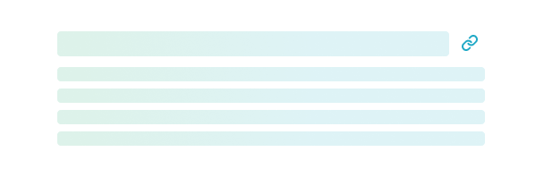
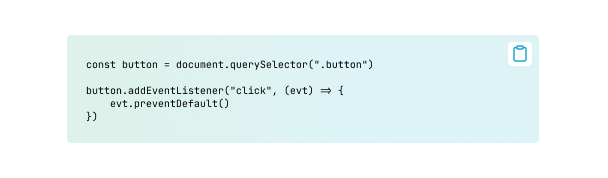
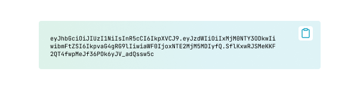
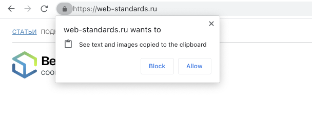
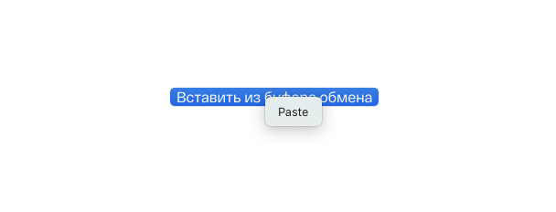

Возможность скопировать что-то в буфер обмена существует в браузерах достаточно давно. Но синхронный запуск команд `copy` или `write` через в функцию `document.execCommand()` всегда был не самым лучшим API. Его неудобство сподвигло разработчиков к написанию множества библиотек, которые помогали пользоваться копированием с помощью более удобного интерфейса. К счастью, W3C задумался над разработкой нового, более удобного способа взаимодействия с Clipboard API и уже в декабре 2016 года [был опубликован первый черновик](https://github.com/w3c/clipboard-apis/commit/3ffdbba8580e0096aa7d492d49e1309001d25162) современного API. В 2021 году эта возможность уже есть во всех браузерах, хотя и с [некоторыми отличиями в поддержке](https://caniuse.com/async-clipboard).

## Первоначальное API

Почему же все таки старая реализация была не самой удачной? Давайте рассмотрим на примере копирования произвольной строки. Для копирования мы должны вызвать `document.execCommand('copy')`. Как вы могли заметить функция `execCommand` принимает только один аргумент. Но что же будет помещено в буфер обмена? Правильный ответ, то что в данный момент выделено на странице пользователем. Тогда получается если мы видим копируемую строку, то можно поместить ее в поле ввода, убрать у него все стили чтобы строка выглядела как текст и поставить этому полю readonly. В этом случае мы можем ставить фокус на это поле, выделять в нем текст и вызывать команду копирования. Что страшнее, когда нам нужно скопировать текст, который не отображается на странице все становится сложнее. Для того чтобы наглядно увидеть сколько всего нужно предусмотреть я сделал небольшой пример.

```js
const isRTL = document.documentElement.getAttribute('dir') === 'rtl';
const button = document.querySelector(".button");

button.addEventListener("click", (evt) => {
    const input = document.createElement("input");
    const text = "https://web-standards.ru/articles/clipboard-api/";
    const yPosition = window.pageYOffset || document.documentElement.scrollTop;

    input.style.position = 'absolute';
    input.style[isRTL ? 'right' : 'left'] = '-9999px'; // скрываем поле за краями экрана в завивимости от направления текста в текущей локали
    input.style.fontSize = '16px'; // предотвращаем срабатывание зума на iOS
    input.style.top = `${yPosition}px`; // предотвращаем скролл к элементу
    input.setAttribute('readonly', ''); // не допускаем появления клавиатуры на мобильных девайсвх

    document.body.appendChild(input); // вставляем элемент в DOM
    input.value = text;
    input.focus(); // помещаем поле в фокус
    input.select(); // выделяем текст в поле
    document.execCommand("copy"); // копируем текст в поле обмена
    document.body.removeChild(input); // удаляем фейковый элемент
});
```

## Почему работа с буфером обмена важна для сайтов

Кажется, что такие знакомые сочетания клавиш как <kbd>Ctrl C</kbd> и <kbd>Ctrl V</kbd> в Windows или <kbd>Cmd C</kbd> и <kbd>Cmd V</kbd> в macOS знакомы каждому. Но пользователю иногда всё-таки легче кликнуть по кнопке и получить содержимое в буфере обмена. Например, если пользователь хочет скопировать ссылку, то сочетания клавиш не помогают и нужно совершить больше действий. Прямо как на сайте [web-standards.ru](https://web-standards.ru) — вы можете скопировать ссылку на конкретное место в статье, обозначенное заголовком, если кликнете на иконку справа от заголовка. Получается, что если вы точно знаете, что пользователю нужно будет скопировать какие-то данные, путь к этому можно сократить с помощью простой кнопки.

<figure>
    
    <figcaption>
        Применение Clipboard API для копирования ссылок
    </figcaption>
</figure>

<figure>
    
    <figcaption>
        Удобное копирование сниппетов кода
    </figcaption>
</figure>

<figure>
    
    <figcaption>
        Копирование важной информации которая нужна пользователю, например токен
    </figcaption>
</figure>


## Возможности современных браузеров

Современный API позволяет работать не только с текстом, но и с картинками, а также копировать смешанный контент или исключать какие-то элементы при попытке копирования или вставки. Например если происходит вставка контента в WYSIWIG который был скопирован из MS Word мы может отфильтровать все не нужное и привести содержимое в порядок перед тем как поместим его  Есть несколько способов работы с Clipboard API, один из самых главных — это API для чтения и записи буфера обмена. Методы в `window.navigator.clipboard` предоставляют прямой доступ к чтению или записи данных в буфер обмена. Также есть и другие возможности, которые мы рассмотрим далее.

## Запись в буфер обмена

Для сохранения данных в буфер можно использовать универсальный метод `window.navigator.clipboard.write()` или специальный `window.navigator.clipboard.writeText()`, если мы собираемся помещать в буфер только текст. Оба метода являются асинхронными и возвращают `Promise`

Рассмотрим простой пример с копированием ссылки:

```html
<span class="tooltip">
    <button class="tooltip__button" data-href="#section-2"></button>
    <span class="tooltip__label" role="tooltip" id="copy-section-2">
        Скопировать ссылку
    </span>
</span>
```

```js
document.querySelector('.tooltip').addEventListener('click', () => {
    const tooltip = this.nextSibling;
    const hash = this.getAttribute('data-href');

    navigator.clipboard
        .writeText(`${window.location.href}${hash}`)
        .then(() => {
            // Успех!
        })
        .catch(() => {
            // Неудача :(
        });
});
```

[Полный пример кода на GitHub](https://github.com/web-standards-ru/web-standards.ru/blob/master/src/scripts/modules/copy-link.js)

Так как `window.navigator.clipboard.writeText` возвращает `Promise`, мы должны обработать исключение, и в случае возникновения ошибки предупредить пользователя об этом.

Если мы используем функцию `window.navigator.clipboard.write`, то к копируемым данным можно добавить, например, картинку. Как показано в примере:

```js
const blob = await fetch('https://placehold.jp/150x150.png').then((req) =>
    req.blob()
);
const clipboardItem = new ClipboardItem({ [blob.type]: blob });

window.navigator.clipboard
    .write([clipboardItem])
    .then(() => console.log('Картинка скопирована!'))
    .catch((err) => console.error(err));
```

Также можно изменять данные перед записью в буфер обмена, когда пользователь пытается скопировать контент на странице, например, добавлять дополнительную информацию:

```js
document.addEventListener('copy', (evt) => {
    const source = `Источник: ${window.location.href}`;

    // Нужно заблокировать стандартное поведение
    evt.preventDefault();
    // И поместить дополнительные данные в Clipboard
    evt.clipboardData.setData(
        'text',
        `${document.getSelection()}\n\n${source}`
    );
});
```

## Чтение буфера обмена

По аналогии с записью, мы также можем читать данные из буфера обмена. Для этого есть аналогичные методы `read` и `readText`:

```js
window.navigator.clipboard
    .readText()
    .then((data) => console.log('Скопировано', data))
    .catch((err) => console.error('Не удалось скопировать', err));
```

Важная особенность чтения из буфера в том, что оно работает не напрямую. Например, в Google Chrome во время попытки прочитать данные из буфера пользователю скажут о попытке и предложать разрешить или запретить действие. А Safari, например, покажет контекстное меню с пунктом «Paste».

<figure>
    
    <figcaption>
        Меню запроса разрешения на чтение буфера обмена в Google Chrome при попытке вставки
    </figcaption>
</figure>

<figure>
    
    <figcaption>
        Контектсное меню отображаемое Sarafi при попытке вставки из буфера обмена
    </figcaption>
</figure>

Также можно запросить разрешение на чтение буфера заранее с помощью [Permissions API](https://developer.mozilla.org/en-US/docs/Web/API/Permissions_API) — хотя стоит заметить, что не все браузеры его поддерживают.

```js
window.navigator.permissions.query({ name: 'clipboard-read' })
    .then((result) => {
        if (result.state == "granted" || result.state == "prompt") {
            // Можно записывать данные в буфер
        }
    });
```

<small>Для запроса на запись в буфер используется аналогичная конструкция только с аргументом `{ name: 'clipboard-write'  }`<small>

Другой вариант чтения данных из буфера — реагировать на вставку данных на сайте. Такое событие можно слушать как на всём `document`, так и, например, в поле ввода `<textarea>`. С помощью этого метода можно перехватить и обработать событие.

```js
document.querySelector('textarea').addEventListener('paste', (evt) => {
    if (evt.clipboardData.files.lenght === 0) {
        return;
    }

    const files = Array.from(evt.clipboardData.files);

    evt.preventDefault();

    uploadFiles(files)
        .then(() => console.log('Загружено!'))
        .catch((err) => console.error('Произошла ошибка', err));
});
```

## Заключение

Правильное использование современных API может значительно повысить удобство ваших интерфейсов. Clipboard API — один из таких случаев, когда вы можете упростить решение задач даже для самых неопытных пользователей.
