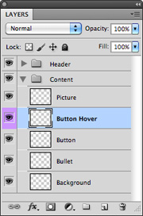
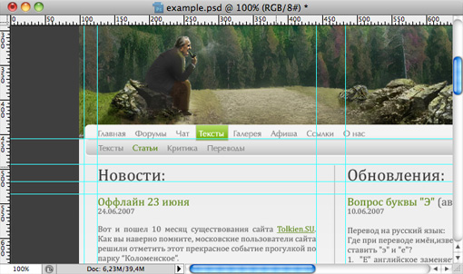
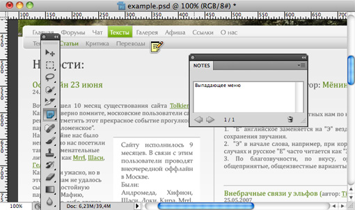
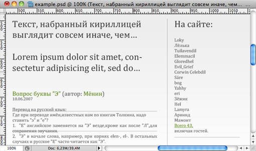
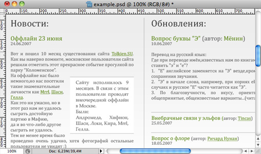

От автора, 2010-й год. С момента написания этой статьи прошло три года, и сейчас я понимаю, что во многом была слишком категорична, во многом — наивна, но в общем и целом — права. Нижеприведенные рекомендации по-прежнему актуальны. Читайте, фильтруйте, отсеивайте, пользуйтесь.

За несколько лет профессиональной деятельности мне довелось повидать огромное количество макетов сайтов. Среди них были хорошие, плохие и совершенно ужасные, но не было ни одного идеального.

Можно довольно долго рассуждать о том, почему дизайнеры в огромном количестве гонят некачественный продукт. Мне кажется, основная проблема в том, что на веб-дизайнера нигде не учат. Более того, сейчас в Рунете каждый второй считает себя веб-дизайнером. «Умеешь рисовать в фотошопе скруглённые уголки, градиенты и отражения? Отлично, значит, и разработать интерфейс огромного информационного портала тоже сможешь», — такое чувство, что так рассуждает большинство нанимателей этих самых дизайнеров. И очень жаль. Поскольку для комфортной работы с дизайнером он должен иметь представление об информационной архитектуре, юзабилити, веб-технологиях — программировании и вёрстке, чтобы не рисовать заведомо то, что невозможно или очень сложно реализовать. Однако на деле получается, что скруглённые уголки круче всех.

Поскольку у меня по ходу работы всё время возникает масса проблем с дизайнерами, я решила написать некоторые рекомендации, способные серьёзно упростить работу верстальщику. Эта статья адресована мудрым начальникам, которые хотят улучшить работу в своей команде, а также дизайнерам, которые не хотят заработать диарею в результате постоянных проклятий.

## Правило № 1. Макет сайта — в PSD

Некоторые дизайнеры почему-то очень любят использовать для создания макетов Adobe Illustrator. Это очень крутая программа, но предназначение у неё совершенно иное, для верстальщика ее инструменты неудобны. В результате всё равно приходится экспортировать макет в Photoshop, что частенько сопровождается массой ошибок. Ещё одна модная нынче фишка — Fireworks. Да, это уже гораздо лучше, чем Иллюстратор, но всё равно плохо, потому что традиционно верстальщики учатся работать с Photoshop, и когда дизайнер присылает им файл в формате PNG, они просто-таки не знают, что с ним делать. Про макеты в JPG и прочих подобных форматах я вообще молчу. Да, такое тоже бывает! Фактически, формат PSD уже стал неким негласным стандартом для макетов сайтов. Так что если вы любите рисовать макеты в нестандартной программе — не поленитесь, сделайте экспорт в PSD и проверьте, чтобы ничего не сломалось. Верстальщик будет вам благодарен.

## Правило № 2. Аккуратные слои

В Photoshop существует очень удобный механизм группировки слоёв. Это очень полезное свойство: гораздо легче разобраться в макете, если слои сгруппированы по элементам (например, шапка-контент-подвал). Также следует уделить внимание осмысленному именованию слоёв и групп, причём, желательно использовать английский язык — верстальщик всё равно именует элементы по-английски. Слои, которые не используются в макете, необходимо удалять, а не оставлять отключёнными — верстальщик в процессе работы отключает разные слои, а потом включает всё сразу и может сильно испугаться. Иногда в одном макете помещают группы или слои для всех разновидностей данного типа страницы: например, форма регистрации и страница о том, что регистрация прошла успешно. В таком случае, отключённую группу или слой нужно помечать цветом, чтобы верстальщик её не пропустил.

## Правило № 3. Модульная сетка

Хороший дизайнер создаёт макет сайта по модульной сетке. Благодаря её присутствию в файле верстальщику гораздо проще высчитать размеры каких-либо элементов. Поэтому, призыв к дизайнерам: оставляйте в макете сетку, по которой работали. Ну, и призыв к тем, кто сетку не использует: немедленно изучите эту основу композиции, пока вас не засмеяли. Все вспомогательные, неиспользуемые линейки необходимо удалять.

## Правило № 4. «Липкие листочки»

В фотошопе есть такой замечательный инструмент, как «липкие листочки» — специально для заметок на каком-либо элементе дизайна. Не ленитесь комментировать свой макет — как любят говорить на Вебмасконе, все телепаты ушли в отпуск: зачастую очень сложно догадаться, является ли какой-нибудь элемент активным, и какие в макетах существуют скрытые закономерности.

## Правило № 5. Помните о динамике

В отличие от картины, сайт — это динамическая система, в которой есть активные элементы, в которой постоянно что-то происходит и изменяется. Всю динамику поведения активных элементов должен придумать дизайнер, создав дополнительные слои: например, ссылка, ссылка при наведении, посещённая ссылка. Очень часто дизайнеры почему-то не придают значения такому важному аспекту веб-дизайна. Также необходимо описывать, что должно происходить при изменении размеров экрана или при переполнении каких-либо элементов.

## Правило № 6. «Рыба» и типографика

Совершенно естественно, что при разработке сайта почти никогда не используется тот контент, который там будет — зачастую, это контента ещё просто не существует. Поэтому дизайнеры, да и верстальщики используют «рыбу» — произвольный текст, который вписывается в контентные блоки. Но, к сожалению, делается это зачастую без проблеска мысли — например, на русскоязычном сайте везде используется популярная рыба латиницей  — «Lorem Ipsum...», которая не даёт представления, как будет выглядеть этот текст, набранный кириллическим шрифтом. Используйте подходящие к случаю рыбы!

Что касается типографики, то тут я убеждена: дизайнер просто обязан знать основы типографического искусства: осмысленно задавать интерлиньяж, размеры и семейства шрифтов, отступы и поля. А то как-то был у меня случай: прислали макет, в котором достаточно значимые подписи были исполнены шестым кеглем. А когда же я изменила размер шрифта на более читабельный, дизайнер капризно заныл, что у него на макете всё по-другому!

## Правило № 7. Шрифты

О шрифтах нужно сказать отдельно. Почему-то каждый дизайнер, купивший на Горбушке диск с двумя тысячами бесплатных шрифтов, считает своим долгом тут же эти шрифты засунуть куда только можно. Я даже не знаю, может быть, это последствия непросвещённости? Что ж, просвещаю: на компьютере пользователя, который зайдёт на ваш сайт, в 99% случаев есть только системные шрифты, и в 99.9% — это стандартные шрифты Windows. Поэтому, как ни старайся, милый сердцу маковода Lucida Grande увидит, дай бог, 1% пользователей, а все остальные всё равно увидят Arial. Конечно, в небольших объёмах оригинальные шрифты более чем уместны: это касается логотипов, статичных заголовков и прочих подобных вещей. Но фигачить напропалую весь текст на сайте каким-нибудь Neo Sans Pro, а потом ругаться, что всё не так, как на макете — подвергать себя опасности быть укушенным взбесившимся верстальщиком.

Если вы всё же используете нестандартные шрифты, присылайте их верстальщику вместе с макетом, иначе он не сможет нормально измерить кегль и начертание. За растрированные же текстовые блоки вам вообще могут оторвать голову! Так что будьте осторожны и внимательны.

## Правило № 8. Техническое задание

Перед тем как приступить к созданию макета, обязательно прочтите техническое задание: что будет на этом сайте, как он должен работать, какую именно интерактивность иметь... Если же в вашей компании экономят на техническом писателе, попытайтесь хотя бы в устной форме ознакомиться с требованиями к сайту. А то очень часто случается ситуация, когда дизайнер нарисовал красивый макет, верстальщик его заверстал, а потом оказывается, что, к примеру, настоящая флэшка, которая должна быть центральным элементом сайта, шире нарисованной на 10 пикселов. Сколько времени и сил впустую! А ещё кошмарнее, когда дизайнер не понимает, что возможно реализовать при помощи веб-технологий, а что нельзя. И в результате на свет появляются блоки с аудио-плеером, в которых по ходу прослушивания радиопередачи должен плавно пролистываться текст этой самой передачи! Нет, это, конечно, реализуемо, но такие задачи должны осмысленно закладываться в планируемое время разработки, чего обычно не происходит.

## Правило № 9. Цветовая гамма

Милый дизайнер! Я очень рада, что на твоём столе стоит тридцатидюймовый дорогущий монитор с отличной матрицей. Но ты должен понять, что ты пока — в меньшинстве, а большинство пользователей сайта, который ты рисуешь, пользуются обычным ноутбуком или монитором с разрешением 1280 на сколько-нибудь там и не супер-качественной матрицей. Поэтому не нужно рисовать макет в 3000 пикселов шириной. Всё равно обычный пользователь не оценит всей красоты огромной подложки, но может очень рассердиться, когда поймет, что ему пришлось загрузить лишние пол-мегабайта картинки. И воздержись, пожалуйста, от использования очень светлых тонов вроде `#F1F1F1`. Доказано, что подобные оттенки не воспринимаются на сознательном уровне, однако, создают «шум» в глазах пользователя, который мешает ему сосредоточиться на полезных частях сайта. И ещё: постарайся не пользоваться цветовыми профилями. Обычно это заканчивается тем, что после вёрстки кто-нибудь обязательно начнёт вопить, что в макете-то цвета другие! Побереги нервы: свои и верстальщика.

## Правило № 10. Системные контролы

Это немного спорная тема, но я всё же её коснусь. Ни для кого не секрет, что дизайнеры очень любят рисовать кастомные элементы форм. В чём-то они правы: в Windows, особенно в стандартной теме, далеко не самые красивые контролы, и они действительно могут испортить внешний вид сайта. Однако, во-первых, все эти красивые скруглённые штучки с градиентами довольно слабо реализуемы на кроссбраузерном уровне, а во-вторых, среднестатистический пользователь потратит куда больше мозговых усилий на то, чтобы понять, куда ему ввести своё имя, если перед ним что-то очень красивое, но абсолютно непохожее на стандартные контролы его операционной системы, к которым он привык. А заставлять пользователей задумываться над интерфейсом — значит, потерять какую-то особо нетерпеливую часть аудитории.

## Правило № 11. Продумайте всё

Когда я пришла на работу в компанию, которая занималась разработкой сайтов для T-Mobile, первое, что мне пришлось сделать — это прочитать Style Guide. Он представлял собой папку А4, толщиной примерно сантиметров в двадцать, в которой были описаны все цвета, шрифты, размеры и тому подобные вещи, которые можно применять в оформлении каких-либо материалов для T-Mobile. При помощи этого стайлгайда наши дизайнеры рисовали макеты, уделяя внимание всем деталям. Кажется, это были лучшие макеты, с которыми мне доводилось работать. Я веду свою мысль к следующему: не ленитесь отрисовывать все элементы, которые могут встретиться на странице. Все заголовки, абзацы, подписи к картинкам, цитаты, врезки и так далее и тому подобное. Потому что чаще всего, если верстальщик сам берётся додумать недостающие элементы, это заканчивается истерикой у дизайнера. Позаботьтесь обо всём сразу.

Резюмируя всё вышесказанное — дизайнер должен уметь не только обосновать, что эти три колонки цветов «вырви глаз» символизируют собой российский флаг, но и тщательно продумать, спроектировать свою работу, аккуратно и дотошно её выполнить, не забывая при том, что с макетом в дальнейшем будут иметь дело ещё несколько человек. Работайте профессионально. Это приятно и полезно.

[Пример хорошо сделанного макета сайта](example.zip) (PSD 3,1 МБ). Дизайнер — М. Нозик.
