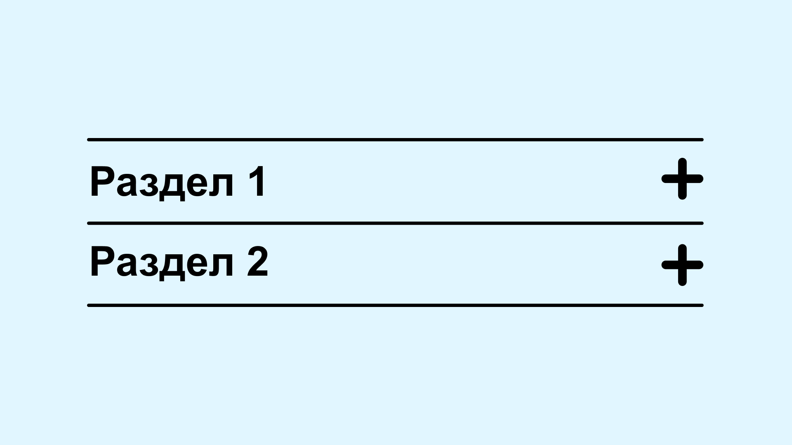
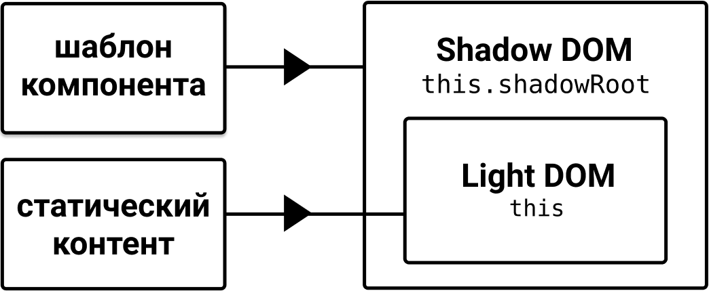
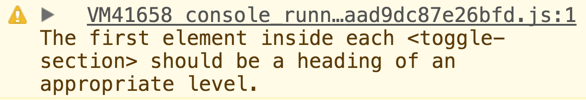
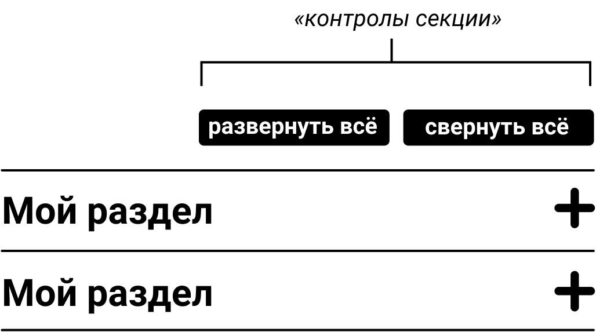

Сворачиваемые секции, возможно, самый элементарный паттерн проектирования взаимодействия в вебе. Всё, что они делают — это переключают видимость контента при клике на заголовок. Ничего особенного.

Хотя это простое взаимодействие, оно [не имеет нативной и одинаковой реализации в разных браузерах](https://caniuse.com/#feat=details). И это несмотря на то, что есть движение в сторону его стандартизации. Так что это отличный аналог «hello world» для погружения в доступность с точки зрения проектирования взаимодействия с использованием JavaScript и WAI-ARIA.

Почему я говорю об этом только после того, как рассказал про более сложные компоненты? Дело в том, что в этой статье я сосредоточусь на опыте автора и разработчика: мы собираемся сделать наши раскрываемые области веб-компонентами, чтобы они могли легко стать частью более крупных паттернов и быть встроенными в существующий контент.

Как и в случае вкладок, это помогает понять, каким будет наш компонент без улучшения при помощи JavaScript и почему это действительно поможет сделать что-то лучше. В этом случае сворачиваемая секция без JavaScript — просто раздел. То есть это подзаголовок, кратко описывающий какой-то контент: текст, медиа, да что угодно.

    <h2>Мой раздел</h2>
    <p>Lorem ipsum dolor sit amet, consectetur adipiscing elit. Cras efficitur laoreet massa. Nam eu porta dolor. Vestibulum pulvinar lorem et nisl tempor lacinia.</p>
    <p>Cras mi nisl, semper ut gravida sed, vulputate vel mauris. In dignissim aliquet fermentum. Donec arcu nunc, tempor sed nunc id, dapibus ornare dolor.</p>

Одно из преимуществ _сворачивания _контента заключается в том, что заголовки становятся смежными элементами. Это даёт пользователю возможность изучить доступный контент без необходимости много скроллить и увидеть его полностью, развернув блок.


Другое преимущество — это то, что пользователям клавиатуры не нужно проходить через все элементы страницы, на которых можно сделать фокус, чтобы попасть туда, куда они хотят. На скрытом контенте его установить нельзя.

## Адаптивная разметка

Рискованно просто добавлять обработчик клика для заголовков, чтобы связать с ними контент. Это не то взаимодействие, которого ожидают вспомогательные технологии или которого можно добиться при помощи клавиатуры. Вместо этого нам нужно адаптировать разметку, добавив в неё стандартную кнопку.

    <h2><button>Мой раздел</button></h2>
    <div>
      <p>Lorem ipsum dolor sit amet, consectetur adipiscing elit. Cras efficitur laoreet massa. Nam eu porta dolor. Vestibulum pulvinar lorem et nisl     tempor lacinia.</p>
      <p>Cras mi nisl, semper ut gravida sed, vulputate vel mauris. In dignissim aliquet fermentum. Donec arcu nunc, tempor sed nunc id, dapibus ornare dolor.</p>
    </div>

**Примечание**: я обернул контент в элемент ```<div>``` для того, чтобы использовать скрипт ниже для его показа и скрытия.

Кнопка в данном случае — дочерний элемент заголовка. Это означает, что, когда пользователь скринридера сделает фокус на ```<button>```, то кнопка будет определена вместе с её родительским элементом: _«Мой раздел, кнопка, заголовок второго уровня»_ (или аналогичным образом в зависимости от скринридера).


Если бы вместо этого мы _преобразовали _заголовок в кнопку, используя ARIA-атрибут ```role="button"```, то переопределили бы семантику заголовка. Пользователи скринридеров потеряли бы заголовок в качестве структурной и навигационной метки.

Также нам бы пришлось кастомизировать код для всех вариантов поведения элемента ```<button>```, например, для поведения при фокусе (см. ```tabindex``` в примере ниже), и привязывать нужные клавиши, чтобы активировать наш кастомный контрол.

    <!-- Не делайте так -->
    <h2 role="button" tabindex="0">Мой раздел</h2>

### Состояние

Наш компонент может находится в одном из двух взаимоисключающих состояний: свёрнутом и развёрнутом. Его состояние может быть отображено визуально, но необходимо также сообщать о нём и программно. Можно сделать это, добавив для кнопки атрибут ```aria-expanded``` с начальным значением ```false``` (в свёрнутом состоянии). Соответственно, нам нужно скрыть связанный ```<div>```. В данном случае при помощи ```hidden```.

    <h2><button aria-expanded="false">Мой раздел</button></h2>
    <div hidden>
      <p>Lorem ipsum dolor sit amet, consectetur adipiscing elit. Cras efficitur laoreet massa. Nam eu porta dolor. Vestibulum     pulvinar lorem et nisl tempor lacinia.</p>
      <p>Cras mi nisl, semper ut gravida sed, vulputate vel mauris. In dignissim aliquet fermentum. Donec arcu nunc, tempor sed nunc id, dapibus ornare dolor.</p>
    </div>

Некоторые совершают ошибку, добавляя ```aria-expanded``` для _управляемого элемента_ вместо контрола. И это понятно, ведь фактически именно у контента переключается состояние. Если подумать, это не принесёт особой пользы: пользователю придётся найти раскрывающийся контент (это возможно только тогда, когда он на самом деле развёрнут!), а потом ещё поискать элемент, который им управляет. Поэтому информация о состоянии сообщается через контрол, который используется для переключения видимости контента.

## Примечание. Это всё ARIA-кнопка?

Да конечно. Нам не нужно добавлять ```role="button"```, так как элементу ```<button>``` неявно задана эта роль (ARIA-роль всего лишь имитирует роль по умолчанию). И, в отличие от [кнопки меню](https://inclusive-components.design/menus-menu-buttons/) _(есть в [переводе на русский](https://medium.com/web-standards/menu-buttons-7f3aa1ad008d). — прим. переводчика)_, нам не нужно сразу же менять контекст при перемещении фокуса. Следовательно, ```aria-haspopup``` в данном случае не подходит.

Некоторые добавляют атрибут ```aria-controls``` и указывают ```id``` для контейнера, в котором хранится контент. Имейте в виду, что атрибут [```aria-controls``` работает только в JAWS](http://www.heydonworks.com/article/aria-controls-is-poop) на момент написания этой статьи _(на момент перевода в октябре 2019 года [ситуация не изменилась](https://a11ysupport.io/tech/aria/aria-controls_attribute). — прим. переводчика)_. Пока контент в разделе следует за заголовком или кнопкой в исходном порядке (source order), это не нужно. Пользователь будет сразу же сталкиваться с раскрытым контентом, когда перемещается дальше по странице.

### Стилизация кнопки

Мы оказались в ситуации, когда используем кнопку, но при этом она должна выглядеть как улучшенная версия заголовка, внутри которого она находится. Наиболее эффективный способ это сделать — удалить все авторские и браузерные стили для кнопок и наследовать их от их родительского заголовка.

    h2 button {
      all: inherit;
    }

Отлично, однако сейчас кнопка интуитивно не понятна ([affordance](https://www.interaction-design.org/literature/book/the-glossary-of-human-computer-interaction/affordances)). Она не выглядит так, будто её можно активировать. Именно здесь обычно добавляется символ плюс или минус. Плюс означает, что раздел может быть развёрнут, а минус, что его можно свернуть.


Теперь возникает такой вопрос: как нам рендерить иконку? Ответ:
максимально эффективно и доступно. Простые формы, например, прямоугольники (```<rect>```) — это хороший способ создания иконок в SVG, поэтому давайте это сделаем.

    <svg viewBox="0 0 10 10">
      <rect height="8" width="2" y="1" x="4"/>
      <rect height="2" width="8" y="4" x="1"/>
    </svg>

Кода так мало, что он может поместиться в твит. Поскольку программно состояние передаётся через атрибут ```aria-expanded```, нам не нужно, чтобы эта графика была доступна для скринридера или была интерактивной. В этом случае нам нужно добавить ещё пару атрибутов.

    <button aria-expanded="false">
      Мой раздел
      <svg viewBox="0 0 10 10" aria-hidden="true" focusable="false">
        <rect class="vert" height="8" width="2" y="1" x="4"/>
        <rect height="2" width="8" y="4" x="1"/>
      </svg>
    </button>

- `aria-hidden="true"` скрывает SVG-иконку от скринридеров и других вспомогательных технологий.
- `focusable="false"` решает проблему добавления фокуса по умолчанию для SVG-файлов в Internet Explorer и Edge.

Обратите внимание на класс ```vert``` для прямоугольника, который представляет собой вертикальную конструкцию. Мы собираемся с помощью CSS показывать и скрывать его в зависимости от состояния, превращая иконку то в плюс, то в минус.

    [aria-expanded="true"] .vert {
      display: none;
    }

Связывание состояния и его визуального представления — _очень хорошая практика_. Это гарантия того, что сообщение об изменении состояния совместимо с разными системами. Не слушайте тех, кто выступает за абсолютное разделение HTML-семантики и CSS-стилей. Форма должна следовать за функцией, и такое решение напрямую более надёжно.

Обратите внимание, что стиль фокуса по умолчанию был сброшен при помощи ```inherit: all```. Можно объявить стиль фокуса для SVG следующим образом:

    h2 button:focus svg {
      outline: 2px solid;
    }

### Высококонтрастные темы

Ещё одна вещь: мы можем обеспечить поддержку высококонтрастных тем для элементов ```<rect>```. Если указать в ```fill``` значение ```currentColor``` для ```<rect>```, то такие элементы изменяют цвет вместе с текстом, когда на него влияет изменение темы.

    [aria-expanded] rect {
      fill: currentColor;
    }

Чтобы протестировать ваш дизайн в высококонтрастной теме в Windows найдите «Высокая контрастность» и выберете нужную тему в пункте «Выбор темы». Многие высококонтрастные темы инвертируют цвета для уменьшения яркости. Это помогает людям, страдающим мигренью или светобоязнью, а также людям с нарушениями зрения.

## Примечание. Почему бы не использовать <use>?

Если у нас много сворачиваемых областей на странице,
то повторное использование одного и того же содержимого SVG-элемента ```<pattern>``` при помощи [элементов ```<use>```](https://wearejh.com/inline-svg-use-element/) и ```xlink:href``` уменьшило бы их избыточность.

    <button aria-expanded="false">
      Мой раздел
      <svg viewBox="0 0 10 10 aria-hidden="true" focusable="false">
        <use xlink:href="#plusminus"/>
      </svg>
    </button>

К сожалению, это означало бы, что мы больше не можем управлять конкретным прямоугольником ```.vert``` для его показа и скрытия. В нашем случае использование небольшого количества строк кода для определения идентичного SVG не такая большая проблема.

## Небольшой скрипт

Учитывая простоту такого взаимодействия, а также все элементы с их семантикой, нам нужно только написать очень лаконичный скрипт:

    (function() {
      const headings = document.querySelectorAll('h2');

      Array.prototype.forEach.call(headings, heading => {
        let btn = heading.querySelector('button');
        let target = heading.nextElementSibling;

        btn.onclick = () => {
          let expanded =
            btn.getAttribute('aria-expanded') === 'true' || false;

          btn.setAttribute('aria-expanded', !expanded);
          target.hidden = expanded;
        }
      })
    })()

[Вот демо на CodePen](https://codepen.io/heydon/pen/QqzRvQ/):

<iframe src="https://codepen.io/heydon/pen/QqzRvQ/"></iframe>

## Прогрессивное улучшение

Проблема со скриптом выше заключается в том, что для него требуется вручную адаптировать HTML для работы сворачивающихся секций. Ожидается, что это реализовано инженером как компонент через шаблон или JSX. Однако для статических сайтов, например, блогов, есть две неизбежные проблемы:

- Если JavaScript недоступен, то в DOM остаются интерактивные элементы, которые ничего не делают, поэтому в этом случае их семантика не имеет смысла.
- Ответственность за создание и поддержку сложного HTML лежит на авторе или редакторе.

Вместо этого мы можем взять базовый ввод текста, скажем, в виде разметки или WYSIWYG _(от англ. «What You See Is What You Get», проще говоря — визуальный редактор. — прим. переводчика)_ и улучшить его _постфактум_ с помощью скрипта. Это довольно просто сделать с помощью jQuery, учитывая методы ```nextUntil``` и ```wrapAll```, однако в обычном JavaScript нам нужно сделать некоторую итерацию. Вот другое демо на CodePen, в котором автоматически добавляются переключатель и группа с контентом для переключения. Он нацелен на все ```<h2>```, найденные на странице в ```<main>```.

<iframe src="https://codepen.io/heydon/pen/gGNaoM"></iframe>

Почему это написано на JavaScript? Потому что современные браузеры одинаково поддерживают методы Web API и такой небольшой интерактив не должен зависеть от большой библиотеки.

## Прогрессивный веб-компонент

Последний пример показывает, что нам не нужно думать о раскрывающихся секциях во время редактирования. Они появляются автоматически. Но то, что мы приобрели в плане удобства, мы потеряли в контроле. Что, если вместо этого, мы найдём компромисс между лаконичной разметкой и тем, какие разделы будут раскрывающимися и в каком состоянии они будут находиться при загрузке страницы после того, что мы _написали_?

Веб-компоненты могут стать ответом. Рассмотрим пример ниже:

    <toggle-section open="false">
      <h2>Мой раздел</h2>
      <p>Lorem ipsum dolor sit amet, consectetur adipiscing elit. Cras efficitur laoreet massa. Nam eu porta dolor. Vestibulum pulvinar lorem et nisl tempor lacinia.</p>
      <p>Cras mi nisl, semper ut gravida sed, vulputate vel mauris. In dignissim aliquet fermentum. Donec arcu nunc, tempor sed nunc id, dapibus ornare dolor.</p>
    </toggle-section>

Имя кастомного элемента проще запомнить, а последствия взаимодействия с ним очевидны благодаря атрибуту ```open```. Ещё лучше то, что, когда JavaScript недоступен, этот внешний элемент обрабатывается как просто-напросто ```<div>```, а сворачиваемая секция остается простым разделом. Это не принесёт никакого вреда.

Фактически, если мы проверяем поддержку элемента с ```<template>``` и ```attachShadow``` при помощи скрипта, то такой же фолбэк будет отображаться в браузерах, которые эти возможности не поддерживают.

    if ('content' in document.createElement('template')) {
      // Определяем <template> для веб-компонента

      if (document.head.attachShadow) {
        // Определяем веб-компонент, используя синтаксис версии v1
      }
    }

## Шаблон

Мы можем добавить элемент шаблона в разметку и ссылаться на него или создать его на лету. Это я собираюсь сделать позже.

    tmpl.innerHTML = `
      <h2>
        <button aria-expanded="false">
          <svg aria-hidden="true" focusable="false" viewBox="0 0 10 10">
            <rect class="vert" height="8" width="2" y="1" x="4"/>
            <rect height="2" width="8" y="4" x="1"/>
          </svg>
        </button>
      </h2>
      <div class="content" hidden>
        <slot></slot>
      </div>
      <style>
        h2 {
          margin: 0;
        }

        h2 button {
          all: inherit;
          box-sizing: border-box;
          display: flex;
          justify-content: space-between;
          width: 100%;
          padding: 0.5em 0;
        }

        button svg {
          height: 1em;
          margin-left: 0.5em;
        }

        [aria-expanded="true"] .vert {
          display: none;
        }

        [aria-expanded] rect {
          fill: currentColor;
        }
     </style>
    `;

Этот шаблон компонента станет поддеревом Shadow DOM.

Когда мы стилизуем сворачиваемую секцию _внутри_ её собственной Shadow DOM, то такие стили не влияют на элементы из Light DOM (стандартной, внешней DOM). Кроме того, они не применяются, если браузер не поддерживает ```<template>``` и кастомные элементы.

## Определение компонента

Обратите внимание на элемент ```<slot>``` в HTML-шаблоне. Он — это окно в нашей Light DOM. В него гораздо проще обернуть контент, который предоставил автор, в отличие от [предыдущего демо с прогрессивным улучшением](https://codepen.io/heydon/pen/gGNaoM).

Внутри компонента ```this.innerHTML``` есть ссылка на этот контент в Light DOM. Мы должны создать ```shadowRoot``` и заполнить его контентом шаблона. Разметка Shadow DOM вместо этого находится в ```this.shadowRoot.innerHTML```.

    class ToggleSection extends HTMLElement {
      constructor() {
        super();

        this.attachShadow({ mode: 'open' });
        this.shadowRoot.appendChild(tmpl.content.cloneNode(true));
      }
    }



С помощью этих ссылок можно переместить Light DOM в Shadow DOM. Это означает, что мы можем повторно использовать лейбл ```<h2>``` в Light DOM и убрать ставший ненужным элемент. Такие манипуляции с DOM могут выглядеть дико, особенно если вы привыкли использовать простые, декларативные (React) компоненты. Однако это то, что делает веб-компоненты прогрессивными.

    this.btn = this.shadowRoot.querySelector('h2 button');
    var oldHeading = this.querySelector('h2');
    var label = oldHeading.textContent;
    this.btn.innerHTML = label + this.btn.innerHTML;
    oldHeading.parentNode.removeChild(oldHeading);

Вообще-то мы можем сделать лучше и поддерживать разные начальные уровни заголовков. Вместо того, чтобы управлять заголовками, можно просто получить первый элемент из Light DOM. Убедитесь, что он — заголовок. Это необходимо для его редактирования. Однако, если это не заголовок, мы можем использовать любой элемент. Я покажу как.

```var oldHeading = this.querySelector(':first-child');```

Сейчас нужно просто убедиться в том, что _уровень_ заголовка в Shadow DOM соответствует оригиналу из Light DOM. Я могу запросить ```tagName``` заголовка из Light DOM и в соответствии с этим повысить его уровень в Shadow DOM при помощи ```aria-level```.

    let level = parseInt(oldHeading.tagName.substr(1));
    this.heading = this.shadowRoot.querySelector('h2');
    if (level && level !== 2) {
      this.heading.setAttribute('aria-level', level);
    }

Второй символ из ```tagName``` спарсился как целое. Если это натуральное число (```NaN``` — ложное) и не ```2```, которое неявно присутствует в ```<h2>```, то применится атрибут ```aria-level```. Элементы, которые не являются заголовками, в качестве фоллбека всё ещё отдают содержимое ```textContent``` как лейбл для хранящегося в Shadow DOM ```<h2>```. Это может сопровождаться «вежливым» (polite) предупреждением ```console.warn```, которое рекомендует разработчикам использовать заголовок в качестве предпочтительного элемента.

    if (!level) {
      console.warn('```У первого элемента внутри каждого ```<toggle-section> должен быть заголовок подходящего уровня.');
    }



Одно из преимуществ использования ```aria-level``` заключается в том, что, в нашем случае, атрибут не используется в качестве стилевого хука (styling hook), поэтому внешний вид заголовка или кнопки остаётся неизменным.

    <h2 aria-level="3">
      <button aria-expanded="false">
        <svg aria-hidden="true" focusable="false" viewBox="0 0 10 10">
          <rect class="vert" height="8" width="2" y="1" x="4"/>
          <rect height="2" width="8" y="4" x="1"/>
        </svg>
      </button>
    </h2>

Если вы хотите, чтобы заголовки вашей сворачиваемой секции внешне отражали их уровень, вы должны включить что-то вроде CSS-стилей ниже:

    toggle-section [aria-level="2"] {
      font-size: 2rem;
    }

    toggle-section [aria-level="3"] {
      font-size: 1.5rem;
    }

    /* И так далее… */

### Роль ```region```

Любой контент, который представлен заголовком, является _де-факто _(под)разделом страницы. Но, как я уже говорил в [«Списке дел»](https://inclusive-components.design/a-todo-list/#headinglevel) (_есть в [переводе на русский](https://medium.com/web-standards/a-todo-list-40a324436b3e). — прим. переводчика_), вы можете использовать явные секционные элементы-контейнеры ```<section>```. Вы добьётесь того же эффекта, если примените атрибут ```role="region"``` к элементу вроде нашего кастомного ```<toggle-section>``` (который, в противном случае, не будет обладать такой семантикой).

    <toggle-section role="region">
      ...
    </toggle-section>

Пользователи скринридеров [больше предпочитают перемещаться по документу по заголовкам, чем по областям](http://www.heydonworks.com/article/responses-to-the-screen-reader-strategy-survey), однако у многих скринридеров _есть_ функция шорткатов по областям страницы (region shortcuts). Добавление атрибута ```role="region"``` даёт довольно много:

- Обеспечивает фоллбек в виде навигационной подсказки для пользователей скринридеров в ситуациях, когда Light DOM не содержит заголовка.
- Объявляется как «область» (region), когда пользователь скринридера попадает в этот раздел и ведёт себя как структурная подсказка.
- Предоставляет стилевой хук в виде ```toggle-button[role="region"]```. Это позволяет нам добавлять те стили, которые мы хотим увидеть, если скрипт запущен и веб-компоненты поддерживаются.

## Привязка ```open и aria-expanded```

Когда значение атрибута ```open``` меняется с ```true``` на ```false``` мы хотим, чтобы было также видно переключение контента. Используя ```observedAttributes()``` и ```attributeChangedCallback()```, мы можем сделать это _напрямую_. Разместим этот код после конструктора компонента:

    static get observedAttributes() {
      return ['open'];
    }

    attributeChangedCallback(name) {
      if (name === 'open') {
        this.switchState();
      }
    }

- ```observedAttributes()``` получает массив всех атрибутов родительского ```<toggle-section>```, которые мы хотим увидеть.
- ```attributeChangedCallback(name)``` позволяет нам выполнять нашу функцию ```switchState()``` в случае изменения значения ```open```.

Преимущество такого подхода в том, что мы можем переключать состояние, используя скрипт, который просто изменяет значение ```open ```за пределами компонента. Чтобы _пользователи_ могли изменить состояние, мы можем просто перебросить ```open``` в функцию клика:

    this.btn.onclick = () => {
      this.setAttribute('open',
        this.getAttribute('open') === 'true' ? 'false' : 'true'
      );
    }

Так как функция ```switchState()``` увеличивает значение ```aria-expanded```, то мы привязали ```open``` к ```aria-expanded```, убедившись в доступности изменения состояния.

    this.switchState = () => {
      let expanded = this.getAttribute('open') === 'true' || false;
      this.btn.setAttribute('aria-expanded', expanded);
      this.shadowRoot.querySelector('.content').hidden = !expanded;
    }

[Вот демо с CodePen с этой версией веб-компонента](https://codepen.io/heydon/pen/ZXdbxj/) с комментариями:

<iframe src="https://codepen.io/heydon/pen/ZXdbxj/"></iframe>

## Свернуть или развернуть всё

Поскольку мы переключаем элемент ```<toggle-section>``` через атрибут ```open```, нужно элементарно дать пользователям возможность развернуть или свернуть всё сразу. Одним из преимуществ такой меры является то, что пользователи, которые открыли несколько разделов независимо друг от друга, могут «сбросить» исходное, свёрнутое состояние для лучшей видимости содержимого. К тому же пользователи, которые считают, что возня с интерактивными элементами отвлекает или утомляет, могут вернуться к прокрутке раскрытых секций.

Кажется заманчивым добавить «развернуть или свернуть всё» как два отдельных переключателя. Но мы не знаем, как много разделов будет изначально в другом состоянии. Мы также не знаем, сколько их пользователь открыл или закрыл вручную.

Поэтому нам нужно сгруппировать два альтернативных контрола.

    <ul class="controls" aria-label="Контролы секции">
      <li><button id="expand">развернуть всё</button></li>
      <li><button id="collapse">свернуть всё</button></li>
    </ul>

Важно объединить в группу связанные контролы, и списки — это стандартная разметка для того, чтобы это сделать. Кроме того списки ссылок рассматривались в [«Меню и кнопки меню»](https://inclusive-components.design/menus-menu-buttons/) _(всё ещё есть [перевод на русский](https://medium.com/web-standards/menu-buttons-7f3aa1ad008d). — прим. переводчика)_. Списки и элементы списков подсказывают пользователям скринридеров о том, что они взаимодействуют со связанными элементами, и количество таких элементов.

У некоторых составных ARIA-виджетов есть свои собственные механизмы группировки, например, ```role="menu"``` группирует элементы с ```role="menuitem"``` или ```role="tablist"``` группирует элементы с ```role="tab"```. Наш вариант использования не подходит ни для одной из этих парадигм, так что хватит простого списка с заголовком.

Так как в тег ```<ul>``` уже встроен «групповой» элемент (group element), то многие вспомогательные технологии знают, что групповая подпись добавляется при помощи ```aria-label```. Когда пользователи VoiceOver попадут в список и сделают фокус на кнопке, то услышат: _«Развернуть всё, кнопка, список, контролы секции, два пункта»_.

Обратите внимание, что при использовании ```aria-label``` добавляется только невидимый лейбл. Это допустимо, если назначение кнопок можно определить визуально с помощью других подсказок, по той же раскладке. В этом случае, вероятно, будет достаточно расположить кнопки рядом с разделами, но нужно это протестировать.



## Отслеживание URL

Одно последнее улучшение.

Обычно, если нет улучшения с помощью JavaScript, пользователи могут переходить по ссылкам на определенные разделы страниц и делиться ими со своими ```hash```. Такое поведение ожидаемо и является частью привычного UX-паттерна в вебе.

Большинство парсеров с этой целью добавляет атрибуты ```id``` для заголовков. Поскольку заголовок для целевого раздела в нашем расширенном интерфейсе может находиться внутри свёрнутого раздела или раздела, на котором не сделан фокус, нам нужно его открыть, чтобы показать контент и перенести фокус на него. Жизненный цикл ```connectedCallback()``` даёт нам это сделать, когда компонент готов. Это похоже на ```DOMContentLoaded```, но только для веб-компонентов.

    connectedCallback() {
      if (window.location.hash.substr(1) === this.heading.id) {
        this.setAttribute('open', 'true');
        this.btn.focus();
      }
    }

Обратите внимание на то, что мы делаем фокус на кнопке внутри заголовка компонента. Это перемещает пользователей клавиатуры к соответствующему компоненту, готовому к взаимодействию. Скринридерами будет объявлен уровень родительского заголовка вместе с названием кнопки.

В дополнение к этому нам нужно обновлять ```hash``` каждый раз, когда пользователи открывают последующий раздел. Тогда они могут поделиться определённым URL без необходимости копаться в инструментах разработчика (если они знают как!), чтобы скопировать и вставить ```id``` заголовка. Давайте используем ```pushState``` для динамичного изменения URL без перезагрузки страницы:

    this.btn.onclick = () => {
      let open = this.getAttribute('open') === 'true' || false;
      this.setAttribute('open', open ? 'false' : 'true');

      if (this.heading.id && !open) {
        history.pushState(null, null, '#' + this.heading.id);
      }
    }

[А вот демо с добавленной возможностью отслеживания ```hash```](https://codepen.io/heydon/pen/ZXgqKG):

<iframe src="https://codepen.io/heydon/pen/ZXgqKG"></iframe>

## Заключение

Ваша роль как дизайнера и разработчика (да, вы можете быть и тем, и другим одновременно) заключается в том, чтобы удовлетворять потребности людей, которые получают ваш контент и используют предложенный вами функционал. Эти потребности охватывают как потребности «конечных пользователей», так и других контрибьютеров. Продукт должен быть, конечно же, доступным и обладать хорошей производительностью, но поддержка и расширение его возможностей не должны быть завязаны на эзотерических технических знаниях.

Вне зависимости от того, используете ли вы веб-компоненты или нет, прогрессивное улучшение не только гарантирует, что интерфейс хорошо структурирован и надёжен. Как мы здесь увидели, это также может упростить процесс редактирования контента. Это делает разработку приложения и его контент более инклюзивным.

## Чеклист

- Не зависьте от больших библиотек в случае небольших взаимодействий, если только рассматриваемая библиотека не будет использоваться для других улучшений взаимодействия.
- Не переопределяйте важные роли элементов. Прочитайте [второе правило использования ARIA](https://www.w3.org/TR/using-aria/#second).
- Поддерживайте высококонтрастные темы в ваших SVG-иконках при помощи ```currentColor```.
- Если контент уже статичный, то это хорошая возможность для прогрессивного улучшения вашего веб-компонента.
- Пожалуйста, используйте информативные лейблы в секциях, а не «Раздел 1», «Раздел 2» и так далее. В таком случае это будут просто плейсхолдеры!
