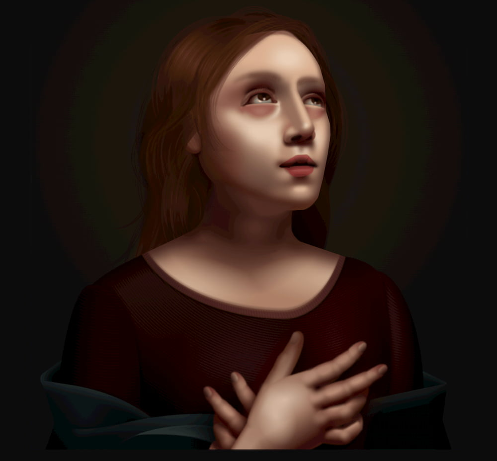

Если бы вы меня спросили, какой вопрос мне чаще всего задают про фронтенд-разработку, я бы ответил: _«Как прокачаться в CSS?»_. Этот вопрос обычно озвучивают после того, как я делюсь сделанными мной CSS-иллюстрациями. Это что-то, что [я люблю делать на CodePen](https://codepen.io/jh3y/pens/).

Для многих CSS — неукротимый мифический зверь. [Этот твит](https://twitter.com/chriscoyier/status/1248088743002677248) от Криса заставил меня улыбнуться, потому что, несмотря на всю иронию, в нём много правды. Тем не менее, что если я скажу вам, что вам нужно всего несколько свойств и техник, чтобы создать всё, что вы хотели? Правда в том, что это действительно так.

Я давно хотел написать подобную статью, но это тяжёлая для обсуждения тема, потому что существует так много возможностей и так много техник, что, как правило, одно и то же можно сделать несколькими способами. То же самое относится и к иллюстрациям в CSS. Нет правильного или неправильного способа. Мы все рисуем на одном и том же холсте. Просто есть много разных инструментов, чтобы поместить все эти пиксели на страницу.

И хотя не существует универсального подхода для CSS-иллюстраций, я могу предложить несколько техник, которые помогут вам в вашем путешествии.

<iframe height="500" style="width: 100%;" scrolling="no" title="Pure CSS drawers using <details> &amp; <summary> 🔨🔩🤓 #CodePenChallenge" src="https://codepen.io/jh3y/embed/preview/mLaXRe?height=500&amp;theme-id=dark&amp;default-tab=result" frameborder="no" allowtransparency="true" allowfullscreen="true">See the Pen <a href="https://codepen.io/jh3y/pen/mLaXRe">Pure CSS drawers using &lt;details&gt; &amp; &lt;summary&gt; 🔨🔩🤓 #CodePenChallenge</a> by Jhey (<a href="https://codepen.io/jh3y">@jh3y</a>) on <a href="https://codepen.io">CodePen</a>.</iframe>

## Время и практика

CSS-иллюстрация требует много времени и практики. Чем точнее вы хотите быть и чем сложнее иллюстрация, тем больше времени она займёт. Больше всего времени отнимает не решение, какие свойства использовать и как, а отшлифовка результата до состояния, чтобы всё выглядело правильно. **Будьте готовы изучить [инспектор стилей](https://developers.google.com/web/tools/chrome-devtools/css) в вашем браузере!** Я также рекомендую попробовать [VisBug](https://chrome.google.com/webstore/detail/visbug/cdockenadnadldjbbgcallicgledbeoc?hl=en), если вы этого ещё не сделали.

Два фантастических CSS-художника — Бен Эванс и Диана Смит. Оба недавно рассказывали о затратах времени на CSS-иллюстрации.

<figure>
    
    <figcaption>
        Создание PureCSS Gaze у Дианы заняло два долгих уик-энда. Она рассказывает о некоторых своих техниках <a href="https://www.vice.com/en_us/article/9kgx7p/painting-made-with-code-html-pure-css-browser-art-diana-smith">здесь</a>. «Если у вас есть время, терпение и запал, то это, безусловно, возможно», — говорит она.
    </figcaption>
</figure>

Я запостил мем про чашку, и в [ответе Бена](https://twitter.com/ivorjetski/status/1259893362129350658) всё было прекрасно:

> Когда в первый раз увидел твит, мне захотелось сделать это на CSS, но потом подумал, что мой ответ займет около месяца.

Это требует времени!

<blockquote class="twitter-tweet"><p lang="en" dir="ltr">CSS Illustration <a href="https://t.co/vqpQLKTte5">pic.twitter.com/vqpQLKTte5</a></p>&mdash; Jhey 🛠 (@jh3yy) <a href="https://twitter.com/jh3yy/status/1259487385554911233?ref_src=twsrc%5Etfw">May 10, 2020</a></blockquote> <script async src="https://platform.twitter.com/widgets.js" charset="utf-8"></script>

## Трассировка вполне приемлема

Зачастую мы уже имеем представление о том, что хотим нарисовать. В конце концов, эта статья не о дизайне. Речь идет о захвате изображения и его рендеринге с помощью DOM и CSS. Я уверен, что эта техника существует с незапамятных времен. Но это то, чем я делюсь последние несколько месяцев.

- Найдите или создайте изображение, которое вы хотите нарисовать.
- Вставьте его в ваш HTML при помощи тега \.
- Расположите его так, чтобы оно находилось прямо под вашей иллюстрацией.
- Уменьшите прозрачность изображения, чтобы его было видно, но не слишком.
- Трассируйте его с помощью DOM.

К моему удивлению, про эту технику [не все знают](https://twitter.com/therealpaulcook/status/1256283143587405824). Но она бесценна для создания точных CSS-иллюстраций.

Следите за трюком в действии:

<blockquote class="twitter-tweet"><p lang="en" dir="ltr">Here&#39;s a timelapse of creating that CSS <a href="https://twitter.com/eggheadio?ref_src=twsrc%5Etfw">@eggheadio</a> 😎<br><br>Tweaked the shadows with clip-path after 🛠️<br><br>💻 <a href="https://t.co/XhDRspwwFg">https://t.co/XhDRspwwFg</a> via <a href="https://twitter.com/CodePen?ref_src=twsrc%5Etfw">@CodePen</a> <a href="https://twitter.com/hashtag/webdev?src=hash&amp;ref_src=twsrc%5Etfw">#webdev</a> <a href="https://twitter.com/hashtag/coding?src=hash&amp;ref_src=twsrc%5Etfw">#coding</a> <a href="https://twitter.com/hashtag/CSS?src=hash&amp;ref_src=twsrc%5Etfw">#CSS</a> <a href="https://twitter.com/hashtag/animation?src=hash&amp;ref_src=twsrc%5Etfw">#animation</a> <a href="https://twitter.com/hashtag/webdesign?src=hash&amp;ref_src=twsrc%5Etfw">#webdesign</a> <a href="https://twitter.com/hashtag/design?src=hash&amp;ref_src=twsrc%5Etfw">#design</a> <a href="https://twitter.com/hashtag/creative?src=hash&amp;ref_src=twsrc%5Etfw">#creative</a> <a href="https://twitter.com/hashtag/100DaysOfCode?src=hash&amp;ref_src=twsrc%5Etfw">#100DaysOfCode</a> <a href="https://twitter.com/hashtag/HTML?src=hash&amp;ref_src=twsrc%5Etfw">#HTML</a> <a href="https://twitter.com/hashtag/Timelapse?src=hash&amp;ref_src=twsrc%5Etfw">#Timelapse</a> <a href="https://t.co/ZQ1hyzcoSA">https://t.co/ZQ1hyzcoSA</a> <a href="https://t.co/iPf7ksYCGX">pic.twitter.com/iPf7ksYCGX</a></p>&mdash; Jhey 🛠 (@jh3yy) <a href="https://twitter.com/jh3yy/status/1256281143244136448?ref_src=twsrc%5Etfw">May 1, 2020</a></blockquote> <script async src="https://platform.twitter.com/widgets.js" charset="utf-8"></script>

И попробуйте его здесь:

<iframe height="450" style="width: 100%;" scrolling="no" title="Toggle PS5 CSS &quot;Tracing&quot;" src="https://codepen.io/jh3y/embed/preview/OJMNVZR?height=450&theme-id=dark&default-tab=result" frameborder="no" allowtransparency="true" allowfullscreen="true">
  See the Pen <a href='https://codepen.io/jh3y/pen/OJMNVZR'>Toggle PS5 CSS &quot;Tracing&quot;</a> by Jhey
  (<a href='https://codepen.io/jh3y'>@jh3y</a>) on <a href='https://codepen.io'>CodePen</a>.
</iframe>

## Обращайте внимание на отзывчивость

Если вы начнёте использовать только две техники из этой статьи, пусть это будут «Трассировка» из раздела выше и эта.

Есть немало фантастических примеров CSS-иллюстраций. Но одна из неприятных особенностей некоторых из них в том, что они не стилизованы — или даже не видны — на маленьких экранах. Мы живём в эпоху, когда очень важны первые впечатления от технологий. Рассмотрим на примере клавиатуры, нарисованной на CSS. Кто-то находит вашу работу, открывает её на своём смартфоне, а его встречает только половина иллюстрации или её небольшая часть. Они скорее всего упустили самые крутые части демо!

Вот мой приём: **использовать единицы вьюпорта для иллюстраций и создавать свою собственную масштабированную единицу измерения**.

Для размеров и позиционирования вы можете использовать либо масштабированную единицу измерения, либо проценты. Это особенно полезно, когда вам нужно использовать `box-shadow`, потому что это свойство работает с единицами вьюпорта, но не работает с процентами.

Рассмотрим CSS-логотип egghead.io, который я создал ранее. Я нашел изображение, которое хотел использовать, и добавил его в DOM тегом img.

```html

```

```css
img {
  height: 50vmin;
  left: 50%;
  opacity: 0.25;
  position: fixed;
  top: 50%;
  transform: translate(-50%, -50%);
}
```

Высота `50vmin` — желаемый размер CSS-иллюстрации. Уменьшение прозрачности позволяет нам «трассировать» иллюстрацию по мере прогресса.

Теперь создадим нашу масштабированную единицу измерения.

```css
/**
  * размеры изображения 742 x 769
  * ширина — 742
  * высота — 769
  * желаемый размер — 50vmin
*/
:root {
  --size: 50;
  --unit: calc((var(--size) / 769) * 1vmin);
}
```

Зная размеры изображения, мы можем создать единицу измерения, которая будет масштабироваться вместе с нашим изображением. Мы знаем, что высота — это самая большая сторона, поэтому используем её как основу для создания дробной единицы.

Получим что-то вроде такого:

```css
--unit: 0.06501950585vmin;
```

Выглядит так себе, но поверьте, это нормально. Мы можем использовать её для задания размеров контейнера для иллюстации, используя `calc()`.

```css
.egg {
  height: calc(769 * var(--unit));
  position: relative;
  width: calc(742 * var(--unit));
  z-index: 2;
}
```

Если мы используем проценты или наше новое кастомное свойство `-⁠-⁠unit` для стилизации элементов внутри контейнера нашей CSS-иллюстрации, мы получим отзывчивую CSS-иллюстрацию… И всё это требует всего несколько строчек математики с использованием CSS-переменных!

Поизменяйте размеры этого демо, чтобы увидеть, что все пропорции сохраняются, ограничиваясь по размеру до `50vmin`.

<iframe height="450" style="width: 100%;" scrolling="no" title="Responsive CSS Egghead 🍳" src="https://codepen.io/jh3y/embed/preview/rNOzYJZ?height=450&theme-id=dark&default-tab=result" frameborder="no" allowtransparency="true" allowfullscreen="true">
  See the Pen <a href='https://codepen.io/jh3y/pen/rNOzYJZ'>Responsive CSS Egghead 🍳</a> by Jhey
  (<a href='https://codepen.io/jh3y'>@jh3y</a>) on <a href='https://codepen.io'>CodePen</a>.
</iframe>

## Семь раз отмерь, один отрежь

Следующий совет: замеряйте. Чёрт возьми, вы даже можете взять рулетку, если работаете с физическим объектом!

<iframe height="450" style="width: 100%;" scrolling="no" title="Pure CSS Home Media 📺😎 (Ambilight - Try the lights! 😉)" src="https://codepen.io/jh3y/embed/preview/BaNGKPw?height=450&theme-id=dark&default-tab=result" frameborder="no" allowtransparency="true" allowfullscreen="true">
  See the Pen <a href='https://codepen.io/jh3y/pen/BaNGKPw'>Pure CSS Home Media 📺😎 (Ambilight - Try the lights! 😉)</a> by Jhey
  (<a href='https://codepen.io/jh3y'>@jh3y</a>) on <a href='https://codepen.io'>CodePen</a>.
</iframe>

Это может показаться немного странным, но я замерял эту сцену. Это телевизор с полками, которые стоят в моей гостиной. Все замеры сделаны в сантиметрах. Я использовал их для получения отзывчивой единицы измерения, основанной на фактической высоте телевизора. Благодаря кастомным свойствам мы можем дать этому числу — и всем остальным — имя, которое позволит легко запомнить, для чего оно предназначено.

```css
:root {
  --light-switch: 15;
  --light-switch-border: 10;
  --light-switch-top: 15;
  --light-switch-bottom: 25;
  --tv-bezel: 15;
  --tv-unit-bezel: 4;
  --desired-height: 25vmin;
  --one-cm: calc(var(--desired-height) / var(--tv-height));
  --tv-width: 158.1;
  --tv-height: 89.4;
  --unit-height: 42;
  --unit-width: 180;
  --unit-top: 78.7;
  --tv-bottom: 114.3;
  --scaled-tv-width: calc(var(--tv-width) * var(--one-cm));
  --scaled-tv-height: calc(var(--tv-height) * var(--one-cm));
  --scaled-unit-width: calc(var(--unit-width) * var(--one-cm));
  --scaled-unit-height: calc(var(--unit-height) * var(--one-cm));
}
```

Как только мы вычислили переменную, можем использовать её везде. Я знаю, что мой телевизор 158.1 см в ширину и 89.4 см в высоту — подсмотрел в инструкции. Но в моей CSS-иллюстрации он всегда будет ограничен `25vmin`.

## Используйте абсолютное позиционирование для всего

Этот совет позволит сэкономить на нажатиях клавиш. Чаще всего вы будете пытаться позиционировать элементы абсолютно. Помогите себе и положите это правило куда-нибудь.

```css
/* Имена классов могут отличаться */
.css-illustration *,
.css-illustration *:after,
.css-illustration *:before,
.css-illustration:after,
.css-illustration:before {
  box-sizing: border-box;
  position: absolute;
}
```

Ваша клавиатура скажет вам спасибо!

Или поиграйте с этой песочницей:

<iframe height="450" style="width: 100%;" scrolling="no" title="position: absolute playground" src="https://codepen.io/jh3y/embed/preview/pogyJbw?height=450&theme-id=dark&default-tab=result" frameborder="no" allowtransparency="true" allowfullscreen="true">
  See the Pen <a href='https://codepen.io/jh3y/pen/pogyJbw'>position: absolute playground</a> by Jhey
  (<a href='https://codepen.io/jh3y'>@jh3y</a>) on <a href='https://codepen.io'>CodePen</a>.
</iframe>

## Придерживайтесь подхода

Это, безусловно, самая сложная вещь. Какой подход вы используете к CSS-иллюстрации? С чего начинаете? Должны ли вы начать с внешней части и идти внутрь картинки? Это работает не так хорошо, как хотелось бы.

Скорее всего, вы попробуете несколько подходов и найдёте лучший способ решить задачу. Вы, конечно, будете переделывать некоторые вещи, но чем больше вы будете практиковаться, тем чаще будете замечать шаблонные вещи и разработаете подход, который лучше всего подходит для вас.

Я склонен связывать свой подход с тем, как бы вы создавали векторное изображение, если иллюстрация состоит из слоёв. Разделите её и нарисуйте на бумаге, если нужно. Но начните снизу и прорабатывайте свой путь наверх. Это обычно означает более крупные фигуры сначала, а более мелкие детали — позже. Вы всегда можете повозиться с контекстом наложения, когда вам нужно подвигать элементы.

## Сохраняйте жёсткую структуру ваших стилей

Это приводит нас к структуре. Старайтесь избегать плоской DOM-структуры для вашей иллюстрации. Сохранение вещей атомарными позволяет проще двигать части вашей иллюстрации. Также так гораздо проще показывать или прятать части иллюстрации или даже потом анимировать их. Рассмотрим демо CSS Snorlax. Руки, ноги, голова и прочие части являются отдельными элементами. Это сделало анимирование руки гораздо проще, чем если бы я пытался держать всё вместе, так как я смог просто применить анимацию к классу `.snorlax__arm-left`.

<iframe height="450" style="width: 100%;" scrolling="no" title="Pure Responsive CSS Snorlax 😅" src="https://codepen.io/jh3y/embed/preview/yLYXVJa?height=450&theme-id=dark&default-tab=result" frameborder="no" allowtransparency="true" allowfullscreen="true">
  See the Pen <a href='https://codepen.io/jh3y/pen/yLYXVJa'>Pure Responsive CSS Snorlax 😅</a> by Jhey
  (<a href='https://codepen.io/jh3y'>@jh3y</a>) on <a href='https://codepen.io'>CodePen</a>.
</iframe>

Вот ускоренная запись того, как я делал это демо:

<blockquote class="twitter-tweet"><p lang="en" dir="ltr">Attempted to put together a timelapse of the CSS Snorlax we built last night 😅<br><br>Amusing watching it back!<br><br>💻 <a href="https://t.co/vbVYmFUN5V">https://t.co/vbVYmFUN5V</a> via <a href="https://twitter.com/CodePen?ref_src=twsrc%5Etfw">@CodePen</a><a href="https://twitter.com/hashtag/webdev?src=hash&amp;ref_src=twsrc%5Etfw">#webdev</a> <a href="https://twitter.com/hashtag/coding?src=hash&amp;ref_src=twsrc%5Etfw">#coding</a> <a href="https://twitter.com/hashtag/HTML?src=hash&amp;ref_src=twsrc%5Etfw">#HTML</a> <a href="https://twitter.com/hashtag/CSS?src=hash&amp;ref_src=twsrc%5Etfw">#CSS</a> <a href="https://twitter.com/hashtag/webdesign?src=hash&amp;ref_src=twsrc%5Etfw">#webdesign</a> <a href="https://twitter.com/hashtag/100DaysOfCode?src=hash&amp;ref_src=twsrc%5Etfw">#100DaysOfCode</a> <a href="https://twitter.com/hashtag/creative?src=hash&amp;ref_src=twsrc%5Etfw">#creative</a> <a href="https://twitter.com/hashtag/design?src=hash&amp;ref_src=twsrc%5Etfw">#design</a> <a href="https://twitter.com/hashtag/animation?src=hash&amp;ref_src=twsrc%5Etfw">#animation</a> <a href="https://t.co/0mJtLPRQfP">pic.twitter.com/0mJtLPRQfP</a></p>&mdash; Jhey 🛠 (@jh3yy) <a href="https://twitter.com/jh3yy/status/1255207715137339396?ref_src=twsrc%5Etfw">April 28, 2020</a></blockquote> <script async src="https://platform.twitter.com/widgets.js" charset="utf-8"></script>

## Работа с неудобными фигурами

Есть [довольно неплохая статья](https://css-tricks.com/the-shapes-of-css/) на CSS-Tricks про создание фигур с помощью CSS. Но как насчёт более «неуклюжих» фигур, таких как длинная кривая или даже обводка? В таких случаях нужно мыслить нестандартно. Такие свойства, как `overflow`, `border-radius` и `clip-path` — отличные помощники.

Посмотрим на демо CSS Jigglypuff. Нажмите на чекбокс.

<iframe height="450" style="width: 100%;" scrolling="no" title="Jigglypuff with body toggle" src="https://codepen.io/jh3y/embed/preview/gOaVJMB?height=450&theme-id=dark&default-tab=result" frameborder="no" allowtransparency="true" allowfullscreen="true">
  See the Pen <a href='https://codepen.io/jh3y/pen/gOaVJMB'>Jigglypuff with body toggle</a> by Jhey
  (<a href='https://codepen.io/jh3y'>@jh3y</a>) on <a href='https://codepen.io'>CodePen</a>.
</iframe>

Вот ключ к созданию искривлённых фигур! У нас есть элемент, который гораздо больше тела, к которому применяется `border-radius`. Затем мы применяем `overflow: hidden` к телу, чтобы обрезать этот лишний кусок.

Как мы можем сделать обводку? Это уже немного сложнее. Но мне нравится следующий приём: используйте прозрачный элемент с толстой рамкой. Затем примените `border-radius` и обрежьте лишнее, если нужно.

<iframe height="450" style="width: 100%;" scrolling="no" title="Creating an outer curve with CSS" src="https://codepen.io/jh3y/embed/preview/ZEbgNKO?height=450&theme-id=dark&default-tab=result" frameborder="no" allowtransparency="true" allowfullscreen="true">
  See the Pen <a href='https://codepen.io/jh3y/pen/ZEbgNKO'>Creating an outer curve with CSS</a> by Jhey
  (<a href='https://codepen.io/jh3y'>@jh3y</a>) on <a href='https://codepen.io'>CodePen</a>.
</iframe>

Если вы нажмёте на чекбокс, покажется элемент, который мы используем для обводки этого угла. Другой приём может заключаться в том, чтобы наложить поверх круг, совпадающий по цвету с фоном. Это нормально, пока нам не понадобится изменить цвет фона. Хорошо, если у вас есть переменная или что-то вроде для этого цвета. Но такой подход слегка сложнее поддерживать.

## `clip-path` — ваш друг

В последнем демо вы могли заметить парочку интересных CSS-свойств, например, `clip-path`. Вам почти наверняка понадобится [`clip-path`](https://css-tricks.com/almanac/properties/c/clip-path/), если вы хотите создавать сложные CSS-фигуры. Его особенно удобно использовать для обрезания краёв элементов, когда применение `overflow` на родителе не помогает.

Вот небольшое демо, которое я собрал некоторое время назад, чтобы показать различные возможности `clip-path`.

<iframe height="450" style="width: 100%;" scrolling="no" title="clip-path generator w/ React + CSS variables 😎🤓" src="https://codepen.io/jh3y/embed/preview/XqVQqa?height=450&theme-id=dark&default-tab=result" frameborder="no" allowtransparency="true" allowfullscreen="true">
  See the Pen <a href='https://codepen.io/jh3y/pen/XqVQqa'>clip-path generator w/ React + CSS variables 😎🤓</a> by Jhey
  (<a href='https://codepen.io/jh3y'>@jh3y</a>) on <a href='https://codepen.io'>CodePen</a>.
</iframe>

Есть ещё такое демо, которое берёт идеи из статьи [Shapes of CSS](https://css-tricks.com/the-shapes-of-css/) и воссоздаёт фигуры при помощи `clip-path`.

<iframe height="450" style="width: 100%;" scrolling="no" title="The Clips of CSS 👇" src="https://codepen.io/jh3y/embed/preview/gOpLBEa?height=450&theme-id=dark&default-tab=result" frameborder="no" allowtransparency="true" allowfullscreen="true">
  See the Pen <a href='https://codepen.io/jh3y/pen/gOpLBEa'>The Clips of CSS 👇</a> by Jhey
  (<a href='https://codepen.io/jh3y'>@jh3y</a>) on <a href='https://codepen.io'>CodePen</a>.
</iframe>

## `border-radius` — ещё один друг

Вам точно понадобится [`border-radius`](https://css-tricks.com/almanac/properties/b/border-radius/) для создания кривых. Один необычный приём заключается в использовании «двойного» синтаксиса. Это позволяет задавать горизонтальный и вертикальный радиус для каждого угла.

Поиграйте с этим демо, чтобы по-настоящему оценить мощь `border-radius`. Я пропагандирую использование процентов для значений, чтобы сохранять отзывчивость элементов.

<iframe height="450" style="width: 100%;" scrolling="no" title="border-radius playground" src="https://codepen.io/jh3y/embed/preview/XWmvwYg?height=450&theme-id=dark&default-tab=result" frameborder="no" allowtransparency="true" allowfullscreen="true">
  See the Pen <a href='https://codepen.io/jh3y/pen/XWmvwYg'>border-radius playground</a> by Jhey
  (<a href='https://codepen.io/jh3y'>@jh3y</a>) on <a href='https://codepen.io'>CodePen</a>.
</iframe>

## Техники создания теней

У вас уже есть все формы, всё хорошо продумано, правильные цвета везде, где нужно… Но что-то всё ещё выглядит не так. Скорее всего, это отсутствие теней.

Тени добавляют глубину и создают реалистичные ощущения. Посмотрим на это воссоздание иллюстрации Галь Шир. Галь великолепно использует тени и градиенты для создания красивой иллюстрации. Я подумал, что было бы интересно воссоздать её и добавить переключатель, который включает и выключает затенение, чтобы оценить разницу, которое оно создаёт.

<iframe height="450" style="width: 100%;" scrolling="no" title="CSS cauldron with toggle shading" src="https://codepen.io/jh3y/embed/preview/OJMNyVg?height=450&theme-id=dark&default-tab=result" frameborder="no" allowtransparency="true" allowfullscreen="true">
  See the Pen <a href='https://codepen.io/jh3y/pen/OJMNyVg'>CSS cauldron with toggle shading</a> by Jhey
  (<a href='https://codepen.io/jh3y'>@jh3y</a>) on <a href='https://codepen.io'>CodePen</a>.
</iframe>

Эффекты затенения часто создаются при помощи комбинации `box-shadow` и `background-image`.

Ключевая особенность этих свойств в том, что мы можем складывать их в список, разделённый запятой. Например, у котла в этом демо есть список градиентов, которые используются по всему его телу.

```css
.cauldron {
  background:
    radial-gradient(25% 25% at 25% 55%, var(--rim-color), transparent),
    radial-gradient(100% 100% at -2% 50%, transparent, transparent 92%, var(--cauldron-color)),
    radial-gradient(100% 100% at -5% 50%, transparent, transparent 80%, var(--darkness)),
    linear-gradient(310deg, var(--inner-rim-color) 25%, transparent), var(--cauldron-color);
}
```

Обратите внимание, что здесь используются `radial-gradient()` и `linear-gradient()`, и они не всегда содержат идеально круглые числовые значения. Опять же, такие числа нормальны. На самом деле вы потратите много времени, настраивая и подкручивая разные значения в инспекторе стилей.

То же самое применимо и к [`box-shadow`](https://css-tricks.com/snippets/css/css-box-shadow/). Однако с ним мы также можем использовать значение `inset`, чтобы создавать хитрые границы и дополнительную глубину.

```css
.cauldron__opening {
  box-shadow:
    0 0px calc(var(--size) * 0.05px) calc(var(--size) * 0.005px) var(--rim-color) inset,
    0 calc(var(--size) * 0.025px) 0 calc(var(--size) * 0.025px) var(--inner-rim-color) inset,
    0 10px 20px 0px var(--darkness), 0 10px 20px -10px var(--inner-rim-color);
}
```

Конечно, бывают случаи, когда куда разумнее использовать [`filter: drop-shadow()`](https://css-tricks.com/almanac/properties/f/filter/), чтобы получить желаемый эффект.

Сайт Линн Фишер [a.singlediv.com](https://a.singlediv.com/) — яркий пример этих свойств в действии. Потыкайте в разные элементы на этом сайте и исследуйте некоторые из иллюстраций, чтобы найти отличные способы применения `box-shadow` и `background-image` в иллюстрациях.

`box-shadow` настолько мощный, что вы можете создать целую иллюстрацию только с ним. Я однажды пошутил о создании CSS-иллюстрации доллара.

<blockquote class="twitter-tweet"><p lang="en" dir="ltr">In CSS right? 😅<a href="https://twitter.com/hashtag/webdev?src=hash&amp;ref_src=twsrc%5Etfw">#webdev</a> <a href="https://twitter.com/hashtag/CSS?src=hash&amp;ref_src=twsrc%5Etfw">#CSS</a> <a href="https://twitter.com/hashtag/animation?src=hash&amp;ref_src=twsrc%5Etfw">#animation</a> <a href="https://twitter.com/hashtag/webdesign?src=hash&amp;ref_src=twsrc%5Etfw">#webdesign</a> <a href="https://twitter.com/hashtag/coding?src=hash&amp;ref_src=twsrc%5Etfw">#coding</a> <a href="https://twitter.com/hashtag/100DaysOfCode?src=hash&amp;ref_src=twsrc%5Etfw">#100DaysOfCode</a> <a href="https://twitter.com/hashtag/HTML?src=hash&amp;ref_src=twsrc%5Etfw">#HTML</a> <a href="https://t.co/VmyeySsK83">https://t.co/VmyeySsK83</a></p>&mdash; Jhey 🛠 (@jh3yy) <a href="https://twitter.com/jh3yy/status/1252924614281486336?ref_src=twsrc%5Etfw">April 22, 2020</a></blockquote> <script async src="https://platform.twitter.com/widgets.js" charset="utf-8"></script>

Я использовал генератор, чтобы [создать иллюстрацию всего из одного div](https://codepen.io/jh3y/details/eYpBwgN). Но Альваро Монторо [пошёл дальше](https://dev.to/alvaromontoro/drawing-a-single-element-dollar-bill-with-css-and-javascript-3mj4) и написал генератор, который вместо этого использует `box-shadow`.

## Препроцессоры очень полезны

Хоть это и не необходимо, использование препроцессоров может помочь содержать ваш код в чистоте и порядке. Например, Pug позволяет писать HTML быстрее, особенно когда нужно использовать циклы для работы с группой повторяющихся элементов. А дальше мы можем [ограничить кастомные CSS-свойства](https://css-tricks.com/the-power-and-fun-of-scope-with-css-custom-properties/) таким образом, чтобы нужно было определить стили всего один раз, а затем переопределять их при необходимости.

<iframe height="450" style="width: 100%;" scrolling="no" title="Pure CSS &lt;table&gt; flip toggle! 😉🎉 #CodePenChallenge" src="https://codepen.io/jh3y/embed/preview/xJXvjP?height=450&theme-id=dark&default-tab=result" frameborder="no" allowtransparency="true" allowfullscreen="true">
  See the Pen <a href='https://codepen.io/jh3y/pen/xJXvjP'>Pure CSS &lt;table&gt; flip toggle! 😉🎉 #CodePenChallenge</a> by Jhey
  (<a href='https://codepen.io/jh3y'>@jh3y</a>) on <a href='https://codepen.io'>CodePen</a>.
</iframe>

Вот другой пример, который демонстрирует структуру по принципу DRY. Цветы свёрстаны с одинаковой разметкой, но каждый имеет свой собственный класс с индексом, который используется для переопределения CSS-свойств.

<iframe height="450" style="width: 100%;" scrolling="no" title="Responsive CSS Leif - Animal Crossing 🐻" src="https://codepen.io/jh3y/embed/preview/eYpjXvj?height=450&theme-id=dark&default-tab=result" frameborder="no" allowtransparency="true" allowfullscreen="true">
  See the Pen <a href='https://codepen.io/jh3y/pen/eYpjXvj'>Responsive CSS Leif - Animal Crossing 🐻</a> by Jhey
  (<a href='https://codepen.io/jh3y'>@jh3y</a>) on <a href='https://codepen.io'>CodePen</a>.
</iframe>

У первого цветка такие свойства:

```css
.flower--1 {
  --hue: 190;
  --x: 0;
  --y: 0;
  --size: 125;
  --r: 0;
}
```

Это первый, все остальные основаны на нём. Обратите внимание, что второй цветок немного смещён вправо и вверх. Всё, что нужно, это дать разные значения тем же кастомным свойствам:

```css
.flower--2 {
  --hue: 320;
  --x: 140;
  --y: -75;
  --size: 75;
  --r: 40;
}
```

<blockquote class="twitter-tweet"><p lang="en" dir="ltr">Animated responsive CSS Leif features in the latest CodePen Spark! ✨<br><br>For those who don&#39;t know Animal Crossing, Leif is a green-thumbed Sloth who visits your island 🌻<br><br>Here&#39;s a timelapse! 📹<br><br>💻 <a href="https://t.co/tkHX4nWXp7">https://t.co/tkHX4nWXp7</a> via <a href="https://twitter.com/CodePen?ref_src=twsrc%5Etfw">@CodePen</a> <a href="https://t.co/naJIrsSlYM">pic.twitter.com/naJIrsSlYM</a></p>&mdash; Jhey 🛠 (@jh3yy) <a href="https://twitter.com/jh3yy/status/1262856791873945601?ref_src=twsrc%5Etfw">May 19, 2020</a></blockquote> <script async src="https://platform.twitter.com/widgets.js" charset="utf-8"></script>

## Вот и всё!

Продолжайте, используйте эти советы, придумывайте свои собственные, делитесь ими, а также делитесь своими CSS-шедеврами! И, эй, если у вас есть свои лайфхаки, пожалуйста, делитесь ими тоже! Это определённо то, чему учатся методом проб и ошибок. То, что работает у меня, может отличаться от того, что работает у вас, и мы можем учиться на этих разных подходах.
