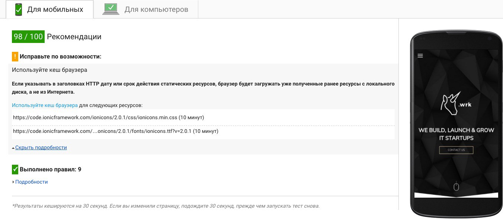
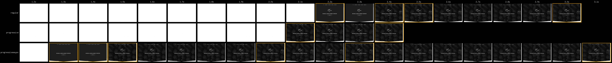

Однажды я прочел статью на Хабре о результатах, полученных при проведении ребятами из Google различных тестов. Они выяснили, что в большинстве сценариев встраивание стилей в HTML приводит к более быстрой загрузке страницы, чем подключение стилей одним файлом. Тем не менее, такой трюк я не применял, за одним исключением: в одном проекте, в котором я принимал участие, было реализовано встраивание стилей на страницу сгенерированного лендинга, что действительно немного ускоряло загрузку. При разработке обычных сайтов заморачиваться с загрузкой стилей не обязательно, но есть и такие проекты, где необходимо показать страницу пользователю как можно скорее, ведь это может улучшить аудиторные показатели. Для этого существуют, как минимум, две практики: «критический CSS» и «прогрессивный CSS».

## Критический CSS

Основной принцип в обеих практиках заключается в том, что стили загружаются постепенно, а не все сразу. Критический CSS — это стили, которые необходимы для отрисовки первой видимой части страницы. Выделить такие стили автоматически вы можете с помощью пакета [CriticalCSS](https://github.com/filamentgroup/criticalCSS). Для моментальной отрисовки критический CSS встраивают в HTML, все остальные стили загружаются отдельным файлом асинхронно.

<figure>
    
    <figcaption>Обычная загрузка в `<head>`.</figcaption>
</figure>

<figure>
    
    <figcaption>Загрузка с критическими стилями.</figcaption>
</figure>

При отрисовке HTML, как только браузер встречает `<script>` или `<link>`, он останавливается и ждёт, пока JS или CSS-файл загрузится, и только после этого идет дальше. При использовании `<script>` с атрибутами `async` и `defer`, мы можем попросить браузер загружать скрипт асинхронно, без блокировки рендеринга страницы, но у `<link>` таких атрибутов нет. Из этой ситуации нас спасёт функция [loadCSS](https://github.com/filamentgroup/loadCSS) — её использование позволит вашей странице отрисоваться с критическим CSS и не ждать полной загрузки остальных стилей.

```html
<!DOCTYPE html>
<html>
    <head>
        <script>
            // loadCSS.js
        </script>
        <style>
            /* Критические стили */
            .article,
            .comments,
            .about,
            .footer {
                display: none;
            }
        </style>
        <script>
            /* Остальные стили */
            loadCSS('style.css');
        </script>
    </head>
    <body>
        …
    </body>
</html>
```

Как это работает? Если коротко, то эта функция создает `<link rel="stylesheet">` с атрибутом `media="only x"`. Таким образом, браузер загружает стили, при этом не блокируя рендеринг страницы. После того, как стили загружены, атрибуту задается значение `media="all"`. В современных браузерах, поддерживающих rel="preload" для `<link>`, можно обойтись без loadCSS.

```html
<link rel="preload" href="/style.css" as="style" onload="this.rel='stylesheet'">
<noscript>
    <link rel="stylesheet" href="style.css">
</noscript>
```

С `media="only x"` такой трюк не сработает: разные браузеры загружают CSS по-разному, loadCSS учитывает все эти нюансы.

## Прогрессивный CSS


Прогрессивный CSS предполагает создание отдельного CSS-файла для каждой части страницы: перед каждой вставляется `<link rel="stylesheet">` со стилем только этой части. Благодаря тому, что `<link rel="stylesheet">` блокирует рендеринг до окончания загрузки стилей, страница будет загружаться последовательно по частях. В этом сценарии выгоднее всего использовать HTTP/2, он хорошо работает с одновременными запросами.

```html
<!DOCTYPE html>
<html>
    <head>
    </head>
    <body>
        <link rel="stylesheet" href="header.css">
        <header class="header">…</header>

        <link rel="stylesheet" href="article.css">
        <main class="article"></main>

        <link rel="stylesheet" href="comments.css">
        <section class="comments">…</section>

        <link rel="stylesheet" href="about.css">
        <section class="about"></section>

        <link rel="stylesheet" href="footer.css">
        <footer class="footer"></footer>
    </body>
</html>
```

Пришла пора признаться, что прогрессивный CSS это скорее концепт, чем что-то применимое на практике: в [спецификации HTML](https://html.spec.whatwg.org/multipage/semantics.html#the-link-element) никак не объяснено, как рендеринг страницы должен блокироваться загрузкой CSS и как должен вести себя `<link rel="stylesheet">` в `<body>`, поэтому все браузеры обрабатывают эту ситуацию по-своему. Можно выделить два основных поведения браузеров:

1. Встретил `<link rel="stylesheet">`;
2. Дождался загрузки;
3. Рендерит дальше.

Или:

1. Встретил `<link rel="stylesheet">`;
2. Дождался загрузки **всех** обнаруженных стилей;
3. Рендерит дальше.

Подробнее про поведение каждого браузера можно [почитать у Джейка Арчибальда](https://jakearchibald.com/2016/link-in-body/#changes-to-chrome). На реальных проектах прогрессивный CSS в полной мере не применить, но сама концепция выглядит очень интересно.

## Gulp в помощь

Чтобы с лёгкостью применять критический и прогрессивный CSS вместе во всех браузерах, я написал плагин [gulp-progressive-css](https://www.npmjs.com/package/gulp-progressive-css). Этот плагин обрабатывает HTML-файлы и добавляет возможность использовать атрибуты `priority="critical"`, `priority="queued"` и `priority="async"` у элемента `<link rel="stylesheet">`.

```html
<!DOCTYPE html>
<html>
    <head>
        <link rel="stylesheet" priority="async" href="/font.css">
        <link rel="stylesheet" priority="critical" href="/header.css">
        <link rel="stylesheet" priority="queued" href="/article.css">
        <link rel="stylesheet" priority="queued" href="/comments.css">
        <link rel="stylesheet" priority="queued" href="/about.css">
        <link rel="stylesheet" priority="queued" href="/footer.css">
    </head>
    <body>
        <header class="header"></header>
        <main class="article"></main>
        <section class="comments"></section>
        <section class="about"></section>
        <footer class="footer"></footer>
    </body>
</html>
```

Стили, подключенные с атрибутом `priority="critical"`, будут встроены в HTML-файл, а стили с атрибутом `priority="queued"` или `priority="async"` будут загружены асинхронно с помощью функции importCSS. Это [вариация функции](https://github.com/TrigenSoftware/import-css/blob/master/src/link-in-body-async.js) `loadCSS`, её особенность в том, что загрузка стилей начинается одновременно, но стили с `priority="queued"` будут применяться в том порядке, в котором они были указаны в HTML-файле. Чтобы загрузка стилей работала одинаково во всех браузерах, подключение стилей переносится в конец `<body>`. Также добавляется `<link rel="preload">` в `<head>` для каждого файла стилей, чтобы в браузерах, которые поддерживают `rel="preload"`, загрузка начиналась еще при обработке `<head>`.

```html
<!DOCTYPE html>
<html>
    <head>
        <style>/* header.css */</style>
        <link rel="preload" as="style" href="font.css">
        <link rel="preload" as="style" href="article.css">
        <link rel="preload" as="style" href="comments.css">
        <link rel="preload" as="style" href="about.css">
        <link rel="preload" as="style" href="footer.css">
        <noscript>
            <link rel="stylesheet" href="font.css">
            <link rel="stylesheet" href="article.css">
            <link rel="stylesheet" href="comments.css">
            <link rel="stylesheet" href="about.css">
            <link rel="stylesheet" href="footer.css">
        </noscript>
    </head>
    <body>
        <header class="header"></header>
        <main class="article"></main>
        <section class="comments"></section>
        <section class="about"></section>
        <footer class="footer"></footer>
        <script>
            importCSS('font.css', 0, true);
            importCSS('article.css');
            importCSS('comments.css');
            importCSS('about.css');
            importCSS('footer.css');
        </script>
    </body>
</html>
```

## Результаты применения

Я решил взять один из лендингов, который однажды верстал, и на его примере продемонстрировать пользу применения асинхронной загрузки стилей.

Тестируем изначальный вариант лендинга на [PageSpeed Insights](https://developers.google.com/speed/pagespeed/insights):

<figure>
    
    <figcaption>PageSpeed: 74 балла из 100.</figcaption>
</figure>

По результатам тестирования видно, что стили шрифтов и основные стили блокируют рендеринг страницы. Применив прогрессивную загрузку на стили сайта, мы будем иметь те же 74 из 100 баллов, но если сделать загрузку шрифтов асинхронной, то результат уже совсем другой:

<figure>
    
    <figcaption>PageSpeed: 98 баллов из 100.</figcaption>
</figure>

При сравнении трёх вариантов страницы на [WebPageTest](https://www.webpagetest.org/):

1. Обычный;
2. Прогрессивная загрузка;
3. Прогрессивная загрузка и асинхронная загрузка шрифтов;

Можно увидеть, что второй вариант отображает первый кадр раньше, чем первый, при этом третий вариант делает это еще раньше со значительным отрывом.

<figure>
    
    <figcaption>Сравнение подходов к загрузке на WebPageTest.</figcaption>
</figure>

На этом примере становится понятно, что небольшому лендингу основное ускорение придает асинхронная загрузка шрифтов, а не прогрессивная загрузка стилей. Так происходит из-за слишком малого размера файла стилей. Прогрессивная загрузка будет давать ощутимую пользу только полноценным сайтам, у которых размер стилей больше в несколько раз.

### Источники

- [33 способа ускорить ваш фронтенд в 2017 году](https://habrahabr.ru/company/badoo/blog/320558/), Александр Гутников
- [The future of loading CSS](https://jakearchibald.com/2016/link-in-body/), Джейк Арчибальд
- [Ускорение Lenta.ru: 3 человека, 2 недели, улучшение глубины просмотра на 27%](http://habrahabr.net/thread/8679), Денис Паращий
