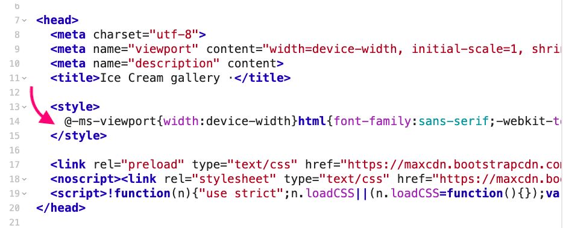
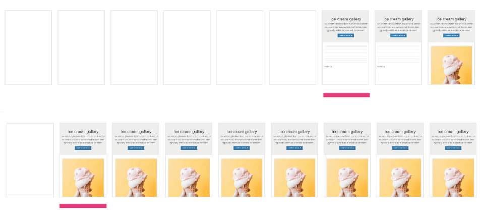
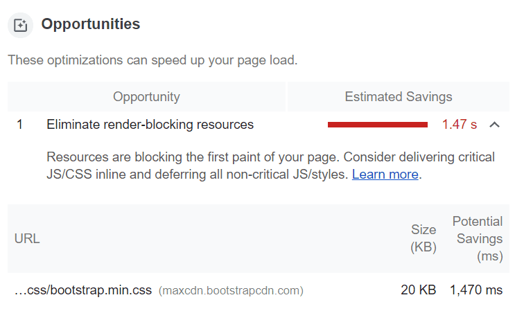

Браузер должен скачать и распарсить CSS-файл перед тем, как отрисует страницу. Это делает CSS ресурсом, блокирующим рендеринг. Если файл большой или соединение медленное, то запрос стилей может значительно увеличить время отрисовки страницы.

**Ключевой термин**: критический CSS — это метод, который извлекает CSS для контента «над сгибом» _(above the fold — термин из газетного дизайна, прим. редактора)_, чтобы максимально быстро показать его пользователю.

<figure>
    
    <figcaption>
        Над сгибом и под сгибом.
    </figcaption>
<figure>

Над сгибом — это то, что пользователь видит в первую очередь при загрузке страницы, до прокрутки. Не существует универсального способа определить, где заканчивается экран пользователя и что находится в первом экране, поскольку существует огромное количество устройств с разными размерами экрана.

Критический CSS можно заинлайнить внутри `<head>` прямо в HTML-документе. Это позволит избежать дополнительного запроса к серверу для получения этих стилей. Остальной CSS может быть загружен асинхронно.

Увеличение времени рендеринга может существенно повлиять на [воспринимаемую производительность](https://developers.google.com/web/fundamentals/performance/rail#ux), особенно при плохом соединении. В мобильных сетях высокая задержка является проблемой независимо от пропускной способности.

Если у вас плохой [First Contentful Paint](https://web.dev/first-contentful-paint/) (FCP) и вы видите рекомендацию «Устранить ресурсы, блокирующие рендеринг» в отчёте Lighthouse, то стоит попробовать методику критического CSS.

### **Подводные камни!**

_Помните, что если вы заинлайнили большой кусок CSS, то это повлияет на размер и, как следствие, время получения HTML-файла. Если важно всё, то не важно ничего. У заинлайненого CSS есть несколько недостатков: он не кэшируется браузером для повторного использования при последующих загрузках страницы, поэтому лучше использовать его осторожно._

Чтобы минимизировать запросы при первом рендеринге, старайтесь чтобы размер контента над сгибом не превышал 14 Кб (после сжатия).

Новые [TCP-соединения](https://hpbn.co/building-blocks-of-tcp/) не могут сразу же использовать весь доступный поток передачи данных между клиентом и сервером. Соединение происходит с [медленным стартом](https://hpbn.co/building-blocks-of-tcp/#slow-start), что позволяет избежать перегрузки соединения большим количеством данных, которые оно может принять. При таком подходе сервер начинает передачу с небольшой порции данных и, если соединение с клиентом идеальное, то удваивает эту порцию при следующей отправке. Большинство серверов может передать максимум 10 пакетов или 14 Кб при первой передаче.

Положительный эффект на перформанс, которого вы можете добиться этим методом, зависит от типа вашего сайта. Проще говоря, чем больше CSS используется на сайте, тем заметнее будет влияние метода критического CSS.

## Обзор инструментов

Существует несколько отличных инструментов, которые позволяют автоматически определять критический CSS для страницы. Это хорошие новости, поскольку делать это вручную довольно муторно. Требуется анализ всего DOM, чтобы определить стили, применяемые к каждому элементу в области просмотра.

## Critical

[Critical](https://github.com/addyosmani/critical) извлекает, минифицирует и инлайнит критический CSS. Доступен в виде [npm-модуля](https://www.npmjs.com/package/critical). Может быть использован в Gulp (прямо внутри) или Grunt (в виде [плагина](https://github.com/bezoerb/grunt-critical)). Есть и [плагин для Webpack](https://github.com/anthonygore/html-critical-webpack-plugin).

Это простой инструмент, который решает вашу головную боль. Для него даже не нужно указывать пути до файлов стилей, Critical автоматически определит их. Он также поддерживает извлечение критического CSS для разных разрешений экрана.

## criticalCSS

[CriticalCSS](https://github.com/filamentgroup/criticalCSS) это ещё один [npm-модуль](https://www.npmjs.com/package/criticalcss), который извлекает критический CSS. Он так же доступен в виде CLI.

У него нет опций инлайна или минификации критического CSS, но он позволяет вам дописать правила, которые не относятся к разряду критических и дает вам более тонкий контроль над декларацией `@font-face`.

## Penthouse

[Penthouse](https://github.com/pocketjoso/penthouse) — хороший выбор, если на вашем сайте или в приложении используется большое количество стилей или если стили динамически внедряются в DOM (как это бывает, например, в приложениях Angular). В этом инструменте под капотом скрывается [Puppeteer](https://github.com/GoogleChrome/puppeteer) и у него даже есть [онлайн-версия](https://jonassebastianohlsson.com/criticalpathcssgenerator/).

Penthouse не умеет автоматически определять расположение файлов стилей, вы должны руками указать пути до HTML и CSS-файлов, для которых нужно сгенерировать критический CSS. Плюс этого инструмента в том, что он отлично справляется с многопоточностью.
