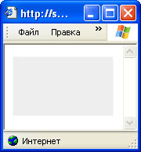
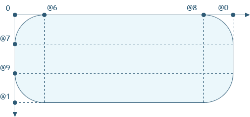
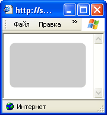
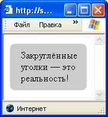
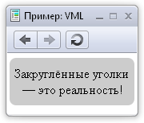
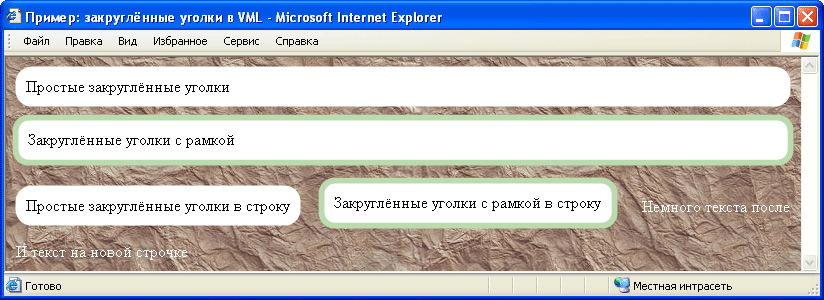

Согласно как древнему учению фен-шуй, так и последним медицинским исследованиям, прямые углы вредно влияют на человека. Издавна дизайнеры всего мира стараются скруглять углы чтобы уменьшить вред и сделать свою работу красивее. Это коснулось и области веб-дизайна.

В свою очередь, должно быть, все верстальщики решают техническую проблему оформления сайтов закруглёнными уголками, требуемыми дизайнерами.

## Существующие решения

Самым очевидным и простым способом сделать это ещё с ранних версий HTML являются картинки. Увы, самой простой способ не всегда самый лучший или подходящий. Например, можно просто наложить уголки с цветом фона на элемент, но такой способ не годится, когда, оставшаяся за скруглением, часть должна быть прозрачной.

И, конечно же, хочется уменьшить число запросов к серверу, чтобы страница сразу показывалась в задуманном виде без лишних задержек.

Кроме того, что прозрачные картинки усложняют вёрстку, дизайнеры ещё и хотят видеть их сглаженными, а с полупрозрачными картинками есть немалые [сложности](http://www.google.ru/search?q=IE6+png) в Internet Explorer 6. Их можно решить через фильтры, но ценой этого будет сильное проседание производительности. Пожалуй, мало кто захочет чтобы с их сайта уходили клиенты, не дождавшиеся загрузки. Но не все об этом подозревают.

Для облегчения работы (и снижения стоимости создания решений, основанных на веб-стандартах) было придумано и реализовано современными браузерами [CSS-свойство `border-radius`](http://www.w3.org/TR/css3-background/#the-border-radius), которое позволяет закруглить уголки прямо средствами браузера без каких-либо дополнительных усилий.

Так же в старых версиях браузера Opera (начиная с 9.5) существует ещё одно [обходное решение](http://dev.opera.com/articles/view/new-development-techniques-using-opera-k/): использовать векторную графику [SVG](http://www.w3.org/TR/SVG/) в качестве фона.

## А что же Internet Explorer?

Однако, пока ещё самым распространённым в мире браузером является Internet Explorer, не поддерживающий решение ни через CSS, ни через SVG. Тем не менее, в Internet Explorer есть ещё одна малоизученная (как мы увидим дальше) возможность: один из предков SVG — векторная графика [VML](http://msdn.microsoft.com/en-us/library/bb250524(VS.85).aspx).

В VML есть предопределённая фигура: прямоугольник с закруглёнными углами `roundrect`. Решение на её основе уже [давно предложено](http://snook.ca/archives/html_and_css/rounded_corners_experiment_ie/), и даже есть [подключаемый компонент](http://www.dillerdesign.com/experiment/DD_roundies/), который с помощью скриптов создаёт закруглённые углы похожим образом. Но у этой фигуры есть один значительный недостаток: радиус кривизны задаётся через отношение к большей стороне, что делает результат непредсказуемым и неподходящим для многих случаев. Кроме автоматизации работы именно для обхода этой особенности используются скрипты в подключаемом компоненте.

Обычно же требуется какой-то зафиксированный радиус скругления, например, 8 пикселов. Возможно ли так сделать в Internet Explorer, не выполняя работу браузера вместо него самого?

Оказывается, да.

## Изучаем VML

Для начала, нам надо определить свою фигуру. Пусть это будет простой прямоугольник:

[Пример 1. VML](demos/1-vml.html) (только IE8 и ниже).

```html
<!DOCTYPE HTML>
<xml:namespace ns="urn:schemas-microsoft-com:vml" prefix="v"/>
<head>
    <title>Пример: VML</title>
    <meta charset="utf-8">
    <style>
        v\:shape {
            behavior: url(#default#VML);
            display: inline-block;
            width: 100px;
            height: 20px;
    }
    </style>
</head>
<body>
    <v:shape stroked="false" fillcolor="#EEE"
        coordorigin="0 0" coordsize="1000 1000"
        path="m 0,0 l 1000,0, 1000,1000, 0,1000 x e">
    </v:shape>
</body>
```

Для запуска VML в IE нужно несколько условий.

1. Объявление XML-документа, с подключенным пространством имён VML, в любом месте документа. Это делает вторая строчка. Указание префикса `v` говорит, что тэги VML будут записаны с этим префиксом. В примере элемент таким образом обозначен `<v:shape>`. В скриптах (например, для подгружаемого содержимого) объявление можно сделать с помощью команды `document.namespaces.add('v', 'urn:schemas-microsoft-com:vml')`
2. Далее надо указать, чтобы элементы вели себя как VML. Это делает CSS-свойство `behavior:url(#default#VML)`
3. Отображаемые элементы VML должны быть в `<body>`. Опускать его нельзя.
4. Для отображаемого элемента должны быть указаны размеры. Для это нужно задать свойство `display`, не равное `inline` (оно стоит по умолчанию): `display:inline-block` или `display:block` и, конечно же, надо указать сами размеры.

<figure>
    
    <figcaption>Пример 1. Internet Explorer 6.</figcaption>
</figure>

Можно ещё отметить, что двоеточие имеет специальный смысл в CSS, и поэтому должно быть экранировано в селекторе с помощью обратного слэша. Также популярный ранее селектор `v\:*` не работает в Internet Explorer 8, из-за чего нужно либо перечислять все элементы, либо использовать дополнительный класс. Я предпочёл первое, так как в таком случае в итоге выходит меньше кода.

Элемент [`shape`](http://www.w3.org/TR/NOTE-VML#_Toc416858386) задаёт произвольную фигуру. При этом использованы следующие параметры:

- `coordorigin="0 0"` задаёт начало координат в положении `(0, 0)`
- `coordsize="1000 1000"` задаёт размеры «холста» (за них можно выходить, но в некоторых, не связанных с VML, случаях картинка может быть обрезана)
- `path="m 0,0 l 1000,0, 1000,1000, 0,1000 x e"` рисует сам прямоугольник. Использован следующий синтаксис: `m` — передвигает в начало координат, `l` рисует прямые линии через ряд координат `(x, y)`, перечисленные через запятую, `x` замыкает контур, и `e` заканчивает рисование;
- `fillcolor="#CCC"` заполняет элемент светло-серым цветом, чтобы мы его смогли увидеть. Следует отметить, что, заданный через CSS, фон у VML-элементов должен быть отключен. Иначе он будет нарисован прямоугольником под фигурой, что лишит нас преимуществ.
- `stroked="false"` указывает, что нам не нужна рамка. (По умолчанию рисуется тонкая.)

### Сложности

Как можно было заметить, все фигуры задаются в неком пространстве со своей координатной сеткой. Главной же в данном случае проблемой является то, что мы не можем так просто задать координаты в точках на экране. Надо каким-то образом связать координаты VML с пикселями, и определить свою фигуру, которая будет обладать требуемыми свойствами.

Как это сделать?

### Формулы

VML имеет возможность задавать, считать и использовать [определённые соотношения](http://www.w3.org/TR/NOTE-VML#_Toc416858392). Простой пример, пока ещё без вычислений:

[Пример 2. Формулы в VML](demos/2-vml-formulas.html) (только IE8 и ниже).

```xml
<v:shape coordorigin="0 0" coordsize="1000 1000"
    path="m 0,0 l @0,0, @0,@1, 0,@1 x e"
    fillcolor="#EEE" stroked="false">
    <v:formulas>
        <v:f eqn="val width"/>
        <v:f eqn="val height"/>
    </v:formulas>
</v:shape>
```

<figure>
    
    <figcaption>Пример 2. Internet Explorer 6.</figcaption>
</figure>

Этот пример выглядит точно так же как первый, что показывает работоспособность формул. Элемент `formulas` содержит в себе список формул, в атрибуте `eqn` у каждого `f` содержатся сами формулы. На результат каждого элемента `f` можно ссылаться через запись вида `@№`, где `№` — номер выражения (перечисление начинается с нуля). Сами формулы также могут ссылаться на результат предыдущих вычислений. Но обо всём по порядку.

Выражение `val` позволяет ссылаться на определённое значение. Оно может быть задано непосредственно, либо можно использовать какое-то ключевое слово. В данном случае это размеры «холста» (те, что задаются с помощью `coordsize`).

Также у фигур может быть задан параметр `adj`, на который можно ссылаться как `#0` (и далее по счёту). Он пригодится нам в дальнейшем, чтобы задавать радиус кривизны уголков. К тому же нам пригодится то, что его можно переназначать для повторно используемой фигуры.

### Приступаем к главному

Главное, что нам пригодится в формулах кроме самих вычислений — это возможность использовать в них размер фигуры в пикселах с помощью ключевых слов `pixelwidth` и `pixelheight`. Используя это, определим требуемую фигуру:

[Пример 3. VML и пикселы](demos/3-vml-pixels.html) (только IE8 и ниже).

```xml
<v:shape adj="8" stroked="false" fillcolor="#CCC"
    coordorigin="0 0" coordsize="1000000 1000000"
    path="m @6,0 l @8,0 qx @0,@7 l @0,@9 qy @8,@1 l @6,@1 qx 0,@9 l 0,@7 qy @6,0 x e">
    <v:formulas>
        <v:f eqn="val width"/>
        <v:f eqn="val height"/>
        <v:f eqn="prod @0 1 pixelwidth"/>
        <v:f eqn="prod @1 1 pixelheight"/>
        <v:f eqn="sum pixelwidth 0 #0"/>
        <v:f eqn="sum pixelheight 0 #0"/>
        <v:f eqn="prod #0 @2 1"/>
        <v:f eqn="prod #0 @3 1"/>
        <v:f eqn="prod @4 @2 1"/>
        <v:f eqn="prod @5 @3 1"/>
    </v:formulas>
</v:shape>
```



<figure>
    
    <figcaption>Пример 3. Internet Explorer 6.</figcaption>
</figure>

Теперь появились закруглённые уголки. Выражения формулы имеют следующий формат: «операция значение параметр1 параметр2». Над указанным значением производится какая-то операция, использующая указанные параметры. Для суммы `sum` вычисление будет «значение + параметр1 − параметр2», для умножения `prod` — «значение × параметр1 / параметр2».

В этом примере первые две формулы дают ссылку на размеры фигуры, как и в предыдущем.

В следующих двух считается отношение размеров в координатах VML к их пиксельным значениям, то есть фактически определяется сколько точек VML приходится на один пиксел по горизонтали и вертикали. Большие значения размера «холста» `coordsize` заданы для того, чтобы вычисления проводились с достаточной высокой точностью

Далее, из размеров в пикселах вычитается размер закругления, указанный в `adj`. Наконец, координаты, где заканчиваются уголки, пересчитываются в координаты VML и используются при задании формы фигуры.

Для скругления использованы довольно простые команды рисования четверти эллипса `qx` и `qy`. `qx` начинает рисование с горизонтальной черты, а `qy` — с вертикальной.

### Позиционирование

Итак, фигура определена. Теперь нам нужно сделать так, чтобы она отображалась в нужном месте. Сделаем пример, более похожий на настоящий, и добавим код для остальных браузеров:

[Пример 4.1. VML и содержимое страницы](demos/4.1-vml-pos-ib.html).

```html
<style>
    .round {
        display: inline-block;
        padding: 10px;
        -webkit-border-radius: 8px;
        -moz-border-radius: 8px;
        border-radius: 8px;
        background: #CCC;
    }
</style>
<!--[if VML&(lt IE 9)]>
<style>
    .round {
        background: none!important;
        padding: 0!important;
    }
    .round-vml {
        position: relative;
        padding: 11px 9px 9px 11px;
        height: 100%;
    }
    v\:shape,
    v\:formulas,
    v\:f { behavior:url(#default#VML) }
    v\:shape { display:inline-block }
</style>
<xml:namespace ns="urn:schemas-microsoft-com:vml" prefix="v"/>
<![endif]-->

<div class="round">
<!--[if VML&(lt IE 9)]>
    <v:shape adj="8" class="round-vml"
        stroked="false" fillcolor="#CCC"
        coordorigin="0 0" coordsize="1000000 1000000"
        path="m @6,0 l @8,0 qx @0,@7 l @0,@9 qy @8,@1
                l @6,@1 qx 0,@9 l 0,@7 qy @6,0 x e">
        <v:formulas>
            <v:f eqn="val width"/>
            <v:f eqn="val height"/>
            <v:f eqn="prod @0 1 pixelwidth"/>
            <v:f eqn="prod @1 1 pixelheight"/>
            <v:f eqn="sum pixelwidth 0 #0"/>
            <v:f eqn="sum pixelheight 0 #0"/>
            <v:f eqn="prod #0 @2 1"/>
            <v:f eqn="prod #0 @3 1"/>
            <v:f eqn="prod @4 @2 1"/>
            <v:f eqn="prod @5 @3 1"/>
        </v:formulas>
<![endif]-->
    Закруглённые уголки — это реальность!
<!--[if VML&(lt IE 9)]>
    </v:shape>
<![endif]-->
</div>
```

Размеры элемента можно изменять. Радиус закругления от этого не меняется.

<figure>
    
    <figcaption>Пример 4. Узкое окно Internet Explorer 6.</figcaption>
</figure>

Оказывается, что фигуры VML удачно встают на место существующих элементов, при этом очень ценно то, что для них можно (и нужно) указать стопроцентную высоту, которая будет работать. Ширину, указывать не стоит — элемент «вылезет» из-за того, что по стандартам задаётся ширина содержимого без отступов, к тому же она и так отрабатывается автоматически. В зависимости от задачи: блочный элемент или ширина по содержимому, следует использовать `display:block` — [пример 4.2](demos/4.2-vml-pos-b.html) или `display:inline-block` — [пример 4.1](demos/4.1-vml-pos-ib.html). Открывающий и закрывающий тэги должны находится в начале и в конце соответственно.

<figure>
    
    <figcaption>Пример 4. Современный браузер.</figcaption>
</figure>

Нижний правый угол начинает обрезаться из-за наличия `hasLayout` на родительском элементе, поэтому нужен `position:relative`. На этом этапе уже становятся заметными особенности отображения VML. Края выглядят размытыми, а отступы надо подбирать вручную, не забывая перед этим убрать отступ и фон у родительского элемента, а в дальнейшем и рамку.

### Завершающие штрихи

VML позволяет создавать заготовки, чтобы ссылаться на них при дальнейшем использовании. Это позволяет уменьшить размер страницы благодаря повторному использованию кода. Сделаем это, а заодно и соберём разные примеры использования на одной странице. Также укажем неоднородный фон, чтобы были видны основные преимущества:

[Пример 5. Закруглённые уголки в VML](demos/5-vml-roundies.html).

```html
<div class="round">
    <!--[if VML&(lt IE 9)]>
    <v:shape type="#vml-round" class="round-vml"
        stroked="false" fillcolor="#FFF">
    <![endif]-->
        Простые закруглённые уголки
    <!--[if VML&(lt IE 9)]></v:shape><![endif]-->
</div>
<div class="round border">
    <!--[if VML&(lt IE 9)]>
    <v:shape type="#vml-round"
        class="round-vml border-vml" adj="13"
        fillcolor="#FFF" strokeweight="6px" strokecolor="#BADBAD">
    <![endif]-->
        Закруглённые уголки с рамкой
    <!--[if VML&(lt IE 9)]></v:shape><![endif]-->
</div>
<div class="round inline">
    <!--[if VML&(lt IE 9)]>
    <v:shape type="#vml-round" class="round-vml inline-vml"
        stroked="false" fillcolor="#FFF">
    <![endif]-->
        Простые закруглённые уголки в строку
    <!--[if VML&(lt IE 9)]></v:shape><![endif]-->
</div>
<div class="round inline border">
    <!--[if VML&(lt IE 9)]>
    <v:shape type="#vml-round"
        class="round-vml inline-vml border-vml" adj="13"
        fillcolor="#FFF" strokeweight="6px" strokecolor="#BADBAD">
    <![endif]-->
        Закруглённые уголки с рамкой в строку
    <!--[if VML&(lt IE 9)]></v:shape><![endif]-->
</div>
```

Теперь всё выглядит примерно так:

<figure>
    
    <figcaption>Пример 5. Internet Explorer 6.</figcaption>
</figure>

Фигура задаётся с помощью `shapetype`, затем конкретные применения ссылаются на её с помощью `type="#vml-round"`.

Радиус закругление задаётся с помощью параметра `adj`. Можно определить в заготовке значение по умолчанию и переопределять его по мере необходимости. Толщина и цвет обрамления задаются с помощью `strokeweight` и `strokecolor` соответственно.

Здесь во всей красе видны недостатки подхода. Способ достаточно трудоёмкий, особенно при эмуляции рамки. VML требует отдельного прописывания свойств, которые обычно задаются через CSS: цвет фона, параметры рамки, радиус закругления. В версии CSS для Internet Explorer надо отдельно переназначать и подгонять значения отступов. Механизм отрисовки элемента с рамкой отличается от обычного CSS, из-за чего и нужно вручную подбирать параметры.

Вдобавок, в 6 и 7 версии IE при использовании блочных вариантов, появляется горизонтальная полоса прокрутки, с которой, видимо, надо бороться отдельно — в примере по ссылке для этого используется обрамляющий элемент.

VML позволяет [определённые действия над рамками](http://msdn.microsoft.com/en-us/library/bb264134(v=VS.85).aspx), но если вы захотите сделать неоднородную рамку, то придётся повозиться отдельно. В текущей предварительной версии IE9 пример не работает в режиме совместимости со старыми браузерами.

Тем не менее этот способ позволяет решить вопрос создания закруглённых уголков на произвольном фоне без использования картинок, а также при определённой доработке способен в перспективе решить более сложные вопросы: такие как использование градиентов и теней.

Производительность и потребление ресурсов на глаз лучше, чем при использовании фильтров.
