С развитием CSS появились способы вёрстки без использования таблиц, которым посвящена [первая часть статьи](/articles/css-techniques-p1-tables/). Таблицы обладают рядом особенностей, из-за которых порой невозможно добиться желаемого эффекта. Особенно это было актуально ранее, когда браузеры были менее совершенными в применении современных стандартов. В таких случаях для оформления лучше подходят альтернативные приёмы.

## Обтекаемые блоки

Первый приём основан на использовании обтекаемых блоков, так как с их помощью можно произвольно располагать элементы по горизонтали. По сути, это использование свойства `float` не по назначению, которое сдвигает блок влево или вправо и включает обтекание текста.

### Особенности

Обтекаемые элементы имеют ширину, зависящую от содержимого, и занимают доступное для этой ширины место. Если его не хватает, они смещаются вниз до тех пор, пока не хватит места или не останется других обтекаемых блоков.

<figure>
    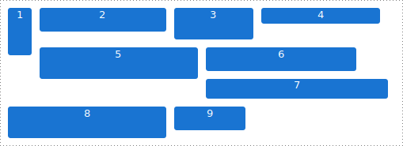
    <figcaption>Пример возможного расположения произвольных обтекаемых блоков.</figcaption>
</figure>

Обтекаемые элементы частично изымаются из потока и обычные блоки проходят сквозь них. Меняется лишь расположение текста из-за сужения строк. Строчные элементы располагаются там, где им хватает места в строках.

<figure>
    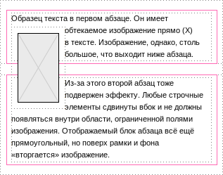
    <figcaption>Принцип работы обтекаемых блоков. Адаптированная иллюстрация из спецификации.</figcaption>
</figure>

Обычный блок, в котором находится обтекаемый, заканчивается раньше обтекаемого блока, что не подходит для раскладки. Для получения предсказуемого результата (а также во избежание проблем в Internet Explorer 7 и ниже) желательно каждый ряд с раскладкой обтекаемыми блоками заключать в специальный оборачивающий элемент, создающий новый контекст форматирования, или воспользоваться трюком, известным как «очистка» (clearfix).

### Контекст форматирования

Когда элемент создаёт новый контекст форматирования, через его границы не проникают обтекаемые элементы, а поля не складываются. В Internet Explorer 7 и ниже аналогично ведут себя элементы с _[hasLayout](http://www.satzansatz.de/cssd/onhavinglayout.html)_, что помогает достичь кроссбраузерности.

Согласно CSS 2.1, [новый контекст форматирования](http://www.w3.org/TR/CSS2/visuren.html#block-formatting) создают: обтекаемые блоки; абсолютно позиционированные блоки; содержащие блоки элементы (вроде строчных блоков `inline-block` и элементов таблиц); блоки, значение свойства `display` которых отличается от `block`; и блоки с `overflow`, отличным от `visible`. Новые типы блоков из других модулей CSS также имеют подобный эффект.

### Очистка

Трюк «очистка» заключается в использовании свойства `clear` для псевдоэлемента `:after`, генерируемого в конце блока, что вынуждает браузер разместить нижнюю границу после обтекаемых элементов.

Первоначальный код (существуют вариации) для современных браузеров выглядит так:

```css
.clearfix:after {
    clear: both;        /* Сама очистка */
    display: block;     /* По умолчанию — display: inline */
    content: ".";       /* Предотвращение сложения полей */
    height: 0;          /* Устранение влияния текста */
    visibility: hidden; /* Скрытие текста */
}
```

Спустя некоторое время появилась обновлённая версия, «[микроочистки](http://nicolasgallagher.com/micro-clearfix-hack/)», выглядящая следующим образом:

```css
.clearfix:before,
.clearfix:after {
    display: table;
    content: "";
}

.clearfix:after {
    clear: both;
}
```

В этом варианте сложение полей _(margin collapsing)_, которое может происходить и сквозь пустой псевдоэлемент, предотвращается с помощью `display: table`, причём не только в конце элемента, но и в начале.

А благодаря пустой строке в значении свойства `content` отпадает необходимость прятать сгенерированное содержимое.

Трюк позволяет заключить обтекаемые блоки внутри элемента, подобно тому, как это происходит в блоках с новым контекстом форматирования. Но в отличие от последних, у элемента полная ширина, и он не имеет присущих им ограничений.

### Адаптация

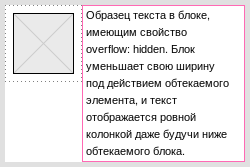

Блок, у которого новый контекст форматирования задан с помощью значения `overflow`, отличного от `visible` (то есть `auto`, `scroll` или `hidden`), обладает примечательным свойством: такой блок занимает всё доступное место по горизонтали. Если он следует за обтекаемым блоком, его ширина соответственно уменьшается на значение ширины обтекаемого блока.

Хотя такое поведение — необязательное требование спецификации, браузеры солидарны в данном вопросе.

Эта особенность даёт возможность задействовать эффект обрезания неуместившегося текста с многоточием на месте сокращения: `text-overflow: ellipsis`, которого нельзя достигнуть таблицей с автоматическим расчётом ширины.

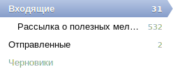

Примером такого использования могут быть папки в почтовом интерфейсе, где напротив имён папок показывается количество сообщений в них. Если имя папки слишком длинно, чтобы поместиться, то оно обрезается.

Количество сообщений, заранее неизвестное, может исчисляться тысячами и даже меняться в реальном времени. Вдобавок, ширина элементов зависит от параметров шрифта и даже механизма отрисовки браузера и операционной системы.

Можно ограничить длину любых имён, выделив место для чисел с большим запасом, но было бы неразумно делать такое ограничение из-за не столь частых, хотя и встречающихся, случаев.

### Ограничения

Заметный недостаток адаптирующегося по ширине элемента заключается в том, что всё его содержимое обрезается по краям блока. Это препятствует использованию выносных элементов любого рода и даже графических эффектов вроде обводок и теней. Вдобавок, обтекаемые блоки должны идти первыми в исходном коде.

Одним из главных недостатков методов с использованием обтекаемых блоков является отсутствие возможности произвольного выравнивания по вертикали. Хуже того, как можно было заметить из примера, когда они имеют разную высоту, то вместо стройных рядов может выйти хаотичная мозаика.

Расположение элементов по рядам — это то, с чем хорошо справляются строчные блоки.

## Строчные блоки

Строчный блок — это блок, который размещается в текстовой строке, имеющий свойство `display: inline-block`. Строчные блоки предоставляют уникальные возможности в рамках CSS 2.1, так как, будучи строчными элементами, они могут содержать любые блоки.

В особенной модели Internet Explorer 7 и ниже строчные блоки — это обычные строчные элементы, у которых есть свойство hasLayout. Правило `display: inline-block` включает именно это свойство, но эффект достигается только на строчных элементах. Блочным элементам требуется задать `display: inline` и включить <var>hasLayout</var> другим способом: например, с помощью `zoom: 1`, или вынести объявление `display: inline-block` в отдельный блок правил.

Так же, как и у обтекаемых блоков или ячеек таблиц, ширина строчных блоков, если не указана, рассчитывается браузером с учётом содержимого.

Как и ячейки таблиц, они идут в строгом порядке друг за другом: слева направо или справа налево в зависимости от направления письма.

Благодаря своему расположению в строках текста, строчные блоки располагаются строго по рядам, что нередко предпочтительней.

<figure>
    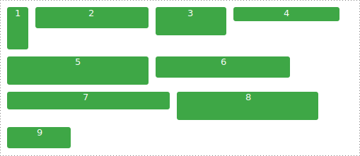
    <figcaption>Пример возможного расположения строчных блоков.</figcaption>
</figure>

Примечательной особенностью строчных блоков является возможность их выравнивания подобно другим текстовым элементам как по горизонтали, так и по вертикали.

### Горизонтальное выравнивание

Кроме привычного выравнивания слева или справа строчным блокам можно делать полную выключку — выравнивание одновременно по обоим краям одновременно — с помощью `text-align: justify`. Последняя строка, однако, всё равно остаётся выровненной слева или справа в зависимости от направления письма.

Проблему с последней строкой можно обойти при помощи свойства `text-align-last: justify`, которое поддерживается браузерами Internet Explorer 5.5+ и Firefox 12+ (с префиксом `-moz-`), и включено в разрабатываемый модуль [CSS3 Text](http://www.w3.org/TR/css3-text/).

Отсутствие поддержки этого свойства в остальных браузерах можно заменить добавлением псевдоэлемента `:after` или пустого строчного блока со стопроцентной шириной:

```css
.justify:after {
    display: inline-block;
    width: 100%;
    content: "";
}
```

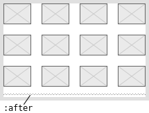

Метод хорош тем, что позволяет выравнивать таким образом заранее неизвестное число элементов. Количество элементов в ряду также может меняться, адаптируясь к ширине окна просмотра.

Недостатки метода в дополнительном элементе и лишней строке, добавляющей отступ, если не принять соответствующие меры.

Этот приём можно использовать для размещения двух элементов в одной строке: слева и справа. Если они не умещаются в одну строку, то второй элемент окажется в начале следующей, а не в конце, как было бы в случае с обтекаемыми блоками. Это выглядит аккуратнее с точки зрения дизайна.

### Вертикальное выравнивание

Строчные блоки по умолчанию выравниваются по базовой линии нижней строки. Но если значение `overflow` отличается от `visible`, строчные блоки должны выравниваться по своей нижней границе, чему, однако, не следуют браузеры на основе WebKit.

Одно из полезных применений режимов выравнивания строчных блоков: вертикальное центрирование.

Если нужно разместить какой-либо текст или изображение в ограниченном пространстве, выровняв по середине, то для этого можно использовать вспомогательный строчный блок с заданной высотой. Ему и блоку с содержимым задаётся вертикальное выравнивание по середине `vertical-align: middle`.

```css
    .holder {
        word-wrap: none;
    }

    .edge,
    .centered {
        display: inline-block;
        vertical-align: middle;
    }

    .edge {
        height: 100px;
    }

    .centered {
        word-wrap: normal;
    }
```

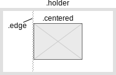

Выровненные блоки будут корректно вести себя при любых размерах. Если содержимого окажется слишком много, то при необходимости увеличится и высота родительского элемента, если она не ограничена неким заданным значением. Этим не может похвастаться метод центрирования абсолютно позиционированного блока.

Чтобы избежать возможного переноса строк между вспомогательным элементом и содержимым, используется `word-wrap: none`. Следует вернуть значение свойства для содержимого обратно `word-wrap: normal`, чтобы оставить возможность переноса строк внутри текста.

### Пробельные символы

Поскольку строчные блоки по определению являются элементами строк, между ними появляются пробелы, если в HTML-коде есть пробельные символы между тегами. Как правило, это нежелательный эффект, поскольку пробелы добавляют лишние отступы.

Иногда пробелов можно избежать с помощью специального оформления кода: написанием тегов в подряд, использованием трюков с угловыми скобками или с помощью комментариев. Но такой подход не всегда возможен, например, использование таких приёмов может не позволять HTML-шаблонизатор.

От лишних промежутков, добавляемых пробелами, можно избавиться с помощью CSS-свойства `word-spacing`:

```
word-spacing: -0.25em;
```

Данное объявление уменьшает пробелы между словами везде, кроме браузеров, основанных на WebKit. Дефект в WebKit был исправлен только недавно, и на момент написания этих строк его уже нет в Chrome 26, но он ещё присутствует в остальных браузерах на основе старых версий движка WebKit.

Проблему в WebKit можно обойти через аналогичное объявление свойства `letter-spacing`:

```
letter-spacing: -0.25em;
```

Можно было бы всегда использовать это правило, но оно не работает в браузере Opera вплоть до 12 версии включительно. Есть и другие недостатки: браузер Mozilla Firefox имеет дефект, из-за которого строчные блоки переносятся на следующую строку в обтекаемом блоке из-за неверного расчёта ширины, а в Internet Explorer 7 теряется эффект при одновременном наличии обоих свойств.

Поэтому следует выделить свойство `letter-spacing: -0.25em` только для WebKit, устранив при этом действие `word-spacing`. Либо же использовать только `letter-spacing` и выделить `word-spacing` отдельно для браузера Opera

Внутри блоков следует вернуть значение свойств по умолчанию `0`, чтобы избежать слипания слов в тексте.

В примере использовано значение `0.25em` — примерный размер пробела в гарнитуре Arial и некоторых других. Однако в иных гарнитурах значение может отличаться, например, Verdana имеет пробел шириной `0.34em`.

Некоторые браузеры не допускают наложение строчных блоков, даже если отрицательное значение свойства по модулю больше ширины пробела. Спецификация допускает ограничение действия отрицательного значения.

Но в WebKit это ограничение отсутствует, и строчные блоки могут накладываться друг на друга. Поэтому нужно тщательно подбирать используемое значение.

### Ограничения

Основной недостаток строчных блоков, помимо пробелов, заключается в том, что нельзя задать блоку ширину, оставшуюся доступной от других элементов в ряду.

Если ширина не задана, то она зависит от содержимого (_shrink-to-fit_) и по мере заполнения элемента может увеличиваться вплоть до ширины родительского элемента или даже превысить её.

## Абсолютное позиционирование

Наибольший контроль над положением элементов можно получить с помощью позиционирования элементов по абсолютным координатам. Такие элементы полностью изымаются из потока и не влияют на остальные элементы страницы.

### Особенности

Координаты абсолютно позиционированного элемента задаются относительно предка в дереве элементов, который тоже имеет свойство `position` со значением, отличным от `static`. С точки зрения оформления этот предок становится родительским блоком абсолютно позиционированного элемента.

Промежуточные элементы между этим предком и абсолютно позиционированным блоком не имеют никакого влияния, даже если у них есть такое свойство, как `overflow: hidden`.

Согласно спецификации, если координаты не заданы, то абсолютно позиционированный элемент должен располагаться примерно там, где оказался бы, не будучи позиционированным.

Это даёт возможность применения некоторых приёмов, но, к сожалению, в браузерах всё ещё встречаются ошибки, связанные с таким позиционированием. Также при этом игнорируются режимы выравнивания элементов.

### Выравнивание

Когда заданы координаты с двух противоположных сторон, абсолютно позиционированный элемент растягивается между указанными координатами. Этого не было в Internet Explorer 6, но, начиная с Internet Explorer 7, появилось и работает во всех браузерах.

Если при этом задан соответствующий размер: ширина или высота, а свойство `margin` по той же оси имеет значение `auto`, то элемент выровняется посередине этих координат. Эту ситуацию правильно обрабатывают все браузеры, начиная с Internet Explorer 8.

<figure>
    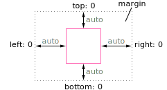
    <figcaption>Выравнивание абсолютно позиционированного блока между заданными координатами с `margin: auto`.</figcaption>
</figure>

### Заполнение

Если задана левая координата `left`, но не задана правая, то по мере заполнения элемент расширяется вплоть до правой границы предка, относительно которого идёт позиционирование, после чего начинается перенос текста. Аналогично и для обратного случая с правой координатой `right`.

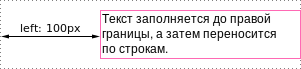

Такое поведение может быть как полезно, чтобы текст не слишком вытянулся в длину, или подсказка не вышла за границы экрана, так и вредно, если размеры позиционированного предка слишком малы.

Браузеры соблюдают данное правило, начиная с Internet Explorer 8. В Internet Explorer 7 бывают ошибки, а в Internet Explorer 6 нет такого ограничения.

### Контекст размещения

Свойство `z-index` указывает взаимное расположение позиционированных элементов по оси `z`, направленной к пользователю. Элементы с большим `z-index` показываются поверх элементов с меньшим значением свойства.

<figure>
    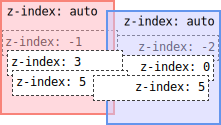
    <figcaption>Отображение элементов согласно значениям `z-index`.</figcaption>
</figure>

Хотя может показаться, что взаимная расстановка блоков определяется только их значениями `z-index`, положение позиционированного предка тоже определяется его значением `z-index`. Именно это значение является решающим, когда определяется, какой блок должен показываться поверх другого.

Существует такое понятие как **контекст размещения** (stacking context): если значение `z-index` у родительского элемента отличается от `auto`, позиционированные элементы располагаются только внутри этого контекста. Даже элементы с отрицательным `z-index` отображаются поверх оформления родительского элемента, создающего контекст размещения, хотя и остаются под его содержимым.

Вследствие этого, элемент с большим `z-index` и все его потомки отображаются поверх другого элемента с меньшим `z-index` и всех его потомков независимо от значений `z-index` самих потомков.

<figure>
    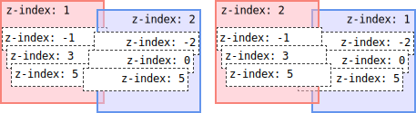
    <figcaption>Отображение с учётом контекста размещения.</figcaption>
</figure>

Контекст размещения появляется не только при наличии `z-index`, но и при использовании свойств `opacity` или `transform` из модулей CSS 3.

К сожалению, не обошлось без ошибок: Internet Explorer 8 по-особому размещает позиционированные псевдо-элементы `:before` и `:after`. Они имеют проблемы с расположением относительно как обычного, так и позиционированного содержимого элемента, к которому относятся. Эти дефекты не воспроизводятся в режиме эмуляции более старших версий вроде «Internet Explorer 10 в режиме Internet Explorer 8».

Internet Explorer 7 (и ниже) по-своему работает с `z-index`: в этой версии браузера нет значения `auto`, значение свойства по умолчанию равно нулю. Понятие контекста размещения при этом имеется и действует на все позиционированные элементы.

Интересно отметить, что какое-то время Internet Explorer 6 был единственным браузером, учитывающим контекст размещения.

## Заключение

Здесь описаны далеко не все приёмы, а лишь дан общий обзор основных способов вёрстки. Они предназначены для обхода недостатков CSS при раскладке элементов. Этих методов явно недостаточно, но они дают возможность использования неочевидных приёмов, и позволяют полнее раскрыть возможности браузеров.

Уже на подходе модули, которые прямо предназначены для сложного оформления. Модуль [CSS Flexible Box Layout](http://www.w3.org/TR/css3-flexbox/), близкий к выпуску на момент написания статьи, позволяет гораздо более гибко выравнивать элементы и распределять доступное пространство между ними.

В разработке находятся многочисленные новые модули CSS: для создания модульной сетки, для достижения недоступных сейчас типографических эффектов, и многие другие, дающие новые возможности и повышающие удобство пользования CSS.

Со временем отпадёт необходимость в использовании описанных способов, и эти свойства будет разумнее использовать только по их прямому назначению.
