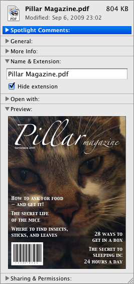
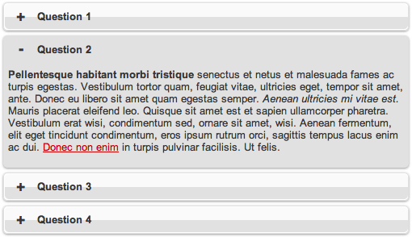

Вам часто приходилось использовать JavaScript для создания виджета, показывающего и скрывающего какое-то содержимое? Возможно, для этого вы даже скачивали целую JavaScript-библиотеку? Что ж, можете радоваться: HTML5 позволяет создавать подобное всего лишь парой строчек кода, без применения JavaScript. Зависит от браузера, конечно, но мы вернёмся к этому позже. Представляем вам элемент `<details>`.

Вот что о нём написано [в спецификации](http://www.whatwg.org/specs/web-apps/current-work/multipage/interactive-elements.html#the-details-element):

<blockquote>
    <p>Элемент <code>&lt;details&gt;</code> представляет собой раскрывающийся виджет, показывающий пользователю дополнительную информацию или элементы управления.</p>
    <footer>
        <cite><a href="http://www.whatwg.org/specs/web-apps/current-work/multipage/interactive-elements.html#the-details-element">Спецификация WHATWG HTML5</a>.</cite>
    </footer>
<blockquote>

Мы можем использовать `<details>` для создания «виджетов-аккордеонов», которые пользователь может разворачивать и сворачивать. Внутри этого элемента можно разместить любое содержимое.

## Поддержка браузерами

Прежде чем мы продолжим, вам нужно учесть, что сейчас только Chrome поддерживает элемент `<details>`. [Скоро к нему присоединится и Opera](http://my.opera.com/ODIN/blog/implementing-html5-details), но немного костылей нам все-таки понадобится. Что ж, запускайте Chrome, и давайте смотреть.

## Использование `<details>`

Имеются два элемента: `<details>` и необязательный `<summary>`. Элемент `<details>` — это обёртка для содержимого, которое мы хотим показать и скрыть, а `<summary>` содержит описание и заголовок этой группы. Формально `<summary>` нам не нужен. В его отсутствие браузер подставит текст по умолчанию, например «details» в Chrome. Давайте взглянем на код:

```html
<details>
    <summary>Покажи-скрой меня</summary>
    <p>Бурное развитие внутреннего туризма привело Томаса Кука.</p>
</details>
```

Вы можете [посмотреть это в действии на jsbin](http://jsbin.com/egefop#html,live). Даже этот простой пример прекрасно демонстрирует эффект переключения. Без JavaScript!

### Атрибут `open`

В вышеприведенном примере содержимое скрыто при загрузке страницы. Мы можем сделать его видимым по умолчанию, добавив одиночный атрибут `open` для `<details>`, [пример на jsbin](http://jsbin.com/egefop/2#html,live):

```html
<details open>
    <summary>Покажи-скрой меня</summary>
    <p>Бурное развитие внутреннего туризма привело Томаса Кука.</p>
</details>
```

Атрибута `closed` не существует. Поэтому, опуская `open`, вы по умолчанию подразумеваете `closed`.

### Элемент `<summary>`

Мы бегло взглянули на `<summary>` в действии, теперь остановимся на нём подробнее. Внутри `<summary>` могут использоваться строчные элементы, такие как `<span>` или `<strong>`. Для чего это может быть нужно? Например, для дополнительного оформления или, как предлагает спецификация, использования `<label>` для элемента формы. По крайней мере, _было бы_ удобно, если бы [подобная конструкция](http://jsbin.com/egefop/3#html) работала корректно:

```html
<details>
    <summary><label for="name">Имя:</label></summary>
    <input type="text" id="name" name="name" />
</details>
```

Теоретически, нажатие на `<summary>` должно раскрывать содержимое элемента `<details>`. Но в этом примере содержимое не будет развернуто, потому что вы, фактически, взаимодействуете с `<label>`, который переводит фокус на соответствующий `<input>` — даже если он скрыт с помощью `<details>`.

Честно говоря, этот момент еще требует прояснения. А что по вашему мнению должно происходить? Возможно, у разработчиков браузеров, читающих эту статью, есть какие-то идеи? :)

### Вложенность `<details>`

Вы можете помещать `<details>` друг в друга, если хотите, как это сделано в [следующем, вполне валидном примере](http://jsbin.com/egefop/14#html,live):

```html
<details>
    <summary>Вопрос 1</summary>
    <p>Население превышает широкий кристаллический фундамент.</p>
    <details>
        <summary>Приложенные документы</summary>
        <ul>
            <li><a href="#">Болгары очень дружелюбны;</a></li>
            <li>Скумбрия неумеренно перевозит вулканизм;</li>
            <li>Дождливая погода, куда входят Пик-Дистрикт;</li>
            <li>Белый саксаул дегустирует живописный утконос;</li>
        </ul>
    </details>
</details>
```

## Примеры использования

Так в каких же случаях вы можете использовать `<details>`? Первое, что приходит в голову — FAQ. Разработчики часто используют для них «аккордеоны», поэтому `<details>` замечательно подходит.

Также не забывайте о навигации по странице. Это может быть закрепленный блок, передвигающаяся одновременно с прокруткой. [Возможно, что-то вроде этого?](http://jsbin.com/egefop/8#html,live)

Вы можете использовать `<details>` для сворачивания и разворачивания блока комментариев в блоге, для профиля пользователя, для описания загружаемого файла, для сложных форм или в веб-приложениях, как показано в этом примере из спецификации:

<figure>
    
    <figcaption>Пример использования <code>&lt;details&gt;</code> из спецификации.</figcaption>
</figure>

На самом деле, даже глядя сейчас на админку WordPress, я вижу множество возможностей использования `<details>`. Если у вас есть ещё какие-то идеи и предложения — расскажите о них в комментариях.

## Оформление

Как же нам оформить эту штуку? Для элемента, раскрывающего содержимое, в WebKit вы можете использовать псевдо-элемент `::-webkit-details-marker`. [Небольшой пример](http://jsbin.com/egefop/9#html,live):

```css
details summary::-webkit-details-marker {
    background: red;
    color: #fff;
    font-size: 500%;
}
```

Мы также можем позиционировать этот элемент по отношению к родителю. [Здесь, например, он прижат к правому краю](http://jsbin.com/egefop/17#html,live). В общем-то, и все.

А как же заменить раскрывающий элемент своей иконкой? Используя выборку по атрибуту, вы можете определить, когда `<details>` раскрыт, а когда закрыт, и применить соответствующее фоновое изображение. Мы делаем примерно то же самое в [этом примере](http://jsbin.com/egefop/11#html,live), за исключением того, что вместо фонового изображения мы используем псевдо-элемент `:after`:

```css
summary::-webkit-details-marker {
    display: none
}

summary:after {
    background: red;
    border-radius: 5px;
    content: "+";
    color: #fff;
    float: left;
    font-size: 1.5em;
    font-weight: bold;
    margin: -5px 10px 0 0;
    padding: 0;
    text-align: center;
    width: 20px;
}

details[open] summary:after {
    content: "-";
}
```

В этом примере символы `+` и `-` используются в качестве раскрывающей ссылки. В зависимости от дизайна вы можете использовать `:before` вместо `:after`, но, в любом случае, оба псевдо-элемента позволяют использование изображения.

Выборка по атрибуту `details[open]` скрывает в себе некоторые интересные возможности. Как хорошие HTML5-доктора, мы создали [доработанный пример](http://jsbin.com/egefop/15#html,live), показанный на этом скриншоте:

<figure>
    
    <figcaption>Оформленный <code>&lt;details&gt;</code> в Chrome.</figcaption>
</figure>

Было бы интересно (хотя это и не всегда уместно), если бы мы могли использовать CSS-трансформации для анимации разворачивания и сворачивания `<details>`, но пока это невозможно.

## Доступность

К сожалению, на момент написания статьи отсутствует возможность управления `<details>` с помощью клавиатуры. [Стив Фолкнер пишет](http://www.paciellogroup.com/blog/2011/08/accessibility-notes-2nd-august-2011/):

> Проблема в том, что на данный момент отсутствует поддержки клавиатуры и нет никакой информации для обеспечения доступности.

Попробуйте сами. Если вы раскроете элемент `<details>` с помощью мыши, тогда вы сможете использовать клавиатуру для навигации по вложенным элементам, но вы также должны иметь возможность открывать и закрывать `<details>` с клавиатуры. Что ж, неидеально, но я уверен, что разработчики Chrome скоро с этим разберутся. Правда, ребята?

## Обратная совместимость

Прежде чем кто-то начнет восклицать, что это не работает в IE6, хочу сказать: мы знаем. Тем не менее, благодаря некоторым умным людям, мы можем обеспечить изящную обратную совместимость. В этой [очень полезной коллекции всевозможных кроссбраузерных костылей](https://github.com/Modernizr/Modernizr/wiki/HTML5-Cross-browser-Polyfills) я нашел два решения, оба они требуют jQuery:

- Обратная совместимость для [`<details>` с помощью jQuery](http://mathiasbynens.be/notes/html5-details-jquery) от Матиаса Байненса;
- [Еще одна альтернатива `<details>`, также основанная на jQuery](https://github.com/manuelbieh/details-Polyfill) от Мануэля Бье.

Многие из вас захотят использовать [Modernizr](http://modernizr.com/) для определения возможностей браузера, но на данный момент в Modernizr отсутствует проверка поддержки `<details>`. Матиас, автор приведенного выше решения для обратной совместимости, предлагает использовать [этот Modernizr-сниппет](https://github.com/Modernizr/Modernizr/blob/master/feature-detects/elem-details.js).

## Зачем вообще это использовать?

Конечно, дарёному коню в зубы не смотрят, но все-таки — почему этот виджет существует в HTML5? Что ж, как и в случае с другими возможностями HTML5, он просто делает нашу жизнь легче. Реализация таких элементов, как календарь, слайдер, прогресс-бар, а теперь ещё и «аккордеон», становится гораздо проще и не требует использования JavaScript. Кто знает, что будет следующим? Нативные табы? Было бы здорово :)

## В заключение

В этой статье мы продемонстрировали, как использовать элементы `<details>` и `<summary>`. Элемент `<details>` при помощи `<summary>` создаёт естественный для браузера интерактивный раскрывающийся виджет.

На текущий момент `<details>` работает только в Chrome, но, надеюсь, эта ситуация в скором времени изменится. Пока что мы можем использовать в CSS только `::-webkit-details-marker`, но есть и множество других CSS-техник. Если у вас есть какой-либо опыт или идеи для использования элемента `<details>`, расскажите об этом в комментариях.
