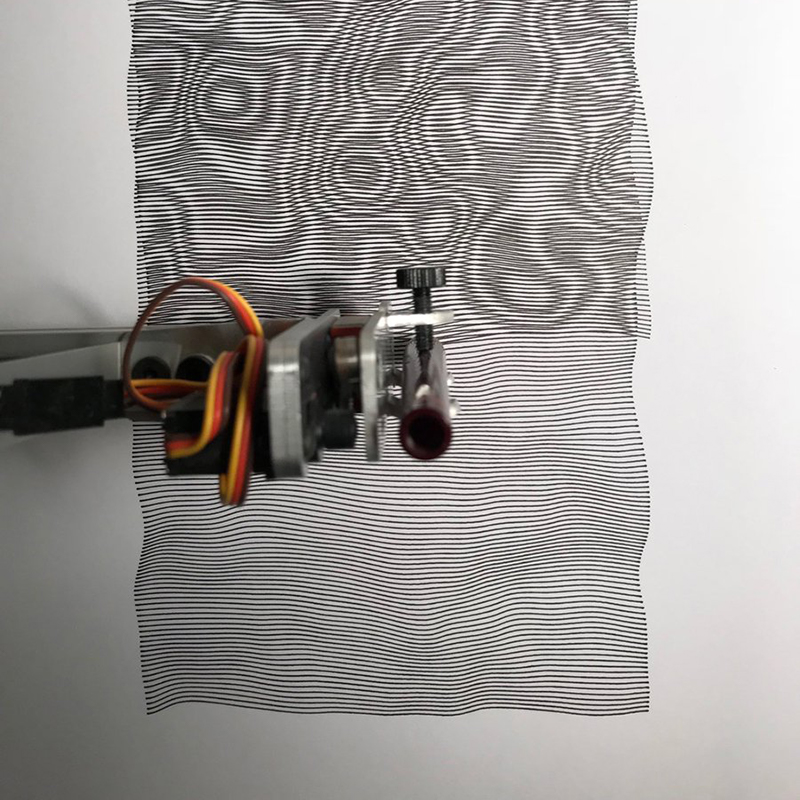

О том, как быть хорошим партнёром по команде.

Если бы в вашем распоряжении было 15 минут времени ваших разработчиков, и вашей целью было помочь им стать более эффективными/продуктивными в своей работе, обучив их чему-то, что вы сами знаете, что бы вы выбрали? Перефразируя по-другому, как бы вы могли выполнить обещание Geico: «15 минут могут сберечь вам 15% или более трудозатрат в разработке»? _(Отсылка к рекламному слогану американской страховой компании Geico: «15 минут могут сберечь вам 15% или более на автостраховании» — прим. переводчика)._

Данный пост — мой ответ на этот вопрос. Его чтение займёт приблизительно 15 минут, и я верю, что он (помимо других преимуществ) вероятно может сберечь вам сотни часов работы по разработке приложений в течение вашей карьеры. Я считаю, что это самый полезный совет, который я могу дать, и я воодушевлён возможностью поговорить о нём 🙂

Тем не менее речь не о JavaScript, и даже не о программировании в более широком смысле. Мы, как сообщество, провели невероятную работу по оптимизации в инженерной части; у нас есть блестящие фреймворки, инструменты и сервисы. Я работаю на компанию [Gatsby](https://gatsbyjs.com), и мы в первую очередь сосредоточены на том, чтобы сделать разработку многофункциональных, высокопроизводительных, удобных веб приложений значительно быстрее.

Предметная область, на которой мы обычно фокусируемся хорошо обработана и в ней осталось не так много «низко висящих фруктов» (здесь автор статьи использует английское выражение, означающее что-то, чего легко достичь, получить, чем легко воспользоваться — прим. переводчика). Но есть много других сфер, в которых мы можем улучшить наши умения!

Большая часть работы, которую мы выполняем, особенно во фронтенде, тесно связана с продуктом и дизайном. Весьма вероятно, что вы проводите значительную часть своего времени трудясь над претворением в жизнь концепции, с точки зрения, предоставленной другими членами команды. Коммуникация и доверие играют огромную роль в том, насколько эффективно мы работаем вместе, и они могут стать причиной _значительной разницы_ в нашей производительности.

## Радужный путь

Когда-то я работал на [Khan Academy](https://khanacademy.org), некоммерческую организацию с миссией предоставлять бесплатное образование мирового уровня кому угодно и где угодно. Я работал в команде учебного класса, создавая инструменты, которыми должны были пользоваться учителя и их ученики.

Довольно быстро мы обнаружили, что учителям очень не нравится получать обновления продукта в середине семестра: это нарушало течение их рабочего процесса, и отнимало и без того очень ограниченное время. У учителя могло быть только 5 минут до начала урока, чтобы проверить состояние дел у своих учеников. Выпуск продукта нарушал этот процесс.

По этим и многим другим причинам, Khan Academy выстроили структуру большинства своих релизов вокруг учебного календаря: мы нацеливались на запуск новых продуктов в июле–августе, чтобы успеть к новому школьному году (в северном полушарии). Особенно в команде учебного класса мы не могли запустить новые функциональные возможности после начала учёбы, поэтому у нас были очень жёстко установленные сроки разработки.

В 2018 наша группа работала на проекте с кодовыми названием _радужный путь,_ сосредоточенном на реконструкции инструментов, которыми учителя пользуются вне класса для того, чтобы понять в чём нуждаются их ученики. Наш план был супер агрессивным: мы проводили обновление в 5 ключевых продуктовых областях, и запускали множество новых функций. Какое-то время было даже непонятно успеем ли мы закончить всё вовремя!

В конце концов мы выполнили все наши ключевые обязательства! Как и во многих реальных проектах, потребовалось немного креативного сокращения размаха деятельности, но мы предоставили рабочий продукт вовремя к учебному году, и учителя (и их ученики!) действительно получили пользу от работы, которую мы выполнили.

Я считаю, что в значительной степени мы оказались способны с этим справиться благодаря _сплочённому сотрудничеству,_ которое было у нас между продуктовой-дизайнерской и инженерной командами.

## Три рычага

Продуктовый менеджер однажды сказал мне, что у него есть _три рычага,_ с помощью которых он может улучшить положение, когда работа выполняется с отставанием от графика:

- **Люди.** Если разработчики перегружены объёмом работы, которую им необходимо сделать, то добавление дополнительных разработчиков может помочь.
- **Время.** Если работа отстаёт от графика, мы можем перенести дедлайн!
- **Объём работы.** Если мы вырежем из продукта некоторые вещи, которые не критично, но лишь неплохо было бы иметь в нём, то мы можем сократить объём работы, которую нужно сделать, всё ещё сохраняя критически важные вещи и решая изначальные задачи.

Первая опция, добавление людей, кажется мне ненадежной. Она может возыметь обратный эффект: подключение дополнительных сотрудников не всегда означает, что работа будет выполнена быстрее. Новым разработчикам нужно собрать определенный объем информации о данном проекте, и иногда такая информация есть только в головах текущих разработчиков. Вместо ускорения процесса, это может замедлить его.

Второй вариант, время, может вообще не быть возможным, особенно, если есть внешние, несдвигаемые дедлайны. По моему мнению это _недостаточно используемый_ рычаг в нашей индустрии, но да, иногда ты на самом деле не можешь перенести срок сдачи проекта.

Это оставляет нам третью опцию, объём работы.

Уменьшение объёма работы обычно остаётся на усмотрение продуктовых менеджеров, но они не принимают такое решение в одиночку. Зачастую всё начинается с обсуждения между дизайнером и разработчиком. Если эти два человека доверяют друг другу, то процесс сотрудничества получается сплочённым, тёплым и продуктивным. Они находят наилучшее решение в рамках данных ограничений, принимая во внимание время на разработку и особенности пользовательского взаимодействия, и затем предлагают его продуктовому менеджеру. Если продуктовый менеджер доверяет дизайнеру и разработчику, и предложенное ими решение является рабочим с продуктовой точки зрения, то обычно оно принимается без возражений.

Такая организация трудового процесса шикарна, и я считаю, что она была критически важной частью нашего успеха в проекте _Радужный путь_: если бы мы не были способны корректировать курс со столь малыми разногласиями, то мы никоим образом не смогли бы завершить его вовремя.

Однако такой производственный процесс работает только если все стороны доверяют друг другу.

## Всё начинается с эмпатии

Вот вам весёлое упражнение. Представьте, что вы на вечеринке и некто спрашивает чем вы занимаетесь. Вы упоминаете, что трудитесь разработчиком в Компании Икс. Собеседник достаёт свой телефон и заходит на созданную вами домашнюю страницу Компании Икс.

Для многих разработчиков такой момент это повод для гордости. Код, который вы написали, работает на телефоне этого человека! Даже несмотря на то, что множество других людей хорошо потрудились для этого, вы были тем, кто перевёл их усилия в реально существующую, интерактивную вещь. Вы были завершающим шагом в процессе, и ваша работа открыта на весь экран.

Теперь представьте себя в той же ситуации, только теперь вы UI/UX-дизайнер, который работал над домашней страницей Компании Икс. Макет, который вы нарисовали несколько месяцев назад, заметно отличается от того, что вы видите на экране телефона этого человека. Шрифты все не те, позиционирование нарушено, на скролле старнный дефект. Это не ваша работа на самом деле. По крайней мере её можно назвать таковой только с большой натяжкой.

Дизайнеры прилагают много усилий для того, чтобы создать дизайн, который будет прекрасно выглядеть и хорошо работать для конечного пользователя, но их труд проходит сито процесса внедрения, то самое, которое неизбежно оставляет свой след. Конечный результат никогда не будет точно соответствовать их дизайну. Иногда они отличаются, как небо и земля. И в то же время их профессиональная репутация зачастую целиком зиждется на продуктах, выпущенных в реальный мир, а не на том сколько красивых макетов они создали.

Такая ситуация очень легко может привести к обидам и конфиликтам. Я работал в командах, в которых повсеместно была ледяная напряжённость между дизайнерами и разработчиками. И, честно говоря, я думаю, что в этом чаще всего виноваты разработчики. Обычно это наша вина.

Стоит признать, что мы не всегда являемся хорошими товарищами по команде. Первый шаг для того, чтобы построить доверительные отношения с нашими друзьями из дизайнерских и продуктовых команд, состоит в том, чтобы показать им, что мы принимаем их проблемы всерьёз.

## Придирки

Давайте представим, что мы спокойно работаем над чем-то не очень срочным. Мы отправляем сделанную версию на стейджинг, и день или два спустя мы получаем ответ от дизайнера:

- Измените округление границы аватара с 4px до 8 пикселей
- Добавьте расстояние в 8 пикселей под аватаром
- Центрируйте содержимое между брейкпоинтами ’md’ и ’lg’
- Заголовок должен быть цвета ’gray-900′, а не ’gray-700′
- Текст должен быть представлен в виде многоточия (…), если он не умещается на трёх строках.

Мы склонны называть такие вещи «придирками» (что, между прочим, не очень хороший способ описать такой тип обратной связи!). Обычно в таких случаях разработчик говорит дизайнеру поставить задачу для этих придирок, где ей, скорее всего, будет присвоен приоритет P4, и она затеряется в море таких же задач с низким приоритетом.

Как мы _должны_ реагировать на такой тип обратной связи?

### Совместное внедрение

В первую очередь мы должны понять сколько времени на наш взгляд займет устранение этих замечаний. Взгляните на список ещё раз:

- Измените округление границы аватара с 4 до 8 пикселей
- Добавьте расстояние в 8 пикселей под аватаром
- Позиционируйте содержимое по центру между контрольными точками `md` и `lg`
- Заголовок должен быть цвета `gray-900`, а не `gray-700`
- Текст должен быть представлен в виде многоточия (…), если он не умещается на 3 строках.

Первые четыре поправки звучат обыденно для меня, если исходить из того, что такие изменения дозволены в рамках дизайнерской системы и компонентной библиотеки. Я думаю у меня бы заняло около 5 минут, чтобы исправить их, возможно 30 минут на всё, если учитывать все сопутствующие вещи (обновление тестов со снимками, код-ревью и т. д.).

А вот с пятой правкой не всё так просто. Если вы когда-либо имели дело с многоточием для нескольких строк в вёрстке, вы знаете, что это подлая проблема не имеющая простого решения с помощью CSS. Сейчас уже _есть_ способ добиться этого с помощью `-webkit-line-clamp`. Тем не менее он работает с ошибками, так что это не идеальное решение. Для целей данной статьи я сделаю вид, что такого способа не существует. Вы легко можете провести половину дня пытаясь решить эту проблему, и решение вполне вероятно будет сомнительным.

Вот как бы я поступил в большинстве таких случаев:
- Решил первые 4 проблемы
- Провёл исследование и мозговой штурм на тему того, как я могу ответить на оставшиеся вопросы, полученные от дизайнера, без необходимости тратить много часов или дней рабочего времени
- Связался с дизайнером, чтобы получить обратную связь.

Сообщение от меня могло бы выглядеть например так:

> Привет [друг дизайнер],
>
> Спасибо за ответ по [название проекта]!
>
> Я исправил большинство проблем, на которые ты указал, и они будут отправлены на рассмотрение в [разумные временные рамки], но один вопрос неожиданно оказался весьма каверзным: браузеры не предоставляют хорошее встроенное решение для управления отображением многоточия в тексте на несколько строк. Есть сторонние решения, но они причудливые и ненадежные.
>
> У меня есть пара идей для альтернативного решения:
>
> — Можно сделать с помощью CSS многоточие на одной строке — что если мы будем показывать только первую строку?
> — Может быть мы можем ограничить её каким-то количеством символов? Например, установим максимальный предел в 120 знаков, с добавлением многоточия, если длина строки больше?
> — Возможно мы могли бы зафиксировать высоту контейнера, и добавить в него возможность прокрутки? Таким образом мы всё ещё могли бы показывать весь текст, но были бы уверены, что он не занимает слишком много места на экране.
>
> Дай мне знать, что ты об этом думаешь!
Ключевой момент здесь в том, что это показывает, что я отношусь к их замечаниям всерьёз.

Другой момент: дизайнеры обычно недостаточно знакомы с веб-платформой, чтобы быть в состоянии сказать, что легко и что сложно (да они и не должны, раз уж это _наша_ работа, а не их). Добавление многоточия для нескольких строк текста звучит так, как будто это легко сделать, но мы говорим, что это не так. В сущности мы просим их доверять нам.

Представьте, если бы мне пришлось сказать что-то вроде этого:

> Привет — некоторые из запрошенных тобой изменений сложны, так что я не смогу решить их. Извини.
Дизайнер может задаться вопросом, «действительно ли это сложная вещь, или они ищут оправдания, потому что не хотят иметь с ней дело?». Они могут подумать, что мы просто используем заготовленные фразы, чтобы заняться той работой, которая интересна нам больше.

Это то, каким образом строится или разрушается доверие. Дизайнеры часто работают со множеством разных разработчиков: они могут сказать какие разработчики предпринимают серьёзные усилия, чтобы внедрить их правки, а какие в этом незаинтересованы.

Важно, чтобы мы установили доверительные взаимоотношения, потому что это те же самые люди, с которыми мы будем разговаривать за неделю до срока сдачи, когда нам надо будет принять сложное решение по проекту.

Обсуждение проекта включает переговоры по выбору между тем, что лучше для пользователя и тем, что осуществимо с учетом текущих ограничений разработки. Если дизайнер знает, что ты всерьёз пытаешься найти наилучшее решение, он скорее всего будет более восприимчив к альтернативным предложениям, и гораздо более готов совместно работать над решением. Если же дизайнер чувствует, что ты просто пытаешься сделать минимум возможного, он скорее всего останется непоколебимым и настоит на точном соблюдении дизайна.

### Должен ли я предлагать алтернативу?

Способность выступить с подходящими альтернативными предложениями является навыком само по себе. Вы можете оказаться в затруднительной ситуации, когда вдруг осознаете, что дизайн будет очень тяжело применить в том виде, в каком он предоставлен, но в то же время у вас нет других идей.

Это не должно остановить вас от начала обсуждения. Я бы сказал что-то наподобие этого:

> Привет — я видел, что элемент дизайна [простая на первый взгляд вещь]. К сожалению, из-за [технических ограничений], его применение вероятно займёт 3–4 дня времени на разработку. Я хотел бы уточнить насколько критичен данный элемент до того, как я уделю ему столько времени, а также узнать есть ли у тебя альтернативные варианты, которые мы могли бы попробовать.
Человек, который делал макет дизайна, потратил много времени думая над этим изображением, и у него скорее всего есть несколько альтернативных идей. Возможно он даже не считает, что элемент, о котором идет речь, настолько важен, и вы можете вообще отказаться от его использования.

Чего вам действительно _не_ стоит делать, так это считать, что все в дизайнерском макете высечено в камне. Вы можете потратить неделю внедряя многоточия для нескольких строк только для того, чтобы узнать, что данная работа была вовсе необязательна!

## Тайные операции

В вышеуказанном гипотетическом сценарии я взял на себя смелость потратить полчаса на внедрение легчайших частей из комментария дизайнера. Я не сверялся со своим менеджером или тим-лидом, я просто сделал это.

В зависимости от того, где вы работаете, у вас может быть или не быть такой автономии. В некоторых организациях взяться за работу, которая не была явно назначена Проектным Менеджером, может считаться необычным для разработчика.

Если вы работаете в похожей обстановке, то дизайнеры вероятно даже не ожидают, что вы удовлетворите их запросы, так что это немного другая ситуация. Хорошая коммуникация это наиболее важная часть; вы всё ещё можете вести обсуждение обходных путей и оптимальных решений, даже если вы ещё не имеете полномочий на внесение изменений в проект.

В моём арсенале также есть небольшой трюк, который мне действительно нравится; если я заканчиваю задачу рано и у меня есть время в запасе, я отправляю сообщение товарищу по команде и спрашиваю есть ли у него затянувшиеся задания, на которые он хотел бы, чтобы я взглянул. Это может быть дизайнер, или член команды поддержки, или кто-то из отдела продаж.

Зачастую у людей на этих должностях есть парочка задач, которые для них очень важны, но всё ещё не были отправлены в активную стадию разработки. Ответ, который я обычно получаю, выглядит следующим образом:

> БОЖЕ МОЙ, ДА, я пытаюсь добиться решения этой проблемы три месяца, она влияет на множество пользователей, и я не понимаю почему к ней не относятся более серьёзно. Спасибо, спасибо, спасибо.
В таких случаях я люблю представлять, что я нахожусь на секретном задании — я делаю вещи «без записи» в части заведения заданий в Jira, и я не рассказываю об этой работе (хотя конечно я отвечу честно, если кто-нибудь спросит, и я вероятно сообщу о ней на следующем собрании, постфактум).

Стоит отметить, что я, как белый цисгендерный мужчина, достаточно привилегирован, чтобы осуществить это не боясь каких-либо последствий. Увы, ваш опыт может отличаться, особенно, если вы относитесь к недостаточно представленному меньшинству в технической сфере. Возможно более безопасным вариантом будет предварительно связаться со своим Проектным Менеджером и попросить разрешения, вместо того, чтобы ждать прощения по факту.

## Должны ли дизайнеры заниматься разработкой?

Каждые несколько месяцев такой вопрос задается в Design Twitter (облегченная версия Twitter — прим. переводчика), и каждый участвует в обсуждении со своей точкой зрения. Я не дизайнер, и, к сожалению, ответ на данный вопрос не в моей компетенции, но у меня есть одно твёрдое убеждение: если дизайнеры _хотят_ писать код мы должны приложить все усилия, чтобы дать им возможность сделать это.

Я работал в командах, в которых дизайнеры знали CSS и хотели быть в состоянии внести небольшие изменения, такие как изменение размеров шрифта и позиций. Иногда разработчики относились к этому с сомнением — была обеспокоенность по поводу того, что это будет отнимать у них время. Особенно если база исходного кода сложна и со множеством особенностей (что относится почти к каждому коду?), то появляются мысли вроде этой: «У меня займёт больше времени научить тебя, как это сделать, чем просто сделать это самому!».

Проблема в том, что мы зачастую говорим это, _в то же время игнорируя_ пачку запросов, открытых дизайнерами. Мы не можем усидеть на двух стульях: или мы должны согласиться немедленно решать любые поступающие дизайнерские запросы, _или_ мы должны найти способ дать дизайнерам возможность вносить такие изменения самостоятельно (если они этого желают). Хотя сначала это может отнять больше времени у разработчика, это инвестиция в будущее.

Немного грустно, что иногда дизайнеры хотят освоить _совершенно другое ремесло,_ потому что они считают это наиболее простым способом удостовериться, что их дизайн будет применён правильно 😬

Также мы не должны недооценивать способность дизайнеров разобраться в нашем коде. Да, программирование это сложная вещь, но не настолько мистическая, как мы любим думать. Как-то во время перелёта, я сидел рядом с женщиной, которая полагала, что разработчики программного обеспечения, «как в фильме Матрица», работают с нулями и единицами. Она была очень разочарована, когда я показал ей, как наша работа выглядит _на самом деле._

## Более тесное сотрудничество во время разработки

Общепринятый способ разработки программного обеспечения, «водопад», был многоступенчатым процессом: сначала отдел дизайна проводил исследование пользовательской аудитории, и создавал эскиз, и разрабатывал прототип, и создавал макеты высокой точности. Когда они были уверены, что их работа завершена, они перебрасывали её команде разработки, и ничего не слышали об этой работе до тех пор пока она не была готова к выпуску.

Я уверен, многие испытали на себе этот не идеальный способ работы. Как у разработчиков, у нас есть информация критически важная для успешного дизайнерского процесса. Мы знаем какие данные есть в нашей базе данных, а каких в ней нет. Мы понимаем веб-платформу и её ограничения. Короче говоря, мы знаем какие идеи будет легко внедрить, а какие практически невозможно.

К счастью, индустрия движется к более гибкой модели, в которой разработчики вовлечены на более ранних стадиях. Больше нет неприятных открытий, когда дизайн, на разработку которого потратили месяцы, отправляется назад, потому что его невозможно использовать.

Но это только часть истории. Также критически важно, чтобы дизайнеры оставались активно вовлеченными в процессе реализации!

Многие разработчики работают обособленно, и они скрывают разработку до тех пор пока она почти не завершена. Это может привести к нескольким не очень приятным сценариям:

- Разработчик упустил из виду тот факт, что в требованиях была указана начальная анимация, а её абсолютно невозможно внедрить из-за того, как он структурировал свой код.
- Дизайнер может неожиданно осознать, наблюдая за загрузкой реальных данных, что многие из его изначальных допущений были неправильными, и что всё это необходимо переосмыслить.
- Разработчик мог неправильно понять, как изображения должны масштабироваться _между_ указанными размерами экрана.
- Дизайнер мог не знать, что будет 3-секундный индикатор загрузки до того, как загрузится основное изображение. После обсуждения дизайнер узнал, что наиболее медленная часть данных наименее важна. Создаётся новый дизайн, удаляющий медленную часть данных и меняющий всё остальное, чтобы заставить всё работать.
- Миллион других вещей похожих на эти.

Как много времени могло быть сэкономлено во всех этих случаях, если бы дизайнер был вовлечен раньше?

Я очень стараюсь давать дизайнерам доступ к моей работе раньше и чаще. Я отправлю изображения критически важного движения и поведения элементов, сразу как только у меня будет рабочий прототип на моём компьютере. При наличии возможности я отправлю проект на рассмотрение, так чтобы дизайнеры могли попробовать непосредственно всё сами.

Статичный макет никогда не сможет полностью ухватить суть использования продукта, и иногда дизайнерам нужно узнать как это _ощущается_ до того, как они будут уверены в своём варианте исполнения. Чем быстрее дизайнер получит прототип в свои руки, тем раньше мы узнаем, есть ли в нём проблема, и тем меньше работы нам придется сделать.

## Развивать дизайнерскую интуицию

Существует распространенный миф, что дизайн и разработка диаметрально противоположны друг другу, и что это взаимоисключающие профессиональные навыки. Дизайн представляется творческим, и художественным, и абстрактным, в то время как разработка видится логической, и рациональной, и определённой.

Я думаю, что всё это неверно. Дизайн, как музыка и всё остальное, имеет правила и ограничения. Вводя определённые входные значения, вы получаете определённый результат. Конечно, в нём присутствует человеческий элемент, привносящий в вышеупомянутые правила творчество и индивидуальность, но то же самое можно сказать про разработку! Если бы программирование было настолько рациональным и точным, насколько о нём говорят люди, мы бы не тратили так много времени пытаясь убедить всех остальных, что _наш_ способ разработки является лучшим способом.

Также я представляю Доказательство Б: _творческое программирование_:

> **Предупреждение о содержании: ** Данные видео содержат изображение, которое может навредить людям с расстройствами вестибулярного аппарата.
<blockquote>
    

        Снова дурачусь с классическим алгоритмом Substrate Джареда Тарбелла.
    

    

        Линии растут наружу, и при столкновении одной линии с другой, появляется новая линия под другим углом.
    

    <video src="video/1.mp4" poster="video/1.png" width="800" height="800" type="video/mp4" preload="none" mute controls loop></video>
    <footer>
        <cite>
            <a href="https://twitter.com/mattdesl/status/1210675775747301381">@mattdesl</a>
        </cite>
    </footer>
</blockquote>

<blockquote>
    

        :)
    

    <video src="video/2.mp4" poster="video/2.png" width="800" height="720" type="video/mp4" preload="none" mute controls loop></video>
    <footer>
        <cite>
            <a href="https://twitter.com/beesandbombs/status/1197081207894183936">@beesandbombs</a>
        </cite>
    </footer>
</blockquote>

<blockquote>
    

        Шум Перлина в многослойной печати
    

    
    <footer>
        <cite>
            <a href="https://twitter.com/netpraxis/status/1212354990963970048">@netpraxis</a>
        </cite>
    </footer>
</blockquote>

Вы можете считать, что вы были бы «плохи в дизайне», потому что вы плохи в рисовании, или не чувствуете себя особенно художественной личностью, но я уверяю вас, что его основы имеют гораздо больше логики и математики, чем вы думаете. И я считаю, что развитие минимального уровня дизайнерских умений, может быть невероятно впечатляющим, по ряду причин:

- Если вы работаете на параллельном проекте, или вам нравится идея запуска нового дела, вы вряд ли сможете позволить себе дизайнера, и вероятно вы все же хотите иметь хороший дизайн.
- Оно научит вас общему с дизайнерами языку, что позволит коммуницировать более эффективно о вещах вроде [предоставление возможности](https://uxplanet.org/ux-design-glossary-use-affordances-in-user-intefaces-393c8e9686e4) _(предоставление возможности — это интуитивно понятное свойство какого-либо объекта, указывающее на то, каким образом нужно взаимодействовать с данным объектом или использовать его — прим. переводчика)_ и [информационная архитектура](https://uxplanet.org/information-architecture-basics-for-designers-b5d43df62e20).
- Оно даёт вам дополнительные способы воспользоваться вашей интуицией.

Последний пункт особенно интересный и стоит того, чтобы углубиться в него.

Осознаёте вы это или нет, вы постоянно принимаете дизайнерские решения и полагаетесь на свою интуицию. Макеты никогда не определяют, что должно случиться в 100% случаев, и в процессе их внедрения, мы найдем дюжину или сотню мелких вещей, которые не определены однозначно в макете.

Я оттачивал свою дизайнерскую интуицию годами, и я верю, что я обладаю достаточно хорошим инстинктом по части многих вещей сейчас. Это была фантастическая инвестиция. Я могу использовать своё суждение для большинства вещей, которые встречаются. Я всё ещё обращаюсь с вопросами, но мои вопросы сейчас стали более высокого уровня, больше о структуре и потоке, чем о позициях пикселей. Всё же давайте будем реалистами — я тоже иногда всё ещё неверно понимаю эти вещи.

У меня есть пара советов для начала развития вашего дизайнерского инстинкта:

- Если в вашей организации есть дизайнерская система, потратьте некоторое время на изучение _почему_ вещи такие, какие они есть. Например, у вас может быть компонент `<Button>` с разными типами: `primary`, `secondary`, `tertiary`. Дизайнерские системы часто будут очень однозначны в части того, когда какой тип должен быть использован.
- Говорите с вашими дизайнерами! Поэкспериментируйте и выясните больше о том, почему они структурировали вещи так, как они это сделали. Вместо того, чтобы просто принять то, что они описали, опробуйте и поймите почему они указали это. Вы работаете с одарёнными экспертами, которые обычно счастливы научить заинтересованных разработчиков!

Внедрение этих привычек в ваш существующий рабочий процесс должно принести весьма ощутимую пользу без значительных дополнительных вложений, но если вы всерьёз заинтересованы этой идеей, вот несколько дополнительных ресурсов, которые могут оказаться полезными:

- [Refactoring UI](https://refactoringui.com/book), книга написанная дизайнером специально для разработчиков.
- [Don’t Make Me Think](https://www.amazon.ca/Dont-Make-Think-Revisited-Usability/dp/0321965515) Стива Круга — книга долгое время считалась обязательной к прочтению для изучающих UX (User Experience) дизайн.
- [Design for Developers](https://frontendmasters.com/courses/design-for-developers), курс Сары Дрэснер, набитый под завязку отличной информацией.
- [Practical Typography](https://practicaltypography.com), чудесное введение в правила и ограничения типографики, написанное Мэтью Буттериком.

## Заключение

Мы находимся в начале нового десятилетия, и у многих из нас есть цель улучшить наши навыки в разработке. Техническая компетенция несомненно важна, но это лишь одна составляющая для того, чтобы быть хорошим разработчиком, и мы зачастую упускаем другие аспекты, которые также важны.

Когда друзья говорят про «10-кратного разработчика» _(«10x developer» eng. — устоявшееся выражение, обозначающее представление о том, что некоторые из программистов очень эффективны (в 10 или более раз), в то время, как остальные просто «нормального» уровня — прим. переводчика),_ я часто беспокоюсь, что они представляют разработчика, который пишет код в 10 раз быстрее, чем обычный разработчик. Или, ещё хуже, разработчика, который пишет в 10 раз больше кода 😬. Что представляю _я,_ так это разработчика, который приносит в 10 раз больше _пользы_ организации. И разработчики, которые эффективно работают в команде с дизайнерами, приносят **массу** пользы.

Практически при каждом повышении на протяжении моей карьеры, моя способность сотрудничать с продуктовым и дизайнерским отделами указывалась, как одна из сильнейших моих сторон. Компании очень ценят разработчиков, которые работают над таким набором навыков, поскольку это означает, что новый функционал внедряется быстрее и с меньшими стрессом и конфликтами.

Давайте подведём итог: вот конкретные способы, с помощью которых, я думаю, мы можем увеличить пользу, которую мы приносим, работая более эффективно с продуктовой и дизайнерской командами:

- Когда мы находимся под угрозой срыва сроков, хорошая коммуникация является ключевой в поиске правильных компромиссов, чтобы помочь нам найти пути решения запутанных технических проблем, при этом всё ещё предоставляя хороший механизм взаимодействия с пользователем. Это требует от нас, чтобы мы сначала приложили усилия для развития доверия.
- Убеждаясь, что мы поддерживаем взаимодействие с дизайнерами в процессе разработки, мы можем рано скорректировать курс если наше внедрение дизайна начинает заносить не в ту сторону.
- Развивая дизайнерскую интуицию, мы становимся лучше в обеих этих задачах, как и во многих других. Мы получаем способность _знать_ ответы на вопросы, которые могли создать нам препятствие ранее. Мы можем больше привнести в процесс, и испытать более сильное чувство причастности к законченному продукту.

Замысел данной статьи в том, что 15 минут чтения могут сохранить вам массу усилий при разработке в будущем — и я надеюсь, что я достиг этой цели! — но данный пост имеет скрытый завуалированный мотив. Я хочу, чтобы мы начали вносить нашу лепту, когда дело доходит до сотрудничества между дизайнерами и разработчиками. Вы можете чувствовать, что «пиксельная прорисовка» это нудная тягомотина, что вы хотите потратить всё своё время на бизнес-логику, и проектирование кода, и оптимизацию производительности… Но это не повод для того, чтобы работать над этим спустя рукава. Наша дизайнерская команда заслуживает напарников, которые относятся к внедрению дизайна также серьёзно, как они сами.

### Дополнительная литература

- [Why You Should Include Your Developer In The Design Process](https://www.smashingmagazine.com/2014/11/why-you-should-include-your-developer-in-the-design-process) Пола Боага. Эта статья (настолько же актуальная сегодня, насколько в год публикации — 2014) ориентирована на дизайнеров, но я считаю, что разработчикам тоже нужно её прочитать. Я так усердно кивал головой в знак согласия пока её читал, что у меня заболела шея.
- [How Frontend Developers Can Empower Designer’s Work](https://www.smashingmagazine.com/2019/10/frontend-developers-empower-designers-work) Сандрины Перейры. Пост, который я обнаружил на половине написания этого, и который охватывает почти тот же вопрос. Уверяю я не заимствовал его!

## Благодарности

Особая благодарность Дастину, Шеннон и Фло за чтение и редактуру!
