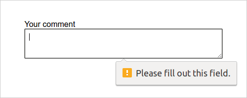
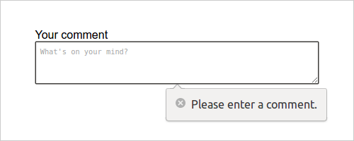
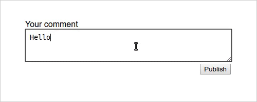

От базовых до улучшенных сообщений об ошибках к фоновой синхронизации

Не исключено, что рано или поздно при разработке сайта вам придётся заняться реализацией формы, будь то регистрационная форма или форма для добавления комментариев. Я сам занимался этим уже много раз, но при создании очередной формы комментариев я задумался, насколько далеко я могу зайти в процессе её улучшения. После добавления одного улучшения мне в голову пришло другое, после реализации которого пришло ещё одно.

Вот почему я хотел бы показать вам как, используя фоновую синхронизацию, вы можете улучшить форму (в данном случае состоящую из `<input>` для имени, `<textarea>` для сообщения и `<button>` для отправки) с базовой до _Улучшенной улучшенной™_ версии с фоновой синхронизацией.

## Базовая версия

Начнём с базовой версии HTML-формы:

    <form action="./" method="post">
        <label for="name">Имя</label>
        <input type="text" name="name" id="name">

        <label for="comment">Комментарий</label>
        <textarea name="comment" id="comment"></textarea>

        <button type="submit">Опубликовать</button>
    </form>

Это будет работать в _любом_ браузере. Теперь начнём улучшать форму без изменения её базовой версии.

[Демо базовой версии.](https://justmarkup.github.io/demos/form-enhancement/v1/)

## Улучшенная HTML-версия

Во-первых, элемент `<textarea>` никогда не должен быть пустым, поэтому добавим к нему атрибут required. Форму можно проверять на стороне клиента без JavaScript — при условии, что браузер [поддерживает](http://caniuse.com/#feat=form-validation) такую возможность. Однако, не стоит на него полагаться (неподдерживаемые браузеры, [баги](https://bugs.webkit.org/show_bug.cgi?id=28649) в браузерах и другое), поэтому валидация форм на стороне сервера — очень хорошая идея.

    <form action="./" method="post">
        <label for="name">Имя</label>
        <input type="text" name="name" id="name">

        <label for="comment">Комментарий</label>
        <textarea required placeholder="Что думаете?" name="comment" id="comment"></textarea>

        <button type="submit">Опубликовать</button>
    </form>

Далее, добавим атрибут placeholder. Никогда не заменяйте `<label>` на placeholder, это важное дополнение, но никак не замена.

[Демо улучшенной версии HTML.](https://justmarkup.github.io/demos/form-enhancement/v2/)

## Делим по способностям

Для дальнейших улучшений мы будем использовать JavaScript. В `<head>` нашей страницы добавим [тест, отсекающий браузеры](https://justmarkup.com/log/2015/02/cut-the-mustard-revisited/), которые не поддерживают улучшения. Мы будем использовать технику, с которой я впервые столкнулся в статье Filament Group [«Enhancing optimistically»](https://www.filamentgroup.com/lab/enhancing-optimistically.html).

    if ('visibilityState' in document) {
        // Подключаем здесь loadJS...
        function loadJS (src) { ... }

        // Этот браузер всё сможет, давайте ещё улучшим интерфейс!
        var docElem = window.document.documentElement;

        // Класс для улучшения интерфейса
        var enhancedClass = 'enhanced';
        var enhancedScriptPath = 'enhanced.js';

        // Добавляем класс улучшения
        function addClass () {
            docElem.className += ' ' + enhancedClass;
        }

        // Удаляем класс улучшения
        function removeClass () {
            docElem.className = docElem.className.replace(enhancedClass, ' ');
        }

        // Давайте оптимистично улучшим
        addClass();

        // Подгружаем улучшенный JS-файл
        var script = loadJS(enhancedScriptPath);

        // Если скрипт не загрузился за 8 секунд,
        // удаляем класс улучшения
        var fallback = setTimeout(removeClass, 8000);

        // Когда скрипт загружается, отменяем таймер
        // и добавляем класс снова, на всякий случай
        script.onload = function () {
            // Отменяем таймер фолбэка
            clearTimeout(fallback);
            // Добавляем этот класс на случай, если его уже удалили.
            // Этот запрос не отменить, он может прийти в любое время
            addClass();
        };
    }

## Кастомные сообщения об ошибках

Заменим базовое сообщение об ошибке «Пожалуйста, заполните это поле» на кастомное. Для создания кастомного сообщение в наш скрипт enhanced.js (который будет загружаться только в поддерживаемых браузерах) добавим следующий код:

    // Добавляем свой текст сообщения об ошибке
    var commentArea = document.querySelector('#comment');

    commentArea.addEventListener('invalid', function (e) {
        e.target.setCustomValidity('');
        if (!e.target.validity.valid) {
            e.target.setCustomValidity('Пожалуйста, введите комментарий.');
        }
    });

    commentArea.addEventListener('input', function (e) {
        e.target.setCustomValidity('');
    });

В таком случае, при отправке формы без комментариев, пользователю будет выводиться сообщение _«Пожалуйста, введите комментарий»_. Вы, наверное, заметили, что я до сих пор ничего не говорил о стилях сообщений. Потому что на данный момент нет никакой возможности оформить их с помощью CSS. Раньше можно было воспользоваться селектором ::-webkit-validation-bubble для браузеров на WebKit, но он был удалён. Если вы действительно хотите оформить всплывающее окно, то вам нужно будет [создать своё собственное](http://developer.telerik.com/featured/building-html5-form-validation-bubble-replacements/). Но имейте в виду, что здесь есть много подводных камней, поэтому я советую использовать всплывающие окна по умолчанию.

[Демо кастомных сообщений об ошибках.](https://justmarkup.github.io/demos/form-enhancement/v3/)

## Аяксим

Теперь, когда пользователь попытается отправить пустое поле, все современные браузеры будут выводить кастомное сообщение об ошибке, но даже если пользователь оставит комментарий, форма по-прежнему будет обрабатываться на стороне сервера, что приведёт к перезагрузке страницы. Давайте это исправим, разместив комментарий с помощью JavaScript.

    // Отправляем данные формы на JavaScript
    if (window.FormData) {
        var appendComment = function (nameValue, commentValue) {
            var comment = document.createElement('li');
            var commentName = document.createElement('h4');
            var commentComment = document.createElement('p');
            var commentWrapper = document.querySelector('.comments');
            commentName.innerText = nameValue;
            commentComment.innerText = commentValue;
            nameValue ? comment.appendChild(commentName) : '';
            comment.appendChild(commentComment);
            commentWrapper.appendChild(comment);
        };

        form.addEventListener('submit', function (e) {
            var formData = new FormData(form);
            commentValue = commentArea.value;
            nameValue = nameInput.value;

            var xhr = new XMLHttpRequest();
            // Сохраняем комментарий в базу
            xhr.open('POST', './save', true);
            xhr.onload = function () {
                appendComment(nameValue, commentValue);
            };
            xhr.send(formData);

            // Всегда вызывайте preventDefault в конце
            // см. http://molily.de/javascript-failure/
            e.preventDefault();
        });
    }

Сначала проверим поддерживает ли бразуер [FormData](http://caniuse.com/#feat=xhr2) и расширенные функции XMLHttpRequest. Если да, то определим функцию appendComment() для добавления нового комментария к другим комментариям. Далее добавим _событие отправки_ к нашей форме для отправки XMLHttpRequest. Если запрос успешный — добавляем комментарий. В самом конце вызовем preventDefault для предотвращения поведения формы по умолчанию. Важно вызывать метод preventDefault в конце, так как мы не знаем [завершится ли выполнение JavaScript ошибкой](http://molily.de/javascript-failure/).

Теперь наша форма прекрасно отправляет комментарии без перезагрузки страницы и при этом по-прежнему работает в неподдерживаемых браузерах.

На этом этапе вы можете задаться вопросом, почему я не использовал Fetch API. Я хотел охватить как можно больше популярных браузеров без использования полифилов и не хотел ограничиваться поддержкой только современных браузеров.

[Демо AJAX-версии.](https://justmarkup.github.io/demos/form-enhancement/v5/)

## Авторасширение `<textarea>`

Если вы напишите длинный комментарий, вам придётся проматывать текст вверх и вниз, чтобы перепроверить написанное. Исправим это с помощью авторасширения `<textarea>`.

Для этого мы будем использовать [решение](https://codepen.io/vsync/pen/czgrf), которое я нашёл на CodePen.

    commentArea.addEventListener('keydown', autosize);

    function autosize () {
        var el = this;
        setTimeout(function () {
            el.style.cssText = 'height:auto;';
            el.style.cssText = 'height:' + el.scrollHeight + 'px';
        }, 0);
    }

Теперь элемент `<textarea>` адаптируется к длине комментария, что упрощает проверку текста.

[Демо с автоматическим расширением.](https://justmarkup.github.io/demos/form-enhancement/v5/)

## Успех, ошибка и плохое соединение

Итак, мы добавили улучшенный HTML (атрибуты `placeholder` и `required`), назначили кастомные сообщения об ошибках, добавили AJAX и автоматическое расширение для `<textarea>`.

Далее, для большего удобства, добавим уведомление о успешной (или неуспешной) отправке комментария и индикатор прогресса для отображения времени загрузки.

    

    <button type="submit">Опубликовать</button>

Сначала добавим новый элемент в нашу форму для отображения сообщений.

    var messageElement = document.querySelector('#feedback');
    // …
    form.addEventListener('submit', function () {
    // …
        xhr.onerror = function () {
            messageElement.className = 'message error';
            messageElement.textContent = 'При публикации комментария произошла ошибка. Попробуйте ещё раз.';
        };
        xhr.upload.onprogress = function (e) {
            messageElement.textContent = 'Uploading: ' + e.loaded / e.total * 100;
        };
        xhr.upload.onloaded = function () {
            messageElement.className = 'message success';
            messageElement.textContent = 'Ваш комментарий успешно опубликован.';
        };
    // …
    });

В случае возникновения ошибки при отправке комментария, пользователю будет выводиться сообщение, которое определено в событии error. В противном случае будет выводиться сообщение об успешной отправке, как это задано в событии loaded. В событие progress добавим индикатор, который будет показывать сколько процентов страницы уже загрузилось. При условии, что качество подключения хорошее, вы не увидите индикатор загрузки, но если вы набираете длинный комментарий при медленном соединении, индикатор сообщит вам, что «там» что-то происходит и комментарий рано или поздно будет опубликован.

[Демо версии с прогрессом](https://justmarkup.github.io/demos/form-enhancement/v6/).

## Сервис-воркер и фоновая синхронизация

Итак, мы улучшили работу с формой при плохом соединении, а теперь улучшим её при отсутствии соединения.

    // Проверяем поддержку сервис-воркера
    if ('serviceWorker' in navigator) {
        // Регистрируем сервис-воркер
        navigator.serviceWorker.register('./service-worker.js');

        form.addEventListener('submit', function (e) {
            let formData = new FormData(form);
            // Отправляем сообщение в фоне
            navigator.serviceWorker.ready.then(function (swRegistration) {
                idbKeyval.set('comment', commentArea.value);
                idbKeyval.set('name', nameInput.value ? nameInput.value : false);
                messageElement.className = 'message info';
                messageElement.textContent = 'Похоже вы в офлайне. Комментарий опубликуется автоматически как только вы будете онлайн.';

                return swRegistration.sync.register('form-post');
            });

            // Всегда вызывайте preventDefault в конце
            // см. http://molily.de/javascript-failure/
            e.preventDefault();
        });

        // Событие для получения сообщения
        // отправленного сервис-воркером
        navigator.serviceWorker.addEventListener('message', function (e) {
            if (e.data == 'success') {
                messageElement.className = 'message success';
                messageElement.textContent = 'Ваш комментарий успешно опубликован.';
                let nameValue = false;
                idbKeyval.get('name').then(function (data) {
                    nameValue = data;
                    let commentValue = '';
                    idbKeyval.get('comment').then(function (data) {
                        commentValue = data;
                        appendComment(nameValue, commentValue);
                    });
                });
            } else if (e.data == 'error') {
                messageElement.className = 'message error';
                messageElement.textContent = 'При публикации комментария произошла ошибка. Попробуйте ещё раз.';
            }
        });
    } else if (window.FormData) {
        // …
    }

Сначала проверим [поддерживается ли](http://caniuse.com/#feat=serviceworkers) сервис-воркер браузером. Если да, то используем [фоновую синхронизацию](https://github.com/WICG/BackgroundSync/blob/master/explainer.md) для отправки комментария, в противном случае опубликуем комментарий через XMLHttpRequest, как показано выше в версии на AJAX.

Давайте посмотрим, как работает код. При отправке данных формы сохраним значение имени и комментария в [IndexedDB](https://developer.mozilla.org/en/docs/Web/API/IndexedDB_API). В моём случае, я использую хранилище «ключ-значение» на промисах Джейка Арчибальда, реализованное с помощью IndexedDB. Также выведем сообщение о том, что пользователь находится в автономном режиме и, как только появится сеть, комментарий будет автоматически опубликован. Если соединение хорошее и комментарий может быть опубликован сразу, это сообщение выводиться не будет. И, наконец, регистрируем фоновую синхронизацию с тегом `form-post`.

Чтобы узнать был ли комментарий размещён успешно, добавим обработчик событий, который проверит сообщения, поступающие от сервис-воркера.

Теперь давайте посмотрим, как выглядит наш service-worker.js.

    importScripts('idb-keyval.js');

    const VERSION = 'v1';

    self.addEventListener('install', function (e) {
        self.skipWaiting();
        e.waitUntil(
            caches.open(VERSION).then(function (cache) {
                return cache.addAll([
                    './',
                    './index.html',
                    '../style.css',
                    'enhanced.js'
                ]);
            })
        );
    });

    self.addEventListener('fetch', function (e) {
        let request = e.request;
        if (request.method !== 'GET') {
            return;
        }
    });

    self.addEventListener('activate', function () {
        if (self.clients && clients.claim) {
            clients.claim();
        }
    });

    self.addEventListener('sync', function (e) {
        if (e.tag == 'form-post') {
            e.waitUntil(postComment());
        }
    });

    function postComment () {
        let formData = new FormData();

        idbKeyval.get('name').then(function (data) {
            formData.append('name', data);
        });

        idbKeyval.get('comment').then(function (data) {
            formData.append('comment', data);
        });

        fetch('./save', {
            method: 'POST',
            mode: 'cors',
            body: formData
        }).then(function (response) {
            return response;
        }).then(function (text) {
            send_message_to_all_clients('success');
        }).catch(function (error) {
            send_message_to_all_clients('error');
        });
    }

    function send_message_to_client (client, msg) {
        return new Promise(function (resolve, reject) {
            var msg_chan = new MessageChannel();

            msg_chan.port1.onmessage = function (e) {
                if (e.data.error) {
                    reject(e.data.error);
                } else {
                    resolve(e.data);
                }
            };

            client.postMessage(msg, [msg_chan.port2]);
        });
    }

    function send_message_to_all_clients (msg) {
        clients.matchAll().then(clients => {
            clients.forEach(client => {
                send_message_to_client(client, msg).then(
                    msg => console.log('Сообщение из сервис-воркера: ' + msg)
                );
            });
        });
    }

Сначала импортируем хранилище «ключ-значение» на промисах, которое мы уже использовали в enhanced.js для обработки IndexedDB. Затем определим `const` для версии кэша и добавим функции для обработки `install` (добавим ресурсы в кэш), `fetch` (для обработки запросов) и события активации. Самая важная часть начинается с синхронизированной версии. Здесь мы сначала проверяем является ли тег `form-post`. Это тот самый тег, который мы зарегистрировали ранее используя `swRegistration.sync.register(form-post)`. При совпадении тега вызываем `e.waitUntil(postComment())`. Теперь, как только появится хорошее соединение, функция postComment будет выполнена.

В нашей функции `postComment` создадим новый объект `FormData` и добавим имя и значение поля, которые мы получим от IndexedDB. Далее, для того, чтобы сохранить комментарий, используем `fetch`. В случае получения успешного ответа отобразим сообщения об удачной отправке комментария (в противном случае — об ошибке).

Теперь комментарий будет опубликован в любом случае. Если вы онлайн, комментарий опубликуется сразу, если вы офлайн, он будет опубликован, как только появится связь, даже если вы уже закрыли страницу с формой.

[Демо _Улучшенной улучшенной™_ версии.](https://justmarkup.github.io/demos/form-enhancement/v7/)

**Обратите внимание:** если вы хотите проверить работоспособность окончательной версии в автономном режиме, необходимо учитывать, что сейчас в Chrome есть ошибка — просмотр страницы в автономном режиме, при использовании отладчика, не работает. Для этого вам действительно надо быть в офлайне.

## Заключение

Как видите, есть много вариантов улучшить форму, а также множество других возможностей, которые я не упомянул. Столько всего можно сделать с помощью CSS, о чём я вообще не говорил здесь, но также многое можно сделать с помощью JavaScript. Самое главное здесь, что, благодаря прогрессивному улучшению, мы поддерживаем все браузеры. Некоторые посетители получат более удобный интерфейс, но абсолютно все пользователи смогут выполнить задачу и опубликовать комментарий.

Лишь немногие получат _Улучшенную улучшенную™_ версию, но, в зависимости от обстоятельств, каждый гарантированно получит базовую версию формы.

[Финальная Улучшенная улучшенная™ версия.](https://justmarkup.github.io/demos/form-enhancement/v7/)

Если у вас есть какие-либо идеи по улучшению или вы нашли ошибку в коде, пожалуйста, создайте [ишью на Гитхабе.](https://github.com/justmarkup/demos/issues)
