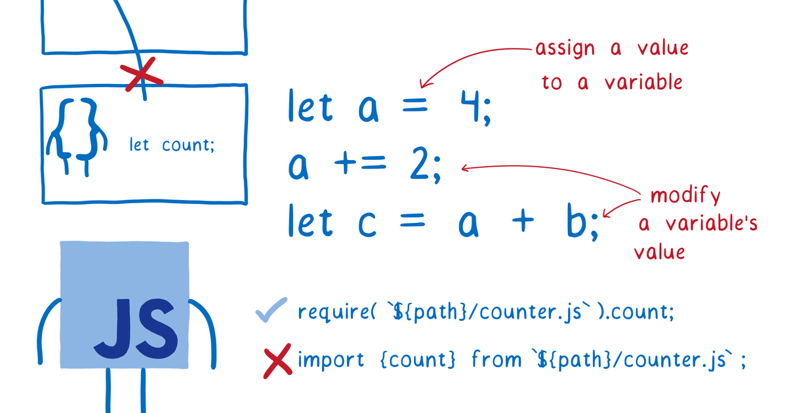

ES-модули приносят в JavaScript официальную, унифицированную модульную систему. Однако, чтобы прийти к этому, потребовалось почти 10 лет работы по стандартизации.

Но ожидание почти закончилось. С выходом Firefox 60 в мае (пока в бете) все основные браузеры будут поддерживать ES-модули, а Рабочая группа Node Modules сейчас работает над добавлением поддержки ES-модулей в Node.js. Также идет интеграция ES-модулей в WebAssembly.

Многие JavaScript-разработчики знают, что ES-модули были противоречивыми. Но мало кто действительно понимает, как они работают. Давайте рассмотрим, какую проблему решают ES-модули и чем они отличаются от модулей в других модульных системах.

## Какую проблему решают модули?

Написание кода на JavaScript состоит в работе с переменными — в присвоении значений переменным или добавлении чисел в переменные или объединении двух переменных вместе и помещении их в другую переменную.

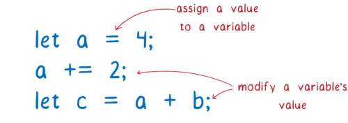

Поскольку большая часть вашего кода связана с изменением переменных, то их организация будет напрямую влиять на качество вашего кода… и на то, насколько хорошо вы сможете поддерживать его в дальнейшем.

Небольшое количества переменных, о которых вам нужно думать, значительно упростило бы ситуацию. У JavaScript есть способ помочь вам в этом — область видимости (scope). Из-за того, как области видимости работают в JavaScript, функции не могут обращаться к переменным, определенным в других функциях.

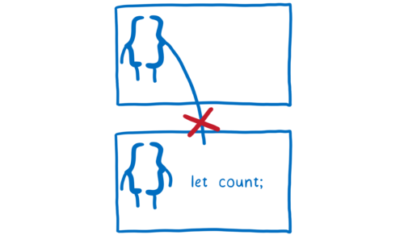

Это хорошо. Значит когда вы работаете над одной функцией, вы можете сосредоточиться только на ней. Вам не нужно беспокоиться о том, что другие функции могут делать с вашими переменными.

Однако у такого подхода есть и недостаток. Он затрудняет обмен переменными между различными функциями.

Что делать, если вы захотите использовать переменную вне текущей области видимости? Обычно способ справиться с этим заключается в том, чтобы положить её в область выше, например, в глобальную область видимости.

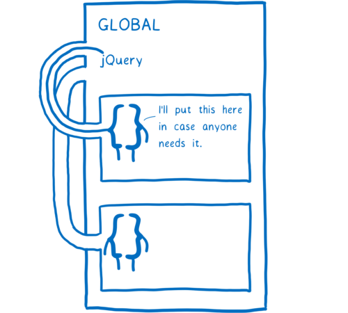

Это работает, но появляются некоторые проблемы.

Во-первых, все ваши скрипты должны быть расположены в определенном порядке. И вы должны будете внимательно следить за тем, чтобы никто не испортил этот порядок.

Если этот порядок нарушится, то в середине работы ваше приложение выдаст ошибку. Когда функция ищет jQuery там, где она ожидает его — на глобальном уровне — и не находит его, она выбрасывает ошибку и прекращает выполнение.

Это делает поддержку кода сложным, а удаление старого кода или скриптов игрой в рулетку. Вы не знаете, что может сломаться. Зависимости между этими различными частями кода неявны. Любая функция может использовать что угодно на глобальном уровне, поэтому вы точно не можете знать, какие функции от чего зависят.

Вторая проблема заключается в том, что поскольку эти переменные находятся в глобальной области видимости, каждая часть кода, находящаяся внутри этой области, может изменить переменную. Вредоносный код может изменить эту переменную специально с целью изменения работы функций или другой код может случайно удалить вашу переменную.

## Как нам помогут модули?

Модули дают вам лучший способ организовать эти переменные и функции. С модулями вы группируете переменные и функции, которые имеет смысл объединить.

Это помещает эти функции и переменные в область видимости модуля. Область модуля может использоваться для обмена переменными между функциями в модуле.

Но в отличие от областей видимости функций, области модулей позволяют сделать их переменные доступными и для других модулей. Они могут явно указать, какие переменные, классы или функции в модуле должны быть доступны.

Когда что-то становится доступным для других модулей, это называется export. После экспорта другие модули могут явно сказать, что они зависят от этой переменной, класса или функции.

Поскольку экспорт указывается явно, это позволяет определить, какие модули будут нарушены при удалении другого.

Когда у вас появляется возможность экспортировать и импортировать переменные между модулями, это значительно облегчает разбиение вашего кода на небольшие куски, которые могут работать независимо друг от друга. Затем вы можете комбинировать и рекомбинировать эти куски, вроде блоков Lego, для создания любых приложений из одного и того же набора модулей.

Поскольку модули настолько полезны, было несколько попыток добавить модульность в JavaScript. Сегодня активно используются две системы

1. CommonJS (CJS) — это то, что Node.js использовал изначально.

1. ESM (модули ECMAScript) — это более новая система, добавленная в спецификацию JavaScript. Браузеры уже поддерживают ES-модули, а Node.js добавляет поддержку.

Давайте подробно рассмотрим, как работает эта новая модульная система.

## Как работают ES-модули

При разработке с помощью модулей, вы строите граф зависимостей. Связи между различными зависимостями берутся из любых инструкций import, которые вы используете.

Эти операторы импорта определяют, какой код браузеру или Node.js нужно загрузить. Вы даете ему файл для использования в качестве точки входа в граф. Оттуда он просто следует за любым из операторов импорта, чтобы найти остальную часть кода.

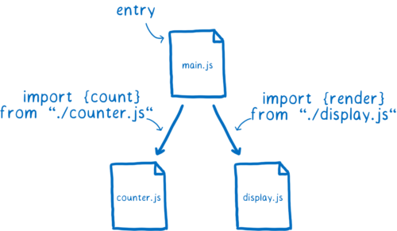

Но сами файлы не являются тем, что браузер может использовать. Ему необходимо разобрать все эти файлы, чтобы превратить их в структуры данных, называемые записями модулей (module records). Таким образом, он действительно узнает, что происходит в файле.

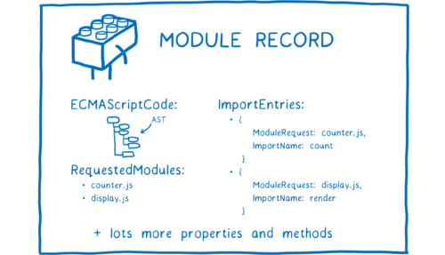

После этого запись модуля необходимо превратить в экземпляр модуля. Экземпляр объединяет две вещи: код и состояние.

Код обычно представляет собой набор инструкций. Это как рецепт, как сделать что-то. Но вы не можете просто использовать этот код. Вам нужны исходные материалы для использования с этими инструкциями.

Что такое состояние? Состояние дает вам эти исходные материалы. Состояние — это фактические значения переменных в любой момент времени. Конечно, эти переменные — это просто псевдонимы для ячеек памяти, которые содержат значения.

Таким образом, экземпляр модуля объединяет код (список инструкций) с состоянием (значениями всех переменных).

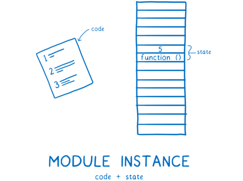

Нам нужен экземпляр для каждого модуля. Процесс загрузки модуля происходит от файла точки входа к полному графу экземпляров модуля.

Для ES-модулей это происходит в три этапа.

1. Построение (constuction) — поиск, загрузка и парсинг всех файлов в записях модулей.

1. Создание экземпляра (instantiation) — поиск ячеек в памяти для размещения всех экспортируемых значений (но пока без заполнения их значениями) Затем связывание — экспорт и импорт этих полей в памяти.

1. Оценка (evaluation) — запуск кода для заполнения этих полей фактическими значениями переменных.

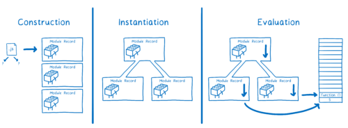

Люди говорят о том, что ES-модули являются асинхронными. Вы можете думать об этом как о асинхронном процессе, т.к работа делится на три разные фазы:

1. Построение
2. Создание экземпляров
3. Оценка

Все эти этапы могут выполняться отдельно. Это означает, что спецификация вводит какую-то асинхронность, которой не было в CommonJS. Я объясню это позже, но в CJS-модуль и его зависимости загружаются, создаются и анализируются сразу, без каких-либо перерывов.

Однако сами по себе действия не обязательно являются асинхронными. Они могут быть выполнены синхронным способом — зависит от того, что делает загрузка. Это потому, что не все контролируется спецификацией ESM. На самом деле есть два этапа работы, которые покрываются различными спецификациями.

Спецификация ES-модулей говорит о том, как следует анализировать файлы в записях модулей, и как следует создавать экземпляры и оценивать этот модуль. Тем не менее, в спецификации не описывается, как изначально получить эти файлы.

Это загрузчик, который извлекает файлы. И загрузчик указан в другой спецификации. Для браузеров он описан спецификацией HTML. Но у вас могут быть разные загрузчики, основанные на той платформе, которую вы используете.

Загрузчик также точно контролирует загрузку модулей. Он вызывает методы ES-модуля: `ParseModule`, `Module.Instantiate` и `Module.Evaluate`.

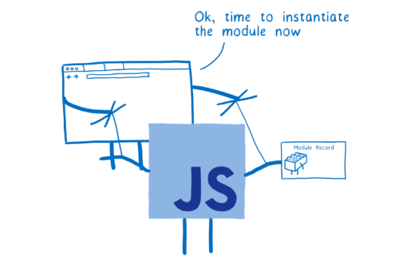

Теперь давайте пройдемся по каждому шагу более подробно.

### Построение (Construction)

Во время этапа построения для каждого модуля происходят три вещи:

1. Определение, где загрузить файл, содержащий модуль (module resolution).
1. Загрузка файла (по URL или из файловой системы).
1. Синтаксический анализ файла в записи модуля.

### Поиск и получение файла (fetching)

Загрузчик позаботится о поиске файла и его загрузке. Сначала ему необходимо найти файл точки входа. В HTML вы указываете загрузчику, где его найти, используя тег `<script>`.

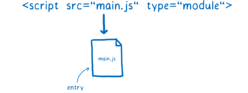

Но как он найдет следующую группу модулей — от которых напрямую зависят модули main.js?

В этом случае используются операторы import. Одна часть оператора импорта называется спецификатором модуля. Он сообщает загрузчику, где он может найти каждый следующий модуль.

Одно замечание о спецификаторах модулей: иногда их нужно обрабатывать по-разному в браузере и Node.js. Каждый хост имеет свой собственный способ интерпретации спецификатора модуля. Для этого он использует решение, называемое алгоритмом разрешения модулей, которое отличается между платформами. В настоящее время некоторые спецификаторы модулей, которые работают в Node.js, не будут работать в браузере, но сейчас ведутся [работы по устранению этой проблемы](https://github.com/domenic/package-name-maps).

Пока это не исправлено, браузеры принимают только URL в качестве спецификаторов модуля. Они загружают файл модуля с этого URL. Но это не происходит для всего графа одновременно. Вы не знаете, какие зависимости модуль должен получить, пока вы не проанализировали файл… и вы не сможете проанализировать файл, пока не получите его.

Это означает, что мы должны пройти через дерево поэтапно, слой за слоем, анализировать один файл, выяснить его зависимости, а затем найти и загрузить их.

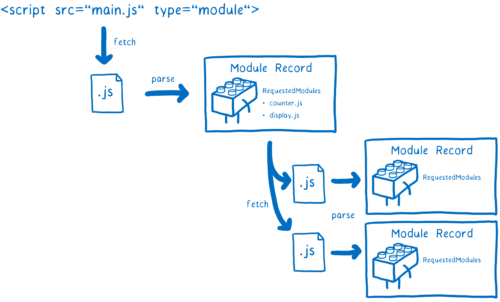

Если бы основной поток ожидал загрузки каждого из этих файлов, в его очереди скопилось бы много других задач. Это потому, что, когда вы работаете в браузере, загрузка занимает большую часть времени.

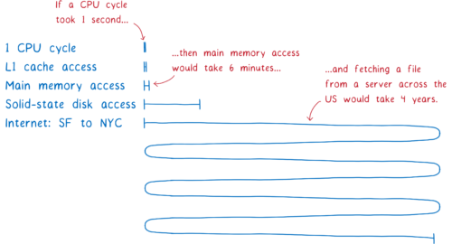

Блокировка основного потока сделает использование модулей в вашем приложении очень медленным. Это одна из причин того, что спецификация ES-модулей разбивает алгоритм на несколько этапов. Разбиение на фазы позволяет браузерам извлекать файлы и строить свое понимание графа модуля перед тем, как приступить к синхронной работе по созданию экземпляров.

Этот подход — разделение алгоритма на фазы — является одним из ключевых различий между ES-модулями и модулями CommonJS.

CommonJS может делать всё по-другому, потому что загрузка файлов из файловой системы занимает гораздо меньше времени, чем загрузка через интернет. Это означает, что Node.js может блокировать основной поток при загрузке файла. И раз файл уже загружен, есть смысл сразу провести построение (construction) и создание экземпляров (без разбивки на фазы). Это также означает, что вы идёте по всему графу, загружаете, создаете экземпляры и оцениваете зависимости перед возвратом экземпляра модуля.

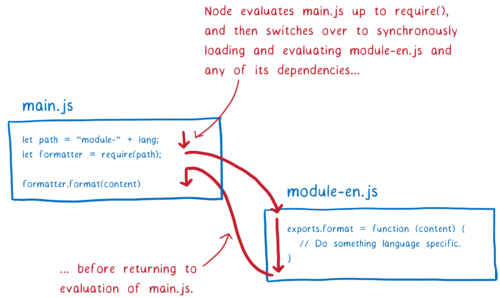

Подход CommonJS имеет несколько последствий, и я расскажу об этом позже. Но одно это означает, что в Node.js с модулями CommonJS вы можете использовать переменные в вашем спецификаторе модуля. Вы выполняете весь код в этом модуле (до инструкции `require`), прежде чем искать следующий модуль. Это означает, что переменная будет иметь значение при переходе к определению модулей.

Но с ES-модулями вы заранее строите весь этот граф модулей, прежде чем выполнять какую-либо оценку. Это означает, что вы не можете использовать переменные в своих спецификаторах модулей, поскольку эти переменные еще не имеют значений.

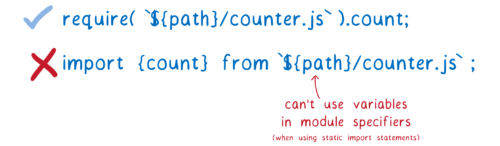

Но иногда очень полезно использовать переменные для путей модулей. Например, может потребоваться переключить загружаемый модуль в зависимости от того, что делает код или в какой среде он выполняется.

Чтобы сделать это возможным для ES модулей, есть [предложение под названием динамический импорт](https://github.com/tc39/proposal-dynamic-import). С его помощью можно использовать импорт вида import(`${path}/foo.js`).

Это работает так: любой файл, загруженный с помощью import(), обрабатывается как точка входа в отдельный граф. Динамически импортируемый модуль запускает новый граф, который обрабатывается отдельно.

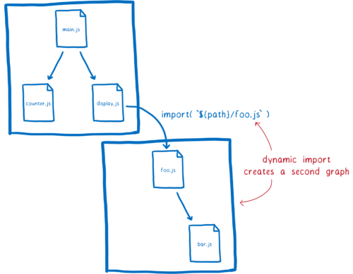

Однако следует отметить, что любой модуль, который находится в обоих этих графах, будет совместно использовать экземпляр модуля. Это происходит потому, что загрузчик кэширует экземпляры модулей. Для каждого модуля в определенной глобальной области будет только один экземпляр модуля.

Это уменьшает объём работы для движка. Например, это означает, что файл модуля будет извлечен только один раз, даже если несколько модулей зависят от него (это одна из причин для кэширования модулей. Мы увидим другой в разделе оценки.)

Загрузчик управляет этим кэшем с помощью так называемой [карты модулей](https://html.spec.whatwg.org/multipage/webappapis.html#module-map). Каждый глобальный модуль отслеживает свои модули в отдельной карте.

Когда загрузчик получает URL, он помещает этот URL в карту модуля и отмечает, что он в настоящее время извлекает файл (fetching). Затем он отправит запрос и перейдет к следующему файлу.

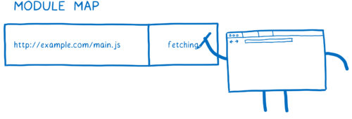

Что произойдет, если другой модуль зависит от того же файла? Загрузчик будет искать каждый URL в карте модуля. Если он увидит там `fetching`, он просто перейдет к следующему URL.

Но карта модуля не просто отслеживает, какие файлы извлекаются. Карта модуля также служит в качестве кэша для модулей, как мы увидим далее.

### Парсинг

Теперь, когда мы извлекли этот файл, нам нужно распарсить его в записи модуля. Это помогает браузеру понять, что представляют собой различные части модуля.

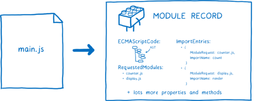

После создания запись модуля помещается в карту модуля. Это означает, что всякий раз, когда он запрашивается, загрузчик может вытащить его из этой карты.

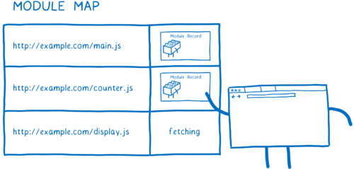

Есть одна деталь в парсинге, которая может показаться тривиальной, но на самом деле имеет довольно большие последствия. Все модули анализируются так, как если бы они имели `use strict` вверху. Есть и другие незначительные отличия. Например, ключевое слово `await` зарезервировано в коде верхнего уровня модуля, а значение `this` — `undefined`.

Другой способ парсинга называется целью парсинга (parse goal). Если вы анализируете один и тот же файл, но используете разные цели, вы получите разные результаты. Таким образом, вы хотите знать, прежде чем начать парсинг, какой файл вы анализируете — является ли он модулем или нет.

В браузерах это довольно легко. Вы просто добавляете `type="module"` в тег `<script>`. Это говорит браузеру, что этот файл должен быть проанализирован как модуль. И поскольку импортировать можно только модули, браузер знает, что любой импорт также является модулем.

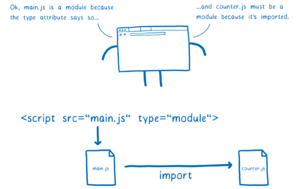

Но в Node.js вы не можете использовать HTML-теги, поэтому у вас нет возможности использовать атрибут type. Сообщество пыталось решить эту проблему с помощью расширения .mjs. Это расширение говорит Node.js что этот файл является модулем. Сообщество говорит об этом, как о метке для цели парсинга. Обсуждение в настоящее время продолжается, поэтому неясно, какую метку сообщество решит использовать в конце.

В любом случае загрузчик определит, следует ли анализировать файл как модуль или нет. Если это модуль и есть импорт, он начнет процесс снова, пока все файлы не будут извлечены и распарсены.

И все готово! По окончании процесса загрузки вы перешли от простого файла точки входа к множеству записей модуля.

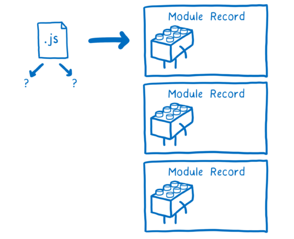

Следующий шаг — создать экземпляр этого модуля и связать Все экземпляры вместе.

### Создание экземпляра

Последний шаг — заполнение этих ячеек памяти. JS-движок делает это, выполняя код верхнего уровня — код, который находится вне функций.

Помимо простого заполнения этих ячеек памяти, оценка кода также может вызывать различные сайд-эффекты. Например, модуль может сделать запрос на сервер.

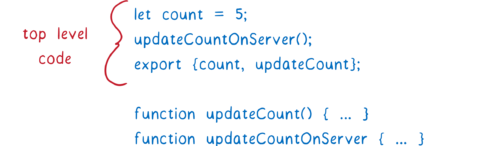

Из-за потенциальных побочных эффектов вы хотите только один раз оценить модуль. В отличие от линковки, которая происходит при создании экземпляра, которая может выполняться несколько раз с точно таким же результатом, оценка может иметь разные результаты в зависимости от того, сколько раз вы это делаете.

Это одна из причин наличия карты модулей. Карта модуля кэширует модуль по каноническому URL, так что для каждого модуля имеется только одна запись модуля. Это гарантирует, что каждый модуль выполняется только один раз.

А как насчет тех циклов, о которых мы говорили раньше?

В циклической зависимости вы в конечном итоге получаете цикл в графе. Обычно это длинная петля. Но чтобы объяснить проблему, я буду использовать пример с коротким циклом.

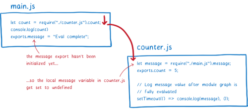

Давайте посмотрим, как это будет работать с модулями CommonJS. Во-первых, основной модуль выполнит оператор require. Затем будет загружен модуль counter.

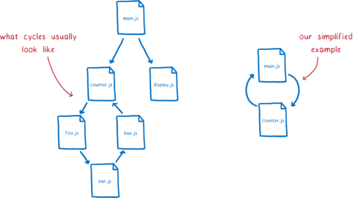

Модуль `counter` попытается получить доступ к `message` из объекта `exports`. Но так как он еще не был оценен в основном модуле, вернется `undefined`. JS-движок выделит пространство в памяти для локальной переменной и установит значение `undefined`.

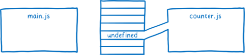

Оценка продолжается до конца кода верхнего уровня counter. Мы хотим узнать, получим ли мы правильное значение для сообщения в конце концов (после оценки main.js), поэтому мы настроим таймаут. Затем оценка возобновляется на main.js.

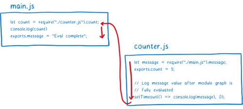

Переменная message будет инициализирована и добавлена в память. Но поскольку между ними нет никакой связи, она останется неопределенной в требуемом модуле.

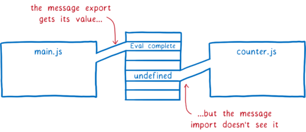

Если экспорт будет обработан с использованием привязок в реальном времени, в конце концов counter увидит правильное значение. К моменту истечения таймаута оценка main.js завершиться и в переменную присвоится значение.

Поддержка этих циклов является большим основанием для разработки ES-модулей. Именно эта трехфазная архитектура и сделает её возможной.

### Каков текущий статус ES-модулей ?

С выходом Firefox 60 в начале мая, все основные браузеры будут поддерживать ES-модули по умолчанию. Node.js также добавляет поддержку, создана рабочая группа, занимающаяся выяснением проблем совместимости между CommonJS и ES-модулями.

Это означает, что вы сможете использовать тег `<script type="module">`, `import` и `export`. Однако еще больше возможностей впереди. [Dynamic imports proposal](https://github.com/tc39/proposal-dynamic-import) находится на Stage 3 в процессе спецификации, также есть [`import.meta`](https://github.com/tc39/proposal-import-meta), а [module resolution proposal](https://github.com/domenic/package-name-maps) поможет сгладить различия между браузерами и Node.js. Поэтому работа с модулями станет еще лучше в будущем.

## Благодарность

Спасибо всем, кто дал обратную связь на этот пост, или чьи письма или дискуссии прошлого года, в том числе Акселю Раухшмаеру, Бредли Фариасу, Дейву Хернану, Доменику Дениколе, Хави Хоффману, Джейсону Везерсби, Джей-Эф Бастьену, Йону Копперду, Люку Вагнеру, Майлсу Боринсу, Тиллю Шнайдериту, Тобаясу Копперсу, Йехуде Кацу, участникам сообщества WebAssembly, Рабочей группе Node Modules, а также TC39.
