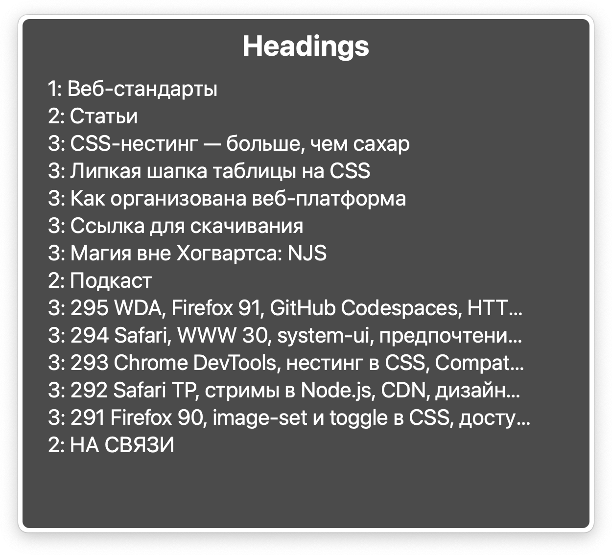
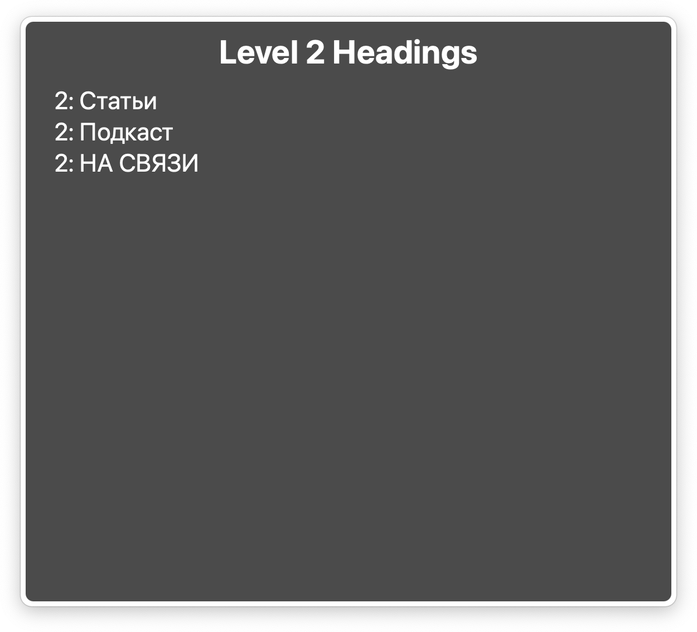

Сегодня я хотел бы затронуть очень важную вещь в доступности веб-контента — заголовки. О важности уровней заголовков неплохо рассказывает Эрик Бейли в статье «[Важность уровней заголовков для вспомогательных технологий](https://web-standards.ru/articles/heading-levels/)». Чтобы не повторяться, я дам небольшое введение о заголовках с точки зрения скринридера, но главное, на чём мы сфокусируемся сегодня — дополнительные уровни заголовков.

Причиной, побудившей написать меня об этом, стали новаторские идеи: либо отказаться от уровней заголовков вовсе, либо, если не хватает шести уровней, начать добавлять седьмой, восьмой и так далее при помощи `aria-level="N"`.

Во многом сомнения у людей возникают из-за техники создания заголовков с помощью `role="heading"`, [описанной в приложении к WCAG 2.1](https://www.w3.org/WAI/WCAG21/Techniques/aria/ARIA12.html), где в первом примере вовсе не указывается уровень, а во втором демонстрируется возможность создания заголовка седьмого уровня.

```html
<div role="heading" aria-level="7">Jonagold/div>
<p>
    Jonagold is a cross between the Golden
    Delicious and Jonathan varieties.
</p>
```

Здесь стоит напомнить, что не все примеры из спецификаций по доступности стоит буквально применять в вашем коде. Спецификация описывает то, как должны или могут работать браузеры, чтобы транслировать подходящую информацию в скринридеры или другие вспомогательные инструменты. Но важно не забывать о совместимости и практике применения: что сейчас работает в браузерах, что показало свою эффективность, а что нет.

## Заголовки для скринридера

Незрячий пользователь, изучая страницу, может перемещаться практически к любому типу элементов при помощи быстрой навигации. Обычная клавиатура становится панелью навигации по заголовкам, регионам, ссылкам (посещенным и непосещенным в отдельности), элементам форм (флажкам, кнопкам, полям редактора) и так далее.

<figure>
    
    <figcaption>
        Скринридеры позволяют вывести все заголовки на странице, чтобы получить карту всех разделов и удобно по ней перемещаться.
    </figcaption>
</figure>

Все скринридеры, к примеру, позволяют перемещаться вперед по заголовкам клавишей <kbd>H</kbd> (от header), назад — <kbd>Shift H</kbd>, но это лишь внешняя часть такой навигации. Теги от `<h1>` до `<h6>` — это разные элементы, хотя они и объединены одной ролью заголовка.

Навигация между разными уровнями заголовков — это то, что делает их доступными. В большом документе с серьезной иерархией частей, глав и подразделов просто необходима возможность различать заголовки разного уровня, а не пролистывать все при помощи одной горячей клавиши. Поэтому в скринридерах реализован механизм быстрого перехода к заголовкам с первого до шестого уровня, при помощи цифр от одного до шести соответственно.

Таким образом, используя заголовок на странице, вы не просто даёте возможность незрячему пользователю быстро переместиться к нему, но ещё и транслируете важность того или иного заголовка в структуре документа.

<figure>
    
    <figcaption>
        Если нажать цифру с уровнем заголовка, в списке останутся только соответствующие заголовки. Например, только второго уровня.
    </figcaption>
</figure>

Любой слепой человек не равен опытному пользователю скринридера по умолчанию. Некоторые пользователи не используют навигацию по уровням заголовков, потому что не достаточно полно владеют скринридерами. Кто-то предпочитает и вовсе перемещаться по сайту только стрелками и клавишей <kbd>Tab</kbd>, просто не используя быструю навигацию — хотя это и редкость. Пользователи бывают разные, но ваша задача сделать интерфейс доступным для всех. Грамотное использование уровней заголовков добавит доступности большинству незрячих людей, но никак не ухудшит взаимодействие для менее опытных.

## Пример важности уровней

Покажу ситуацию на примере видеохостинга YouTube. До недавнего времени имена пользователей, оставивших комментарии под видео, не являлись заголовками. Перемещаться по аватаркам пользователей можно было при помощи буквы <kbd>G</kbd>, а первое нажатие клавиши <kbd>H</kbd> перемещало к первому ролику в группе рекомендованных, чье название было выведено в заголовок третьего уровня. После обновления все имена пользователей тоже попали в заголовки третьего уровня, из-за чего пропала возможность быстро попадать к рекомендациям.

Как можно было бы решить эту проблему иначе?

- Добавить `<h2>Рекомендации</h2>` между группами элементов.
- Вывести имена комментаторов через заголовки `<h4>`.

К сожалению разработчики Google не использовали ни один из этих способов.

## Дополнительные уровни заголовков

Как мы уже обсудили выше, навигация по заголовкам в скринридере возможна по отдельным уровням, благодаря цифрам от одного до шести. Такую быструю навигацию поддерживают все скринридеры, эти уровни соответствуют спецификации HTML.

Навигация по дополнительным уровням, начиная с седьмого, теоретически возможна только до девятого — на этом одиночные цифры заканчиваются. Быстрый доступ к заголовкам, начиная с десятого уровня и выше, невозможен в принципе.

На деле же навигация по заголовкам с седьмого по девятый уровень поддерживается только встроенным в Windows скринридером Narrator, у которого довольно небольшая аудитория незрячих пользователей. В других скринридерах эти уровни останутся недоступными.

Здесь стоит отметить, что скринридеры озвучивают вёрстку по-разному в разных браузерах. Не исключением являются и заголовки с дополнительными уровнями. Какие-то скринридеры отобразят хоть двадцать пятый уровень, какие-то сбросят его ко второму, чтобы к нему можно было переместиться при помощи клавиатуры. Так, например, происходит с заголовками, созданными с помощью `role="heading"`, у которых уровень `aria-level` не указан.

Предлагаю ознакомиться со сводной таблицей поведения в разных браузерах четырех основных скринридеров для десктопа при разных уровнях заголовков, чтобы оценить все многообразие, и окончательно отказаться от мысли использовать заголовки за пределами первого-шестого уровня.

### Сводная таблица

Поддержка заголовков больше шестого уровня в различных комбинациях браузеров и скринридеров.

| Уровни | Скринридер | Браузер | Поведение |
|-------------------|------------|---------|--------------------------------|
| 7–9 | JAWS | Все | Сбрасываются ко второму уровню |
| 7–9 | NVDA | Все | Читаются с заданным уровнем |
| 7–9 | VoiceOver | Все | Читаются с заданным уровнем |
| 7–9 | Narrator | Все | Читаются с заданным уровнем |
| 10+ | JAWS | Все | Сбрасываются ко второму уровню |
| 10+ | NVDA | Chrome | Сбрасываются ко второму уровню |
| 10+ | NVDA | Firefox | Читаются с заданным уровнем |
| 10+ | VoiceOver | Все | Читаются с заданным уровнем |
| 10+ | Narrator | Chrome | Сбрасываются ко второму уровню и объединяются в один, если идут последовательно |
| 10+ | Narrator | Firefox | Игнорируются как заголовки в принципе |

## Подводя итоги

Наиболее корректно ведёт себя скринридер JAWS, который во всех случаях сбрасывает нестандартные заголовки ко второму уровню. В репозитории JAWS на Гитхабе [есть ишью](https://github.com/FreedomScientific/VFO-standards-support/issues/301), с просьбой исправить этот баг. Был даже [пул-реквест](https://github.com/FreedomScientific/VFO-standards-support/pull/504), меняющий это поведение, но его так и не приняли — фактически это не баг, а фича.

Наименее корректно ведёт себя VoiceOver, который передает все дополнительные уровни заголовков без возможности навигации по ним. О странном поведении Narrator говорить нет смысла, он имеет крайне малую аудиторию и приведен в таблице лишь для полноты картины.

Получается, что если вы хотите предоставить пользователю скринридера возможность навигации по вашему документу, вам следует использовать стандартные заголовки от первого до шестого уровня из спецификации HTML. А если вам приходится имитировать заголовки с помощью ARIA-роли, убедитесь, что уровни заголовков остаются в тех же границах.

[Положение 4.1 WCAG гласит](https://www.w3.org/TR/WCAG21/#compatible):

> Обеспечьте максимальную совместимость контента с существующими и разрабатываемыми пользовательскими приложениями, включая ассистивные технологии.

Таким образом не скринридеры должны подстраиваться под спецификацию ARIA или под ваш сайт, а ваш код должен быть совместим со скринридерами, грамотно используя возможности ARIA. Поэтому так важно вести разработку не на основе спецификаций, а консультируясь и тестируя ваши интерфейсы с опытными пользователями скринридеров. Только так вы сможете сделать их не формально доступными, а по-настоящему удобными для всех.
