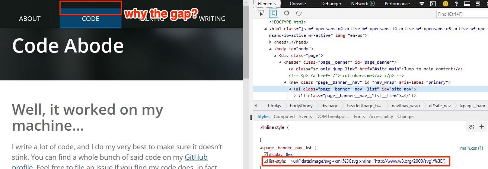

[Джерард К. Коэн](https://twitter.com/gerardkcohen) в сентябре 2017 опубликовал на Unfettered Thoughts [статью о том](https://unfetteredthoughts.net/2017/09/26/voiceover-and-list-style-type-none/), как пропадает семантика у списков в VoiceOver и Safari (Webkit; macOS и iOS), когда используется свойство `list-style: none`. И это происходит не только из-за `list-style: none`, но и при использования любых CSS-свойств, которые убирают маркеры или нумерацию у элементов списка.

Это не единственный случай, когда изменения в CSS влияют на то, как элементы обрабатываются вспомогательными технологиями вроде скринридеров. Изменяя значения свойств `display` и `visibility` на `none` или `hidden` соответственно, мы не только визуально скроем такой контент, но и сделаем его недоступным для скринридеров. Однако эта проблема с изменением стиля списка уникальна только для Safari. В других браузерах и для других вспомогательных технологий эти свойства будут всегда скрывать и показывать контент.

Почему Webkit — это единственный браузерный движок, который ведёт себя таким образом?

## Когда «баг — это фича» на самом деле баг?

В марте 2017 [был обнаружен баг](https://bugs.webkit.org/show_bug.cgi?id=170179), связанный с влиянием `list-style: none` на семантику списка. В итоге был дан такой ответ:

> Это было осознанное решение из-за повсеместного использования списков веб-разработчиками. […] По сути, если вы удаляете все видимые по умолчанию признаки списка, то у зрячего пользователя или пользователя скринридера не будет никаких оснований считать, что контент им является. Если вы хотите изменить эту эвристику для доступности, то нужно всегда задавать явную ARIA-роль `role="list"`.

Я могу это понять. Семантика сложная, и люди часто неправильно используют HTML. Тем не менее, эта проблема может возникнуть при использовании распространённого метода, когда нужно удалить стиль списка по умолчанию, но сохранить при этом его семантику. Особенно если список оформляется так, что он всё ещё похож на список.

Кроме того, идея о том, что стоит рассчитывать на повторную установку семантики для списка при использовании ARIA, противоречит [первому правилу использования ARIA](https://www.w3.org/TR/using-aria/#rule1). Оно гласит:
> Если вы можете использовать стандартные HTML-элементы или атрибуты с уже **встроенной в них** необходимой семантикой и поведением, **сделайте это** вместо того, чтобы повторно использовать элемент и добавлять роль ARIA, состояние или значение, чтобы сделать его доступным.

Другая [цитата оттуда же](https://www.w3.org/TR/using-aria/#aria-does-nothing):

> Ни один элемент в HTML4 не нуждается в добавлении ролей ARIA для того, чтобы раскрыть их семантику, уже встроенную по умолчанию. […] В большинстве случаев ARIA-роль и ARIA-атрибуты, семантика которых соответствует семантике стандартных элементов, не нужны. Их не рекомендуются использовать, так как эти свойства уже установлены браузером.

В процессе обучения разработчиков, плохо знакомых с доступностью, это вечная проблема. Им часто говорят, что «не нужно использовать ARIA, если вы используете правильные HTML-элементы». После чего со вздохом объясняют:

> Вам нужно использовать ARIA для того, чтобы вернуть семантику списку в случае именно этого сочетания браузера и скринридера.
> Нет, вам не нужно это делать для других браузеров и скринридеров.
> Нет, этого не происходит с Chrome (Blink) и VoiceOver.
> Нет, вам нужно просто игнорировать предупреждения валидаторов «не дублируйте при помощи ролей ARIA роли стандартных элементов».
> Нет, это не нужно для Internet Explorer…

## Когда вы даёте разработчику ARIA-роль

Немного отойду от темы, но считаю важным акцентировать внимание на этом. Когда вы советуете использовать ARIA, то это застревает в голове. Люди, которые плохо разбираются в тонкостях ARIA, «усвоят», что это «делает контент более доступным» и будут это использовать даже [тогда, когда в этом нет необходимости](https://css-tricks.com/aria-spackle-not-rebar/).

Я ранее отмечал в [«ARIA Lists»](https://www.scottohara.me/blog/2018/05/26/aria-lists.html), что не нужно проходить через огонь, воду и медные трубы, чтобы создать неупорядоченный или упорядоченный список с помощью ARIA и CSS-счётчиков. Марси Саттон в 2016 написала статью [«Links vs Buttons»](https://marcysutton.com/links-vs-buttons-in-modern-web-applications/), которая, вероятно, не потеряет свою актуальность в ближайшие годы. Люди, чтобы избежать странного поведения элементов, которое они не понимают, будут делать лишнюю работу, чтобы создать элементы с помощью ARIA. Пожалуйста, давайте не увязать в этом.

Другая интересная деталь, связанная с ARIA: если вы посмотрите на мою статью про использование ARIA для списков в режиме чтения в Firefox, то мой пример списка с ARIA исчезнет.

Почему? Это же просто список, разве нет? Хм-м-м…

Я обнаружил разное поведение и у другой разметки с ARIA в некоторых [режимах для чтения браузера](https://medium.com/@mandy.michael/building-websites-for-safari-reader-mode-and-other-reading-apps-1562913c86c9). Иногда такая разметка пропадает, иногда всё работает нормально, но этих странностей не бывает, когда используешь стандартные HTML-элементы без ARIA. Это то, о чём нужно думать при тестировании своего контента.

Ладно, давайте вернёмся к разговору о Webkit и VoiceOver…

## Исправление ради исправления

К счастью, ARIA не единственный способ вернуть списку его семантику. В статье на Unfettered Thoughts рассмотрен случай добавления пробела нулевой ширины через псевдоэлемент `::before` для элементов списка. Это восстанавливает семантику списка.

Пример CSS-кода:

    .list li {
        list-style-type: none; /* убираем маркеры списка */
    }

    .list li::before {
        content: "\200B"; /* добавляем пробел нулевой ширины */
        position: absolute; /* и ещё кое-что */
    }

Используя этот код на практике, я обнаружил, что добавление `position: absolute` для псевдоэлемента может быть полезным. В проектах, над которыми я работал, бывало, что пробел с нулевой шириной не вёл себя так, как нужно. Из-за хака появлялись странные отступы или ненужные разрывы строк. Эти визуальные странности были в значительной степени связаны с другими стилями, которые наследовались `::before` от других нужных классов. С помощью `position: absolute` мы удаляем псевдоэлемент из потока элементов, что уменьшает вероятность возникновения такой проблемы.

Ещё нужно быть осторожным, если псевдоэлемент `::before` уже использован для других целей, и добавление неразрывного пробела может навредить другим стилям. Изменение стилей и разметки могли бы помочь это исправить, но усилия должны быть сопоставимы с необходимостью поддержки Safari.

[Адриан Роселл заметил](https://twitter.com/aardrian/status/1083889915417559040), что отсутствие семантики у списка _«может не иметь большого значения, если тестирование пользователей не показывает, что список вам действительно необходим»_. Хотя такое поведение может быть в некоторых ситуациях нежелательным, давайте не будем прилагать слишком много усилий для исправления того, что уже слишком активно пытались исправить, используя ненужную семантику. Проводите тестирование с реальными людьми!

## Новая альтернатива

[Джонатан Нил](https://twitter.com/jon_neal/status/1083829750072836096) предложил на Unfettered Thoughts альтернативное решение на CSS. В документации к [PostCSS List Style Safari Fix](https://github.com/jonathantneal/postcss-list-style-safari-fix) Джонатана сказано, что он обнаружил, что использование следующего CSS устранит необходимость в псевдоэлементе и снова вернёт семантику списку в Safari и VoiceOver:

    /* Сокращённая версия селекторов Джонатана */
    ol,
    ul {
      list-style: none;
    }

    ol,
    ul {
      list-style: url("data:image/svg+xml,%3Csvg xmlns='http://www.w3.org/2000/svg'/%3E");
    }

Я обнаружил, что `url(#!)` тоже будет возвращать необходимую семантику, но нужно будет дополнительно всё протестировать и убедиться, что это не приводит ни к каким негативным последствиям в других браузерах.

Это выглядит многообещающе. При тестировании список был корректно объявлен VoiceOver на Webkit, не помешал другим скринридерам (тестировался на NVDA 2018.4 и на последнем JAWS 2019) и небольшие тестовые примеры корректно отображаются в большинстве современных браузеров.

Я обнаружил единственную проблему у этой техники, когда попытался использовать её для своей навигации по сайту (в данный момент не использую ни один из хаков; пусть браузерные эвристики делают с моей навигацией то, что делают).

После добавления `list-style: url(…)` для существующего селектора списка навигации, в верхней части каждого пункта в Internet Explorer 11 и Edge 42 появился отступ:

При отключении `list-style` отступ исчезает и навигация отображается так, как нужно.

Я предполагаю, что в моём CSS есть что-то другое, что приводит к появлению этих отступов. При [использовании этой техники](https://codepen.io/scottohara/pen/JweKEp) в более простых, но похожих наборах правил, он не появляется.

## Подводя итоги

Я слегка в замешательстве. Решение об отмене семантики у списка, если он больше не выглядит как список, имеет для меня смысл. Обычно я думаю, что внешний вид элементов должен отражать их содержание. Но такое поверхностное решение категорично. Оно также не учитывается тот факт, что существуют другие способы оформления списков, кроме использования маркеров по умолчанию. Следовательно, хотя я понимаю смысл этого решения, не думаю, что поведение Safari правильное в этой ситуации.

Такое решение движется в другом направлении и нарушает форму того, как представляют другие браузеры стилизованные списки, а скринридеры их интерпретируют. Обычно разработчики не ожидают, что CSS влияет на семантику HTML. Это был своего рода способ устранения таких элементов, как: `
`, `<big>`, `` и т. д. HTML предназначен для семантики, а CSS — для стиля.

Но, как я писал в своей статье [«Unbuttoning Buttons»](https://www.scottohara.me/blog/2018/10/03/unbutton-buttons.html), а также Адриан Розелли в [«Display: Contents Is Not a CSS Reset»](http://adrianroselli.com/2018/05/display-contents-is-not-a-css-reset.html) и [«Tables, CSS Display Properties, and ARIA»](http://adrianroselli.com/2018/02/tables-css-display-properties-and-aria.html), CSS может оказать негативный эффект на семантику, и разработчики могут не поступить мудрее.

Просто посмотрите на количество ответов, ретвитов и лайков к твиту Сары Суайдан:

> `#TIL` that removing list bullets with `list-style: none` removes `<ul/ol>` semantics in VoiceOver. Adding zero-width space fixes this; so this is yet another thing to add to our base `#CSS` files.
> [Sara Soueidan @SaraSoueidan](https://twitter.com/SaraSoueidan/status/1083734801952182272)

> Сегодня я узнала, что, если убрать маркеры списка с помощью `list-style: none`, то это отменит семантику `<ul/ol>` в VoiceOver.
> Добавление пробела нулевой ширины исправит это; так что это ещё одна вещь, которую надо добавить в наш базовый файл.
> [https://unfetteredthoughts.net/2017/09/26/voiceover-and-list-style-type-none/](https://unfetteredthoughts.net/2017/09/26/voiceover-and-list-style-type-none/)

Было много фронтенд-разработчиков и тех, кто специализируется на доступности, но не знает об этой особенности в Safari.

Эрик Эггерт воскликнул:

> We really need an open conversation on what CSS is allowed to overwrite semantics. Apart from display:none/visibility:hidden, I personally think no CSS should alter the semantics of the page.
> [Eric Eggert @yatil](https://twitter.com/yatil/status/1083738608593448963)

> Нам действительно необходимо открытое обсуждение того, что CSS позволяет переопределять семантику. Лично я считаю, что CSS не должен изменять семантику страницы, кроме `display: none` или `visibility: hidden`.

А так отвечает Джеймс Крейг:

> I realize this decision upsets some web authors, but remember the first rule of the Web: Consider the needs of:
> - Users before,
> - Web Authors/Devs before,
> - Browser Implementers before,
> - Spec authors.
> [James Craig @cookiecrook](https://twitter.com/cookiecrook/status/1084141791580905472)

> This decision was all about the users’ experience on the majority of pages where web developers are not paying attention to the screen reader experience. Definitely open to change suggestions (including updating the heuristic) that make it better for authors w/o penalizing users.
> [James Craig @cookiecrook](https://twitter.com/cookiecrook/status/1084142936583892992)

> Я понимаю, что это решение расстраивает некоторых авторов, но помните про первое правило интернета. Учитывайте потребности:
> - пользователей
> - до авторов и разработчиков,
> - до авторов и разработчиков,
> - до разработчиков браузеров,
> - до авторов спецификаций.
> Это всё нужно для удобства пользователей, ведь сегодня на большинстве сайтов разработчики не уделяют внимание удобству скринридеров. Разумеется, я открыт для предложений по внесению изменений (включая обновление эвристики), которые сделают жизнь авторов лучше без ухудшения положения пользователей.

Так что замечания и комментарии приветствуются :)
