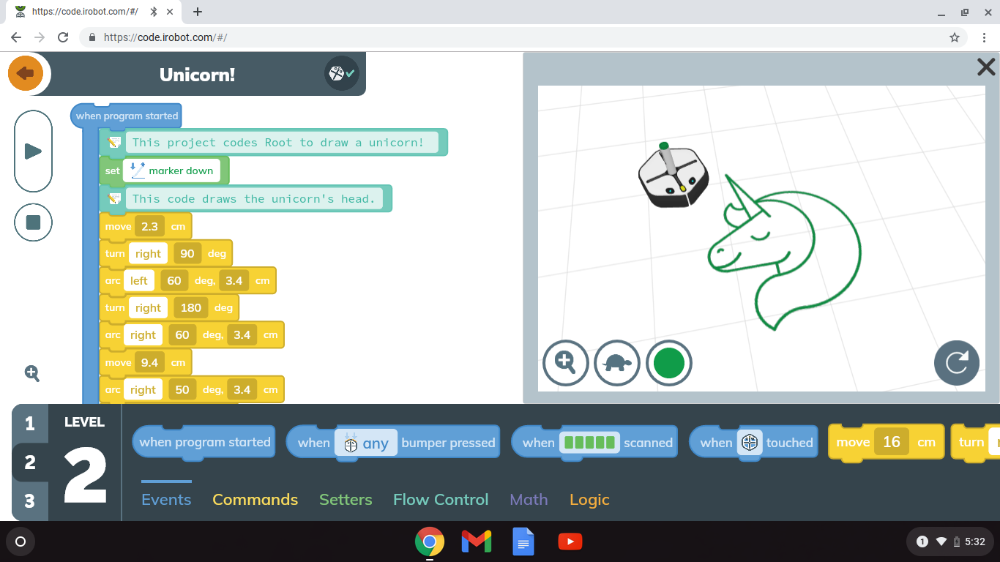
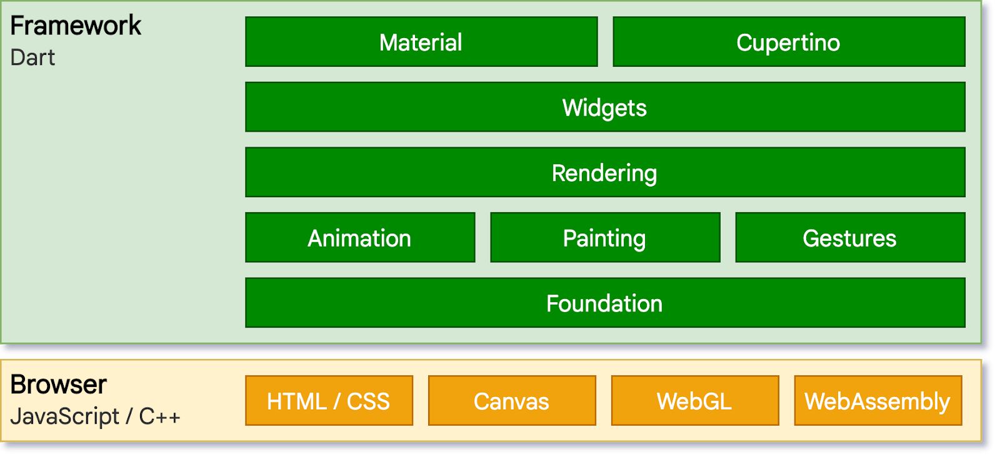
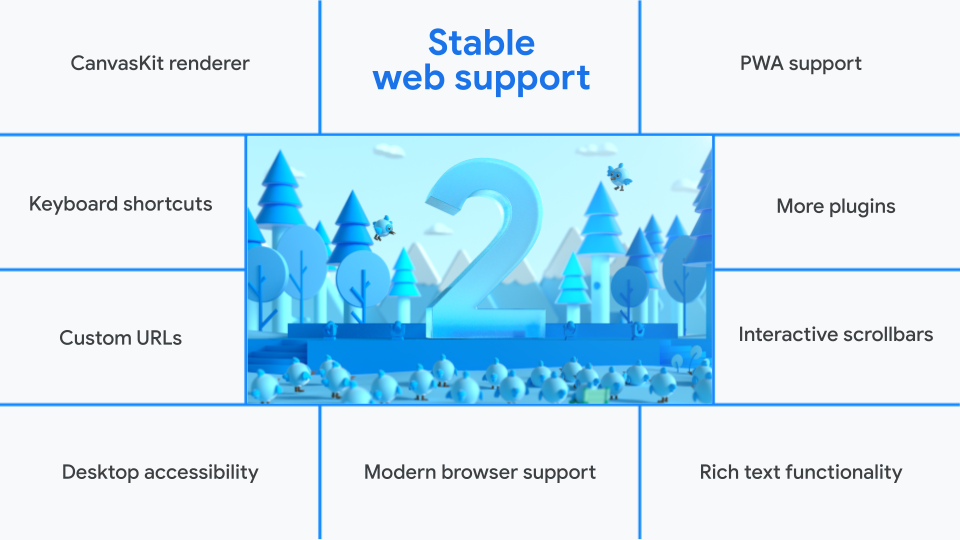
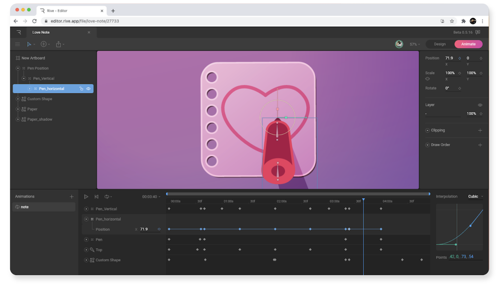
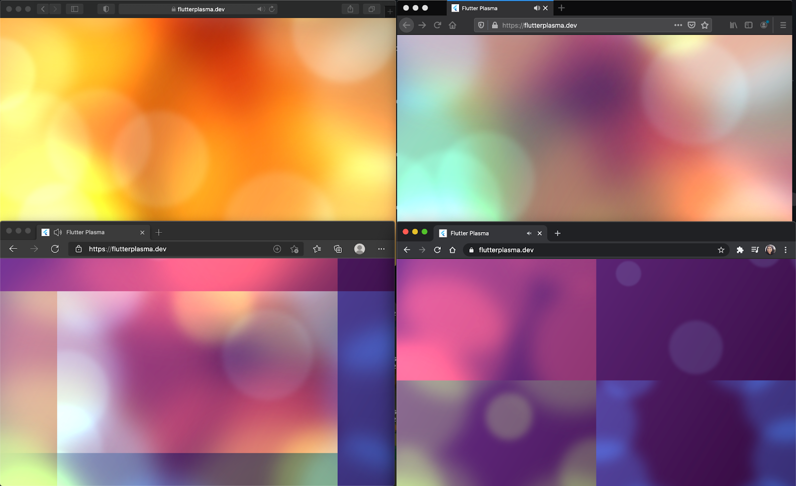
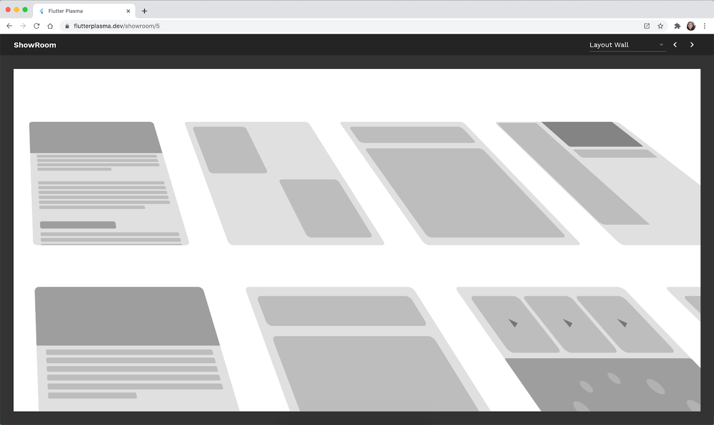
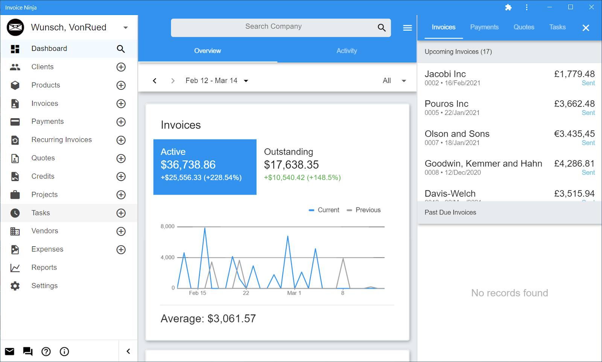
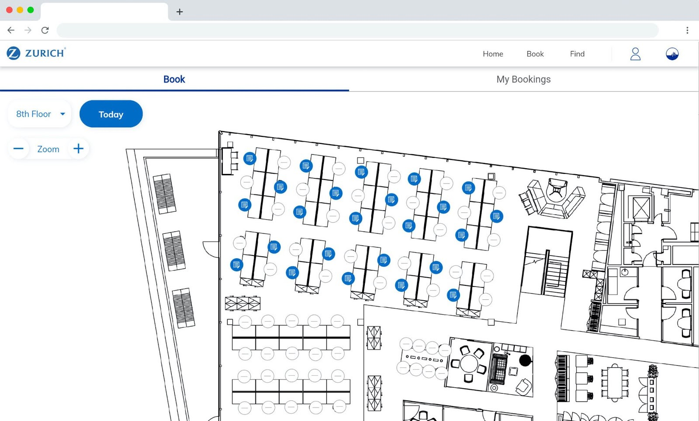
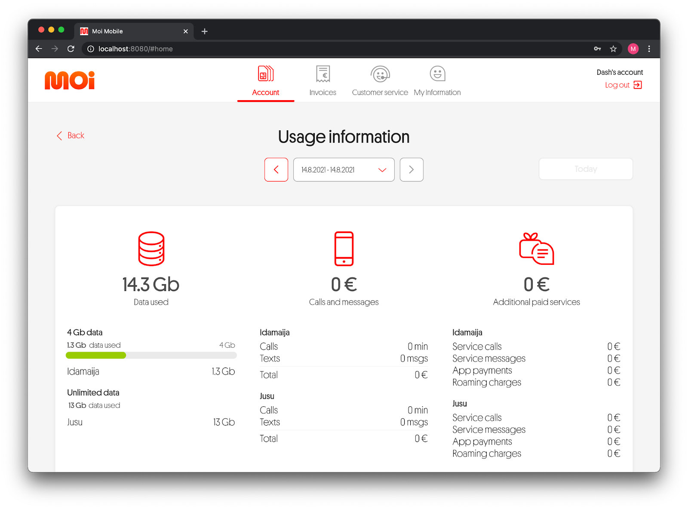
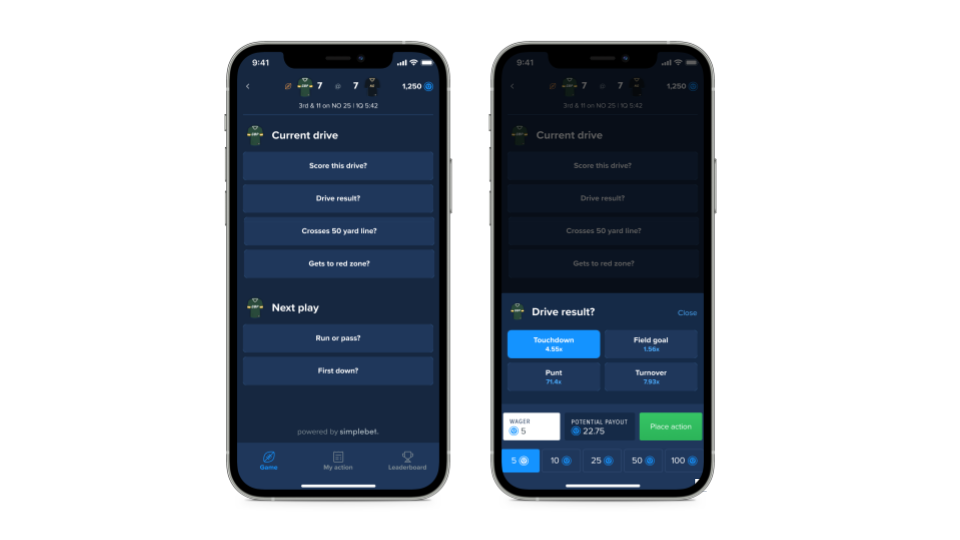

Мы позиционируем Flutter как UI-фреймворк для сборки красивых приложений на любой платформе. Сегодня мы анонсируем поддержку сборки веб-приложений во [Flutter 2](https://medium.com/flutter/whats-new-in-flutter-2-0-fe8e95ecc65).

Первая версия Flutter поддерживала только мобильные платформы (iOS и Android). И это позволило разработчикам загрузить в магазины App Store и Google Play больше 150 000 приложений. Появление сборки для веба означает не только то, что уже написанные приложения могут быть доступны более широкой аудитории, это означает появление новых способов взаимодействия с пользователем в вебе.

В этом релизе мы сфокусируемся на трех сценариях использования:

- **Прогрессивные веб-приложения (PWA) —** которые можно запустить в браузере и на десктопе как обычные приложения.
- **Одностраничные приложения (SPA) —** веб-приложения для браузера, которые грузятся один раз, а затем передают и получают в основном только данные.
- **Веб-версии существующих мобильных приложений на Flutter —** с единой кодовой базой для всех платформ.

Эта статья описывает то, что мы успели сделать на настоящий момент. Мы показываем на примерах, какие преимущества вы можете получить, используя поддержку веб-платформы в приложениях Flutter.

<figure>
    
    <figcaption>
        iRobot Education разработало приложение iRobot Coding, которое использует Flutter, доступно в вебе, чтобы каждый мог поучиться программировать
    </figcaption>
</figure>

## Наше путешествие в веб

Сегодня веб-платформа богата как никогда: [поддержка графических ускорителей для 2D- и 3D-графики](https://developer.mozilla.org/en-US/docs/Web/API/WebGL_API), [поддержка работы приложений в офлайне](https://web.dev/progressive-web-apps/) и [доступ к API операционной системы и железу устройства](https://web.dev/fugu-status/), на котором она установлена. Веб-приложения сегодня могут быть написаны на фреймворках вроде [React](https://reactjs.org/), [Angular](https://angular.io/), [Vue](https://vuejs.org/), [Flask](https://flask.palletsprojects.com/), которые используют эту платформу, чтобы дать разработчикам гибкость в создании веб-приложений.

Поскольку Flutter написан на языке [Dart](https://dart.dev/), который из коробки поддерживает трансляцию в JavaScript, следующий шаг — использование Flutter для веба — был совершенно естественным.

Наш подход заключается в создании набора инструментов, которые одинаково хорошо работали бы для всех платформ. Это позволяет разработчику быть уверенным, что его код запустится везде и без сюрпризов. Хотя можно было бы иметь и два фреймворка для сборки мобильных приложений и для сборки веб-приложений, незначительно отличающихся в поведении.

На уровне архитектуры, Flutter базируется на:

- **фреймворке, написанном на Dart**, который использует общие абстракции, такие как виджеты, анимации и жесты;
- **движке, написанном на C++**, который рендерит код для целевого устройства, используя системные API.

Сам Flutter написан на Dart, и около 700 000 строк кода используются для мобильной платформы, десктопа и веба. Код любого Flutter-приложения также написан на Dart: мы используем компилятор Dart для разработки мобильных приложений ([dartdevc](https://dart.dev/tools/dartdevc)) и транслятор Dart ([dart2js](https://dart.dev/tools/dart2js)) для перевода вашего кода в JavaScript, который, в свою очередь, может быть уже перенесен на сервер.

Благодаря поддежке трансляции программ на языке Dart в программы на JavaScript, наша работа сводилась лишь к замене низкоуровневого движка для рендеринга, написанного на C++, который ранее использовался только при рендеринге кода для мобильных приложений, на новый движок с поддержкой API веб-платформы. Теперь движок Flutter для веба предлагает использовать два варианта: рендеринг в оптимизированный HTML и рендеринг с помощью CanvasKit, который использует WebAssembly и WebGL для перевода команд движка Skia в команды рисования на канвасе в браузере. Flutter не умеет напрямую транспилировать виджеты в эквивалент на HTML.

Наша цель — предложить новый путь для веб-платформы, который улучшил бы пользовательский опыт.

## Путь к релизу в стабильной ветке

[Релиз с поддержкой веба в бета-ветке](https://medium.com/flutter/web-support-for-flutter-goes-beta-35b64a1217c0) появился более года назад и мы получили много информации о том, как его используют разработчики. Мы работали с несколькими из них и сегодня их веб-приложения уже в продакшене.

С тех пор мы сделали большую часть задуманных усовершенствований в архитектуре фреймворка и добавили новые возможности, которые расширяют и оптимизируют поддержку веб-платформы. Мы сфокусировались на четырех областях: **производительность**, **возможности, специфические для веба**, **поддержка десктопных экранов** и **плагины**.

### Производительность

Большая часть работы с самых первых релизов была посвящена производительности. В процессе мы лучше разобрались в характеристиках производительности и корректности применения различных технологий, доступных в вебе.

Первоначально мы стартовали с HTML и DOM-модели. В ней веб-движок Flutter переводил сгенерированную сцену в HTML, CSS или Canvas и рендерил каждый кадр на страницу как дерево HTML-элементов. Даже несмотря на очень хорошую браузерную поддержку и малые размеры, которые обеспечивал нам движок для рендеринга HTML, производительность для перерисовки была меньше, чем нужно для приложения с быстро менящейся графикой, наподобие [Rive](https://rive.app/) — инструмента для совместного создания анимаций, написанный на Flutter.

<figure>
    
    <figcaption>
        Rive, инструмент для создания пользовательских анимаций, перестроил свое приложение с помощью Flutter в Интернете, и теперь оно доступно в бета-версии.
    </figcaption>
</figure>

Чтобы эффективно справиться с точностью, которая необходима для отрисовки сложной графики, мы начали экспериментировать с [CanvasKit](https://skia.org/user/modules/canvaskit), который позволял рисовать в браузере с помощью команд Skia, используя [WebAssembly](https://webassembly.org/) и [WebGL](https://www.khronos.org/webgl/). Мы обнаружили, что CanvasKit может дать большую производительность, качество и точность отрисовки, используя графические ускорители. Вы можете посмотреть демо [Феликса Блашке](https://github.com/felixblaschke), талантливого участника Flutter-сообщества.

<figure>
    
    <figcaption>
        Демо-версия <a href="https://flutterplasma.dev/">Flutter Plasma</a>, созданная Феликсом Блашке и работающая в Safari, Firefox, Edge и Chrome.
    </figcaption>
</figure>

Flutter поддерживает два режима рендеринга, каждый из которых обладает преимуществами или недостатками, в зависимости от сценария использования:

- **Режим HTML —** использует комбинацию HTML-элементов, CSS, элементов на канвасе и SVG-элементов. Этот режим обеспечивает наименьший размер приложения.
- **Режим CanvasKit —** — полностью поддерживает возможности Flutter, доступные на мобильных платформах или десктопе, но добавляет 2 Мб к размеру веб-приложения.

Для оптимизации характеристик вашего веб-приложения на Flutter для всех устройств, режим рендеринга выбирается автоматически. Приложение по умолчанию запускается с помощью движка HTML в мобильных браузерах и с помощью CanvasKit в браузерах на десктопе. Вы можете использовать ключ `--web-renderer html` или `--web-renderer canvaskit` для прямого выбора режима рендеринга.

### Возможности, специфические для веба

Приложение на Flutter в браузере должно быть настолько же удобным, что и обычное веб-приложение. Поэтому мы добавили во Flutter лучшее из мира веба.

Веб-платформа имеет много сильных сторон, одна из них — большое количество пользователей. Одна из многих причин обеспечить поддержку веб-версии существующего Flutter-приложения — охватить пользователей за пределами магазинов мобильных приложений. Мы добавили поддержку роутинга с помощью ([URL-стратегий](https://flutter.dev/docs/development/ui/navigation/url-strategies)), чтобы ваши пользователи могли получить доступ к вашему приложению, просто кликнув по ссылке.

<figure>
    
    <figcaption>
        <a href="https://flutterplasma.dev/">Демо-страница приложения Flutter Plasma</a> — это пример плагина <a href="https://pub.dev/packages/url_strategy">url_strategy</a>, основанного на кастомных URL-стратегиях Flutter.
    </figcaption>
</figure>

Гиперссылки являются критически важным механизмом навигации в вебе. Новый [виджет `link`](https://pub.dev/documentation/url_launcher/latest/link/Link-class.html) в пакете `url_launcher` позволяет использовать возможности навигации по якорям внутри вашего приложения и переходы на внешние сайты. Вы можете использовать `link` в нужных вам виджетах, включая кнопки, встроенный текст, картинки, чтобы открывать ссылки в той же вкладке браузера или в новой.

Ещё одной неотъемлемой частью приложения является рендеринг текста. Разработка системы верстки текста была одной из самых больших проблем для поддержки Flutter в вебе. Поскольку в вебе отсутствует специальное API для обработки элементов с текстом, Flutter должен измерять размеры абзаца (класс [`paragraph`](https://api.flutter.dev/flutter/dart-ui/Paragraph-class.html)), обращаясь к методу [`layout()`](https://api.flutter.dev/flutter/dart-ui/Paragraph/layout.html). Эти измерения могут серьезно повлиять на производительность, поэтому в новый [механизм измерения размеров текста на канвасе](https://github.com/flutter/flutter/issues/33523) добавлена поддержка двух вариантов текста: простого и форматированного. Сейчас Flutter позволяет измерять размеры в вебе эффективно чтобы, например, рисовать выделение маркером в тексте.

Взаимодействие с текстом так же важно, как быстрый и точный рендеринг. Текст можно выделить, скопировать и вставить с помощью виджетов `SelectableText` и `EditableText`. Кроме того, текстовые поля формы поддерживают автозаполнение с помощью класса [`AutofillGroup`](https://api.flutter.dev/flutter/widgets/AutofillGroup-class.html), который обращается к браузеру за пользовательскими данными, доступными для автозаполнения.

Flutter 2 частично поддерживает использование прогрессивных веб-приложений (PWA). PWA — это простой и безопасный способ преодолеть разрыв между мобильными приложениями и веб-приложениями силами [проекта Fugu](https://web.dev/fugu-status/) команды Chrome.

<figure>
    
    <figcaption>
        <a href="https://www.invoiceninja.com/">Invoice Ninja</a>, приложение для управления счетами, запустило PWA-версию, используя кодовую базу существующего мобильного приложения на Flutter.
    </figcaption>
</figure>

Когда вы создаете веб-приложение на Flutter, в сборку включается файл веб-манифеста для настройки PWA и код для настройки сервис-воркера. [Манифест](https://developer.mozilla.org/en-US/docs/Web/Manifest) содержит метаданные о том, как приложение должно запускаться, включая информацию об иконках и названии приложения. [Сервис-воркеры](https://developers.google.com/web/ilt/pwa/introduction-to-service-worker) позволяют кэшировать ресурсы и запускать приложение офлайн. Когда Flutter-приложение будет запущено в браузере как PWA, пользователю будет доступна его установка на устройства, наряду с обычными приложениями на мобильном или десктопе.

### Поддержка экранов десктопов

Мы хотим, чтобы веб-приложение на Flutter работало правильно, несмотря на форму и размер окна браузера. В мобильных браузерах Flutter-приложения уже имеют великолепную поддержку жестов и скроллов, независимо от того, поддерживается ли это в мобильном приложении. Браузеры на десктопе предлагают другие способы взаимодействия пользователя с элементами интерфейса, и Flutter должен поддерживать их на уровне фреймворка.

Например, пользователь, при просмотре контента на десктопе ожидает отображение полос прокрутки, которыми можно управлять с помощью мышки и клавиатуры. Поэтому новые [интерактивные полосы прокрутки](http://flutter.dev/go/update-scrollbars) поддерживают темизацию [`ScrollbarTheme`](https://api.flutter.dev/flutter/material/ScrollbarTheme-class.html) и возможность прокручивать перетаскиванием ползунка. Класс контроллера [`PrimaryScrollController`](https://api.flutter.dev/flutter/widgets/PrimaryScrollController-class.html) теперь поддерживает [использование сочетания клавиш для навигации](http://flutter.dev/go/default-scroll-action) сразу из коробки.

<figure>
    
    <figcaption>
        Решение по управлению недвижимостью для <a href="https://www.zurich.com/">Zurich Insurance</a>, созданное компанией <a href="https://spicatech.co.uk/">Spica Technologies</a>, является отличным примером веб-поддержки бизнес-приложений Flutter, которую можно включить в десктопных браузерах.
    </figcaption>
</figure>

Мы также увеличили [плотность пикселей для отображаемого контента по умолчанию](https://github.com/flutter/flutter/issues/43350), поскольку для указателя мыши она необходима, в отличие от тач-устройств. И мы добавили в фреймворк большой набор [системных курсоров](https://github.com/flutter/flutter/issues/60641) для поддержки всех платформ.

Наконец, чтобы поддерживать _всех_ пользователей, мы расширили используемую семантику для поддержки доступности на Windows, macOS и ChromeOS. В вебе дополнительное DOM-дерево, которое называется [`SemanticsNode`](https://api.flutter.dev/flutter/semantics/SemanticsNode-class.html) генерируется параллельно с DOM-деревом для объекта рендеринга [`RenderObject`](https://api.flutter.dev/flutter/rendering/RenderObject-class.html). Дерево `SemanticsNode` переводит флаги, действия, подписи и другие семантические свойства в [ARIA-атрибуты](https://developer.mozilla.org/en-US/docs/Web/Accessibility/ARIA). Сейчас вы можете использовать [Narrator](https://support.microsoft.com/en-us/windows/complete-guide-to-narrator-e4397a0d-ef4f-b386-d8ae-c172f109bdb1), [VoiceOver](https://www.apple.com/accessibility/vision/), [TalkBack](https://support.google.com/accessibility/android/answer/6007100) или [ChromeVox](https://support.google.com/chromebook/answer/7031755) для навигации веб-приложений на Flutter.

### Экосистема плагинов

И последнее, поддержка веб-платформы была добавлена для наиболее используемых плагинов, что обеспечило возможность поддержки веба для существующих приложений на Flutter. [Плагины Flutter](https://pub.dev/) позволяют вашему коду взаимодействовать в нативными библиотеками для платформ, на которых запускается приложение. Когда вы запускаете Flutter-приложение в вебе, вы получаете доступ к библиотекам на JavaScript через плагины.

С начала бета-тестирования мы с помощью сообщества обеспечили поддержку веб-платформы в следующих плагинах:

- [image_picker](https://pub.dev/packages/image_picker_for_web);
- [google_maps](https://pub.dev/packages/google_maps);
- [firebase_analytics](https://pub.dev/packages/firebase_analytics);
- [firebase_storage](https://pub.dev/packages/firebase_storage);
- [connectivity](https://pub.dev/packages/experimental_connectivity_web);
- [cloud_firestore](https://pub.dev/packages/cloud_firestore);
- [cloud_functions](https://pub.dev/packages/cloud_functions);
- [cross_file](https://pub.dev/packages/cross_file).

## Что дальше

Несколько лет назад использовать Flutter в вебе было невозможно на приемлемом уровне качества и производительности. Однако внедрение новых веб-технологий и постоянное развитие платформы позволило нам использовать намного больше низкоуровневых возможностей устройства. С поддержкой веб-платформы, Flutter обеспечивает необходимое удобство на большинстве устройств.

Многое в этом релизе стало возможным, благодаря предложениям и замечаниям со стороны пользователей фреймворка для веба на этапе бета-тестирования. И поэтому мы благодарим вас! Продвигаясь вперед, мы видим нашу главную цель в том, чтобы как можно быстрее разрешать все проблемы, что позволит нам оставаться сфокусированными на возможностях реализации высококачественных приложений на Flutter для _всех_ целевых платформ.

<figure>
    
    <figcaption>
        <a href="https://www.moi.fi/">Moi Mobiili</a>, современный оператор мобильной виртуальной сети, недавно запустил свое веб-приложение с помощью Flutter.
    </figcaption>
</figure>

Вероятно, производительность будет всегда областью, в которую мы будем вкладываться. Наша цель — уменьшить размер кода и увеличить скорость отображения кадров (fps). Сегодня каждое веб-приложение на Flutter скачивает необходимый код движка для рендеринга. Мы ищем возможности закэшировать часть кода, чтобы увеличить скорость загрузки и уменьшить размер скачиваемого бандла. Недавно мы сделали демо-приложение Flutter Gallery, в котором уменьшили размер, используя отложенную загрузку библиотек, и планируем скоро рассказать о том, чему мы научились.

В течение следующих нескольких месяцев мы продолжим улучшать то, что было сделано:

- CanvasKit уже в стабильной ветке, но проблемы еще остались. Например, пока нет [фолбэков для спецсимволов](https://github.com/flutter/flutter/issues/74741) или поддержки [CORS](https://developer.mozilla.org/en-US/docs/Web/HTTP/CORS) картинок.
- PWA пока [кэширует все ресурсы](https://github.com/flutter/flutter/issues/75861), поэтому полноценная поддержка работы приложения без сети требует использования [некоторых ручных манипуляций с CanvasKit](https://github.com/flutter/flutter/issues/70101).
- Рендеринг текста и поддержка различных функций, например, полноценной стилизации, остается очень сложной задачей, над которой мы продолжаем работать.
- Экосистема плагинов — это то, над чем мы также продолжаем работать, чтобы пакеты, опубликованные Google, имели лучший паритет между мобильными устройствами и вебом.

<figure>
    
    <figcaption>
        <a href="https://simplebet.io/">Simplebet</a> использовала веб-поддержку Flutter для создания высокоинтерактивных встраиваемых ставок на НФЛ и НБА в рамках существующего набора мобильных приложений Fanduel.
    </figcaption>
</figure>

## Начните использовать Flutter для веба

С переносимостью Dart, мощью веб-платформы и гибкостью фреймворка Flutter теперь вы можете собрать приложения под iOS, Android и браузер с той же кодовой базой.

Для тех из вас, кто уже имеет готовое веб-приложение на Flutter, можно собрать его, используя [стабильную ветку](https://github.com/flutter/flutter/wiki/Flutter-build-release-channels#stable). Если вы только начинаете, почитайте [flutter.dev/web](http://flutter.dev/web), посмотрите наш [пример](https://flutter.dev/docs/get-started/codelab-web) и [сессию на Flutter Engage](https://youtu.be/HAstl_NkXl0), посвященную веб-платформе.

С нетерпением ждем ваших успехов в применении Flutter для веба!
