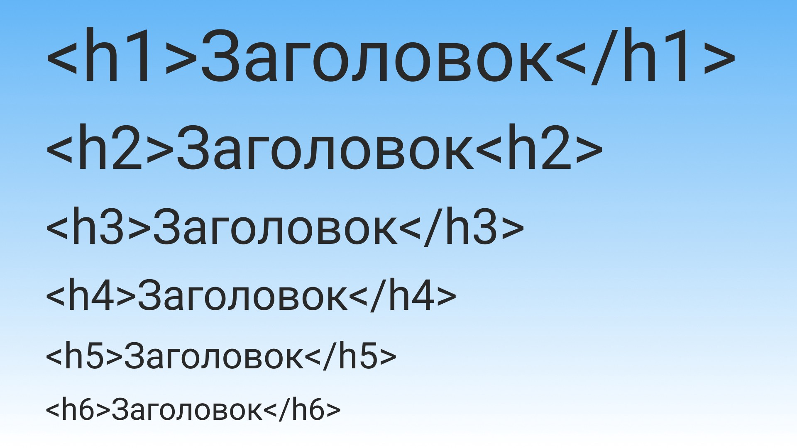
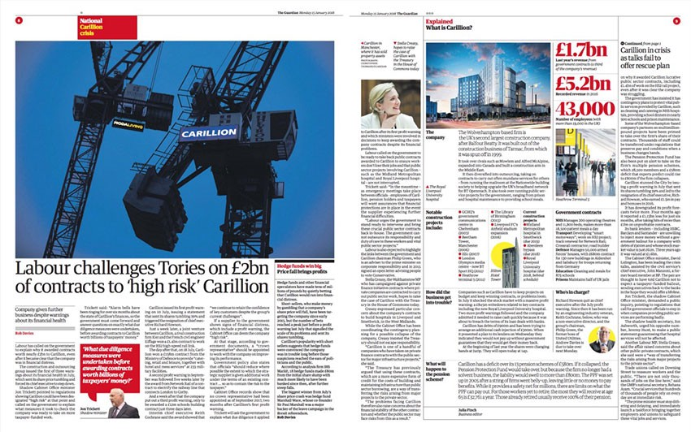
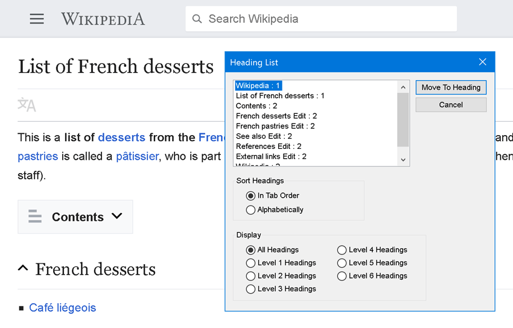
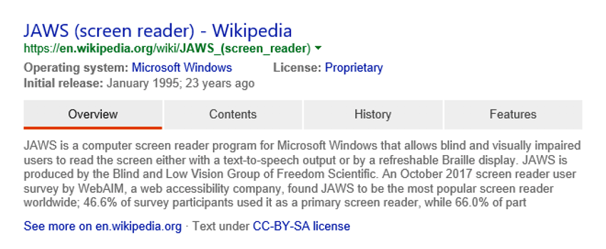

[Спецификация HTML](https://www.w3.org/TR/html52/sections.html#the-h1-h2-h3-h4-h5-and-h6-elements) описывает шесть видов заголовков: `<h1>`, `<h2>`, `<h3>`, `<h4>`, `<h5>` и `<h6>`. Число в названии элемента отражает его приоритет. При этом `<h1>` самый общий, а `<h6>` наиболее специфичный.

Это важно знать! WebAIM провела в 2017 году [опрос пользователей скринридеров](https://webaim.org/projects/screenreadersurvey7/#finding), и он показал, что навигация по заголовкам — это самый важный способ навигации для людей, которые пользуются вспомогательными технологиями для поиска информации. Именно поэтому так важно правильно организовать заголовки на вашем сайте.

## Познание

Прежде чем мы подробно рассмотрим как работают вспомогательные технологии, надо понять причины, по которым СМИ используют главы, разделы, подразделы и параграфы. Дробление контента на отдельные части облегчает его понимание, усвоение, запоминание и работу со ссылками.

<figure>
    
    <figcaption>
        <a href="https://medium.com/@nkuepper/the-guardian-with-a-new-design-in-print-web-and-app-30fab6c97529">
            Части контента в газете The Guardian
        </a>
    </figcaption>
</figure>

Несмотря на то, что интернет не печатное издание, он заимствует у типографики все хорошие практики. Заголовки в HTML аналогичны соглашениям в типографике. Это одна из тех вещей, которую каждый считает чем-то очевидным, но она на самом деле помогают огромному количеству людей. [Когнитивные нарушения](https://webaim.org/articles/cognitive/) широко распространены и перевешивают другие виды нарушений. Группировка контента на логические части помогает всем: от людей с патологическим состоянием организма, например, деменцией, до людей с временными ограничениями, такими как бессонница или осваивающими новые навыки.

## Навигация с помощью заголовков

Некоторые виды [вспомогательных технологий](https://webaim.org/articles/motor/assistive) (не только скринридеры) позволяют людям перескакивать от одного заголовка к другому. Это похоже на опыт людей, которые не пользуются вспомогательными технологиями, а прокручивают страницы, чтобы понять общий смысл, и останавливаются, когда находят нужную информацию.

### Создание списков заголовков

Какие-то вспомогательные технологии могут обрабатывать заголовки и представлять их в виде упорядоченного списка. Такой список помогает быстро понять общий смысл страницы.


Сгенерированный список заголовков на странице Wikipedia

Если вы не соблюдаете логическую последовательность, скажем, переходите от заголовка первого уровня сразу к третьему и пропускаете заголовок второго уровня, это может сбить с толку и вызвать раздражение у человека, которому они необходимы для навигации. Этот пробел в логической последовательности создаст трудности для пользователей и вынудит их использовать другие способы навигации, которые отнимут больше времени и сил на то, чтобы понять общую структуру страницы (если она есть) и определить, есть ли тут нужная информация в принципе.

### Заголовки первого уровня

Ещё одна важная вещь, которую мы можем сделать, это убедиться, что на странице только _один_ заголовок первого уровня. Такой заголовок должен описывать [основную идею содержания страницы](https://webaim.org/projects/screenreadersurvey7/#heading). Например, у страницы об истории французской выпечки может быть такой заголовок первого уровня:

```html
<h1>История французской выпечки</h1>
<p>…</p>
```

### Алгоритм структуры документа (несуществующий)

К сожалению, существует заблуждение о том, что можно использовать заголовки первого уровня для каждого [элемента секционного контента](https://developer.mozilla.org/en-US/docs/Web/HTML/Element#Content_sectioning) на странице, а браузер дальше сам во всём разберётся с помощью алгоритма построения структуры документа (Document Outline Algorithm). Этот алгоритм [спекулятивная фантастика](http://adrianroselli.com/2016/08/there-is-no-document-outline-algorithm.html). В момент написания этой статьи алгоритм не поддерживается ни одним браузером. По этой причине мы должны придерживаться подхода [«Priority of Constituencies](https://www.w3.org/TR/html-design-principles/#priority-of-constituencies)», описанного в спецификации, и использовать другие заголовки.

### Другие заголовки

Заголовки от второго до шестого уровней должны последовательно размещаться за первым и описывать основные моменты содержимого страницы.

Например, вот структура этой статьи:

```
1. Важность уровней заголовков для вспомогательных технологий
    1. Познание
    2. Навигация с помощью заголовков
        1. Создание списков заголовков
        2. Заголовки первого уровня
            1. Алгоритм структуры документа (несуществующий)
        3. Другие заголовки
        4. Избыточная описательность
        5. Другие сервисы
    3. Стилизация
        1. Семантика
        2. Целесообразность
            1. Служебные стили
            2. Сброс
        3. Именование
    4. Подводя итоги: воспользуйтесь моментом
```

Посмотрев на этот список, вы быстро поняли про что статья. Неплохо, да?

Ещё нужно отметить, что заголовки, подобно иерархическим форматам вроде JSON, могут содержать внутри другие заголовки, при условии, что они логически связаны. Внутри заголовка второго уровня вы можете использовать несколько заголовков третьего уровня. Каждый из этих подзаголовков может, в свою очередь, иметь внутри подзаголовки четвёртого уровня.

Когда вы завершили тему, то можете закрыть вложенные заголовки. Это единственный случай, когда допустимо использовать «пропущенные» уровни: вы закончили описывать конкретную проблему и вернулись к более общей теме.

```html
<h1> История французской выпечки
    <h2> Важные вехи
            <h3> 16 век
                <h4> Слоёное тесто
                <h4> Облатка
            <h3> 17 век
            <h4> Выпечка из слоёного теста
            <h4> Взбитые сливки
                <h5> Шеф-повар принца Конде
            <h3> 18 век
                <h4> Макаруны
            <h3> 19 век
            <h3> 20 век
        <h2> Важные люди
            <h3> …
```

Этот пример показывает как правильно использовать заголовок пятого уровня («Шеф-повар принца Конде») перед заголовком третьего уровня («18 век»), пока родительские заголовки располагаются последовательно друг за другом. Если бы заголовок третьего уровня шёл перед заголовком пятого, то это было бы уже неправильно.

### Избыточная описательность

Если мы используем слишком много заголовков, то перегружаем пользователей вспомогательных технологий информацией. Вы можете подумать, что я противоречу себе, ведь я только что говорил о том, как важны заголовки для навигации.

Подумайте об этом так: так же как и слишком большое количество элементов навигации на странице рассеивает внимание пользователей, так и большое количество заголовков создаёт фоновый шум, который запутывает их и отвлекает от идеи, которую вы пытаетесь донести.

Нет чётких правил о количестве заголовков, которое считается избыточным. Это напрямую зависит от того, какой это контент и в каком объёме нужно раскрыть его содержание. Например, для рецепта достаточно указать название блюда, его ингредиенты и дать инструкцию по приготовлению. Для научной статьи нужна большая детализация.

### Другие сервисы

Хорошая структура заголовков нужна не только людям, которые пользуются вспомогательными технологиями. Так как заголовки имеют семантическое значение, другие сервисы могут взаимодействовать с описанием элементов, интерпретировать его и представлять в удобном виде для пользователей. Например, вот что делает поисковая система Bing со странницами с хорошей структурой:


Результат поиска в Bing

Как и скринридеры, сервисы вроде [Google Docs](https://support.google.com/docs/answer/6367684?co=GENIE.Platform%3DDesktop&hl=en) и [Dropbox Paper](https://blogs.dropbox.com/dropbox/2017/03/paper-hidden-gems/) могут автоматически создавать перечни заголовков, чтобы помочь вам быстрое понять содержание документа и перемещаться по нему. Многие текстовые редакторы тоже умеют быстро формировать из заголовков динамически обновляемые оглавления, что делать вручную очень утомительно и трудоёмко. И, благодаря совместимости HTML, мы даже можем воссоздать такую навигацию с помощью [расширения для браузера](https://chrome.google.com/webstore/detail/headingsmap/flbjommegcjonpdmenkdiocclhjacmbi/)!

## Стилизация

Все слишком часто забывают, что CSS-классы могут применяться к заголовкам, как к любому другому элементу HTML внутри `<body>`.

### Семантика

Причина, по которой я это упомянул, заключается в том, что элементы заголовков часто используются из-за того, как они _выглядят_ («О, мне нравится цвет и шрифт `<h3>`, использую-ка я его!»), а не из-за того, какой приоритет содержимого они _описывают_ (Бриошь — это вид сдобы). Это распространённая ошибка.

В идеальном академическом мире мы соблюдаем [материальную честность](https://alistapart.com/article/material-honesty-on-the-web) (material honesty) заголовков, определяя их размер и стиль в соответствии с тем, какой уровень иерархии они описывают.

Однако мы живём в реальном мире. Современные сайты и веб-приложения — это сложные вещи. Их разрабатывают люди с разным уровнем опыта, интересами, знаниями и возможностями при проектировании и написании кода.

### Целесообразность

В реальном мире может потребоваться стилизовать заголовок четвёртого уровня как заголовок второго уровня или оформить его как совершенно другой элемент. В этом случае лучше сохранить логическую структуру страницы и изменить только внешний вид заголовка:

```html
<h5 class="heading-primary--marketing">
    Забота профессионала по разумной цене
</h5>
```

Это компромисс и признание того, что реальный мир сложный. Этот подход позволяет сохранить важную составляющую: интуитивную и эффективную навигацию для вспомогательных технологий.

### Служебные стили

Такие методологии как [Utility-First CSS](https://frontstuff.io/in-defense-of-utility-first-css) помогают более гибко настраивать внешний вид заголовков:

```html
<h2 class="u-font-size-tiny u-color-gray u-line-height-tight">
    Правила и соглашения
</h2>
```

В примере я объявляю несколько классов, которые будут изменять внешний вид заголовков до тех пор, пока я не получу желаемый результат. Вы можете столкнуться с этой методологией на крупных сайтах и в приложениях, где низкая [специфичность](https://developer.mozilla.org/en-US/docs/Web/CSS/Specificity) классов помогает сохранить согласованность кода (консистентность).

### Сброс

Чтобы закрепить правильный порядок и вложенность заголовков, можно сбросить их стили. Это поможет избежать использования дополнительного класса, который приводит заголовки к одному виду.

```css
h1,
h2,
h3,
h4,
h5,
h6 {
    color: inherit;
    font-size: 1em;
    line-height: inherit;
    margin: 0;
    padding: 0;
    vertical-align: baseline;
}
```

Этот небольшой пример [оборонительного дизайна](https://www.smashingmagazine.com/2011/05/getting-started-with-defensive-web-design/) (defensive design) заставляет задуматься над тем, как структура документа формируется в зависимости от его внешнего вида. Эти стили объявляются после импорта [CSS-сброса](https://cssreset.com/what-is-a-css-reset/), так как могут переопределить стили из файла со сбросом.

### Именование

Одна из сложнейших проблем информатики — это именование сущностей. Она признаёт, что вы ничего не знаете. Я не берусь утверждать, что знаю лучший способ именования классов заголовков для вашего сайта или приложения. Однако, если вы используете подход, который не основан на служебных стилях, я не рекомендую называть их .h1, .h2, .h3 и так далее.

Проблема этого подхода в том, что люди, которые не знакомы с кодовой базой, могут принять такое именование классов за инструкцию, требующую соответствия названия класса уровню заголовка. Это усилит проблему преимущества внешнего вида элемента над его содержанием.

Я также встречал случаи, когда такой подход допускал вообще не использовать для некоторых заголовков семантические теги («А, я могу сделать этот `<div>` похожим на `<h5>`!»). Не надо так!

## Подводя итоги: воспользуйтесь моментом

Опрос пользователей скринридеров, который WebAIM провела в 2017 году, также показал, что пропуск или неподходящие заголовки [одна из 10 наиболее распространённых проблем](https://webaim.org/projects/screenreadersurvey7/#problematic), с которыми сталкиваются пользователи вспомогательных технологий.

И это одна из самых распространённых проблем с доступностью, которую легко решить. Потратьте немного времени и посмотрите на свой сайт или приложение ещё раз. Структура заголовков точно описывает страницу? Соблюдается ли логический порядок? Очень просто поменять пару цифр местами!

Стоит обратить внимание и на то, что заголовки, подобно иерархическим форматам данных, таким как JSON, могут быть вложены в другие, если они логически связаны. Внутри заголовка второго уровня вы можете использовать заголовки третьего. Каждый из этих подзаголовков может, в свою очередь, иметь вложенные подзаголовки четвёртого уровня.
