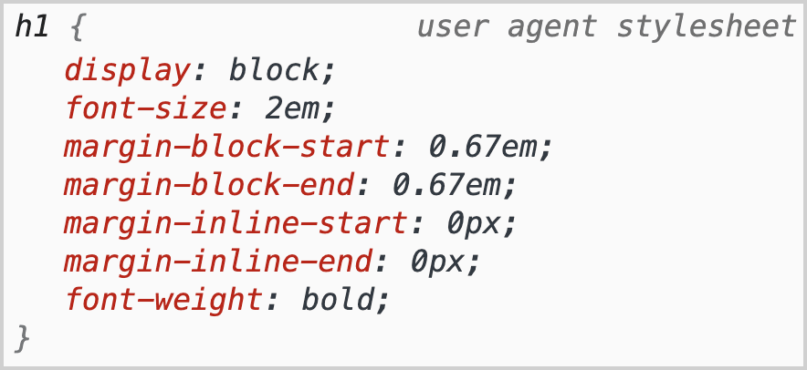
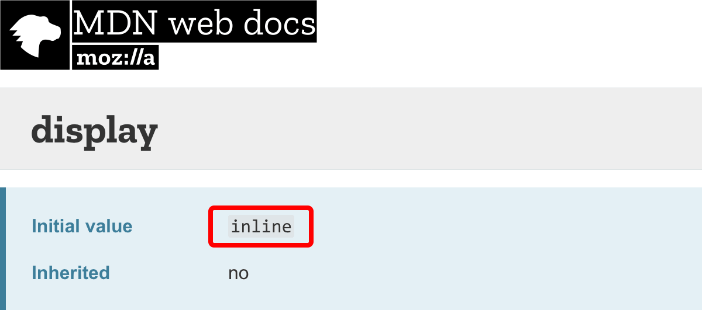
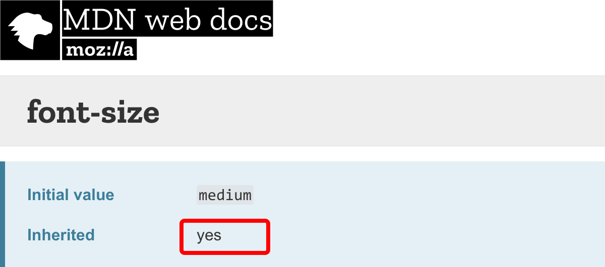
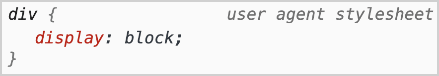

В CSS есть несколько ключевых слов для задания значений свойств. Я собираюсь поговорить о нескольких из них: `initial`, `inherit` и об относительно новых — `unset` и `revert`.

_В оригинальной статье в заголовке и во вступлении говорится только о трёх ключевых словах, но дальше в тексте идёт обсуждение четвёртого — `revert`. Мы решили добавить его во вступление для удобства читателя — прим. переводчика.)_

Хотя большинство веб-разработчиков сталкивалось с ними, весьма вероятно, что многие, даже самые опытные, не до конца их понимают.

Долгое время я знал об этих ключевых словах только то, что они используются для сброса стилей в CSS. Но если все эти ключевые слова являются своего рода сбросом, то почему их так много? Какие именно различия между ними? Я решил глубже изучить эти ключевые слова, чтобы раз и навсегда разобраться, что отличает их друг от друга.

## Базовые стили для веба

Прежде чем мы начнем разбираться с ключевыми словами, важно понять, откуда берутся базовые стили в браузере.

### Начальное значение для каждого свойства в CSS

Каждое свойство в CSS имеет начальное (`initial`) значение. Оно никак не связано с типом HTML-элемента, к которому применяется.

Пример начального значения из MDN:

<figure>
    
    <figcaption>Начальное значение свойства <code>line-height</code> — это <code>normal</code>.</figcaption>
</figure>

### Браузерные стили

После применения начальных стилей для всех CSS-свойств браузер загружает свои стили. Эти стили не имеют ничего общего с базовыми начальными значениями CSS-свойств.

Пример браузерных стилей:

<figure>
    
    <figcaption>Стили браузера Chrome, применяемые к элементу <code>&lt;h1&gt;</code>.</figcaption>
</figure>

У HTML-элементов нет начальных значений для стилей! Базовые стили HTML-элемента, такого как `<h1>`, например, предоставляются стилями браузера, а не начальными значениями CSS-свойств.

Теперь начнем говорить о ключевых словах.

## Ключевое слово `inherit`

Ключевое слово `inherit` сообщает браузеру, что значение свойства нужно найти у ближайшего родительского элемента и унаследовать его для текущего элемента. Если у ближайшего родителя также задано значение `inherit`, то браузер продолжит подниматься по DOM, пока не найдет какое-нибудь значение. Если значения нет, то браузер применит свои стили, а если и браузерных стилей нет, то тогда будет применено значение `initial`.

<iframe src="https://codepen.io/elad2412/embed/preview/hdypx" title="Пример работы значения inherit на CodePen."></iframe>

## Ключевое слово `initial`

Чтобы понять ключевое слово `initial`, мы должны помнить важный факт: у каждого свойства в CSS есть значение по умолчанию, которое не имеет ничего общего со значениями, которые устанавливаются браузером. Браузерные стили — это стили, которые применяются браузером к конкретным HTML-элементам. Мы часто думаем, что они автоматически приходят вместе с HTML, но это не так.

Ключевое слово `initial` говорит браузеру использовать значение по умолчанию для заданного CSS-свойства. Например, для свойства `color` значение `initial` всегда будет `black`.

Такое поведение может очень запутывать, потому что, как мы и говорили ранее, значение по умолчанию для CSS-свойства не всегда совпадает со значением, которое браузер задает конкретному элементу. Например, `initial`-значение для свойства `display` равно `inline` для всех элементов. Поэтому, если для элемента `<div>` будет задано свойство `display` со значением `initial`, то свойство будет вычислено как `inline`, а не `block`, как в стилях браузера.

Пример:

```css
div.box {
    background-color: red;
    display: initial; /* примет значение `inline`, а не `block` */
}
```

[Пример на CodePen значения `initial` для свойства `display` элемента `<div>`](https://codepen.io/elad2412/pen/KKKqMyZ).

<figure>
    
    <figcaption>
        <a href="https://developer.mozilla.org/en-US/docs/Web/CSS/display">Информация об <code>initial</code>-значении свойства <code>display</code> на MDN</a>.
    </figcaption>
</figure>

## Ключевое слово `unset`

Ключевое слово `unset` является уникальным и работает в зависимости от типа свойства. В CSS есть два типа свойств:

### 1. Наследуемые свойства

Свойства, которые затрагивают дочерние элементы. **Все свойства, которые влияют на текст, имеют такое естественное поведение.** Например, если мы зададим `font-size` элементу `<html>`, то он будет применяться ко всем дочерним элементам, пока вы не зададите другой `font-size` какому-нибудь из них.

<figure>
    
    <figcaption>
        <a href="https://developer.mozilla.org/en-US/docs/Web/CSS/font-size">Информация о наследуемости свойства font-size на MDN</a>.
    </figcaption>
</figure>

### 2. Ненаследуемые свойства

Все остальные свойства, которые влияют только на элемент, для которого они заданы. **Это все свойства, которые не относятся к оформлению текста**. Например, если вы зададите border на родительском элементе, то он не будет задан на дочернем.

<figure>
    
    <figcaption>
        <a href="https://developer.mozilla.org/en-US/docs/Web/CSS/border">Информация о наследуемости свойства <code>border</code> на MDN</a>.
    </figcaption>
</figure>

Ключевое слово `unset` работает так же, как и `inherit` для наследуемых свойств. Например, для текстового свойства `color` оно будет работать как значение `inherit`, то есть будет искать ближайший родительский элемент с заданием нужного свойства, а если он не будет найден, то применится браузерное значение, а если и браузерных стилей нет, то применится значение `initial`.

Для ненаследуемых свойств `unset` ведет себя как `initial`, то есть применится значение по умолчанию. Например, для свойства `border-color` оно будет работать как `initial`.

```css
.some-class {
    color: unset; /* будет равно `inherit` */
    display: unset; /* будет равно `initial` */
}
```

### Зачем использовать `unset`, если оно работает так же, как `inherit` и `initial`?

Если `unset` ведет себя как `inherit` и `initial`, то зачем оно может понадобиться? Если мы сбрасываем только одно свойство, то `unset` не нужен. Вместо него мы можем просто использовать `inherit` или `initial`. Но сейчас у нас есть свойство `all`, которое дает нам новую возможность — сбросить наследуемые и ненаследуемые свойства одновременно.

Таким образом, вам не нужно сбрасывать свойства по отдельности. Применение ключевого слова `unset` к свойству `all` приведет к сбросу всех наследуемых свойств к значению `inherit` и всех ненаследуемых свойств — к значению `initial`.

**Это единственная причина существования нового ключевого слова `unset`! В противном случае мы могли бы вместо этого использовать `inherit` и `initial`.**

Вместо сброса свойств по отдельности, к примеру:

```css
/* Плохо */
.common-content {
    font-size: inherit;
    font-weight: inherit;
    border-width: initial;
    background-color: initial;
}
```

Мы можем использовать новое свойство `all` со значением `unset`, которое повлияет на все существующие свойства, например:

```css
/* Хорошо */
.common-content {
    all: unset;
}
```

Я создал небольшой пример для демонстрации того, как свойства ведут себя, когда используется свойство `all` со значением `unset`. Некоторые ведут себя так, как будто к ним применено значение `inherit`, а некоторые так, как будто к ним применено значение `initial`. [Пример на Codepen использования `all: unset`](https://codepen.io/elad2412/pen/QWWgKbB).

## Ключевое слово `revert`

Но что, если мы хотим сбросить значение свойства до первоначально заданных браузером значений, а не до значений по умолчанию? Например, вернуть значение свойства `display` элемента `<div>` к значению `block` (это стили браузера), а не к значению `inline` (это базовые стили CSS).

<figure>
    
    <figcaption>Браузерные стили для тега div</figcaption>
</figure>

Для этих целей мы скоро получим новое ключевое слово в CSS: `revert`. Оно очень похоже на `unset`, единственное отличие состоит в том, что оно предпочитает стили браузера базовым значениям свойств CSS. Например:

```css
div {
    display: revert; /* = block */
}

h1 {
    font-weight: revert; /* = bold */
    font-size: revert; /* = 2em */
}
```

Таким образом, если мы хотим сбросить все стили HTML-элемента до базовых стилей браузера, мы можем сделать это так:

```css
/* Хорошо */
.common-content {
    all: revert;
}
```

Соответственно, `revert` дает гораздо больше возможностей, чем `unset`. Правда, на данный момент `revert` работает только в Firefox и Safari. _(В Chrome работает с версии 84 — прим. переводчика.)_

## Заключение

На этом всё. Надеюсь, вам понравилась эта статья, и вы чему-то научились из моего опыта.

## Видео доклада по теме

Я сделал короткий доклад на эту тему, смотрите видео целиком на YouTube:

<figure>
    <iframe src="https://www.youtube.com/embed/8IaKXJHRSXc" allowfullscreen></iframe>
    <figcaption>
        Мой доклад <a href="https://youtu.be/8IaKXJHRSXc">«Ключевые слова в CSS, которые никто не понимает»</a>.
    </figcaption>
</figure>
