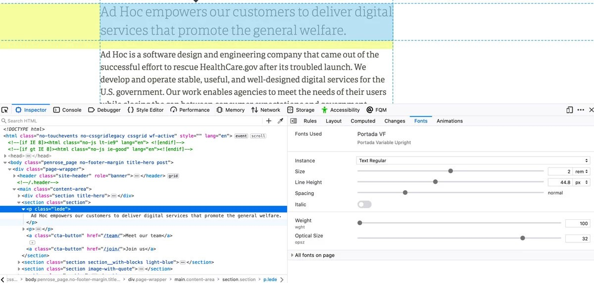

Типографика всегда вызывала у меня особый интерес, еще задолго до того, как мы смогли использовать шрифты в вебе. И хотя с тех пор прошло уже около десяти лет, всё это время мы были ограничены в выборе шрифтов, так как увеличение их количества напрямую влияло на количество трафика, которое приходилось загружать пользователю. И хотя грамотное использование типографики может положительно отразиться на дизайне, лёгкости восприятия и удобстве использования в целом, но стоит вам подключить слишком большое количество шрифтов, как тут же это негативно отразится на производительности и следовательно, на удобстве для пользователей. Три года назад был представлен результат развития формата шрифтов OpenType, который вносит удивительные изменения в работу со шрифтами.

## Представляем OpenType Font Variations или «вариативные шрифты»

На протяжении всего времени использования шрифтов, мне приходилось устанавливать отдельные файлы для каждой ширины, веса (жирности) или варианта начертания, который хотел использовать. Жирный (bold) в одном файле, светлый (light) в другом, курсив в третьем. Формат вариативных шрифтов является развитием OpenType (формата, используемого нами в течение многих лет), который позволяет содержать в одном файле в оптимизированном виде всё то, что ранее было разделено на отдельные файлы. Дизайнер может решить, какие оси включать, а также определить минимальные и максимальные значения.

<iframe src="https://codepen.io/jpmental/embed/preview/LYYowyb"></iframe>

Если говорить о вебе, это значит, что мы можем загрузить единственный файл и использовать CSS для установки параметров его осей в любое значение из всего допустимого диапазона, без каких-либо искусственных искажений силами браузера. Некоторые шрифты могут иметь только одну ось (weight является наиболее распространённой), а у некоторых можно задавать сразу несколько. Несколько осей являются «зарегистрированными», так как наиболее распространены: **width** (ширина), **weight** (вес), **slant** (наклон), **italic** (курсив) и **optical size** (оптический размер) — но формат является расширяемым, так что дизайнеры могут определить собственные оси и позволить вносить необходимые изменения. Давайте рассмотрим, как это работает

## Прямо как раньше, но по-другому

Один из способов, с помощью которого новый формат сохраняет обратную совместимость с другими приложениями, которые еще не поддерживают вариативные шрифты, это так называемые «именованные экземпляры» (named instances) — которые по сути являются псевдонимами для настройки данных, которые раньше помещались в отдельные файлы. Таким образом, независимо от того, что имел в виду дизайнер шрифта, называя его «плотным жирным», эти значения просто будут отражены на соответствующих точках вариативных осей веса и ширины. Если шрифт был создан корректно, его настройки позволят установить и использовать его в последних версиях Windows и macOS, будто они были изначально встроены в систему.

Если приложение полностью поддерживает вариативные шрифты, появится возможность манипулировать настройками отдельных осей так, как посчитаете нужным. В настоящее время к таким программам относятся последние версии Adobe Illustrator, Photoshop, InDesign, а также Sketch.

## Открытие секретов шрифтов

Чтобы узнать о всех возможностях работы с вариативными шрифтами, необходимо либо воспользоваться упомянутым ниже сайтом, либо загрузить Firefox (или, ещё лучше, сделать и то, и другое).

Если у вас есть файл шрифтов и доступ к интернету, можете воспользоваться сайтом [Wakamai Fondue](https://wakamaifondue.com/) Роель Нискенс, что расшифровывается как «What Can My Font Do» _(англ. «На что способен мой шрифт», прим. переводчика)_. Просто перетащите файл шрифта и получите отчёт, показывающий, какие у шрифта есть особенности, размер файла, количество глифов, а также поддерживаемые языки и вариативные оси. Вы получите даже тестировщик типа и несколько ползунков, которые позволят поиграть с изменением разных осей. Обратите внимание на оси, значения и настройки по умолчанию. Эта информация понадобится, когда мы начнём писать CSS.


Если же у вас нет доступа к файлу шрифта, всё еще можно получить необходимую информацию, просто используя инструменты разработчика браузера Firefox. По ним есть много обучающих видео, например [это](https://www.youtube.com/watch?v=UazfLa1O94M) или [это](https://www.youtube.com/watch?v=RYP7jKMWkVY).

Благодаря Джен Симмонс и команде Firefox Devtools, у нас есть несколько потрясающих инструментов для работы с веб-шрифтами прямо в браузере. В инструментах разработчика выберите текстовый элемент, использующий нужный шрифт, а затем перейдите в закладку «Fonts», расположенную справа. Вы попадёте на панель, содержащую в одном месте всю информацию о шрифте, размере, стиле и вариативных осях. Можно изменить любое из представленных значений и сразу увидеть результат в браузере, а перейдя на вкладку «Changes», легко скопировать изменённый CSS-код для переноса к себе.



Теперь, когда у вас есть все доступные оси, значения, настройки по умолчанию, давайте посмотрим, как это использовать на практике. Первое, на что следует обратить внимание, это то, что теги пяти зарегистрированных осей пишутся строчными буквами (`wght`, `wdth`, `ital`, `slnt`, `opsz`), тогда как кастомные — всегда заглавными. Браузеры учитывают это, и несоответствие верхнего и нижнего регистра в названии может привести к непредсказуемым результатам.

Существует два способа задания параметров для зарегистрированных осей: через соответствующие им CSS-свойства, а также с помощью низкоуровневого синтаксиса `font-variation-settings`. Очень важно использовать стандартные свойства везде, где это возможно, поскольку это единственный способ браузеру узнать, что делать если по какой-то причине вариативный шрифт не загрузится, или любому альтернативному устройству просмотра узнать, что нужно вывести определённый вид семантики из нашего CSS (то есть, большее значение `font-weight`, означающее более жирный текст). Хотя для кастомных осей (и на данный момент для осей `italics` и `slant`) мы должны использовать `font-variation-settings`, параметры `font-weight` (`wght`) и `font-stretch` (`wdth`) полностью поддерживаются в каждом браузере, который поддерживает вариативные шрифты. Теперь давайте рассмотрим пять зарегистрированных осей и как их использовать.

## Weight (вес)

Вероятно, наиболее очевидной осью является `weight`, поскольку почти каждый шрифт спроектирован как минимум, под обычное и жирное начертание. С вариативным шрифтом вы можете использовать стандартное свойтво `font-weight`, но указывать не только ключевые слова или значения, например, `normal` (`400`) или `bold` (`700`), а любое число в диапазоне между минимальным и максимальным значениями, определёнными для шрифта. Согласно спецификации OpenType, значение `400` должно соответствовать ключевому слову `normal` для всех шрифтов, но на практике вы увидите, что на данный момент оно может не совпадать и довольно сильно, в зависимости от шрифта.

```css
p {
    font-weight: 425;
}

strong {
    font-weight: 675;
}
```

<iframe src="https://codepen.io/jpmental/embed/preview/QWWXBoQ"></iframe>

### Почему вам это понравится

Позволяет использовать более широкий диапазон значений. Например, для таких ситуаций, как большие кавычки с очень тонким весом (жирностью). Определение значения «чуть тоньше, чем жирное» для отдельных слов внутри жирного текста может повысить читаемость. Чем текст жирнее, тем более закрытыми выглядят символы, но стоит сделать их немного тоньше, как они станут более открытыми, но всё ещё будут придавать акцент (попробуйте установить `font-weight` где-то между `500` и `600` вместо `700`).

## Width (ширина)

Другим распространённым значением при разработке шрифта является ширина. Этот параметр часто характеризуют терминами «плотный», «сжатый» или «расширенный», хотя то, что значат эти слова, является полностью субъективным. Согласно спецификации, 100 должно равняться ширине `normal`, а допустимые значения могут варьироваться от 1 до 1000. Как и вес, ширина соответствует существующему (и очень неудачно названному) CSS-свойству `font-stretch` и задаётся в процентах. На ранних стадиях внедрения технологии многие дизайнеры шрифтов не придерживались стандарта с числовыми диапазонами, так что это может выглядеть немного странно в вашем CSS. Но диапазон ширины в 3% — 5% всё еще является допустимым, даже если в этом случае 5% фактически является нормальной шириной. Надеюсь, со временем этот момент станет более стандартизированным

```css
p {
    font-stretch: 89%;
}
```

<iframe src="https://codepen.io/jpmental/embed/preview/mddZwKE"></iframe>

### Почему вам это понравится

Одна из важных задач при разработке адаптивного дизайна — не допустить ситуацию, в которой текст больших заголовков, после каждого слова переносится на новую строку, не помещаясь в ширину маленьких экранов. Помимо настройки размера шрифта `font-size`, попробуйте сделать текст заголовка немного уже. Это позволит поместить больше слов на каждой строке без уменьшения размера шрифта, которое визуально может выглядеть как снижение акцента или нарушение иерархии заголовков

## Italic (курсив)

Ось `italic` — это более-менее то, что вы и ожидаете. В большинстве случаев это логическое значение 0 или 1: выключено (вертикальный текст) или включено — обычно значит наклонное начертание и часто замену глифа. Часто строчные буквы «a» и «g» имеют немного отличающиеся формы курсива. Хотя, конечно, и существует возможность для данного свойства вместо строгих 0 или 1 задавать диапазон значений, сценарий с состояниями «включено» или «выключено» более распространён. К сожалению, хоть это и предназначено для соответствия свойству `font-style: italic`, это одна из тех возможностей, которую браузеры реализовали не полностью, поэтому нам остаётся полагаться на синтаксис более низкого уровня `font-variation-settings`. Вы уже могли задуматься о его использовании вместе с кастомными свойствами CSS, в этом случае вам не потребуется повторно объявлять всю строку, если нужно просто изменить курсивное или вертикальное начертание.

```css
:root {
    --text-ital: 0;
}

body {
    font-variation-settings: 'ital' var(--text-ital);
}

em {
    --text-ital: 1;
}
```

<iframe src="https://codepen.io/jpmental/embed/preview/yLLdqWx"></iframe>

### Почему вам это понравится

Наличие курсива, вертикального начертания, а также веса и других доступных для настройки осей означает, что у вас появляется возможность использовать только один файл шрифта вместо четырёх. Ведь при наличии широкого диапазона доступных осей, вам может больше ничего и не понадобиться

## Slant (наклон)

Ось наклона похожа на курсив, но имеет два ключевых отличия. Во-первых, она принимает значение в градусах, диапазон которых, согласно спецификации OpenType, должен быть «больше −90 и меньше +90». Во-вторых, она не предусматривает замену глифа (как `italic`). Обычно используется со шрифтом без засечек и допускает любое значение в указанном ранее диапазоне. Если используемый вами шрифт имеет только ось `slant`, но не имеет `italic` (я немного расскажу об этом), можно использовать стандартное свойство `font-style` например:

```css
em {
    font-style: oblique 12deg;
}
```

Если доступны обе оси, потребуется использовать `font-variation-settings`, и в этом случае понадобится просто задать числовое значение без указания единиц измерения `deg`.

```css
:root {
    --text-slnt: 0;
}

body {
    font-variation-settings: 'slnt' var(--text-slnt);
}

em {
    --text-slnt: 12;
}
```

<iframe src="https://codepen.io/jpmental/embed/preview/bGGXGZr"></iframe>

## Почему вам это понравится

Ось наклона (`slant`) позволяет задавать любое значение в пределах всего допустимого диапазона, поэтому становится возможным небольшое изменение угла наклона текста. Например, можно добавить анимацию, при которой текст после загрузки страницы постепенно становится курсивным. Это хороший способ привлечь внимание к текстовому элемент на экране таким изящным образом

## Optical Size (оптический размер)

Это настоящая жемчужина вариативных шрифтов. Данная практика существует более 400 лет. При её использовании физически меньший шрифт вырезался с немного более толстой обводкой и немного меньшим контрастом, чтобы обеспечить качественную печать и сохранить текст разборчивым даже при мелких размерах. Другие аспекты также могут быть адаптированы. Например, апертуры (отверстия) в буквах могут быть шире, более угловатые выступы или увеличенные скругления. И наоборот, крупные точки будут вырезаны более аккуратно, что позволит добиться большей контрастности и лучше детализации. Хотя этот подход использовался во многом из-за недостаточно качественных чернил, бумаги и шрифта — он всё же позволял использовать один эскиз шрифта в широком диапазоне физических размеров символов. Однако, эта технология перестала использоваться с переходом к цифровым фрифтам.

Концепция заключается в том, что числовое значение для этой оси должно соответствовать визуальному размеру шрифта, и именно для этого был введёно новое свойсвто: `font-optical-sizing`. По умолчанию, оно имеет значение `auto` и такое поведение поддерживается всеми современными браузерами. Можно либо отключить его — `off`, либо задать явное значение через `font-variation-settings`.

```css
body {
    font-optical-sizing: auto;
}
```

<iframe src="https://codepen.io/jpmental/embed/preview/MWWNwJa"></iframe>

Или:

```css
:root {
    --text-opsz: 16;
}

body {
    font-variation-settings: 'opsz' var(--text-opsz);
}

h1 {
    --text-opsz: 48;
    font-size: 3em;
}
```

<iframe src="https://codepen.io/jpmental/embed/preview/ExxqaBy"></iframe>

### Почему вам это понравится

Правильный оптический размер делает шрифт более разборчивым при меньших размерах. Повышенная контрастность обводки (и всего остального, что решил изменить дизайнер шрифта) может означать, что один и тот же шрифт может существенно отличаться при его использовании в заголовке или теле статьи. Убедиться в этом можно на примере шрифта Roslindale от Дэвида Джонатана Росса, который [используется на моём сайте](https://rwt.io/). Я использую один шрифт и для заголовков и для остального текста.

## Slant и Italic (наклон и курсив)

Не знаю, задумывались ли над этим создатели спецификации, когда составляли её, но технически вы можете задавать обе оси: и для наклона (то есть, угла) и для курсива (то есть, замены глифа). На самом деле и Дэвид Джонатан Росс и Стивен Никсон уже применили это со шрифтами Roslindale Italic и Roslindale Recursive соответственно. В случае с Roslindale Recursive вы можете увидеть, насколько больше гибкости вы можете получить, отделив угол от глифов. Возможность задать угол наклона без замены глифов может придать блоку текста совершенно другой вид. Учитывая то, что курсив и наклон используют одно и то же свойство `font-variation-settings`, его можно использовать для определения параметров обоих атрибутов.

```css
:root {
    --text-ital: 0;
    --text-slnt: 0;
}

body {
    font-variation-settings: 'ital' var(--text-ital), 'slnt' var(--text-slnt);
}

em {
    --text-ital: 1;
    --text-slnt: 12;
}

.slanted {
    --text-slnt: 12;
}

.italic-forms-only {
    --text-ital: 1;
}
```

<iframe src="https://codepen.io/jpmental/embed/preview/BaaXKBq"></iframe>

## Почему вам это понравится

Наличие отдельной оси под каждый тип изменения шрифта может дать больше гибкости при создании системы типографики проекта. В одном случае вы можете выбрать только наклон, в другом — и наклон и замену глифов. Может это и не самая важная функция, но всё же она добавляет дополнительное измерение, в котором можно настраивать шрифт.

## Кастомные оси

Пока что существует только пять зарегистрированных осей, но дизайнеры могут также создавать собственные. Любая составляющая шрифта потенциально может стать осью. Есть вполне привычные, такие как форма засечек или высота строчных (x-height), так и достаточно изобретательные. Более подробный их разбор я оставлю кому-нибудь другому, но продемонстрирую один, использование которого, как я надеюсь, станет более распространённым в текстовом и UI-дизайне — это Grade.

## Grade

Понятие «grade» в типографике впервые было введено для регулирования толщины шрифта на разных типах бумаги и печатных станках. Концепция заключается в изменении веса (жирности) шрифта без изменения межбуквенного интервала и пространства, занимаемого одним символом. Наличие его в качестве переменной оси может быть полезно в нескольких отношениях. Создание участка текста с большей контрастностью, при котором символы становятся немного более жирными без переформатирования, может сделать текст более разборчивым при слабом освещении или при разработке тёмной темы. Либо при наведении на элемент, анимировать его с помощью плавного утолщения шрифта и изменения фона. Обратите внимание, что кастомные оси должны указываться заглавными буквами.

```css
:root {
    --text-GRAD: 0;
}

body {
    font-variation-settings: 'GRAD' var(--text-GRAD);
}

body.dark {
    --text-GRAD: 0.5;
}
```

<iframe src="https://codepen.io/jpamental/embed/preview/GRRVqpV"></iframe>

### Почему вам это понравится

Я думаю, что чаще всего ось `GRADE` будет использоваться при разработке функционала, связанного с доступностью: тёмными темами или режимом высокой контрастности. Но никто не запрещает её применения при анимировании кнопок или навигации путём утолщения текста без изменения количества пространства, которое он занимает.

## Поддержка

К счастью, поддержка вариативных шрифтов достаточно хорошая: последние версии macOS и Windows предлагают поддержку на уровне операционной системы, делая возможной их установку в вашу систему и отображение параметров в меню настройки шрифтов в любом приложении, как если бы это были отдельные шрифты. Если вы используете последние версии приложения Adobe CC такие как Illustrator, Photoshop или InDesign — или последние версии Sketch, вы можете изменять все доступные оси. Согласно [Can I use](https://caniuse.com/#feat=variable-fonts), поддержка находится на уровне 87%, включая наиболее популярные мобильные платформы и браузеры.

Единственное исключение — это IE11, но учитывая то, что при подключении вариативных шрифтов вы можете использовать `@supports`, получается. что вполне безопасно использовать их в продакшн уже сегодня. Этот подход используется на более 40 сайтах новой веб-платформы штата Джоржия в США и успешно поддерживает статические шрифты для госслужащих, использующих IE11 и вариативные шрифты для миллионов граждан по всему штату

```css
p {
    font-family: YourStaticFontFamily;
}

@supports (font-variation-settings: normal) {
    p {
        font-family: YourVariableFontFamily;
    }
}
```

Поскольку CSS всегда полностью анализируется перед выполнением любого другого действия, вы можете быть уверены, что браузеры никогда не загрузят оба шрифта сразу

## Добавление шрифтов в проект

Вероятней всего, многим из вас пока что потребуется хранить вариативные шрифты у себя на сервере, так как на данный момент только Google предлагает их через собственные API и то в бета-версии. Существует несколько ключевых отличий в составлении `@font-face` объявления, давайте рассмотрим их:

```css
@font-face {
    font-family: "Family Name";
    src:
        url("YourVariableFontName.woff2") format("woff2 supports variations"),
        url("YourVariableFontName.woff2") format("woff2-variations");
    font-weight: [low] [high];
    font-stretch: [low]% [high]%;
    font-style: oblique [low]deg [high]deg;
}
```

Первое, что вы могли заметить, это немного отличающаяся строка `src`. Я добавил два варианта синтаксиса, указывающих на один и тот же файл, потому что спецификация была обновлена, но в браузерах этот момент еще не актуализировали. Так как на горизонте в дополнение к вариативным виднеются еще и разноцветные шрифты (и возможность того, что некоторые будут и вариативными и цветными), синтаксис должен быть более гибким. Таким образом, первая запись указывает `woff2 supports variations color` для шрифта, который поддерживает и то и другое. Когда браузеры начнут понимать этот синтаксис, они будут останавливать распознавание строки `src` как только дойдут до него. До тех пор они будут пропускать эту строку и переходить ко второй с форматом `woff2-variations`, который понимают все современные браузеры, поддерживающие вариативные шрифты.

Для веса `font-weight` и ширины `font-stretch`, если доступна соответствующая ось, укажите минимальное и максимальное значения (со знаком процента для ширины). Если соответствующей оси нет, просто используйте ключевое слово `normal`. Стоит отметить, что если также присутствует ось курсива (вместе с осью наклона или без неё), на данный момент лучше всего просто полностью пропустить строку `font-style`.

Задавая эти граничные значения, вы помогаете браузеру понять, что делать, если CSS запросит значение, находящееся за пределами допустимого диапазона. Таким образом, если диапазон веса 300–700, а вы случайно указали `font-weight: 100`, браузер просто установит значение 300 и не будет пытаться синтезировать меньший вес. Стоит отметить, что это работает только со стандартными CSS-свойствами, такими как `font-weight` или `font-stretch`. Если для установки значений вы используете `font-variation-settings`, браузер предполагает, что вы являетесь экспертом и попытается синтезировать результат, даже если он выходит за пределы нормального диапазона.

## Google Fonts тоже подходит

В сентябре 2019 команда Google Fonts анонсировала бета-версию своего API, который поддерживает некоторые вариативные шрифты. Поддержка растёт и впереди еще больше шрифтов. Если вы хотите опробовать это уже сейчас, можете [ознакомиться с моей статьей](https://rwt.io/typography-tips/variable-fonts-new-google-fonts-api) о том, как это сделать и [проверить CodePen](https://codepen.io/jpamental/pen/JjPvBpm), в создании которого я применил упомянутый способ.

## Где их найти

Место, с которого следует начинать поиски вариативных шрифтов, — [v-fonts.com](https://v-fonts.com/) Ника Шермана, который является каталогом, содержащим почти все доступные на данный момент вариативные шрифты. Также загляните на GitHub, где дополнительно [сможете найти проекты](https://github.com/search?q=variable+fonts) на разных стадиях завершённости. Ник также ведёт Твиттер, где публикует анонсы и ссылки, а я добавляю новости по веб-типографике.

Вы также можете посетить сайт [Axis-Praxis](https://axis-praxis.org/) Лоуренса Пенни, необычный каталог вариативных шрифтов, который позволяет добавить шрифт на специальную тестовую площадку, которая может сообщить вам дополнительную информацию о возможностях и особенностях выбранного шрифта.

## Почему всё это важно

Хотя всё это может быть интересно чисто с академической точки зрения, существуют некоторые значительные преимущества и возможности от использования вариативных шрифтов. С точки зрения производительности, хотя вариативные шрифты могут иметь больший размер, чем отдельные файлы каждого начертания обычных шрифтов, они всё равно намного меньше совокупного размера этих файлов. Что значит, что время загрузки страницы может значительно улучшиться. Это именно та причина, по которой [Nielson/Norman Group использует шрифт Source Sans Variable](https://www.nngroup.com/articles/variable-fonts-wide-screen-layout/) на своём сайте в течение последнего года, а [Google тестирует шрифт Oswald Variable](https://rwt.io/typography-tips/what-web-wants) в течение последних месяцев. В основном, просто используя их вместо нескольких отдельных файлов для получения выгоды от более быстрой загрузки страниц.

Но помимо этого, что меня действительно радует, так это возможности дизайна. Когда в нашем распоряжении оказываются вариативные шрифты, мы можем подходить к вопросу типографики более творчески. Пример, приведённый ниже, не должен оставаться просто примером, а становиться частью всеобщей практики.

<iframe src="https://codepen.io/jpmental/embed/preview/wvwgGLK"></iframe>

Надеюсь, эта статья послужила хорошим введением в тему вариативных шрифтов. [Отправляйте ссылки и вопросы](https://twitter.com/jpamental) — я не могу дождаться, когда увижу, что у вас получилось сделать. И следите за обновлениями.

А пока, если хотите узнать о других способах работы с вариативными шрифтами, загляните на удивительный сайт Mandy Michael — [variablefonts.dev](https://variablefonts.dev/)
