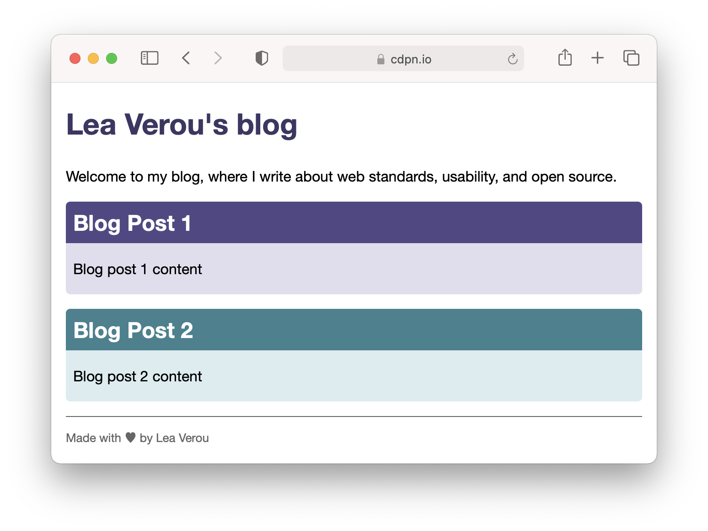
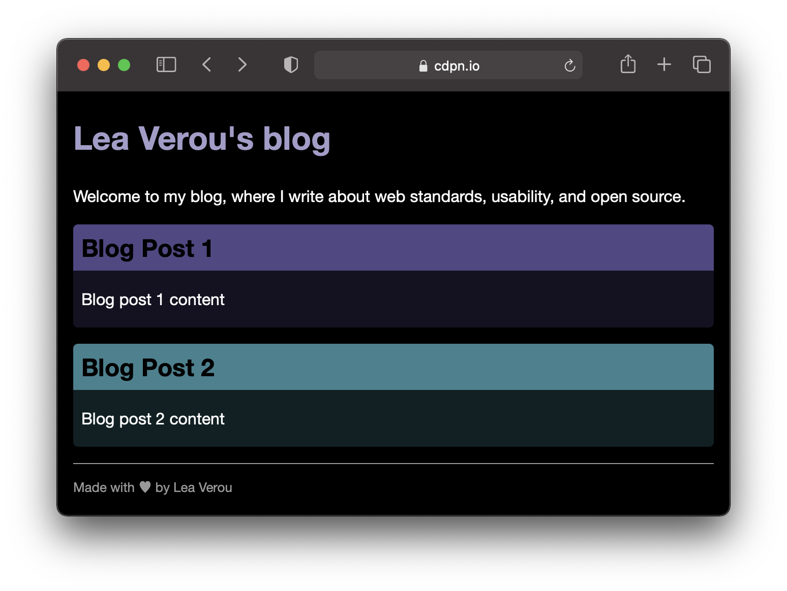
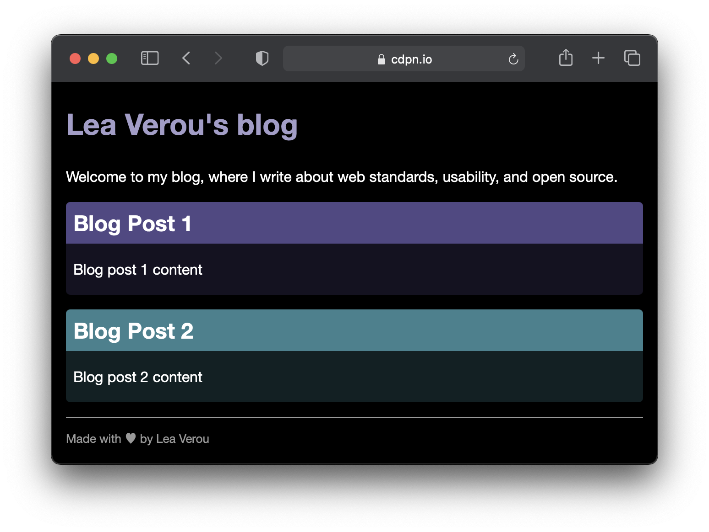
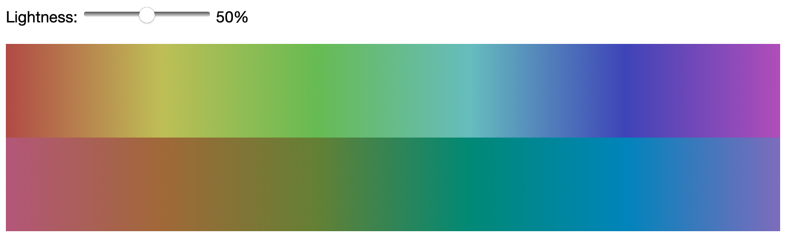
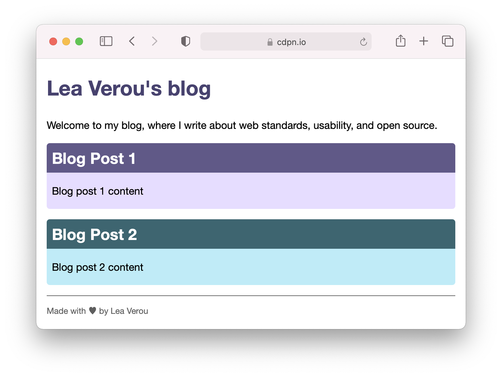
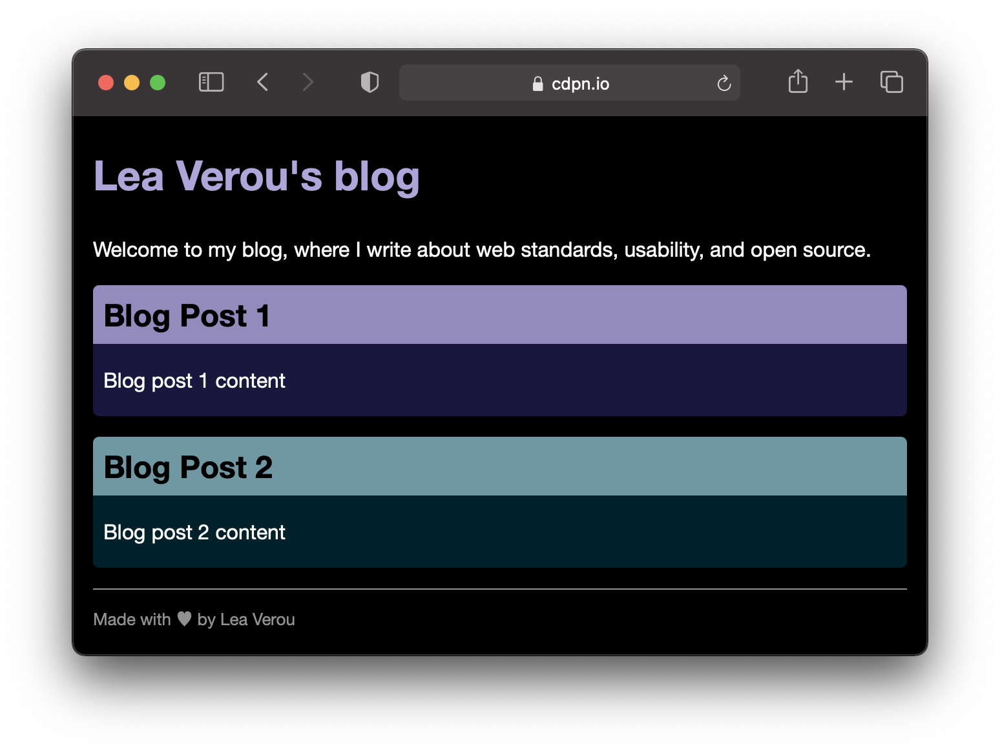

К настоящему времени вы, вероятно, знаете, что можете использовать css-переменные для отдельных цветовых компонентов, чтобы избежать повторения одних и тех же цветовых координат несколько раз. Возможно, вы даже знаете, что одну и ту же переменную можно использовать для нескольких компонентов, например для HSL оттенка и светлоты: 

```css
:root {
	--primary-hs: 250 30%;
}

h1 {
	color: hsl(var(--primary-hs) 30%);
}

article {
	background: hsl(var(--primary-hs) 90%);
}

article h2 {
	background: hsl(var(--primary-hs) 40%);
	color: white;
}
```

Вот очень простая страница, [созданная с помощью этой техники](https://codepen.io/leaverou/pen/QWdjpEL):

<iframe src="demos/custom-props/"></iframe>

В отличие от переменных препроцессора, переменную вы можете даже локально переопределить, чтобы получить блоки с другим акцентным цветом:

```css 
:root {
	--primary-hs: 250 30%;
	--secondary-hs: 190 40%;
}

article {
	background: hsl(var(--primary-hs) 90%);
}

article.alt {
	--primary-hs: var(--secondary-hs);
}
```

<iframe src="demos/local-override/"></iframe>

Это все прекрасно, пока не вступит в игру тёмная тема. Идея использования css-переменных для ее создания не нова. Однако в каждой статье, которую я видела, предлагается стратегия создания набора переменных, по одной для каждого цвета, и переопределения их внутри медиавыражения.

Это хороший подход, и в конечном итоге, вы, скорее всего, захотите применить его хотя бы для части ваших цветов. Однако даже в самом проработанном дизайне не каждый цвет является css-переменной. Часто цвета объявляются встроенными (Прим.пер.: прямо в месте использования), особенно серые (например, цвет нижнего колонтитула в примере выше). Это означает, что добавление темной темы на столько сложно, что вы можете отложить его на неопределенное "потом", особенно в сайд-проектах.

Трюк, который я вам покажу, заставит вздрогнуть любого, кто достаточно хорошо разбирается в цветах, но он поможет вам создать темную тему за считанные минуты. Это не очень правильно, и вам в конечном итоге доработь его полноценной темной темы (так как темная тема – это не только замена цветов), но это лучше, чем ничего, и он может служить основой.

Основная идея - использовать переменные для яркости цвета, вместо того чтобы класть в них цвета целиком. Затем в темной теме вы переопределяете эти переменные на противоположные. Обычно это дает светлые цвета там, где были темные, средней яркости цвета там, где средней яркости и темные цвета там, где были светлые цвета, и по-прежнему позволяет вам определять цвет ситуативно, в месте его использования, а не использовать переменную для каждого отдельного цвета. Вот как будет выглядеть код для нашего юера:

```css 
root {
	--primary-hs: 250 30%;
	--secondary-hs: 190 40%;

	--l-0: 0%;
	--l-30: 30%;
	--l-40: 40%;
	--l-50: 50%;
	--l-90: 90%;
	--l-100: 100%;
}

@media (prefers-color-scheme: dark) {
	:root {
		--l-0: 100%;
		--l-30: 70%;
		--l-40: 60%;
		--l-90: 10%;
		--l-100: 0%;
	}
}


body {
	background: hsl(0 0% var(--l-100));
	color: hsl(0 0% var(--l-0));
}

h1 {
	color: hsl(var(--primary-hs) var(--l-30));
}

article {
	background: hsl(var(--primary-hs) var(--l-90));
}

article h2 {
	background: hsl(var(--primary-hs) 40%);
	color: white;
}

footer {
	color: hsl(0 0% var(--l-40));
}
```

<iframe src="demos/lightness-variables/"></iframe>

Результат выглядит так в светлой и темной теме:




Обратите внимание, что здесь мы без разбора заменили все значения яркости на переменные яркости. На практике иногда нужно действовать внимательнее. Например, заголовки статей действительно выглядели бы лучше и лучше контрастировали бы, если бы мы просто оставили их такими же:



Такие решения легко принимать, пока вы просматриваете свой CSS, заменяя процент яркости переменными и предварительно просматривая результат.

## Проблема с HSL

Но почему заголовки статей легче читать с их оригинальными цветами, чем с инвертированной яркостью? Основная причина заключается в том, что `lightness` HSL на самом деле не соответствует тому, что люди воспринимают как светлоту, и одна и та же разница в ней может восприниматься совершенно по-разному.

В этом большая проблема этого подхода: он предполагает, что `lightness` HSL на самом деле что-то значит, но, как мы обсуждали ранее, это не так. Желтый и синий имеют одинаковую светлоту HSL (50%), чтобы вы поняли! Кроме того, вы заметите, различия между темными цветами у вас окажутся меньше, чем между светлыми, потому что HSL не является однородным по восприятию.

Означает ли это, что эта техника годитс только для заглушки, пока мы разрабатываем наш настоящий темный режим?

На самом деле, все не так мрачно.

Вскоре мы получим цвета LCH в браузере. Первая реализация была недавно выпущена в Safari, и в этой области также наблюдается активность среди других разработчиков браузеров.

LCH - гораздо лучшее цветовое пространство для этой техники, потому что в нем светлота на самом деле что-то значит, не только для разных оттенков одного и того же цвета, но и для разных оттенков разных цветов.

(Прим.пер.: на момент выпуска этого перевода описанные возможности уже есть в [Safari15](https://webkit.org/blog/11989/new-webkit-features-in-safari-15/))

В следующем примере требуется Safari TP 120+. Сравните эти два градиента: верхний показывает различные цвета HSL с яркостью 50%, а нижний - различные цвета LCH, все с яркостью 50%. Вы даже можете настроить ползунок и попробовать разную светлоту:

снипет https://codepen.io/leaverou/pen/xxgOZQR

Вот скриншот для тех из вас, у кого нет доступа к Safari TP 120+:



Обратите внимание, что в HSL некоторые цвета (например, желтый и голубой) намного светлее других. В LCH все цвета при одинаковой светлоте, в общем, одинаково светлые визуально.

Имейте в виду, что цветность (chroma) LCH на самом деле не соответствует светлоте (lightness) HSL, поэтому, даже если мы установили для них одно и то же значение, визуально будет не одинаково.

Итак, как эта техника будет работать с цветами LCH? Давайте попробуем!

Я использовала [этот инструмент](https://css.land/lch/) для преобразования своих цветов HSL в LCH, а затем немного изменила значения вручную, поскольку изначально преобразованные цвета не при всех уровнях светлоты LCH выглядели хорошо (обратите внимание, что цвета HSL с одинаковым оттенком и насыщенностью могут иметь разные оттенки и цветности в LCH). Вот как этот метод выглядит с цветами LCH (для просмотра вам потребуется Safari TP 120 или более поздняя версия):

<iframe src="demos/lch-version/"></iframe>

И вот скриншоты:




Мало того, что темная тема выглядит намного лучше, но даже в светлой цвета, полученные новым способом, на самом деле выглядят более однородными, поскольку они имеют одинаковую яркость LCH.

Вот сравнение двух способов создания темной темы:


Обратите внимание, что на самом деле, пока цвета LCH не будут нормально поддерживаться везде, вам нужно будет предоставить запасной вариант через `@supports`, но для краткости я не включила его в демо.

## Автоматизация генерации переменных яркости 

Если вы используете препроцессор, поддерживающий циклы, например Sass, вы можете автоматизировать создание этих переменных и сделать их еще более детализированными, например каждые 5%:

```sass 
:root {
    @for $i from 0 through 20 {
        --l-#{$i * 5}: #{$i * 5}%;
    }
}

@media (prefers-color-scheme: dark) {
    :root {
        @for $i from 0 through 20 {
            --l-#{$i * 5}: #{100 - $i * 5}%;
        }
    }
}
```

## Можем ли мы сделать переменные яркости более DRY?

(Прим.пер.: DRY (Don’t repeat yourself) - принцип [разработки](https://ru.wikipedia.org/wiki/Don%E2%80%99t_repeat_yourself
), нацеленный на уменьшение количества повторяющегося кода.)

Некоторым из вас, возможно, могло не понравиться повторение значений: нам нужно объявить, например, --l-40 как 40%, затем установить его на 60% в темном режиме. Разве мы не можем как-то получить его, вычтя уже имеющееся значение из 100%?

Те, у кого есть опыт программирования, могут попробовать что-то вроде этого:

```css 
--l-40: calc(100% - var(--l-40));
```

Однако это не сработает. CSS не является императивным языком. В нем нет шагов расчета, где переменные имеют разные значения до и после каждого шага. Такого понятия, как "последовательность исполнения" тоже нет, все декларации, которые применяются в данный момент, должны быть верными сразу. Это больше похоже на реактивный расчет формул электронных таблиц, чем на вычисления в JS и других популярных языках программирования (существуют языки реактивного программирования общего назначения, но они менее известны). Следовательно, объявления, подобные приведенному выше, считаются циклами: поскольку `--l-40` не может ссылаться на себя, это ошибка, а для `--l-40` будет установлено начальное значение в качестве механизма исправления ошибок (поскольку CSS не может генерировать ошибки).

Итак, есть ли способ избежать объявления переменных яркости дважды, один раз для светлого режима и один раз для темного режима?

Есть, но я бы не рекомендовала это. Это делает код более запутанным для чтения и понимания без особой пользы. Но ради интеллектуального развлечения я опишу это здесь.

Вместо того, чтобы устанавливать `--l-40` на 40%, мы зададим ее в виде отличия от 50%, то есть -10%. Затем `calc 50% + var (- l-40))` дает нам 40%, а `calc 50% - var (- l-40))` дает нам 60%, два значения, которые нам нужны. Поэтому мы можем объявить одну переменную, равную `-1` в темном режиме и `1` в светлом режиме, и просто умножить на нее.

Вот пример того, как будет выглядеть наш код с этим:

```css 
:root {
	--dm: 1;

	/* Пример объявления: */
	--l-40: -10%;
}

@media (prefers-color-scheme: dark) {
	:root {
		--dm: -1;
	}
}

/* Пример использования */

footer {
	color: hsl(0 0% calc(50% + var(--dm) * var(--l-40));
	/* урааа! */
}
```

И, надеюсь, теперь вам понятно, почему я не советую так делать: пользоваться этим намного сложнее, и всё это лишь чтобы не писать несколько объявлений всего один раз. Именно такая навязчивая приверженность DRY, которую [программисты в конечном итоге реализуют, контрпродуктивна](https://lea.verou.me/2020/09/developer-priorities-throughout-their-career/).
