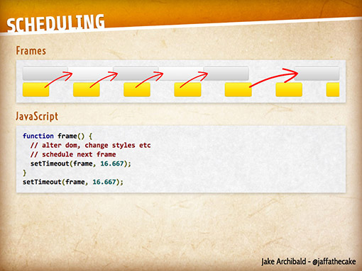
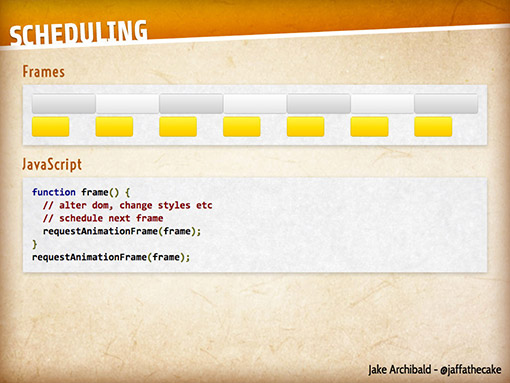

На конференции jQuery UK 2013 я делал доклад под названием «[Я знаю jQuery. И что?](https://speakerdeck.com/rem/i-know-jquery-now-what)». Обычно я готовлюсь, устраивая взрыв из стикеров на своём столе, но в этот раз я сперва написал пост, а потом уже сделал слайды. Итак, вот мой практически не отредактированный и немного путаный рассказ о том, как я работал с jQuery, и как я смотрю на использование встроенных браузерных технологий.

## 7 лет назад…

17 июня 2006 года я опубликовал мой самый первый настоящий [пост в блоге](http://web.archive.org/web/20061018170852/http://leftlogic.com/info/articles/auto-selecting_navigation): я взял обычный JavaScript и упростил его с помощью jQuery. В итоге 14 строчек JavaScript превратились в три строчки на jQuery (версии pre-1.0).

Самый важный эффект от jQuery был в том, что вместо муторной навигации по DOM вы писали простой CSS-селектор, после чего к нужному элементу добавлялся класс. К тому же, исходный JavaScript-код был довольно нестабильным, а разметка у вас получалась одна и та же в обоих случаях.

Я показал jQuery команде разработчиков, с которыми я сотрудничал в середине 2000-х, и даже дизайнеры увидели все плюсы этого подхода, поскольку CSS-селекторы были им уже знакомы (именно так и возникла идея «jQuery для дизайнеров»).

### Внезапно навигация по DOM стала простой

В те времена навигация по DOM была очень сложной. Можно было поспорить — если у вас получалось что-то сделать в Firefox 1.5, то в IE6 это не работало.

Простота, с которой можно было изучить jQuery, стала для меня плюсом. Вся навигация по DOM делалась с помощью CSS-селекторов (реализовано это было какой-то безумной магией из «черного ящика», которую придумал Джон Резиг) — главное, что это экономило мои ограниченные мыслительные ресурсы, и, когда я получал нужные мне элементы DOM, я уже мог делать с ними все что угодно (показывать, скрывать, анимировать и т.п.)

### Понимание Ajax

jQuery также поставила на доступный мне уровень абстракцию Ajax. Этот термин был придуман буквально только что, в 2005 году, и документации по технологии было мало, понять её было непросто (не забывайте про ограниченные вычислительные способности моего мозга).

Итак, мне нужно было работать с объектом `XMLHttpRequest`. Когда я увидел его впервые, мне стоило усилий понять, как работает событие `onreadystatechange` и пара `this.status` и `this.readyState`. jQuery, как и ряд других библиотек, разобралась с тем ужасом, который представляли собой XHR-запросы в IE через ActiveX…

    function getXmlHttpRequest() {
        var xhr;
            if (window.XMLHttpRequest) {
                xhr = new XMLHttpRequest();
        } else {
                try {
                    xhr = new ActiveXObject("Msxml2.XMLHTTP");
            } catch (e) {
                try {
                    xhr = new ActiveXObject("Microsoft.XMLHTTP");
            } catch (e) {
                    xhr = false;
            }
        }
    }
        return xhr;
    }
    // Код, который Джон написал в jQuery,
    // куда более элегантен!

Когда я увидел, что в jQuery можно использовать функцию `ajax`, для того чтобы выцепить HTML по какому-то адресу (именно это мы обычно и хотели делать с помощью Ajax), вся технология внезапно стала для меня понятной.

jQuery сразу и надолго стала моим обычным инструментом. Это был мой «швейцарский нож», если позаимствовать [название доклада Адама](http://events.jquery.org/2013/uk/schedule.html#adam)!

## Назад в будущее: сегодня

Давайте промотаем ленту вперед и вернемся в сегодняшний день. Что случилось за эти годы?

Для начала: моя позиция по умолчанию — это не «всегда подключай jQuery». Я лучше знаю JavaScript, и как в нём все работает. У меня появились собственные критерии, когда нужно подключать jQuery, а когда нет. Но если я не подключаю jQuery, что тогда?

За эти семь лет произошло довольно многое. Вероятно, одним из самых важных шагов вперед стало появление в браузерах `querySelectorAll`.

Возможность передать встроенной функции внутри браузера CSS-селектор, чтобы сам браузер работал над навигацией по DOM — это огромная (правда!) часть jQuery. Базовая поддержка была в Chrome с самого начала, в IE8 и Firefox 3.5 появилась в середине 2009 года.

Эндрю Ланни (из PhoneGap и Adobe) написал невероятно простую функцию:

    var $ = document.querySelectorAll.bind(document);
    Element.prototype.on = Element.prototype.addEventListener;

    $('#somelink')[0].on('touchstart', handleTouch);

Это просто и прекрасно.

Я взял его идею, немного развил ее и использовал в ряде довольно специфических проектов, добавив поддержку для чейнинга, циклов и упростив синтаксис. В сжатом виде все занимает меньше 200 байт. Смысл этого в том, что сейчас у нас есть встроенная в браузеры поддержка для ряда функций, и я стараюсь принимать во внимание аудиторию своего проекта, перед тем как по умолчанию подключать jQuery.

## В каких случаях я всегда использую jQuery

Прежде чем я расскажу о том, как я могу обходиться без jQuery, быть «нагим» — давайте я расскажу о случаях, когда я точно включаю jQuery в проект. Есть несколько довольно специфических причин, которые заставляют меня либо начинать прямо с jQuery, либо переключаться на нее с какого-то специально написанного решения.

Перед этим я должен оговориться относительно случая, когда я абсолютно точно не использую jQuery: если я пытаюсь воспроизвести баг в браузере, я никогда не использую библиотеку. Если вы пытаетесь найти баг, чтобы можно было сообщить о проблеме, необходимо, чтобы в примере было как можно меньше кода (конечно, кроме тех случаев, когда вы отправляете сообщение об ошибке внутри jQuery!).

### 1. Когда проект должен работать в устаревших браузерах

BBC достаточно четко озвучили, [что именно они называют современным браузером](http://responsivenews.co.uk/post/18948466399/cutting-the-mustard), и по некотором размышлении это и есть тот признак, по которому я решаю, включать jQuery по умолчанию или нет.

Если я знаю, что я должен работать с несовременными браузерами, и они составляют часть ядра аудитории, то я начну с jQuery внутри своего кода.

Что значит «современный»? По большому счету, ответ простой: поддерживает ли браузер `querySelectorAll`? BBC применяет следующий тест на соответствие требованию современности:

    if (querySelector in document &&
        localStorage in window &&
        addEventListener in window) {
        // Загружаем JavaScript-приложение
    }

Я знаю наизусть, что IE8 не поддерживает `addEventListener` ([хотя и существует полифил](https://gist.github.com/eirikbacker/2864711)), так что, если поддержка этого браузера важна для проекта, я понимаю, что не хочу начинать проект с хаков для IE8.

Не то чтобы я хочу сказать, что те проекты, которые я начинаю без jQuery, не будут поддерживать IE8. Скорее — что нужно начинать с малого и делать разработку простой с самого начала. Если я начну проект с охапки хаков — проблем не оберёшься.

И еще я считаю это тем случаем, «когда сложность перевешивает простоту».

### 2. Когда я делаю что-то дешево и сердито

Если я создаю какой-то концепт, тестирую идею или просто что-то набрасываю и отправляю в [JS Bin](http://jsbin.com), обычно я просто добавляю jQuery по умолчанию. Так мне не приходится лишний раз думать.

## Без jQuery!

Наверное, вы думаете: «Так, Реми использует jQuery, а если нет, то просто переписывает все фичи сам?»

Я совершенно не хочу изобретать велосипед. Если я обнаруживаю, что, разрабатывая без jQuery, я в итоге сам переписываю с нуля ее функциональность, тогда, ясное дело, я просто трачу свое время впустую.

Нет, всё не так. Просто есть довольно много сценариев, в которых я буду писать код своего приложения без библиотеки, опираясь на встроенные в браузер технологии. Если какая-то часть этих технологий не поддерживается в том или ином браузере, я могу прибегнуть к [полифилам](http://remysharp.com/2010/10/08/what-is-a-polyfill/) — но только после тщательного рассмотрения и понимания, что это имеет смысл.

Итак, как я живу без jQuery, и насколько полной можно считать поддержку нужных технологий в браузерах?

## document.ready

Даже когда я использую jQuery, если у меня (или моей компании) есть контроль над проектом, я очень редко использую `document.ready` (или его короткую версию: `$(function)`).

Дело в том, что весь JavaScript я размещаю под всем DOM, перед тегом `</body>`. Так я всегда уверен, что в этот момент весь DOM уже будет обработан браузером.

Надеюсь, что вы это и так знаете, но JavaScript блокирует рендеринг страницы. Если вы разместите JavaScript над содержимым, и ваш сервер подвиснет — вы получите пустую страницу. Я много раз уже использовал этот пример, но повторюсь, что раньше (довольно давно) виджет Twitter просто вставлялся в HTML вашей страницы. Их сайт частенько падал, и мой блог (с этим виджетом) зависал на пустой странице — так что выглядело все так, будто упал мой сайт.

## .attr('value') и .attr('href')

Мне всегда становится грустно, когда я вижу, как jQuery используется для того, чтобы получить значение элемента `<input>`:

    $('input').on('change', function () {
        var value = $(this).attr('value');
        alert('The new value is' + value);
    });

Почему? Потому что всегда можно получить значение элемента с помощью `this.value`. Что важнее — нужно думать о том, как вы используете JavaScript-библиотеку. Не применяйте jQuery без необходимости.

Дело здесь не в jQuery. Это просто нормальная практика. Нужно, чтобы в коде просто было написано:

    $('input').on('change', function () {
        alert('The new value is' + this.value);
    });

Еще люди довольно часто используют jQuery для того, чтобы получить `href` ссылки: `$(this).attr('href')`, но можно вполне легко получить путь и из DOM: `this.href`. Обратите, правда, внимание, что `this.href` несколько отличается: это абсолютный путь, поскольку мы здесь говорим про DOM API, а не сам элемент. Если вы хотите получить значение атрибута (как это работает в случае jQuery), вы можете использовать `this.getAttribute('href')`.

Ещё есть сценарий, в котором вы устанавливаете класс для элемента, и здесь вам тоже не нужна jQuery, если вы просто добавите класс. Сколько раз я видел:

        
    </head>
    <body>
        

Но зачем, когда можно так?

    </head>
    <body>
        

Пожалуй, самое главное различие между этими двумя примерами состоит в том, что мы не подключаем jQuery только затем, чтобы установить класс для `<body>`, определяющий доступность JavaScript.

Если у `<body>` уже может быть какой-нибудь класс, то просто припишите новый к строке (jQuery тоже нужно обращаться к свойству `className`): `document.body.className += ' hasJS'`.

Здесь мы начинаем натыкаться на проблемы с именами классов и отслеживанием того, у каких элементов какой класс есть, а какого нет. Но в браузерах есть и такая функциональность.

## classList — добавляем, удаляем, переключаем

Свойство `classList` из спецификации HTML5 поддерживается всеми последними версиями браузеров (кроме IE9 — но в этом случае я могу использовать полифил).

Вместо:

    $('body').addClass('hasJS');
    // или
    document.body.className += ' hasJS';

Можно написать:

    document.body.classList.add('hasJS');

Красиво, не правда ли? А удалять?

    $('body').removeClass('hasJS');
    // или какое-нибудь безумное регулярное выражение

Или можно сделать так:

    document.body.classList.remove('hasJS');

Но больше впечатляет встроенная поддержка переключения классов:

    document.body.classList.toggle('hasJS');
    // и
    document.body.classList.contains('hasJS');

Для добавления нескольких классов нужно добавить их как аргументы через запятую:

    document.body.classList.add('hasJS', 'ready');

Есть, конечно, некоторые проблемы, вроде этой, с пустой строкой:

    document.body.classList.contains('');
    // SyntaxError: DOM Exception 12

Ужасно! Но, с другой стороны, я знаю проблемные места и обхожу их стороной. В принципе, мы выросли, работая с браузерами именно по таким принципам.

## Хранение данных

Хранение произвольных данных в элементах появилось в jQuery в версии 1.2.3, а хранение объектов — в 1.4, то есть уже довольно давно.

В HTML5 есть встроенное хранение данных внутри элементов, но между jQuery и встроенной поддержкой есть фундаментальная разница: `dataset` в HTML5 не поддерживает хранение объектов.

Но если вы храните строки или JSON, тогда встроенная поддержка работает идеально:

    element.dataset.user = JSON.stringify(user);
    element.dataset.score = score;

К сожалению, встроенной поддержки нет в IE10 (конечно, можно добавить полифил, и все прекрасно заработает — но это нужно принимать во внимание при использовании `dataset`).

## Ajax

Как я уже говорил, jQuery помогла мне понять Ajax в полной мере. Сейчас Ajax — это довольно просто. Конечно, у меня нет всяких дополнительных опций, но, по большей части я просто выполняю XHR GET или POST-запросы с JSON.

    function request(type, url, opts, callback) {
        var xhr = new XMLHttpRequest(),
            fd;

        if (typeof opts === 'function') {
            callback = opts;
            opts = null;
    }

        xhr.open(type, url);

        if (type === 'POST' && opts) {
            fd = new FormData();

            for (var key in opts) {
                fd.append(key, JSON.stringify(opts[key]));
        }
    }

        xhr.onload = function () {
            callback(JSON.parse(xhr.response));
    };

        xhr.send(opts ? fd : null);
    }

    var get = request.bind(this, 'GET');
    var post = request.bind(this, 'POST');

Коротко и просто. XHR — это совсем не сложно, а сейчас есть и хорошая документация. Понимание того, как XHR на самом деле работает и что с его помощью можно сделать, дает нам больше возможностей.

Как насчет событий прогресса? Событий, привязанных к прогрессу загрузки? Что насчёт отправки `ArrayBuffer`? А если нужно разбираться с [CORS](http://ru.wikipedia.org/wiki/Cross-origin_resource_sharing) и заголовком `xml-requested-with`?

Для этого вам понадобится прямой доступ к объекту XHR (я знаю, что это можно получить и из jQuery), и вам нужно знать, как устроен XHR и что с ним можно делать, потому что такие вещи, как, например, загрузку файлов через перетаскивание сейчас безумно просто реализовать с помощью встроенной функциональности.

## Наконец-то формы!

jQuery-плагин для валидации форм был стабильным плагином с первых дней jQuery, и честно сделал работу с формами намного проще.

Но вне зависимости от валидации на стороне клиента все равно нужно проводить валидацию на стороне сервера — это необходимо в любом случае, какую бы валидацию вы ни делали.

Но что, если можно было бы выбросить кучу строк JavaScript и плагинов и валидировать эл. адрес как-то так:

    <input type="email">

Хотите сделать его обязательным полем?

    <input type="email" required>

Хотите разрешать пользователю вводить только определенные символы?

    <input pattern="a-z0-9">

Неплохо. Здесь даже есть поддержка вспомогательных технологий — например, клавиатура на мобильных устройствах адаптируется и будет выводить символы для эл. адреса.

Так как все эти типы полей при отсутствии в браузере поддержки просто становятся текстовыми полями, и раз уж вам все равно нужно делать валидацию на сервере, я бы на вашем месте выкинул всю JavaScript-валидацию и заменил ее на встроенную в браузеры валидацию HTML5-форм.

## jQuery-анимации против CSS-анимаций и JavaScript-анимаций

На самом деле это никакое не соревнование. CSS выигрывает. Анимации, для которых используется CSS, вычисляются на видеокарте. В анимациях на JavaScript добавляется еще один уровень расчетов — просто потому, что там есть JavaScript.

Даже в том случае, когда я пишу код сам, я выберу `requestAnimationFrame` вместо использования анимаций, основанных на `setInterval`.

Джейк Арчибальд подготовил отличные слайды, которые показывают проблему — `setInterval` не сделает анимацию плавной, и достаточно скоро начнет пропускать кадры:

<figure>
    
    
</figure>

Кроме того, CSS-анимации проходят через тот же таймер, что и `requestAnimationFrame` — его мы и хотим использовать.

Так что, если ваш браузер это позволяет, используйте CSS-анимации. Конечно, это посложнее, чем `$foo.animate('slow', { x: '+=10px' })`, но зато анимация будет чище и плавнее. Стоит знать, что трогать DOM — дорогая операция. Если вы анимируете положение элемента по оси абсцисс, обновляя атрибут `el.style.left`, вы постоянно читаете и пишете в DOM.

А вот если вы просто сделаете `foo.classList.add('animate')`, анимация CSS-класса выполнит плавный переход положения левой точки элемента. И если вы точно знаете, что это только значение слева, можно использовать аппаратное ускорение, выполнив `translateX` с `translateZ(0)`.

Ну а как же, слышу я ваш крик, как же вызов функции после окончания анимации? Это тоже можно. Хотя синтаксис немножко противный:

    el.addEventListener("webkitTransitionEnd", transitionEnded);
    el.addEventListener("transitionend", transitionEnded);

Обратите внимание, что `e` в `end` строчная…

Пара милых людей в Твиттере показали мне [своего рода полифил для jQuery](https://github.com/benbarnett/jQuery-Animate-Enhanced), который дополняет функцию `.animate` в том случае, если в браузере доступны CSS-анимации.

Еще есть отдельный плагин [Transit](http://ricostacruz.com/jquery.transit/), который дает вам возможность писать CSS-анимации на JavaScript. Приятный момент для меня — поддержка чейнинга. Но так он работает только с CSS-анимациями, для этого требуется IE10 или выше.

Отсюда у меня возникает вопрос: почему этот плагин в обязательном порядке требует jQuery?

## В сторону: jQuery-плагины — просто так

Я:

> Не знаю почему, но мне очень хочется больно ударить людей, которые пишут такие jQuery-плагины, для которых на самом деле jQuery совершенно не нужна. /требуется-контроль-эмоций

Ответ:

> @rem У меня то же самое. Я думаю, где-то есть группа, в которой с этим помогают, — и, полагаю, довольно большая.

Я недавно работал над проектом и узнал о [fitText.js](http://fittextjs.com). Я решил включить его в свой код, но потом заметил, что для него **требуется** jQuery.

Хм-м. Зачем?

Этот проект использует следующие методы jQuery:

1. `.extend`
2. `.each`
3. `.width`
4. `.css`
5. `.on` (над производительностью никто особенно не задумывался)

Собственно, вот код проекта:

    $.fn.fitText = function( kompressor, options ) {

        // Настраиваем
        var compressor = kompressor || 1,
            settings = $.extend({
                'minFontSize' : Number.NEGATIVE_INFINITY,
                'maxFontSize' : Number.POSITIVE_INFINITY
        }, options);

        return this.each(function(){

            // Сохраняем объект
            var $this = $(this);

            // Функция Resizer() изменяет размеры объекта
            // на основе его ширины, поделённой на compressor * 10
            var resizer = function () {
                $this.css('font-size', Math.max(
                    Math.min($this.width() / (compressor*10),
                    parseFloat(settings.maxFontSize)
                ),
                parseFloat(settings.minFontSize)));
        };

            // Вызываем для установки
            resizer();

            // Вызываем при ресайзе. Opera кеширует вызовы по умолчанию
            $(window).on('resize orientationchange', resizer);
    });
    };

`.extend` используется на объекте, в котором всего две опции, так что я бы переписал его так:

    if (options === undefined) options = {};
    if (options.minFontSize === undefined) options.minFontSize = Number.NEGATIVE_INFINITY;
    if (options.maxFontSize === undefined) options.maxFontSize = Number.POSITIVE_INFINITY;

`return this.each` используется для того, чтобы итерироваться по элементам. Предположим, что мы хотим, чтобы этот код работал без jQuery: тогда наша функция `fitText` получит список элементов (так как чейнинга мы делать не будем):

    var length = nodes.length,
        i = 0;

    // Хотелось бы использовать [].forEach.call, но нет поддержки в IE8
    for (; i < length; i++) {
        (function (node) {
            // там, где использовался `this`, теперь `node`
            // …
        })(nodes[i]);
    }

`$this.width()` получает ширину контейнера, чтобы изменять размер текста. Для этого нам нужно получить рассчитанные стили и взять из них значение ширины:

    // Функция Resizer() изменяет размеры объекта
    // на основе его ширины, поделённой на compressor * 10
    var resizer = function () {
        var width = node.clientWidth;
        // …
    };

`$this.css` используется для установки значений, так что тут всего лишь нужно задать стили:

    node.style.fontSize = Math.max(…);

`$(window).on('resize', resizer)` прикрепляет обработчик события (если вы хотите поддержку в IE8, то нужно еще включить `addEvent`):

    window.addEventListener('resize', resizer, false);

На самом деле, я бы пошел еще дальше и хранил бы функции ресайза в массиве, и во время операции изменения размера проходил бы по массиву, исполняя все эти функции.

Конечно, тут нужно немножко больше работы, но при этом такие изменения довольно легко провести так, чтобы работа в качестве jQuery-плагина была бы для этого проекта дополнительной функциональностью, а не требованием.

Моя тирада скоро закончится: еще меня убивает, когда я вижу полифил, которому требуется jQuery — но я признаю и контраргумент: чрезвычайная распространенность jQuery, наверное, может оправдать то, что столько проектов пишется с зависимостью от нее.

## Заключение

Моей целью было показать вам, что, хотя jQuery безумно помогала мне все эти годы (особенно годы плохой совместимости между браузерами), и со встроенной функциональностью браузеров можно уйти довольно далеко в плане обычных сценариев, — когда я пишу JavaScript для того, чтобы «сделать что-нибудь» в DOM.

Перестаньте думать в парадигме «функция X не работает в браузере Y». Подходите с другой точки зрения. Какую задачу я решаю? Какой инструмент лучше всего подойдет? Для кого это делается? Я по-прежнему верю в методологию прогрессивного улучшения, но я не понимаю удовольствия лезть из кожи вон ради того, чтобы поддерживать воображаемую аудиторию пользователей (по той причине, что у нас нет данных, какие браузеры у наших пользователей).

Google (по моим последним данным) поддерживает последние и предпоследние версии браузеров. Я тоже стараюсь начинать с поддержки этих версий.

Я буду продолжать использовать jQuery так, как мне удобно, и я продолжу убеждать своих читателей и слушателей, что фронтенд-разработчики должны знать, что могут браузеры, с которыми они работают.

Итак, на этом я заканчиваю и надеюсь, что этот текст был вам полезен.

Возможно, некоторые из вас уже знали всё это (правда, в таком случае у меня возникает вопрос, зачем вы это читаете), однако я надеюсь, что хоть кому-то я показал, что за пределами jQuery есть еще целый мир, и вы можете начать осваивать его прямо сейчас в одном из своих проектов.

Может быть, некоторые из вас только знакомятся с jQuery — я надеюсь, что вы станете разбираться и дальше в том, на что способны JavaScript и DOM.

Однако большинству из вас я принёс снег зимой. Вы уже согласны со мной. Вы уже верите в стандарты, делаете все правильно, учитесь и образовываетесь. Но вы должны помочь людям, которые не получают этой информации.

Вам нужно делиться своими ощущениям с другими людьми. Теперь вы — эксперты, и вы должны помочь окружающим достигнуть вашего уровня и превзойти его.

На конференциях будут нужны новые докладчики и новые эксперты: это вы.

## Материалы к статье

- [Слайды презентации](https://speakerdeck.com/rem/i-know-jquery-now-what)
- [Видео доклада](http://vimeo.com/68009123)
- [Секция вопросов и ответов с конференции Mobilism](http://vimeo.com/68910118#t=2380)
- [Библиотека min.js](https://github.com/remy/min.js)
