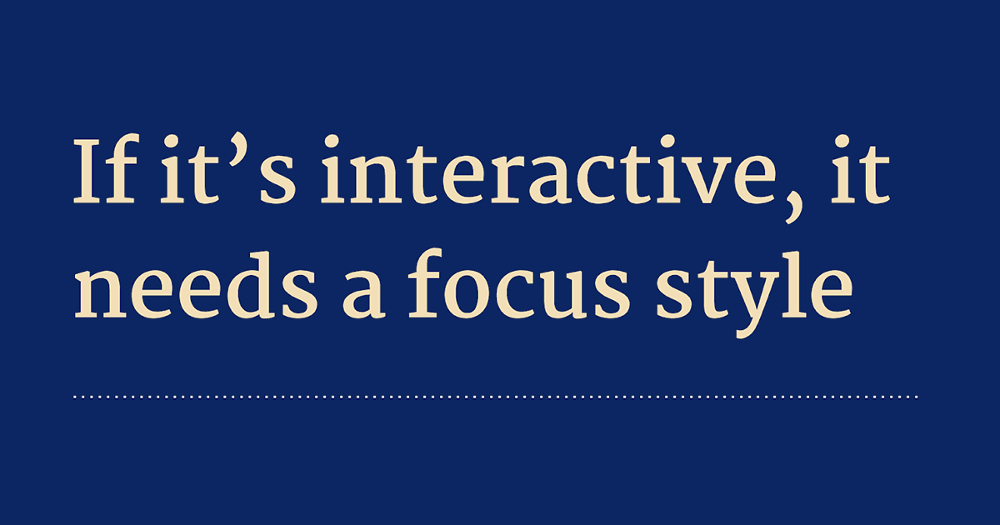

За последнее время появилось несколько статей и рекомендаций от разных людей о том, как использовать псевдокласс `:focus-visible`, чтобы показать стили для `:focus`, когда кто-то пользуется клавиатурой, и скрывать их, если пользователь использует мышь.

Лучшее из того, что я видел, [предложила Лия Веру](https://twitter.com/LeaVerou/status/1045768279753666562):

> Я собираюсь начать добавлять следующее правило во все мои таблицы стилей:
> `:focus:not(:focus-visible) { outline: none }`
> Избавляет пользователей мыши от раздражающего `outline`, но сохраняет его для пользователей клавиатуры и не учитывается браузерами, которые не поддерживают `:focus-visible`.

Аргументация всегда одинаковая: обводка фокуса (эти рамки вокруг ссылок, кнопок и других элементов, на которых можно сделать фокус) — отстой. Нам нужно добавлять их только потому, что они нужны пользователям клавиатуры.

Чушь собачья.

Стили фокуса действительно потрясающие. У моего друга Эрика Бэйли есть отличная презентация об этом:

[If it’s interactive, it needs a focus style. October 15, 2018. #a11yTOConf](https://noti.st/ericwbailey/TcMJFP/embed)

Лично мне они нравятся по той же причине, по которой мне нравятся стили для :visited на перегруженных ссылками страницах.

Даже если ты пользуешься мышью, полезно знать, на чём сейчас сделан фокус, потому что я _иногда ещё использую и клавиатуру._ Часто они взаимозаменяемы. Может быть мой пример притянут, но знаете ли вы, как каждый из пользователей пользуется вашими сайтами и приложениями?

Мы продолжаем совершать одинаковую ошибку снова и снова, предполагая, что знаем, как наши пользователи хотят использовать то, что мы создаём, или что они такие же, как мы.

К тому же стили фокуса не обязательно должны быть уродливыми. Я думаю, что стили по умолчанию замечательные, но вы можете принимать какие угодно творческие решения, чтобы они выглядели лучше.

Моя позиция: просто используйте стили фокуса на своём сайте. Для всего, на чём можно сделать фокус. Для каждого пользователя.
