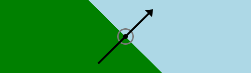
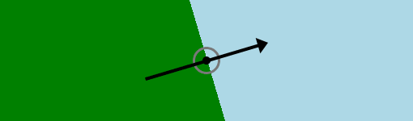
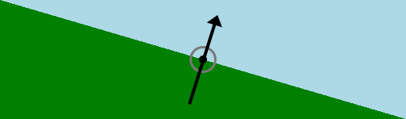

Использование линейных градиентов в CSS может приводить к самым разнообразным результатам, которые не назовёшь иначе как странными; иногда даже сам синтаксис кажется странным.

Давайте я сразу замечу, что кое-что из того, о чём я здесь рассказываю, еще не поддерживается широко, и даже, по правде говоря, эта спецификация еще не зафиксирована раз и навсегда. Скорее всего, она такой и останется, но могут быть и какие-то изменения. Даже если этого не случится — эта статья не о новом **«используйте прямо сейчас!»** приёме. Как и многое из того, что я пишу, это скорее маленькая прогулка по одному из уголков CSS с целью посмотреть, есть ли здесь что-нибудь интересное.

Хотя линейные градиенты кажутся очень сложными, в действительности они довольно просты. Вы определяете направление, по которому идет градиент, а затем — перечисляете столько контрольных точек цвета, сколько хотите. Таким образом, вы описываете изображение текстом, примерно как SVG. Это довольно важный пункт, его стоит помнить: линейный (и радиальный) градиент — это картинка, точно такая же, как любой GIF и PNG. Это означает, помимо всего прочего, что можно совместно использовать растровые изображения и градиенты в фоне элемента, используя синтаксис множественных фоновых изображений.

Но вернёмся к градиентам. Вот совсем простое градиентное изображение:

```
linear-gradient(45deg, red, blue)
```

Значение `45deg` описывает линию градиента, то есть ту линию, которая определяет направление градиента. Линия градиента всегда проходит через центр фоновой области элемента, и в каком именно направлении она пройдет, определяете вы, автор CSS. В этом примере линия градиента направлена на угол в 45% от горизонтальной оси элемента. Значения `red` и `blue` — контрольные точки цвета. Здесь в цветах не определены положения контрольных точек, поэтому эти значения принимаются равными 0% и 100% соответственно, то есть вы получаете градиент, который переходит от красного к синему и идёт по указанному направлению.

Можно создать контрольные точки таким образом, чтобы переход между ними был резким:

```
linear-gradient(45deg, green 50%, lightblue 50%)
```

<figure>
    
    <figcaption>Рисунок 1.</figcaption>
</figure>

Так вы получите результат, показанный на рисунке 1, к которому я добавил (в Photoshop) стрелку, которая показывает направление линии градиента и центральную точку фоновой области. Каждая «полоска», составляющая градиент, перпендикулярна линии градиента — поэтому граница между двумя цветами в точке 50% перпендикулярна по отношению к линии градиента. Этот закон перпендикулярности работает всегда.

Определять направление в градусах — это замечательно (и, чтобы соответствовать синтаксису анимаций, математическое определение градусов будет заменено на углы по компасу, но об этом в другой раз), но можно ещё использовать и ключевые слова, описывающие направления. Причем двух разных типов.

_**Обратите внимание,** что задания направления градиента с помощью ключевых слов **без** ключевого слова `to`, описанное дальше, справедливо только для старой версии спецификации и применяется только для градиентов с префиксами. Прим. редактора._

Первый вариант использования — это просто объявить направление, перемешав и подставив слова из набора `top`, `bottom`, `right` и `left`. Диковатенько здесь то, что в этом случае вы определяете не то направление, куда двигается градиент, а откуда он выходит; то есть вы должны определить положение его начальной, а не конечной точки. Соответственно, если вы хотите, чтобы градиент шёл из нижнего левого угла в верхний правый, надо писать `bottom left`:

```
linear-gradient(bottom left, green 50%, lightblue 50%)
```

<figure>
    
    <figcaption>Рисунок 2.</figcaption>
</figure>

Но `bottom left` — не то же самое, что `45deg` (это справедливо только в том случае, если фоновая область элемента — правильный квадрат) Если эта область неквадратна, то линия градиента идет из одного угла в другой, а разделительные полоски — перпендикулярно ей, как на рисунке 2. И снова для ясности я добавил стрелку, показывающую градиентную линию, и центральную точку в Photoshop.

Естественно, это означает, что если фоновая область элемента изменит свои размеры по ширине или высоте, угол линии градиента тоже изменится. Если элемент станет шире по вертикали или уже по горизонтали, то линия повернется против часовой стрелки; уже по вертикали и шире по горизонтали — по часовой. Вполне возможно, именно такой вариант вам и нужен. Во всяком случае, он явно отличается от задания значения угла в градусах, при котором градиент не будет поворачиваться никуда, как бы ни менялся размер фона элемента.

_**Обратите внимание,** что способ задания направления градиента с ключевым словом `to`, описанный дальше, по стабильной версии спецификации является единственным возможным способом, и должен применяться только для градиентов без префикса. Прим. редактора._

Другой способ использовать ключевые слова выглядит похоже, но результат у него совершенно другой. Вы используете те же самые определения `top/bottom/left/right`, но перед ними пишете ключевое слово `to`, вот так:

```
linear-gradient(to top right, green 50%, lightblue 50%)
```

<figure>
    
    <figcaption>Рисунок 3.</figcaption>
</figure>

В этом случае ясно, что вы определяете конечную точку линии градиента, а не начальную — в конце концов, вы же пишете `to top right`. Однако, в таком случае вы не направляете градиент в правый верхний угол фоновой области элемента. Вы определяете общее направление — вперед и направо. Результат предыдущего определения виден на рисунке 3: снова стрелка с линией градиента добавлена в Photoshop.

Обратите внимание на линию резкого разделения между контрольными точками. Она идет от левого верхнего угла в правый нижний (ни тот, ни другой — не `top right`). Так происходит потому, что, написав ключевое слово `to` в начале определения, мы включили то, что называется «магическими углами». Когда «магические углы» включены, то как бы фоновая область элемента ни изменяла свой размер, эта разделительная линия всегда будет идти из левого верхнего в правый нижний угол. Собственно, вот это и есть магические углы. Таким образом, линия градиента направлена не в правый верхний угол (только если фоновая область элемента — правильный квадрат), а в правый верхний квадрант фоновой области. По-видимому, термин «магические квадранты» посчитали менее удачным, чем «магические углы».

Если размер фоновой области изменится, эффект будет тем же самым, что в прошлый раз; уменьшим высоту или увеличим ширину фоновой области — линия градиента повернется по часовой стрелке; сделаем обратные изменения размера — линия пойдет в обратном направлении. Единственная разница — в начальном состоянии.

Итак: если вы хотите использовать ключевые слова, которые заставляют градиент быть всегда направленным в угол (как на рис. 2), но хотите указать направление, а не исходную точку — то этого сделать не получится. Точно так же нельзя указать и исходный квадрант, в котором начинается градиент. Чтобы получилась линия градиента, которая всегда идет из угла в угол, нужно объявить начальную точку линии градиента (рис. 2). Если вы хотите получить эффект «магических углов», когда линия контрольной точки цвета на 50% всегда идет из угла в угол, нужно объявить квадрант направления (рис. 3).

Теперь что касается собственно поддержки: на момент написания статьи _(26 апреля 2012, прим. редактора)_ только Firefox и Opera поддерживают «магические углы». Все остальные браузеры — IE10 в случае Internet Explorer — поддерживают математические углы и ключевые слова без «магических углов» (то есть Opera и Firefox поддерживают оба типа). Никто ещё не переключился с математических углов на углы по компасу (я совершенно специально использовал значение `45deg`, поскольку в обеих системах оно описывает одно и то же направление).

_**Обратите внимание,** что на момент публикации перевода (27 июля 2012) спецификацию в полной мере (включая направление поворота и ключевое слово `to`) поддерживают без префиксов: тестовая версия Firefox 16 Aurora и последняя тестовая версия IE10 в составе Windows 8 Release Preview. Прим. редактора._

Таково состояние дел с линейными градиентами прямо сейчас. Мне очень интересно узнать, что вы думаете о различных форматах ключевых слов и их принципах работы — у меня самого были вначале некие проблемы с их пониманием, и то, что у двух форматов синтаксиса совершенно разные результаты, по-моему, делает всё это довольно-таки запутанным. А вы что скажете?
