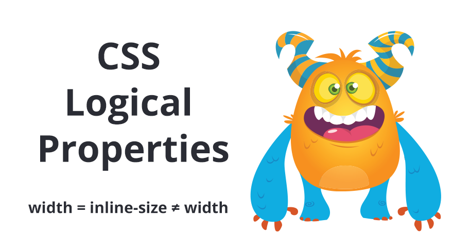
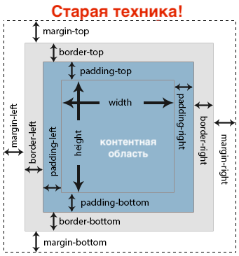
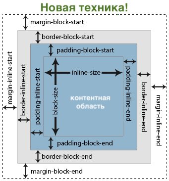
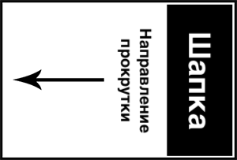
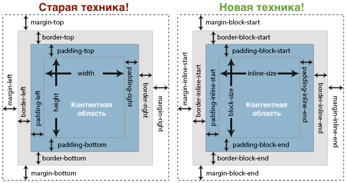
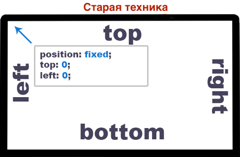
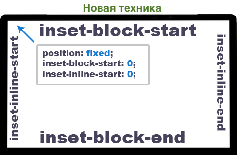
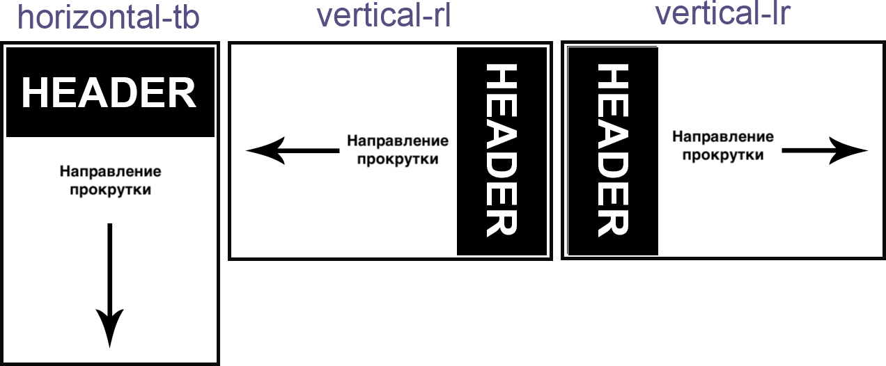

Следующий шаг в эволюции CSS

## Интро

Большинство из нас, разработчиков, мыслят терминами право-лево и верх-низ. Всё потому что изначально интернет предназначался главным образом для загрузки документов, а не для сайтов со сложной структурой, которые мы создаём теперь. Потому никто в тот момент не учитывал потребностей многоязычных сайтов.



До недавнего времени переменные в Sass были лучшим способом поддержки сайтов с языками, пишущимися в разные стороны (RTL и LTR). Если вы хотите узнать больше, то почитайте мою статью «[The Best Way to RTL Websites with Sass!](https://medium.com/@elad/the-best-way-to-rtl-your-website-with-sass-105e34a4298a)»

Новые логические свойства дают нам гораздо больше возможностей управлять нашими сайтами, независимо от того, на каком они языке (английский, арабский, японский или другие), с минимальными изменениями стилей.

Самое время начать!

## Мыслить логическими CSS-свойствами

Мы привыкли видеть что-то подобное, когда обсуждаем блочную модель:



Раньше так было правильно, и есть до сих пор, но подходят последние деньки классических физических свойств типа `margin-left`, `padding-right`, `border-top` и других.

Прежде чем начать использовать новые логические свойства, вам нужно перестать думать терминами право-лево, верх-низ, и заменить из на `inline-start`, `inline-end` и `block-start`, `block-end`.



### Строчная ось

Давайте для примера возьмём английский язык. Направление чтения начинается слева и идёт направо. Это строчный аспект свойств. Это можно легко запомнить, рассмотрев ряд элементов с `display: inline`. Каждый элемент отображается в строку.

Например, `padding-inline-start` задаст отступ с той стороны, где начинается контент на текущем языке:

- Английский: `padding-inline-start` = `padding-left`
- Арабский: `padding-inline-start` = `padding-right`
- Японский: `padding-inline-start` = `padding-top`

### Блочная ось

При замене верхних и нижних связанных свойств легко вспоминать, что верх находится в начале нашего сайта, а низ — в конце. Просто представьте несколько элементов с `display: block`, которые расположены друг над другом.

Возможно, вы всё ещё спрашиваете себя, а разве это не всегда так?!

Ответ чуточку сложнее. В настоящее время все сайты на любых языках работают именно таким образом. Просто потому что до сих пор не было других доступных методов.

Сайты на японском языке и некоторых других восточных языках идут справа налево, а не сверху вниз! Чтобы понять, каково это, представьте, что вы повернули экран на 90° вправо. Сайт приходится листать не по вертикали, а по горизонтали!

Пример блочных свойства:

- Английский и арабский: `padding-block-start` = `padding-top`
- Японский: `padding-block-start` = `padding-right`



## Новые свойства блочной модели

`margin`, `padding` и `border`

После того, как вы разобрались со строчной и блочной осями, вы можете использовать их по прямому назначению.

Пример для английского:

### margin

- `margin-block-start` = `margin-top`
- `margin-block-end` = `margin-bottom`
- `margin-inline-start` = `margin-left`
- `margin-inline-end` = `margin-right`

### padding

- `padding-block-start` = `padding-top`
- `padding-block-end` = `padding-bottom`
- `padding-inline-start` = `padding-left`
- `padding-inline-end` = `padding-right`

### border

- `border-block-start` = `border-top`
- `border-block-end` = `border-bottom`
- `border-inline-start` = `border-left`
- `border-inline-end` = `border-right`

## Логическая величина

`width` и `height` заменяются на `inline-size` и `block-size`

Свойства `height` и `width` также должны соответствовать этой новой методологии. Как только мы свыкнемся с методологией строка-блок, станет легче разобраться с размерами. Для английского языка свойство `width` следует заменить на `inline-size`, а свойство `height` — на `block-size`.

Пример строчного и блочного размеров:
Для английского и арабского (LTR и RTL)

- `width` = `inline-size`
- `height` = `block-size`

В языках, идущих сверху вниз, например, японском, мы столкнёмся с противоположным:

- `inline-size` = `height`
- `block-size` = `width`

Для минимальных и максимальных свойств просто добавьте `min` или `max` в начале. К примеру:

- `min-inline-size: 300px`
- `max-block-size: 100px`



### Позиционирование в CSS

Свойства, которые мы раньше использовали для позиционирования, `top`, `bottom`, `left`, `right`, превратились в новые свойства с префиксом `inset: inset-block-start`, `inset-block-end`, `inset-inline-start`, `inset-inline-end`.

Для английского (LTR):

- `top` = `inset-block-start`
- `bottom` = `inset-block-end`
- `left` = `inset-inline-start`
- `right` = `inset-inline-end`

```css
/* Старая техника */
.popup {
    position: fixed;
    top: 0;
    bottom: 0;
    left: 0;
    right: 0;
}

/* Новая техника */
.popup {
    position: fixed;
    inset-block-start: 0;  /* top - для английского */
    inset-block-end: 0;    /* bottom - для английского */
    inset-inline-start: 0; /* left - для английского */
    inset-inline-end: 0;   /* right - для английского */
}
```

Бросив беглый взгляд, вы можете задаться вопросом, какого чёрта я должен использовать такие сложные имена?! Но на то есть веская причина. Новые имена свойств можно комбинировать в шорткаты, подобно текущим `padding`, `margin`, `border`.

Пример:

```css
.popup {
    position: fixed;
    inset: 0 0 0 0; /* top, right, bottom, left - для английского */
}
```





### Обтекание в CSS

Обтекание довольно простое, есть всего два значения, `inline-start` и `inline-end`, которые заменяют собой `left` и `right`.

Для английского (LTR):

- `float: left` = `float: inline-start`
- `float: right` = `float: inline-end`

### Text-align

Это свойство даже проще, чем обтекание, значения `left` и `right` заменяются на `start` и `end`.

Для английского (LTR):

- `text-align: left` = `text-align: start`
- `text-align: right` = `text-align: end`

### Ещё

Свойство resize: используется в основном для `<textarea>`. Его значения изменятся с `horizontal` и `vertical` на `inline` и `block`.

Для английского (LTR):

- `resize: horizontal` = `resize: inline`
- `resize: vertical` = `resize: block`

У свойства `background-position` пока нет реализации ни в одном из браузеров, но если копнуть поглубже, то можно найти отсылки к `background-position-inline` и `background-position-block` на [MDN](https://developer.mozilla.org/en-US/). Ещё нет нормальной документации, но они работают над этим! :)

Прочее: уже сейчас можно предположить, что свойства типа `transform-origin` тоже будут обновлены, как и любые другие свойства, имеющие отношение к направлению.

### Гриды и флексбоксы

Хорошая новость в том, что гриды и флексбоксы уже построены на новых логических свойствах и нет нужды их обновлять.

### Рабочий процесс с учётом логических свойств

На первый взгляд это выглядит очень сложно. Но в работе всё просто. При написании стилей не нужно беспокоится о поддержке нескольких языков. Вы просто используете логические свойства взамен старых физических свойств.

## Применение выравнивания в зависимости от языка

После того, как мы рассмотрели все обновлённые логические свойства, вот вам ещё два, которые позволят определить **выравнивание блочной оси** (поток сайта) и **выравнивание строчной оси** (направление чтения текста).

### Свойство `writing-mode` (блочная ось)

Определились с потоком сайта. В большинстве случаев он будет идти сверху вниз, но, как уже упоминалось, для некоторых языков он может идти справа налево (японский) или даже слева направо (монгольский). В обоих случаях у нас будет горизонтальная прокрутка, а не вертикальная, как мы привыкли.

Примечание: на данный момент есть три основных значения для `writing-mode`. Их имена могут сбить с толку. Всё потому, что в них есть направление блочной оси плюс выравнивание текста (строчная ось). Это вгоняет в тоску, выравнивание текста тут явно избыточно и только вызывает путаницу.

Чтобы избежать этой путаницы, я рекомендую игнорировать часть значения со строчной осью и обращать внимание только на часть значения для блочной оси.

### Примеры

Значения:

- `writing-mode: horizontal-tb;` — сверху вниз, как для английского (значение по умолчанию).
- `writing-mode: vertical-rl;` = справа налево, для японского.
- `writing-mode: vertical-lr;` = слева направо, для монгольского.

Моё личное мнение — в значениях нужно оставить только `tb`, `rl`, `lr` (часть для блочной оси), чтобы устранить потенциальную путаницу.

Пример для японского:

```css
html {
    writing-mode: vertical-rl;
}
```



### Свойство `direction` (строчная ось)

Определяет, откуда должен начинаться текст: слева направо или справа налево, но только в случае, если задано значение по умолчанию для свойства `writing-mode`. Если мы поменяем значение `writing-mode` на один из вертикальных режимов, то фактическое направление написания изменится с положения слева направо и будет идти сверху вниз. Или наоборот, при значении с `rtl` (справа налево), оно изменится на сверху вниз.

Пример направления для арабского:

```css
html {
    direction: rtl;
}
```

Даже удивительно, на сколько просто сайт, идущий сверху вниз, можно преобразовать в идущий справа налево с горизонтальной прокруткой.

Я сделал небольшое демо. Его лучше смотреть в Firefox, в текущий момент именно в нём поддерживается наибольшее количество свойств.

[Демо](https://codepen.io/elad2412/pen/oQJmYQ/) (попробуйте поменять язык):

<iframe src="https://codepen.io/elad2412/embed/oQJmYQ/"></iframe>

## Браузерная поддержка

- Все свойства блочной модели `margin`, `padding`, `border` и новые свойства ширины и высоты (`inline-size`, `block-size`) уже работают во всех основных браузерах, кроме Edge.
- Новые значения для `text-align` также работают везде, кроме Edge.
- Свойства и значения для `float`, `position`, `resize` работают пока только в Firefox.

## Проблемы с логическими свойствами

Со всеми этими новыми доработками мы столкнёмся с новыми для нас проблемами. Например, что если мы захотим записать все значения свойства в сокращённом виде: `margin: 10px 20px 8px 5px`? В таком случае мы не сможем предсказать, как это будет проинтерпретировано браузером. Если сайт построен на физических свойствах, то значения будут расшифрованы следующим образом: `margin-top`, `margin-right`, `margin-bottom`, `margin-left`. Но если сайт построен на новых логических свойствах, то значения будут расшифрованы так: `margin-block-start`, `margin-inline-end`, `margin-block-end`, `margin-inline-start`.

На сайтах, написанных под английский (или русский) языки, физические и логические свойства будут работать одинаково. Для сайтов на других языках значения сокращений, как в примере с `margin`, должны работать в соответствии со значением свойства `direction` или `writing-mode`.

Это вопрос всё ещё открыт. Я внёс предложение, которое [может решить эту проблему](https://github.com/w3c/csswg-drafts/issues/1282#issuecomment-443253091). Если у вас есть решение получше, то вы можете оставить комментарий в этой ветке!

В данный момент, если вы хотите использовать логические единицы, вам следует отказаться от шорткатов в пользу полных названий свойств.

Предложенное мною решение:

```css
html {
    flow-mode: physical;
    /* или */
    flow-mode: logical;
}

.box {
    /* будет интерпретироваться согласно значению flow-mode** ***/
    margin: 10px 5px 6px 3px;
    padding: 5px 10px 2px 7px;
}
```

### Проблемы с адаптивным дизайном

Пока пытался создать рабочее демо, я попробовал использовать новое свойство максимальной ширины `max-inline-size` внутри медиавыражения, предполагая, что для языков «справа налево» и «слева направо» оно будет вести себя как `max-width`, а для языков вроде японского — как `max-height`. К сожалению, браузеры пока отказываются понимать это свойство внутри медиавыражений.

```css
/* Не работает */
@media (max-inline-size: 1000px) {
    .main-content {
        background: red;
        grid-template-columns: auto;
    }
}
```

### Изменения, которые нужно учесть

Во время написания этого поста, уже после глубокого изучения и понимания концепции логических свойств, я заметил несколько упущенных моментов, которые следует поправить в будущем:

- `line-height` заменить на `line-size`
- `border-width` заменить на `border-size`

Но, похоже, пока не стоит этого ждать, по крайней мере в отношении `border-width`. Это свойство обновили буквально только что и в его названии по прежнему присутствует `width`. Пример: `border-block-start-width`.

Но кто знает, может этот пост попадётся на глаза правильным людям из W3C :)

## Резюмируя

Вот и всё. Я надеюсь, что вам понравилась эта статья и вы узнали что-то новое. Я буду признателен, если вы поаплодируете или поделитесь этим постом :)

### Больше постов по типографике

- [CSS Writing Modes](https://24ways.org/2016/css-writing-modes/) — крайне рекомендую!
- [Text Orientations](https://tympanus.net/codrops/css_reference/text-orientation/)

### Другие мои посты о CSS

- [The Best Way to RTL Websites with Sass!](https://medium.com/@elad/the-best-way-to-rtl-your-website-with-sass-105e34a4298a)
- [CSS Architecture for Multiple Websites With Sass](https://medium.com/@elad/css-architecture-for-multiple-websites-with-sass-7e923fc53f7a)
- [Becoming a CSS Grid Ninja!](https://medium.com/@elad/becoming-a-css-grid-ninja-f4c6db018cc1)
- [The New Responsive Design Evolution](https://medium.com/@elad/the-new-responsive-design-evolution-2bfb9b504a4e)
- [Как на самом деле работает position: sticky в CSS](https://medium.com/web-standards/sticky-bc7ff7088693)
