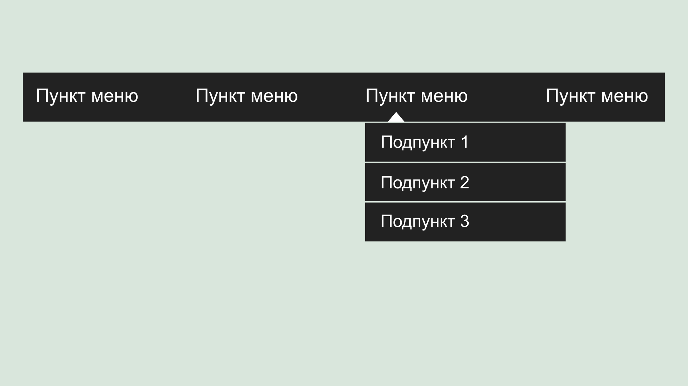
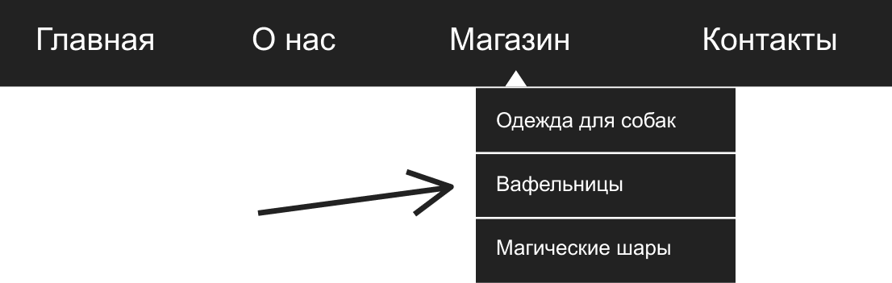
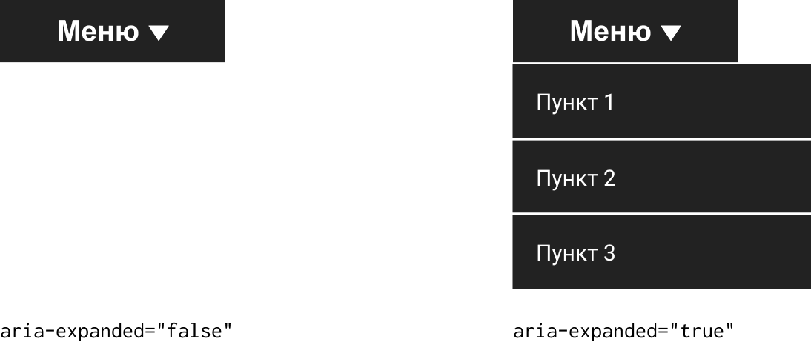
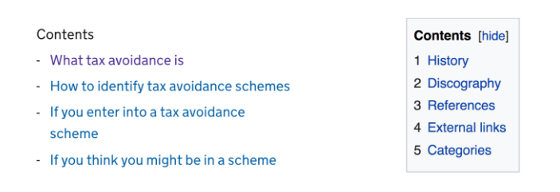
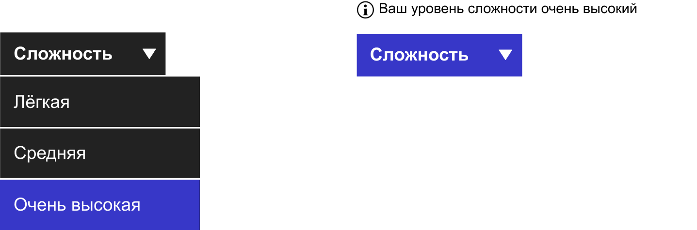
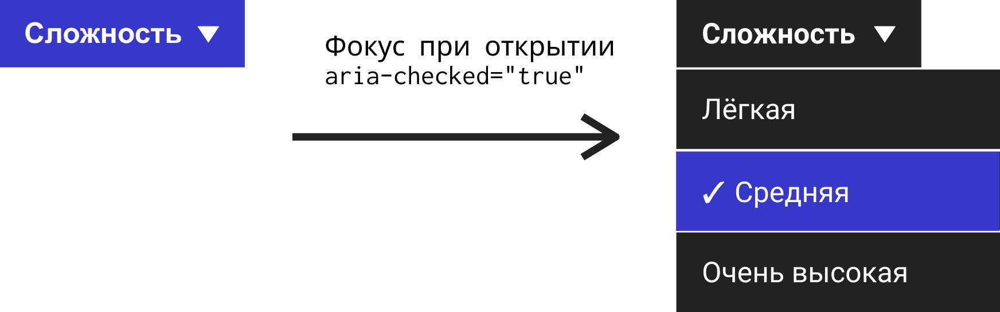

Классифицировать сложно. Например, возьмём крабов. Раки-отшельники, веерные крабы и подковообразные крабы, с точки зрения таксономии, _не настоящие_ крабы, но это не мешает использовать в их названиях слово «краб». Всё становится ещё запутаннее, когда через какое-то время благодаря процессу, называемому _канцеризацией_, ненастоящие крабы эволюционируют, чтобы больше походить на настоящих. Это то, что произошло с королевскими крабами, которые в прошлом были раками-отшельниками. Представьте размеры их раковин!

В дизайне мы часто совершаем такую же ошибку, когда называем разные вещи одинаковыми именами. Они кажутся похожими, но внешность может быть обманчивой. Это плохо сказывается на прозрачности вашей библиотеки компонентов. С точки зрения инклюзивности это может привести к тому, что вы измените нужную семантику и поведение компонента на совершенно противоположные. Пользователи будут ожидать одного поведения, а получат другое.

Классический пример — термин «выпадающий список» (dropdown). В интерфейсах многие вещи «выпадают», включая `<option>` в `<select>`, и подменю навигации со списком ссылок, которое раскрывается с помощью JavaScript. Одинаковые названия — разные явления. Некоторые называют это «выпадающее меню» (pull-down menu), но давайте не вдаваться в подробности.

Выпадающие списки, которые состоят из нескольких пунктов, часто называют «меню». Об этом я и хочу поговорить в этой статье. Мы будем делать _настоящее_ меню, но по пути обсудим их не совсем настоящие реализации.

Давайте начнём с вопроса: является ли блок ссылок с картинки, выпадающий вниз из панели навигации, меню?



Правильный ответ: нет, это не настоящее меню.

То, что навигационная схема состоит из списков или ссылок — давнее соглашение. Оно почти так же давно предписывает, что дополнительная навигация (sub-navigation) должна быть _вложенными_ списками со ссылками. Если бы я удалил стили для компонента, показанного выше, я бы увидел что-то вроде этого списка ссылок, только с Times New Roman и синего цвета.

```md
• [Главная](#)
• [О нас](#)
• [Магазин](#)
    ◦ [Одежда для собак](#)
    ◦ [Вафельницы](#)
    ◦ [Магические шары](#)
• [Контакты](#)
```

С точки зрения семантики вложенные списки со ссылками в этом контексте корректны. Системы навигации на самом деле **оглавления**: именно так они устроены. Единственное, что действительно заставляет думать, что перед нами меню — это стилизация вложенных списков и способ их отображения при наведении курсора или при фокусе.

В этом месте часто ошибаются и начинают добавлять семантику из WAI-ARIA: `aria-haspopup="true"`, `role="menu"`, `role="menuitem"` и так далее. Их можно использовать, но в другом контексте. Вот две причины для этого:

1. ARIA-меню предназначены не для навигации, а для десктопных приложений. Представьте себе систему меню для любого из них.

2. Ссылка верхнего уровня должна быть _ссылкой_. То есть она не ведёт себя как кнопка меню.

Относительно второго пункта: при перемещении по области навигации в подменю ожидаешь, что каждое подменю будет появляться при наведении или при фокусе на ссылке верхнего уровня (например, «Магазин» из примера выше). Это одновременно показывает подменю и размещает ссылки в нём в порядке получения фокуса. С помощью JavaScript можно управлять событиями фокуса (focus) и его потери (blur) и сохранить внешний вид подменю пока это необходимо. При этом те, кто использует для навигации клавиатуру, должны иметь возможность переходить по очереди от одной ссылки каждого уровня к другой.

Кнопки меню, которым задан атрибут `aria-haspopup="true"`, так себя не ведут. Они становятся активными _по клику_ и у них нет другой цели кроме показа скрытого меню.



Как показано на картинке, вне зависимости от того раскрывается меню или скрывается, это будет объявлено благодаря атрибуту `aria-expanded`. Вам нужно только изменить это состояние при клике, а не при фокусе. Пользователи обычно не ожидают явного изменения состояния при простом событии фокуса. На самом деле в нашей системе навигации состояние не изменяется. Это просто трюк со стилизацией. С точки зрения поведения мы можем перемещаться с помощью клавиши Tab так, как если бы не было никакого трюка с показом и скрытием элемента.

## Проблема с навигационными подменю

Навигационные подменю (или для кого-то «выпадающие списки») отлично работают с мышью или с клавиатуры, но не так хороши для касаний. Когда вы в первый раз нажимаете на ссылку верхнего уровня «Магазин» из примера, то сообщаете, что надо открыть подменю и перейти по ссылке.

Здесь есть два возможных варианта решения проблемы:

1. Избежать поведения по умолчанию ссылок верхнего уровня (`e.preventDefault()`) и написать скрипт для полной поддержки семантики и поведения меню WAI-ARIA.
2. Убедиться, что каждая страница, на которую ведёт ссылка верхнего уровня меню, имеет оглавление в качестве альтернативы подменю.

Первое решение не самое хорошее. Я ранее замечал, что этот тип семантики и поведения нежелателен в данном контексте, где ссылки — это управляемые контролы (subject controls). Кроме того пользователи больше не смогут переходить на страницу верхнего уровня, если она есть.

### Какие устройства — сенсорные?

Заманчиво думать: «Это не самое хорошее решение, но я применю его только для сенсорных интерфейсов». Проблема в том, как определить, есть ли у устройства сенсорный экран?

Вам точно не стоит относить любой «маленький экран» к разряду «экранов с сенсорным управлением». Работая в одном офисе с людьми, разрабатывающими сенсорные дисплеи для музеев, я могу заверить вас, что самые большие экраны — сенсорные. Не забывайте о ноутбуках с клавиатурой и сенсорным дисплеем.

К тому же многие, но далеко не все устройства небольшого размера являются сенсорными. В инклюзивном дизайне вы не можете позволить себе предполагать.

Второе решение более инклюзивное и надёжное. Это «фолбэк» для пользователей всех устройств. Но я специально взял в кавычки это слово, потому что думаю, что на самом деле постраничные оглавления — это _лучший_ способ обеспечения навигации.

Похоже, получившая премию [команда Government Digital Services](https://www.gov.uk/guidance/content-design/organising-and-grouping-content-on-gov-uk) с этим согласится. Вы также могли видеть такие оглавления в Wikipedia.



## Оглавление

Оглавления — это навигация для связанных между собой страниц или их разделов, которые должны быть семантически похожи на основные области навигации сайта. Для них используются элементы с `<nav>`, списки и общие подписи к ним.

```html
<nav aria-labelledby="sections-heading">
    <h2 id="sections-heading">Продукты</h2>
    <ul>
        <li><a href="/products/dog-costumes">Одежда для собак</a></li>
        <li><a href="/products/waffle-irons">Вафельницы</a></li>
        <li><a href="/products/magical-orbs">Магические шары</a></li>
    </ul>
</nav>
<!-- Здесь все разделы по порядку -->
```

### Примечания

- В этом примере мы представляем каждый раздел как отдельную страницу, как если бы это было в выпадающем подменю.
- Важно, чтобы каждая страница из «Магазин» имела одинаковую структуру. Поэтому оглавление «Продукты» находится в одном и том же месте. Консистентность улучшает понимание.
- Список группирует элементы, а вспомогательные технологии могут установить их количество и объявить о них, например, с помощью синтезированного голоса в скринридерах.
- Тегу `<nav>` заголовок задан с помощью атрибута `aria-labelledby`. Это означает, что большинство скринридеров объявит «Продукты, навигация» при попадании в область с помощью клавиши Tab. Также это приведёт к тому, что такая навигация будет разбита скринридерами на отдельные элементы, через которые пользователи смогут переходить к областям страницы напрямую.

### Всё на одной странице

Если вы можете поместить все разделы на одной странице, при этом не сделав её слишком длинной и избежав утомительной прокрутки, то так даже лучше. Просто задайте для каждого раздела якорную ссылку. Например, `href="#waffle-irons"` должна вести к `id="waffle-irons"`.

```html
<nav aria-labelledby="sections-heading">
    <h2 id="sections-heading">Продукты</h2>
    <ul>
        <li><a href="#dog-costumes">Одежда для собак</a></li>
        <li><a href="#waffle-irons">Вафельницы</a></li>
        <li><a href="#magical-orbs">Магические шары</a></li>
    </ul>
</nav>
<!-- Здесь раздел с одеждой для собак -->
<section id="waffle-irons" tabindex="-1">
    <h2>Вафельницы</h2>
</section>
<!-- Здесь раздел с магическими шарами -->
```

**Примечание**: в некоторых браузерах фокус плохо переносится на отдельные фрагменты страницы. Добавление `tabindex="-1"` к нужному фрагменту исправляет это.

В случае, если на сайте много контента, лучше тщательно продумывать информационную архитектуру с оглавлениями меню, чем делать ненадёжную и громоздкую систему выпадающих меню. Так будет легче сделать адаптивную версию страницы с меньшим количеством кода, а также это упростит восприятие её структуры. Там, где системы выпадающих меню скрывают структуру, оглавления обнажают её.

На некоторых сайтах, включая правительственный цифровой сервис [gov.uk](https://www.gov.uk/), есть страницы с указателями (или «темами»), которые представляют собой _просто_ оглавления. Это настолько мощная концепция, что популярный генератор статических сайтов Hugo [создаёт такие страницы по умолчанию](https://gohugo.io/templates/lists/).


Информационная архитектура — это важная часть инклюзивности. Плохо организованный сайт может соответствовать нужным вам техническим требованиям, но при этом будет отталкивать многих пользователей. Особенно это касается тех, у кого есть когнитивные нарушения или у кого мало времени на то, чтобы с чем-то долго разбираться.

## Кнопки навигационного меню

Пока мы обсуждаем тему фальшивых навигационных меню, было бы упущением с моей стороны не поговорить про кнопки меню. Вы наверняка видели состоящую из трёх линий иконку-гамбургер или «navicon».

Даже с упрощённой информационной архитектурой и одним уровнем навигационных ссылок пространство на маленьких экранах на вес золота. Скрытие навигации за кнопкой означает, что во вьюпорте будет больше места для основного контента.

Кнопка навигации больше всего из того, что мы изучали, похожа на _настоящую_ кнопку меню. Так как она открывает меню по клику, то она должна:

1. Быть кнопкой, а не ссылкой.

1. Содержать информацию о развёрнутом или свёрнутом состоянии соответствующего меню (которое, строго говоря, представляет собой просто список ссылок).

### Прогрессивное улучшение

Давайте не будем забегать вперёд. Мы должны помнить о прогрессивном улучшении и подумать, как это будет работать без JavaScript.

В изначальном HTML-файле мало что можно сделать с помощью кнопок (кроме кнопок для отправки данных, но они даже близко не связаны с тем, что нам нужно сделать). Может быть, вместо этого, нам следует начать с простой ссылки, которая приведёт нас к навигации?

```html
<a href="#navigation">Навигация</a>
<!-- Тут может быть какой-то контент -->
<nav id="navigation">
    <ul>
        <li><a href="/">Главная</a></li>
        <li><a href="/about">О нас</a></li>
        <li><a href="/shop">Магазин</a></li>
        <li><a href="/content">Контент</a></li>
    </ul>
</nav>
```

Нет особой необходимости использовать ссылку, если между ней и навигацией нет большого количества контента. Так как навигация сайта в большинстве случаев должна размещаться наверху страницы, то в этом решении нет необходимости. Так что, действительно, навигационное меню без JavaScript должно быть просто… навигацией.

```html
<nav id="navigation">
    <ul>
        <li><a href="/">Главная</a></li>
        <li><a href="/about">О нас</a></li>
        <li><a href="/shop">Магазин</a></li>
        <li><a href="/content">Контент</a></li>
    </ul>
</nav>
```

Вы улучшите его, добавив кнопку, которая в исходном состоянии скрывает навигацию с помощью атрибута `hidden`:

```html
<nav id="navigation">
    <button aria-expanded="false">Меню</button>
    <ul hidden>
        <li><a href="/">Главная</a></li>
        <li><a href="/about">О нас</a></li>
        <li><a href="/shop">Магазин</a></li>
        <li><a href="/content">Контент</a></li>
    </ul>
</nav>
```

Некоторые более старые браузеры, сами знаете какие, не поддерживают `hidden`, так что не забудьте учесть это в вашем CSS. Селектор ниже решит эту проблему, так как `display: none` делает то же самое, что и атрибут `hidden`: скрывает меню от вспомогательных технологий и удаляет ссылку из порядка получения фокуса.

```css
[hidden] {
    display: none;
}
```

Делать всё возможное для поддержки старого программного обеспечения — это, конечно, часть инклюзивного дизайна. Некоторый софт невозможно обновить или его разработчики не хотят этого делать.

### Расположение

Многие неправильно размещают кнопку _за пределами_ области (навигации). Это может привести к тому, что пользователи скринридеров, которые перемещаются по `<nav>` с помощью горячих клавиш, решат, что область пустая, что не особо им поможет. Со списком, скрытым от скринридеров, они просто столкнулись бы с этим:

```html
<nav id="navigation">
</nav>
```

Вот как мы можем переключить состояние:

```js
var navButton = document.querySelector('nav button'); navButton.addEventListener('click', function() {
    let expanded = this.getAttribute('aria-expanded') === 'true' || false;
    this.setAttribute('aria-expanded', !expanded);
    let menu = this.nextElementSibling;
    menu.hidden = !menu.hidden;
});
```

## ARIA-controls

Как я уже писал в [«Aria-controls Is Poop»](https://www.heydonworks.com/article/aria-controls-is-poop), атрибут `aria-controls`, который помогает пользователям скринридеров при переходе от контролирующего элемента к контролируемому, поддерживается только в JAWS. Так что на него нельзя положиться.

Без хорошего метода перемещения между элементами, вам нужно убедиться в том, что одно из следующего верно:

1. Первая ссылка раскрывающегося списка — следующая в порядке фокуса после кнопки (как в предыдущем примере кода).
2. При раскрытии списка на первую ссылку сделан фокус.

В нашей ситуации я рекомендовал бы первый вариант. Это намного проще, так как не нужно беспокоиться о перемещении фокуса обратно на кнопку и о том, какие события для этого нужны. Кроме того, сейчас нет ничего, что могло бы предупредить пользователей о том, что фокус будет перемещён в другое место. В настоящих меню, которые мы вскоре обсудим, за это отвечает `aria-haspopup="true"`.

Использование `aria-controls` на самом деле не приносит большого вреда, за исключением того, что делает объявления в скринридере более подробным. Однако некоторым пользователям JAWS это может быть нужно. Вот как будет использоваться атрибут вместе с `id` для списка:

```html
<nav id="navigation">
    <button aria-expanded="false" aria-controls="menu-list">
        Меню
    </button>
    <ul id="menu-list" hidden>
        <li><a href="/">На главную</a></li>
        <li><a href="/about">О нас</a></li>
        <li><a href="/shop">Магазин</a></li>
        <li><a href="/content">Товары</a></li>
    </ul>
</nav>
```

## Меню и роли menuitem

_Настоящее_ меню (с точки зрения WAI-ARIA) должно себя идентифицировать с помощью роли `menu` (для контейнера) и, обычно, роли `menuitem` для дочерних элементов (или других ролей для подобных элементов). Эти роли для родителей и детей работают сообща и предоставляют вспомогательным технологиям нужную информацию. Вот как можно расширить список, добавив для него семантику меню:

```html
<ul role="menu">
    <li role="menuitem">Пункт 1</li>
    <li role="menuitem">Пункт 2</li>
    <li role="menuitem">Пункт 3</li>
</ul>
```

Поскольку наше навигационное меню начинает вести себя как «настоящее» меню, не должно ли тут быть ролей `menuitem`?

Краткий ответ — нет. Более подробный ответ: нет, потому что наши элементы списка содержат ссылки, а [элементы `menuitem` не могут иметь интерактивных потомков](https://w3c.github.io/html-aria/#index-aria-menuitem). То есть они _являются_ контролами в меню.

Мы можем, конечно, удалить семантику списка у элементов `<li>` с помощью [`role="presentation"`](https://www.w3.org/TR/wai-aria/roles#presentation) или `role="none"` (они эквивалентны друг другу) и добавить для каждой ссылки роль menuitem. Однако, это удалит встроенную в них по умолчанию роль `link`. Другими словами, в примере ниже скринридерами будет объявлено: «Главная, пункт меню», а _не_: «Главная, ссылка» или «Главная, пункт меню, ссылка». ARIA-роли просто переопределяют HTML-роли.

```html
<!-- Будет прочитано как «Главная, пункт меню» -->
<li role="presentation">
    <a href="/" role="menuitem">Главная</a>
</li>
```

Мы хотим, чтобы пользователи знали, что они используют ссылку и могут ожидать от неё поведения ссылки, так что пример выше не очень хороший. Как я уже сказал, настоящие меню предназначены для (написанных на JavaScript) приложений.

То, что у нас осталось, это своего рода гибридный компонент, который не совсем настоящее меню, но, по крайней мере, сообщает пользователям, открыт ли список ссылок, благодаря состоянию `aria-expanded`. Это подходящий паттерн для навигационных меню.

### Примечание. Элемент `<select>`

Если вы давно знакомы с адаптивным дизайном, то можете вспомнить паттерн, в котором навигация была свёрнута в элемент `<select>` в небольших вьюпортах.


Как и в случае с [переключателями на основе чекбоксов, которые мы обсуждали](https://inclusive-components.design/toggle-button/) _([см. в переводе](https://medium.com/web-standards/toggle-buttons-a41388e80974) — прим. переводчика)_, использование нативного элемента, который ведёт себя не так, как задумано, без дополнительного скрипта, — хороший выбор. Особенно с точки зрения эффективности и производительности в случае мобильных устройств. Элементы `<select>` — это своего рода меню, с семантикой, аналогичной меню, открывающееся кнопкой, которую мы скоро будем создавать.

Однако, так же как и с переключателем, основанном на чекбоксе, мы используем элемент, связанный со вводом данных, а не просто делаем выбор. Это может запутать многих пользователей, тем более, что этот шаблон использует JavaScript, чтобы выбранный элемент `<option>` вёл себя как ссылка. Неожиданное изменение контекста, которое это вызывает, считается ошибкой согласно критерию [3.2.2 On Input (Level A)](https://www.w3.org/TR/WCAG20/#consistent-behavior-unpredictable-change).

## Настоящие меню

Теперь, когда мы обсудили ненастоящие меню и квази-меню, пришло время создать _настоящее_ меню, которое открывается и закрывается настоящей кнопкой меню. С этого момента я буду называть вместе кнопку и меню — «кнопкой меню».

Но в каком случае наша кнопка меню может считаться настоящей? Что ж, это будет компонент меню, предназначенный для выбора параметров в приложении, который предусматривает всю нужную семантику и стандартное поведение для такого инструмента.

Как я уже упоминал, эти соглашения пришли из дизайна десктопных приложений. ARIA-атрибуты и управление фокусом с помощью JavaScript необходимы для их полной имитации. Одна из целей ARIA — помочь веб-разработчикам создавать сложные веб-интерфейсы и не нарушать при этом устоявшие паттерны взаимодействия, пришедшие из реального мира.

В этом примере мы представим, что наше приложение — это какая-то игра или викторина. Наша кнопка меню даёт пользователю выбрать уровень сложности. С учётом всей семантики меню выглядит следующим образом:

```html
<button aria-haspopup="true" aria-expanded="false">
    Сложность
    <span aria-hidden="true">&#x25be;</span>
</button>
<div role="menu">
    <button role="menuitem">Лёгкая</button>
    <button role="menuitem">Средняя</button>
    <button role="menuitem">Очень высокая</button>
</div>
```

### Примечания

- `aria-haspopup` просто указывает на то, что кнопка скрывает меню. Это работает как предупреждение о том, что при нажатии на кнопку пользователь будет перемещён в выпадающее меню (скоро мы рассмотрим поведение фокуса). Его значение не меняется: оно всегда `true`.
- Элемент `<span>` внутри кнопки содержит символ Юникод с маленьким чёрным перевёрнутым треугольником. Он визуально показывает, что нажатие на кнопку раскроет что-то под ней. Этого `aria-haspopup` не может показать. Атрибут `aria-hidden="true"` не разрешает скринридерам объявлять «перевёрнутый треугольник» или что-то подобное. Благодаря `aria-haspopup` этого не нужно делать в невизуальном контексте.
- `aria-haspopup` дополняет `aria-expanded`. Атрибут сообщает пользователю, находится ли он в данный момент в открытом (развёрнутом) меню или оно закрыто (свёрнуто), переключаясь между значениями `true` и `false`.
- Само меню имеет (точно названную) роль `menu`. Для него нужны потомки с ролями `menuitem`. Они не обязательно должны быть прямыми потомками элемента `menu`. В этом примере так сделано для простоты.

## Клавиатура и поведение при фокусе

Когда дело доходит до того, чтобы сделать интерактивные контролы доступными для клавиатуры, лучшее, что вы можете сделать, это использовать правильные элементы. Поскольку здесь используются элементы `<button>`, то мы можем быть уверены в том, что события по клику будут срабатывать при нажатии клавиш Enter и Space, как указано в [HTMLButtonElement interface](https://developer.mozilla.org/en/docs/Web/API/HTMLButtonElement). Также это означает, что мы можем отключить пункты меню, используя связанное с кнопкой свойство `disabled`.

Есть намного больше способов взаимодействовать с кнопкой с клавиатуры. Вот краткий обзор поведения при фокусе с клавиатуры, которое мы будем реализовывать на основе [WAI-ARIA Authoring Practices 1.1](https://www.w3.org/TR/wai-aria-practices-1.1/#menubutton):

- **Enter, Space или ↓ на кнопке меню** — открывает меню.
- **↓ на пункте меню** — перемещает фокус к следующему пункту меню или к первому, когда вы дошли до последнего пункта.
- **↑ на пункте меню** — перемещает фокус к предыдущему пункту меню или к последнему, если вы находитесь на первом.
- **↑ на кнопке меню** — закрывает меню, если оно открыто.
- **Esc на пункте меню** — закрывает меню и перемещает фокус на кнопку меню.

Преимущество перемещения фокуса между пунктами меню с помощью клавиш со стрелками состоит в том, что за Tab сохраняется функция выхода из меню. На практике это означает, что пользователям не нужно проходить через каждый пункт меню, чтобы выйти из меню. Это значительно улучшает юзабилити, особенно в меню, где много пунктов.

Добавление `tabindex="-1"` к пунктам меню делает их недоступными для фокуса с помощью Tab, но сохраняет возможность фокуса на элементах при нажатии на клавиши со стрелками.

```html
<button aria-haspopup="true" aria-expanded="false">
    Сложность
    <span aria-hidden="true">&#x25be;</span>
</button>
<div role="menu">
    <button role="menuitem" tabindex="-1">Лёгкая</button>
    <button role="menuitem" tabindex="-1">Средняя</button>
    <button role="menuitem" tabindex="-1">Очень высокая</button>
</div>
```

## Метод `open`

Мы можем создать методы для обработки различных событий как часть продуманного дизайна API.

Например, метод `open` нужен для переключения значения `aria-expanded` на `true`, изменить значение меню `hidden` на `false` и сделать фокус на первом элементе меню с `menuitem`, который не скрыт:

```js
MenuButton.prototype.open = function () {
    this.button.setAttribute('aria-expanded', true);
    this.menu.hidden = false;
    this.menu.querySelector(':not([disabled])').focus();

    return this;
}
```

Мы можем исполнить этот метод, когда пользователь нажимает клавишу вниз на кнопке меню, на которой сделан фокус:

```js
this.button.addEventListener('keydown', function (e) {
    if (e.keyCode === 40) {
        this.open();
    }
}.bind(this));
```

Кроме того, разработчик, использующий этот скрипт, сможет теперь программно открывать меню:

```js
exampleMenuButton = new MenuButton(
    document.querySelector('[aria-haspopup]')
);
exampleMenuButton.open();
```

### Примечание. Хак с чекбоксом

Если вам не нужен JavaScript, то лучше не использовать его настолько, насколько это возможно. Использование третьей технологии поверх HTML и CSS всегда усложняет систему и приводит к появлению в ней слабых мест. Однако не все компоненты можно создать без использования JavaScript.

В случае с кнопками меню желание сделать их «работающими без JavaScript» привело к появлению так называемого хака с чекбоксом. В нём состояние `checked` (или `unchecked`) скрытого чекбокса используется для переключения видимости элемента меню с помощью CSS.

```css
/* Меню закрыто */
[type="checkbox"] + [role="menu"] {
    display: none;
}

/* Меню открыто */
[type="checkbox"]:checked + [role="menu"] {
    display: block;
}
```

Для пользователей скринридеров роль чекбокса и состояние `checked` бессмысленны в этом контексте. Это можно частично исправить, добавив `role="button"` для чекбокса.

```html
<input type="checkbox" role="button" aria-haspopup="true" id="toggle">
```

К сожалению, это отменяет взаимодействие со встроенным состоянием `checked`, лишая нас обратной связи о состоянии элемента без JavaScript (что плохо, хотя в этом контексте это было бы так же связано с состоянием `checked`).

Но это _возможно_ имитировать с помощью `aria-expanded`. Нам просто нужно добавить наш лейбл к двум элементам со `<span>`, как показано ниже.

```html
<input type="checkbox" role="button" aria-haspopup="true" id="toggle" class="vh">
<label for="toggle" data-opens-menu>
    Сложность
    <span class="vh expanded-text">развёрнуто</span>
    <span class="vh collapsed-text">свёрнуто</span>
    <span aria-hidden="true">&#x25be;</span>
</label>
```

Оба этих элемента визуально скрыты благодаря [классу `visually-hidden`](http://a11yproject.com/posts/how-to-hide-content/), но, в зависимости от того в каком состоянии мы находимся, только один из них скрыт от скринридера. То есть только одному задано свойство `display: none` и это определяется установленным (но не объявляемым) состоянием `checked`:

```css
/* Класс, который скрывает визуально элементы со <span> */
.vh {
    position: absolute !important;
    clip: rect(1px, 1px, 1px, 1px);
    padding:0 !important;
    border:0 !important;
    height: 1px !important;
    width: 1px !important;
    overflow: hidden;
}

/* Отобразить правильное состояние для скринридеров
    с помощью текущего состояния элемента */
[type="checkbox"]:checked + label .expanded-text {
    display: inline;
}

[type="checkbox"]:checked + label .collapsed-text {
    display: none;
}

[type="checkbox"]:not(:checked) + label .expanded-text {
    display: none;
}

[type="checkbox"]:not(:checked) + label .collapsed-text {
    display: inline;
}
```

Это разумное решение, но работа над нашей кнопка меню всё ещё не закончена. Ожидаемое поведение фокуса, которое мы обсудили, просто не может быть реализовано без JavaScript.

Такое поведение принято и предсказуемо, оно делает кнопку более удобной. Однако, если вам действительно нужно сделать кнопку меню без JavaScript, то это самый подходящий вариант. Учитывая то, что урезанная кнопка навигационного меню, которую я рассмотрел ранее, предлагает контент меню, который _не_ зависит от самого JavaScript (то есть ссылки), этот подход может быть подходящим вариантом.

Забавы ради, [вот CodePen c кнопкой меню без JavaScript](https://codepen.io/heydon/pen/afdeffcc8a349ab8138e32573ec85cd3).

<iframe src="https://medium.com/media/03d2ec33ba6feba09a1a7971cb794343"></iframe>

**Примечание**: меню открывает только пробел.

## Событие `choose`

Исполнение некоторых методов должно вызывать события, чтобы мы могли настроить обработчики событий. Например, мы можем транслировать событие `choose`, когда пользователь кликает по пункту меню. Мы можем установить это с помощью `CustomEvent`, которое даёт нам возможность передавать аргумент в свойство события `detail`. В этом случае аргумент (`choice`) будет узлом DOM выбранного пункта меню.

```js
MenuButton.prototype.choose = function (choice) {
    // Определить событие 'choose'
    var chooseEvent = new CustomEvent('choose', {
        detail: {
            choice: choice
        }
    });
    // Передать событие (Dispatch the event)
    this.button.dispatchEvent(chooseEvent);

    return this;
}
```

Есть много всего, что мы можем сделать с помощью этого механизма. Возможно, у нас есть live region с `id` со значением `menuFeedback`:

```html
<div role="alert" id="menuFeedback"></div>
```

Теперь мы можем настроить обработчик событий и заполнить live region информацией, скрытой внутри события:

```js
exampleMenuButton.addEventListener('choose', function (e) {
    // Получить текст узла (label)
    var choiceLabel = e.details.choice.textContent;

    // Получить узел live region
    var liveRegion = document.getElementById('menuFeedback');

    // Заполнить live region
    liveRegion.textContent = `Your difficulty level is    ${choiceLabel}`;
}):
```

<figure>
    
    <figcaption>
        Когда пользователь выбирает пункт, меню закрывается и фокус перемещается на кнопку меню. Для пользователей важно возвращаться к такому элементу после закрытия меню.
    </figcaption>
<figure>

При выборе пункта меню пользователь скринридера услышит: _«Вы выбрали [название пункта меню]»_. Изменения контента live region (которому задан здесь атрибут `role="alert"`) объявляются скринридерами при каждом его обновлении. Live region не является обязательным, но это пример того, что может произойти в интерфейсе, когда пользователь сделал выбор в меню.

## Сохранение выбора

Не все пункты меню нужны для выбора сохранения настроек. Многие из них ведут себя как стандартные кнопки, которые при нажатии приводят к тому, что что-то происходит в интерфейсе. Однако, в случае с нашей кнопкой меню со сложностью, мы хотели бы указать текущую настройку сложности. То есть ту, которая выбрана последней.

Атрибут `aria-checked="true"` работает для элементов, которым вместо `menuitem` задана роль `menuitemradio`. Расширенная разметка со вторым выбранным элементом _(установленным)_ выглядит так:

```html
<button aria-haspopup="true" aria-expanded="false">
    Сложность
    <span aria-hidden="true">&#x25be;</span>
</button>
<div role="menu">
    <button role="menuitemradio" tabindex="-1">Лёгкая</button>
    <button role="menuitemradio" aria-checked="true" tabindex="-1">Средняя</button>
    <button role="menuitemradio" tabindex="-1">Очень высокая</button>
</div>
```

В нативных меню на многих платформах выбранные элементы отмечаются с помощью галочек. Мы можем это без проблем сделать, используя чуть больше CSS:

```css
[role="menuitem"][aria-checked="true"]::before {
    content: '\2713\0020';
}
```

При перемещении по меню с запущенным скринридером при фокусе на этом выбранном элементе он объявит что-то вроде: _«Галочка, средний, пункт меню, выбрано»_.

Поведение при открытии меню с выбранным `menuitemradio` немного отличается. Вместо того, чтобы сделать фокус на первом (включённом) элементе в меню, фокус устанавливается на _выбранном_ элементе.



Какая польза от такого поведения? Пользователь (любой) помнит о своём предыдущем выборе. В меню с многочисленными параметрами (например, с масштабом), люди, работающие на клавиатуре, находятся в оптимальном положении для изменения настроек.

## Использование кнопки меню с помощью скринридера

В этом видео я покажу вам как использовать кнопку меню в VoiceOver и Chrome. В примере используются элементы с ролью `menuitemradio`, атрибутом `aria-checked` и обсуждается поведение кнопки при фокусе. Таким образом ведут себя и другие популярные скринридеры.

<iframe width="560" height="315" src="https://www.youtube.com/embed/Aw_HMHdId88" allowfullscreen></iframe>

### Расшифровка

**Хейдон:** Это кнопка меню со сложностью и я собираюсь протестировать её на VoiceOver в Chrome. Для начала я сделаю фокус на самой кнопке.

**VoiceOver:** Сложность, всплывающая кнопка.

**Хейдон:** Сначала вы услышите «Сложность» — это подпись. Затем «всплывающая кнопка», что означает её состояние, что ей задано `area-expanded="false"` и что она всплывающая, потому что для неё установлено значение `true` в атрибуте `aria-haspopup`.
Сейчас я открою меню с помощью клавиши со стрелкой вниз.

**VoiceOver:** Галочка, очень сложно, пункт меню, выбран, меню, пять пунктов.

**Хейдон:** Здесь много информации. Для начала «Галочка, очень сложная». Это подпись. Я использую псевдо-элемент для того, чтобы добавить галочку. «Пункт меню», потому что в этом случае это пункт меню с ролью `menuitemradio`. «Выбран», потому что задан атрибут `aria-checked` со значением `checked`. И также вы слышите, что в меню пять пунктов. Это потому, что этот пункт меню вместе с другими находится внутри элемента, которому задана роль `menu`.
Сейчас я нажму на кнопку со стрелкой вниз, чтобы сделать фокус на пункте «Очень высокая».

**VoiceOver:** Очень высокая, пункт меню.

**Хейдон:** На этот раз вы услышали только подпись и роль элемента, потому что он очевидно не выбран. Для того, чтобы выбрать этот пункт, я нажимаю кнопку Enter.

**VoiceOver:** Сложность, всплывающая кнопка.

**Хейдон:** Это закрывает меню и перемещает фокус на саму кнопку меню «Сложность». Итак, вы вернулись туда, откуда начали.

## Инклюзивная кнопка меню на Github

Я и [Хьюго Жирадель](https://twitter.com/HugoGiraudel) вместе работали над созданием компонента кнопки меню с фичами API, которые я описал, и ещё многим другим. Вы должны поблагодарить Хьюго за многие из этих фич, так как они основывались на работе над a11y-dialog — доступным модальным окном. Он есть на [Гитхабе](https://github.com/Heydon/inclusive-menu-button) и в npm.

```sh
npm i inclusive-menu-button --save
```

Кроме того, Хьюго сделал специально для вас [версию кнопки на React](https://github.com/HugoGiraudel/react-menu-button).

## Чеклист

- Не используйте семантику ARIA для меню в случае с системами навигационных меню.
- На сайтах с большим количеством контента не скрывайте структуру в выпадающих меню.
- Используйте `aria-expanded` у кнопок для того, чтобы сообщить о том, что навигационное меню открыто или закрыто.
- Убедитесь, что навигационное меню следующее в порядке фокуса после кнопки, которая его открывает и закрывает.
- Никогда не жертвуйте юзабилити ради решений без JavaScript. Это заносчиво.
