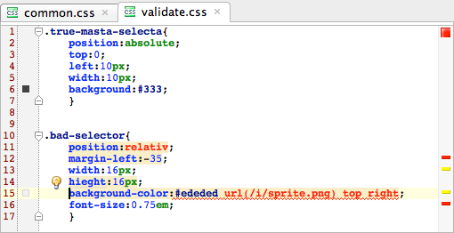
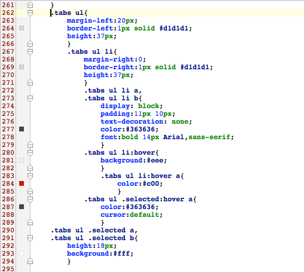
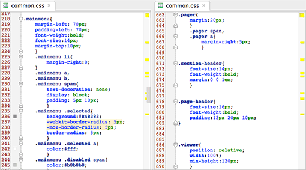
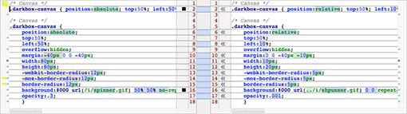
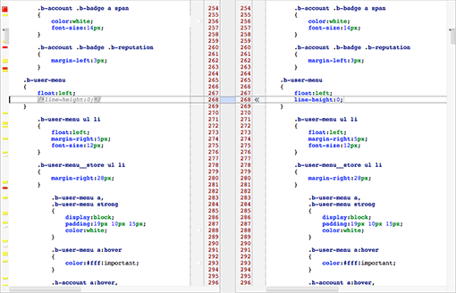

Предлагаю вашему вниманию моё видение наиболее удобной методики форматирования CSS-кода. Я знаю, что вопрос этот достаточно холиварный, однако материалов, статей или другого рода информации по этому вопросу очень мало, поэтому я постараюсь аргументированно раскрыть причины существования как многострочного, так и однострочного форматирования, рассказать о том, к чему приводит применение каждого из них и проанализировать, помогает или мешает выбранный стиль в работе.

Для начала определимся в терминологии. В CSS-коде у нас есть: блок правил — селектор и список правил для него; каждое правило состоит из свойства и его значения.

Есть два варианта форматирования CSS-кода, иначе говоря, расположения правил: однострочный и многострочный, а также их комбинации. Однострочное форматирование, правила для селектора записаны в одну строку:

```css
.example { position: absolute; top: 10px; display: block; width: 10px; height: 10px; background: url(icon.png) no-repeat }
```

Многострочное форматирование, каждая пара `свойство: значение` на новой строке:

```css
.example {
    position: absolute;
    top: 10px;
    display: block;
    width: 10px;
    height: 10px;
    background: url(icon.png) no-repeat;
}
```

Однострочный способ хорош в «наборах», «батареях» селекторов с одинаковыми свойствами. Например, там, где одно свойство принимает разные значения:

```css
.tag-cloud .xs    { font-size: 0.5em }
.tag-cloud .s     { font-size: 0.75em }
.tag-cloud .m     { font-size: 1em }
.tag-cloud .l     { font-size: 1.25em }
.tag-cloud .xl    { font-size: 1.5em }
.tag-cloud .xxl   { font-size: 1.75em }
```

Многострочный: перфекционистский, безопасный, наглядный. Давайте разберем по порядку все его преимущества.

## Анализ

Работа с кодом — это операции написания, поиска и редактирования текста. Чтобы работать результативно, нужно преследовать две цели:

### Цель №1: минимизация шанса на ошибку

Некоторые из ошибок бывают вполне безобидны (вроде дублирования одного и того же свойства или одновременного использования двух взаимоисключающих), а некоторые могут быть критичны. Например, ошибочное переопределение или опечатка, которая блокирует работу следующих свойств.

### Цель №2: скорость восприятия свойств

Основной труд при написании CSS файла — это объявление значений определенных свойств. Значит, нужно иметь набор этих свойств наглядно и под рукой, в рамках одного селектора.

Разве вам нужно следить за огромным количеством строк одновременно? Посмотрите, например, как думает программист, пишущий новую функцию. Его внимание сосредоточено только на этой функции. Так и у верстальщика — работа идет одновременно только с одним селектором. Столбик — самая наглядная запись. Он является потомком примитивного _списка в столбик_. Вы же не будете отрицать, что вытянутые в строку элементы списка теряют в доступности?

Например, довольно трудно найти отдельный элемент этого списка:

```css
Я полюбил { Машеньку: болтушку; Юшечку: тихоню; Лизоньку: умницу; Алиночку: скромницу; }
```

Гораздо проще найти нужный нам пункт в таком виде:

```css
Я полюбил {
    Машеньку: болтушку;
    Юшечку: тихоню;
    Лизоньку: умницу;
    Алиночку: скромницу;
}
```

Не нужно думать, что HTML-верстка это нечто обособленное в плане написания кода. Обратите внимание на практики, которые используют программисты, пишущие на JavaScript, PHP или Perl. Пара `свойство:значение` в CSS — это объявление той же переменной, только с ограниченным вариантом значений.

Пример JavaScript-кода:

```js
function example() {
    var position = 'absolute', display = 'block', width = 10, height = 10, background = 'icon.png';
    // …
}
```

То же самое, но в традиционном для JavaScript стиле форматирования:

```js
function example() {
    var position = 'absolute',
        display = 'block',
        width = 10,
        height = 10,
        background = 'icon.png';
    // …
}
```

Теперь давайте вернёмся и еще раз перечитаем как [сформулирована цель №2](#target-2): ключевое слово _«свойства»_. Нам не так часто приходится править селектор или расположение блоков с селекторами, но очень часто приходится править набор правил, иметь ввиду значение свойств, следить, какие уже объявлены, а каких еще нет. Именно поэтому важно **сконцентрировать** свое внимание на наборе правил.

## Автоматизация

Помимо привычного нам ручного копания в коде, можно использовать автоматические решения. Далее речь пойдет о тех приемах, которые каждый способен применять в IntelliJ IDEA. Возможно, ваш любимый редактор кода тоже способен на нечто подобное.

Среди автоматических способов решения проблем первым стоит упомянуть построчную валидацию CSS-свойств в рамках селектора. Пусть машина помогает вам находить опечатки и проблемные фрагменты кода:



При многострочном форматировании сложнее пропустить:

- переопределение одного правила другим и уже объявленное правило;
- пропущенную `;` в последовательности правил;
- незаметные опечатки, вроде `height` и `heigth`;
- хаки.

### Визуализация цветов

У каждой строки с использованием цветового кода мой редактор визуализирует цвет. Это нагляднее. Привлекает внимание быстрее. Еще один способ быстро найти нужное.



### Порядок свойств, селекторов, решений

Организация свойств и селекторов поможет вам значительно улучшить понимание и читабельность кода, ускорить доступ к тем или иным решениям. Вы можете работать самостоятельно или в команде, над одним файлом или над гигантским проектом. В любой ситуации порядок будет на вашей стороне.

Я рекомендую разбить ваш CSS на три части. Это может быть как в прямом смысле разделение по файлам, так и просто мысленное принятие этого правила. Первая часть — это сброс умолчаний, так называемый reset.css, вторая — правила для HTML-тегов, третья — объявления классов и уникальных идентификаторов. Любой из этих частей может и не быть, но так можно организовать порядок на верхнем уровне. В каждой из этих частей всё тоже можно организовать: теги сгруппировать по функциональному признаку, классы и идентификаторы по решениям.

После того, как сделано всё вышесказанное, возникает вопрос: как организовать свойства в рамках одного селектора — по алфавиту, по длине записи, по частоте использования? Эти методы не годятся потому, что организация, навязываемая ими, не отвечает нашим целям. Вот, например, всё отсортировано по алфавиту, и чтобы увидеть какой `z-index` у абсолютно позиционированного блока, нужно выискивать его вдалеке от `position:absolute`, а свойство `left` совершенно неочевидно будет соседствовать с `letter-spacing`.

Наиболее правильный метод — это функциональная группировка. Например: позиционирование, поведение блока, размеры, цвета и т.д. Один из наиболее продуманных вариантов сортировки есть [в документации к проекту Zen Сoding](http://code.google.com/p/zen-coding/wiki/ZenCSSPropertiesEn).

Случается, что вам приходится работать с неопрятным кодом, доставшимся вам от других разработчиков. В этом случае можно автоматически пересортировать CSS-свойства в нужном вам порядке утилитой [CSScomb](http://csscomb.ru/).

### Дополнительное окно

Несколько окон для одного файла позволяют удобно работать с отдаленными участками кода. Можно подсмотреть решение, скопировать, сверить с чем-то. Опять-таки, я берегу внимание, избавляюсь от беготни по файлу вверх и вниз.

<a href="images/split-view.png">
    
</a>

### Сравнение содержимого построчно

Вы можете писать однострочный CSS, но вполне вероятно что вы вырастете до работы над большими проектами с множеством файлов и большим объемом CSS. Вам придётся работать с системой контроля версий, построением проекта и другими разработчиками в вашей команде. Обратите внимание на то, что разница между двумя файлами вычисляется именно построчно, и при однострочной записи вам будет труднее выявить различия, так как строка будет различаться сразу несколькими свойствами:

<a href="images/diff.png">
    
</a>

### Доступ по селектору через поиск

Один из главных аргументов _однострочников_ сводится к тому, что перед глазами сразу располагаются только нужные селекторы. Процесс поиска нужных селекторов можно банально и очень эффективно автоматизировать при помощи поиска по файлу или проекту. Пусть машина ищет, пока вы экономите своё драгоценное внимание. Никакого просматривания глазами и выискивания. Никакой прокрутки. Не напрягайте глаза больше, чем это реально нужно.

### Доступ к свойству конкретного селектора по номеру строки

Номер строки можно найти так: проинспектировать нужный блок в верстке с помощью Firebug, Web Inspector или Dragonfly, затем найти нужный селектор, который срабатывает для данного блока и подсмотреть номер строки и имя файла. Далее дело техники и знания горячих клавиш вашего любимого редактора. Объем CSS-кода и его растянутость (излишняя, как считают некоторые) не имеет никакого значения в этом случае.

### Комментирование

При построчной записи удобнее комментировать конкретное свойство. Например напомнить, что оно переопределено в файле ie6.css. Или указать, что эта ширина может меняться в зависимости от наличия другого класса.

<a href="images/comment.png">
    
</a>

Взгляните, как комментируют свой код программисты — люди высокой организации мышления. Сложно оставить комментарий-послание себе или другим специалистам, если у вас однострочный код. И не говорите, что это вам не нужно. Когда понадобится неожиданно — будет мучительно неудобно.

При должной сноровке и знании горячих клавиш вашего любимого редактора закомментировать одно свойство на одной строке — легко. Комментарий `/* … */` автоматически обхватит свойство в многострочной записи. В однострочной записи вам недоступна такая роскошь. <q>А я комментирую, ломая имя свойства иксиком или другим символом</q> — детский сад, и к тому же небезопасно для обработки браузером дальнейшего кода. Не стоит испытывать на прочность CSS-парсеры.

### А у меня CSS меньше и быстрее

Теперь о мнениях из серии <q>я пишу код в одну строку потому, что так посетители не грузят пробелы или символы табуляции</q>.

Версия в разработке и версия в бою — разные вещи. Версия для разработки должна быть максимально заточена под нужды разработчика и способствовать минимизации шансов на ошибку или опечатку из-за невнимательности. Для боевой версии актуальны совсем другие вещи: количество запросов к серверу, объем кода, актуальность загрузки всего кода сразу либо по частям, обфускация.

## В итоге

Рекомендую пересилить себя и в целях повышения продуктивности, как личной, так и вашего проекта в целом, задуматься: почему вы пишете именно так? Может дело в простой привычке? Если вы преследуете [цель №1](#target-1) и [цель №2](#target-2), то настоятельно рекомендую переходить на многострочный стиль.

### Дополнительное чтение

- [CSS-менеджмент. Три года спустя](http://vimeo.com/17498225), доклад Вадима Макеева;
- [Eclipse: знакомство с Ant](http://www.artlebedev.ru/tools/technogrette/soft/eclipse-ant/), статья Сергея Чикуёнка;
- [CSScomb.ru](http://csscomb.ru/), инструменты для сортировки CSS-свойств.
