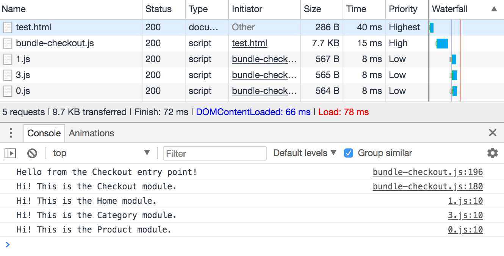

## Обзор проблемы

Мы с коллегами пишем клиентское приложение на нативном JS, которое разбивается на маршруты. Маршруты — это способ организации структуры сайта. Они как правило привязаны к отдельным URL. Таким образом, в интернет-магазине вы можете иметь различные маршруты, такие как главная, список категорий, страница продукта, и страница оформления заказа, каждый из которых может иметь свой собственный JavaScript. Например, для списка категорий может потребоваться код для обработки фильтрации, а для страницы оформления заказа может потребоваться иной код (для валидации формы).

Однако мы не создаем полностью клиентское приложение. Пользователь может попасть на сайт через различные страницы, например, ввести URL в адресную строку и загрузить главную страницу, или найти интересный продукт в поисковике и перейти прямо на страницу описания этого продукта. Поэтому каждый из этих маршрутов должен иметь свою собственную структуру URL:

```
Home: /
Category listing: /category/42
Product page: /product/1234
Checkout: /checkout
```

Кроме того, нам не нужно загружать весь JavaScript для всех маршрутов, когда сайт впервые открыт. В идеале, нам достаточно кода для того маршрута, который был открыт, а остальное можно подгружать, когда пользователь переходит на другие страницы сайта. Но если вы делаете единый бандл, то вы получите один массивный файл, который должен быть полностью загружен и проанализирован, прежде чем что-либо произойдет:

```
dist/
    big-bundle.js
```

Это не лучшее решение, ведь подгружается много JavaScript, который не используется. При медленном подключении это может означать, что пользователю придется подождать довольно долгое время, прежде чем начать взаимодействовать со страницей. Вот почему большие бандлы являются антипаттерном.

Вот где нам поможет концепция **точки входа**. Вместо того, чтобы иметь единый главный файл, мы решили иметь точку входа для каждого маршрута, при этом оставшиеся маршруты лениво загружаются по мере необходимости. В конечном итоге мы получим следующее:

```
dist/
    bundle-home.js
    bundle-category.js
    bundle-product.js
    bundle-checkout.js
    home.js
    category.js
    product.js
    checkout.js
```

В зависимости от маршрута, будет загружен только один из файлов пакета. Этот файл будет лениво загружать другие модули, по мере необходимости. И если пользователь открыл продукт, то загрузится только bundle-product.js, необходимый для текущей страницы , а затем лениво подгрузятся home.js, category.js и checkout.js , если это необходимо.

Это решение позволяет загружать весь необходимый код для выполнения немедленного запроса пользователя и только при необходимости загружать остальной. И хотя это и включает в себя один и тот же код в нескольких файлах, фактически пользователь должен загружать только одну версию каждого модуля при навигации по сайту.

## Webpack и модули

Существует миф, что Webpack трудно сконфигурировать, чтобы использовать его в большинстве ситуаций. Я использую Webpack недавно, и не могу судить насколько было правдиво это утверждение в прошлом, но оказывается, что сейчас Webpack довольно прост в использовании! Если вы знакомы с ES-модулями, статическим и динамическим импортом, вы в значительной степени готовы к созданию некоторых сложных приложений с хорошей практикой загрузки и без особых навыков конфигурирования.

Webpack понимает стандартизированный синтаксис ES-модулей, а также статическую и динамическую загрузку модулей. Он смотрит на ваш код и решает, как разделить его на пакеты в зависимости от того, какой тип импорта вы делаете. Таким образом, если вы загружаете модуль статически, он будет в бандле:

```js
import Foo from './foo.js';
Foo.doSomething();
```

Приведенные выше результаты соберутся в один файл bundle.js со всем кодом. Если вместо этого вы загружаете его динамически, то Webpack будет создавать отдельный бандл и получать дополнительный код по требованию:

```js
import('./foo.js').then(module => {
    module.doSomething();
});
```

Приведенные выше результаты соберутся в bundle.js с некоторой магической ленивой загрузкой, и файл 0.js с кодом для foo. 0.js называется «чанком» в терминологии, предназначенной для ленивой загрузки другим кодом Webpack, и не обрабатывается непосредственно собственным кодом.

## Множественные точки входа и роутинг

Хорошо, похоже, что все готово! Вы можете написать стандартизированный код модуля, который будет работать как изначально в браузере (если ваш браузер уже добавил поддержку), так и через некоторую магию в Webpack.

Итак, давайте напишем код и посмотрим, как это на самом деле выглядит. Я вернусь к исходному примеру и использую маршруты для страниц категории, продукта, оформления заказа и главной, а также соответствующую точку входа для каждого из них.

Модули довольно просты. Вы можете создать один метод с любым именем, так как содержание не имеет значения для примера:

```js
export function printMessage() {
    console.log('Hi! This is the Checkout module.');
}
```

Каждый файл точки входа будет загружать соответствующий модуль статически, а остальные модули динамически. Чтобы избежать дублирования кода, вам нужно создать простой, последовательный интерфейс для определения всего остального. Вот пример, который я называю Router.

***Примечание:** хоть этот пример и не будет делать какие-либо фактические маршрутизации, в традиционном смысле, он будет определять какой код будет загружаться по маршруту. Так что я все еще думаю, что это нормальное имя:)

```js
const _modules = {
    Home: import('./home.js'),
    Category: import('./category.js'),
    Product: import('./product.js'),
    Checkout: import('./checkout.js'),
};

export default class Router {
    static get modules() {
        return _modules;
    }
}
```

Каждый модуль хранится как запись в объекте _modules, причем значение является промисом загрузки, возвращаемым import(). Обратите внимание, что это немедленно начнет загружать другие маршруты, которые вам, возможно, не понадобятся, но в этом случае вы всегда можете отложить загрузку явным вызовом, который вызовет фактический импорт. Например:

```js
const _modules = {
    Home: () => import('./home.js'),
    Category: () => import('./category.js'),
    Product: () => import('./product.js'),
    Checkout: () => import('./checkout.js'),
};

export default class Router {
    static get modules() {
        return _modules;
    }
}
```

Но если все четыре модуля загружаются лениво, как избежать дублирования кода в точке входа? Безусловно, один из них должен быть null?

На самом деле в этом нет необходимости! Браузер (с поддержкой модулей) и Webpack делают дедупликацию, где они отслеживают, какие модули были загружены, чтобы они не загружались дважды. Таким образом, вам, как разработчику, не нужно беспокоиться о том, чтобы отслеживать что-либо из этого. Это делает точку входа действительно чистой и легкой для понимания:

```js
import * as Home from './home.js';
import Router from './router.js';

console.log('Hello from the Home entry point!');

Router.modules.Home().then(module => module.printMessage());
Router.modules.Category().then(module => module.printMessage());
Router.modules.Product().then(module => module.printMessage());
Router.modules.Checkout().then(module => module.printMessage());
```

Главная загружается статически, так что она сразу же доступна и не требует ожидания ленивой загрузки. Router также загружается статически. После того, как вы сделаете запрос к Router, он проверяет, был ли загружен этот модуль либо статически, либо динамически. Если он уже был загружен, промис немедленно разрешается. Если этого не произошло, он извлекает файл, загружает код и продолжает цепочку промисов после этого.

Это означает, что все модули могут использоваться точно так же, входным модулем или, если это было реальное приложение с надлежащей маршрутизацией URL, самим Router.

## Как мне заставить это работать в Webpack?

Как я упоминал ранее, все это должно работать в браузере без изменений, если ваш браузер поддерживает ES-модули и их загрузку. Вы не получите преимущества от сборки без некоторой дальнейшей работы, но код все еще функционален.

Тем не менее, поскольку большинство из нас все еще собирают в бандл, нам нужно найти способ заставить это работать с Webpack. И оказывается все очень просто! Вот файл webpack.config.js:

```js
const path = require('path');
module.exports = {
    entry: {
        'bundle-home': './entry-home.js',
        'bundle-category': './entry-category.js',
        'bundle-product': './entry-product.js',
        'bundle-checkout': './entry-checkout.js',
    },
    output: {
        path: path.resolve('./dist'),
        filename: '[name].js',
    }
}
```

Главное здесь — убедиться, что все точки входа являются частью одного формирования, чтобы создать только один набор динамически загружаемых блоков. Выходное имя файла основано на ключе для каждой точки входа, благодаря использованию [name], поэтому вывод выглядит следующим образом:

```
dist/
    0.js
    1.js
    2.js
    3.js
    bundle-category.js
    bundle-checkout.js
    bundle-home.js
    bundle-product.js
```

Числовые файлы включают в себя модуль, завернутый в JSONP. Собранные файлы имеют код для этой точки входа, связанный с кодом Router и некоторыми методами, обрабатывающими отложенную загрузку.

Если вы загрузите файл bundle-checkout.js на тестовой странице и посмотрите на отладчик Chrome, вы можете убедится, что загружаются только три чанка, как и ожидалось. Вы также можете увидеть, что сообщение из модуля Checkout поступает из bundle-checkout.js, что означает, что модуль Checkout попал в этот файл.



## Выводы и предостережения

Обратите внимание, что этот пример довольно прост, и реальное приложение будет иметь дополнительные требования, такие как необходимость использовать CommonsChunkPlugin для более легкого разделения битов кода, или, возможно, некоторые потенциальные сложности, возникающих при использовании npm-модулей в качестве зависимостей. Это, вероятно, потребует дополнительной работы над конфигурацией Webpack.

Тем не менее, я чувствовал, что это интересная проблема и достаточно достойное решение, чтобы поделиться, поэтому я надеюсь, что вы найдете его полезным! Особая благодарность Сурме и Сэму Даттону за помощь в поисках более чистого решения!
