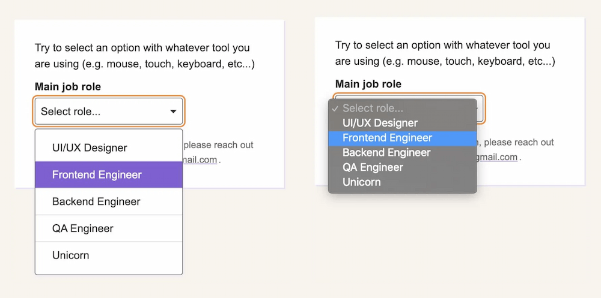
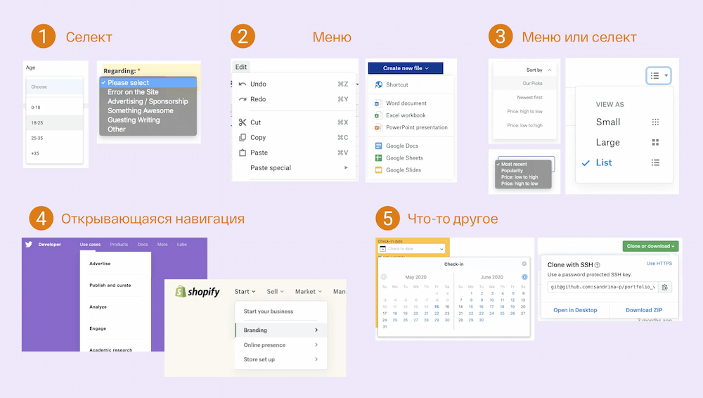
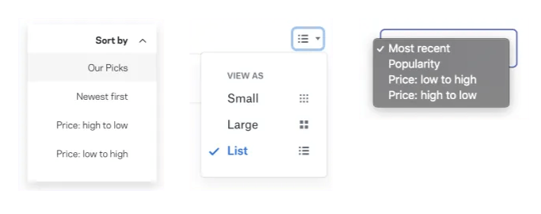

Вот наш план! Мы собираемся сделать стилизованный селект. Стилизуем не просто [снаружи](https://css-tricks.com/styling-a-select-like-its-2019/), но и внутри. Полный контроль над стилизацией. Вдобавок к этому мы собираемся сделать его доступным. Мы не будем пытаться _повторить_ за браузером все, что он делает по умолчанию при отрисовке нативного `<select>`. Мы буквально собираемся пользоваться `<select>`, как только в игру вступит любая вспомогательная технология. Но когда будет использоваться мышь, мы отрисуем стилизованную версию и заставим ее функционировать как `<select>`.

Вот что я понимаю под "гибридным" селектом: это одновременно и нативный `<select>` и его стилизованная альтернатива.

<figure>
    
    <figcaption>Кастомный селект (слева) часто используется вместо нативного (справа) ради эстетики и последовательности дизайна</figcaption>
</figure>

### Cелект, выпадающий список, навигация, меню... Имя имеет значение

Во время изучения данной темы я думала о всех тех названиях, которые всплывают и вертятся в голове, когда речь заходит о селектах. Наиболее общие из них - выпадающий список и меню. Есть два типа ошибок при наименовании, которые мы можем допустить: дать _одинаковое_ название разным элементам или дать _разные_ названия одинаковым элементам.

Перед тем как мы двинемся дальше, позвольте мне внести ясность касательно использования словосочетания "выпадающий список". Вот как я это понимаю:

> **Выпадающий список:** Интерактивный компонент, состоящий из кнопки, которая показывает и прячет список элементов, в основном по наведению мыши, клику или тапу. Список невидим по умолчанию пока не произойдет взаимодействие. Список обычно отображает блок содержимого поверх другого содержимого.

Множество элементов выглядят _похоже_ на выпадающий список. Но назвать элемент "выпадающим списком" - все равно что назвать рыбу пытаясь описать животных. Что за семейство рыб? Рыбка-клоун не то же самое, что и акула. То же касается и выпадающих списков.

<figure>
    
<figure>

Подобно тому, как в море существует огромное количество видов рыб, существует множество элементов, о которых мы можем вести речь столкнувшись со словосочетанием "выпадающий список".

*   **Меню:** Список команд или действий, которые пользователь может предпринять на странице.
*   **Навигация:** Список ссылок, используемых для перемещения по сайту.
*   **Селект:** Контрол формы (`<select>`) показывающий пользователю набор опций, которые он может выбрать в её пределеах.

Определение типа выпадающего списка о котором мы ведем речь довольно туманно. Вот несколько примеров из веба подходящих под мою классификацию вышеупомянутых элементов. Они основаны на моем исследовании, и иногда, когда я не могу найти подходящий ответ моей _интуицией_ руководит опыт.

<figure>
    
    <figcaption>Мир выпадающих списков: 5 сценариев их поведения в Интернете. Более подробное описание ищите в таблице ниже.</figcaption>
</figure>

№ <!--оригинал - diagramm Label -->

Поведение

Тип списка

1

Ожидается, что выбранный вариант отправится вместе с формой на сервер. (Например, выбор возраста)

Селект

2

Выпадающему списку не нужен выбранный вариант. (Например, список действий: копировать, вставить и вырезать)

Меню

3

Выбранный вариант отражается на содержимом (Например, сортировка)

Меню или селект (подробнее чуть позже)

4

Выпадающи список содержит ссылки на другие страницы  (e.g. A “meganav” with websites links) <!--meganav? -->

[Раскрытие навигации](https://www.w3.org/TR/wai-aria-practices/examples/disclosure/disclosure-navigation.html)

5

Содержимое выпадающего меню - не список. (Например, выбор даты)

Кое-что еще, что [не следует путать с выпадающим списком](https://adrianroselli.com/2020/03/stop-using-drop-down.html)/

Не все воспринимают и взаимодействуют с интернетом одинаково. Наделение именами пользовательских интерфейсов и определение дизайн-шаблонов - фундаментальный процесс, хотя и с достаточным пространством для личной интерпретации.

Вот тип выпадающего списка, который определенно можно назвать **меню.** Его использование является горячей темой при обсуждении доступности. Я не буду много говорить об этом здесь, но позвольте мне просто подчеркнуть, что [`<menu>`](https://developer.mozilla.org/en-US/docs/Web/HTML/Element/menu) устарел и больше не используется. А вот подробное руководство по [инклюзивным меню и его кнопкам](https://inclusive-components.design/menus-menu-buttons/), включая объяснение почему [роль меню ARIA не следует использовать для навигации по сайту](https://adrianroselli.com/2017/10/dont-use-aria-menu-roles-for-site-nav.html).

Мы даже не коснулись других элементов, которые остаются в тени, что делает классификацию выпадающих списков еще более туманной из за недостака практических примеров использования от WCAG.

Уфф..это было объемно. Давайте забудем об этом выпадающем списке и сосредоточимся исключительно на теге `<select>`.

### Поговорим о `<select>`

Стилизация элементом формы - увлекательное путешествие. Согласно MDN, существуют [хорошо стилизуемые, плохо стилизуемые и ужасно стилизуемые элементы формы](https://developer.mozilla.org/en-US/docs/Learn/Forms/Styling_web_forms#Why_is_styling_form_widgets_challenging). К первым относится тег`<form>`, который попросту является блочным элементом. К плохо стилизуемым относятся чекбоксы, стилизация которых [возможна, но громоздка](https://css-tricks.com/custom-styling-form-inputs-with-modern-css-features/). `<select>` определенно из третьей категории.

Огромное число статей посвящены этому, даже в 2020 [все еще трудно создать кастомный селект](https://css-tricks.com/making-a-better-custom-select-element/) и [некоторые пользователи все еще предпочитают простые и нативные селекты](https://www.24a11y.com/2019/select-your-poison-part-2/). 

Среди разработчиков `<select>` - [самый разочарующий элемент формы](https://www.gwhitworth.com/blog/2019/07/form-controls-components/), главным образом из за [отстутствия поддержки стилей](https://www.gwhitworth.com/blog/2019/10/can-we-please-style-select/). Борьба UX за это настолько велика, что мы ищем [иные возможности](https://medium.com/@kollinz/dropdown-alternatives-for-better-mobile-forms-53e40d641b53). Ну, я думаю, что первое правило `<select>` - это, [в соответствии с ARIA](https://www.w3.org/TR/using-aria/%23firstrule): **избегайте его использования, если можете.**

Я могла бы закончить статью прямо сейчас со словами _"Не используйте `<select>`, точка."_ Но давайте посмотрим правде в глаза: селект для нас - все еще лучшее решение в ряде случаев. Сюда можно отнести моменты, когда мы работаем со списком, содержащим множество опций, <!-- Нужен совет как лучше перевисти layouts здесь. оригинал -  we’re working with a list that contains a lot of options, layouts that are tight on space --> или же просто при нехватки времени или бюджета для разработки и реализации пользовательского интерактивного компонента с нуля.

### Требования к кастомному `<select>`.

Приняв решение создать кастомный селект — пусть и самый простой — мы сталкиваемся с требованиями, которые мы должны учесть:

*   Должна быть кнопка, содержащая текущий выбранный вариант.
*   Клик по блоку переключает флажок видимости списка вариантов.
*   Клик по опции, расположенной в списке, обновляет выбранное значение. Текст кнопки меняется и список закрывается. <!--пропадает?-->
*   Клик по области вне компонента закрывает список.
*   Триггер содержит маленький треугольник, направленный вниз, чтобы указать на то, что есть варианты.

Что-то вроде этого:

<iframe src="https://codepen.io/sandrina-p/pen/dyYqmya" title=" Пример кастомного и недоступного селекта">

CodePen Embed Fallback

Кто-то из вас подумает - "работает и хорошо". Но, постойте... Разве это работает для _всех_? Не все используют мышку (или тачскрин). К тому же, нативный `<select>`обладает более широким списком возможностей, которые достаются нам просто так и не входят в этот список требований:

*   Выбранный вариант доступен для восприятия всеми пользователями вне зависимости от их зрения. <!--визуальных способностей?-->
*   С компонентом можно предсказуемо взаимодействовать с помощью клавиатуры во всех браузерах (например, используя клавиши стрелок для навигации, `Enter` для выбора, `Esc` для отмены и т.д.).
*   Вспомогательные технологии (например, скринридер) четко сообщают пользователям об элементе, включая его роль, имя и состояние.
*   Положение списка регулируется (т.е. он не пропадает с экрана).
*   Элемент чувствителен к предпочтеням операционной системы пользователя (например, к высокой контрастности, цветовой схеме, движению и т.д.)

Именно на этом этапе большинство кастомных селектов терпят крах. Взгляните на некоторые из основных UI библиотек. Я не буду их упоминать, потому что веб достаточно прозрачен, но идите и попробуйте. Вероятно, вы заметите разное поведение селекта в разных фреймворках.

Вот дополнительные характеристики, за которыми нужно следить:

*   Выбирается ли опция списка сразу же при получения фокуса с клавиатуры?
*   Можно ли использовать `Enter` и/или `Space` для выбора варианта?
*   Нажатие на `Tab` переносит нас к следующему варианут списка или же к следующему элементу формы?
*   Что будет, когда вы достигнете последнего варианта в списке с помощью стрелок? Фокус замрет на последнем варианте, вернется к первому или же, что    хуже всего, перейдет к следующему элементу формы?
*   Возможно ли перейти к последней опции списка с помощью клавиши `Page Down`?
*   Можно ли скроллить элементы списка, если их больше, чем в поле видимости в данный момент?

Это был небольшой пример функций нативного селекта.

> Решив создать наш собственный кастомный селект, мы обязываем людей пользоваться им определенным образом, который может отличаться от их ожиданий.

Но всё ещё хуже. Даже нативный `<select>` [ведет себя по-разному](https://www.24a11y.com/2019/select-your-poison/) в разных браузерах и скринридерах.
Создав наш собственный селект, мы заставим людей пользоваться им не так, как они ожидают. Это опасное решение и это именно те мелочи, в которых живет дьявол.

### Создаём “гибридный” селект

При создании простого кастомного селекта мы, того не замечая, идем на компромисс. В частности, **мы жертвуем функциональностью ради эстетики.**
Всё должно быть наоборот.

Что если вместо этого мы зададим нативный селект по умолчанию и заменим его более эстетичным, если это возможно? Вот тут и вступает в игру идея о "гибридном" селекте. Он "гибридный", потому что состоит из двух селектов, каждый из которых показывается в нужный для него момент:

*   Нативный селект, видимый и доступный по умолчанию.
*   Кастомный селект, скрытый до тех пор, пока не произойдёт взаимодействие посредством мыши.

Начнём с разметки. Вначале, добавим нативный `<select>` с несколькими `<option>` _до_ кастомного. <!--Возможно, в статье опечатка. Оригинал - First, we’ll add a native `<select>` with `<option>` items _before_ the custom selector for this to work.  --> (Чуть позже я объясню почему.)

Любой контрол формы должен содержать [подпись](https://www.w3.org/WAI/tutorials/forms/labels/).Мы можем прибегнуть к `<label>`, но фокус будет попадать на нативный селект, когда мы будем кликать на подпись. В целях предотвращения такого поведения используем `` и свяжем его с селектом с помощью `aria-labelledby`.

Наконец, посредством `aria-hidden="true"` нужно сообщить вспомогательным технологиям, чтобы те игнорировали кастомный селект. Таким образом, они видят только нативный селект несмотря ни на что.

    Main job role
    

        <select class="selectNative js-selectNative" aria-labelledby="jobLabel">
            <!-- options -->
            <option></option>
        </select>
        

            <!-- The beautiful custom select -->
        

    

Это приводит нас к стилизации, в ходе которой мы не только заставляем всё выглядеть красивее, но также и управляем переключением между селектами. Нам не хватает лишь пары строк, чтобы начать магию.

Для начала, оба селекта должны обладать одинаковой шириной и высотой. Это позволит пользователям не увидеть серьезного расхождения с макетом при переключении.

    .selectNative,
    .selectCustom {
        position: relative;
        width: 22rem;
        height: 4rem;
    }

Вот два селекта. Но лишь один может устанавливать пространство, которое они занимают. Второй должен быть спозиционирован абсолютно, чтобы быть вне потока документа. Давайте провернём это с кастомным селектом, так как "замена" производится только тогда, когда она возможна. Мы спрячем его по уолчанию, чтобы никто пока до него не добрался.

    .selectCustom {
        position: absolute;
        top: 0;
        left: 0;
        display: none;
    }

Вот здесь-то и начинается веселье. Нам нужно определить, использует ли пользователь устройство, в котором наведение - часть основного ввода информации. Например, компьютер с мышью. Хотя мы и думаем о медиа-запросах только как о способах проверки поддержки определённых функций или же инструментах адаптива посредством брейкпоинтов, их также можно использовать для обнаружения поддержки ховера с помощью `@media query (hover :hover)`, который поддерживается всеми основными браузерами. Итак, давайте используем это для показывания кастомного селекта на устройствах, где возможен ховер.

    @media (hover: hover) {
        .selectCustom {
            display: block;
        }
    }

Отлично. Но что насчёт людей, которые используют клавиатуру для навигации даже на устройствах, поддерживающих ховер? Что делать? Мы будем прятать кастомный селект, когда нативный находится в состоянии фокуса. Мы можем поймать [соседний элемент с помощью комбинирующего селектора](https://developer.mozilla.org/en-US/docs/Web/CSS/Adjacent_sibling_combinator) (`+`). Как только нативный селект в фокусе, прячем кастомный, который следует сразу за ним в DOM. (Вот почему кастомный селект должен следовать за нативным).

    @media (hover: hover) {
        .selectNative:focus + .selectCustom {
            display: none;
        }
    }

Вот и всё! Трюк переключения между двумя селектами готов! Есть другие способы сделать это через CSS, но и этот прекрасно работает.

Наконец, нам нужно немного JavaScript. Добавим несколько обработчиков событий:

*   Один для события клика, по которому в игру вступает кастомный селект, раскрываясь и показывая варианты выбора.
*   Один, чтобы синхронизировать выбранные варианты. При изменении одного варианта выбора, меняется и второй.
*   И ещё один для установки навигации через клавиатуру с помощью клавиш `Up` и `Down`, выбора варианта с помощью клавиш `Enter` или `Space`, и закрытия списка через `Esc`.

<iframe src="https://codepen.io/sandrina-p/pen/YzyOYRr" title="Пример гибридного селекта">

### Юзабилити-тест

Я провела небольшое юзабилити-тестирование, в котором я попросила нескольких людей с ограниченными возможностями воспользоваться гибридным селектом. Были протестированы следующие устройства и инструменты с использованием последних версий Chrome (81), Firefox (76), Safari (13):

*   ПК без перефирийых устройств, за исключением одной только мыши.
*   ПК лишь с одной клавиатурой.
*   VoiceOver на MacOS с помощью клавиатуры.
*   NVDA в Windows с помощью клавиатуры.
*   VoiceOver на iPhone и iPad в Safari

Все эти тесты дали желаемый результат, но я уверена, что **можно было бы провести ещё больше юзабилити-тестов с более разнообразными устройствами и широким диапозоном лиц.** Если у вас есть возможность протестировать на других устройствах или с другими инструментами — такими как JAWS, Dragon и т.д.—  пожалуйста, расскажите мне, как прошёл тест.

Во время теста была обнаружена проблема. В частности, проблема связана с настройкой VoiceOver "Использовать виртуальный курсор VoiceOver". Если пользователь откроет селект с помощью этого курсора, покажется кастомный селект (вместо нативного).

Больше всего мне нравится в этом подходе то, как он совмещает всё самое лучшее из обоих миров без нанесения ущерба функциональности.

*   Пользователи мобильных устройств и планшетов получают нативный селект, предлагающий лучший пользовательский интерфейс по сравнению с кастомным селектом, включая преимущества производительности.
*   Те, кто пользуются клавиатурой получают возможность взаимодействия с нативным селектом в соответствии с их ожиданиями.
*   Вспомогательные технологии спокойно могут взаимодействовать с нативным селектом.
*   Пользователи с мышью получают возможность взаимодействовать с расширенным кастомным селектом.

Данный подход **обеспечивает необходимую для каждого функциональность** без дополнительного громоздкого кода, реализующего функции нативного селекта.

Не поймите меня неправильно. Этот метод не является универсальным решением для всех. Он может являться рабочим для простых селектов, но, вероятно, не будет работать в случаях со сложным взаимодействием. В этих случаях нам нужно использовать ARIA и Java Script для восполнения пробелов и создания [действительно доступного селекта](https://24ways.org/2019/making-a-better-custom-select-element/).

### Примечание касательно селекта-меню

Давайте вернёмся к третьему сценарию нашего списка селектов. Если вы помните, это выпадающий список, который всегда имеет отмеченный вариант (например, сортировка). Я отнесла его к серой области как и меню или селект.

Вот моя мысль: много лет назад этот тип выпадающего списка реализовывался в основном с помощью нативного `<select>`. В настоящее время часто можно увидеть что он реализован с нуля с помощью вспомогательных стилей (доступных или нет). N Мы получаем селект, стилизованный под меню.

<figure>
    
</figure>

**`<select>` - это вид меню.** Оба имеют схожую семантику и поведение, особенно в случае, когда один вариант всегда выбран. Теперь позвольте мне упомянуть критерий из [WCAG 3.2.2 об инпутах (Уровень A)](https://www.w3.org/WAI/WCAG21/Understanding/on-input.html):

> Изменение состояния любого пользовательского элемента не должно влечь за собой автоматическое изменение контекста без уведомления об этом пользователя перед самим изменением.

Давайте применим это на практике. Представьте себе сортируемый список студентов. Может быть визуально очевидно, что сортировка происходит незамедлительно, но это не обязательно так для всех людей. Таким образом, при использовании `<select>`, мы рискуем нарушить рукводство WCAG, ибо контент страницы изменился, а это попадает под понятие ["изменение контекста"](https://www.w3.org/WAI/WCAG21/Understanding/on-input.html%23dfn-changes-of-context).

Чтобы соблюсти критерий, мы должны уведомить пользователя о действии до того, как он  провзаимодействует с элементом или же поставить `<button>` сразу после списка, чтобы подтвердить изменения.

    <label for="sortStudents">
        Sort students
        <!-- Warn the user about the change when a confirmation button is not present. -->
        (Immediate effect upon selection)
    </label>
    <select id="sortStudents"> ... </select>

Тем не менее, использование `<select>` наряду с созданием пользовательского меню является хорошим подходом, когда речь заходит о несложных меню, требующих изменение содержимого страницы. Просто помните, что от вашего решения зависит объем работ, необходимых для создания полностью доступного компонента. Это как раз тот случай, когда гибридный селект может выручить.

### Заключение

Вся эта идея зарождалась как невинный  CSS трюк. Но после всех этих исследований, я вновь убедилась, что создание уникальных элементов для юзабилити с сохранением полной доступности - непростая задача.

Создание действительно доступных селектов (или же любого вида выпадающего списка) сложнее, чем может казаться. Руководство WGAC даёт прекрасные инструкции наряду с лучшими практиками, но без конкретных примеров использования эти инструкции носят рекомендательный характер Это не говоря уже о том, что поддержка ARIA едва ощутима, а внешний вид и поведение браузерного `<select>` отличаются в разных браузерах.

“Гибридный” селект - это всего лишь еще одна попытка создать красивый селект, сохранив при этом как можно больше изначальных функций. Не расценивайте этот эксперимент как попытку извинения за преуменьшение доступности. Скорее это попытка угодить обоим мирам. При наличии ресурсов, времени и необходимых навыков _пожалуйста, сделайте все как надо_ и не забудьте протестировать всё на разных пользователях перед тем, как публиковать своё творение.
P.S. Не забудьте [использовать имя](https://adrianroselli.com/2020/03/stop-using-drop-down.html) при создании выпадающего списка. 😉
