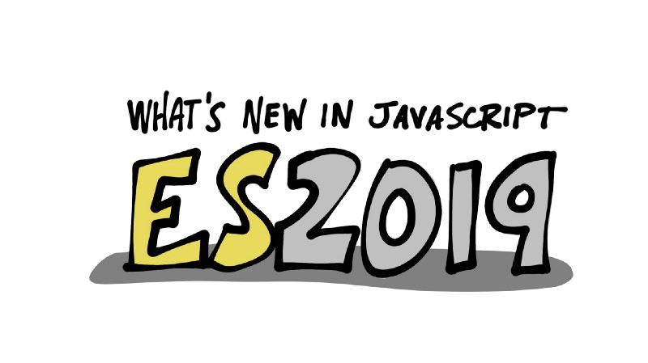

На протяжении последних лет JavaScript развивался и получал новые фичи. Если вам любопытно, чего ждать от новой версии JavaScript, то этот пост для вас!

Перед тем, как мы поговорим о новых возможностях, важно понять как новые идеи становятся частью языка JavaScript.

## Процесс для новых возможностей JavaScript

Если коротко, то спецификация языка, которая управляет JavaScript, называется [ECMAScript](https://www.ecma-international.org/publications/standards/Ecma-262.htm). Группа Ecma International, которая рассматривает и принимает изменения в спецификацию языка, называется Технический комитет 39 или [TC39](https://www.ecma-international.org/memento/tc39.htm). Изменения в спецификацию ECMAScript проходят через [стандартизированный процесс](https://tc39.github.io/process-document/), включая стадии становления.

- Этап 0: идеи
- Этап 1: официальное предложение
- Этап 2: черновики
- Этап 3: кандидаты
- Этап 4: одобренные

До тех пор, пока нововведение не достигнет 4 этапа, нет никаких гарантий, что оно станет частью спецификации ECMAScript. Тем не менее, некоторые JavaScript-движки, такие, как [V8](https://v8.dev/) (используется в Сhrome and Node.js) и [SpiderMonkey](https://developer.mozilla.org/en-US/docs/Mozilla/Projects/SpiderMonkey) от Firefox, могут добавить поддержку предложенных возможностей _до того_, как они перешли на этап 4. Так разработчики могут протестировать их и дать фидбэк.

## Текущие кандидаты в ECMAScript2019

В момент написания этой статьи уже существует список [предложений TC39](https://github.com/tc39/proposals), которые находятся на 4 этапе. И тем не менее есть несколько кандидатов на 3 этапе.

_**Дисклеймер:** поскольку есть несколько кандидатов на этапе 3, финальный вариант ECMAScript2019 может не включать в себя все перечисленные предложения. По факту некоторые из этих предложений находятся на рассмотрении годами. Кроме того, реализации новых возможностей могут выглядеть или вести себя не так, как описано в текущих кандидатах._

## Изменения в классах JavaScript

Есть несколько предложений по изменениям, которые следует внести в классы, включая [строковую декларацию](https://github.com/tc39/proposal-class-fields), [приватные методы и поля](https://github.com/tc39/proposal-private-methods) и [статические методы и поля](https://github.com/tc39/proposal-static-class-features/).

```js
class Truck extends Automobile {
    model = 'Очень мощный'; // Объявление публичного поля
    #numberOfSeats = 5; // Объявление приватного поля
    #isCrewCab = true;
    static #name = 'Грузовик'; // Статическое приватное поле

    // Статичный метод
    static formattedName() {
        // Обратите внимание, что имя класса Truck используется
        // вместо this чтобы получить доступ к статическому полю
        return `Это автомобиль ${ Truck.#name }.`;
    }

    constructor( model, seats = 2 ) {
        super();
        this.seats = seats;
    }

    // Приватный метод
    #getBodyType() {
        return this.#isCrewCab ?
            'Двойная кабина' : 'Стандартная кабина';
    }

    bodyType() {
        return `${ this.#numberOfSeats }-passenger ${ this.model } ${ this.#getBodyType() }`;
    }

    get seats() { return this.#numberOfSeats; }
    set seats( value ) {
        if ( value >= 1 && value < 7 ) {
            this.#numberOfSeats = value;
            this.#isCrewCab = value > 3;
        }
    }
}
```

Лично мне не очень нравится синтаксис `#` для приватных полей и методов. Я бы предпочёл чтобы в спецификации JavaScript использовалось ключевое слово `private` для этих целей по аналогии с другими языками.

## Строковые методы `trimStart()` и `trimEnd()`

У типа данных `String` существует метод `trim()`, с помощью которого можно удалить пробелы с обоих концов строки. [Предложено](https://github.com/tc39/proposal-string-left-right-trim) ввести методы `trimStart()` и `trimEnd()`, которые дадут больше контроля над удалением пробелов.

```js
const one = "      Привет и позвольте ";
const two = "нам начать.        ";
console.log( one.trimStart() + two.trimEnd() )
// "Привет и позвольте нам начать."
```

Интересный факт: эта возможность языка [уже реализована](https://developer.mozilla.org/en-US/docs/Web/JavaScript/Reference/Global_Objects/String/trimEnd#Browser_compatibility) во многих JavaScript-движках. Один из случаев когда браузеры помогают развивать язык.

## Большие числа с `BigInt`

Мы видим примитив [BigInt](https://github.com/tc39/proposal-bigint) для целых чисел, превышающих текущее максимальное значение 253. `BigInt` может быть объявлен несколькими различными способами.

```js
// Референс
const theBiggestIntegerToday = Number.MAX_SAFE_INTEGER;
// 9007199254740991

// Используем синтаксис 'n' для объявления BigInt
const ABiggerInteger = 9100000000000001n;

// Используем конструктор BigInt()
const EvenBigger = BigInt( 9100000000000002 );
// 9100000000000002n

// Используем конструктор BigInt() со строкой
const SuchBigWow = BigInt( "9100000000000003" );
// 9100000000000003n
```

[Узнайте больше](https://developers.google.com/web/updates/2018/05/bigint) о вариантах использования и фишках `BigInt`.

## Одномерные массивы с `flat()` и `flatMap()`

Если вы изучали функциональное программирование, то [вы точно узнаете](https://github.com/tc39/proposal-flatMap) `flat()` и `flatMap()`. `flat()` принимает массив значений, который может состоять в том числе из других массивов, и возвращает новый одномерный массив.

```js
const nestedArraysOhMy = ["a", ["b", "c"], ["d", ["e", "f"]]];
// .flat() принимает необязательный аргумент глубины
const ahhThatsBetter = nestedArraysOhMy.flat(2);
console.log( ahhThatsBetter );
// ["a", "b", "c", "d", "e", "f"]
```

`flatMap()` похож на `map()`, но колбэк может вернуть массив и в результате получится плоский одномерный массив вместо вложенных массивов.

```js
const scattered = ["мой любимый", "бутерброд", "это", "сэндвич с курицей"];

// Обычный map() вернёт вложенные массивы
const huh = scattered.map(chunk => chunk.split(" "));
console.log(huh);
// [["мой", "любимый"], ["бутерброд"], ["это"], ["сэндвич", "с", "курицей"]]

// flatMap() объединяет возвращаемые массивы
const better = scattered.flatMap( chunk => chunk.split( " " ) );
console.log(better);
// ["мой", "любимый", "бутерброд", "это", "сэндвич", "с", "курицей"]
```

## Другие предложения-кандидаты в ES2019

Ниже представлен список дополнительных кандидатов, которые находятся на 3 этапе в момент написания статьи.

- Стандартизированный объект [`globalThis`](https://github.com/tc39/proposal-global)
- Динамический [`import()`](https://github.com/tc39/proposal-dynamic-import)
- Нововведения в [устаревший RegExp](https://github.com/tc39/proposal-regexp-legacy-features)
- [`import.meta`](https://github.com/tc39/proposal-import-meta)
- Строковый метод [`matchAll()`](https://github.com/tc39/proposal-string-matchall)
- [`Object.fromEntries()`](https://github.com/tc39/proposal-object-from-entries)
- Правильный [`JSON.stringify`](https://github.com/tc39/proposal-well-formed-stringify)
- Стандартизированный [Hashbang](https://github.com/tc39/proposal-hashbang) для приложений с интерфейсом командной строки (CLI)

## Когда ожидать ES2019

В последние годы TC39 выпускает обновлённую спецификацию ECMA-262 языка ECMAScript в июне. Всё говорит о том, что и ES2019 мы увидим в июне.

## Попробуйте новинки ES2019 уже сегодня

Некоторые из описанных выше новинок языка уже реализованы в JavaScript-движках и утилитах. Они могут быть отключены по умолчанию, но легко включаются в настройках.

## Потестируйте в последней версии Node.js

[Node.js](https://nodejs.org/) использует движок Chrome V8. Некоторые кандидаты могут быть использованы в Node.js потому что V8 уже поддерживает их (например, `Array.prototype.flat` и `String.prototype.trimEnd`).

Вы можете включить другие фичи языка при помощи `--harmony-{feature-flag}` в параметрах командной строки. Чтобы проверить, какие флаги поддерживает ваша версия Node.js, используйте опцию `--v8-options` для получения списка. Некоторые кандидаты будут помечены «in progress» _(прим. переводчика: в процессе)_.

MacOS или Linux:

```sh
node --v8-options | grep "in progress"
```

Windows:

```sh
node --v8-options | find "in progress"
```

Например, чтобы запустить приложение Node.js с поддержкой строковой декларации и статических методов, вы можете использовать следующие опции CLI.

```sh
node --harmony-class-fields --harmony-static-fields index.js
```

## Тестируйте с Babel 7.0+

[Babel](https://babeljs.io/) это утилита JavaScript, которая позволяет вам использовать последние возможности языка, даже если они ещё не поддерживаются всеми браузерами и окружающими средами. Вы пишите «современный» JavaScript, а Babel переводит ваш код в синтаксис, который поддерживается старыми движками.

Babel поддерживает экспериментальные возможности языка при помощи [плагинов](https://babeljs.io/docs/en/plugins). Babel публикует список поддерживаемых возможностей ECMAScript в своём официальном репозитории.

## Что ещё почитать о JavaScript и ES Next

Хотите знать больше о JavaScript? Посетите некоторые из этих полезных ресурсов.

- [Learn JavaScript in 2019!](https://developer.okta.com/blog/2018/12/19/learn-javascript-in-2019)-
- [The History (and Future) of Asynchronous JavaScript](https://developer.okta.com/blog/2019/01/16/history-and-future-of-async-javascript)
- [Build a Secure Node.js Application with JavaScript Async Await Using Hapi](https://scotch.io/tutorials/build-a-secure-nodejs-application-with-javascript-async-await-using-hapi)
- [Use TypeScript to Build a Node API with Express](https://developer.okta.com/blog/2018/11/15/node-express-typescript)

Если вам будет интересно, то вы можете почитать [предыдущие версии](https://www.ecma-international.org/publications/standards/Ecma-262-arch.htm) ECMAScript, например, ES2015, ES2016 и ES2017.
