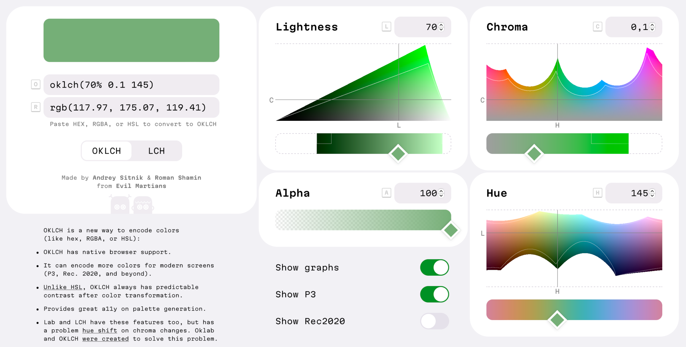
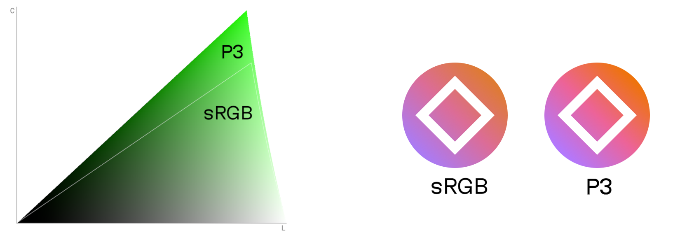
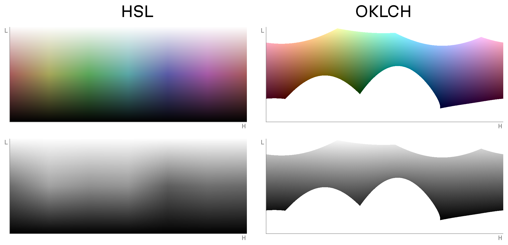
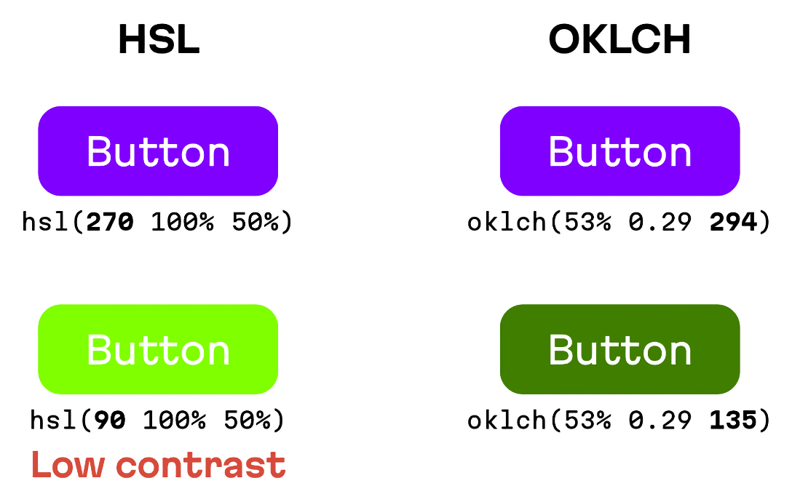
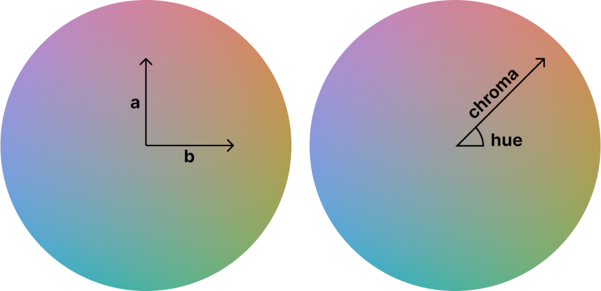
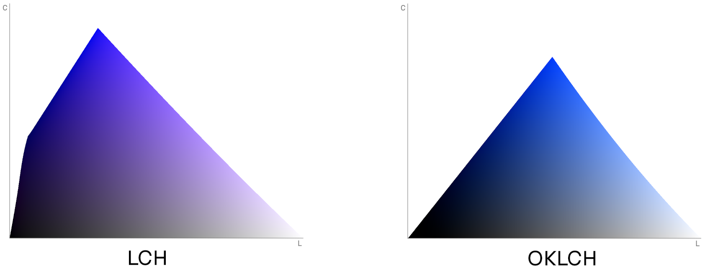
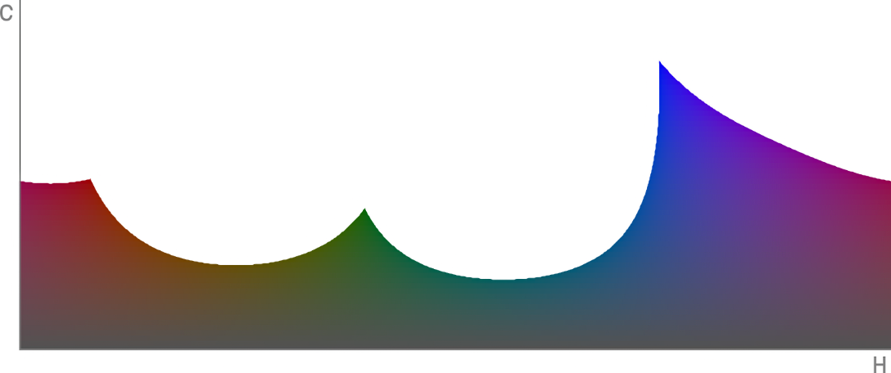
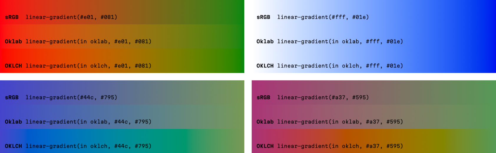

<style>
    .colors {
        display: flex;
        justify-content: center;
        margin-block: -16px 16px;
        padding-block: 24px;
        column-gap: 8px;
        border: 4px solid var(--color-green-light);
        background-image:
            repeating-conic-gradient(
                #fff 0% 25%,
                #999 0% 50%
            );
        background-size: 16px 16px;
        background-position: 50% 0;
    }

    @media (min-width: 1240px) {
        .colors {
            margin-block: -60px 60px;
            column-gap: 16px;
        }
    }

    .colors__swatch {
        width: 32px;
        height: 32px;
        border: 2px solid var(--color-grey-dark);
    }

    @media (min-width: 1240px) {
        .colors__swatch {
            width: 48px;
            height: 48px;
        }
    }
</style>

В CSS мы чаще всего пишем цвета через `rgb()` или hex — но так сложилось исторически. Новая спецификация CSS Color 4 позволит нам описывать цвета через новые методы. В этой статье мы расскажем, почему нам больше всего нравится `oklch()`.

## Краткое объяснение

`oklch()` — новый способ определять цвета в CSS. В `oklch(L C H)` или `oklch(L C H / a)` компоненты из аббревиатуры расшифровываются так:

- `L`, lightness — яркость (0%–100%), передаётся так, как её увидит глаз, в отличие от `L` в `hsl()`;
- `C`, chroma — насыщенность, варьируется от серого до наиболее интенсивного оттенка;
- `H`, hue — оттенок, угол поворота на цветовом круге (0–360);
- `a`, alpha — непрозрачность (0–1 или 0%–100%).

```css
a:hover {
    /* синий */
    background: oklch(45% 0.26 264);
    /* белый */
    color: oklch(100% 0 0);
    /* чёрный с прозрачностью 50% */
    color: oklch(0% 0 0 / 50%);
}
```

<div class="colors">
    <div class="colors__swatch" style="
        background: rgb(0.21, 50.42, 225.59)
    "></div>
    <div class="colors__swatch" style="
        background: rgb(255, 255, 255)
    "></div>
    <div class="colors__swatch" style="
        background: rgb(0 0 0 / 50%)
    "></div>
</div>

Формат OKLCH обладает многими преимуществами:

1. В отличие от `rgb()` или hex (`#ca0000`), OKLCH легко читается. По числам внутри `oklch()` мы без труда сможем определить записанный цвет. Это похоже на удобство формата HSL, но тот не передаёт яркость так, как её видит человек;
2. `oklch()` лучше подходит для изменения цвета, чем `hsl()`. Он правильно передаёт яркость — она не меняется при смене оттенка (вспомните неожиданные результаты у `darken()` в Sass из-за использования HSL);
3. Из-за предсказуемой яркости у OKLCH гораздо лучше с доступностью. Это очень важно при создании палитр для дизайн-систем;
4. Многие новые устройства (например, от Apple) поддерживают больше цветов, чем старые мониторы sRGB. OKLCH позволяет использовать эти P3-цвета.

Работая с OKLCH, следует помнить о важных нюансах:

1. Для OKLCH при подборе L, C и H есть риск получить цвет, выходящий за пределы возможностей экрана. Хоть браузеры и попытаются найти ближайший поддерживаемый цвет, нам стоит проверять результат в цветовом миксере;
2. OKLCH — цветовое пространство, которое появилось совсем недавно. На момент написания этой статьи в 2022 году его экосистема ограничена. Но у нас уже есть [полифилы](https://github.com/csstools/postcss-plugins/tree/main/plugins/postcss-oklab-function), [генератор палитры](https://huetone.ardov.me/), [цветовой миксер](https://oklch.com/) и много [конвертеров](https://bottosson.github.io/posts/oklab/#oklab-implementations).

<figure>
    
    <figcaption>Пространство OKLCH в цветовом миксере.</figcaption>
</figure>

## Оглавление

- [Развитие цвета в CSS](#section-3)
- [Сравнение OKLCH с другими CSS-форматами цветов](#section-7)
- [Принципы работы OKLCH](#section-12)
- [Внедрение OKLCH в проект](#section-17)
- [Подведение итогов](#section-27)

## Развитие цвета в CSS

### CSS Colors Module 4

Немного истории: 5 июля 2022 года спецификация [CSS Color Module Level 4](https://www.w3.org/TR/css-color-4/) стала кандидатом в рекомендации W3C. В ней появляется синтаксический сахар для всех функций цвета, которым мы будем пользоваться в этой статье:

```css
.old {
    color: rgb(51, 170, 51);
    color: rgba(51, 170, 51, 0.5);
}

.new {
    color: rgb(51 170 51);
    color: rgb(51 170 51 / 50%);
}
```

<div class="colors">
    <div class="colors__swatch" style="
        background-color: rgb(51 170 51)
    "></div>
    <div class="colors__swatch" style="
        background-color: rgb(51 170 51 / 50%)
    "></div>
</div>

Но что ещё важнее, CSS Color 4 добавляет 14 новых способов для определения цвета. И это не просто синтаксический сахар. Новые форматы записи (среди которых и `oklch()`) улучшают читаемость кода, доступность и могут принести прямую пользу для наших сайтов.

### P3 Colors

Человеческий глаз способен различить гораздо больше цветов, чем способны отобразить многие устройства. Современные мониторы в основном показывают небольшой набор цветов, который называется sRGB.

Но уже сейчас все современные устройства Apple и многие OLED-экраны поддерживают на 30% больше цветов, чем есть в sRGB. Этот расширенный набор цветов называется P3. Он также известен, как широкий цветовой охват (wide-gamut colors).

Поддержка дополнительных 30% цветов будет полезна для дизайнеров:

- Новые цвета зачастую заметно насыщеннее старых. Это поможет создавать более привлекательные и красочные сайты;
- Больше цветов — больше гибкости при создании палитр для дизайн-систем.

<figure>
    
    <figcaption>По сравнению с sRGB, в P3 гораздо больше зелёных оттенков и цвета могут быть ярче.</figcaption>
</figure>

Итак, теперь у нас появились P3-цвета, но радоваться ещё рано: чтобы их использовать, нам нужно найти формат, который поддерживает охват P3. `rgb()`, `hsl()` или hex не поддерживают P3. Хотя мы и можем использовать новую запись `color(display-p3 1 0 0)`, но по числам в ней непонятно, какой указан цвет.

К нашему везению, OKLCH очень легко читать и менять прямо в коде. К тому же он поддерживает не только P3, но и любые цвета, которые способен увидеть человек.

### Производные цвета в CSS

[CSS Color 4](https://www.w3.org/TR/css-color-4/) — большой шаг в мире стилей, но грядущий [CSS Color 5](https://www.w3.org/TR/css-color-5/) будет ещё полезнее. В нём, наконец, появятся производные цвета — изменения цвета, встроенные прямо в CSS.

В качестве примера в следующих CSS-правилах используются `hsl()`. Не используйте формат `hsl()` в реальных проектах для трансформации цветов, это может привести к проблемам с доступностью.

```css
:root {
    --accent: hsl(63 61% 40%);
}

.error {
    /* Красный вариант акцентного цвета */
    background: hsl(from var(--accent) 20 s l);
}

.button:hover {
    /* Вариант на 10% светлее */
    background: hsl(
        from var(--accent) h s calc(l + 10%)
    );
}
```

<div class="colors">
    <div class="colors__swatch" style="
        background-color: hsl(63 61% 40%)
    "></div>
    <div class="colors__swatch" style="
        background-color: hsl(20 61% 40%)
    "></div>
    <div class="colors__swatch" style="
        background-color: hsl(63 61% 50%)
    "></div>
</div>

С новым синтаксисом мы можем взять один цвет — например, из кастомного свойства — и легко изменить его, переписав отдельные компоненты цвета.

Но, как мы упоминали, у `hsl()` есть ощутимый недостаток: этот формат может привести к проблемам с доступностью. Для него значение L зависит от оттенка, поэтому после изменения через `hsl()` может получиться плохой контраст текста и фона.

Здесь мы возвращаемся к старой проблеме: нам необходимо пространство, где работа с цветом даёт предсказуемый результат. И OKLCH отлично подходит для этой задачи.

```css
:root {
    --accent: oklch(70% 0.14 113);
}

.error {
    /* Красный вариант акцентного цвета */
    background: oklch(
        from var(--accent) l c 15
    );
}

.button:hover {
    /* Вариант на 10% светлее */
    background: oklch(
        from var(--accent) calc(l + 10%) c h
    );
}
```

<div class="colors">
    <div class="colors__swatch" style="
        background-color: rgb(160 167 45)
    "></div>
    <div class="colors__swatch" style="
        background-color: rgb(232 119 130)
    "></div>
    <div class="colors__swatch" style="
        background-color: rgb(190 199 82)
    "></div>
</div>

Отметим: `--accent` в `oklch(from …)` не обязательно должен быть тоже в формате OKLCH. Но для улучшения читаемости мы рекомендуем писать в едином формате.

## Сравнение OKLCH с другими форматами цветов в CSS

Конечно, мы можем в разных файлах писать цвет в разных форматах. Необязательно везде использовать `oklch()`. Но единый подход к записи значительно улучшает читаемость и поддерживаемость кода.

Давайте попробуем выбрать единый, универсальный формат записи цвета. Наши критерии для выбора:

1. У него должна быть встроенная поддержка в CSS;
2. Он должен уметь работать как минимум с широким цветовым охватом P3;
3. Он должен хорошо подходить для изменения цвета. Компоненты формата должны быть удобочитаемыми и при этом не зависеть друг от друга. Например, изменение яркости должно сохранять прежний уровень контраста, а изменение насыщенности не должно менять оттенок.

### OKLCH против RGB и hex

Все форматы `rgb(109 162 218)`, `#6ea3db` или P3-аналог `color(display-p3 0.48 0.63 0.84)` записываются тремя числами, которые определяют количество красного, зелёного и голубого соответственно. Обратите внимание: `1` в `color(display-p3)` кодирует большее значение, чем `255` в RGB.

Какая проблема объединяет все эти форматы? Они абсолютно нечитаемы для большинства разработчиков. Люди часто просто копируют их как магический набор символов, не пытаясь их прочитать и понять.

RGB, hex и `color(display-p3)` неудобны для трансформаций цвета, поскольку большинству людей интуитивно сложно задавать цвета, изменяя количество красного, голубого и зелёного. Кроме того, с помощью RGB и hex нельзя определить P3-цвета.

С другой стороны, OKLCH, LCH и HSL кодирует цвет так, как люди думают о цветах — через оттенок, насыщенность, яркость.

Сравните hex и OKLCH:

```css
.button {
    /* Голубой */
    background: #6ea3db;
}

.button:hover {
    /* Более яркий голубой */
    background: #7db3eb;
}

.button.is-delete {
    /* Красный с той же насыщенностью */
    background: #d68585;
}
```

<div class="colors">
    <div class="colors__swatch" style="
        background-color: #6ea3db
    "></div>
    <div class="colors__swatch" style="
        background-color: #7db3eb
    "></div>
    <div class="colors__swatch" style="
        background-color: #d68585
    "></div>
</div>

```css
.button {
    /* Голубой */
    background: oklch(70% 0.1 250);
}

.button:hover {
    /* Более яркий голубой */
    background: oklch(75% 0.1 250);
}

.button.is-delete {
    /* Красный с той же насыщенностью */
    background: oklch(70% 0.1 20);
}
```

<div class="colors">
    <div class="colors__swatch" style="
        background-color: #6ea3db
    "></div>
    <div class="colors__swatch" style="
        background-color: #7db3eb
    "></div>
    <div class="colors__swatch" style="
        background-color: #d68585
    "></div>
</div>

OKLCH-цвета можно прочитать и сравнить. Но пространство появилось совсем недавно — его экосистема только находится в стадии активного развития.

### OKLCH против HSL

Теперь сравним OKLCH и HSL. HSL использует три компонента для кодировки оттенка, насыщенности и яркости, например `hsl(210 60% 64%)`. Главная проблема с HSL в том, что это цветовое пространство растягивается в цилиндр.

В цилиндре HSL каждый оттенок должен иметь одинаковое значение насыщенности (0%–100%). Но в реальности экран и глаз имеют разную максимальную насыщенность для разных оттенков. HSL не обращает внимания на это различие. Он деформирует цветовое пространство и растягивает цвета до одинакового показателя максимальной насыщенности.

<figure>
    
    <figcaption>Срез яркости и оттенка в пространствах HSL и OKLCH. На чёрно-белой версии ниже видно, что у HSL реальная яркость меняется непредсказуемо.</figcaption>
</figure>

HSL растягивает цветовое пространство, поэтому через него нельзя менять цвет. Компонент L в нём является непредсказуемым, зависящим от оттенка. Это приводит к неприятным проблемам с контрастом и доступностью.

Вот несколько реальных примеров, где проявляются эти проблемы:

1. Добавление 10% яркости для зелёного или для фиолетового цвета приведут к разным результатам. Если вы когда-нибудь использовали функцию `darken()` в Sass, то помните, как по одной формуле нельзя было сделать одинаковый `:hover`-стиль для всех оттенков;
2. Если вы поменяете оттенок (например, чтобы из фирменного цвета сделать красный цвет ошибки), то с ним может измениться яркость, и текст на этом фоне станет нечитаемым.

<figure>
    
    <figcaption>Изменение оттенка в пространстве HSL может привести к проблемам доступности из-за непредсказуемого изменения контраста.</figcaption>
</figure>

HSL плох для работы с цветом. В сообществе многие [просят избегать](https://wildbit.com/blog/accessible-palette-stop-using-hsl-for-color-systems) HSL при создании палитр. Кроме того, подобно RGB или hex, формат HSL не может быть использован для определения P3-цветов.

OKLCH не искажает цветовое пространство; этот формат показывает нам реальную физику цвета. Это помогает добиться предсказуемого контраста при изменениях цвета.

С другой стороны, некоторые комбинации значений для OKLCH порождают цвета, которые обычные экраны отобразить не способны. Ряд из них можно увидеть только на P3-мониторах. Но это не критическая проблема: браузеры будут искать ближайший поддерживаемый цвет.

### OKLCH против Oklab; LCH против Lab

В CSS есть две функции, связанные с Oklab: `oklab()` и `oklch()`. Аналогичные есть и для CIE LAB: `lab()` и `lch()`. Так в чём же разница?

Есть разные способы задать точку в пространстве. Oklab и LAB используют декартовые координаты с осями _a_ и _b_ _(a_ — от красного до зелёного, _b_ — от голубого до жёлтого). OKLCH и LCH используют полярные координаты, где есть угол оттенка и расстояние для насыщенности.

<figure>
    
    <figcaption>Декартовы координаты для Oklab и полярные координаты для OKLCH.</figcaption>
</figure>

OKLCH, и LCH удобнее для работы с цветом, так как люди думают о цвете через насыщенность и оттенок, а не количество красного и зелёного.

### OKLCH против LCH

Формат [LCH](https://lea.verou.me/2020/04/lch-colors-in-css-what-why-and-how/) построен на пространстве CIE LAB. Он решает все проблемы, которые существуют в HSL и RGB. Также он позволяет работать с P3-цветами, и в большинстве случаев изменение цвета даёт предсказуемый результат.

Однако формат LCH имеет одну неприятную проблему: неожиданный сдвиг оттенка при изменении насыщенности и яркости для голубого цвета (оттенок между 270 и 330 градусами).

<figure>
    
    <figcaption>Срезы пространств LCH и OKLCH, где яркость и насыщенность изменяются, а оттенок — одинаковый. Срез LCH голубой с одной стороны и фиолетовый с другой. Оттенок в OKLCH остаётся постоянным, как и ожидается.</figcaption>
</figure>

Небольшой пример из реальной жизни:

```css
.temperature.is-very-very-cold {
    /* Выглядит голубым */
    background: lch(35% 110 300);
}

.temperature.is-very-cold {
    /* Мы изменили только яркость,
    но голубой стал фиолетовым */
    background: lch(35% 75 300);
}

.temperature.is-cold {
    /* Глубокий фиолетовый */
    background: lch(35% 40 300);
}
```

<div class="colors">
    <div class="colors__swatch" style="
        background-color: rgb(65 46 241)
    "></div>
    <div class="colors__swatch" style="
        background-color: rgb(86 61 189)
    "></div>
    <div class="colors__swatch" style="
        background-color: rgb(90 72 138)
    "></div>
</div>

```css
.temperature.is-very-very-cold {
    /* Выглядит голубым */
    background: oklch(48% 0.27 274);
}

.temperature.is-very-cold {
    /* Всё ещё голубой */
    background: oklch(48% 0.185 274);
}

.temperature.is-cold {
    /* Всё ещё голубой */
    background: oklch(48% 0.1 274);
}
```

<div class="colors">
    <div class="colors__swatch" style="
        background-color: rgb(64 43 241)
    "></div>
    <div class="colors__swatch" style="
        background-color: rgb(66 75 195)
    "></div>
    <div class="colors__swatch" style="
        background-color: rgb(76 88 150)
    "></div>
</div>

Пространства Oklab и OKLCH [были созданы](https://bottosson.github.io/posts/oklab/) для решения этой проблемы со сдвигом оттенка. Но OKLCH — не просто исправление. В нём появляется [много полезных возможностей](https://www.w3.org/TR/css-color-4/#ok-lab), связанных с математическими преобразованиями. Например, упрощается [коррекция охвата](https://bottosson.github.io/posts/gamutclipping/) (gamut correction), поэтому CSSWG [рекомендует](https://www.w3.org/TR/css-color-4/#css-gamut-mapping) для этого OKLCH.

## Принципы работы OKLCH

### Создание и развитие OKLCH

[Бьёрн Оттоссон](https://twitter.com/bjornornorn) создал пространства Oklab и OKLCH в 2020 году. Главная задача была в исправлении проблемы CIE LAB и LCH. Бьёрн написал [отличную статью](https://bottosson.github.io/posts/oklab/) с описанием деталей реализации. Также в ней он рассказал о причинах, побудивших его разработать эти пространства.

Стоит отметить, что Oklab появилось гораздо позже других пространств. Изначально это было его главным слабым местом. Но всего два года спустя стало понятно, что сообщество отлично приняло Oklab:

- Оно было добавлено в [спецификацию CSS](https://www.w3.org/TR/css-color-4/#ok-lab);
- Chrome, Safari и Firefox Nightly поддерживают `oklch()` и `oklab()`;
- В Photoshop [добавили Oklab](https://helpx.adobe.com/photoshop/using/gradient-interpolation.html) для градиентов;
- OKlab стали использовать в [генераторах палитр](https://huetone.ardov.me/) для улучшения доступности.

Неважно, что OKLCH молодой. Всё равно грядущие изменения в CSS Colors 4 и 5 потребуют сильных перемен в экосистеме разработки. Мы верим, что раз мы начинаем сначала, то лучше взять самое современное и эффективное решение.

### Оси

Цвета в OKLCH записываются четырьмя числами. В CSS это выглядит как `oklch(L C H)` или `oklch(L C H / a)`.

<figure>
    
    <figcaption>Оси OKLCH.</figcaption>
</figure>

Объясним значение каждого компонента более детально:

- L — воспринимаемая яркость. Варьируется от 0% (чёрный) до 100% (белый). Указывать % необходимо даже для нулевых значений;
- C — насыщенность, интенсивность цвета. Варьируется от 0 (серый) до бесконечности. На практике у насыщенности всё же есть максимальное значение, но оно зависит от поддерживаемого цветового охвата (например, для P3 она чуть больше, чем для sRGB). Каждый оттенок имеет разную максимальную насыщенность. Но и в P3, и в sRGB значение всегда меньше 0.37.
- H — оттенок, угол поворота от 0 до 360. От 0 — красный, 100 — жёлтый, 150 — зелёный, 200 — голубой, 250 — синий, 300 — фиолетовый и затем вновь идут значения красного (можно использовать поговорку «каждый охотник желает знать, где сидит фазан», где каждое слово будет добавлять ещё 50). Так как это угол, то [значение 0](https://oklch.com/#70,0.1,0,100) и [значение 360](https://oklch.com/#70,0.1,360,100) означают одинаковый оттенок. H можно записать как с единицей измерения `60deg`, так и без неё `60`.
- a — непрозрачность (0–1 или 0%–100%).

Обратите внимание, что размеры осей неодинаковы. 1% для яркости — тот же 1%, но для насыщенности это 0.004, а для оттенка — 3.6.

Вот некоторые примеры цветов OKLCH:

```css
.bw {
    /* Чёрный */
    color: oklch(0% 0 0);
    /* Белый */
    color: oklch(100% 0 0);
    /* Тоже белый, любой оттенок
    с 100% L будет белым */
    color: oklch(100% 0.2 100);
    /* Серый */
    color: oklch(50% 0 0);
}
```

<div class="colors">
    <div class="colors__swatch" style="
        background-color: rgb(0 0 0)
    "></div>
    <div class="colors__swatch" style="
        background-color: rgb(255 255 255)
    "></div>
    <div class="colors__swatch" style="
        background-color: rgb(255 255 255)
    "></div>
    <div class="colors__swatch" style="
        background-color: rgb(99 99 99)
    "></div>
</div>

```css
.colors {
    /* Жёлтый */
    color: oklch(80% 0.12 100);
    /* Тёмно-жёлтый */
    color: oklch(60% 0.12 100);
    /* Серо-жёлтый */
    color: oklch(80% 0.05 100);
    /* Голубой, с той же
    воспринимаемой яркостью */
    color: oklch(80% 0.12 225);
}
```

<div class="colors">
    <div class="colors__swatch" style="
        background-color: rgb(208 191 94)
    "></div>
    <div class="colors__swatch" style="
        background-color: rgb(145 129 18)
    "></div>
    <div class="colors__swatch" style="
        background-color: rgb(197 191 154)
    "></div>
    <div class="colors__swatch" style="
        background-color: rgb(88 206 248)
    "></div>
</div>


```css
.opacity {
    /* Прозрачный жёлтый */
    color: oklch(80% 0.12 100 / 50%);
}
```

<div class="colors">
    <div class="colors__swatch" style="
        background-color: rgba(208 191 94 / 50%)
    "></div>
</div>

Стоит помнить, что некоторые компоненты могут содержать [`none`](https://www.w3.org/TR/css-color-4/#valdef-color-none) в значениях. Например, у белого цвета нет оттенков, и некоторые конвертеры поставят в оттенке `none`. Браузеры будут трактовать `none` как `0`.

```css
.white {
    /* так можно записывать */
    color: oklch(100% 0 none);
}
```

<div class="colors">
    <div class="colors__swatch" style="
        background-color: rgb(255 255 255)
    "></div>
</div>

### Производные цвета

В [CSS Colors 5](https://www.w3.org/TR/css-color-5/) появятся производные цвета, встроенный механизм изменения цветов. Это раскрывает один из наиболее весомых плюсов OKLCH: изменение цвета будет давать предсказуемый результат.

Синтаксис выглядит следующим образом:

```css
:root {
    --origin: #ff000;
}

.foo {
    color: oklch(from var(--origin) l c h);
}
```

<div class="colors">
    <div class="colors__swatch" style="
        background-color: rgb(0 255 0)
    "></div>
    <div class="colors__swatch" style="
        background-color: rgb(0 255 0)
    "></div>
</div>

Начальный цвет (`var(--origin)` в примере выше) может являться:

- Цветом в любом формате: `#ff0000`, `rgb(255, 0, 0)`, или `oklch(62.8% 0.25 30)`.
- Кастомным свойством с цветом в любом формате.

Любой компонент (`l`, `c`, `h`) после `from X` может быть:

- Буквой (`l`, `c`, `h`), которая укажет сохранить компонент таким, каким он был для начального цвета;
- Выражением `calc()`. Вы можете использовать буквы (`l`, `c`, `h`) вместо числа, чтобы сослаться на значение в начальном цвете;
- Новым значением, которое заменит компонент.

Это может звучать сложно, но примеры ниже должны внести ясность:

```css
:root {
    --error: oklch(60% 0.16 30);
}

.message.is-error {
    /* Тот же цвет, но с другой прозрачностью */
    background: oklch(
        from var(--origin) l c h / 60%
    );
    /* На 10% темнее */
    border-color: oklch(
        from var(--error) calc(l - 10%) c h
    );
}

.message.is-success {
    /* Другой оттенок (зелёный)
    с той же яркостью и насыщенностью */
    background: oklch(
        from var(--error) l c 140
    );
}
```

<div class="colors">
    <div class="colors__swatch" style="
        background-color: rgb(206 83 66)
    "></div>
    <div class="colors__swatch" style="
        background-color: rgba(206 83 66 / 60%)
    "></div>
    <div class="colors__swatch" style="
        background-color: rgb(172 50 37)
    "></div>
    <div class="colors__swatch" style="
        background-color: rgb(68 150 48)
    "></div>
</div>

У OKLCH предсказуемая яркость — поэтому нам легко сделать цвет интерфейса из произвольного цвета, который задаёт пользовать (и сохранить читаемость текста). Посмотрите, как выбранный цвет влияет на цвета чекбоксов в [цветовом миксере](https://oklch.com/#70,0.1,319,100) Злых марсиан:

```css
:root {
    /* Яркость и насыщенность
    заменены для хорошего контраста */
    --accent: oklch(
        from (--user-input) 87% 0.06 h
    );
}

body {
    background: var(--accent);
    color: black;
}
```

В примере выше, нам не нужно указывать цвет текста с `color-contrast()`, потому что OKLCH имеет предсказуемую яркость. Любой фон с L меньше или равно 87% имеет хороший контраст с чёрным текстом.

### Коррекция охвата

У OKLCH есть и другая замечательная особенность: независимость от устройств. OKLCH создан не только для обычных мониторов с набором цветов sRGB.

Мы можем указать абсолютно любой цвет с помощью OKLCH: sRGB, P3, Rec2020 и далее. Ряд комбинаций компонентов поддерживается только на P3-мониторах; а для некоторых сочетаний ещё предстоит изобрести экраны, которые смогут их отображать.

Не пугайтесь выхода за пределы возможностей экрана — браузеры найдут максимально похожий цвет. Процесс поиска наиболее похожего цвета в другом охвате называется коррекцией охвата.

По этой причине в [цветовом миксере OKLCH](https://oklch.com/#60,0.16,140,100) можно увидеть бреши: каждый оттенок имеет разную максимальную насыщенность. Эта проблема связана не с кодированием цвета в OKLCH, а с пределами возможностей существующих мониторов и нашего зрения.

Например, при некоторой яркости только у синего цвета может быть самая большая насыщенность — в зелёном или красном оттенке не будет цвета с той же насыщенностью.

<figure>
    
    <figcaption>На sRGB-мониторах для 44% яркости максимальная насыщенность синего сильнее, чем у остальных цветов.</figcaption>
</figure>

Есть два способа коррекции охвата:

- Конвертировать цвет в RGB или P3 и отсечь значения более 100% или менее 0%: `rgb(150% -20% 30%)` → `rgb(100% 0 30%)`. Это наиболее быстрый способ, но у него наихудший результат — он может заметно изменить оттенок цвета;
- Перевести цвет в формат OKLCH и уменьшить насыщенность и яркость. Это сохранит тот же оттенок, но немного замедлит отрисовку.

Крис Лилли создал [интересное сравнение](https://svgees.us/Color/ok-clip-lch-explorer.html) между разными методами коррекции охвата.

Спецификация CSS Colors 4 [требует](https://www.w3.org/TR/css-color-4/#css-gamut-mapping) от браузеров применять OKLCH-метод для коррекции охвата. Однако прямо сейчас Chrome и Safari используют быстрый, но неточный метод отсечения.

Именно поэтому мы рекомендуем ручную коррекцию охвата — указывать как sRGB, так и P3-цвета:

```css
.martian {
    background: oklch(69.73% 0.155 112.79);
}

@media (color-gamut: p3) {
    .martian {
        background: oklch(69.73% 0.176 112.79);
    }
}
```

<div class="colors">
    <div class="colors__swatch" style="
        background-color: rgb(159 166 1)
    "></div>
    <div class="colors__swatch" style="
        background-color: color(display-p3 0.6327 0.6542 0.0677)
    "></div>
</div>

Превью этого цвета вы сможете увидеть только на P3-мониторе.

И здесь есть хорошая новость: полифил `oklch()` умеет это делать. Он автоматически оборачивает P3-цвета подходящим медиавыражением и устанавливает в качестве запасного варианта ближайший sRGB-цвет.

## Внедрение OKLCH в проект

### Шаг 1: Добавление полифила OKLCH в CSS

К марту 2023, `oklch()` [поддерживают](https://developer.mozilla.org/en-US/docs/Web/CSS/color_value/oklch) Chrome и Safari. Firefox поддержка спрятана под флагом. Но для стабильного результата у нас есть полифилы для статичных значений (без кастомных свойств).

Есть два полифила, поддерживающих `oklch()`:

- Очень популярный [postcss-preset-env](https://preset-env.cssdb.org/);
- И крайне быстрый [Lightning CSS](https://lightningcss.dev/), написанный на Rust.

Скорее всего, в вашем проекте уже есть _postcss-preset-env._ Например, он есть в каждом проекте, созданном с помощью Create React App.

1. Поищите _postcss-preset-env_ в вашем лок-файле _(package-lock.json,_ _yarn.lock_ или _pnpm-lock.yaml)._ Убедитесь, что он использует версию 7.x или выше;
2. Добавьте `oklch(100% 0 0)` в ваш CSS и посмотрите, скомпилируется ли его сборка в `rgb()`.

Если у вас нет _postcss-preset-env,_ но есть сборщик фронтенда (например, Webpack):

1. Установите _postcss-preset-env_ с помощью пакетного менеджера. Для npm запустите следующую команду:
    ```sh
    npm install postcss-preset-env postcss
    ```
2. Проверьте [документацию PostCSS](https://github.com/postcss/postcss), чтобы узнать, как добавить поддержку PostCSS в ваш инструмент сборки. Например Webpack требует [postcss-loader](https://github.com/webpack-contrib/postcss-loader), а в [Vite](https://vitejs.dev/) уже есть встроенная поддержка.
3. Если у вас уже есть интеграция с PostCSS, найдите файл с его конфигурацией. Многие проекты уже используют PostCSS (например, Автопрефиксер). В корневой папке проекта найдите _postcss.config.js_ _(.postcssrc.json)_, или раздел `"postcss"` в _package.json_ или конфигурации сборщика.
4. Если вы смогли найти файл конфигурации PostCSS, добавьте _postcss-preset-env_ в плагины:
    ```diff
    {
        "plugins": [
    +       "postcss-preset-env",
            "autoprefixer"
        ]
    }
    ```
5. Если вы не смогли найти файл конфигурации, создайте файл _.postcssrc.json_ в корневой папке проекта:
    ```json
    {
        "plugins": [
            "postcss-preset-env"
        ]
    }
    ```

Если у вас ещё нет инструмента сборки, мы рекомендуем использовать Vite или компилировать CSS с помощью CLI [lightningcss](https://github.com/parcel-bundler/lightningcss#from-the-cli).

Добавьте в файл `.test { background: oklch(100% 0 0) }`, скомпилируйте стили. Если в итоговом CSS есть `.test{background:#fff}`, то всё работает.

### Шаг 2: Перевод цветов приложения на OKLCH

После установки OKLCH-полифила вы можете заменить все цвета в форматах hex, `rgb()` или `hsl()` на `oklch()`. Они будут работать в любом браузере.

Найдите любой цвет в вашем CSS-коде и переведите его в `oklch()`, используя [цветовой миксер OKLCH](https://oklch.com/#70,0.1,191,100).

```diff
.header {
-   background: #f3f7fa;
+   background: oklch(97.4% 0.006 240);
}
```

Вы также можете использовать [convert-to-oklch](https://github.com/fpetrakov/convert-to-oklch), чтобы автоматически перевести все цвета:

```sh
npx convert-to-oklch ./src/**/*.css
```

Помните, что эти полифилы поддерживают только CSS, и не будут работать в HTML- или JS-файлах.

### Дополнительно: добавление палитры

Раз уж мы рефакторим CSS, то давайте воспользуемся моментом и заодно внедрим общую палитру.

Что такое общая палитра?

- Все цвета указываются как кастомные CSS-свойства;
- Компоненты фреймворков используют эти цвета в виде `var(--error)`;
- Дизайнерам стоит стремиться к переиспользованию цветов;
- Тёмная тема или тема с высоким контрастом создаются через переопределение кастомных свойств в палитре через `@media`.

Вот [небольшой пример](https://github.com/evilmartians/oklch-picker/blob/main/view/base/colors.css) такого подхода:

```css
:root {
    --surface-0: oklch(96% 0.005 300);
    --surface-1: oklch(100% 0 0);
    --surface-2: oklch(99% 0 0 / 85%);
    --text-primary: oklch(0% 0 0);
    --text-secondary: oklch(54% 0 0);
    --accent: oklch(57% 0.18 286);
    --danger: oklch(59% 0.23 7);
}

@media (prefers-color-scheme: dark) {
    :root {
        --surface-0: oklch(0% 0 0);
        --surface-1: oklch(29% 0.01 300);
        --surface-2: oklch(29% 0 0 / 85%);
        --text-primary: oklch(100% 0 0);
    }
}
```

После создания единой палитры, перейти к использованию `oklch()` станет проще.

### Шаг 3: Проверка OKLCH с помощью Stylelint

[Stylelint](https://stylelint.io/) — статический анализатор стилей, который будет полезен для поиска распространённых ошибок и внедрения хороших практик. Он работает как ESLint, но для CSS, Sass, или CSS-in-JS.

Stylelint будет очень полезен при переходе на `oklch()`, вы сможете:

- Напомнить коллегам, что цвета в форматах hex, `rgb()` и `hsl()` больше не используются и что следует хранить все цвета в `oklch()` для единообразия;
- Проверить, что все P3-цвета находятся внутри `@media (color-gamut: p3)`. Это поможет избежать автоматической коррекции охвата в браузере (Chrome и Safari делают её неправильно).

Давайте установим Stylelint и плагин [stylelint-gamut](https://www.npmjs.com/package/stylelint-gamut). Для npm:

```sh
npm install stylelint stylelint-gamut
```

Затем создадим конфигурацию _.stylelintrc_ следующим образом:

```json
{
    "plugins": [
        "stylelint-gamut"
    ],
    "rules": {
        "gamut/color-no-out-gamut-range": true,
        "function-disallowed-list": ["rgba", "hsla", "rgb", "hsl"],
        "color-function-notation": "modern",
        "color-no-hex": true
    }
}
```

Добавим вызов Stylelint в команду `npm test`, чтобы запустить его в CI. Изменим следующую строку в _package.json:_

```diff
"scripts": {
-   "test": "eslint ."
+   "test": "eslint . && stylelint **/*.css"
}
```

Запустим `npm test`, чтобы увидеть, какие цвета должны быть переведены в `oklch()`.

Мы также рекомендуем добавить [stylelint-config-recommended](https://github.com/stylelint/stylelint-config-recommended) в _.stylelintrc._ Этот конфиг убедится, что вы используете самые популярные лучшие практики в вашем CSS.

### Дополнительно: P3-цвета

Просто переведя цвета в `oklch()`, вы улучшите читаемость и поддерживаемость кода, но не добавите что-то заметное для пользователей. А вот если ещё и внедрить в дизайн красочные и глубокие P3-цвета, то и пользователи смогут оценить рефакторинг.

_P3-цвета очень полезны при создании палитр. Но прямо сейчас мы не можем их использовать: пока небольшая часть устройств поддерживает P3._

Вот, как можно добавить P3-цвета в проект:

1. Выберите любой насыщенный цвет в вашем CSS-коде;
2. Скопируйте его и вставьте в [цветовой миксер OKLCH](https://oklch.com/);
3. Измените значения _Chroma_ и _Lightness_ так, чтобы цвет оказался в области P3-цветов. Легче всего это сделать, смотря на график _Lightness:_ выберите любой цвет выше тонкой белой линии на этом графике;
4. Скопируйте результат и оберните его в медиавыражение с `color-gamut: p3`.

```css
:root {
    --accent: oklch(70% 0.2 145);
}

@media (color-gamut: p3) {
    :root {
        --accent: oklch(70% 0.29 145);
    }
}
```

<div class="colors">
    <div class="colors__swatch" style="
        background-color: rgb(48, 189, 68)
    "></div>
    <div class="colors__swatch" style="
        background-color: color(display-p3 0.1530 0.7673 0.0793)
    "></div>
</div>

### Дополнительно: OKLCH для SVG

OKLCH можно использовать не только в CSS, но и в SVG или HTML. Это полезно при добавлении ярких красок в иконки.

Обратите внимание: полифилов для SVG нет. По этой причине мы рекомендуем использовать `oklch()` только для P3-цветов.

```xml
<svg viewBox="0 0 120 120" xmlns="http://www.w3.org/2000/svg">
    <style>
        @media (color-gamut: p3) {
            rect {
                fill: oklch(55% 0.23 146);
            }
        }
    </style>
    <rect
        x="10" y="10"
        width="100" height="100"
        fill="#048c2c"
    />
</svg>
```

<div class="colors">
    <div class="colors__swatch" style="
        background-color: color(display-p3 0.0505 0.5557 0.0653)
    "></div>
    <div class="colors__swatch" style="
        background-color: #048c2c
    "></div>
</div>

### Дополнительно: OKLCH и Oklab в градиентах

Градиент — путь между двумя или более точками цветового пространства. В разных пространствах градиент для одних и тех же цветов может получиться совершенно разный.

<figure>
    
    <figcaption>Так выглядят градиенты в разных цветовых пространствах.</figcaption>
</figure>

Нет единого решения, какое пространство лучше для работы с градиентами — это зависит от конкретной задачи. Но в цветовом пространстве Oklab (родственнике OKLCH, живущем в декартовых координатах) обычно получается хороший результат:

- У него нет сероватой области в центре, как в sRGB (пространство, используемое по умолчанию);
- У него нет сдвига от голубого к фиолетовому, в отличие от Lab;

[В спецификации CSS Image 4](https://drafts.csswg.org/css-images-4/#linear-gradients) есть специальное выражение, изменяющее цветовое пространство для градиентов:

```css
.oklch {
    background: linear-gradient(
        in oklab, blue, green
    );
}
```

Код выше будет работать только в Chrome и Safari Technology Preview. Вы можете использовать [полифил PostCSS](https://github.com/csstools/postcss-plugins/tree/main/plugins/postcss-gradients-interpolation-method), чтобы применять Oklab-градиенты уже сейчас.

_Градиенты получаются ещё более красивыми с [easing-gradients](https://larsenwork.com/easing-gradients/)._

### Дополнительно: Изменение цветов с помощью OKLCH

Уже очень скоро мы сможем увидеть истинную силу OKLCH: с [CSS Colors 5](https://www.w3.org/TR/css-color-5/#relative-colors) браузеры начнут поддерживать производные цвета в CSS.

OKLCH крайне хорош для работы с цветом. В отличие от HSL, его яркость предсказуема — в нём нет сдвига оттенка при изменении насыщенности, чем не может похвастаться LCH.

К сожалению, здесь нам полифилы не помогут — нужно ждать поддержки браузеров. Но если мы познакомимся с OKLCH сейчас, то уже будем готовы, когда в браузерах появится поддержка производных цветов.

Следующий пример иллюстрирует, как можно при наведении на кнопку сделать её фон на 10% темнее:

```css
.button {
    background: var(--accent);
}

.button:hover {
    background: oklch(
        from var(--accent) calc(l - 10%) c h
    );
}
```

<div class="colors">
    <div class="colors__swatch" style="
        background-color: rgb(165 145 213)
    "></div>
    <div class="colors__swatch" style="
        background-color: rgb(135 115 181)
    "></div>
</div>

С кастомными свойствами CSS достаточно один раз определить логику `:hover`. В дальнейшем мы можем создавать разные варианты стилей, просто изменяя исходный цвет.

```css
.button {
    background: var(--button-color);
}

.button:hover {
    /* Один :hover для обычного,
    вторичного и ошибочного состояния */
    background: oklch(from var(--button-color) calc(l + 10%) c h);
}

.button {
    --button-color: var(--accent);
}

.button.is-secondary {
    --button-color: var(--dimmed);
}

.button.is-error {
    --button-color: var(--error);
}
```

<div class="colors">
    <div class="colors__swatch" style="
        background-color: rgb(117 161 220)
    "></div>
    <div class="colors__swatch" style="
        background-color: rgb(117 161 220 / 50%)
    "></div>
    <div class="colors__swatch" style="
        background-color: rgb(214 133 131)
    "></div>
</div>

Поскольку у OKLCH предсказуемый контраст, то мы можем взять случайный цвет от пользователя и сделать из него тему сайта с отличной доступностью:

```css
.header {
    /* JS установит --user-avatar-dominant */
    background: oklch(
        from var(--user-avatar-dominant) 80% 0.17 h
    );
    color: black;
}
```

В примере выше, OKLCH позволяет убедиться, что чёрный текст всегда будет читаемым на любом оттенке, так как мы установили L равным 80%. В будущем, с OKLCH и производными цветами мы сможем генерировать всю палитру дизайн-системы прямо в CSS.

### Дополнительно: OKLCH в JS

Нам не нужно ждать CSS Colors 5, чтобы использовать OKLCH для изменений цвета. [Color.js](https://colorjs.io/) и [culori](https://culorijs.org/) позволяют менять цвета в JS со всеми преимуществами OKLCH. Как это сделать в culori, можно посмотреть в [исходном коде цветового миксера OKLCH](https://github.com/evilmartians/oklch-picker).

Пример ниже генерирует тему из пользовательского цвета с помощью Color.js:

```js
import Color from 'colorjs.io'

// Разбираем любой CSS цвет
let accent = new Color(userAvatarDominant)

// Устанавливаем яркость и насыщенность
accent.oklch.l = 0.8
accent.oklch.c = 0.17

// Применяем коррекцию охвата для sRGB,
// если мы вышли за пределы sRGB
if (!accent.inGamut('srgb')) {
    accent = accent.toGamut({ space: 'srgb' })
}

// Делаем цвет на 10% светлее
let hover = accent.clone()
hover.oklch.l += 0.1

document.body.style.setProperty(
    '--accent',
    accent.to('srgb').toString()
)
document.body.style.setProperty(
    '--accent-hover',
    hover.to('srgb').toString()
)
```

Вы можете использовать эти библиотеки, чтобы создавать целые палитры в цветовом пространстве OKLCH. Они будут обладать предсказуемым яркостью и хорошей доступностью. Например, [Hueone](https://huetone.ardov.me/), генератор доступных палитр, по умолчанию использует Oklab.

## Подведение итогов: почему мы перешли на OKLCH?

Мы, Злые марсиане, уже используем OKLCH в наших проектах. Ответим на главный вопрос: какие же преимущества мы получили, перейдя на OKLCH?

### 1. Лёгкое чтение цветов

Благодаря OKLCH мы без труда понимаем, что за цвет написан в CSS, просто посмотрев на числа. И уже в процессе чтения кода мы можем распознать некоторые проблемы плохого контраста. Для этого нужно всего лишь сравнить яркость в CSS-правилах:

```css
.text {
    /* Ошибка: разницы в 20% яркости
    мало для хорошего контраста и доступности */
    background: oklch(80% 0.02 300);
    color: oklch(100% 0 0);
}

.error {
    /* Ошибка: цвета имеют немного разный оттенок */
    background: oklch(90% 0.04 30);
    color: oklch(50% 0.19 27);
}
```

<div class="colors">
    <div class="colors__swatch" style="
        background-color: rgb(191 187 201)
    "></div>
    <div class="colors__swatch" style="
        background-color: rgb(255 255 255)
    "></div>
    <div class="colors__swatch" style="
        background-color: rgb(248 213 207)
    "></div>
    <div class="colors__swatch" style="
        background-color: rgb(183 25 28)
    "></div>
</div>

### 2. Лёгкая работа с цветами

Мы изменяем цвета прямо в коде и получаем предсказуемые результаты:

```css
.button {
    background: oklch(50% 0.2 260);
}

.button:hover {
    background: oklch(60% 0.2 260);
}
```

<div class="colors">
    <div class="colors__swatch" style="
        background-color: rgb(5 89 210)
    "></div>
    <div class="colors__swatch" style="
        background-color: rgb(46 121 245)
    "></div>
</div>

### 3. Использование как sRGB, так и новых P3-цветов

Мы используем одинаковые CSS-функции как для sRGB, так и для P3-цветов:

```css
.buy-button {
    background: oklch(62% 0.19 145);
}

@media (color-gamut: p3) {
    .buy-button {
        background: oklch(62% 0.26 145);
    }
}
```

<div class="colors">
    <div class="colors__swatch" style="
        background-color: rgb(17 162 47)
    "></div>
    <div class="colors__swatch" style="
        background-color: color(display-p3 0.1097 0.6527 0.0378)
    "></div>
</div>

### 4. Взаимопонимание между разработчиками и дизайнерами

Математика OKLCH ближе к тому, как работают наши глаза. Поэтому, работая с `oklch()`, мы глубже понимаем, как работает цвет.

А понимание работы цвета позволяет разработчикам и дизайнерам стать ближе друг к другу. Современные [генераторы палитр](https://huetone.ardov.me/) уже используют Oklab или Lab для хорошей доступности — использование `oklch()`, как в инструментах дизайнеров, так и в коде, помогает лучше понимать друг друга.

### 5. Готовность к будущему

Перейдя на OKLCH сегодня, мы подготовили себя к завтрашнему дню, когда в CSS появятся производные цвета. OKLCH — лучшее пространство для работы с цветом, и мы советуем познакомиться с ним как можно скорее.

```css
.button:hover {
    background: oklch(
        from var(--button-color) calc(l + 10%) c h
    );
}
```

Попробуйте и вы добавить `oklch()` в свой проект. Мы уверены, что результат вам понравится. Если у вас возникнут вопросы, пишите нам: [@andrey_sitnik](https://twitter.com/andrey_sitnik) и [@ninoid_](https://twitter.com/ninoid_).
