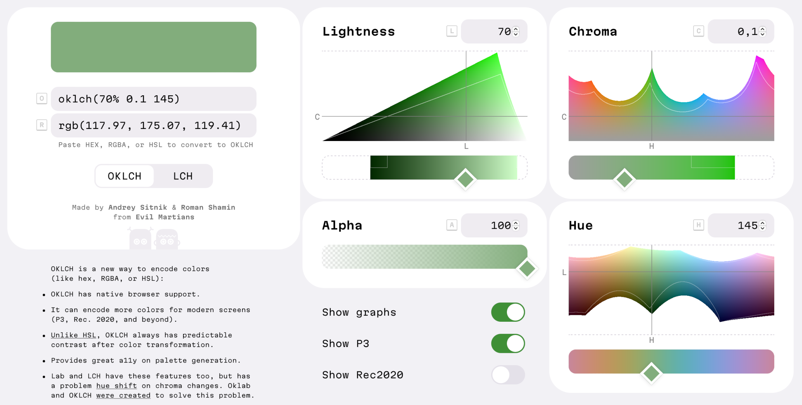
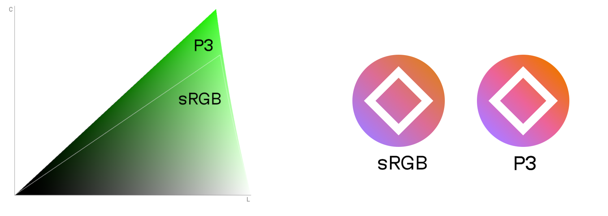

В CSS мы чаще всего пишем цвета через`rgb()`или hex — но так сложилось исторически. Новая спецификация CSS Color 4 позволит нам описывать цвета удобнее. В этой статье мы расскажем, почему нам больше всего нравится`oklch()`.

## Краткое объяснение

`oklch()`— новый способ определять цвета в CSS. В`oklch(L C H)`или`oklch(L C H / a)` компоненты из аббревиатуры расшифровываются так:

- `L`— яркость (`0%`-`100%`). Отметим, что она передаётся без искажения, в отличие от`L`в`hsl()`;
- `C`— насыщенность. Варьируется от серого до наиболее интенсивного оттенка;
- `H`— оттенок. В качестве значения указывается угол поворота оттенка на цветовом круге (`0`-`360`);
- `a`— непрозрачность (`0`-`1` или `0%`-`100%`).
<pre data-lang="css">
<code tabindex="0" class="language-css">
a:hover&nbsp;{
  background:&nbsp;

oklch(45% 0.26 264);&nbsp;/* голубой */

  color:&nbsp;

oklch(100% 0 0);&nbsp;/* белый */

  color:&nbsp;

oklch(0% 0 0 / 50%);&nbsp;/* чёрный с прозрачностью 50% */

}
</code>
</pre>
Формат OKLCH обладает многими преимуществами:

1. В отличие от`rgb()`или hex(`#ca0000`), OKLCH легко читается. По числам внутри`oklch()`мы без труда сможем определить записанный цвет. Схоже с удобством формата HSL, но тот не передаёт яркость так, как её видит человек;
2. OKLCH лучше подходит для трансформаций цвета, чем`hsl()`. Он правильно передаёт яркость, поэтому изменение оттенка сохранит контраст. Это защищает от неожиданных результатов, которые могут возвращаться CSS-функциями (например,`darken()`в Sass);
3. OKLCH имеет лучшую доступность благодаря предсказуемой яркости. Это очень заметно при создании палитр для дизайн-систем;
4. Многие новые устройства (например, от Apple) поддерживают больше цветов, чем старые мониторы sRGB. OKLCH позволяет использовать гамму P3, которая шире стандартного набора. В формате OKLCH действительно удобнее работать с новыми цветами.

Но, работая с OKLCH, следует помнить о паре важных нюансов:

1. Для OKLCH или LCH при подборе `L`,`C`и`H`есть риск получить цвет, выходящий за пределы возможностей экрана. Хоть браузеры и попытаются найти ближайший поддерживаемый цвет, нам стоит проверять результат в цветовом миксере;
2. OKLCH — цветовое пространство, которое появилось совсем недавно. На момент написания этой статьи в 2022 году его экосистема ограничена. Но у нас уже есть`oklch()`<a href="https://github.com/csstools/postcss-plugins/tree/main/plugins/postcss-oklab-function" target="_blank" rel="noopener noreferrer">полифил</a>, а также <a href="https://huetone.ardov.me/" target="_blank" rel="noopener noreferrer">генератор палитры</a>, <a href="https://oklch.evilmartians.io/" target="_blank" rel="noopener noreferrer">цветовой миксер</a> и много <a href="https://bottosson.github.io/posts/oklab/#oklab-implementations" target="_blank" rel="noopener noreferrer">конвертеров</a>.
<figure>
    
    <figcaption>Пространство OKLCH в цветовом миксере.</figcaption>
</figure>
Это было лишь краткое описание особенностей OKLCH. Если вы готовы больше узнать о новой эре CSS-цветов, то смело переходите к первой главе.

## Оглавление

- [Развитие цвета в CSS](#section-3)
- [Сравнение OKLCH с другими CSS-форматами цветов](#section-4)
- [Принципы работы OKLCH](#section-5)
- [Внедрение OKLCH в проект](#section-6)
- [Подведение итогов](#section-7)

## Развитие цвета в CSS
#### CSS Colors Module 4

Немного истории: 5 июля 2022 года спецификация <a href="https://www.w3.org/TR/css-color-4/" target="_blank" rel="noopener noreferrer">CSS Color Module Level 4</a> стала кандидатом в рекомендации W3C. В ней появляется синтаксический сахар для функций цвета, которым мы будем пользоваться в этой статье:
<pre data-lang="css">
<code tabindex="0" class="language-css">
.old&nbsp;{
  color:&nbsp;

rgb(51, 170, 51);&nbsp;

  color:&nbsp;

rgba(51, 170, 51, 0.5);&nbsp;

}

.new&nbsp;{
  color:&nbsp;

rgb(51 170 51);&nbsp;

  color:&nbsp;

rgb(51 170 51 / 50%);&nbsp;

}
</code>
</pre>

Но что ещё важнее, CSS Color 4 добавляет 14 новых способов для определения цвета. И это не просто синтаксический сахар. Новые форматы записи (среди которых и `oklch()`) улучшают читаемость кода, доступность и могут принести прямую пользу для наших сайтов.

#### P3 Colors

Стандартный набор цветов, который поддерживают устройства, называется sRGB. В него входят не все цвета, которые способен различить человеческий глаз, — это выходит за грани возможностей многих мониторов.

Но уже сейчас все современные устройства Apple и многие OLED-экраны поддерживают на 30% больше цветов, чем есть в sRGB. Этот расширенный набор цветов называется P3. Он также известен, как широкий цветовой охват (wide-gamut colors).

Поддержка дополнительных 30% цветов будет полезна для дизайнеров:

- Новые цвета зачастую заметно ярче старых. Это поможет создавать более привлекательные и красочные веб-страницы;
- Дополнительные цвета делают более гибким процесс создания палитр для дизайн-систем.
<figure>
    
    <figcaption>Слева — недавно ставший доступным набор зелёных P3-цветов. Справа — сравнение иконок, использующих sRGB и P3-цвета соответственно.</figcaption>
</figure>

Итак, теперь у нас появились P3-цвета — но радоваться ещё рано: чтобы их использовать, нам нужно найти формат, который поддерживает охват P3.`rgb()`,`hsl()`или hex неудобны для указания P3-цветов — хоть мы и можем использовать новую запись`color(display-p3 1 0 0)`, это не решает проблему плохой читаемости RGB.

К нашему везению, OKLCH очень легко читать и менять прямо в коде. К тому же он поддерживает не только P3, но и любые цвета, которые способен увидеть человек.

#### Нативная поддержка работы с цветом в CSS

CSS Color 4 — это большой шаг в мире стилей, и грядущий <a href="https://www.w3.org/TR/css-color-5/" target="_blank" rel="noopener noreferrer">CSS Color 5</a> будет ещё полезнее. В нём, наконец, появится нативная поддержка работы с цветом.
<pre data-lang="css">
<code tabindex="0" class="language-css">
/* В качестве примера в следующих CSS-правилах используются hsl().
   Не используйте формат hsl() в реальных проектах, так как это влечёт проблемы с доступностью. */
:root&nbsp;{
  --accent:&nbsp;

hsl(63 61% 40%);&nbsp;

}

.error&nbsp;{
  /* Красный вариант акцентирующего цвета */
  background:&nbsp;

hsl(from var(--accent) 20 s l);&nbsp;

}

.button:hover&nbsp;{
  /* Вариант на 10% светлее */
  background:&nbsp;

hsl(from var(--accent) h s calc(l + 10%));&nbsp;

}
</code>
</pre>
С новым синтаксисом мы можем взять один цвет — например, из кастомного свойства — и легко изменить его, переписав отдельные компоненты.

Но, как мы упоминали, в подходе с использованием`hsl()`есть ощутимый недостаток: этот формат обладает плохой доступностью. Для него значение`l`зависит от угла поворота оттенка, поэтому цвет при использовании`hsl()`может удивить неожиданным контрастом.

Здесь мы возвращаемся к старой проблеме: нам необходимо пространство, где работа с цветом даёт предсказуемый результат. И OKLCH отлично подходит для этой задачи.
<pre data-lang="css">
<code tabindex="0" class="language-css">
:root&nbsp;{
  --accent:&nbsp;

oklch(70% 0.14 113);&nbsp;

}

.error&nbsp;{
  /* Красный вариант акцентирующего цвета */
  background:&nbsp;

oklch(from var(--accent) l c 15);&nbsp;

}

.button:hover&nbsp;{
  /* Вариант на 10% светлее */
  background:&nbsp;

oklch(from var(--accent) calc(l + 10%) c h);&nbsp;

}
</code>
</pre>
Отметим: вам не нужно использовать OKLCH для указания`--accent`в`oklch(from …)`, но для улучшения читаемости мы рекомендуем писать в едином формате.
 