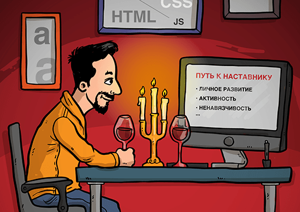
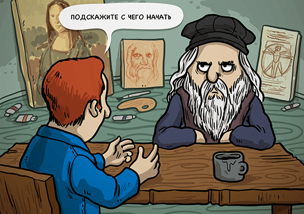

Если звезды фронтенда зажигаются, значит, кто-то их зажигает? Кто? Приоткрываем завесу тайны над темой наставничества в вебе.

На написание этой статьи я решился неспроста, на это меня подвигли две вещи. Во-первых, история, произошедшая после публикации моей статьи [«Путь верстальщика»](http://css-live.ru/faq/put-verstalshhika.html), из-за которой этот пост уже напрашивался сам по себе — мне давно хотелось подробнее пояснить некоторые важные моменты. А во-вторых, [дебютный доклад](https://youtu.be/qFeCi6E3e14?t=1345) [Алёны Батицкой](https://twitter.com/ABatickaya) о пользе наставничества, ставший для меня последней каплей и одновременно толчком для написания всего этого.

> **А.Б.** Хочу сказать, что все, о чем я говорила в докладе и о чем я пишу, что советую в обычной жизни, является моим личным мнением, основанным на опыте в совершенно разных сферах. Предложенные мною «рецепты» не являются истиной в последней инстанции. Вы можете составить свою программу наставничества, выбрать свой путь развития как новичка, так и наставника или использовать мои рекомендации как основу.

Как вы могли догадаться, и моя статья, и доклад Алёны связаны друг с другом, и вскоре вы поймёте, как именно. Единственное — у меня к вам есть просьба. Перед тем как продолжить читать, посмотрите, пожалуйста, сам доклад, так вам будет легче понять, о чем пойдет речь.

### Откуда ветер дует

> **А.Б.** Только придя в разработку, я заметила странную тенденцию. О новичках говорят либо плохо, либо никак. На вопросы новичков смотрят свысока. Придираются к словам, закидывают яйцами за неточные формулировки. И это в лучшем случае! Большинство просто проходят мимо. Исключения, безусловно, встречаются. Но новички в такой обстановке чувствуют себя очень неуверенно, скованно. Они сбиваются в стайки и пытаются научиться хоть чему-то между собой. Понимаете исход? На выходе получается фабрика велосипедов. Я знаю несколько таких историй. А потом вы, опытные разработчики, ругаетесь на невероятные конструкции и страшный код. Подумайте, а могли ли вы этого не допустить? Отсюда и родилась мысль, что в разработке пора начать говорить о наставничестве. Давно прижившееся в других сферах и доказавшее свою эффективность, наставничество шагает по планете. Наше сообщество уже достаточно выросло и окрепло, чтобы начать смотреть вперед на несколько шагов и передавать полученный опыт из уст в уста.

## Мои личные грабли

В недалёком 2012 году я написал уже упомянутою мной статью под незамысловатым названием [«Путь верстальщика»](http://css-live.ru/faq/put-verstalshhika.html), где я поведал читателям о своем собственном пути в веб-разработке. В целом статья получила множество положительных откликов, и, казалось бы, всё круто, есть профит, но не тут-то было. В один из разделов этой статьи всё-таки закрался червячок, я бы даже сказал, не просто червячок, а такой жирный огромный червь. Это был раздел «Наставник». В этом пункте я описывал, как мне помогали и помогают учителя, и какие плоды приносили занятия с ними.

Я совершил одну непростительную ошибку, за которую мне до сих пор стыдно. Дело в том, что в то время ещё не было ни таких замечательных обучающих сайтов, как [«HTML Academy»](https://htmlacademy.ru/), ни подобных ресурсов, да и вообще, в Рунете не было столько информации, как сейчас. Поэтому я взял и сдуру послал всех новичков на [htmlforum.ru](https://htmlforum.ru/), сказав им, чтобы они искали себе учителей именно там, как в своё время поступил и я сам.

После нехилого резонанса статьи тысячи новичков восприняли мой посыл буквально и толпами повалили на форум в поисках веб-сэнсэя. Ежедневно на форуме создавалось по сто одинаковых тем, в которых начинающие разработчики предлагали себя в качестве учеников и просили, чтобы им в срочном порядке выдали наставника. Бедные модераторы уставали, не успевая каждый день удалять и отвечать на множество похожих тем, и продолжалось это, не поверите, **аж несколько лет**, моему коллеге даже пришлось [создать отдельную тему](https://htmlforum.ru/topic/47881-%D0%BA%D0%B0%D0%BA-%D0%BD%D0%B0%D0%B9%D1%82%D0%B8-%D0%BD%D0%B0%D1%81%D1%82%D0%B0%D0%B2%D0%BD%D0%B8%D0%BA%D0%B0%D0%B3%D1%83%D1%80%D1%83-%D1%83%D1%87%D0%B8%D1%82%D0%B5%D0%BB%D1%8C%D1%8F-%D1%81%D1%8D%D0%BD%D1%81%D1%8D%D1%8F-%D0%BF%D0%BE-%D0%B2%D1%91%D1%80%D1%81%D1%82%D0%BA%D0%B5/), дабы усмирить пыл неофитов! А ещё, как назло, всё это совпало с тем, что мне нужно было уйти из веба на полтора года по семейным обстоятельствам, т.е., по сути всё это происходило в моё отсутствие. Вот такой вот непростительный вброс я сделал и наломал дров. Теперь вы понимаете, почему мне до сих пор так стыдно перед нашими модераторами?

Конечно, мне поступали предложения вообще удалить этот раздел из статьи, но я был решительно против этого, поскольку, во-первых, из песни слов не выкинешь, а во-вторых, я всё-таки рассказывал собственную историю, и мне не хотелось что-то из неё вырезать.

### Этикет наставничества

> **А.Б.** После доклада ко мне обратилось несколько человек с просьбой подсказать, что нужно делать, чтобы найти наставника. Всем им я дала примерно одинаковые советы.
> 1. Будьте активны. Явно выражайте интерес к происходящему в мире разработки в целом и в вашем регионе в частности. Посещайте доступные для вас конференции, встречи и митапы.
> 2. Не останавливайтесь в развитии. На то время, пока вы ищите наставника, вы не должны переставать самостоятельно обучаться. Продолжайте совершенствовать свои знания, изучайте новое, набивайте руку на тестовых проектах, пополняйте портфолио. Согласитесь, с наставником будет интереснее обсуждать глобальные вопросы, нежели выравнивание по вертикали.
> 3. Найдите людей, чьей работой вы восхищаетесь. Чаще всего это публичные люди. Они с удовольствием идут на контакт. Последите за их деятельностью, с кем они общаются, кто в их окружении. Расширяйте свой круг виртуальных знакомств. Беря курс на крутых разработчиков, вы и сами для себя ставите высокую планку.
> 4. Спрашивайте в сообществах, чатах, на форумах. Но, пожалуйста, перед тем как написать вопрос, постарайтесь самостоятельно найти решение. Обязательно поищите информацию в англоязычном интернете. И только после того, как вы испробовали на ваш взгляд все возможные варианты, идите задавать вопрос.
> 5. Обратите внимание на того, кто на ваш взгляд дал наиболее развернутый ответ на ваш вопрос. Подумайте, вызывает ли этот человек у вас симпатию. Постарайтесь найти его проекты и изучить их. Если вы поняли, что хотели бы чему-то научиться у этого специалиста, то попросите разрешения написать ему лично в следующий раз.
> 6. Будьте готовы к отказу. У человека может не оказаться свободного времени. Отнеситесь с пониманием и продолжайте свои поиски.
> 7. Не будьте навязчивыми. Уважайте чужое время и пространство. В самом начале личной переписки предложите обговорить удобный для вас обоих формат общения.
> 8. Не обязательно официальное предложение. Иногда общение складывается естественным образом или в таких условиях, где официальное предложение стать наставником будет просто неуместно. Старайтесь перенимать любой опыт, который будет вам доступен. Но я лично считаю, что заданный вопрос о наставничестве будет означать честный и открытый договор между двумя людьми, которые понимают природу взаимоотношений. Так вы скорее всего избежите неловкости и недопонимания.
> 9. Благодарите наставника при любой возможности. Если у вас есть возможность высказать свою благодарность публично, то обязательно сделайте это. Таким образом вы внесете вклад в личный бренд наставника в сообществе. Про личную благодарность я даже напоминать не буду.

## Не было бы счастья, да несчастье помогло

На самом деле из этой истории я вынес для себя несколько полезных уроков.

### Говорите о наставничестве

Первым делом я осознал, что тема наставничества сама по себе очень тонкая, насущная и волнующая массы. Эта тема всегда будет актуальна и будет постоянно пользоваться спросом. Ведь недаром несколько лет кряду новички мучили модераторов на форуме, а вокруг доклада Алёны поднялся такой ажиотаж, что в Слаке несколько дней не утихали споры о пользе и вреде наставничества.

Сама тема наставничества крайне живая и полезная, хотя с последним эпитетом многие не согласятся, но об этом мы поговорим чуть позже. Эта тема напомнила мне очень крутой [доклад Вадима Макишвили «36»](https://www.youtube.com/watch?v=xPPCzryZK44) — такой же животрепещущий и способный затронуть самые тонкие струны нашей души. Если вы не совсем понимаете, о чём я, то обязательно посмотрите доклад Вадима.

Но если наставничество — такая важная вещь для сообщества, почему же о ней так мало говорят? Вы часто видели доклады или хотя бы статьи на эту тему? Вот видите, и я не часто. Я считаю, что наш долг — делать веб лучше, а говорить о наставничестве — это как раз и означает делать веб лучше. Не стесняйтесь, пишите статьи, делайте доклады, рассказывайте собственные истории (пусть даже и негативные), делитесь тем, как это происходит в ваших компаниях, да и просто говорите об этом! И тогда, возможно, все больше желающих учить и учиться будет появляться в наших рядах!

### <del>Уважение</del> Наставника ещё надо заслужить

Временами, мысленно возвращаясь к своей статье и к этому злосчастному пункту «Наставник», я осуждаю себя за то, что не догадался упомянуть один важный ключевой момент, из-за которого, возможно, высшие силы и наградили меня учителем. Ведь, чтобы меня взяли на поруки, изначально мне пришлось изрядно попотеть.

Я не просто пришёл на форум, создал пост и получил наставника, как, видимо, подумали многие. Долгое время мне приходилось доказывать, что я чего-то стою, что у меня есть потенциал. Я старался не пропускать ни одну тему на форуме, пытался помогать другим, отписывал тонны комментариев, брался за любые, даже непосильные для меня задачи, пробовал себя то в одном, то в другом деле, я фактически сутками жил на форуме. То есть, я делал **всё**, чтобы меня заметили и захотели обучать. А главное, мне настолько нравилось моё занятие, что в те моменты я даже и не думал о каких-то там наставниках.

Приведу простой пример — героиня моей статьи Алёна Батицкая. Как человек со стороны, я прекрасно вижу, что представляет из себя эта девушка. Я вижу, что она пишет в Твиттере, как она общается, какие статьи она переводит, она даже выступает с докладами! И я понимаю, что этот человек пойдёт далеко, что она любит то, чем занимается, и с каждым днём эта любовь только крепнет. Она не очередной пассажир. Понимаете, о чем я?

Я никого не хочу обидеть, но сегодня не так много альтруистов, готовых тратить своё драгоценное время на кого попало. Мне кажется, что всеми своими действиями нужно доказывать своё право на место под солнцем. Нужно давать понять окружающим, что ты можешь, хочешь, а главное, что ты достоин, чтобы тебя заметили. Нужно выказывать свои стремление и желание расти и быть лучше. Другими словами, **наставника нужно заслужить**! Мало просто прийти на тот же форум и потребовать учителя.

> **А.Б.** Новичку стоит помнить, что наставничество — дело добровольное. При этом довольно трудозатратное. Учитель должен ощутить, что он получит пусть и нематериальную, но выгоду от работы с вами. Что его время не будет потрачено зря. Требовать в этом деле вообще нельзя. Между учеником и учителем должна пробежать искра. Они должны комфортно ощущать друг друга в рамках этих партнерских отношений. Каждый должен с удовольствием отдавать и с благодарностью принимать. Взаимное уважение и стремление сделать друг друга лучше — основа крепких отношений между наставником и подопечным.

### Два лагеря

К сожалению, далеко не все разделяют мнение о пользе наставничества. Здесь люди делятся на два лагеря. Первые одобряют это, а вторые, **которых большинство**, считают, что наставничество — это утопия, путь в никуда, и что веб-сэнсэй может принести только вред. Их мнение сводится к тому, что у них не было никаких наставников, что их никто не учил, и что при этом они всего добились сами, своими силами. Они считают, что если рядом с вами будет человек, который будет тыкать вас в ошибки, искать за вас информацию в интернете и всюду «подтирать» за вами, то вы не сможете стать самостоятельными, не научитесь справляться своими силами, а значит веб-разработка не для вас.

Поскольку я принадлежу к первому лагерю, поначалу я пытался сопротивляться и отстаивал свою точку зрения. Но позже я осознал, что это лишняя трата времени, и что первые никогда ничего не докажут вторым, и наоборот. Я постарался по-взрослому проанализировать эти вещи и понял следующее. Если обратить внимание не на слова, а на дело, точка зрения несогласных с наставничеством вполне имеет право на жизнь. Во-первых, потому что их большинство, а во-вторых, просто потому, что среди них есть очень толковые ребята, которые на деле доказали, что можно всего добиться самому. У меня у самого куча таких знакомых, например, тот же _@s0rr0w_ из Слака «[Веб-стандартов](http://slack.web-standards.ru/)», которого наверняка все знают по его прикольной аватарке и огромному опыту!

Я пришёл к мнению, что в этом деле не стоит ссориться, ругаться и устраивать драки. Мы не в политике и не на войне, мы делаем общее дело и ходим под одним <del>небом</del> вебом. Вставлять друг другу палки в колёса — не выход. Если начинающий разработчик чувствует, что ему нужен учитель, то зачем его отговаривать от этого, пытаться разубедить? Посоветуйте лучше хорошего коллегу, который занимается наставничеством, или по крайней мере не навязывайте свое отношение. У каждого свой путь, как и свое мнение.

> **А.Б.** Большая просьба к опытным, старшим разработчикам — реагируйте адекватно на джунов, которые приходят и с порога требуют наставника. Как и во многом другом, в природе наставничества они еще не до конца разобрались. Не злитесь на них, не пытайтесь убедить, что «так бывает только в сказках». Лучше пошутите по-доброму и дайте почитать эту статью. В подобных случаях я всегда советую вспомнить как вы сами были новичками. Ваш негатив очень сильно ранит джунов. Они и так не уверены в себе, понимают, что умеют еще очень немного. Но их неопытность не недостаток. Стремление к знаниям и желание развиваться — их основной козырь. Не ломайте им крылья.

## Почему я должен делиться опытом? Я сам научился всему!

Многие противники наставничества говорили эту фразу. Почему они смогли, а нынешняя молодежь не может?

Стоит оглядеться и сопоставить количество доступных технологий, скорость развития индустрии, разницу подходов, методологий, принципов. Когда учились вы — было несколько сайтов, пара хороших книг и узкий круг таких же, как вы. Было гораздо меньше информации. Было проще понять, что в каком порядке изучать. Было меньше технологий, которые требовались для работы. Вы получили хорошую основу, начали ее применять, а затем постепенно наращивали багаж знаний.

Сегодня доступность и количество информации является не только плюсом, но и минусом. Неопытный человек теряется, пытается ухватиться за все подряд и в итоге ничего толком не может освоить. За редким исключением.

## Наставничество — не работа

Старшие товарищи, не воспринимайте наставничество как обязанность, работу, за которую к тому же не платят. Я, как и моя соавтор, как любой, кто говорит с вами о наставничестве, не пытаемся навязать вам неприятное занятие, которым вы непременно должны заняться. Наставничество — это определенный этап развития вас, как члена сообщества.

Веб является молодой сферой. Сообщество находится на начальном этапе развития внутренних отношений. По моему личному мнению, пришло время задуматься о подрастающем поколении. Условия изменились, выживать в одиночку все сложнее. В первую очередь, у вас должно появиться желание отдавать безвозмездно. Если в отношениях будут фигурировать деньги или иные материальные блага, то речь будет идти уже о репетиторстве в той или иной форме.

Вашего времени должно хватать на еще одного человека. При этом не обязательно быть на связи постоянно. Вы можете обговорить с подопечным удобный формат общения. Например, письмо с вопросами раз в неделю, созвон по Скайпу два раза в месяц или общение только в вечернее время в чатах. Никто не ждет от вас жертвенности. Вам должно быть комфортно.

Если посмотреть на [пирамиду Маслоу](https://ru.wikipedia.org/wiki/%D0%9F%D0%B8%D1%80%D0%B0%D0%BC%D0%B8%D0%B4%D0%B0_%D0%BF%D0%BE%D1%82%D1%80%D0%B5%D0%B1%D0%BD%D0%BE%D1%81%D1%82%D0%B5%D0%B9_%D0%BF%D0%BE_%D0%9C%D0%B0%D1%81%D0%BB%D0%BE%D1%83), то наставничество находится на ее вершине, в пункте «Самоактуализация».

Наставничество — только одна из сотен возможностей внести свой вклад в сообщество, частью которого вы являетесь.

## Живые примеры

К этому моменту у многих из вас уже наверняка возник вопрос: «Чувак, что ты нам за дичь втираешь уже столько времени, у тебя реальные примеры есть? Кому твоё наставничество вообще помогло, а?». На самом деле примеры есть, и прямо сейчас мы их рассмотрим.

На наставничестве специализируются целые организации. Например, ребята из [«HTML Academy»](https://htmlacademy.ru/) уже давно и довольно успешно обучают молодое поколение веб-разработчиков. Они сосредоточены на фронтенде и могут запросто пройти с вами путь от новичка до профессионала, стоит вам только захотеть. На их сайте есть множество бесплатных уроков, а также платные интенсивы и курсы, на которых как раз можно нанять преподавателя. И [многочисленные положительные отзывы](https://htmlacademy.ru/blog/91-online-intensive-html-css) только подтверждают факт того, что наставник — это здорово!

Есть программы наставничества и у Яндекса, например, [«ШРИ» (Школа разработки интерфейсов)](https://academy.yandex.ru/events/frontend/shri_msk-2016/). Они набирают начинающих фронтенд-разработчиков с любым опытом работы и обучают их всем премудростям вёрстки. Обучение делится на два этапа: первый состоит из курса лекций, а на втором ученикам выпадает возможность поучаствовать в разработке совместного проекта. Занятия проходят в офисах Яндекса, а в качестве наставников выступают сами разработчики Яндекса, которые делают интерфейсы для Поиска, Почты, Карт и других сервисов. Кстати, «ШРИ» проходит в разных городах и абсолютно бесплатно, поэтому у каждого из нас есть шанс туда попасть. Если есть желание, можете почитать [целую увлекательную историю](https://habrahabr.ru/company/yandex/blog/189056/) одного из учеников этой школы.

Но, пожалуй, особое везение — найти личного наставника, готового поддерживать добрым словом и полезным советом несколько лет подряд, на разных этапах профессионального роста. Это явление настолько редкое, что примеры надо еще поискать, но у меня как раз есть несколько.

По вышеописанному нетрудно догадаться, что я всегда был двумя руками за наставничество. За что бы я ни брался, у меня всегда были учителя. Например, вёрстке меня обучал искусный мастер своего дела [Алексей Филиппович](https://htmlforum.ru/profile/4521-klierik/), JavaScript — упомянутый выше великий и могучий [s0rr0w](https://github.com/s0rr0w) (да, не удивляйтесь, **s0rr0w** приветствует оба лагеря, но с нюансами, о которых он поведает в комментариях), ну а сегодня (и уже на протяжении лет шести) моей путеводной звездой является Илья Стрельцын, [@SelenIT2](https://twitter.com/SelenIT2) в Твиттере, человек, которому я безмерно благодарен, и который способен дать не только профессиональный, но и жизненный совет.

Вы можете спросить, мол, и что путного вышло из всего этого наставничества? Да, собственно целый проект — [css-live.ru](http://css-live.ru/), который благодаря наставничеству благополучно живёт и здравствует и по сей день! Чем не доказательство?

### Полегче, новичок!

> **А.Б.** Новичок, не думай, что с нахождением наставника ты решишь все свои проблемы. Не воспринимай это как единственный способ развития. Тебе по-прежнему придется делать все самому. Много читать, практиковаться, пробовать. Разница только в том, что рядом будет человек с опытом, с которым ты сможешь обсудить не до конца понятные тебе вопросы, узнать, верно ли твое решение или это очередной велосипед, просто поговорить на интересные темы. Наставник подскажет тебе, что стоит освоить в первую очередь, а к чему можно вернуться позже. Но он не твой персональный репетитор, не твой домашний учитель, не Гугл. Относись с уважением к его желанию вложить в тебя силы и время. Благодари его за опыт, которым он делится. Благодарность — единственная валюта в этих отношениях. Если ты способен что-то дать в замен — давай, не раздумывая. Наставничество — как дружба, нуждается во внимании обоих.

## Под занавес

Несмотря на внушительный объём статьи, тема наставничества была раскрыта далеко не полностью. Я попытался рассказать свою историю, а Алёна дала множество замечательных советов. Но, тем не менее, здесь не хватает ваших историй, связанных с наставничеством, тех, которые произошли лично с вами. Не стесняйтесь, делитесь своими примерами в комментариях, уверен, что они окажутся полезными для сообщества! Либо, если не хотите афишировать, можете написать Алёне на [почту](mailto:batickaya.a@gmail.com) или [на Фейсбуке](https://www.facebook.com/ABatickaya).

> **А.Б.** Пока в русскоязычном интернете нет специализированных площадок, на которых могут встретиться подопечные и наставники. Людям хочется найти друг друга, но иногда для этого нужна общая точка сбора. Я решила, пока возможно, собирать у себя контакты желающих и по возможности сводить учителей и учеников. Для этих целей создана [небольшая анкета](http://goo.gl/forms/pMC7UVjI4mfWdBU33). Если вам интересно найти своего наставника или подопечного — обязательно заполните ее. Это эксперимент, попытка собрать некую общую базу желающих. Я буду вручную отслеживать ответы и высылать контакты. Также на днях [в Гиттере собралась рабочая группа](https://gitter.im/FrontendTutors/general), которая планирует создать специализированный русскоязычный портал для этих целей. Присоединяйтесь!

## Благодарности

Огромное спасибо моему соавтору [Алёне Батицкой](https://twitter.com/ABatickaya) за такую прекрасную поддержку и ценные дополнения к статье. Также нельзя не поблагодарить [Анастасию Бакай](http://positivecrash.com/) за потрясающие иллюстрации. И, конечно же, отдельное спасибо всем нашим учителям!

> **А.Б.** От себя хочу сказать спасибо людям, которые были и остаются рядом на пути моего развития: Вера Жукова, Татьяна Тен, Дмитрий Фитискин и Вадим Макеев. Это далеко не полный список тех, кто нашел в себе силы и желание поделиться своим опытом.
