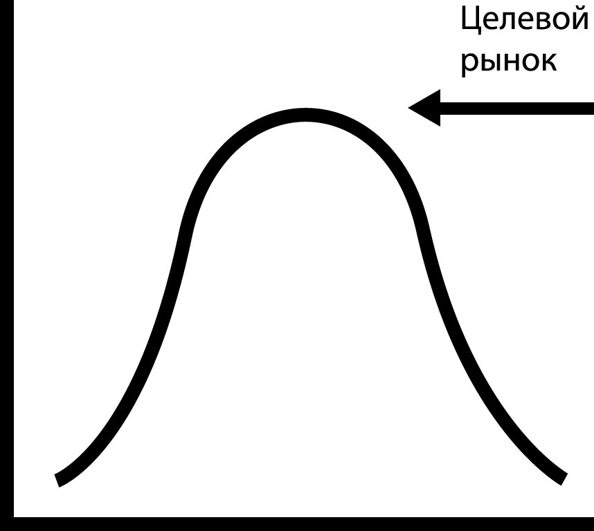

Последнее время только и разговоров в защиту прогрессивного улучшения и «универсальных» (изоморфных) приложений. Оказывается, серверный рендеринг улучшает быстродействие, надёжность, совместимость и упрощает парсинг содержимого.

Я поддерживаю эти аргументы из душевной щедрости.

Но есть и глубокая озабоченность, связанная с применением прогрессивного улучшения и изоморфизма, о которой стоит поговорить. И похоже только у меня хватит смелости, чтобы пойти против толпы. Не благодарите.

### 1. Это сложно :(

Создавать приложения, которые либо рендерят статическое содержимое и потом улучшают его с помощью JavaScript, либо работают как приложения сразу на сервере и клиенте — это очень, очень сложно. Типа _очень_.

Нет, конечно, это значит, что больше пользователей получит доступ к содержимому быстрее и надёжнее — с этим я не спорю. Но кто сказал, что вообще _будут_ какие-то пользователи? Или какое-то _содержимое_, если уж на то пошло. Половина проектов, над которыми я работаю, уходят в стол из-за реорганизаций компании. В чём смысл тратить всё это дополнительное время на сложности прогрессивного улучшения? Да не глупите.

Но это даже не самая главная проблема. Главная проблема в том, что моя идентичность построена вокруг интеллектуальной компетенции. Это значит, что, когда встречаюсь с интеллектуальной сложностью, я довольно быстро теряю эту самую компетенцию.

Поэтому, прежде чем приступать к архитектуре универсального приложения, спросите себя: «Правда ли мне нужно, чтобы кто-то в страшном когнитивном диссонансе взбесился на меня?»

Думаю нет. _(Это будто бы звучит как угроза, гы-гы. Сорьки, лол.)_

### 2. Мне это не нужно

Прогрессивное улучшение делает жизнь пользователей легче в некоторых ситуациях, вроде медленных сетей, слабых устройств и т.п. — это правда. Не поймите меня неправильно, я двумя руками за то, чтобы создавать приложения для пользователей, но не забыли ли мы о ком-то ещё? Раз уж я создал чёртово приложение, разве у меня нет права голоса в том, как оно создано?

Конечные пользователи — это такое неизвестное множество, и мы мало что можем с этим сделать. С другой стороны, я уже знаю много чего о _себе_ потому, что я — _это я_. Мне стоит пользоваться всеми преимуществами такой инсайдерской информации.

<figure>
    
    <figcaption>
        Целевой рынок или «верхушка колокола».
    </figcaption>
</figure>

И что же я знаю о себе? Ну, для начала, у меня вполне неплохое окружение: оптика, 16 Гб оперативки. А ещё я не выношу работы с прогрессивным улучшением, **фу, гадость**. (См. пункт №1).

Хотя больше всего я люблю делать новые фичи. Чем меньше времени мне придётся потратить на стабильную архитектуру (скукота), тем больше времени останется на создание фич. Знаете, как говорят: **больше фич — лучше экспириенс!** Все в выигрыше.

### 3. Это провоцирует плохое поведение

И если мы лезем вон из кожи (а это действительно заставляет вас лезть из кожи) чтобы убедиться, что содержимое дойдёт слабеньких устройств с крошечными лимитами трафика на дерьмовеньких сетях, мы просто даём аудитории отговорку, чтобы не обновляться.

Я хочу, чтобы ты был лучше, насколько это возможно!

Ну и поезда. То есть у вас проблемы с тем, чтобы загрузить срендеренную на клиенте блокирующе-зависимую от скриптов страничку по 2G потому, что вы в поезде? Решение прямо у вас под носом: **хватит ездить на поезде.** Либо найдите себе комнату в центре города рядом с работой, либо спите под столом. Я так и сделал, почему вы не сможете?

Ну правда, примите уже ответственность.

### 4. Кругом только веб-приложения

Веб изначально был рождён для публикации и распространения текстов в целях приобретения и утверждения знания. К счастью, эти тёмные и примитивные годы остались позади нас и мы перешли к лучшим вещам, вроде создания приложений, которые смотрят на фотографии собак и пытаются определить их возраст.

Нет никакого «документа» в основе приложения, которое определяет возраст вашей собаки. Ну, то есть, как бы он вообще выглядел? Картинка чьей-то собаки с подписью «Я не знаю сколько мне лет, извините» под ней? Это убого. Я бы скорее предпочёл не увидеть вообще ничего, если уж начистоту.

Нет, если вы не хотите знать, что думает ваш браузер о возрасте вашей собаки, пожалуйста — выключите JavaScript или прокатитесь на поезде (см. пункт №3). Вы всё равно не заслуживаете знать, сколько лет вашей собаке.

Но потом не приходите ко мне в слезах, когда кто-нибудь рядом спросит сколько лет вашей собаке, и вам придётся сказать «Я не знаю, где-то между 5 и 8, наверное» вместо «Я не знал, но кто-то запостил это довольно забавное веб-приложение на Фейсбуке. Давайте покажу. Минутку. Вот оно. Секунду. Извините. Сейчас. А, ладно, проехали».
