Что все они означают?


Измерение производительности загрузки страницы — это сложная задача. Чтобы сделать её проще, [инженеры компании Google](https://medium.com/google-developers) вместе с сообществом работают над прогрессивными веб-метриками, или ПВМ.

Что такое ПВМ и зачем они нужны? Для начала, давайте сделаем небольшой экскурс в историю браузерных метрик. Некоторое время назад мы имели всего две точки (события) для измерения производительности:

1. `DOMContentLoaded` срабатывает, когда страница загрузилась, но скрипты только начали выполняться.
2. Событие `load` срабатывает, когда страница полностью загрузилась и пользователь может полностью с ней взаимодействовать.

Если взглянуть на [трейс сайта Reddit](https://chromedevtools.github.io/timeline-viewer/?loadTimelineFromURL=drive://0ByCYpYcHF12_YjBGUTlJR2gzcHc) (Chrome DevTools помогает нам, помечая эти точки синей и красной линиями), мы можем увидеть почему эти метрики не так полезны, как хотелось бы.

<figure>
    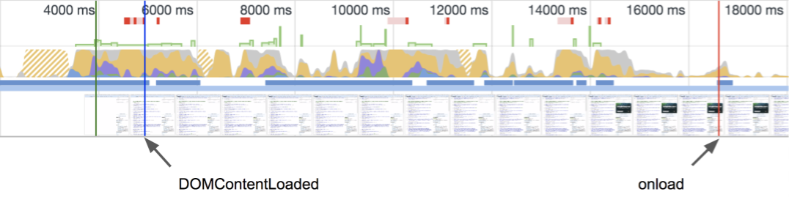
    <figcaption>
        Трейс сайта Reddit.
    </figcaption>
</figure>

> Сегодня мы видим, что window.onload не отражает восприятие пользователя, как это было когда-то. [Стивен Саудерс](https://www.stevesouders.com/blog/2013/05/13/moving-beyond-window-onload/)

Конечно. Так же понятны и недостатки `DOMContentLoaded` во время парсинга и компиляции JavaScript: выполнение этих операций для больших скриптов может занять достаточно много времени. Например, на мобильных устройствах. Упомянутый выше трейс был замерян в условиях эмуляции 3G и показал разницу 10 секунд между `DOMContentLoaded` и `load`.

С другой стороны, `load` сработал очень поздно, чтобы можно было проанализировать узкие места в производительности загрузки страницы. И главный вопрос: как пользователи _воспринимают_ загрузку страницы с момента старта до полной загрузки?

Почему это восприятие так важно? Читайте подробнее [в статье разработчиков Chrome](https://developers.google.com/web/updates/2017/06/user-centric-performance-metrics), где ещё раз подчеркивается проблема `load`.

Рассмотрим график: ось X показывает время загрузки, ось Y — количество пользователей, которые ожидали какое-то время. Далеко не для всех пользователей загрузка страницы происходит меньше, чем за 2 секунды.

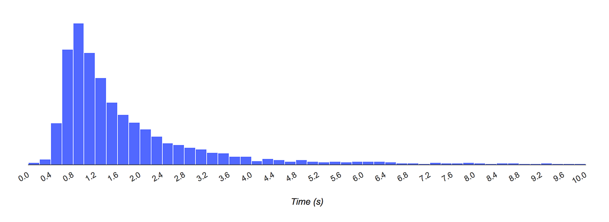

Если вернуться к нашему трейсу, то событие load, которое заняло 17 секунд, ничего нам не говорит о том, как пользователь воспринял загрузку страницы. Что он видел все эти 17 секунд: пустую страницу, частично загруженную? Был ли загруженный контент заблокирован, так что пользователь не мог поставить курсор в поле или прокрутить страницу?

Имея ответы на эти вопросы вы можете:

1. Улучшить ощущения от работы сайта;
2. Привлечь больше пользователей к вашему приложению;
3. Увеличить выгоду для владельца продукта (пользователи, заказчики, деньги).

Поэтому ребята из команды Chrome попробовали прочитать мысли пользователей и предугадать какие же вопросы они себе задают во время загрузки страницы:

1. **Что происходит?** Произошла ли навигация успешно;
2. **Это то, что мне нужно?** Отрендерилась ли страница, достаточно ли там контента, с которым можно взаимодействовать;
3. **Уже можно пользоваться?** Можно ли, наконец, взаимодействовать со страницей или она всё ещё занята;
4. **Это восхитительно?** Испытывал ли пользователь негативный опыт зависания скролла, анимация, медленных шрифтов.

Если события `DOMContentLoaded` и `load` не могут ответить на эти вопросы, то кто может?

## Прогрессивные веб-метрики

ПВМ — список метрик, цель которых помочь разработчикам определять узкие места в производительности загрузки страницы. В отличие от событий `DOMContentLoaded` и `load`, ПВМ предоставляют разработчикам более детальную информацию.

Давайте начнем разбираться с каждой из метрик на примере трейса Reddit, который мы упоминали выше.

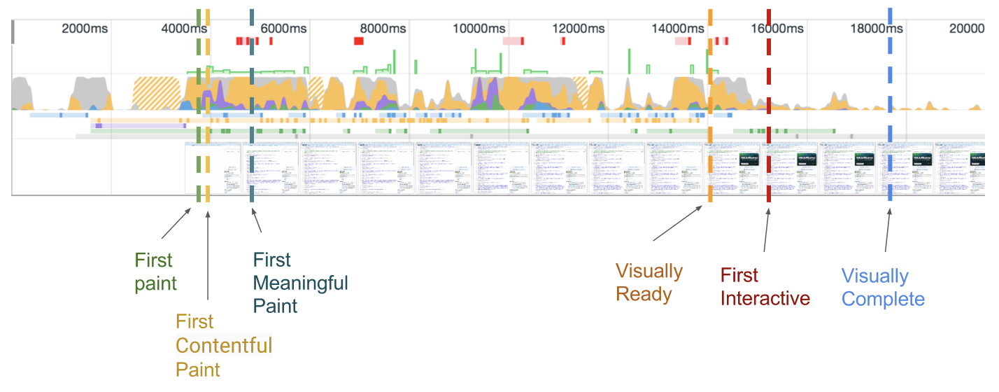

## Первая отрисовка

First Paint (FP)

Я немного слукавил, говоря что у нас есть только две метрики. Chrome DevTools также предоставляют ещё одну метрку — первая отрисовка. Это момент когда страница только начала отрисовываться. Говоря другими словами — это время, когда пользователь видит пустую страницу впервые. Подробнее читайте [в спецификации](https://github.com/w3c/paint-timing).

<figure>
    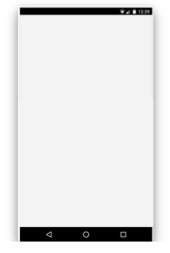
    <figcaption>
        Первая отрисовка сайта <a href="https://www.msn.com/">MSN</a>.
    </figcaption>
</figure>

Чтобы понять, как это работает, можно взглянуть на графический слой (GraphicsLayer) в Chromium.

<figure>
    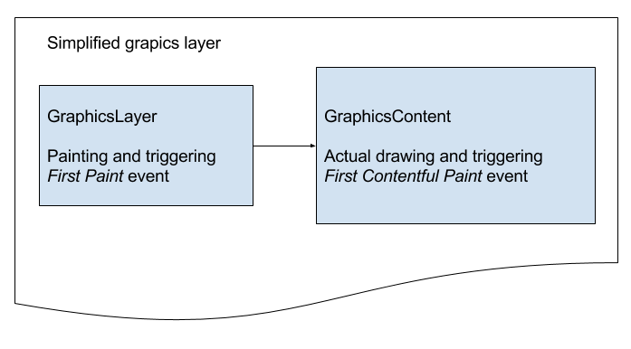
    <figcaption>
        Упрощённый графический слой.
    </figcaption>
</figure>

Событие первой отрисовки срабатывает, когда только начался отрисовываться графический слой, но не картинки, SVG или Canvas. Эта метрика давала хоть какую-то информацию и её использовали сполна. Когда она ещё не была стандартизирована, использовались разные техники:

- Привязывался requestAnimationFrame;
- Отлавливались загруженные CSS-ресурсы;
- Даже использовались события `DOMContentLoaded` и `load`.

Но несмотря на все усилия, она имеет низкое значение. Картинки, SVG или Canvas могут быть отрисованы задолго после срабатывания первой отрисовки под влиянием большого размера страницы, CSS- или JS-ресурсов.

Первая отрисовка не считается частью ПВМ, но понимание процесса работы графического слоя поможет в дальнейшем разобраться с остальными метриками. Итак, другие метрики были нужны, чтобы отдавать информации об отрисовке контента.

## Первая отрисовка контента

First Contentful Paint (FCP)

Это время, когда пользователь видит что-то полезное, отрисованное на странице. То, что отличается от пустой страницы. Это может быть всё, что угодно: первая отрисовка текста, первая отрисовка SVG или первая отрисовка Canvas.

В результате пользователь может задать вопрос: что происходит? Начала ли страница загружаться после того, как я ввел адрес в строке браузера и нажал Enter?

<figure>
    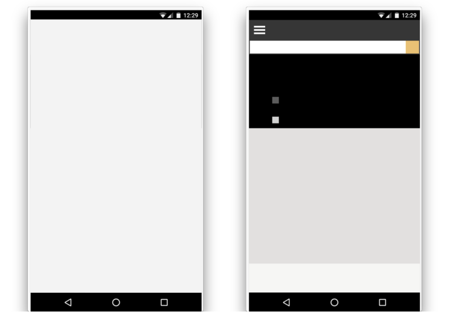
    <figcaption>
        Первая отрисовка и первая полезная отрисовка.
    </figcaption>
</figure>

В Chromium первая отрисовка контента срабатывает во время реальной отрисовки картинок, текста (кроме того, что ждёт загрузки шрифтов) или Canvas. В результате разница между первой отрисовкой и первой отрисовкой контента может занимать от миллисекунд до секунд. Потому иметь метрику которая отображает реальную отрисовку контента очень важно, [см. спецификацию](https://docs.google.com/document/d/1kKGZO3qlBBVOSZTf-T8BOMETzk3bY15SC-jsMJWv4IE/edit#).

### Чем она важна для разработчиков?

Если первая отрисовка контента занимает очень много времени то:

- Возможно, есть проблемы на уровне соединения;
- Ресурсы (например, сама HTML-страница) очень тяжелые и чтобы их доставить нужно время.

Чтобы уменьшить влияние этих факторов, читайте «[High Performance Browser Networking](https://hpbn.co/)» Ильи Григорика о сетевой производительности.

## Первая значимая отрисовка

First Meaningful Paint (FMP)

Это время, когда весь главный контент появился на странице. В результате пользователь может оценить: это то, что мне нужно?

<figure>
    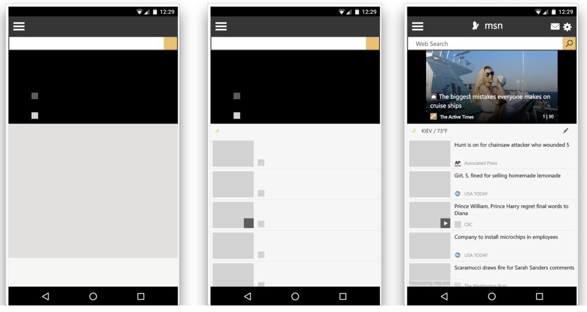
    <figcaption>
        Первая отрисовка, первая отрисовка контента, первая значимая отрисовка.
    </figcaption>
</figure>

Что считается главным контентом? Когда показаны:

- Шапка и текст блога;
- Содержимое для поисковиков;
- Критичные для интернет-магазинов картинки.

Не считаются главным контентом:

- Спиннер или что-то подобное;
- Невидимый текст или FOUC;
- Только навигация.

Первая значимая отрисовка — это отрисовка, которая следует за большим изменением раскладки. В реализации Chromium, отрисовка рассчитывается с использованием [LayoutAnalyzer](https://code.google.com/p/chromium/codesearch#chromium/src/third_party/WebKit/Source/core/layout/LayoutAnalyzer.h&sq=package:chromium&type=cs), который запоминает все изменения раскладки и находит время того изменения, которое повлияло больше остальных. Это и будет первая значимая отрисовка, [см. спецификацию](https://docs.google.com/document/d/1BR94tJdZLsin5poeet0XoTW60M0SjvOJQttKT-JK8HI/edit).

### Чем она важна для разработчиков?

Если главный контент не был отрисован долгое время, значит очень много ресурсов (картинки, стили, шрифты, скрипты) имеют высокий приоритет загрузки и в результате блокируют первую значимую отрисовку

Мне бы не хотелось копировать сюда все возможные техники, как этого можно избежать, потому вот вам ссылки:

- [Preload, Prefetch And Priorities in Chrome](https://medium.com/reloading/preload-prefetch-and-priorities-in-chrome-776165961bbf), [Addy Osmani](undefined)
- [Critical Request](https://css-tricks.com/the-critical-request/), [Ben Schwarz](undefined)
- [The State of the Web](https://medium.com/@fox/talk-the-state-of-the-web-3e12f8e413b3), [Karolina Szczur](undefined)
- [Practical Performance](https://youtu.be/6m_E-mC0y3Y), [Paul Irish](undefined) и [Sam Saccone](undefined)

## Визуально готов

Visually Ready

Метрика разрешает сказать что страничка выглядит «почти» загруженной, но браузер еще не закончил выполнять скрипты.

## Задержка ввода

Estimated Input Latency

Эта метрика определяет как плавно приложение реагирует на ввод пользователя. Но прежде чем рассказывать детали хотелось бы обратить внимание на терминологию.

### Длинные задачи

Под капотом браузер оборачивает пользовательский ввод в интерфейсные задачи и складывает в очередь главного потока. Помимо этого, браузер должен парсить, компилировать. выполнять скрипты на странице (задачи приложения). Если время для каждой задачи приложения занимает много времени то интерфейсные задачи могут быть заблокированы пока не будет завершена задача приложения. Как результат страница может отвечать на пользовательский ввод с задержкой и быть «непривлекательной».

Говоря простыми словами, длинные задачи — те, для которых парсинг, компиляция или выполнение скриптов занимает больше чем 50 миллисекунд, [см. спецификацию](https://w3c.github.io/longtasks/).

API для длинных задач реализован в Chrome и используется для расчета занятости главного потока.

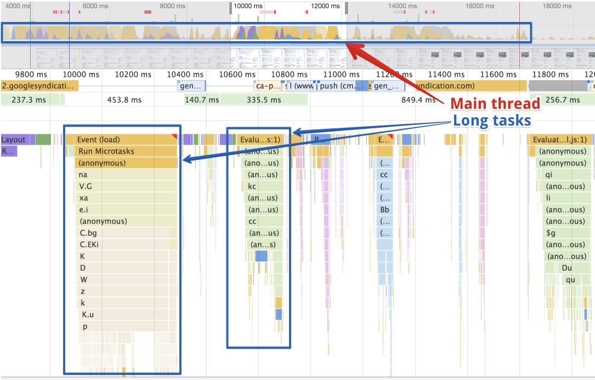

Возвращаясь к задержке ввода: пользователи ожидают, что страница будет реагировать без задержек, но если главный поток занят обработкой каждой длинной задачи, то станет заметно замедление реакции на ввод. Ощущения от работы с приложением довольно важны, и чтобы избавиться от таких проблем, я рекомендую прочитать «[Measure Performance with the RAIL Model](https://developers.google.com/web/fundamentals/performance/rail)».

## Первое взаимодействие

First Interactive

**Уже можно пользоваться?** Да, именно этот вопрос задает пользователь когда видит визуально готовую страницу и хочет с ней взаимодействовать. Первое взаимодействие считается случившимся если удовлетворены все условия:

- Произошла первая значимая отрисовка;
- Сработал [`DOMContentLoaded`](https://developer.mozilla.org/ru/docs/Web/Events/DOMContentLoaded);
- Страница визуально готова на 85%.

Метрика первого взаимодействия разделена на две метрики:

1. Время до первого взаимодействия (TTFI)
2. Время до первого последовательного взаимодействия (TTCI)

[См. спецификацию](https://docs.google.com/document/d/1GGiI9-7KeY3TPqS3YT271upUVimo-XiL5mwWorDUD4c/edit). Причины этого разделения:

- Чтобы определить минимальное взаимодействие, когда интерфейс отвечает неплохо но возможные небольшие задержки;
- Когда приложение или страница полностью интерактивны и строго отвечает условиям [RAIL](https://developers.google.com/web/fundamentals/performance/rail).

## Первое последовательное взаимодействие

Time to First Consistently Interactive (TTCI)

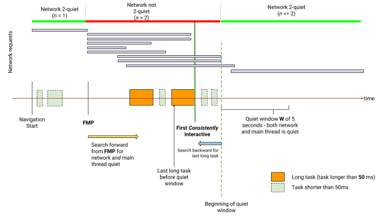

Используя реверсивный анализ, который подразумевает анализ трейса с конца, находится период, когда загрузка ресурсов неактивна на протяжении 5 секунд и в этот период отсутствуют длинные задачи. Такой период называется тихое окно (quiet window). Время после тихого окна и перед первой, с конца, длинной задачей будет временем до первого последовательного взаимодействия.

## Время до первого взаимодействия

Time to First Interactive (TTFI)

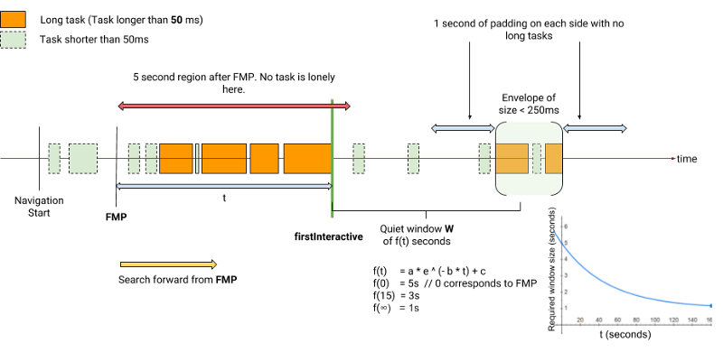

Определение этой метрики отличается от первого последовательного взаимодействия. Трейс анализируется со старта и до конца. После того, как произошла первая значимая отрисовка, находят тихое окно в 3 секунды. Этого достаточно, чтобы сказать, что страница интерактивна. Но в трейсе могут присутствовать одинокие задачи во время или после тихого окна.

Одинокие задачи выполняются далеко после первой значимой отрисовки и изолированы периодом выполнения в 250 мс (envelope size) и одну секунду тишины до и после этого периода. Иногда одинокие задачи, время которых занимает больше 250 мс, могут сильно влиять на быстродействие страницы. Например:

> A while ago I traced reddit and faced that detecting this kind of extensions are time wasting too.
> [Artem Denysov @denar90_](https://twitter.com/denar90_/status/883667901819039744)

### **Чем полезны эти метрики?**

Они полезны когда главный поток между метриками визуально готов и первое взаимодействие занимает достаточно долго:

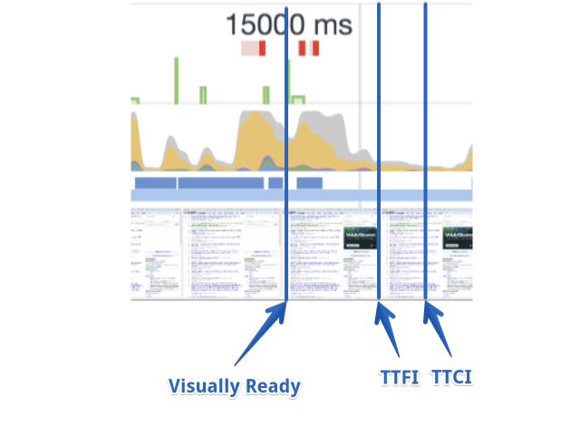

Это одно из сложных узких мест которые приходится исправлять. Для каждого случая оно индивидуально, потому я рекомендую почитать [руководства Google об этом](https://developers.google.com/web/tools/chrome-devtools/evaluate-performance/), чтобы понимать как избежать таких проблем.

## Визуально готово

Visually Complete

Метрика визуальной готовности рассчитывается с помощью скриншотов на странице и сравнивает скриншоты состояний с применением [алгоритма индекса скорости](https://sites.google.com/a/webpagetest.org/docs/using-webpagetest/metrics/speed-index).

Бывают случаи, когда метрику визуальной готовности измерить сложно, например если на странице есть «карусели» и другие подвижные элементы. Индекс скорости представляет медиану результатов метрик визуальной готовности. Чем меньше полученное значение тем лучше.

Визуально готово на 100% — это финальная точка, когда мы можем сказать, доволен пользователь процессом загрузки или нет.

## Выводы

Это были не все ПВМ, только самые важные из них. Ссылки на материалы, приведённые выше, могут вам пригодиться для более подробного изучения метрик. Но ещё хотелось бы поделиться инструментами, которые помогут получить эти метрики:

- [Web Pagetest](https://www.webpagetest.org/about)
- [Lighthouse](https://github.com/GoogleChrome/lighthouse/)
- [Pwmetrics](https://github.com/paulirish/pwmetrics)
- [Calibre](https://calibreapp.com/)
- [DevTools Timeline Viewer](https://chromedevtools.github.io/timeline-viewer/)

Если вы хотите делать замеры вручную, то это возможно с [API PerformanceObserver](https://developer.mozilla.org/en-US/docs/Web/API/PerformanceObserver). Небольшой пример из спецификации:

```js
const observer = new PerformanceObserver(list => {
    list
        .getEntries()
        // Get the values we are interested in
        .map(({ name, entryType, startTime, duration }) => {
    const obj = {
        'Duration': duration,
        'Entry Type': entryType,
        'Name': name,
        'Start Time': startTime,
    };
    return JSON.stringify(obj, null, 2);
})
// Display them to the console
.forEach(console.log);
    // maybe disconnect after processing the events.
    observer.disconnect();
});
// retrieve buffered events and subscribe to new events
// for Resource-Timing and User-Timing
observer.observe({
    entryTypes: ['resource', 'mark', 'measure'],
    buffered: true
});
```
