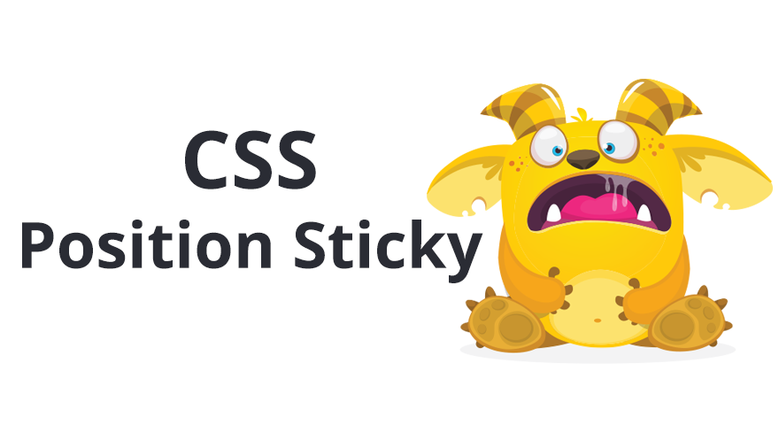
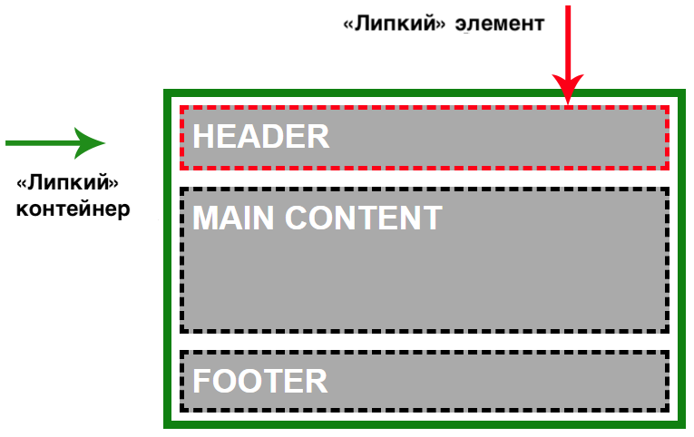
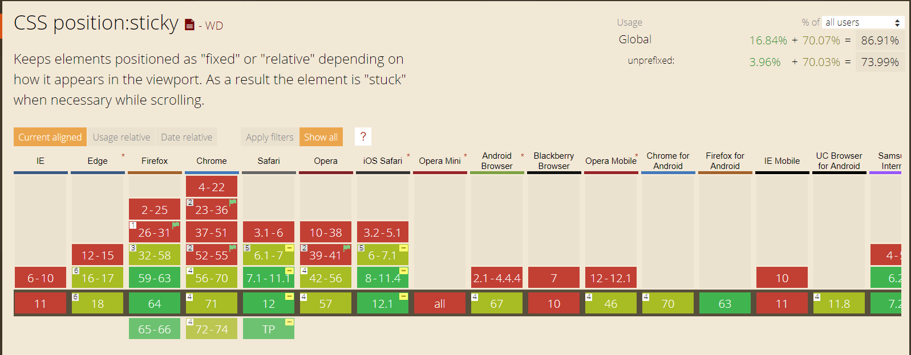

У `position: sticky` уже очень неплохая браузерная поддержка, но большинство разработчиков так и не используют это свойство.

У этого есть две основные причины: во-первых, браузерам потребовалось много времени на реализацию адекватной поддержки этого свойства. И все просто успели забыть о нём.

Во-вторых, многие разработчики до конца не понимают логику, по которой это свойство работает. И тут появляюсь я!



Я полагаю, что вы хорошо знакомы с позиционированием в CSS, но давайте кратко повторим основные моменты:

Ещё три года назад существовало четыре типа позиционирования: `static`, `relative`, `absolute` и `fixed`.

Основное различие между `static` и `relative`, `absolute` и `fixed` в том, какое место они занимают в потоке документа (DOM). Элементы с позицией `static` и `relative` сохраняют своё естественное положение в потоке документа, в то время как `absolute` и `fixed` «вырываются» из потока документа и становятся плавающими.

Новое значение `sticky` похоже на все предыдущие значения сразу. Я проиллюстрирую это чуть позже.

### Моё первое знакомство с «липким» позиционированием

Думаю, что большинство из вас игрались с «липким» позиционированием. Так было и у меня, пока в один момент я не осознал, что совсем не понимаю это свойство.

При первом знакомстве с `position: sticky` все быстро понимают, что элемент _залипает_, когда область просмотра достигает определённой позиции.

Пример:

    .some-component {
      position: sticky;
      top: 0;
    }

Проблема в том, что иногда это работает, а иногда нет. Когда всё работает, то элемент и правда залипает. Но когда не работает, то при прокрутке элемент перестаёт залипать. Как человеку, который живёт одним только CSS, мне было важно разобраться в сути проблемы. Именно поэтому я решил тщательно изучить **«липкое» позиционирование**.

### «Липкая» разведка

Во время своих экспериментов я заметил, что если элемент с `position: sticky` является единственным ребёнком своего родителя-обёртки, то этот «липкий» элемент не залипает.

    <!-- НЕ РАБОТАЕТ!!! -->
    <style>
      .sticky {
        position: sticky;
        top: 0;
      }
    </style>

    <div class="wrapper">
      <div class="sticky">
         Некий контент
      </div>
    </div>

Когда я добавлял больше элементов внутрь родителя-обёртки всё начинало работать как ожидалось.

**Почему так происходит?**
Причина кроется в том, что элемент с `position: sticky` может перемещаться только в пределах контейнера, в котором находится. А поскольку в моём случае он был единственным ребёнком, у него не было элементов-братьев, поверх которых он мог перемещаться.

### Как на самом деле работает position: sticky в CSS

«Липкое» позиционирование состоит из двух основных частей: **«липкого» элемента** и **«липкого» контейнера**.

**«Липкий» элемент** — это элемент, которому мы задали `position: sticky`. Элемент будет становиться плавающим, как только область видимости достигнет определённой позиции, например `top: 0px`.

Пример:

    .some-component {
      position: sticky;
      top: 0px;
    }

**«Липкий» контейнер** — это HTML-элемент, который оборачивает «липкий» элемент. Это максимальная область, в которой может перемещаться наш элемент.

**Когда вы задаёте элементу `position: sticky`, его родитель автоматически становится «липким» контейнером!**
Очень важно это запомнить! Контейнер будет являться областью видимости для элемента. «Липкий» элемент не может выйти за пределы своего «липкого» контейнера.

В этом причина, почему в предыдущем примере «липкий» элемент не залипал: он был единственным дочерним элементом контейнера.

Наглядный пример:



[Пример на CodePen:](https://codepen.io/elad2412/pen/QYLEdK)

<iframe src="https://codepen.io/elad2412/embed/preview/MZZVjw"></iframe>

### Понимание «липкого» поведения

Как я и говорил, `position: sticky` ведёт себя не так, как другие типы позиционирования. Но, с другой стороны, у них есть определённые сходства. Позвольте мне пояснить:

Относительное (или статичное) — «липкий» элемент похож на элемент со статическим или относительным позиционированием поскольку сохраняет свою естественную позицию в DOM (остаётся в потоке).
Фиксированное — когда элемент залипает, то ведёт себя как будто у него заданы стили `position: fixed`, остаётся на той же позиции в области видимости и вырывается из потока документа.
Абсолютное — в конце доступной для перемещений области элемент останавливается и остаётся поверх другого элемента. Точно также, как ведёт себя абсолютно спозиционированный элемент в контейнере с `position: relative`.

## Залипает внизу?!

В большинстве случаев вы будете использовать `position: sticky` чтобы прикрепить элемент к верхнему краю страницы. Что-то вроде этого:

    .component {
      position: sticky;
      top: 0;
    }

Именно для таких сценариев и был создан этот тип позиционирования. До его появления такой трюк приходилось проворачивать с помощью JavaScript.

Но вы с тем же успехом можете использовать это свойство для того, чтобы прилепить элемент к нижней границе. Это значит, что футеру можно задать «липкое» позиционирование и при скролле он всегда будет залипать у нижнего края. И когда мы дойдём до конца «липкого» контейнера наш элемент остановится на своей естественной позиции. Лучше использовать эту особенность для элементов, находящихся в самом конце контейнера.

Полный пример:

HTML

    <main class="main-container">
      <header class="main-header">HEADER</header>
      <div class="main-content">MAIN CONTENT</div>
      <footer class="main-footer">FOOTER</footer>
    </main>

CSS

    .main-footer {
      position: sticky;
      bottom: 0;
    }

[Живой пример на CodePen:](https://codepen.io/elad2412/pen/MZZVjw)

<iframe src="https://codepen.io/elad2412/embed/preview/MZZVjw"></iframe>

В реальной жизни я использую такое поведение для сводных таблиц. И, я думаю, с помощью этого приёма можно реализовать «липкую» навигацию в футере.

## Браузерная поддержка

- «Липкое» позиционирование поддерживается всеми основными современными браузерами. Исключение: старый-добрый IE.
- Для Safari потребуется префикс `-webkit`

```
position: -webkit-sticky; /* Safari */
position: sticky;
```


_Более 86% браузеров поддерживает sticky по данным [Can I Use](https://caniuse.com/#search=sticky)_

## В заключении

Вот и всё. Я надеюсь, что вам понравилась эта статья и мне удалось поделиться своим опытом. Я буду признателен, если вы поделитесь этим постом и поаплодируйте.

### Другие мои посты о CSS

- [New CSS Logical Properties!](https://medium.com/@elad/new-css-logical-properties-bc6945311ce7)

- [Becoming a CSS Grid Ninja!](https://medium.com/@elad/becoming-a-css-grid-ninja-f4c6db018cc1)

- [The New Responsive Design Evolution](https://medium.com/@elad/the-new-responsive-design-evolution-2bfb9b504a4e)

- [The Best Way to RTL Websites with SASS!](https://medium.com/@elad/the-best-way-to-rtl-your-website-with-sass-105e34a4298a)

- [CSS Architecture for Multiple Websites With SASS](https://medium.com/@elad/css-architecture-for-multiple-websites-with-sass-7e923fc53f7a)

### Кто я?

Меня зовут Элад Шехтер, я веб-разработчик, специализирующийся на дизайне и архитектуре CSS и HTML. Я работаю на [Investing.com](https://www.investing.com/).

Читать меня можно тут: [мой Твиттер,](https://twitter.com/eladsc) [Facebook](https://www.facebook.com/eladsc), [LinkedIn](https://www.linkedin.com/).


Вы можете найти меня в группах на Facebook:

- [CSS Masters](https://www.facebook.com/groups/css.master/)

- [CSS Masters Israel](https://www.facebook.com/groups/css.masters.israel/)
