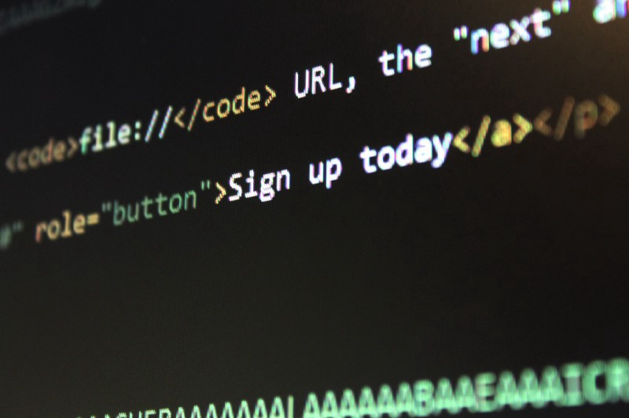
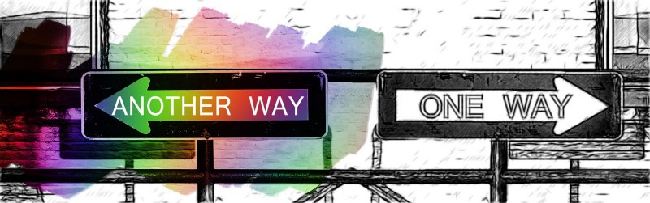

<figure>
    
    <figcaption>
        «Параолимпийские игры изменяют наше восприятие мира», Стивен Хокинг. То же можно сказать о доступности.
    </figcaption>
</figure>

Впервые я столкнулся с доступностью ещё в 2015, когда работал на американского розничного гиганта. Тогда компания получила огромный иск из-за сайта, который нарушал Закон об американцах-инвалидах (Americans with Disabilities Act, ADA). После этого мы с командой много работали над приведением сайта в соответствие с нормами ADA. Тогда я и познакомился со многими принципами доступности.

Однако в последующие годы, я постоянно нарушал эти принципы, хотя регулярно с ними сталкивался. Почему-то я не помнил о них во время кодинга. Не хотелось признавать, но я определённо не полностью их усвоил.

В конце концов я решил, что пора найти время и свести все эти принципы к простым и полезным правилам, которые просто держать в уме. Наконец, я сделал это, и с тех пор они неплохо для меня работают.

Эта статья состоит из двух частей: что такое доступность и три полезных правила доступности. В первой части я напомню, что такое доступность, и поделюсь своим опытом. Если хотите перейти к главному, то можете сразу начать со второй части.

## Что такое доступность?

Как я уже упоминал, в 2015 году моя компания получила иск за несоблюдение ADA.

[ADA](https://www.ada.gov) — закон о гражданских правах, который:

> Запрещает дискриминацию людей с инвалидностью во всех сферах жизни общества, включая работу, школы, транспорт и все публичные и частные места, которые доступны для широкого круга граждан.

Таким образом, ADA требует, чтобы фирмы, государственные и местные органы власти, а также некоммерческие организации предоставляли инвалидам доступ к сервисам наравне с трудоспособными гражданами. Аналогичным образом федеральные органы власти должны соблюдать федеральный закон, который называется [Section 508](https://www.section508.gov).

В контексте интернета все публичные сайты США, которые не соблюдают ADA или Section 508, исключают из числа своих посетителей большие группы пользователей с разной степенью нарушений.

С другой стороны, инклюзивный подход к созданию контента сайта, доступного для всех вне зависимости от их функциональных возможностей, называется [доступностью](http://en.wikipedia.org/wiki/Web_accessibility) или просто [a11y](https://a11yproject.com/posts/a11y-and-other-numeronyms/).

### От переводчика

В России доступность регулируется тремя документами:

1. Государственный стандарт [«ГОСТ Р 52872–2012 Интернет-ресурсы. Требования доступности для инвалидов по зрению»](http://docs.cntd.ru/document/1200103663). Был введён в 2014. Содержит рекомендации, а не жёсткие требования, как и любой другой ГОСТ.
2. [Приказ министерства связи и массовых коммуникаций России №483](https://minsvyaz.ru/ru/documents/4985/) «Об установлении порядка обеспечения условий доступности для инвалидов по зрению официальных сайтов федеральных органов государственной власти, органов государственной власти субъектов Российской Федерации и органов местного самоуправления в сети интернет». Принят в ноябре 2015.
3. [Федеральный закон № 419-ФЗ](http://www.consultant.ru/document/cons_doc_LAW_171577/) «О внесении изменений в отдельные законодательные акты Российской Федерации по вопросам социальной защиты инвалидов в связи с ратификацией конвенции о правах инвалидов». Вступил в силу в январе 2016.

### Кому нужна доступность?

Согласно [Всемирному докладу об инвалидности](http://www.who.int/disabilities/world_report/2011/report/en/) _(есть версия на русском — прим. редактора)_, опубликованному в 2011 году [Всемирной организацией здравоохранения (ВОЗ)](http://www.who.int), примерно 15% мирового населения живёт с той или иной формой инвалидности. Из них примерно 2–4 % испытывают серьёзные трудности с нормальным функционированием.

В превосходной статье замечательного Эдди Османи [«Доступные UI-компоненты для веба»](https://medium.com/@addyosmani/accessible-ui-components-for-the-web-39e727101a67), речь идёт о четырёх основных видах нарушений, которые рассматриваются в контексте доступности:

1. **Проблемы со зрением**: могут варьироваться от неспособности различать цвета до полного отсутствия зрения.
2. **Проблемы со слухом**: означают, что у пользователя проблемы с распознаванием звуков, которые звучат со страницы.
3. **Проблемы с мобильностью**: могут включать невозможность управлять мышью, клавиатурой или сенсорным экраном.
4. **Когнитивные проблемы**: означают, что пользователю могут потребоваться вспомогательные технологии для чтения текста, так что важно использовать альтернативы для текстовой информации.

Имейте в виду, что диапазон нарушений обширен. Это означает, что совсем не обязательно иметь серьёзные нарушения для того, чтобы нужна была доступность.

Если хотите больше об этом узнать, то рекомендую пройти на Udacity бесплатный курс [Web Accessibility](https://www.udacity.com/course/web-accessibility--ud891) от Google. Это видео из курса, которое рассказывает об этих видах нарушений:

<iframe width="560" height="315" src="https://www.youtube.com/embed/LdVlbO7_hz8" allowfullscreen></iframe>

### Хорошо, как обеспечить поддержку доступности?

К тому моменту, как мы получили иск в 2015, уже был проведён аудит, который выявил множество проблем с доступностью. Наша команда прошла однодневный курс по доступности, на котором мы узнали о [Web Content Accessibility Guidelines](https://www.w3.org/TR/WCAG21/) (сокращённо WCAG, сейчас в версии 2.1). Это руководство считается стандартом по доступности.

WCAG разработан группой [Web Accessibility Initiative](https://www.w3.org/WAI/) (WAI), которая входит в [W3C](https://www.w3.org). Она же разработала [Accessible Rich Internet Applications](https://www.w3.org/TR/wai-aria-1.1/) (WAI-ARIA или просто ARIA, актуальная версия 1.1). Это спецификация о том, как сделать страницы доступными путём добавления ролей и атрибутов ARIA в HTML-разметку.

Эти спецификации включают три уровня соответствия и приоритетов:

- A (можно поддерживать, низший).
- AA (следует поддерживать, средний).
- AAA (нужно поддерживать, наивысший).

Многие законы о доступности во всём мире основаны на критериях выполнения WCAG. Например, в январе 2017 года Section 508 был принят в соответствии с критерием AA WCAG 2.0.

_Прим. переводчика: Не исключение и «ГОСТ Р 52872–2012 Интернет-ресурсы. Требования доступности для инвалидов по зрению». Он разработан на основе WCAG._

Отлично обобщает все рекомендации [чек-лист WebAIM WCGA](https://webaim.org/standards/wcag/checklist). В нём для каждого критерия указан уровень соответствия.

### Насколько сложно выучить WCAG и WAI-ARIA?

Я хотел бы поделиться своим опытом в изучении доступности.

Хотя наш курс был довольно комплексным и его проводили чрезвычайно компетентные люди, мы просто сидели на нём часами и слушали детальные обзоры WCAG, пункт за пунктом. Презентация была огромной, и мы быстро переходили от одного слайда к другому. Если честно, она была перегружена, ведь WCAG нельзя назвать маленьким документом.

Короче говоря, мы были готовы решить много задач, и сразу же начали работать над исправлениями. Однако скоро это стало чем-то повторяющимся, механическим, просто ответом на стимулы. Мы тонули в море доступности.

Каждый знал как хорошо мы стали разбираться в доступности, поэтому никто не критиковал нашу работу. История с доступностью подходила к концу, и у нас появились новые приоритеты. Ожидалось, что мы вынесем многое из проделанной работы. Какое-то время так и было.

Со временем кто-то ушёл из команды, присоединились новые люди, а ещё появилось новое руководство. Рынок быстро развивается. Мы изменили наши приоритеты и командный дух, не говоря уже о том, что были заняты новыми задачами, которые отодвинули доступность на второй план.

Всё было настолько плохо, что шесть месяцев спустя у нас был новый аудит, который показал, что мы всё ещё сидим на огромной куче проблем с доступностью! Скоро мы осознали, что, хотя старые ошибки исправлены, у большей части нового кода — проблемы. Кроме того, мы никогда не включали доступность в наш регламент разработки и новые члены команды не обучались этому.

Вывод: мы просто позволили этому случиться. Доступность проигнорировали и её ключевые идеи не укоренились в нас.

Другими словами, мы оказались изолированы в пузыре наших представлений. Такое случается, когда мы решаем проблемы, руководствуясь своими предубеждениями, как отмечено в методологии [Microsoft Inclusive Design](https://www.microsoft.com/design/inclusive/).

### Оказываясь в изоляции

<figure>
    
    <figcaption>
        «Изоляция никогда не даёт двигаться вперёд по общему пути к свободе и справедливости», Десмонд Туту.
    </figcaption>
</figure>

Иногда вам нужно что-то испытать на собственном опыте, чтобы лучше это понять. Это и случилось со мной.

Я регулярно сдаю кровь на тромбоциты. У меня первая положительная группа крови, так что я могу помочь многим людям. Один раз в мою вену неправильно вставили катетер, и в этом месте на левой руке появился большой болезненный синяк.

Обычно сдача донорской крови занимает 10 минут, но забор тромбоцитов длится примерно 90. Так как моя рука была накрыта одеялами (потому что при заборе крови становится холодно), персоналу потребовалось около 20 минут, чтобы заметить, что моя вена повреждена.

После того, как это обнаружилось, сдачу тромбоцитов прервали. Мою левую руку раздуло, она стала очень чувствительной на несколько дней. Настолько, что я просто не мог заставить себя ей пользоваться.

После этого я пытался всё делать правой рукой. Неожиданно я заметил, что переключаться с клавиатуры на мышь неудобно, и мне было бы проще выполнять все задачи, используя что-то одного.

Вскоре я обнаружил, что использую только клавиатуру, и обратил внимание, как много сайтов просто не поддерживают её. Тогда до меня дошло: я столкнулся с изоляцией, хотя мои трудности были просто временными.

И тогда, именно в этот момент, я вспомнил как раньше работал над доступностью и не думал о поддержке клавиатуры. Блин!

### Уровни изоляции

В соответствии с [Microsoft’s Inclusive 101 Toolkit](https://www.microsoft.com/design/inclusive/) существует три уровня изоляции:

1. **Постоянная:** в ней оказываются люди с такими нарушениями как потеря конечностей, зрения, слуха или речи.
2. **Временная:** переживают те, у кого временная травма или трудности, с которыми они сталкиваются непродолжительное время. Например, они посмотрели на яркий свет, носят гипс или заказывают обед в другой стране.
3. **Ситуативная:** испытывают те, у кого резко изменились доступные возможности из-за специфичной обстановки, например, плохо слышно из-за шумной толпы, снижен обзор в машине или это молодые родители, у которых свободна только одна рука.

Мои временные ограничения раскрыли мне глаза, ведь я никогда не сталкивался с такой проблемой во время работы.

Тем не менее, я находился в невероятно выгодном положении, ведь мои трудности длились всего пару дней, тогда как миллионы людей во всём мире изолированы в течение всей жизни.

### Пишем код во имя перемен

Наконец, до меня дошло: реализация доступности вносит вклад в более инклюзивный мир! Вот несколько вещей, которые мы можем сделать как разработчики:

- Научиться писать код, поддерживающий доступность.
- Сделать доступность частью регламента разработки своей команды (так же, как вы планируете работать над юнит-тестами или документацией).
- Обсуждать доступность со своей командой, повышать осведомлённость её участников.
- Оценивать, пишет ли команда код, отвечающий требованиям доступности, и фиксировать проблемы, которые можно решить.
- Узнавать у бизнеса о требованиях, которые не отвечают принципам доступности или для которых нужны альтернативные решения.
- Делиться своим опытом и показывать другим как внедрить доступность в свою практику. Поэтому я и пишу эту статью :)

## Три полезных правила доступности

Это моя попытка свести доступность к трём простым правилам, которые вы запомните. Из этих правил можно вынести основные идеи и найти рекомендации по внедрению доступности в ваш проект.

**Внимание!** Эти правила не заменят необходимости изучения доступности. Они не исчерпывающие и станут только основой для того, что вы дальше будете изучать самостоятельно.

Повторюсь, чтобы научиться доступности, рекомендую ознакомиться на Udacity с бесплатным курсом [Web Accessibility](https://www.udacity.com/course/web-accessibility--ud891) от Google.

Итак, три полезных правила доступности. Надеюсь, вы сможете взять их на вооружение и использовать каждый день в своей работе:

**1. Настаивайте на семантических HTML-элементах, или DIY**

<figure>
    
    <figcaption>
        «Семантическай веб несложен по своей природе. Язык семантического веба, по своей сути, очень, очень простой. Речь идёт только о взаимосвязях между вещами». Тим Бернерс-Ли.
    </figcaption>
</figure>

Для меня это золотое правило доступности, для этого не нужно прикладывать никаких усилий.

**Семантические элементы** — те, которые передают определённое значение с помощью содержимого, которое они представляют. Например, `<button>`, `<input>`, `<a>`, `<h1>` и `
`. Они передают контекст агенту пользователя (браузеру, устройству или вспомогательной технологии вроде скринридера), поэтому он будет знать как взаимодействовать с такими элементами и чего от них ждать.

Они отличаются от семантически нейтральных элементов, таких как `
` и ``, или от презентационных, вроде `
` и `<big>`, которые не дают агентам представления о контексте.

В большинстве случаев семантические теги уже доступны (и дружественны для SEO). Это означает, что они отвечают многим принципам доступности прямо из коробки, например:

- Обрабатывают события фокуса при нажатии на клавишу Tab.
- Реагируют на события клавиатуры при нажатии на Enter, Esc, пробела, стрелок.
- Содержат семантическую информацию (имя, роль, состояние и значение), поэтому их распознают вспомогательные технологии.
- Их стили по умолчанию соответствуют минимальному контрасту.

Когда вы не используете семантические элементы, вам нужно вручную задать ему всё это, чтобы сделать доступным.

Значит вам потребуется:

- Добавить `tabindex="0"`, чтобы компонент стал частью естественного порядка табуляции, и использовать `focus()`, `display: none` или `aria-hidden` для того, чтобы избежать ловушек для фокуса. Про атрибут `tabindex` читайте в [«Using Tabindex](https://developers.google.com/web/fundamentals/accessibility/focus/using-tabindex)».
- Следить за событиями клавиатуры. Проверьте требования для ваших компонентов в [WAI-ARIA Design Patterns and Widgets](https://www.w3.org/TR/wai-aria-practices-1.1/#aria_ex).
- Использовать атрибут `role`, чтобы придать семантическое значение элементу и улучшить SEO-значимость. Узнайте обо всех возможных значениях `role` в [WAI-ARIA Categorization of Roles](https://www.w3.org/TR/wai-aria-1.1/#roles_categorization).
- Использовать атрибуты ARIA для описания состояний и значений. Узнайте, как используются атрибуты ARIA в [WAI-ARIA Definition of Roles](https://www.w3.org/TR/wai-aria-1.1/#role_definitions).
- Следить за контрастом и фокусом, особенно если используете `outline: 0` (что не рекомендуется).

Продолжаем разговор о семантических элементах. Вот ещё несколько вещей, которые нужно иметь в виду:

- Используйте [секционные элементы](https://www.w3.org/TR/wai-aria-practices/examples/landmarks/HTML5.html), чтобы разбить страницу на отдельные части. В противном случае нужно использовать роли ориентиров.
- Используйте [заголовки](https://developer.mozilla.org/en-US/docs/Web/HTML/Element/Heading_Elements), чтобы организовать текстовое содержимое. Так вы опишите связь между секциями и их иерархию. На заметку: на каждой странице может быть только один заголовок первого уровня `<h1>`.
- Используйте `<label for="…">` для элементов форм `<input>`, `<select>` и `<textarea>`.
- Выбирайте правильные инструменты, например, если это ссылка, то используйте `<a href="">` и никогда ``. А если это кнопка, то `<button>`, а не `<a href="#" onclick="…">`.

Что ж, семантические элементы кажутся более удобными, не так ли?

**2. Обеспечьте альтернативу для картинок, цветов, звуков и движения**

<figure>
    
    <figcaption>
        «Живопись — это просто другой способ ведения дневника», Пабло Пикассо.
    </figcaption>
</figure>

Вспомогательные технологии лучше всего работают с текстом. Когда вы используете что-то ещё, всегда добавляйте для них текстовые эквиваленты, например:

- Для картинок предусмотрите альтернативный текст. Вы можете использовать `alt="description" `для информативных изображений (которые несут смысл, как фотографии или иконки без текста) и `alt=""` для декоративных изображений (которые не несут смысловой нагрузки, например иконки внутри кнопок или дополненные текстом). Это особенно важно для ссылок в виде картинок.
- Продолжая про изображения: когда пользователи должны взаимодействовать с ними, добавьте звук или объясните, как обойтись без картинок. К примеру, можете взглянуть на [Google reCaptcha](https://www.google.com/recaptcha/intro/v3beta.html).
- Добавьте дополнительный индикатор для цветов, когда они обозначают состояние элементов форм, определённый элемент в выпадающем списке или другие элементы, которые надо выделить. Это может быть информационный текст, иконка или даже подсказка.
- Ещё про цвета. Проверьте контрастность текста и убедитесь, соответствует ли она стандарту. Например, уровень AA в WCAG требует минимум 4.5:1 для текста стандартного размера и 3:1 для большого.
- Для звуковых дорожек и видео добавьте подписи или расшифруйте их. Используйте визуальную альтернативу для звуков интерфейса.
- Если пользователь перемещается по странице, и мы ждём, что он совершит специфические жесты (например, движение мышью), сделайте их необязательными или предоставьте альтернативу таким взаимодействиям через клавиатуру.
- Для автоматических изменений на странице избегайте вспышек, миганий, смещения контента и новых окон. Когда это неизбежно, добавьте элементы управления, с помощью которых можно настроить время, сделать паузу или скрыть этот контент. Также используйте значение [aria-live](https://www.w3.org/TR/wai-aria-1.1/#aria-live), чтобы скринридер мог уведомлять пользователя о том, что действие прервано.

**3) Привыкните использовать инструменты для проверки доступности в повседневной работе**

<figure>
    
    <figcaption>
        «Мы формируем наши инструменты, а затем наши инструменты формируют нас», Маршалл Маклюэн.
    </figcaption>
</figure>

Это, пожалуй, самое полезное правило, которое поможет понять, что вы упустили что-то в двух предыдущих.

Я перечислю здесь несколько инструментов для проверки доступности. Попробуйте их использовать, запустите на своём сайте, посмотрите, что вы можете узнать благодаря им и попробуйте остановиться на каком-то из них. В основном встречается три типа инструментов, которые я рекомендую использовать:

**а. Для вашего регламента разработки**

- [Плагин](https://chrome.google.com/webstore/detail/lhdoppojpmngadmnindnejefpokejbdd)[ aXe](https://chrome.google.com/webstore/detail/lhdoppojpmngadmnindnejefpokejbdd)[ для Chrome](https://chrome.google.com/webstore/detail/lhdoppojpmngadmnindnejefpokejbdd): лёгкий в использовании плагин, проверяющий доступность. Находит проблемы и даёт рекомендации о том, как их исправить.
- [Wave](https://chrome.google.com/webstore/detail/wave-evaluation-tool/jbbplnpkjmmeebjpijfedlgcdilocofh?hl=en-US): инструмент для оценки доступности, который визуализирует доступность контента, добавляя иконки и индикаторы прямо на страницу.
- [Панель Accessibility, Audits и контрастность цветов в Chrome DevTools](https://developers.google.com/web/updates/2018/01/devtools#a11y): три инструмента, функции которых позволяют перемещаться по дереву доступности и видеть значения каждого элемента, определять контрастность текстовых элементов и выполнять полностраничный аудит доступности и других параметров.
- [Плагин NoCoffee](https://chrome.google.com/webstore/detail/nocoffee/jjeeggmbnhckmgdhmgdckeigabjfbddl)[ для Chrome](https://chrome.google.com/webstore/detail/nocoffee/jjeeggmbnhckmgdhmgdckeigabjfbddl): имитирует проблемы, с которыми сталкиваются люди c нарушениями зрения от лёгких до серьёзных.
- [Плагин High Contrast](https://chrome.google.com/webstore/detail/high-contrast/djcfdncoelnlbldjfhinnjlhdjlikmph)[ для Chrome](https://chrome.google.com/webstore/detail/high-contrast/djcfdncoelnlbldjfhinnjlhdjlikmph): позволяет просматривать страницы с цветовыми фильтрами с высокой контрастностью, упрощающими чтение текста. Так вы можете проверить, как выглядит ваш сайт для пользователей, которым нужен высокий уровень контраста.

**б. Для ручного тестирования с реальными скринридерами**

- [VoiceOver](https://www.apple.com/voiceover/info/guide/_1124.html) на Mac (встроен в macOS).
- [NVDA](https://www.nvaccess.org/download/) (бесплатный) и [JAWS](http://www.freedomscientific.com/Products/Blindness/JAWS?gclid=CjwKCAiA8vPUBRAyEiwA8F1oDDzHAjW9-GfooiNT3sCDcTg_7LNXvHz4XL7osONDyf3Y4k9KRbcuihoCKGMQAvD_BwE) (платный) на Windows.

**в. Для автоматического аудита**

- [Google Lighthouse](https://www.npmjs.com/package/lighthouse): автоматический аудитор, похож на панель Audits в DevTools.
- [aXe](https://www.npmjs.com/package/axe-core): автоматический сервис проверки правил доступности, тех же, что и в расширении aXe.
- [Pa11y Dashboard](https://github.com/pa11y/pa11y-dashboard): веб-интерфейс, который поможет отслеживать состояние доступности на сайтах.

## Читать дальше

- [508, ADA, WCAG: What’s the difference?](https://www.logicsolutions.com/508-ada-wcag-accessibility-difference/)
- [WHO’s World Report on Disability](http://www.who.int/disabilities/world_report/2011/report/en/)
- [Accessible UI Components For The Web](https://medium.com/@addyosmani/accessible-ui-components-for-the-web-39e727101a67)
- [Microsoft Inclusive Design](https://www.microsoft.com/design/inclusive/)
- [Web Accessibility free course on Udacity, by Google](https://www.udacity.com/course/web-accessibility--ud891)
- [WebAIM’s WCGA 2 checklist](https://webaim.org/standards/wcag/checklist)
- [Using Tabindex](https://developers.google.com/web/fundamentals/accessibility/focus/using-tabindex)
- [WAI-ARIA Design Patterns and Widgets](https://www.w3.org/TR/wai-aria-practices-1.1/#aria_ex)
- [WAI-ARIA Categorization of Roles](https://www.w3.org/TR/wai-aria-1.1/#roles_categorization)
- [HTML5 Sectioning Elements](https://www.w3.org/TR/wai-aria-practices/examples/landmarks/HTML5.html)
