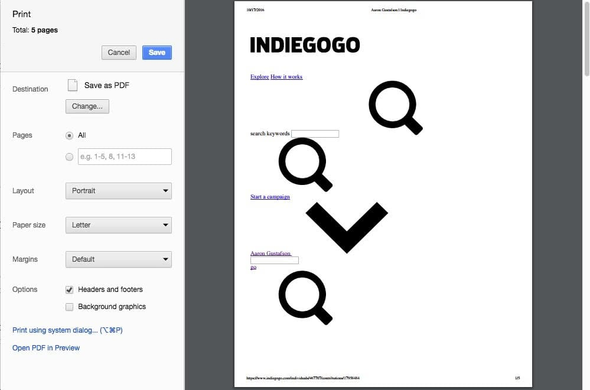
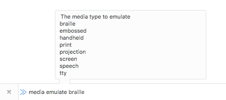

Небольшая коллекция полезных CSS-техник и короткое напоминание, что стили для печати всё ещё актуальны.

[Аарон Густафсон](https://twitter.com/AaronGustafson) опубликовал [твит](https://twitter.com/AaronGustafson/status/788073583528538112) про [Indiegogo](http://indiegogo.com), в котором он указал на то, что их страницы с деталями заказа невозможно использовать в печатном виде.

> Уважаемые [@Indiegogo](https://twitter.com/Indiegogo), пожалуйста, обратите внимание, как выглядит печатная версия вашей страницы с деталями заказа. Прямо сейчас она отстойная.
> [Аарон Густафсон](https://twitter.com/AaronGustafson/status/788073583528538112)



Когда я увидел этот твит, он меня поразил: я осознал, что прошло уже много времени с тех пор, как я оптимизировал страницу для печати или хотя бы думал её проверить. Может быть, это из-за постоянного изменения размеров наших браузеров и уверенности в безупречной работе наших сайтов во всех формах и размерах, или, может быть, просто потому, что я сам редко печатаю веб-страницы. Как бы то ни было, я совершенно забыл о стилях для печати, и это плохо.

Оптимизация веб-страниц для печати важна, потому что мы хотим, чтобы наши сайты были максимально доступными, на любом носителе. Мы [не должны делать предположения](https://adactio.com/journal/11409) о наших пользователях и их поведении. Люди по-прежнему печатают веб-страницы. Просто задумайтесь о статьях или постах в блогах, рецептах, контактной информации, картах или сайтах недвижимости. Кто-нибудь где-нибудь в конце концов попытается распечатать одну из ваших страниц.

> Я давно отказался от домашних принтеров, потому что они постоянно ломаются после десяти минут использования. Но не все такие как я, …
> [Хейдон Пикеринг (Инклюзивные дизайн-паттерны)](https://shop.smashingmagazine.com/products/inclusive-design-patterns)

Если вы такой же, как я, то надеюсь, этот пост освежит вашу память. Если вы ещё не оптимизировали страницы для печати с помощью CSS, советы ниже помогут вам начать.

## 1. Подключение стилей для печати

Лучший способ подключить стили для печати — объявить `@media`-выражение в вашем CSS.

```css
body {
    font-size: 18px;
}

@media print {
    /* стили для печати */

    body {
        font-size: 28px;
    }
}
```

Также вы можете подключать свои стили печати в HTML, но это создаст дополнительный запрос.

```html
<link media="print" href="print.css">
```

## 2. Тестирование

Вам не нужно распечатывать страницу каждый раз, когда вы вносите небольшие изменения. В зависимости от вашего браузера вы можете экспортировать страницу как PDF, открыть предварительный просмотр печати или даже отлаживать прямо в браузере.

**Обновление от 6 ноября 2019:** Вот [подробная статья](https://css-tricks.com/can-you-view-print-stylesheets-applied-directly-in-the-browser/) Криса Койера о том, как эмулировать стили для печати в 2019 году.

Для отладки стилей для печати в Firefox откройте _Developer Toolbar_ (<kbd>Shift F2</kbd> или Tools > Web Developer > Developer Toolbar) и введите _media emulate print_ в поле внизу окна браузера и нажмите <kbd>Enter</kbd>. Активная вкладка будет вести себя так, как будто для неё задан медиа-тип `print`, пока вы не закроете её или не обновите страницу.

**Обновление от 20 октября 2018:** начиная с Firefox 63+ этот способ не работает, так как Developer Toolbar был удалён.



В Chrome откройте инструменты разработчика (<kbd>Cmd Opt I</kbd> (macOS) или <kbd>Ctrl Shift I</kbd> (Windows) или View > Developer > Developer Tools, включите группу вкладок с консолью (<kbd>Esc</kbd>), откройте панель рендеринга, поставьте галочку возле _Emulate CSS Media_ и выберите _Print_.


## 3. Абсолютные единицы измерения

Абсолютные единицы измерения не подходят для экранов, но отлично подходят для печати. В стилях для печати абсолютно безопасно и даже рекомендуется использовать такие абсолютные [единицы измерения](https://developer.mozilla.org/en/docs/Web/CSS/length), как `cm`, `mm`, `in`, `pt` или `pc`.

```css
section {
    margin-bottom: 2cm;
}
```

## 4. Специфичные для страницы правила

Можно определять свойства, характерные для страницы, такие как размеры, ориентация и отступы, с помощью правила `@page`. Это очень удобно, если вы хотите, чтобы у всех страниц были определенные поля.

```css
@media print {
    @page {
        margin: 1cm;
    }
}
```

Правило `@page` — часть спецификации [Paged Media Module](https://drafts.csswg.org/css-page-3/), которая предлагает всевозможные крутые вещи, например, выбор первой печатаемой страницы или пустых страниц, позиционирование элементов в углах страницы и [многое другое](https://www.smashingmagazine.com/2015/01/designing-for-print-with-css/). Вы даже можете применять его для [создания книг](https://alistapart.com/article/building-books-with-css3).

## 5. Контроль разрывов страниц

Поскольку печатные страницы в отличие от веб-страниц не бесконечны, контент в конечном итоге прерывается на одной странице и продолжается на следующей странице. У нас есть пять свойств для контроля над тем, что происходит в этом случае.

### Разрыв страницы перед элементом

Если мы хотим, чтобы элемент всегда находился в начале страницы, мы можем форсировать разрыв страницы при помощи `page-break-before`.

```css
section {
    page-break-before: always;
}
```

[Свойство `page-break-before` на MDN](https://developer.mozilla.org/en/docs/Web/CSS/page-break-before).

### Разрыв страницы после элемента

`page-break-after` позволяет нам форсировать или избегать разрывов страницы после элемента.

```css
h2 {
    page-break-after: always;
}
```

[Свойство `page-break-after` на MDN](https://developer.mozilla.org/en/docs/Web/CSS/page-break-after).

### Разрыв страницы внутри элемента

Это свойство отлично подходит, если вы хотите избежать ситуации, когда элемент разрывается на две страницы.

```css
ul {
    page-break-inside: avoid;
}
```

[Свойство `page-break-inside` на MDN](https://developer.mozilla.org/en/docs/Web/CSS/page-break-inside).

### Вдовы и сироты

Иногда вы не хотите принудительно разрывать страницу, но, по крайней мере, хотите контролировать количество строк, отображаемых на текущей или следующей странице. Например, если последняя строка абзаца не помещается на текущей странице, последние две строки этого абзаца будут напечатаны на следующей странице, даже если не поместилась только последняя. Так происходит потому, что свойство, которое этим управляет, `widows` _(англ. «вдова» — прим. редактора),_ имеет значение по умолчанию `2`. Мы можем это изменить.

```css
p {
    widows: 4;
}
```

Если всё наоборот и на текущей странице помещается только одна строка, весь абзац будет напечатан на следующей странице. За такое поведение отвечает свойство `orphans` _(англ. «сирота» — прим. редактора),_ и его значение по умолчанию также равно `2`.

```css
p {
    orphans: 3;
}
```

Код выше означает, что на текущей странице должно поместиться как минимум 3 строки, чтобы абзац не переехал на следующую страницу целиком.

Вот готовый [CodePen](http://codepen.io/matuzo/pen/oYvBjN) с некоторыми примерами ([дебаг-версия](http://s.codepen.io/matuzo/debug/oYvBjN) для более лёгкого тестирования).

[Не все свойства и значения работают во всех браузерах](http://caniuse.com/#feat=css-page-break), вам нужно проверять ваши стили для печати в разных браузерах.

## 6. Сброс стилей

Имеет смысл сбрасывать некоторые стили, вроде `background-color`, `box-shadow` или `color` для печати.

Вот отрывок из [стилей для печати HTML5 Boilerplate](https://github.com/h5bp/html5-boilerplate/blob/master/dist/css/style.css):

```css
*,
*::before,
*::after {
    color: #000000 !important;
    text-shadow: none !important;
    background: #ffffff !important;
    box-shadow: none !important;
}
```

Стили для печати — одно из немногих исключений, где нормально использовать `!important` ;)

## 7. Удаление ненужного контента

Чтобы избегать бесполезной траты чернил, вам стоит прятать всякое нерелеватное, вроде презентанционных материалов, рекламы, навигации и прочего, при помощи `display: none`.

Возможно, вы даже захотите просто показать основной контент и спрятать всё остальное.

```css
body > *:not(main) {
    display: none;
}
```

## 8. Раскрытие ссылок

Напечатанные ссылки абсолютно бесполезны, если вы не знаете, куда они ведут.

Довольно легко показывать ссылки рядом с их содержимым.

```css
a[href]::after {
    content: ' (' attr(href) ')';
}
```

Конечно, такой код также покажет относительные ссылки, абсолютные ссылки на ваш сайт, якоря и т. д. Что-то вроде этого подойдёт лучше:

```css
a[href^='http']:not([href*='mywebsite.com'])::after {
    content: ' (' attr(href) ')';
}
```

Выглядит _интересно,_ я знаю. Эти строчки означают: покажи значение атрибута `href` рядом с каждой ссылкой, у которой есть атрибут `href`, который начинается с `http`, но не содержит `mywebsite.com` внутри.

## 9. Раскрытие аббревиатур

Аббревиатуры следует оборачивать в `<abbr>`, а их расшифровки следует добавлять в атрибут `title`. Имеет смысл показывать их на печатных страницах.

```css
abbr[title]::after {
    content: ' (' attr(title) ')';
}
```

## 10. Принудительная печать фона

Обычно браузеры не печатают фоновые цвета и фоновые изображения, если вы не попросите их это сделать, но иногда вы можете захотеть распечатать фон принудительно. Нестандартное [свойство `print-color-adjust`](https://developer.mozilla.org/de/docs/Web/CSS/-webkit-print-color-adjust) позволяет вам переопределить настройки по умолчанию для некоторых браузеров.

```css
header {
    -webkit-print-color-adjust: exact;
    print-color-adjust: exact;
}
```

## 11. Медиа-выражения

Если вы пишете свои медиавыражения так, как в примере ниже, имейте в виду, что CSS-правила в этом случае не будут применяться к стилям для печати.

```css
@media screen and (min-width: 48em) {
    /* только экран */
}
```

Вы спросите: «почему?» Потому что CSS-правила применяются только тогда, когда `min-width` равно `48em`, а тип носителя — `screen`. Без ключевого слова `screen` медиавыражение ограничивается только `min-width`.

```css
@media (min-width: 48em) {
    /* все типы носителей */
}
```

## 12. Печать карт

Текущие версии Firefox и Chrome могут печатать карты, а Safari, например, нет. Некоторые сервисы предоставляют [статические карты](http://staticmapmaker.com/), которые вы можете использовать вместо динамических.

```css
.map {
    width: 400px;
    height: 300px;
    background-image: url('http://maps.googleapis.com/maps/api/staticmap?center=Wien+Floridsdorf&zoom=13&scale=false&size=400x300&maptype=roadmap&format=png&visual_refresh=true');
    -webkit-print-color-adjust: exact;
    print-color-adjust: exact;
}
```

## 13. QR-коды

[В этой статье на Smashing Magazine](https://www.smashingmagazine.com/2013/03/tips-and-tricks-for-print-style-sheets/#print-qr-codes-for-easy-url-references) есть несколько хороших советов. Один из них — показывать QR-код на печатных страницах, чтобы пользователям не приходилось вводить полный адрес страницы для перехода к веб-версии.

## Бонус: Печать неоптимизированных страниц

Во время своего исследования я нашел отличный инструмент, который помогает печатать неоптимизированные страницы. С помощью [Printliminator](https://css-tricks.github.io/The-Printliminator/) вы можете удалять элементы, просто кликая по ним.

[Демо на YouTube](https://www.youtube.com/watch?v=Dt8hpqEIL1c) и сам проект на [Github](https://github.com/CSS-Tricks/The-Printliminator).

## Бонус 2: Gutenberg

Если вы фанат фреймворков, вам может понравиться [Gutenberg](https://github.com/BafS/Gutenberg), который немного упрощает подготовку страницы для печати.

## Бонус 3: Hartija

Есть ещё один фреймворк со стилями для печати от [Владимира Каррера](http://www.vcarrer.com/), который называется [Hartija](https://github.com/vladocar/Hartija---CSS-Print-Framework).

Вот и всё! Вот ссылка на мой [CodePen](http://codepen.io/matuzo/pen/oYvBjN?editors=1100) ([дебаг-версия](http://s.codepen.io/matuzo/debug/oYvBjN)), если вы хотите увидеть некоторые из этих вещей в действии. Надеюсь, вам понравилась эта статья.

P.S. Спасибо [Еве](https://twitter.com/eva_trostlos) за редактирование статьи и Марио за совет про Gutenberg.

### Источники

- [CSS Tips and Tricks: Add External URLs to Print Stylesheets](https://www.youtube.com/watch?v=jF-OQ-BrIAM)
- [Стили для печати в HTML5 Boilerplate](https://github.com/h5bp/html5-boilerplate/blob/master/dist/css/style.css#L195)
- [5 Powerful Tips And Tricks For Print Style Sheets](https://www.smashingmagazine.com/2013/03/tips-and-tricks-for-print-style-sheets/)
- [Faster way to develop and test print stylesheets (avoid print preview every time)?](http://stackoverflow.com/questions/9519556/faster-way-to-develop-and-test-print-stylesheets-avoid-print-preview-every-time)
- [Designing For Print With CSS](https://www.smashingmagazine.com/2015/01/designing-for-print-with-css/)
- [Gutenberg](https://github.com/BafS/Gutenberg)
- [Quick Trick: Responsive Print Media Queries](https://helloanselm.com/writings/unified-media-queries)
