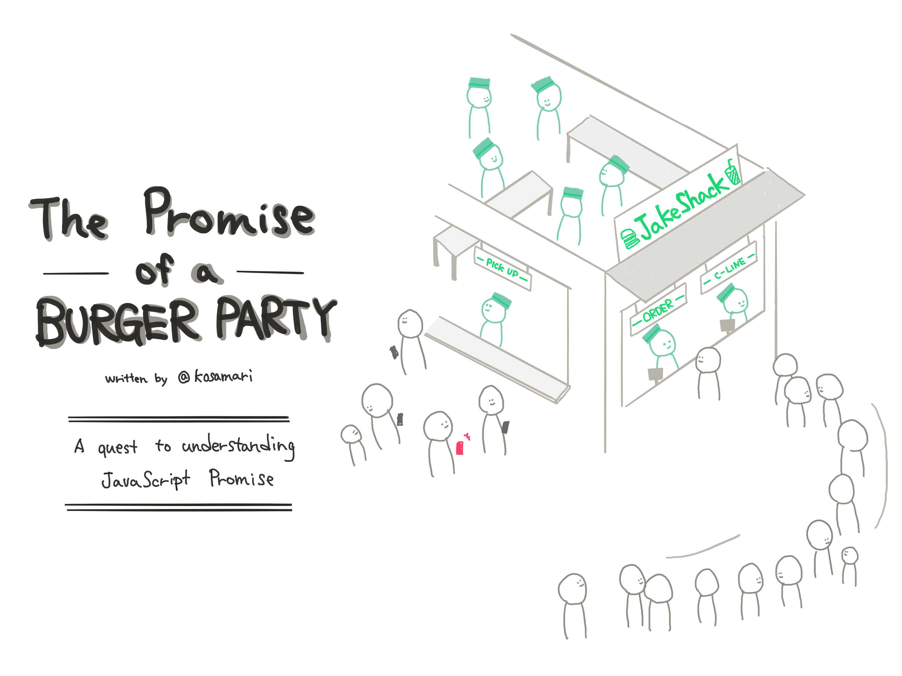
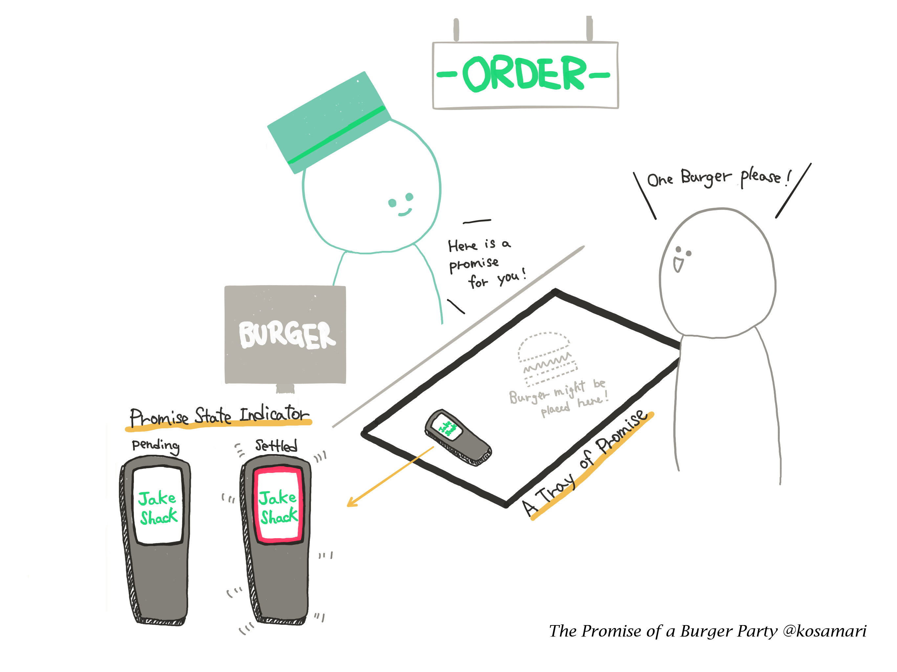
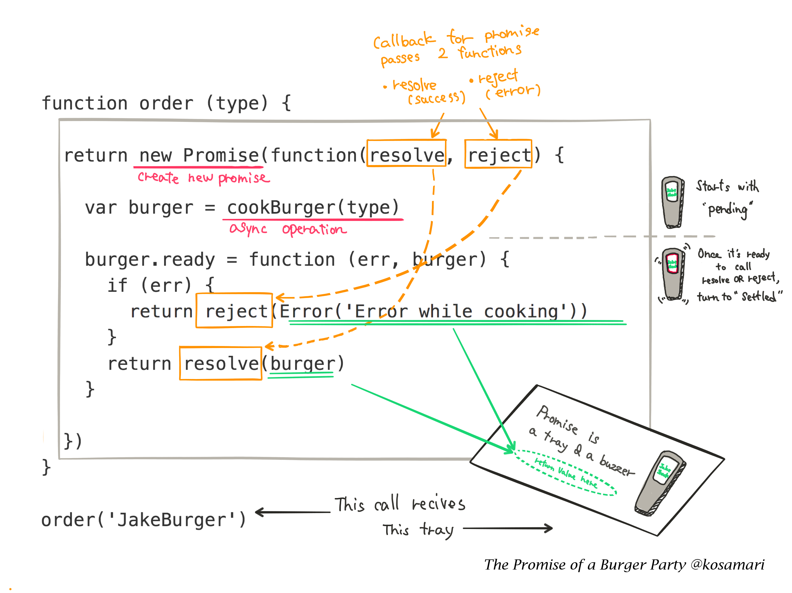
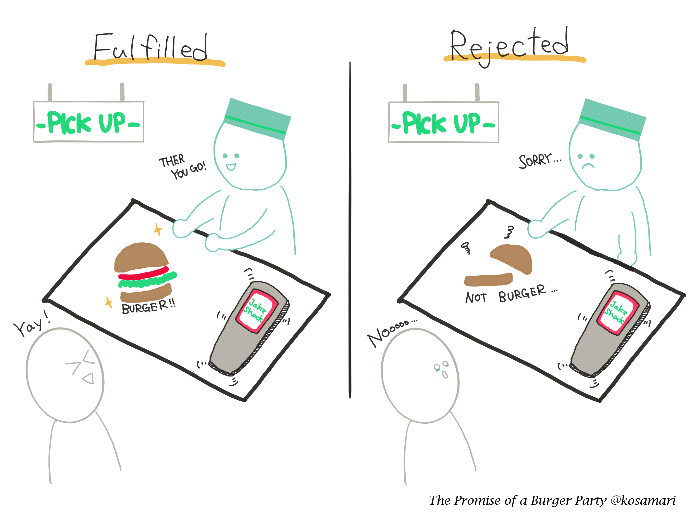
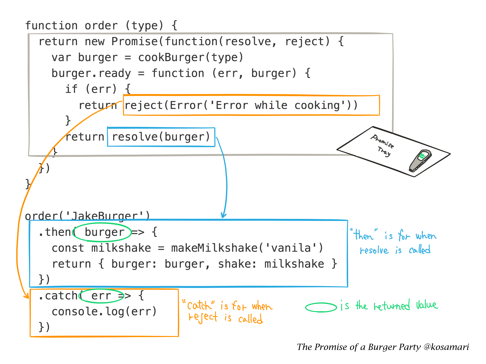
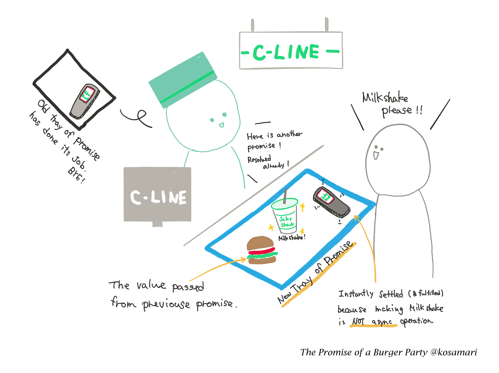
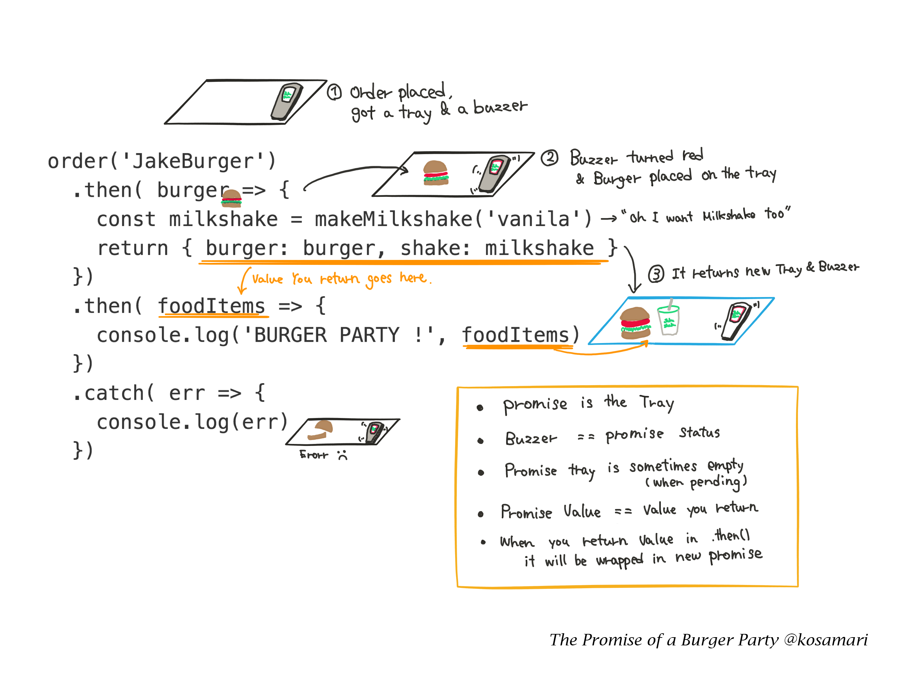

_Я написала этот пост как альтернативное введение в JavaScript-промисы. Я набросала его в своем блокноте во время чтения многочисленных статей на эту тему. Если вам нужно более глубокое руководство, в конце статьи есть список для дальнейшего изучения._

Пару недель назад я участвовала в обсуждении кое-какой функциональности на JavaScript. Она должна была работать асинхронно с использованием внешних данных. Я сказала: _«ладно, давайте используем `fetch()`… тогда в коде это… эм-м…»_ И пока я молчала, пытаясь вспомнить API Fetch, мой собеседник сказал: _«он возвращает промис»_. Я впала в ступор и ответила: _«честно говоря, я не очень понимаю, что это значит…»_

Я множество раз писала код на основе промисов, но в этот раз части почему-то не сложились в единую картину. Я поняла, что в действительности так и не разобралась с ними.

> I can not tell you how hard it is to explain this sentence - "It returns a Promise"
> but probably because I really don't understand Promise.
> [Mariko Kosaka @kosamari](https://twitter.com/kosamari/status/819972802220589056)

Если вы читаете меня [в Twitter](https://twitter.com/kosamari), то знаете, что я учусь на визуальных примерах: беру [объекты реального мира](https://twitter.com/kosamari/status/807303762188574720) как метафоры для сложных концепций в коде и изображаю их в виде [рисунков](https://twitter.com/kosamari/status/806941856777011200). Это позволяет мне совладать с двойным уровнем абстракции: языком программирования и английского как неродного языка. В общем, мне пришлось рисовать и в этот раз.



А вот пример кода, с которым мы будем иметь дело в этой истории.

```js
// Асинхронная операция
function cookBurger (type) { … }

// Обычная операция
function makeMilkshake (type) { … }

// Функция оформления заказа, возвращает промис
function order (type) {
    return new Promise(function(resolve, reject) {
        var burger = cookBurger(type);
        burger.ready = function (err, burger) {
            if (err) {
                return reject(Error('Error while cooking'));
            }
            return resolve(burger);
        }
    })
}

order('JakeBurger')
    .then( burger => {
        const milkshake = makeMilkshake('vanila');
        return { burger: burger, shake: milkshake }
    })
    .then( foodItems => {
        console.log('BURGER PARTY !', foodItems);
    })
    .catch( err => {
        console.log(err);
    });
```

### Устроим бургерную вечеринку!

Добро пожаловать в парк Промис-Сквер, место встречи всех любителей бургеров — кафе «ДжейкШак». Бургеры ДжейкШака очень популярны в окру́ге, но в кафе мало кассовых аппаратов, и очередь из посетителей никогда не убывает. Несмотря на это, на кухне хватает рук, чтобы принимать множество заказов одновременно.

_Если вы не в курсе: [кафе ShakeShak в парке Мэдисон-Сквер](http://www.foodsmackdown.com/2011/08/shake-shack-new-york-madison-square-park/) — это место в Нью-Йорке. Кафе действительно отличное, но туда всегда длинная очередь._

## Пообещать сделать

Чтобы принимать заказы максимально быстро, ДжейкШак использует систему сигнальных брелков. После оплаты заказа на кассе, сотрудник кафе выдает посетителю поднос и такой брелок.



Поднос — это промис, обещание ДжейкШака преподнести вам вкуснейший бургер, как только тот будет готов, а брелок — индикатор состояния вашего заказа. Брелок молчит? — значит заказ **в процессе** и лучшие повара трудятся над вашим бургером. Брелок загорелся красным и гудит? — значит заказ **приготовлен**.

Но есть небольшой нюанс: «приготовлен» — не значит «готов». Это значит, что работа поваров над заказом завершена, и они хотят, чтобы вы подошли и забрали его. Вы как клиент, вероятно, хотите просто получить свой бургер, но, в некоторых случаях, предпочтёте уйти. Дело ваше.

Давайте посмотрим, как это работает в коде. Когда вы вызываете функцию `order` (делаете заказ), она возвращает promise (выдает поднос и брелок как обещание выполнить заказ). Возвращённое значение (бургер) должен появиться на подносе, когда будет исполнен промис (данное вам обещание) и сработал колбэк. Подробнее об этом в следующем разделе!



## Добавьте обработчики промисов

Ой, кажется брелок загудел. Пойдемте за стойку попросим заказ. На этом этапе возможны два сценария развития событий.



**1. Заказ исполнен**

Ура-а! Ваш заказ готов, сотрудник кафе выносит свежий ароматный бургер. Обещание приготовить отличный бургер можно считать выполненным.

**2. Заказ отклонен**

Похоже, на кухне закончились котлеты. Обещание приготовить бургер выполнено не будет, оно отменяется. Не забудьте потребовать назад ваши деньги!

Посмотрим, как мы можем подготовиться к этим двум ситуациям в нашем коде.



_Метод `.then()` принимает вторым аргументом функцию. Эта функция является обработчиком для `reject`. Но для простоты в своем примере я буду использовать для обработки ошибок только `.catch()`. Если вы хотите узнать подробнее о разнице, вам может пригодиться [эта статья](https://developers.google.com/web/fundamentals/getting-started/primers/promises#error_handling)._

## Связываем промисы

Скажем, ваш заказ был успешно выполнен, но тут вы вспоминаете, что для фееричной бургерной вечеринки вам не хватает молочного коктейля… и вы идете в очередь «С» (специальная очередь за напитками, [существует в ShakeShack на самом деле](http://midtownlunch.com/2010/08/02/midtown-times-square-shake-shack-finally-add-a-c-line/), чтобы справиться с наплывом посетителей). При заказе коктейля кассир вручает вам другой поднос и еще один брелок. Так как напитки готовятся быстро, кассир сам выдает заказ, и не нужно ждать, когда загудит брелок (он уже гудит!).



Посмотрим, как это работает в коде. Чтобы соединить промисы в цепочку, достаточно всего лишь добавить еще один `then()`, он всегда возвращает промис. Просто запомните: каждый `.then()` возвращает поднос и брелок, а текущее возвращаемое значение передается аргументом в колбэк.



Теперь, когда у вас есть бургер и молочный коктейль, вы готовы к БУРГЕРНОЙ ВЕЧЕРИНКЕ 🎉!

## Другие трюки для вечеринок!

У промисов есть и другие методы, которые позволяют делать классные трюки.

`Promise.all()` создает промис, принимающий массив промисов (`items`). Он исполняется, когда исполнены все элементы массива, каждый из которых тоже промис. Представим это так: вы заказали для друзей пять бургеров, но не хотите все пять раз бегать к стойке. Достаточно сделать это один раз, когда все бургеры будут готовы. `Promise.all()` в этом случае — отличное решение.

`Promise.race()` похож на `Promise.all()`, но исполнится или будет отклонен, как только будет исполнен или отклонен один из элементов массива промисов. Своего рода принцип «хватай и беги». Скажем, вы очень голодны и заказали бургер, чизбургер и хотдог одновременно, но заберёте только то, что быстрее приготовят. Обратите внимание, в этом случае, если на кухне закончились котлеты для бургеров, и отказ по бургеру вернется первым, то и все прочие заказы будут отменены.

Помимо этого, в JavaScript-промисах есть много других вещей для изучения. Ниже ссылки на материалы, которые я для этого рекомендую:

- [Promise-cookbook](https://github.com/mattdesl/promise-cookbook/blob/master/README.md) — на английском, также доступна версия на китайском;
- [JavaScript Promises: an Introduction](https://developers.google.com/web/fundamentals/getting-started/primers/promises) — на английском;
- [JavaScript Promiseの本](http://azu.github.io/promises-book/) — на японском, китайском и корейском языках.

Спасибо Джейку Арчибальду и Нолану Лоусону за вычитку статьи и ценные советы, а также Крису Уитли за найденную в коде ошибку.
